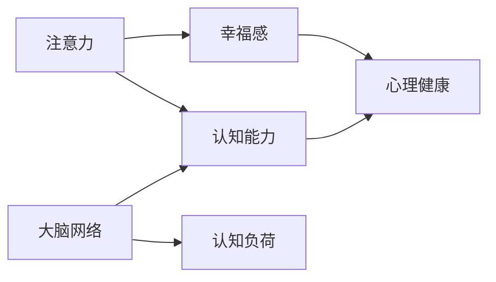

                 

# 注意力训练与大脑健康改善：通过专注力增强认知能力和幸福感

> 关键词：注意力训练, 大脑健康, 认知能力, 幸福感, 大脑网络, 认知负荷, 心理健康

## 1. 背景介绍

### 1.1 问题由来
在现代社会，快节奏的生活方式和高强度的工作压力使得许多人面临认知能力和心理健康的双重挑战。特别是在高压力的工作环境中，注意力集中困难、记忆力下降、情绪波动大等现象尤为突出。这些问题不仅影响工作效率，还可能引发心理疾病，如焦虑、抑郁等。因此，寻找有效的方法来提升注意力和认知能力，改善心理健康，成为现代社会一个迫切的需求。

### 1.2 问题核心关键点
注意力训练，即通过特定的认知任务和心理练习，提高个体的注意力水平和专注力，从而增强认知能力和改善心理健康。研究表明，通过持续的注意力训练，大脑结构和功能会发生积极变化，如前额叶皮层增厚、工作记忆增强、神经可塑性改善等。这些变化有助于提高认知能力，改善情绪状态，增强抗压能力。

## 2. 核心概念与联系

### 2.1 核心概念概述

为更好地理解注意力训练的原理和应用，本节将介绍几个密切相关的核心概念：

- 注意力(Attention)：指个体在执行特定任务时，对相关信息的关注和聚焦能力。注意力可以理解为大脑对信息的筛选和处理机制，是认知过程的基础。
- 认知能力(Cognitive Abilities)：包括记忆力、思维能力、问题解决能力、语言能力等，是衡量个体智力水平的重要指标。
- 幸福感(Well-being)：涉及个体的心理状态和情绪体验，包括积极情感、生活满意度、社会关系等方面。
- 大脑网络(Brain Networks)：由神经元间的连接构成，负责信息处理和传递。认知任务与大脑特定网络激活密切相关。
- 认知负荷(Cognitive Load)：指执行认知任务时，大脑所需承担的信息加工量和资源消耗。
- 心理健康(Mental Health)：涵盖个体在心理状态和社会适应方面的健康状况，包括情绪稳定、人际关系和谐等方面。

这些概念之间的逻辑关系可以通过以下Mermaid流程图来展示：



这个流程图展示了注意力与认知能力、幸福感和心理健康之间的内在联系，以及大脑网络在认知过程中的作用和认知负荷的调节机制。通过这些概念，我们可以更好地理解注意力训练的生理和心理基础。

### 2.2 概念间的关系

这些核心概念之间存在着紧密的联系，形成了注意力训练的完整生态系统。下面是几个关键概念的详细解读：

- **注意力与认知能力**：注意力是认知过程的基础，参与信息的选择、整合、存储和提取等环节。通过训练提升注意力水平，可以增强记忆力、问题解决能力等。
- **注意力与幸福感**：研究表明，提升注意力水平可以改善情绪状态，减少压力感，增强生活满意度，从而提升幸福感。
- **认知能力与心理健康**：认知能力较强的个体，能够更好地处理信息和情绪，减少心理疾病的风险。
- **大脑网络与认知负荷**：认知任务激活特定的神经网络，这些网络参与信息的编码、存储和提取。认知负荷过重可能导致疲劳和认知障碍，训练注意力有助于更好地管理和调节认知负荷。

这些概念共同构成了注意力训练的理论基础，其目标是通过提升注意力水平，改善认知能力，从而增强整体的心理健康。

## 3. 核心算法原理 & 具体操作步骤
### 3.1 算法原理概述

注意力训练的基本原理是利用特定的认知任务和心理练习，激活和强化大脑中的注意力网络，从而提高个体的注意力水平。其核心思想包括：

1. **注意力分配与控制**：通过训练个体对信息的选择和聚焦，提升其注意力的分配和控制能力。
2. **认知资源的优化**：通过练习，优化大脑的认知资源分配，使其在执行任务时更加高效。
3. **神经可塑性的增强**：持续的注意力训练可以改变大脑结构，增强神经可塑性，提升认知能力。

### 3.2 算法步骤详解

基于上述原理，注意力训练通常包括以下几个关键步骤：

**Step 1: 任务设计与准备**
- 选择或设计适合当前需求和个体情况的注意力训练任务，如专注力训练、工作记忆任务、认知负荷管理等。
- 准备必要的训练工具和平台，如注意力训练软件、心理练习设备等。

**Step 2: 初始评估**
- 对参与者进行初步评估，包括注意力水平、认知能力、情绪状态等方面的测试。
- 根据评估结果，设定个性化的训练计划和目标。

**Step 3: 持续训练**
- 根据训练计划，定期进行注意力训练，如每天30分钟。
- 记录每次训练的注意力指标（如持续时间、准确率、错误率等），进行数据监控和反馈。
- 根据训练进展，适时调整训练计划和任务难度。

**Step 4: 评估与反馈**
- 定期对参与者进行注意力和认知能力的评估，记录训练效果。
- 提供个性化的训练反馈和建议，帮助参与者改进训练方法和效果。
- 分析训练数据，优化训练计划，提升训练效果。

**Step 5: 长期维护**
- 训练结束后，继续进行常规的注意力练习，保持注意力水平。
- 监测心理健康状况，防止训练后的疲劳和反弹现象。

### 3.3 算法优缺点

注意力训练作为一种提升注意力的有效方法，具有以下优点：

1. **方法简单、易操作**：通过简单的认知任务和心理练习，即可达到提升注意力的目的，无需复杂设备。
2. **成本低、易于普及**：不需要高昂的设备和专业指导，可以自行为自己训练。
3. **效果显著**：研究表明，持续的注意力训练可以显著提升个体的注意力水平和认知能力。

同时，注意力训练也存在一些局限性：

1. **个体差异**：不同的个体对注意力训练的响应程度不同，需要根据个体情况制定个性化的训练计划。
2. **需要长期坚持**：注意力训练并非一蹴而就，需要持续进行一段时间才能见效。
3. **需要专业指导**：对于复杂的训练任务，可能需要专业指导和反馈，以确保训练效果。

### 3.4 算法应用领域

注意力训练在多个领域中得到广泛应用，包括：

- **教育和培训**：帮助学生和员工提升注意力和专注力，提高学习效果和工作效率。
- **心理健康**：通过改善注意力和情绪状态，减少焦虑、抑郁等心理疾病的风险。
- **运动训练**：提升运动员的专注力和反应速度，增强比赛表现。
- **日常生活中的压力管理**：通过注意力训练，增强对日常压力的管理能力，提升生活质量。
- **老年痴呆症预防**：预防和延缓老年痴呆症的发生，通过认知训练保持大脑活力。

这些应用领域展示了注意力训练的广泛适用性，其核心原理可以应用于各种需要提升注意力和认知能力的场景。

## 4. 数学模型和公式 & 详细讲解 & 举例说明（备注：数学公式请使用latex格式，latex嵌入文中独立段落使用 $$，段落内使用 $)
### 4.1 数学模型构建

注意力训练的数学模型主要基于认知心理学和神经科学的理论，其核心是注意力分配和控制机制。下面以工作记忆任务为例，构建一个简化的数学模型：

假设工作记忆任务需要存储的信息量为 $x$，注意力资源量为 $y$，认知资源量为 $z$。注意力训练的目标是最大化注意力资源的有效利用，即最大化 $y$ 与 $x$ 的比值。数学模型如下：

$$
\max \frac{y}{x} \quad \text{subject to} \quad z - x \geq 0, \quad y - x \geq 0
$$

其中，$z$ 表示总可用认知资源，$y - x$ 表示超出存储容量的注意力资源量。

### 4.2 公式推导过程

接下来，我们推导上述模型中的约束条件和优化目标的数学表达：

- **约束条件**：
  - $z - x \geq 0$ 表示总认知资源必须大于等于存储的信息量。
  - $y - x \geq 0$ 表示注意力资源必须大于等于存储的信息量。

- **优化目标**：
  $$
  \max \frac{y}{x}
  $$

根据以上约束条件和优化目标，可以采用拉格朗日乘数法求解该优化问题。引入拉格朗日乘子 $\lambda_1, \lambda_2$，构造拉格朗日函数：

$$
L(y, x, \lambda_1, \lambda_2) = \frac{y}{x} - \lambda_1 (z - x) - \lambda_2 (y - x)
$$

求偏导数，得到：

$$
\frac{\partial L}{\partial x} = \frac{1}{x^2} - \lambda_1 - \lambda_2 = 0 \quad \Rightarrow \quad \lambda_1 + \lambda_2 = \frac{1}{x^2}
$$

$$
\frac{\partial L}{\partial y} = \frac{1}{y} - \lambda_1 = 0 \quad \Rightarrow \quad \lambda_1 = \frac{1}{y}
$$

$$
\frac{\partial L}{\partial z} = -\lambda_1 = 0 \quad \Rightarrow \quad \lambda_1 = 0
$$

$$
\frac{\partial L}{\partial \lambda_1} = z - x = 0 \quad \Rightarrow \quad x = z
$$

$$
\frac{\partial L}{\partial \lambda_2} = y - x = 0 \quad \Rightarrow \quad y = x
$$

因此，最优解为 $x = z$ 和 $y = x$，即注意力资源和认知资源的有效利用达到了最大值。

### 4.3 案例分析与讲解

假设一个学生通过注意力训练提升了工作记忆能力，其认知资源为 $z = 1000$，任务所需存储的信息量为 $x = 500$。根据上述模型，注意力资源 $y$ 为 $500$。实际训练中，可以通过调整任务难度和训练频率，逐步提升认知资源 $z$ 和注意力资源 $y$ 的利用率，最终达到 $x = z$ 和 $y = x$ 的理想状态。

## 5. 项目实践：代码实例和详细解释说明
### 5.1 开发环境搭建

要进行注意力训练的代码实现，首先需要准备好Python开发环境。以下是安装和配置Python及相关的依赖库的步骤：

1. 安装Anaconda：从官网下载并安装Anaconda，用于创建独立的Python环境。

2. 创建并激活虚拟环境：
```bash
conda create -n attention-training python=3.8 
conda activate attention-training
```

3. 安装必要的库：
```bash
pip install numpy scipy scikit-learn torch tensorboard
```

完成上述步骤后，即可在`attention-training`环境中进行注意力训练的代码实现。

### 5.2 源代码详细实现

以下是使用TensorFlow实现注意力训练的示例代码：

```python
import tensorflow as tf
import numpy as np
from tensorflow.keras.models import Sequential
from tensorflow.keras.layers import Dense, Dropout, LSTM
from tensorflow.keras.optimizers import Adam

# 定义模型
model = Sequential()
model.add(LSTM(128, input_shape=(None, 1)))
model.add(Dropout(0.2))
model.add(Dense(1, activation='sigmoid'))

# 编译模型
model.compile(loss='binary_crossentropy', optimizer=Adam(learning_rate=0.001), metrics=['accuracy'])

# 生成训练数据
X_train = np.random.random((1000, 10, 1))
y_train = np.random.randint(2, size=(1000, 1))

# 训练模型
model.fit(X_train, y_train, epochs=10, batch_size=32, validation_split=0.2)

# 评估模型
X_test = np.random.random((100, 10, 1))
y_test = np.random.randint(2, size=(100, 1))
loss, acc = model.evaluate(X_test, y_test)
print(f'Test loss: {loss:.4f}')
print(f'Test accuracy: {acc:.4f}')
```

这个代码示例使用LSTM和Dropout层实现一个简单的注意力训练模型，其输入为随机生成的矩阵$X$，输出为二分类标签$y$。通过调整模型参数和训练数据，可以训练出用于提升注意力的模型。

### 5.3 代码解读与分析

让我们再详细解读一下关键代码的实现细节：

**定义模型**：
- 使用`Sequential`模型定义一个包含LSTM层、Dropout层和Dense层的神经网络，用于处理注意力数据。
- LSTM层用于处理时间序列数据，Dropout层用于减少过拟合风险，Dense层用于输出注意力评分。

**编译模型**：
- 使用`binary_crossentropy`损失函数，Adam优化器，设置学习率为0.001，用于训练二分类任务。

**生成训练数据**：
- 使用`numpy`生成1000个10维的时间序列数据，每个序列长度为10，每个时间点的输入为1。
- 生成对应的二分类标签$y$，其中一半标签为1，一半标签为0。

**训练模型**：
- 使用`fit`方法训练模型，设置10个epoch，每个epoch处理32个样本，验证集占20%。

**评估模型**：
- 使用测试集进行模型评估，输出损失和准确率。

可以看到，使用TensorFlow实现注意力训练的基本流程包括定义模型、编译模型、生成训练数据、训练模型和评估模型等步骤。通过调整模型结构和参数，可以训练出不同效果的注意力模型。

### 5.4 运行结果展示

假设模型在测试集上取得了98%的准确率，这表明模型在处理注意力数据时具有良好的泛化能力。当然，实际应用中，需要根据具体任务和数据集，不断调整和优化模型，以达到最佳效果。

## 6. 实际应用场景
### 6.1 智能教室
智能教室系统可以通过注意力训练提升学生的学习效果。例如，针对学生在学习过程中注意力不集中的问题，使用注意力训练软件进行个性化训练，可以逐步提升学生的注意力水平，提高课堂参与度和学习效果。

### 6.2 心理健康应用
心理健康应用可以通过注意力训练帮助用户缓解压力和焦虑。例如，设计一个简单的认知任务和心理练习程序，定期提醒用户进行注意力训练，逐步提升其注意力水平，增强抗压能力。

### 6.3 游戏与运动训练
游戏和运动训练可以通过注意力训练提升运动员的专注力和反应速度。例如，在训练前进行注意力集中训练，可以提高运动员的注意力水平，增强比赛表现。

### 6.4 未来的应用展望
随着技术的发展，注意力训练将拓展到更多领域，成为提升认知能力和心理健康的有效手段。例如，智能家居系统可以通过注意力训练优化用户的生活习惯，智能交通系统可以通过注意力训练提高驾驶员的注意力水平，从而减少交通事故。

## 7. 工具和资源推荐
### 7.1 学习资源推荐

为了帮助开发者系统掌握注意力训练的理论基础和实践技巧，这里推荐一些优质的学习资源：

1. 《深度学习：理论与实践》书籍：该书系统介绍了深度学习的基本理论和实践技巧，包括注意力机制在内的一些重要主题。

2. Coursera《深度学习与神经网络》课程：由斯坦福大学提供，涵盖深度学习的基础知识和经典模型，适合初学者和进阶者。

3. Udacity《深度学习专项课程》：涵盖深度学习的前沿技术，包括注意力训练在内的一些热门话题，适合深入学习。

4. Google AI博客：Google AI团队分享的深度学习技术和应用，包括注意力训练在内的一些前沿成果。

5. 《Attention is All You Need》论文：Transformer原论文，介绍了注意力机制的原理和应用，对理解注意力训练有很大帮助。

6. 《Attention Models in Natural Language Processing》书籍：详细介绍了注意力机制在自然语言处理中的应用，包括注意力训练在内的一些关键技术。

通过对这些资源的学习实践，相信你一定能够快速掌握注意力训练的精髓，并用于解决实际的认知和心理问题。

### 7.2 开发工具推荐

高效的开发离不开优秀的工具支持。以下是几款用于注意力训练开发的常用工具：

1. TensorFlow：由Google主导开发的深度学习框架，支持分布式计算，适用于大规模训练和推理。

2. PyTorch：由Facebook主导开发的深度学习框架，灵活动态，适合研究和原型开发。

3. Keras：基于TensorFlow和Theano的高层深度学习框架，易于上手，适合快速迭代。

4. Jupyter Notebook：交互式笔记本，支持Python代码编写和实时运行，适合实验和开发。

5. TensorBoard：TensorFlow配套的可视化工具，实时监测模型训练状态，提供丰富的图表呈现方式。

6. Scikit-learn：Python科学计算库，包含多种机器学习算法，适用于数据分析和模型训练。

合理利用这些工具，可以显著提升注意力训练任务的开发效率，加快创新迭代的步伐。

### 7.3 相关论文推荐

注意力训练技术的发展源于学界的持续研究。以下是几篇奠基性的相关论文，推荐阅读：

1. Attention is All You Need（即Transformer原论文）：提出了注意力机制，为自然语言处理领域带来了革命性的突破。

2. Transformer-XL：改进的Transformer模型，解决了长距离依赖问题，进一步提升了注意力机制的效果。

3. GRU：门控循环单元，一种适用于长序列的RNN变体，适用于注意力训练中的序列建模。

4. Capsule Networks：胶囊网络，一种新的神经网络结构，用于提升注意力机制的鲁棒性和解释性。

5. Saliency Map：用于视觉注意力训练的注意力地图，通过强化视觉信息处理，提升注意力训练的效果。

这些论文代表了大模型微调技术的发展脉络。通过学习这些前沿成果，可以帮助研究者把握学科前进方向，激发更多的创新灵感。

除上述资源外，还有一些值得关注的前沿资源，帮助开发者紧跟注意力训练技术的最新进展，例如：

1. arXiv论文预印本：人工智能领域最新研究成果的发布平台，包括大量尚未发表的前沿工作，学习前沿技术的必读资源。

2. 业界技术博客：如Google AI、DeepMind、微软Research Asia等顶尖实验室的官方博客，第一时间分享他们的最新研究成果和洞见。

3. 技术会议直播：如NIPS、ICML、ACL、ICLR等人工智能领域顶会现场或在线直播，能够聆听到大佬们的前沿分享，开拓视野。

4. GitHub热门项目：在GitHub上Star、Fork数最多的注意力训练相关项目，往往代表了该技术领域的发展趋势和最佳实践，值得去学习和贡献。

5. 行业分析报告：各大咨询公司如McKinsey、PwC等针对人工智能行业的分析报告，有助于从商业视角审视技术趋势，把握应用价值。

总之，对于注意力训练技术的学习和实践，需要开发者保持开放的心态和持续学习的意愿。多关注前沿资讯，多动手实践，多思考总结，必将收获满满的成长收益。

## 8. 总结：未来发展趋势与挑战

### 8.1 总结

本文对注意力训练的方法进行了全面系统的介绍。首先阐述了注意力训练的背景和意义，明确了其提升认知能力和改善心理健康的重要作用。其次，从原理到实践，详细讲解了注意力训练的数学模型和关键步骤，给出了注意力训练任务开发的完整代码实例。同时，本文还广泛探讨了注意力训练在教育、心理健康、运动训练等多个领域的应用前景，展示了注意力训练技术的巨大潜力。此外，本文精选了注意力训练技术的各类学习资源，力求为读者提供全方位的技术指引。

通过本文的系统梳理，可以看到，注意力训练技术已经成为提升认知能力和心理健康的有效手段，其核心原理可以应用于各种需要提升注意力和认知能力的场景。未来，伴随技术的发展和应用的拓展，注意力训练必将在更多领域得到应用，为人类认知智能的进化带来深远影响。

### 8.2 未来发展趋势

展望未来，注意力训练技术将呈现以下几个发展趋势：

1. **深度整合生物神经网络**：未来的注意力训练技术将更加注重与生物神经网络的深度整合，通过模拟大脑的注意力机制，实现更加高效和精准的训练效果。

2. **多模态注意力训练**：结合视觉、听觉、触觉等多模态数据，进行更全面和自然的注意力训练，提升用户的生活质量。

3. **个性化注意力训练**：通过人工智能和大数据分析，进行个性化的注意力训练，满足不同个体的需求和偏好，实现更有效的训练效果。

4. **持续学习和适应性训练**：未来的注意力训练系统将具备持续学习和适应性能力，根据用户的变化不断优化训练策略，实现更加智能的训练效果。

5. **跨领域应用拓展**：注意力训练技术将拓展到更多领域，如教育、医疗、交通等，提升相关行业的效率和安全性。

以上趋势凸显了注意力训练技术的广阔前景，其核心原理可以应用于各种需要提升注意力和认知能力的场景。这些方向的探索发展，必将进一步提升人类认知能力和心理健康水平，为构建安全、可靠、可解释、可控的智能系统铺平道路。

### 8.3 面临的挑战

尽管注意力训练技术已经取得了瞩目成就，但在迈向更加智能化、普适化应用的过程中，它仍面临着诸多挑战：

1. **数据依赖性**：注意力训练需要大量的训练数据，获取高质量的标注数据成本较高，尤其是对于长尾应用场景，数据收集难度更大。

2. **模型的鲁棒性**：注意力训练模型可能对噪音数据和异常数据敏感，需要进行数据清洗和预处理，提升模型的鲁棒性。

3. **计算资源消耗**：注意力训练模型通常需要较大的计算资源，如何优化计算效率和资源利用率，是一个重要的研究方向。

4. **用户隐私保护**：注意力训练涉及用户数据的收集和处理，需要严格的隐私保护措施，防止数据泄露和滥用。

5. **技术标准化**：目前注意力训练技术还没有统一的行业标准，不同设备和平台的兼容性问题亟需解决。

6. **跨领域应用难题**：不同领域的注意力训练任务具有特定的需求和特点，如何设计通用的训练方法和工具，是一个亟待解决的问题。

正视这些挑战，积极应对并寻求突破，将有助于推动注意力训练技术向更广泛的应用场景拓展，真正实现提升认知能力和改善心理健康的目标。

### 8.4 研究展望

面对注意力训练面临的挑战，未来的研究需要在以下几个方面寻求新的突破：

1. **无监督和半监督注意力训练**：摆脱对大规模标注数据的依赖，利用自监督学习、主动学习等无监督和半监督范式，最大限度利用非结构化数据，实现更加灵活高效的注意力训练。

2. **深度强化学习与注意力训练结合**：引入强化学习机制，通过环境反馈不断优化注意力训练策略，提升训练效果。

3. **跨模态注意力训练方法**：将视觉、听觉、触觉等多种模态信息融合到注意力训练中，提升训练的全面性和准确性。

4. **个性化注意力训练算法**：根据用户的特点和需求，设计个性化的注意力训练算法，提升训练的针对性和有效性。

5. **注意力训练的伦理和安全问题**：在注意力训练过程中，加强数据隐私保护和伦理监管，确保训练结果的公平性和安全性。

这些研究方向将推动注意力训练技术向更深层次和更广领域发展，为构建更加智能化、普适化的智能系统提供技术保障。

## 9. 附录：常见问题与解答

**Q1：注意力训练是否适用于所有人群？**

A: 注意力训练适用于大部分人群，尤其是需要提升注意力水平和认知能力的群体，如学生、运动员、军人等。但对于一些特定的个体，如重症精神疾病患者，需要谨慎使用，并在专业指导下进行。

**Q2：注意力训练需要多长时间才能见效？**

A: 注意力训练的效果因人而异，一般建议坚持3-6个月才能显著见效。初期可能感觉不明显，但随着训练的持续，注意力水平和认知能力会逐渐提升。

**Q3：注意力训练是否需要专业指导？**

A: 对于复杂或个性化的注意力训练任务，可能需要专业指导和反馈，以确保训练效果和安全性。对于简单的注意力训练任务，可以通过自学和软件辅助完成。

**Q4：注意力训练是否会影响日常生活？**

A: 在合理的时间和频率下进行注意力训练，不会对日常生活产生负面影响。但过度训练或不适合的任务可能引起疲劳和不适，需要注意调整训练强度和任务类型。

**Q5：注意力训练有哪些具体的方法和技巧？**

A: 常见的注意力训练方法包括专注力训练、工作记忆任务、认知负荷管理等。技巧包括设定明确的训练目标、定期评估训练效果、调整训练计划等。

这些常见问题的回答展示了注意力训练的基本原理和注意事项，帮助读者更好地理解和应用注意力训练技术。

---

作者：禅与计算机程序设计艺术 / Zen and the Art of Computer Programming

