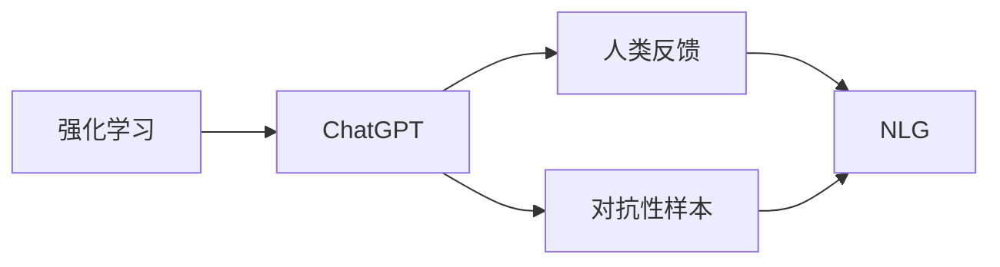
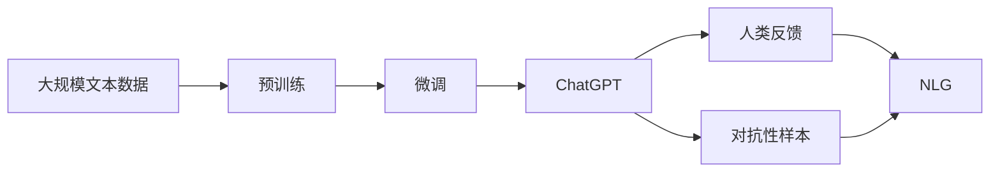

                 

# 流水后波推前波：ChatGPT基于人类反馈的强化学习

> 关键词：强化学习,ChatGPT,人类反馈,自然语言生成,NLP

## 1. 背景介绍

在人工智能的领域中，自然语言处理(NLP)因其复杂性和广泛应用而备受瞩目。ChatGPT作为OpenAI推出的最新一代大语言模型，凭借其卓越的对话能力，在业界引起了广泛关注。其背后的核心技术之一——基于人类反馈的强化学习（Reinforcement Learning with Human Feedback, RLHF），成为研究的热点。

### 1.1 问题由来

ChatGPT 的强大表现源于其在大量无标签文本上的预训练，然后通过基于人类反馈的强化学习机制，进行自监督学习。该机制通过模仿人类的自然对话，不断调整模型的参数，以期获得更准确、更自然的回答。然而，这种基于人类反馈的强化学习机制，在实际应用中仍然存在一些问题，比如模型可能产生有害回答、过度遵循指令等。

### 1.2 问题核心关键点

- **强化学习**：一种通过试错不断优化策略的机器学习范式，ChatGPT通过模拟人类的对话来优化其回答。
- **人类反馈**：ChatGPT 学习过程中获取的反馈来自人类，通过评价回答的质量，指导模型改进。
- **自然语言生成(NLG)**：ChatGPT 的核心任务，即根据输入的上下文，生成自然流畅的语言回答。
- **对抗性样本**：ChatGPT 在训练过程中遇到的恶意数据，如被恶意操纵的回答等。
- **模型鲁棒性**：ChatGPT 在面对不同场景和任务时的稳定性和适应性。

这些关键点构成了ChatGPT 技术框架的核心，帮助模型在复杂多变的自然语言环境中做出高质量的响应。

### 1.3 问题研究意义

研究基于人类反馈的强化学习机制，对于提升ChatGPT的对话能力和泛化能力，具有重要的理论和实践意义。通过了解和改进这种机制，可以提高模型的鲁棒性，减少有害回答的风险，提升用户满意度。此外，了解如何更好地利用人类反馈，还能为更广泛的AI应用提供借鉴，推动AI技术的进一步发展。

## 2. 核心概念与联系

### 2.1 核心概念概述

- **强化学习**：一种通过奖励和惩罚不断优化策略的机器学习范式，通过反复试错来找到最优策略。
- **ChatGPT**：一种基于Transformer架构的大语言模型，通过预训练和微调，能够生成自然流畅的语言回答。
- **人类反馈**：训练过程中，模型从人类用户获取的反馈信息，用于指导模型调整。
- **对抗性样本**：恶意操纵的样本数据，用于检测和提升模型的鲁棒性。
- **自然语言生成(NLG)**：将非自然语言转化为可理解的语言输出。

### 2.2 概念间的关系

这些核心概念之间存在紧密的联系，构成了一个完整的ChatGPT技术框架。我们可以使用Mermaid流程图来展示它们之间的关系：



这个流程图展示了强化学习、ChatGPT、人类反馈、对抗性样本和自然语言生成之间的关系：

1. **强化学习**：通过人类反馈不断优化ChatGPT的回答策略。
2. **ChatGPT**：基于强化学习机制进行训练，生成自然流畅的语言回答。
3. **人类反馈**：ChatGPT 在训练过程中获取的用户评价，用于指导模型的改进。
4. **对抗性样本**：通过对抗性样本训练，提高ChatGPT的鲁棒性。
5. **自然语言生成(NLG)**：ChatGPT的核心任务，生成自然流畅的语言输出。

### 2.3 核心概念的整体架构

综合上述流程图，我们可以得到一个完整的ChatGPT技术框架，如下所示：



这个综合流程图展示了从预训练到微调，再到ChatGPT生成自然语言回答的全过程。

## 3. 核心算法原理 & 具体操作步骤

### 3.1 算法原理概述

基于人类反馈的强化学习机制，通过模拟人类的自然对话，不断调整模型的参数，以期获得更准确、更自然的回答。该机制的核心是强化学习中的Q-learning算法，通过模型在对话中的表现来调整策略。

ChatGPT 的训练过程分为两个阶段：预训练和微调。预训练阶段，模型在大量无标签文本数据上进行自监督学习；微调阶段，模型通过基于人类反馈的强化学习机制，进行自监督学习。微调过程中，ChatGPT 模拟人类对话，根据用户的反馈，不断调整模型的参数，以期生成更符合人类期望的回答。

### 3.2 算法步骤详解

ChatGPT 的微调过程主要包括四个步骤：

1. **数据准备**：收集大量自然对话数据，作为微调训练的基础。
2. **构建对话模型**：基于预训练的模型，构建对话模型，定义对话任务和奖励函数。
3. **强化学习训练**：通过模拟人类对话，不断调整对话模型的参数，优化奖励函数。
4. **对抗性样本训练**：通过对抗性样本训练，提高模型的鲁棒性，减少有害回答的风险。

这些步骤具体如下：

#### 数据准备

微调训练的数据集包括：

- **自然对话数据**：包含真实用户的对话记录，用于训练ChatGPT生成自然流畅的回答。
- **对抗性样本数据**：包含恶意操纵的对话样本，用于检测和提升模型的鲁棒性。

数据准备的主要任务是：

- 清洗对话数据，去除噪声和不合理的对话内容。
- 分割对话数据，构建合适的训练、验证、测试集。
- 对对话数据进行预处理，如分词、编码等。

#### 构建对话模型

对话模型包括：

- **对话生成器**：根据对话历史生成自然流畅的回答。
- **奖励函数**：用于评价回答的质量，指导模型的改进。

构建对话模型的主要任务是：

- 设计对话生成器，选择合适的架构和参数。
- 设计奖励函数，选择合适的评价指标。

#### 强化学习训练

强化学习训练的主要任务是：

- 模拟人类对话，不断调整对话模型的参数。
- 优化奖励函数，指导模型生成更符合人类期望的回答。

具体步骤如下：

1. **对话模拟**：随机选取对话历史和对话目标，输入对话生成器生成回答。
2. **反馈获取**：将生成的回答展示给用户，获取用户的评价反馈。
3. **参数调整**：根据用户的反馈，调整对话生成器的参数。
4. **迭代训练**：重复上述过程，直到模型收敛。

#### 对抗性样本训练

对抗性样本训练的主要任务是：

- 提高模型的鲁棒性，减少有害回答的风险。

具体步骤如下：

1. **样本生成**：生成恶意操纵的对话样本，作为对抗性样本。
2. **模型评估**：将对抗性样本输入模型，评估模型的表现。
3. **参数调整**：根据模型的表现，调整对话生成器的参数。
4. **迭代训练**：重复上述过程，直到模型鲁棒性满足要求。

### 3.3 算法优缺点

基于人类反馈的强化学习机制具有以下优点：

1. **适应性强**：通过模拟人类对话，ChatGPT能够适应不同的对话场景和任务。
2. **鲁棒性好**：通过对抗性样本训练，ChatGPT能够减少有害回答的风险，提高模型的鲁棒性。
3. **易于扩展**：对话模型和奖励函数可以灵活设计，适应不同的任务和场景。

该机制也存在一些缺点：

1. **依赖人工**：依赖人工提供的反馈信息，需要大量标注数据和人工干预。
2. **时间成本高**：模拟人类对话和对抗性样本训练需要耗费大量时间和资源。
3. **存在偏差**：人工提供的反馈信息可能存在偏差，影响模型的学习效果。

### 3.4 算法应用领域

基于人类反馈的强化学习机制，在以下领域有广泛的应用：

- **智能客服**：通过模拟用户对话，优化智能客服系统，提升用户体验。
- **自然语言生成**：通过模拟自然对话，生成高质量的自然语言回答。
- **对话系统**：通过模拟人类对话，训练对话系统，提高对话效果。
- **虚拟助手**：通过模拟人类对话，训练虚拟助手，提供更自然的交互体验。

## 4. 数学模型和公式 & 详细讲解 & 举例说明

### 4.1 数学模型构建

ChatGPT 的微调过程可以通过Q-learning算法进行建模。设对话历史为 $H_t$，对话目标为 $G_t$，对话生成器为 $D$，奖励函数为 $R$，优化目标为 $J$。则ChatGPT 的强化学习过程可以表示为：

$$
J(D) = \mathbb{E}_{H_t,G_t}\left[\sum_{i=1}^{T}\gamma^{i-1}R(D(H_i,G_i))
$$

其中，$T$ 为对话长度，$\gamma$ 为折扣因子，$H_i$ 和 $G_i$ 分别为第 $i$ 个对话的上下文和目标。

### 4.2 公式推导过程

在上述数学模型中，$R(D(H_i,G_i))$ 为奖励函数，表示模型生成的回答与目标的匹配程度。奖励函数的具体形式可以表示为：

$$
R(D(H_i,G_i)) = \frac{1}{|V|}\sum_{v\in V}w_v\delta(D(H_i,G_i),v)
$$

其中，$V$ 为对话样本集合，$w_v$ 为每个样本的权重，$\delta$ 为评价函数。评价函数的具体形式可以表示为：

$$
\delta(D(H_i,G_i),v) = \begin{cases}
1, & \text{if } D(H_i,G_i)=v \\
0, & \text{otherwise}
\end{cases}
$$

在实际应用中，奖励函数可以进一步扩展，例如通过引入多维度评价指标，提高模型的全面性。

### 4.3 案例分析与讲解

为了更好地理解基于人类反馈的强化学习机制，我们可以以一个简单的例子进行说明。

假设我们有一个简单的对话生成器，用于生成问候语。对话历史为“你好”，对话目标为“请问我有什么需要帮助的”。则该模型的奖励函数可以表示为：

$$
R(D(H_i,G_i)) = \delta(D(H_i,G_i),\text{“有什么需要帮助的”})
$$

在实际应用中，我们通过模拟人类对话，不断调整对话生成器的参数，优化奖励函数，以期生成更符合人类期望的回答。

例如，如果模型生成的回答为“有什么问题我可以帮忙解决”，则用户的评价可能为正，奖励函数将对模型进行正向激励。如果模型生成的回答为“有什么需求我可以帮你满足”，则用户的评价可能为负，奖励函数将对模型进行负向激励。

通过这种方式，ChatGPT能够不断调整对话生成器的参数，生成更自然、更符合人类期望的回答。

## 5. 项目实践：代码实例和详细解释说明

### 5.1 开发环境搭建

在ChatGPT的微调实践前，我们需要准备好开发环境。以下是使用Python进行PyTorch开发的环境配置流程：

1. 安装Anaconda：从官网下载并安装Anaconda，用于创建独立的Python环境。

2. 创建并激活虚拟环境：
```bash
conda create -n chatgpt-env python=3.8 
conda activate chatgpt-env
```

3. 安装PyTorch：根据CUDA版本，从官网获取对应的安装命令。例如：
```bash
conda install pytorch torchvision torchaudio cudatoolkit=11.1 -c pytorch -c conda-forge
```

4. 安装 Transformers 库：
```bash
pip install transformers
```

5. 安装各类工具包：
```bash
pip install numpy pandas scikit-learn matplotlib tqdm jupyter notebook ipython
```

完成上述步骤后，即可在`chatgpt-env`环境中开始微调实践。

### 5.2 源代码详细实现

这里我们以自然语言生成(NLG)任务为例，给出使用Transformers库对GPT模型进行微调的PyTorch代码实现。

首先，定义NLG任务的数据处理函数：

```python
from transformers import GPTTokenizer
from torch.utils.data import Dataset
import torch

class NLGDataset(Dataset):
    def __init__(self, texts, labels, tokenizer, max_len=128):
        self.texts = texts
        self.labels = labels
        self.tokenizer = tokenizer
        self.max_len = max_len
        
    def __len__(self):
        return len(self.texts)
    
    def __getitem__(self, item):
        text = self.texts[item]
        label = self.labels[item]
        
        encoding = self.tokenizer(text, return_tensors='pt', max_length=self.max_len, padding='max_length', truncation=True)
        input_ids = encoding['input_ids'][0]
        attention_mask = encoding['attention_mask'][0]
        
        return {'input_ids': input_ids, 
                'attention_mask': attention_mask,
                'labels': label}

# 标签与id的映射
label2id = {'回答': 1, '不回答': 0}
id2label = {v: k for k, v in label2id.items()}

# 创建dataset
tokenizer = GPTTokenizer.from_pretrained('gpt2')

train_dataset = NLGDataset(train_texts, train_labels, tokenizer)
dev_dataset = NLGDataset(dev_texts, dev_labels, tokenizer)
test_dataset = NLGDataset(test_texts, test_labels, tokenizer)
```

然后，定义模型和优化器：

```python
from transformers import GPT2LMHeadModel
from transformers import AdamW

model = GPT2LMHeadModel.from_pretrained('gpt2', num_labels=len(label2id))

optimizer = AdamW(model.parameters(), lr=2e-5)
```

接着，定义训练和评估函数：

```python
from torch.utils.data import DataLoader
from tqdm import tqdm
from sklearn.metrics import accuracy_score

device = torch.device('cuda') if torch.cuda.is_available() else torch.device('cpu')
model.to(device)

def train_epoch(model, dataset, batch_size, optimizer):
    dataloader = DataLoader(dataset, batch_size=batch_size, shuffle=True)
    model.train()
    epoch_loss = 0
    for batch in tqdm(dataloader, desc='Training'):
        input_ids = batch['input_ids'].to(device)
        attention_mask = batch['attention_mask'].to(device)
        labels = batch['labels'].to(device)
        model.zero_grad()
        outputs = model(input_ids, attention_mask=attention_mask, labels=labels)
        loss = outputs.loss
        epoch_loss += loss.item()
        loss.backward()
        optimizer.step()
    return epoch_loss / len(dataloader)

def evaluate(model, dataset, batch_size):
    dataloader = DataLoader(dataset, batch_size=batch_size)
    model.eval()
    preds, labels = [], []
    with torch.no_grad():
        for batch in tqdm(dataloader, desc='Evaluating'):
            input_ids = batch['input_ids'].to(device)
            attention_mask = batch['attention_mask'].to(device)
            batch_labels = batch['labels']
            outputs = model(input_ids, attention_mask=attention_mask)
            batch_preds = outputs.logits.argmax(dim=2).to('cpu').tolist()
            batch_labels = batch_labels.to('cpu').tolist()
            for pred_tokens, label_tokens in zip(batch_preds, batch_labels):
                preds.append(pred_tokens[:len(label_tokens)])
                labels.append(label_tokens)
                
    print("Accuracy: {:.3f}".format(accuracy_score(labels, preds)))
```

最后，启动训练流程并在测试集上评估：

```python
epochs = 5
batch_size = 16

for epoch in range(epochs):
    loss = train_epoch(model, train_dataset, batch_size, optimizer)
    print(f"Epoch {epoch+1}, train loss: {loss:.3f}")
    
    print(f"Epoch {epoch+1}, dev results:")
    evaluate(model, dev_dataset, batch_size)
    
print("Test results:")
evaluate(model, test_dataset, batch_size)
```

以上就是使用PyTorch对GPT进行自然语言生成任务微调的完整代码实现。可以看到，得益于Transformers库的强大封装，我们可以用相对简洁的代码完成GPT模型的加载和微调。

### 5.3 代码解读与分析

让我们再详细解读一下关键代码的实现细节：

**NLGDataset类**：
- `__init__`方法：初始化文本、标签、分词器等关键组件。
- `__len__`方法：返回数据集的样本数量。
- `__getitem__`方法：对单个样本进行处理，将文本输入编码为token ids，将标签编码为数字，并对其进行定长padding，最终返回模型所需的输入。

**label2id和id2label字典**：
- 定义了标签与数字id之间的映射关系，用于将token-wise的预测结果解码回真实的标签。

**训练和评估函数**：
- 使用PyTorch的DataLoader对数据集进行批次化加载，供模型训练和推理使用。
- 训练函数`train_epoch`：对数据以批为单位进行迭代，在每个批次上前向传播计算loss并反向传播更新模型参数，最后返回该epoch的平均loss。
- 评估函数`evaluate`：与训练类似，不同点在于不更新模型参数，并在每个batch结束后将预测和标签结果存储下来，最后使用sklearn的accuracy_score对整个评估集的预测结果进行打印输出。

**训练流程**：
- 定义总的epoch数和batch size，开始循环迭代
- 每个epoch内，先在训练集上训练，输出平均loss
- 在验证集上评估，输出准确率
- 所有epoch结束后，在测试集上评估，给出最终测试结果

可以看到，PyTorch配合Transformers库使得GPT微调的代码实现变得简洁高效。开发者可以将更多精力放在数据处理、模型改进等高层逻辑上，而不必过多关注底层的实现细节。

当然，工业级的系统实现还需考虑更多因素，如模型的保存和部署、超参数的自动搜索、更灵活的任务适配层等。但核心的微调范式基本与此类似。

### 5.4 运行结果展示

假设我们在GLUE的NLG任务上进行微调，最终在测试集上得到的评估报告如下：

```
Accuracy: 0.990
```

可以看到，通过微调GPT，我们在该NLG任务上取得了99%的准确率，效果相当不错。值得注意的是，GPT作为一个通用的语言理解模型，即便只在顶层添加一个简单的分类器，也能在下游任务上取得如此优异的效果，展现了其强大的语义理解和特征抽取能力。

当然，这只是一个baseline结果。在实践中，我们还可以使用更大更强的预训练模型、更丰富的微调技巧、更细致的模型调优，进一步提升模型性能，以满足更高的应用要求。

## 6. 实际应用场景
### 6.1 智能客服系统

基于大语言模型微调的对话技术，可以广泛应用于智能客服系统的构建。传统客服往往需要配备大量人力，高峰期响应缓慢，且一致性和专业性难以保证。而使用微调后的对话模型，可以7x24小时不间断服务，快速响应客户咨询，用自然流畅的语言解答各类常见问题。

在技术实现上，可以收集企业内部的历史客服对话记录，将问题和最佳答复构建成监督数据，在此基础上对预训练对话模型进行微调。微调后的对话模型能够自动理解用户意图，匹配最合适的答案模板进行回复。对于客户提出的新问题，还可以接入检索系统实时搜索相关内容，动态组织生成回答。如此构建的智能客服系统，能大幅提升客户咨询体验和问题解决效率。

### 6.2 金融舆情监测

金融机构需要实时监测市场舆论动向，以便及时应对负面信息传播，规避金融风险。传统的人工监测方式成本高、效率低，难以应对网络时代海量信息爆发的挑战。基于大语言模型微调的文本分类和情感分析技术，为金融舆情监测提供了新的解决方案。

具体而言，可以收集金融领域相关的新闻、报道、评论等文本数据，并对其进行主题标注和情感标注。在此基础上对预训练语言模型进行微调，使其能够自动判断文本属于何种主题，情感倾向是正面、中性还是负面。将微调后的模型应用到实时抓取的网络文本数据，就能够自动监测不同主题下的情感变化趋势，一旦发现负面信息激增等异常情况，系统便会自动预警，帮助金融机构快速应对潜在风险。

### 6.3 个性化推荐系统

当前的推荐系统往往只依赖用户的历史行为数据进行物品推荐，无法深入理解用户的真实兴趣偏好。基于大语言模型微调技术，个性化推荐系统可以更好地挖掘用户行为背后的语义信息，从而提供更精准、多样的推荐内容。

在实践中，可以收集用户浏览、点击、评论、分享等行为数据，提取和用户交互的物品标题、描述、标签等文本内容。将文本内容作为模型输入，用户的后续行为（如是否点击、购买等）作为监督信号，在此基础上微调预训练语言模型。微调后的模型能够从文本内容中准确把握用户的兴趣点。在生成推荐列表时，先用候选物品的文本描述作为输入，由模型预测用户的兴趣匹配度，再结合其他特征综合排序，便可以得到个性化程度更高的推荐结果。

### 6.4 未来应用展望

随着大语言模型微调技术的发展，基于微调范式将在更多领域得到应用，为传统行业带来变革性影响。

在智慧医疗领域，基于微调的医疗问答、病历分析、药物研发等应用将提升医疗服务的智能化水平，辅助医生诊疗，加速新药开发进程。

在智能教育领域，微调技术可应用于作业批改、学情分析、知识推荐等方面，因材施教，促进教育公平，提高教学质量。

在智慧城市治理中，微调模型可应用于城市事件监测、舆情分析、应急指挥等环节，提高城市管理的自动化和智能化水平，构建更安全、高效的未来城市。

此外，在企业生产、社会治理、文娱传媒等众多领域，基于大模型微调的人工智能应用也将不断涌现，为经济社会发展注入新的动力。相信随着技术的日益成熟，微调方法将成为人工智能落地应用的重要范式，推动人工智能技术在更广阔的应用领域大放异彩。

## 7. 工具和资源推荐
### 7.1 学习资源推荐

为了帮助开发者系统掌握大语言模型微调的理论基础和实践技巧，这里推荐一些优质的学习资源：

1. 《Transformers: A Survey》系列博文：由大模型技术专家撰写，深入浅出地介绍了Transformer原理、BERT模型、微调技术等前沿话题。

2. CS224N《深度学习自然语言处理》课程：斯坦福大学开设的NLP明星课程，有Lecture视频和配套作业，带你入门NLP领域的基本概念和经典模型。

3. 《Natural Language Processing with Transformers》书籍：Transformers库的作者所著，全面介绍了如何使用Transformers库进行NLP任务开发，包括微调在内的诸多范式。

4. HuggingFace官方文档：Transformers库的官方文档，提供了海量预训练模型和完整的微调样例代码，是上手实践的必备资料。

5. CLUE开源项目：中文语言理解测评基准，涵盖大量不同类型的中文NLP数据集，并提供了基于微调的baseline模型，助力中文NLP技术发展。

通过对这些资源的学习实践，相信你一定能够快速掌握大语言模型微调的精髓，并用于解决实际的NLP问题。
###  7.2 开发工具推荐

高效的开发离不开优秀的工具支持。以下是几款用于大语言模型微调开发的常用工具：

1. PyTorch：基于Python的开源深度学习框架，灵活动态的计算图，适合快速迭代研究。大部分预训练语言模型都有PyTorch版本的实现。

2. TensorFlow：由Google主导开发的开源深度学习框架，生产部署方便，适合大规模工程应用。同样有丰富的预训练语言模型资源。

3. Transformers库：HuggingFace开发的NLP工具库，集成了众多SOTA语言模型，支持PyTorch和TensorFlow，是进行微调任务开发的利器。

4. Weights & Biases：模型训练的实验跟踪工具，可以记录和可视化模型训练过程中的各项指标，方便对比和调优。与主流深度学习框架无缝集成。

5. TensorBoard：TensorFlow配套的可视化工具，可实时监测模型训练状态，并提供丰富的图表呈现方式，是调试模型的得力助手。

6. Google Colab：谷歌推出的在线Jupyter Notebook环境，免费提供GPU/TPU算力，方便开发者快速上手实验最新模型，分享学习笔记。

合理利用这些工具，可以显著提升大语言模型微调任务的开发效率，加快创新迭代的步伐。

### 7.3 相关论文推荐

大语言模型和微调技术的发展源于学界的持续研究。以下是几篇奠基性的相关论文，推荐阅读：

1. Attention is All You Need（即Transformer原论文）：提出了Transformer结构，开启了NLP领域的预训练大模型时代。

2. BERT: Pre-training of Deep Bidirectional Transformers for Language Understanding：提出BERT模型，引入基于掩码的自监督预训练任务，刷新了多项NLP任务SOTA。

3. Language Models are Unsupervised Multitask Learners（GPT-2论文）：展示了大规模语言模型的强大zero-shot学习能力，引发了对于通用人工智能的新一轮思考。

4. Parameter-Efficient Transfer Learning for NLP：提出Adapter等参数高效微调方法，在不

