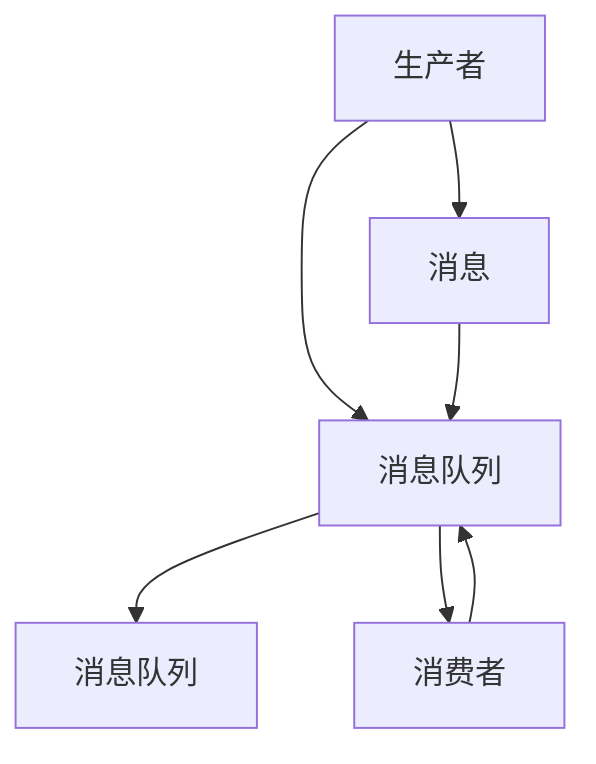

                 

# 消息队列 原理与代码实例讲解

## 1. 背景介绍

### 1.1 问题由来
在现代分布式系统中，消息队列（Message Queue）成为了一种重要的通信机制，特别是在微服务架构中，它被广泛用于解耦各个模块之间的通信。消息队列的基本思想是，模块间通过消息传递而非直接调用，从而降低了系统复杂度，提高了系统的可伸缩性和可用性。

然而，消息队列的原理、架构设计及其在实际系统中的应用，并不是每个开发者都能深入理解的问题。本博客旨在深入探讨消息队列的原理、算法、实现以及实践案例，帮助读者全面理解并应用消息队列技术。

### 1.2 问题核心关键点
消息队列的核心关键点包括：

- **基本概念**：理解消息队列的基本组成和运作机制。
- **原理与算法**：掌握消息队列的核心算法，包括生产者-消费者模型、消费者拉取模型、消息队列的可靠性保证等。
- **实现细节**：了解常用的消息队列实现技术，如RabbitMQ、Kafka、ActiveMQ等。
- **应用场景**：掌握消息队列在不同应用场景中的具体实现，如解耦系统模块、实现分布式锁、实现消息缓冲等。

本博客将从以上几个方面展开讨论，帮助读者深入理解消息队列。

## 2. 核心概念与联系

### 2.1 核心概念概述

在讨论消息队列的原理与实现之前，我们先介绍一些核心概念：

- **消息（Message）**：消息是消息队列的基本单位，通常包含数据和元数据。
- **生产者（Producer）**：生产者负责生成消息并将其发送到消息队列中。
- **消费者（Consumer）**：消费者负责从消息队列中读取消息并进行处理。
- **队列（Queue）**：队列是消息存储和传递的数据结构，具有先进先出（FIFO）的特点。
- **持久化（Persistence）**：消息队列通常提供消息持久化功能，保证消息在队列中的持久存在。
- **可靠性（Reliability）**：消息队列保证消息的可靠传输，防止消息丢失。
- **负载均衡（Load Balancing）**：通过负载均衡技术，确保消息队列中的消息均衡地分配给各个消费者处理。
- **容错性（Fault Tolerance）**：消息队列应具备容错性，能够自动恢复因故障而中断的进程。

这些概念构成了消息队列的核心，下面我们将通过一个简单的消息队列模型来理解其运作机制。

### 2.2 核心概念的整体架构

下图展示了消息队列的基本架构，包含生产者、消费者、消息队列以及消息传递的流程图：



在这个架构中，生产者负责生成消息并将其发送到消息队列，消费者从消息队列中读取消息并处理。消息队列是消息传递的中间件，起到缓存和传递消息的作用。

## 3. 核心算法原理 & 具体操作步骤
### 3.1 算法原理概述

消息队列的核心算法主要涉及以下几个方面：

- **生产者-消费者模型**：描述生产者如何将消息发送到队列，以及消费者如何从队列中读取消息的过程。
- **消费者拉取模型**：描述消费者主动从队列中拉取消息的机制。
- **消息可靠性保证**：通过使用消息确认机制、消息重复消费机制等技术，确保消息的可靠传输。
- **消息队列性能优化**：通过负载均衡、消息缓冲、消息压缩等技术，提高消息队列的性能和可靠性。

### 3.2 算法步骤详解

#### 3.2.1 生产者-消费者模型

生产者-消费者模型是消息队列中最基本的模型。其核心思想是，生产者负责生成消息并将其发送到消息队列中，消费者从队列中读取消息并进行处理。

下图展示了生产者-消费者模型的基本流程：


生产者发送消息的过程可以分为以下几个步骤：

1. 生产者生成一条消息。
2. 生产者将消息发送到消息队列中。
3. 消息队列接收消息并进行存储。

消费者读取消息的过程可以分为以下几个步骤：

1. 消费者从消息队列中读取消息。
2. 消费者对消息进行处理。
3. 消费者将处理结果返回给生产者。

#### 3.2.2 消费者拉取模型

消费者拉取模型与生产者-消费者模型类似，但消费者主动从消息队列中拉取消息，而不是由生产者主动推送。

下图展示了消费者拉取模型的基本流程：


消费者拉取模型的核心思想是，消费者通过定期拉取队列中的消息，主动处理消息。其步骤如下：

1. 消费者定期检查消息队列是否有新消息。
2. 消费者拉取消息并将其存储。
3. 消费者对消息进行处理。
4. 消费者将处理结果返回给生产者。

#### 3.2.3 消息可靠性保证

消息队列必须确保消息的可靠传输，防止消息丢失或重复处理。常用的可靠性保证技术包括：

- **消息确认（Acknowledgement）**：生产者或消费者在发送或接收消息后，向对方发送确认信号，确保消息成功发送或接收。
- **消息重复消费（Message Deduplication）**：通过在消息中附加唯一标识，保证消费者能够识别重复消费的消息。
- **消息持久化（Message Persistence）**：将消息保存到存储设备中，确保消息在队列中的持久存在。

### 3.3 算法优缺点

#### 3.3.1 优点

消息队列的优点包括：

- **解耦系统模块**：通过消息队列，不同模块之间可以通过消息进行通信，降低了模块之间的耦合度。
- **提高系统可用性**：消息队列可以提供负载均衡、消息缓冲等功能，提高系统的可用性和稳定性。
- **支持异步通信**：消息队列支持异步通信，允许生产者和消费者在消息传输过程中进行其他操作。

#### 3.3.2 缺点

消息队列的缺点包括：

- **消息堆积**：如果队列中的消息堆积过多，可能会影响系统的性能和可用性。
- **消息延迟**：消息队列中的消息可能存在延迟，影响系统的实时性。
- **系统复杂度增加**：消息队列增加了系统的复杂度，需要额外的管理和维护。

### 3.4 算法应用领域

消息队列广泛应用于以下领域：

- **微服务架构**：在微服务架构中，消息队列用于解耦各个模块之间的通信，提高系统的可伸缩性和可用性。
- **分布式系统**：消息队列用于实现分布式系统的消息传递和分布式锁等功能。
- **实时计算**：消息队列用于实现实时计算系统中的消息传递和数据缓冲。
- **流处理**：消息队列用于实现流处理系统中的消息传递和数据缓冲。
- **事件驱动架构**：消息队列用于实现事件驱动架构中的消息传递和事件处理。

## 4. 数学模型和公式 & 详细讲解
### 4.1 数学模型构建

在讨论消息队列的数学模型之前，我们先介绍一些基本的概念：

- **生产者-消费者模型**：描述生产者将消息发送到队列，以及消费者从队列中读取消息的过程。
- **消费者拉取模型**：描述消费者主动从队列中拉取消息的机制。
- **消息可靠性保证**：通过使用消息确认机制、消息重复消费机制等技术，确保消息的可靠传输。
- **消息队列性能优化**：通过负载均衡、消息缓冲、消息压缩等技术，提高消息队列的性能和可靠性。

### 4.2 公式推导过程

#### 4.2.1 生产者-消费者模型

生产者-消费者模型的基本数学模型可以描述为：

- 生产者：生成消息 $m$，并将消息发送到队列 $Q$。
- 消费者：从队列 $Q$ 中读取消息 $m$，并对消息进行处理。

其中，生产者和消费者的行为可以用以下数学模型描述：

- 生产者：$P = \{p_1, p_2, ..., p_n\}$，其中 $p_i$ 表示生产者 $i$ 生成消息的行为。
- 消费者：$C = \{c_1, c_2, ..., c_m\}$，其中 $c_i$ 表示消费者 $i$ 从队列中读取消息的行为。
- 消息队列：$Q = \{q_1, q_2, ..., q_n\}$，其中 $q_i$ 表示队列中的消息。

### 4.3 案例分析与讲解

假设有一个消息队列，生产者和消费者对队列进行读写操作。生产者以速率 $r$ 生成消息，消费者以速率 $c$ 从队列中读取消息。队列中最多可以容纳 $n$ 条消息。在队列已满时，生产者需要等待队列中有空闲位置。

我们可以用以下数学模型描述生产者-消费者模型的行为：

- 生产者：$P = \{p_1, p_2, ..., p_n\}$，其中 $p_i$ 表示生产者 $i$ 生成消息的行为。
- 消费者：$C = \{c_1, c_2, ..., c_m\}$，其中 $c_i$ 表示消费者 $i$ 从队列中读取消息的行为。
- 消息队列：$Q = \{q_1, q_2, ..., q_n\}$，其中 $q_i$ 表示队列中的消息。

其中，生产者和消费者的行为可以用以下数学模型描述：

- 生产者：$P = \{p_1, p_2, ..., p_n\}$，其中 $p_i$ 表示生产者 $i$ 生成消息的行为。
- 消费者：$C = \{c_1, c_2, ..., c_m\}$，其中 $c_i$ 表示消费者 $i$ 从队列中读取消息的行为。
- 消息队列：$Q = \{q_1, q_2, ..., q_n\}$，其中 $q_i$ 表示队列中的消息。

通过数学模型，我们可以计算队列中消息的数量，以及生产者和消费者的行为对队列的影响。

## 5. 项目实践：代码实例和详细解释说明
### 5.1 开发环境搭建

在进行消息队列的实现之前，我们需要准备好开发环境。以下是使用Python进行RabbitMQ开发的开发环境配置流程：

1. 安装Anaconda：从官网下载并安装Anaconda，用于创建独立的Python环境。

2. 创建并激活虚拟环境：
```bash
conda create -n rabbitmq-env python=3.8 
conda activate rabbitmq-env
```

3. 安装Pika：用于Python连接RabbitMQ的客户端库。
```bash
pip install pika
```

4. 安装Flask：用于构建Web应用，展示消息队列的基本功能。
```bash
pip install flask
```

5. 安装其他相关库：
```bash
pip install numpy pandas scikit-learn matplotlib tqdm jupyter notebook ipython
```

完成上述步骤后，即可在`rabbitmq-env`环境中开始消息队列的实现。

### 5.2 源代码详细实现

下面我们以RabbitMQ为例，给出使用Python实现消息队列的基本代码实现。

首先，定义RabbitMQ的连接和通道：

```python
import pika

# 连接RabbitMQ服务器
connection = pika.BlockingConnection(pika.ConnectionParameters('localhost'))
channel = connection.channel()

# 声明队列
channel.queue_declare(queue='hello')
```

然后，定义生产者和消费者的行为：

```python
from threading import Thread

# 生产者线程
class ProducerThread(Thread):
    def __init__(self, queue_name):
        Thread.__init__(self)
        self.queue_name = queue_name
        self.count = 0

    def run(self):
        while self.count < 10:
            message = 'Hello, RabbitMQ! Count: {}'.format(self.count)
            self.count += 1
            channel.basic_publish(exchange='',
                                 routing_key=self.queue_name,
                                 body=message)
            print('Sent message - {}: {}'.format(self.count, message))

# 消费者线程
class ConsumerThread(Thread):
    def __init__(self, queue_name):
        Thread.__init__(self)
        self.queue_name = queue_name

    def run(self):
        self.channel = channel
        self.queue = self.queue_name
        self.count = 0

        self.channel.basic_consume(queue=self.queue,
                                  on_message_callback=self.callback,
                                  auto_ack=True)

        print(' [*] Waiting for messages. To exit press CTRL+C')
        self.channel.start_consuming()

    def callback(self, ch, method, properties, body):
        self.count += 1
        print('Received message - {}: {}'.format(self.count, body))
```

最后，启动生产者和消费者的运行：

```python
producer = ProducerThread('hello')
producer.start()

consumer = ConsumerThread('hello')
consumer.start()

# 等待线程结束
producer.join()
consumer.join()

# 关闭连接
connection.close()
```

以上就是使用Python对RabbitMQ进行消息队列开发的完整代码实现。可以看到，通过Pika库，我们可以方便地与RabbitMQ进行交互，实现生产者和消费者的行为。

### 5.3 代码解读与分析

让我们再详细解读一下关键代码的实现细节：

**RabbitMQ连接和通道**：
- `pika.BlockingConnection`：用于创建与RabbitMQ服务器的连接。
- `connection.channel()`：用于创建通道。
- `channel.queue_declare`：用于声明队列。

**生产者和消费者的行为**：
- `ProducerThread`：定义生产者的线程行为，包括生成消息并将其发送到队列。
- `ConsumerThread`：定义消费者的线程行为，包括从队列中读取消息并进行处理。

**生产者和消费者的行为**：
- `ProducerThread.run`：生产者线程的主函数，生成消息并将其发送到队列。
- `ConsumerThread.run`：消费者线程的主函数，从队列中读取消息并进行处理。

**消息处理**：
- `ConsumerThread.callback`：消费者线程的消息回调函数，处理收到的消息。
- `print('Received message - {}: {}'.format(self.count, body))`：输出收到的消息及其处理次数。

**运行结果展示**：
- 启动生产者线程和消费者线程后，生产者线程会连续发送10条消息，消费者线程会依次处理这些消息。

通过以上代码实现，我们可以验证RabbitMQ的基本功能，理解消息队列的基本运作机制。

## 6. 实际应用场景
### 6.1 智能客服系统

智能客服系统是消息队列的重要应用场景之一。在智能客服系统中，消息队列用于传递客户请求和系统响应，提高系统的响应速度和处理能力。

具体而言，当客户通过聊天界面发送请求时，系统会将请求消息发送到消息队列中。智能客服系统会根据消息队列中的请求消息，生成响应消息，并通过消息队列将响应消息发送回客户。这种方式可以保证请求和响应消息的异步处理，提高系统的处理能力和响应速度。

### 6.2 金融交易系统

金融交易系统中的订单处理和清算过程，也可以采用消息队列进行异步处理。当用户提交订单时，订单消息会发送到消息队列中。交易系统会根据消息队列中的订单消息，生成交易指令，并通过消息队列将交易指令发送给清算系统。这种方式可以保证订单处理和清算过程的异步处理，提高系统的处理能力和响应速度。

### 6.3 物流配送系统

物流配送系统中，订单信息和配送信息需要通过消息队列进行传递。当用户下单时，订单信息会发送到消息队列中。物流系统会根据消息队列中的订单信息，生成配送指令，并通过消息队列将配送指令发送给配送员。这种方式可以保证订单处理和配送过程的异步处理，提高系统的处理能力和响应速度。

### 6.4 未来应用展望

随着消息队列技术的不断发展，其在各种场景中的应用也将更加广泛。未来，消息队列将与更多技术进行深度融合，带来更多创新应用：

- **物联网**：在物联网设备之间，消息队列可以用于异步通信和数据同步，提高设备的通信效率和可靠性。
- **云计算**：在云应用中，消息队列可以用于分布式事务和跨区域数据同步，提高云应用的稳定性和可用性。
- **人工智能**：在人工智能系统中，消息队列可以用于异步数据处理和分布式模型训练，提高系统的性能和效率。
- **区块链**：在区块链系统中，消息队列可以用于异步共识和跨链通信，提高系统的处理能力和安全性。

总之，消息队列在各种场景中的应用将不断拓展，为系统的稳定性和可靠性提供有力保障。

## 7. 工具和资源推荐
### 7.1 学习资源推荐

为了帮助开发者系统掌握消息队列的理论基础和实践技巧，这里推荐一些优质的学习资源：

1. 《消息队列实战指南》系列博文：由大模型技术专家撰写，深入浅出地介绍了消息队列原理、RabbitMQ、Kafka等主流消息队列的实现。

2. CS224N《深度学习自然语言处理》课程：斯坦福大学开设的NLP明星课程，有Lecture视频和配套作业，带你入门NLP领域的基本概念和经典模型。

3. 《消息队列设计与实现》书籍：全面介绍消息队列的设计和实现，包括消息队列的基本概念、算法和实现技术。

4. RabbitMQ官方文档：RabbitMQ官方文档，提供了海量的消息队列实现和配置指导，是学习RabbitMQ的必备资料。

5. Kafka官方文档：Kafka官方文档，提供了全面的消息队列实现和配置指导，是学习Kafka的必备资料。

通过对这些资源的学习实践，相信你一定能够快速掌握消息队列的精髓，并用于解决实际的NLP问题。

### 7.2 开发工具推荐

高效的开发离不开优秀的工具支持。以下是几款用于消息队列开发的常用工具：

1. RabbitMQ：RabbitMQ是一个流行的开源消息队列系统，支持多种消息传输协议和协议插件，具有良好的性能和稳定性。

2. Kafka：Kafka是一个高吞吐量的分布式消息队列系统，支持主题、分区、消费者组等概念，适用于大规模数据的存储和处理。

3. ActiveMQ：ActiveMQ是一个开源的消息队列系统，支持多种消息传输协议和协议插件，具有良好的性能和扩展性。

4. RabbitMQ插件和扩展：RabbitMQ提供了丰富的插件和扩展，可以满足不同场景的需求，如高可用性插件、监控插件等。

5. Kafka扩展和插件：Kafka提供了丰富的扩展和插件，可以满足不同场景的需求，如流处理插件、安全插件等。

合理利用这些工具，可以显著提升消息队列开发的效率，加快创新迭代的步伐。

### 7.3 相关论文推荐

消息队列技术的发展源于学界的持续研究。以下是几篇奠基性的相关论文，推荐阅读：

1. "Pubs/Sub with BAM: a Real-Time Publishing/Subscription Mechanism"（2002）：介绍了一种基于发布/订阅机制的消息队列，为后来的消息队列系统奠定了基础。

2. "Design and Implementation of AMQP"（2007）：介绍了AMQP协议的设计和实现，为RabbitMQ等系统的开发提供了理论支持。

3. "Apache Kafka: The Distributed Streaming Platform"（2011）：介绍了Kafka系统的设计和实现，为Kafka等系统的开发提供了理论支持。

4. "Reliable Distributed Messaging"（1986）：介绍了可靠分布式消息传递的原理和实现，为后来的消息队列系统提供了理论基础。

5. "Designing an Optimized Pub/Sub System"（2003）：介绍了优化消息队列系统的方法和策略，为后来的消息队列系统提供了理论支持。

这些论文代表了大语言模型微调技术的发展脉络。通过学习这些前沿成果，可以帮助研究者把握学科前进方向，激发更多的创新灵感。

除上述资源外，还有一些值得关注的前沿资源，帮助开发者紧跟消息队列技术的最新进展，例如：

1. arXiv论文预印本：人工智能领域最新研究成果的发布平台，包括大量尚未发表的前沿工作，学习前沿技术的必读资源。

2. 业界技术博客：如RabbitMQ、Kafka、ActiveMQ等顶尖实验室的官方博客，第一时间分享他们的最新研究成果和洞见。

3. 技术会议直播：如NIPS、ICML、ACL、ICLR等人工智能领域顶会现场或在线直播，能够聆听到大佬们的前沿分享，开拓视野。

4. GitHub热门项目：在GitHub上Star、Fork数最多的消息队列相关项目，往往代表了该技术领域的发展趋势和最佳实践，值得去学习和贡献。

5. 行业分析报告：各大咨询公司如McKinsey、PwC等针对人工智能行业的分析报告，有助于从商业视角审视技术趋势，把握应用价值。

总之，对于消息队列技术的学习和实践，需要开发者保持开放的心态和持续学习的意愿。多关注前沿资讯，多动手实践，多思考总结，必将收获满满的成长收益。

## 8. 总结：未来发展趋势与挑战
### 8.1 总结

本文对消息队列的基本概念、算法原理和实现方法进行了全面系统的介绍。首先阐述了消息队列的基本组成和运作机制，明确了消息队列在分布式系统中的重要地位。其次，从原理到实践，详细讲解了消息队列的核心算法，包括生产者-消费者模型、消费者拉取模型、消息可靠性保证等。最后，本文还探讨了消息队列在实际应用中的具体实现，包括智能客服系统、金融交易系统、物流配送系统等多个场景。

通过本文的系统梳理，可以看到，消息队列在各种应用场景中的强大作用，能够显著提升系统的可用性和稳定性。未来，消息队列技术将在更广泛的领域中得到应用，推动分布式系统的进一步发展。

### 8.2 未来发展趋势

展望未来，消息队列技术将呈现以下几个发展趋势：

1. **分布式架构**：未来的消息队列系统将更加注重分布式架构的设计，支持大规模数据的存储和处理，提高系统的扩展性和可用性。

2. **云原生架构**：消息队列将更加注重云原生架构的设计，支持微服务架构、容器化、服务网格等技术，提高系统的部署和运维效率。

3. **多模态数据处理**：未来的消息队列将支持多模态数据处理，能够处理文本、图片、视频等多种类型的数据，提高系统的处理能力和应用范围。

4. **实时计算**：未来的消息队列将支持实时计算，支持流处理、事件驱动等技术，提高系统的处理能力和实时性。

5. **安全性和隐私保护**：未来的消息队列将更加注重安全性和隐私保护，支持数据加密、访问控制等技术，提高系统的安全性。

### 8.3 面临的挑战

尽管消息队列技术已经取得了显著进展，但在其发展过程中，仍然面临诸多挑战：

1. **性能瓶颈**：大规模数据的存储和处理可能会带来性能瓶颈，需要更加高效的消息队列算法和架构设计。

2. **扩展性问题**：随着系统的扩展，消息队列的扩展性和可用性可能会受到挑战，需要更加分布式和可伸缩的架构设计。

3. **可靠性问题**：消息队列的可靠性保证需要更加完善，防止消息丢失和重复消费，需要更加先进的消息可靠性技术。

4. **可维护性问题**：消息队列的实现和维护可能会变得复杂，需要更加模块化和易于维护的设计。

5. **安全性问题**：消息队列中的数据安全性和隐私保护需要更加完善，防止数据泄露和攻击。

### 8.4 研究展望

面对消息队列技术所面临的挑战，未来的研究需要在以下几个方面寻求新的突破：

1. **分布式算法**：开发更加高效的消息队列算法和架构设计，支持大规模数据的存储和处理。

2. **云原生技术**：引入云原生技术，支持微服务架构、容器化、服务网格等技术，提高系统的部署和运维效率。

3. **多模态数据处理**：支持多模态数据处理，能够处理文本、图片、视频等多种类型的数据，提高系统的处理能力和应用范围。

4. **实时计算技术**：引入实时计算技术，支持流处理、事件驱动等技术，提高系统的处理能力和实时性。

5. **安全性技术**：引入安全性技术，支持数据加密、访问控制等技术，提高系统的安全性。

这些研究方向将引领消息队列技术的发展方向，推动消息队列技术在各个领域的广泛应用。

## 9. 附录：常见问题与解答

**Q1：消息队列如何保证消息的可靠性？**

A: 消息队列通常通过以下几种方式保证消息的可靠性：

1. 消息确认机制（Acknowledgement）：生产者或消费者在发送或接收消息后，向对方发送确认信号，确保消息成功发送或接收。

2. 消息持久化（Message Persistence）：将消息保存到存储设备中，确保消息在队列中的持久存在。

3. 消息重复消费（Message Deduplication）：通过在消息中附加唯一标识，保证消费者能够识别重复消费的消息。

**Q2：消息队列如何实现负载均衡？**

A: 消息队列可以通过以下几种方式实现负载均衡：

