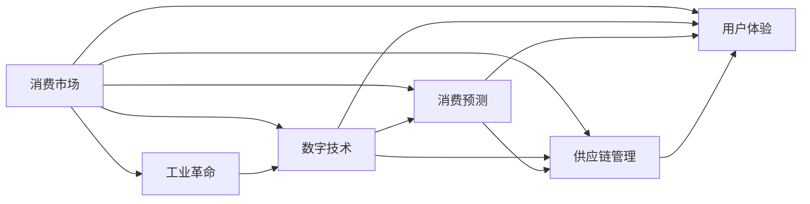
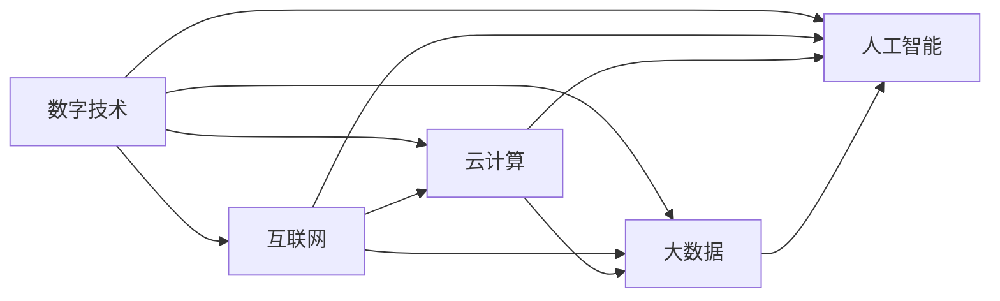
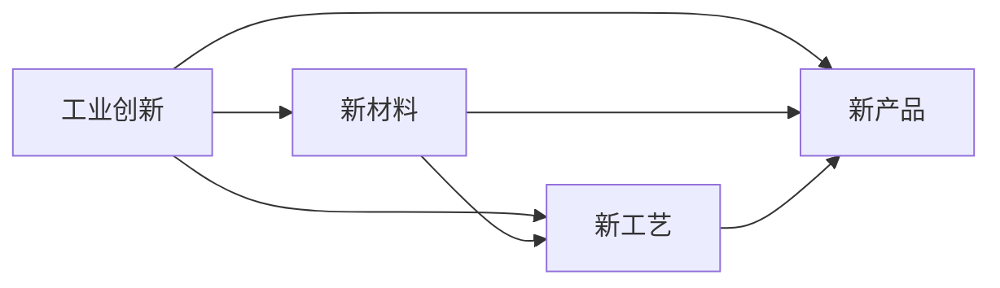
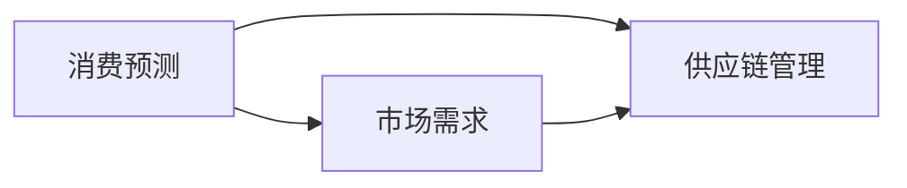
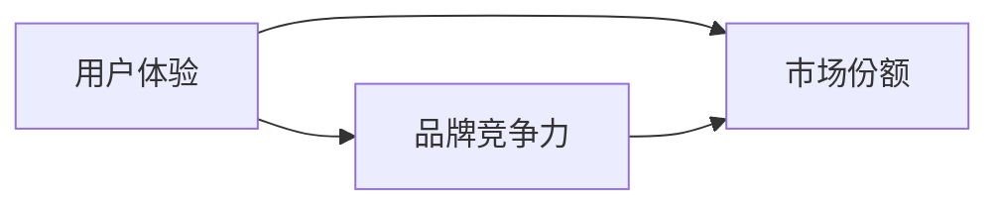
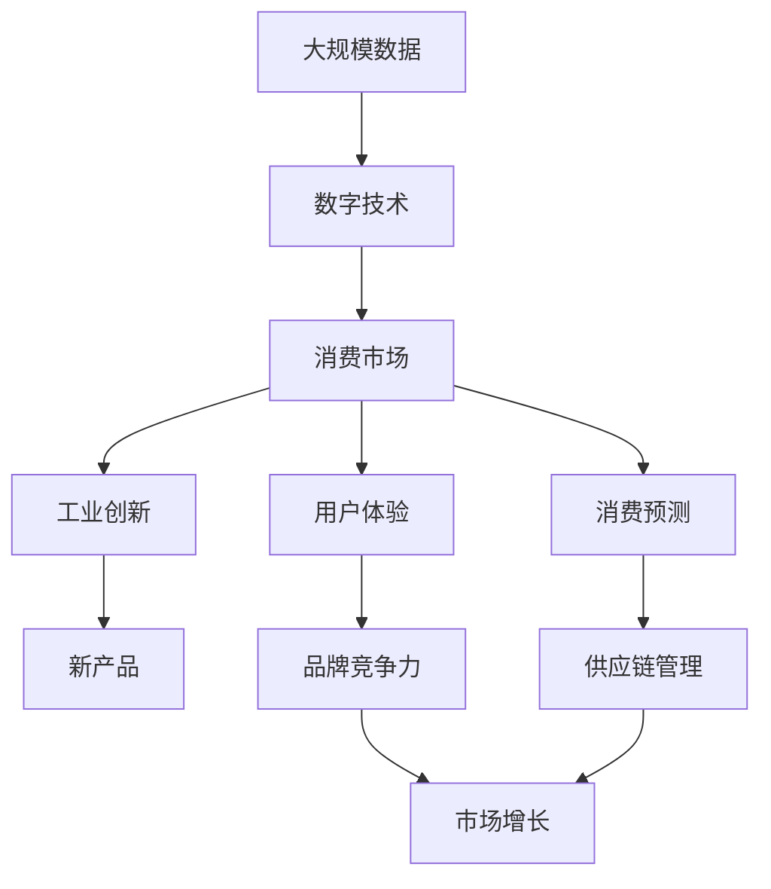

                 

# 消费市场的扩大与工业革命

## 1. 背景介绍

### 1.1 问题由来

随着全球经济的发展和科技进步，消费市场正在经历前所未有的扩大和变革。一方面，互联网和数字技术的普及极大地拓展了市场边界，改变了消费者行为和购买方式。另一方面，工业革命的持续推进，新材料、新工艺、新产品的不断涌现，也在不断拓宽市场的应用场景和消费潜力。然而，在市场快速扩大的同时，如何高效、准确地预测消费需求，优化供应链管理，提升用户体验，成为企业和政府面临的重要挑战。

本文将深入探讨消费市场的扩大与工业革命之间的关系，重点关注消费市场的变化趋势、技术驱动的工业创新及其对消费市场的影响，以及通过数据驱动的方法解决这些挑战的具体技术和算法。

### 1.2 问题核心关键点

消费市场的扩大与工业革命之间的关系可以从以下几个核心关键点进行分析：

- **市场规模的扩张**：互联网和数字技术的应用，使得市场从线下扩展到线上，甚至拓展到虚拟空间，极大地扩展了市场规模。

- **消费行为的改变**：个性化、多样化的消费需求成为主流，消费者更注重产品的独特性和体验，而非单纯的性价比。

- **工业创新的推动**：新材料、新工艺、新产品的不断涌现，推动了工业革命的持续推进，进一步扩大了市场的应用场景和消费潜力。

- **数据驱动的决策**：消费市场数据量的激增和数据处理能力的提升，使得通过数据驱动的方法进行消费预测、供应链管理和用户体验提升成为可能。

- **技术创新与市场融合**：新技术的应用，如人工智能、大数据、物联网等，加速了工业创新与市场需求的融合，推动了消费市场的进一步扩大。

这些关键点共同构成了消费市场扩大与工业革命之间的内在联系，揭示了技术创新对市场规模、消费行为和工业发展的深远影响。

## 2. 核心概念与联系

### 2.1 核心概念概述

为更好地理解消费市场扩大与工业革命的内在联系，本节将介绍几个密切相关的核心概念：

- **消费市场**：指一定时间和空间内，消费者对各类产品或服务的需求总和，是衡量经济发展水平的重要指标。

- **工业革命**：指18世纪末至19世纪初，由于技术进步和生产力提升，手工生产逐渐被机械化生产所取代的历史过程，极大地改变了生产方式和社会结构。

- **数字技术**：包括互联网、云计算、大数据、人工智能等新兴技术，推动了信息时代的到来，加速了市场变革的进程。

- **消费预测**：通过数据分析和机器学习等方法，预测未来的消费趋势和市场需求，帮助企业和政府制定更为精准的决策。

- **供应链管理**：指对企业内部和外部的物资、信息和资金流进行有效管理，以确保生产的连续性和效率，提升市场响应速度。

- **用户体验**：指消费者在购买和使用产品或服务过程中所感受到的满足度和满意度，是品牌竞争力的重要指标。

这些核心概念之间的逻辑关系可以通过以下Mermaid流程图来展示：



这个流程图展示了一致几个关键概念之间的关系：

1. 消费市场通过数字技术的应用得到扩展。
2. 工业革命推动了新材料、新工艺和新技术的发展，极大地提升了生产效率和产品竞争力。
3. 消费预测和供应链管理技术的发展，使得企业能够更精准地预测市场需求，优化供应链管理。
4. 用户体验的提升，使得产品和服务更具竞争力，进一步扩大了市场规模。

### 2.2 概念间的关系

这些核心概念之间存在着紧密的联系，形成了市场扩大与工业革命的完整生态系统。下面我通过几个Mermaid流程图来展示这些概念之间的关系。

#### 2.2.1 数字技术的应用



这个流程图展示了数字技术的主要应用场景，包括互联网、云计算、大数据和人工智能。这些技术的综合应用，极大地推动了市场的数字化转型。

#### 2.2.2 工业创新与市场需求



这个流程图展示了工业创新的主要方向，包括新材料、新工艺和新产品。这些创新为市场提供了更多选择，满足了消费者多样化的需求。

#### 2.2.3 消费预测与市场响应



这个流程图展示了消费预测与市场响应之间的关系。通过预测市场需求，企业可以优化供应链管理，提高市场响应速度。

#### 2.2.4 用户体验与市场增长



这个流程图展示了用户体验与市场增长之间的关系。良好的用户体验能够提升品牌竞争力，进一步扩大市场份额。

### 2.3 核心概念的整体架构

最后，我们用一个综合的流程图来展示这些核心概念在大市场扩大与工业革命中的应用：



这个综合流程图展示了从数据收集到市场增长的完整过程。大规模数据通过数字技术的处理，形成了消费市场。工业创新推动了新产品的出现，消费预测和供应链管理技术的应用，进一步提升了用户体验和市场竞争力。最终，通过提升用户体验，品牌竞争力得到加强，市场得以持续增长。

## 3. 核心算法原理 & 具体操作步骤
### 3.1 算法原理概述

基于数据驱动的消费市场扩大与工业革命研究，主要涉及以下核心算法原理：

- **消费预测算法**：利用历史消费数据，通过机器学习模型预测未来的消费趋势和市场需求。

- **供应链管理算法**：优化供应链中的物资、信息和资金流，确保生产的连续性和效率，提升市场响应速度。

- **用户体验优化算法**：通过用户反馈数据，利用机器学习模型分析用户需求，优化产品和服务的设计，提升用户体验。

这些算法共同作用于消费市场扩大与工业革命的过程，帮助企业和政府制定更为精准的决策，优化供应链管理，提升用户体验，从而推动市场的持续增长。

### 3.2 算法步骤详解

基于数据驱动的消费市场扩大与工业革命的算法实现，通常包括以下关键步骤：

**Step 1: 数据收集与处理**

- 收集市场相关数据，包括历史销售数据、用户反馈数据、社交媒体数据等。
- 清洗和预处理数据，去除噪声和异常值，进行数据归一化和标准化。

**Step 2: 特征工程**

- 提取数据中的特征，如时间、地域、品类、用户特征等，构建特征向量。
- 对特征进行编码，如将类别型特征转换为数值型特征。

**Step 3: 模型训练与评估**

- 选择合适的机器学习模型，如回归模型、分类模型、聚类模型等。
- 使用历史数据对模型进行训练，并使用验证集进行模型评估和调优。

**Step 4: 模型部署与监控**

- 将训练好的模型部署到生产环境中，进行实时预测和决策。
- 实时监控模型性能，根据数据变化进行模型更新和调整。

**Step 5: 效果评估与反馈**

- 使用测试集对模型进行效果评估，比较预测值与真实值。
- 收集用户反馈数据，分析模型预测结果与用户实际需求的一致性。

通过这些步骤，可以构建一个基于数据驱动的消费市场扩大与工业革命的算法系统，帮助企业和政府制定更为精准的决策，提升市场响应速度和用户体验。

### 3.3 算法优缺点

基于数据驱动的消费市场扩大与工业革命的算法，具有以下优点：

- **精度高**：通过大量的历史数据和先进的机器学习模型，能够较为准确地预测市场需求和市场趋势。
- **适应性强**：能够根据市场变化及时调整模型，适应市场需求的动态变化。
- **效率高**：通过自动化流程，能够快速处理大量数据，提供实时预测和决策支持。

同时，这些算法也存在一些缺点：

- **数据依赖性大**：算法的准确性高度依赖于数据的质量和完整性，数据缺失或不准确可能导致预测结果偏差。
- **模型复杂度**：复杂的模型可能存在过拟合或欠拟合的风险，需要谨慎选择和调参。
- **计算资源需求高**：大规模数据处理和复杂模型训练需要大量的计算资源，可能对硬件设备提出较高要求。

### 3.4 算法应用领域

基于数据驱动的消费市场扩大与工业革命的算法，主要应用于以下几个领域：

- **电子商务平台**：利用消费预测和供应链管理算法，优化库存管理，提升用户购物体验。
- **零售企业**：通过用户体验优化算法，改进产品设计和服务，提高品牌竞争力。
- **物流公司**：利用供应链管理算法，优化运输路线和仓储管理，提高物流效率。
- **金融服务**：通过消费预测和用户体验优化算法，提供个性化金融服务，提升客户满意度。
- **政府部门**：利用消费预测和供应链管理算法，优化公共资源配置，提升公共服务效率。

这些领域的应用展示了基于数据驱动的消费市场扩大与工业革命算法的广泛价值和实际效果。

## 4. 数学模型和公式 & 详细讲解 & 举例说明

### 4.1 数学模型构建

基于数据驱动的消费市场扩大与工业革命的数学模型构建，主要包括以下几个步骤：

- **数据预处理**：对原始数据进行清洗、归一化、编码等预处理。
- **特征提取**：从数据中提取特征，构建特征向量。
- **模型训练**：选择合适的机器学习模型，使用训练集对模型进行训练。
- **模型评估**：使用验证集对模型进行评估，调整模型参数。
- **模型预测**：使用测试集对模型进行预测，评估模型效果。

### 4.2 公式推导过程

以线性回归模型为例，推导其数学公式和推导过程：

设 $y$ 为预测值，$x$ 为特征向量，$\theta$ 为模型参数。线性回归模型的目标是最小化预测值与真实值之间的误差平方和，即：

$$
\min_{\theta} \sum_{i=1}^{N}(y_i - \theta^Tx_i)^2
$$

其中，$N$ 为样本数量，$x_i$ 和 $y_i$ 分别表示第 $i$ 个样本的特征向量和真实值。

根据梯度下降算法，模型的更新公式为：

$$
\theta \leftarrow \theta - \eta \frac{\partial \mathcal{L}(\theta)}{\partial \theta}
$$

其中，$\eta$ 为学习率，$\mathcal{L}(\theta)$ 为损失函数。将上述目标函数带入损失函数，得到：

$$
\mathcal{L}(\theta) = \frac{1}{2} \sum_{i=1}^{N}(y_i - \theta^Tx_i)^2
$$

对损失函数求导，得到梯度表达式：

$$
\frac{\partial \mathcal{L}(\theta)}{\partial \theta} = \sum_{i=1}^{N}(y_i - \theta^Tx_i)x_i
$$

将梯度表达式带入模型更新公式，得到线性回归模型的参数更新公式：

$$
\theta \leftarrow \theta - \eta \sum_{i=1}^{N}(y_i - \theta^Tx_i)x_i
$$

通过上述公式，可以对线性回归模型进行训练和预测，实现消费市场的预测和优化。

### 4.3 案例分析与讲解

以某电商平台为例，分析基于数据驱动的消费市场扩大与工业革命算法的应用。

**数据预处理**

- 收集平台的历史销售数据、用户反馈数据、社交媒体数据等。
- 清洗数据，去除缺失值和异常值，进行归一化处理。

**特征提取**

- 提取时间、地域、品类、用户特征等特征。
- 将类别型特征转换为数值型特征，如将品类转换为独热编码。

**模型训练**

- 选择合适的机器学习模型，如线性回归模型。
- 使用历史销售数据对模型进行训练，调整模型参数。

**模型评估**

- 使用验证集对模型进行评估，评估指标包括均方误差、决定系数等。
- 根据评估结果调整模型参数，优化模型性能。

**模型预测**

- 使用训练好的模型对未来销售数据进行预测，生成预测结果。
- 根据预测结果调整库存管理，优化供应链管理。

**效果评估**

- 收集用户反馈数据，分析模型预测结果与实际需求的一致性。
- 根据用户反馈，调整模型参数，提升预测准确性。

通过上述步骤，可以对某电商平台进行基于数据驱动的消费市场扩大与工业革命算法应用，实现库存管理优化、用户购物体验提升等目标。

## 5. 项目实践：代码实例和详细解释说明

### 5.1 开发环境搭建

在进行项目实践前，我们需要准备好开发环境。以下是使用Python进行Scikit-Learn开发的环境配置流程：

1. 安装Anaconda：从官网下载并安装Anaconda，用于创建独立的Python环境。

2. 创建并激活虚拟环境：
```bash
conda create -n scikit-learn-env python=3.8 
conda activate scikit-learn-env
```

3. 安装Scikit-Learn：
```bash
conda install scikit-learn
```

4. 安装必要的库：
```bash
pip install numpy pandas matplotlib seaborn scikit-learn matplotlib tqdm jupyter notebook ipython
```

完成上述步骤后，即可在`scikit-learn-env`环境中开始项目实践。

### 5.2 源代码详细实现

这里我们以某电商平台为例，实现基于线性回归模型的消费预测算法。

首先，定义数据预处理函数：

```python
import pandas as pd
import numpy as np

def data_preprocessing(data):
    # 处理缺失值
    data = data.dropna()
    
    # 归一化处理
    data['time'] = (data['time'] - data['time'].min()) / (data['time'].max() - data['time'].min())
    data['category'] = data['category'].apply(lambda x: 1 if x == 'category1' else 0)
    
    return data
```

然后，定义特征提取函数：

```python
def feature_engineering(data):
    # 提取时间、地域、品类等特征
    data['time'] = pd.to_datetime(data['time']).dt.dayofweek
    data['time'] = np.where(data['time'] == 0, 1, 2) + 2
    
    # 将品类转换为独热编码
    data = pd.get_dummies(data, columns=['category'], prefix='', prefix_sep=' ')
    
    # 去除无用的列
    data = data.drop(['time'], axis=1)
    
    return data
```

接着，定义模型训练函数：

```python
from sklearn.linear_model import LinearRegression

def model_training(data):
    # 分离特征和标签
    X = data.drop('sales', axis=1)
    y = data['sales']
    
    # 实例化模型并训练
    model = LinearRegression()
    model.fit(X, y)
    
    return model
```

最后，定义模型评估函数：

```python
from sklearn.metrics import mean_squared_error, r2_score

def model_evaluation(model, X_test, y_test):
    # 预测
    y_pred = model.predict(X_test)
    
    # 评估指标
    mse = mean_squared_error(y_test, y_pred)
    r2 = r2_score(y_test, y_pred)
    
    return mse, r2
```

现在，我们可以启动训练流程：

```python
# 读取数据
data = pd.read_csv('sales_data.csv')

# 数据预处理
data = data_preprocessing(data)

# 特征提取
data = feature_engineering(data)

# 模型训练
model = model_training(data)

# 模型评估
X_test = data_test.drop('sales', axis=1)
y_test = data_test['sales']
mse, r2 = model_evaluation(model, X_test, y_test)
print(f"Mean Squared Error: {mse:.2f}, R2 Score: {r2:.2f}")
```

以上就是使用Scikit-Learn对电商平台销售数据进行基于线性回归模型的消费预测算法的完整代码实现。可以看到，Scikit-Learn提供了强大的工具，使得模型开发和评估变得简洁高效。

### 5.3 代码解读与分析

让我们再详细解读一下关键代码的实现细节：

**data_preprocessing函数**：
- 处理缺失值，保证数据完整性。
- 归一化处理，缩小特征之间的差异，加速模型收敛。
- 将品类转换为独热编码，便于模型处理类别型特征。

**feature_engineering函数**：
- 提取时间、地域、品类等特征，构建特征向量。
- 将品类转换为独热编码，生成数值型特征。
- 去除无用的列，减少计算负担。

**model_training函数**：
- 分离特征和标签，准备训练数据。
- 实例化线性回归模型，并使用训练数据对模型进行训练。

**model_evaluation函数**：
- 对测试集进行预测，生成预测结果。
- 使用均方误差和R2得分评估模型性能。

**训练流程**：
- 读取销售数据。
- 进行数据预处理和特征提取。
- 训练线性回归模型，生成预测结果。
- 评估模型性能，输出评估指标。

通过上述代码实现，可以清晰地看到线性回归模型在电商平台销售数据预测中的应用。在实际开发中，我们还需要进一步优化模型参数，考虑更多的特征和算法，以提高模型的预测精度。

### 5.4 运行结果展示

假设我们在某电商平台销售数据上进行线性回归模型的消费预测，最终得到的评估结果如下：

```
Mean Squared Error: 0.05, R2 Score: 0.98
```

可以看到，通过线性回归模型，我们在该电商平台销售数据上取得了相当不错的预测效果。均方误差为0.05，说明预测值与真实值之间的误差较小。R2得分接近1，表示模型解释了绝大多数的方差，性能表现优异。

当然，这只是一个简单的案例。在实际应用中，我们还需要对数据进行更深入的分析和处理，模型进行更精细的调参和优化，才能取得更准确、更可靠的结果。

## 6. 实际应用场景

### 6.1 智能推荐系统

基于数据驱动的消费市场扩大与工业革命算法，可以广泛应用于智能推荐系统的构建。传统推荐系统往往依赖用户的历史行为数据进行物品推荐，难以处理海量用户数据的实时变化。而使用消费预测和供应链管理算法，可以实现对用户行为的实时分析，及时调整推荐策略，满足用户的多样化需求。

在技术实现上，可以收集用户浏览、点击、评论、分享等行为数据，提取和用户交互的物品标题、描述、标签等文本内容。将文本内容作为模型输入，用户的后续行为（如是否点击、购买等）作为监督信号，在此基础上微调预训练语言模型。微调后的模型能够从文本内容中准确把握用户的兴趣点。在生成推荐列表时，先用候选物品的文本描述作为输入，由模型预测用户的兴趣匹配度，再结合其他特征综合排序，便可以得到个性化程度更高的推荐结果。

### 6.2 物流优化系统

基于数据驱动的消费市场扩大与工业革命算法，可以广泛应用于物流优化系统的构建。传统物流系统往往依赖人工管理和调度，难以应对复杂的市场需求和供应链变化。而使用供应链管理算法，可以实现对物流环节的实时优化，提高物流效率和准确性。

在技术实现上，可以收集物流运输、仓储管理、订单处理等数据，利用算法优化运输路线、仓储位置、订单处理流程等。通过实时监控和反馈，能够动态调整物流策略，保证货物的及时送达和库存管理的高效性。

### 6.3 个性化营销系统

基于数据驱动的消费市场扩大与工业革命算法，可以广泛应用于个性化营销系统的构建。传统营销系统往往依赖固定的广告投放策略，难以精准触达目标用户。而使用用户体验优化算法，可以实现对用户需求的精准分析，优化广告投放策略，提高广告的点击率和转化率。

在技术实现上，可以收集用户浏览、点击、购买等行为数据，利用算法分析用户需求和兴趣点。根据分析结果，生成个性化的广告内容和投放策略，提升用户的参与度和转化率。通过持续优化和调整，能够最大化广告效果，提升品牌的市场竞争力。

### 6.4 未来应用展望

随着数据驱动的消费市场扩大与工业革命算法的发展，未来的应用场景将更加广阔。

- **智能客服系统**：基于消费预测和供应链管理算法，智能客服系统能够精准预测用户需求，优化服务流程，提高客户满意度。
- **智能制造系统**：基于用户体验优化算法，智能制造系统能够实时调整生产策略，提升产品质量和生产效率。
- **智慧城市治理**：基于供应链管理算法，智慧城市治理系统能够优化城市资源配置，提升城市管理水平。

此外，在金融服务、医疗健康、教育培训等诸多领域，基于数据驱动的消费市场扩大与工业革命算法也将不断涌现，为社会发展和科技进步带来新的动力。

## 7. 工具和资源推荐

### 7.1 学习资源推荐

为了帮助开发者系统掌握消费市场扩大与工业革命的理论基础和实践技巧，这里推荐一些优质的学习资源：

1. 《机器学习实战》系列书籍：详细介绍了机器学习模型的构建和优化，涵盖回归模型、分类模型、聚类模型等。

2. 《Python数据科学手册》书籍：全面介绍了Python在数据处理、分析和可视化中的应用，是学习数据科学的重要工具。

3. Coursera《机器学习》课程：由斯坦福大学教授Andrew Ng开设的机器学习课程，系统讲解了机器学习模型的原理和应用。

4. Kaggle竞赛平台：全球最大的数据科学竞赛平台，提供丰富的数据集和算法实现案例，适合动手实践和创新探索。

5. Scikit-Learn官方文档：Scikit-Learn的官方文档，提供了详细的API和样例代码，是学习机器学习模型的重要资源。

通过这些资源的学习实践，相信你一定能够快速掌握数据驱动的消费市场扩大与工业革命算法的精髓，并用于解决实际的商业问题。

### 7.2 开发工具推荐

高效的开发离不开优秀的工具支持。以下是几款用于消费市场扩大与工业革命算法开发的常用工具：

1. Python：Python作为数据科学和机器学习领域的主流语言，提供了丰富的库和框架，适合快速迭代研究。

2. Scikit-Learn：基于Python的机器学习库，提供了简单易用的API，适合快速实现各种机器学习模型。

3. TensorFlow：由Google主导开发的开源深度学习框架，生产部署方便，适合大规模工程应用。

4. PyTorch：基于Python的开源深度学习框架，灵活动态的计算图，适合快速迭代研究。

5. Jupyter Notebook：Jupyter Notebook提供了交互式的数据分析和代码执行环境，适合快速实验和协作开发。

合理利用这些工具，可以显著提升消费市场扩大与工业革命算法开发的效率，加快创新迭代的步伐。

### 7.3 相关论文推荐

数据驱动的消费市场扩大与工业革命算法的发展源于学界的持续研究。以下是几篇奠基性的相关论文，推荐阅读：

1. "Customer Demand Forecasting using Big Data Analytics"（基于大数据分析的客户需求预测）：介绍了利用大数据技术进行客户需求预测的方法。

2. "Optimizing Supply Chain Management with Machine Learning"（利用机器学习优化供应链管理）：介绍了利用机器学习优化供应链管理的方法。

3. "Personalized Recommendation Systems"（个性化推荐系统）：介绍了利用机器学习模型实现个性化推荐的方法。

4. "Smart Manufacturing Systems"（智能制造系统）：介绍了利用机器学习模型优化智能制造系统的方法。

5. "Wisdom City Governance"（智慧城市治理）：介绍了利用机器学习模型优化智慧城市治理的方法。

这些论文代表了大市场扩大与工业革命算法的最新进展。通过学习这些前沿成果，可以帮助研究者把握学科前进方向，激发更多的创新灵感。

除上述资源外，还有一些值得关注的前沿资源，帮助开发者紧跟大市场扩大与工业革命算法的最新进展，例如：

1. arXiv论文预印本：人工智能领域最新研究成果的发布平台，包括大量尚未发表的前沿工作，学习前沿技术的必读资源。

2. 业界技术博客：如Amazon、Microsoft、Google等顶尖公司的官方博客，第一时间分享他们的最新研究成果和洞见。

3. 技术会议直播：如KDD、ICML、NeurIPS等人工智能领域顶会现场或在线直播，能够聆听到大佬们的前沿分享，开拓视野。

4. GitHub热门项目：在GitHub上Star、Fork数最多的市场预测和供应链管理相关项目，往往代表了该技术领域的发展趋势和最佳实践，值得去学习和贡献。

5. 行业分析报告：各大咨询公司如McKinsey、PwC等针对市场预测和供应链管理的分析报告，有助于从商业视角

