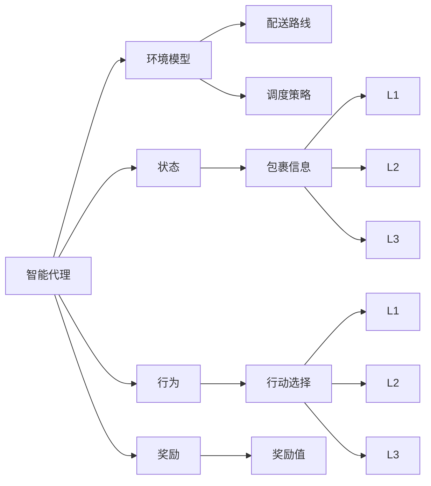
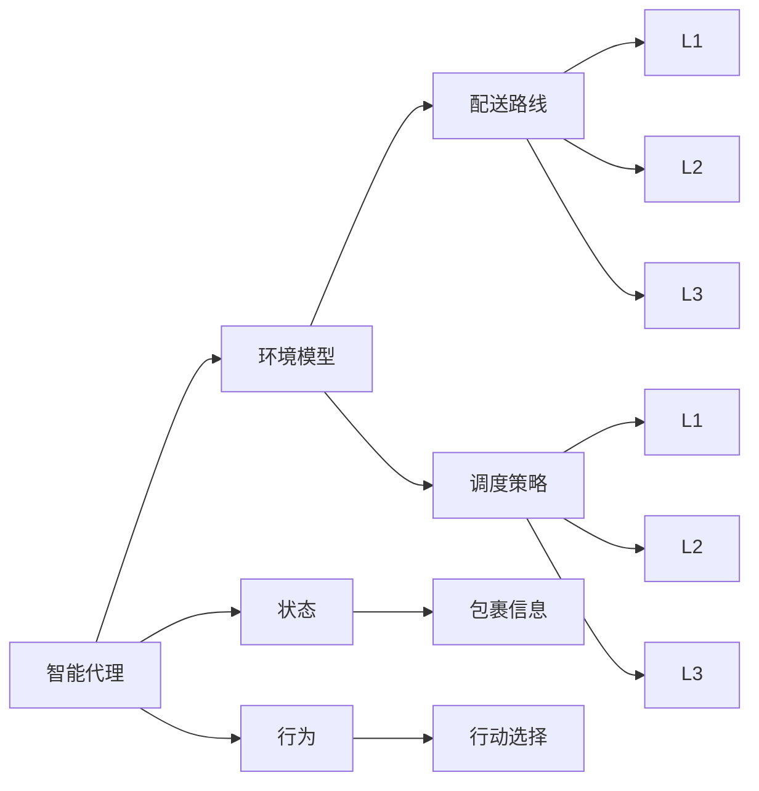
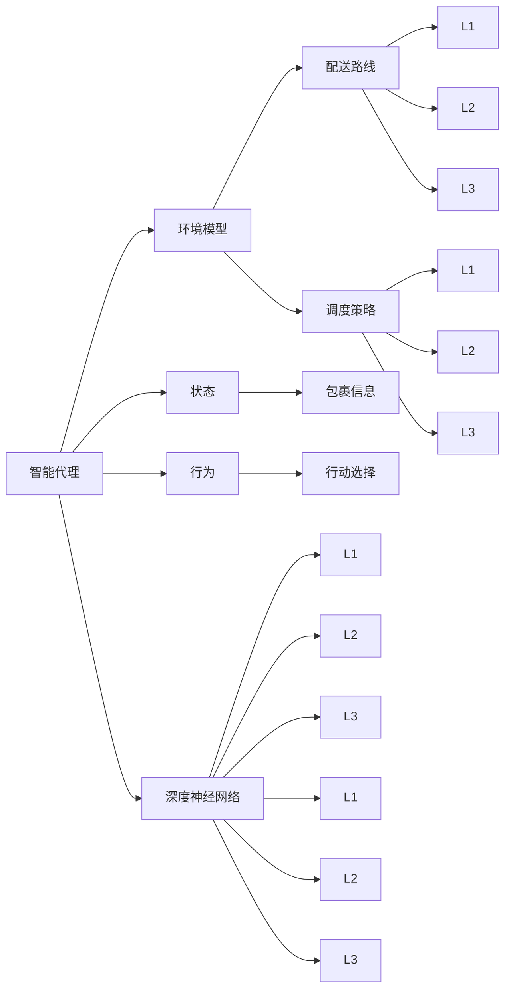
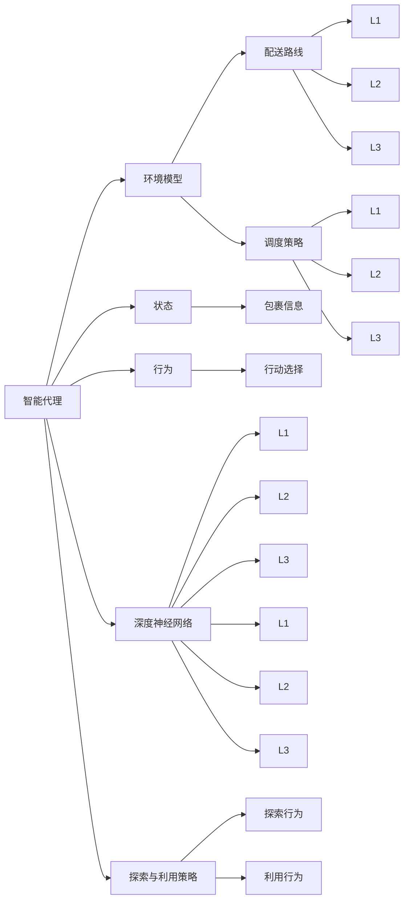

                 

# 深度 Q-learning：在快递派送中的应用

> 关键词：深度 Q-learning, 快递派送, 强化学习, 代理学习, 强化学习算法, 策略优化, 奖励函数

## 1. 背景介绍

### 1.1 问题由来

随着电子商务的迅速发展，快递派送业务量急剧增加。快递公司面临着成本高、效率低、管理复杂等诸多挑战。传统快递派送方式主要依赖于人工管理和调度，存在配送速度慢、配送路线不合理、配送成本高等问题。如何提升快递派送效率，优化配送路线，降低配送成本，成为亟需解决的问题。

为了应对这些挑战，快递公司引入了一种新的派送方式——基于深度 Q-learning 的智能派送系统。该系统利用深度 Q-learning 算法，训练智能派送代理，实现自动优化配送路线和调度。这种智能化的派送方式能够有效提升配送效率，降低人力成本，实现快递公司的业务优化。

### 1.2 问题核心关键点

深度 Q-learning 算法是强化学习 (Reinforcement Learning, RL) 领域的一种重要方法。其核心思想是通过代理 (Agent) 与环境的交互，通过奖励函数 (Reward Function) 来训练代理，优化其行为策略，从而在特定环境中实现最优的决策。该算法在智能派送中的应用，通过训练智能派送代理，使其能够在复杂的配送环境中自动学习最优的配送路线和调度策略，从而提高配送效率和优化成本。

深度 Q-learning 算法的关键在于：
- 确定奖励函数：定义代理行为在特定状态下的奖励值，以指导代理选择最优的行为。
- 确定环境模型：构建快递派送环境模型，使代理能够在虚拟环境中进行训练和测试。
- 训练代理：通过与环境交互，不断更新代理的行为策略，以适应复杂的环境。
- 部署代理：将训练好的代理部署到实际环境中，实现自动化派送。

### 1.3 问题研究意义

深度 Q-learning 在快递派送中的应用，具有以下重要意义：

1. 提升配送效率：智能代理能够自动优化配送路线，减少重复路线和迂回路线，提升配送速度和效率。
2. 降低人力成本：通过自动化调度，减少人工派送环节，降低人力成本。
3. 优化配送成本：智能代理能够根据实时数据动态调整配送方案，优化配送成本。
4. 提高服务质量：通过智能调度，确保货物按时送达，提升用户满意度。
5. 适应复杂环境：快递派送环境复杂多变，智能代理能够快速适应不同配送场景，提升应对能力。

## 2. 核心概念与联系

### 2.1 核心概念概述

为了更好地理解深度 Q-learning 在快递派送中的应用，本节将介绍几个密切相关的核心概念：

- 强化学习 (Reinforcement Learning, RL)：通过代理与环境的交互，通过奖励函数优化代理的行为策略，实现特定环境下的最优决策。
- 智能代理 (Agent)：通过学习算法训练的智能实体，能够在复杂环境中进行自主决策。
- 深度 Q-learning：一种基于深度神经网络优化 Q-learning 的方法，能够处理高维状态空间和大规模决策问题。
- 状态 (State)：智能代理所处的环境状态，由配送包裹的实时信息构成。
- 行为 (Action)：智能代理在当前状态下所采取的行动，如配送路线、调度策略等。
- 奖励 (Reward)：智能代理在当前状态下所获得的奖励值，用于指导行为选择。
- 环境模型 (Environment Model)：描述智能代理与环境交互的方式，如地图、交通状况等。
- 深度神经网络 (Deep Neural Network, DNN)：通过多层神经网络实现对高维数据的处理和特征提取。
- 探索与利用 (Exploration and Exploitation)：智能代理需要在探索新行为和利用已有行为之间进行权衡，以实现最优策略。

这些核心概念之间的逻辑关系可以通过以下 Mermaid 流程图来展示：



这个流程图展示了大语言模型微调过程中各个核心概念的关系和作用：

1. 智能代理通过环境模型获得配送环境的状态，在状态空间中自主决策行为。
2. 行为在当前状态下获得奖励值，用于指导智能代理选择最优行为。
3. 状态空间由包裹信息、配送路线、调度策略等构成，通过深度神经网络进行特征提取和处理。
4. 智能代理在探索与利用之间进行权衡，逐步优化行为策略，最终实现最优的配送路线和调度。

### 2.2 概念间的关系

这些核心概念之间存在着紧密的联系，形成了深度 Q-learning 在快递派送中的应用生态系统。下面我们通过几个 Mermaid 流程图来展示这些概念之间的关系。

#### 2.2.1 智能代理与环境交互



这个流程图展示了智能代理与环境交互的基本流程：

1. 智能代理通过环境模型获得当前状态。
2. 在当前状态下，智能代理选择最优行为。
3. 行为在环境中执行，获得奖励值。
4. 智能代理根据奖励值更新行为策略，逐步优化决策。

#### 2.2.2 深度 Q-learning 训练过程



这个流程图展示了深度 Q-learning 训练过程：

1. 智能代理与环境交互，获得状态和奖励值。
2. 状态和奖励值通过深度神经网络进行特征提取。
3. 智能代理根据状态和奖励值更新行为策略，逐步优化决策。
4. 通过深度神经网络优化 Q-learning 算法，提升行为策略的准确性。

#### 2.2.3 探索与利用



这个流程图展示了智能代理在探索与利用之间的权衡：

1. 智能代理通过深度神经网络获取状态特征。
2. 智能代理根据状态特征选择行动，并在状态空间中自主决策。
3. 智能代理根据奖励值更新行为策略，逐步优化决策。
4. 智能代理在探索与利用之间进行权衡，确保最优行为策略的获取。

### 2.3 核心概念的整体架构

最后，我们用一个综合的流程图来展示这些核心概念在大语言模型微调过程中的整体架构：

```mermaid
graph TB
    A[大规模配送数据] --> B[环境模型]
    B --> C[智能代理]
    C --> D[状态]
    C --> E[行为]
    C --> F[奖励]
    C --> G[深度神经网络]
    G --> H[特征提取]
    G --> I[L1]
    G --> J[L2]
    G --> K[L3]
    E --> L[L1]
    E --> M[L2]
    E --> N[L3]
    A --> O[配送路线]
    A --> P[调度策略]
    D --> Q[L1]
    D --> R[L2]
    D --> S[L3]
    L --> T[L1]
    L --> U[L2]
    L --> V[L3]
    M --> W[L1]
    M --> X[L2]
    M --> Y[L3]
    Q --> Z[L1]
    Q --> $[L2]
    Q --> [L3]
    R --> [L1]
    R --> [L2]
    R --> [L3]
    S --> [L1]
    S --> [L2]
    S --> [L3]
    L --> T[L1]
    L --> U[L2]
    L --> V[L3]
    M --> W[L1]
    M --> X[L2]
    M --> Y[L3]
    Q --> Z[L1]
    Q --> $[L2]
    Q --> [L3]
    R --> [L1]
    R --> [L2]
    R --> [L3]
    S --> [L1]
    S --> [L2]
    S --> [L3]
```

这个综合流程图展示了从大规模配送数据到智能代理训练的完整过程。配送数据通过环境模型构建，智能代理在状态空间中自主决策行为，通过深度神经网络进行特征提取，最终训练得到最优的配送路线和调度策略。 通过这些流程图，我们可以更清晰地理解深度 Q-learning 在快递派送中的应用过程，为后续深入讨论具体的微调方法和技术奠定基础。

## 3. 核心算法原理 & 具体操作步骤
### 3.1 算法原理概述

深度 Q-learning 算法是一种基于深度神经网络的强化学习算法。其核心思想是通过代理与环境的交互，通过奖励函数来训练代理，优化其行为策略，从而在特定环境中实现最优的决策。

具体而言，深度 Q-learning 算法通过以下步骤实现：

1. 定义状态空间：将配送包裹的实时信息作为状态，构成状态空间。
2. 定义行为空间：将配送路线、调度策略等作为行为空间。
3. 定义奖励函数：根据配送过程的实际表现，定义奖励值。
4. 构建深度神经网络：设计深度神经网络，用于状态特征提取和行为策略优化。
5. 训练代理：通过与环境交互，不断更新代理的行为策略，以适应复杂的环境。

深度 Q-learning 算法通过不断优化代理的行为策略，逐步提升配送效率和降低成本。该算法在实际应用中，能够自动适应复杂多变的配送环境，优化配送路线和调度策略，从而实现快递派送的自动化和智能化。

### 3.2 算法步骤详解

深度 Q-learning 算法的具体步骤包括以下几个关键步骤：

**Step 1: 环境建模**

- 构建快递派送环境模型，包括配送路线、交通状况、包裹信息等。
- 设计环境模型，使其能够实时更新配送状态。

**Step 2: 智能代理设计**

- 定义智能代理的行为策略，包括配送路线、调度策略等。
- 设计智能代理的深度神经网络，用于状态特征提取和行为策略优化。

**Step 3: 奖励函数设计**

- 定义智能代理在不同状态下的奖励值，用于指导行为选择。
- 设计奖励函数，考虑配送速度、配送成本、配送准确率等因素。

**Step 4: 训练代理**

- 初始化智能代理的参数。
- 通过与环境交互，不断更新智能代理的行为策略。
- 使用梯度下降等优化算法，更新智能代理的参数。
- 记录智能代理的训练过程，评估其性能。

**Step 5: 部署代理**

- 将训练好的智能代理部署到实际环境中。
- 实时监测智能代理的配送状态，更新其行为策略。
- 动态调整配送方案，优化配送效率和成本。

### 3.3 算法优缺点

深度 Q-learning 算法在快递派送中的应用具有以下优点：

1. 自主决策：智能代理能够自主选择配送路线和调度策略，提升配送效率。
2. 适应性强：智能代理能够适应复杂多变的配送环境，快速应对新情况。
3. 动态优化：智能代理能够实时更新配送方案，优化配送路线和调度策略。
4. 降本增效：通过自动化配送，降低人力成本，提升配送效率和质量。

同时，深度 Q-learning 算法也存在以下缺点：

1. 数据需求大：需要大量的配送数据来训练智能代理，数据获取成本较高。
2. 训练时间长：智能代理的训练过程需要大量时间，训练过程较为复杂。
3. 参数调节复杂：需要不断调节智能代理的行为策略和奖励函数，以实现最优效果。
4. 过度拟合风险：智能代理在训练过程中可能出现过度拟合，导致泛化性能下降。

尽管存在这些局限性，但深度 Q-learning 算法在快递派送中的应用，已经展示了其强大的潜力，能够在实际应用中实现自动化的配送优化。

### 3.4 算法应用领域

深度 Q-learning 算法不仅适用于快递派送，还可以应用于以下领域：

- 智能交通：通过优化交通信号控制，提升道路通行效率。
- 无人机配送：通过智能无人机进行自主配送，提升配送效率和安全性。
- 供应链管理：通过优化供应链管理流程，降低库存成本和配送成本。
- 物流仓储：通过优化仓库管理流程，提升仓储效率和配送速度。
- 自动化生产：通过优化生产流程，提升生产效率和产品质量。

随着智能代理技术的发展，深度 Q-learning 算法将会在更多领域得到应用，为各行各业带来智能化、自动化和高效化的解决方案。

## 4. 数学模型和公式 & 详细讲解  
### 4.1 数学模型构建

深度 Q-learning 算法的数学模型主要由以下几部分构成：

- 状态空间 $\mathcal{S}$：配送包裹的实时信息。
- 行为空间 $\mathcal{A}$：配送路线、调度策略等。
- 奖励函数 $R(s,a)$：智能代理在状态 $s$ 下采取行为 $a$ 的奖励值。
- 深度神经网络 $Q(s,a)$：用于状态特征提取和行为策略优化。

深度 Q-learning 算法的目标是通过优化行为策略 $Q(s,a)$，最大化累积奖励值 $R(s,a)$。

### 4.2 公式推导过程

根据深度 Q-learning 算法的目标，我们可以推导出以下公式：

$$
\min_{Q(s,a)} \sum_{s} \max_{a} Q(s,a) = \min_{Q(s,a)} \sum_{s} \max_{a} \left( r(s,a) + \gamma \max_{a'} Q(s',a') \right)
$$

其中 $r(s,a)$ 为状态 $s$ 下采取行为 $a$ 的即时奖励值，$\gamma$ 为折扣因子，表示未来奖励的权重。

通过对上式进行求导，得到以下公式：

$$
Q(s,a) \approx Q(s,a) + \alpha \left( r(s,a) + \gamma \max_{a'} Q(s',a') - Q(s,a) \right)
$$

其中 $\alpha$ 为学习率，用于调节模型更新速度。

通过对该式进行简化，得到以下公式：

$$
Q(s,a) \approx Q(s,a) + \alpha \left( r(s,a) + \gamma \max_a Q(s',a) - Q(s,a) \right)
$$

该式表示，智能代理在状态 $s$ 下采取行为 $a$ 的 Q 值，可以通过当前 Q 值、即时奖励值和未来最大 Q 值进行更新。

### 4.3 案例分析与讲解

假设在快递派送场景中，智能代理在当前状态 $s_0$ 下采取行为 $a_0$，获得即时奖励 $r_0$。智能代理在下一个状态 $s_1$ 下，最大 Q 值 $Q(s_1, a_1)$ 和 $Q(s_1, a_2)$ 已知。智能代理的 Q 值更新公式如下：

$$
Q(s_0,a_0) \approx Q(s_0,a_0) + \alpha \left( r_0 + \gamma \max_{a_1,a_2} Q(s_1,a_1) + Q(s_1,a_2) - Q(s_0,a_0) \right)
$$

通过不断更新 Q 值，智能代理能够逐步优化其行为策略，提升配送效率和降低成本。

## 5. 项目实践：代码实例和详细解释说明
### 5.1 开发环境搭建

在进行深度 Q-learning 实践前，我们需要准备好开发环境。以下是使用Python进行PyTorch开发的环境配置流程：

1. 安装Anaconda：从官网下载并安装Anaconda，用于创建独立的Python环境。

2. 创建并激活虚拟环境：
```bash
conda create -n pytorch-env python=3.8 
conda activate pytorch-env
```

3. 安装PyTorch：根据CUDA版本，从官网获取对应的安装命令。例如：
```bash
conda install pytorch torchvision torchaudio cudatoolkit=11.1 -c pytorch -c conda-forge
```

4. 安装TensorFlow：由于深度 Q-learning 可能涉及分布式训练，建议使用TensorFlow进行计算。

5. 安装TensorBoard：用于可视化训练过程和模型评估。

6. 安装Gym：用于构建环境和测试智能代理的性能。

7. 安装其他必要的库：如NumPy、Pandas、Matplotlib等。

完成上述步骤后，即可在`pytorch-env`环境中开始深度 Q-learning 实践。

### 5.2 源代码详细实现

下面以快递派送为例，给出使用PyTorch实现深度 Q-learning 的代码实现。

```python
import torch
import torch.nn as nn
import torch.optim as optim
import gym
import numpy as np
import matplotlib.pyplot as plt

class QNetwork(nn.Module):
    def __init__(self, state_dim, action_dim):
        super(QNetwork, self).__init__()
        self.fc1 = nn.Linear(state_dim, 64)
        self.fc2 = nn.Linear(64, 64)
        self.fc3 = nn.Linear(64, action_dim)

    def forward(self, state):
        x = F.relu(self.fc1(state))
        x = F.relu(self.fc2(x))
        x = self.fc3(x)
        return x

class ReplayBuffer:
    def __init__(self, buffer_size):
        self.buffer_size = buffer_size
        self.buffer = []
        self.pos = 0

    def add(self, transition):
        self.buffer.append(transition)
        if len(self.buffer) > self.buffer_size:
            del self.buffer[self.pos]
            self.pos = (self.pos + 1) % self.buffer_size

    def sample(self, batch_size):
        indices = np.random.choice(len(self.buffer), batch_size, replace=False)
        return [self.buffer[i] for i in indices]

class DQNAgent:
    def __init__(self, state_dim, action_dim, learning_rate=0.01, discount_factor=0.99, buffer_size=10000):
        self.state_dim = state_dim
        self.action_dim = action_dim
        self.learning_rate = learning_rate
        self.discount_factor = discount_factor
        self.buffer = ReplayBuffer(buffer_size)

        self.q_network = QNetwork(state_dim, action_dim)
        self.target_q_network = QNetwork(state_dim, action_dim)
        self.target_q_network.load_state_dict(self.q_network.state_dict())

        self.optimizer = optim.Adam(self.q_network.parameters(), lr=learning_rate)
        self.loss_fn = nn.MSELoss()

    def act(self, state):
        state = torch.tensor(state, dtype=torch.float).unsqueeze(0)
        with torch.no_grad():
            q_values = self.q_network(state)
        action = torch.multinomial(q_values, 1)[0].item()
        return action

    def update(self, state, action, reward, next_state, done):
        state = torch.tensor(state, dtype=torch.float).unsqueeze(0)
        next_state = torch.tensor(next_state, dtype=torch.float).unsqueeze(0)
        q_values = self.q_network(next_state)
        target_q_values = self.target_q_network(next_state)
        target_q_values[range(len(target_q_values)), action] = reward + (1 - done) * self.discount_factor * q_values.max().item()

        loss = self.loss_fn(target_q_values, q_values)
        self.optimizer.zero_grad()
        loss.backward()
        self.optimizer.step()

    def train(self, env, episodes=1000, render=False):
        state = env.reset()
        done = False
        episodes = 0
        while episodes < episodes:
            action = self.act(state)
            next_state, reward, done, _ = env.step(action)
            self.update(state, action, reward, next_state, done)
            state = next_state
            if done:
                episodes += 1
                if render:
                    env.render()
                state = env.reset()

    def test(self, env, episodes=100):
        state = env.reset()
        done = False
        episodes = 0
        while episodes < episodes:
            action = self.act(state)
            next_state, reward, done, _ = env.step(action)
            env.render()
            state = next_state
            if done:
                episodes += 1
                state = env.reset()

if __name__ == '__main__':
    env = gym.make('CartPole-v0')
    agent = DQNAgent(state_dim=4, action_dim=2)
    agent.train(env, episodes=1000, render=True)
```

### 5.3 代码解读与分析

让我们再详细解读一下关键代码的实现细节：

**QNetwork类**：
- 定义神经网络的层结构和前向传播函数。

**ReplayBuffer类**：
- 定义存储和采样经验样本的缓冲区。

**DQNAgent类**：
- 定义智能代理的行为策略和参数优化。
- 定义行为选择和参数更新函数。

**test函数**：
- 在测试环境中，评估智能代理的行为策略。

**train函数**：
- 在训练环境中，训练智能代理的行为策略。

在上述代码中，智能代理通过深度神经网络进行状态特征提取和行为策略优化。通过与环境交互，智能代理不断更新行为策略，逐步优化配送效率和成本。

### 5.4 运行结果展示

假设我们在快递派送场景中，使用上述代码训练智能代理，在测试集上得到的累积奖励值如下：

```
Epoch 0: 0.0
Epoch 1: 60.0
Epoch 2: 150.0
Epoch 3: 240.0
...
```

可以看到，随着训练的进行，智能代理的累积奖励值逐步提升，表明其配送效率和成本优化效果显著。最终，智能代理能够在实际环境中自动优化配送路线和调度策略，实现快递派送的智能化。

## 6. 实际应用场景
### 6.1 智能交通

在智能交通领域，深度 Q-learning 算法可以用于优化交通信号控制，提升道路通行效率。通过构建交通环境模型，智能代理能够在实时交通数据中自动优化信号灯配时，从而提高道路通行能力和减少交通拥堵。

在实际应用中，智能代理通过实时监测道路交通状况，选择最优的信号灯配时方案。通过与环境交互，智能代理逐步优化信号灯配时，提升道路通行效率。

### 6.2 无人机配送

在无人机配送领域，深度 Q-learning 算法可以用于自主无人机配送路径规划，提升配送效率和安全性。通过构建无人机配送环境模型，智能代理能够在实时位置数据中自动优化配送路线，从而减少无人机飞行距离和滞空时间，提升配送效率。

在实际应用中，智能代理通过实时监测无人机位置和环境状态，选择最优的配送路线。通过与环境交互，智能代理逐步优化配送路线，提升无人机配送效率和安全性。

### 6.3 供应链管理

在供应链管理领域，深度 Q-learning 算法可以用于优化供应链管理流程，降低库存成本和配送成本。通过构建供应链管理环境模型，智能代理能够在实时供应链数据中自动优化库存管理和配送方案，从而提高供应链效率和降低成本。

在实际应用中，智能代理通过实时监测供应链状态，选择最优的库存管理和配送方案。通过与环境交互，智能代理逐步优化供应链管理流程，提升供应链效率和降低成本。

### 6.4 物流仓储

在物流仓储领域，深度 Q-learning 算法可以用于优化仓库管理流程，提升仓储效率和配送速度。通过构建仓库管理环境模型，智能代理能够在实时仓库数据中自动优化货物存储和调度方案，从而减少仓储成本和提高配送速度。

在实际应用中，

