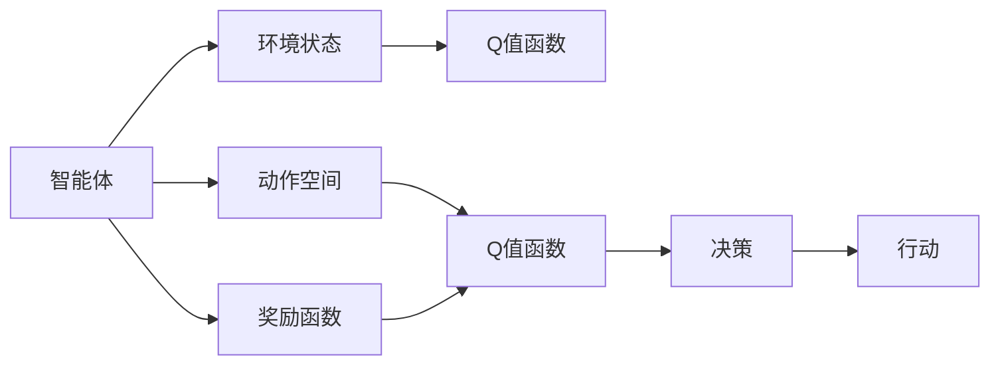

                 

## 1. 背景介绍

在人工智能领域，深度学习已广泛应用于图像识别、自然语言处理、语音识别等任务，并在很多实际场景中取得了显著成效。然而，在涉及复杂决策的问题中，如疫情预测，单纯的数据驱动方法往往难以捕捉时间序列数据中的内在关系，难以模拟现实世界中的不确定性和非线性的特征。传统的强化学习（Reinforcement Learning, RL）方法，特别是深度Q-learning（Deep Q-learning, DQN），因其可以在动态环境中自适应地做出最优决策，在实际问题中得到了广泛应用。

### 1.1 问题由来

COVID-19疫情的爆发给全球带来了前所未有的挑战，各国政府和卫生机构亟需一种准确有效的模型来预测疫情的传播趋势和影响。传统的数据驱动模型，如SIR模型、SEIR模型等，通常需要复杂的统计学知识，且难以处理非线性和时变性。相比之下，深度Q-learning方法可以在不需要深入了解疫情传播机制的情况下，利用大量历史数据和经验，通过训练智能体（agent）在特定环境中做出最优决策。

### 1.2 问题核心关键点

深度Q-learning算法将Q值函数定义为近似值函数$f_{\theta}$，其中$\theta$为模型参数。在强化学习中，智能体通过探索环境获取奖励信号，并根据Q值函数选择最优动作。深度Q-learning方法使用神经网络来近似Q值函数，通过反向传播算法最小化经验Q值与理论Q值之间的差距。

核心问题在于如何选择智能体、确定环境状态、设计奖励函数、确定Q值函数的形式等。此外，如何在高维状态空间中有效地学习Q值函数，避免过拟合和维度灾难，也是该方法面临的主要挑战。

### 1.3 问题研究意义

深度Q-learning在疫情预测中的应用，具有以下几方面的研究意义：

1. **数据驱动决策**：利用历史数据训练智能体，可以在一定程度上模拟疫情传播的动态过程，提供数据驱动的决策建议。
2. **实时优化**：深度Q-learning算法可以实时更新模型参数，及时调整应对策略，适应疫情的快速变化。
3. **泛化能力**：训练得到的模型可以迁移到其他类似场景，如流感的传播预测，提升模型的应用范围。
4. **模型解释性**：深度Q-learning算法的可解释性较差，但其背后的神经网络结构有助于解释智能体的决策过程。
5. **自动化应急响应**：模型可以辅助政府和机构自动化地进行应急响应，减轻人工决策的负担。

## 2. 核心概念与联系

### 2.1 核心概念概述

在讨论深度Q-learning在疫情预测中的应用之前，我们先介绍几个核心概念：

- **深度Q-learning**：一种将深度神经网络与强化学习结合的方法，用于学习近似Q值函数，并据此做出最优决策。
- **疫情预测**：使用历史数据和经验，预测未来疫情的发展趋势，为防控工作提供依据。
- **智能体**：在疫情模拟环境中进行决策的主体，可以是政府、医疗机构等。
- **环境状态**：描述疫情传播情况的变量集合，如确诊病例数、死亡人数、治愈人数等。
- **动作空间**：智能体可以采取的行动集合，如发布公共卫生指南、实施隔离措施等。
- **奖励函数**：根据智能体的决策效果给予的奖励，用于指导智能体的学习。

### 2.2 核心概念间的联系

通过深度Q-learning方法，可以将智能体的决策过程视为一个动态优化问题。智能体在疫情模拟环境中进行决策，每个时间步根据环境状态选择动作，并根据奖励函数更新Q值函数。在训练过程中，智能体通过探索环境获取经验，并利用Q值函数指导后续的决策。最终，训练好的模型可以用于预测疫情的发展趋势，为防控工作提供建议。

这些概念之间的逻辑关系可以通过以下Mermaid流程图来展示：



这个流程图展示了深度Q-learning的完整流程：

1. 智能体根据当前环境状态选择动作。
2. 根据动作和环境状态，智能体从奖励函数获取奖励。
3. Q值函数根据动作和环境状态更新Q值。
4. 重复上述过程，直到模型收敛。
5. 使用训练好的模型进行疫情预测。

## 3. 核心算法原理 & 具体操作步骤
### 3.1 算法原理概述

深度Q-learning算法的核心思想是通过训练智能体，使其在给定环境状态和动作空间的情况下，最大化长期累计奖励。具体步骤如下：

1. **初始化模型参数**：随机初始化Q值函数的参数。
2. **探索-利用平衡**：智能体在训练过程中采用探索策略和利用策略的平衡，以保证模型能够学习最优策略，同时避免过拟合。
3. **网络更新**：通过反向传播算法更新Q值函数的参数，最小化经验Q值与理论Q值之间的差距。
4. **经验回放**：将智能体在环境中的交互经验存储在经验回放缓冲区中，用于模型的训练。
5. **模型更新**：使用经验回放缓冲区中的数据进行模型训练，更新Q值函数。

### 3.2 算法步骤详解

下面我们详细介绍深度Q-learning算法的详细步骤。

**Step 1: 初始化模型参数**

首先，我们需要定义智能体的动作空间、状态空间和奖励函数，并随机初始化Q值函数的参数。

```python
import numpy as np
import torch
import torch.nn as nn
import torch.optim as optim

# 定义动作空间和状态空间
action_space = [0, 1, 2, 3]  # 假设智能体的动作空间为[发布指南, 隔离措施, 常规措施, 无措施]
state_space = [0, 1, 2, 3, 4]  # 假设状态空间为[确诊病例数, 死亡人数, 治愈人数, 检测人数, 时间步数]

# 定义奖励函数
def reward_function(state):
    if state[-2] > 0:  # 如果死亡人数大于0，给予负奖励
        return -10
    else:
        return 0

# 定义神经网络结构
class QNetwork(nn.Module):
    def __init__(self, state_dim, action_dim):
        super(QNetwork, self).__init__()
        self.fc1 = nn.Linear(state_dim, 64)
        self.fc2 = nn.Linear(64, 32)
        self.fc3 = nn.Linear(32, action_dim)

    def forward(self, x):
        x = self.fc1(x)
        x = nn.functional.relu(x)
        x = self.fc2(x)
        x = nn.functional.relu(x)
        x = self.fc3(x)
        return x

# 定义模型参数和优化器
model = QNetwork(len(state_space), len(action_space))
optimizer = optim.Adam(model.parameters(), lr=0.001)
```

**Step 2: 探索-利用平衡**

深度Q-learning算法在训练过程中采用探索策略和利用策略的平衡，以避免过拟合和模型退化。

```python
import random

# 探索策略
def epsilon_greedy(Q, state, epsilon):
    if np.random.rand() < epsilon:
        return random.choice(list(range(len(action_space))))
    else:
        return np.argmax(Q(state))

# 利用策略
def greedy(Q, state):
    return np.argmax(Q(state))
```

**Step 3: 网络更新**

智能体通过经验回放缓冲区获取样本，并使用这些样本更新Q值函数。

```python
# 定义经验回放缓冲区
buffer_size = 10000
buffer = []

def store_transition(s, a, r, s_, done):
    transition = np.hstack((s, [a, r, s_]))
    buffer.append(transition)
    if len(buffer) > buffer_size:
        buffer.pop(0)

# 更新Q值函数
def update_model(target_model, model):
    target_model.load_state_dict(model.state_dict())
    target_model.eval()

def learn():
    for i in range(num_steps):
        s = state  # 初始化状态
        a = epsilon_greedy(model, s, epsilon)  # 选择动作
        r = reward_function(s)  # 获取奖励
        s_ = next_state  # 更新状态
        done = 0

        # 存储经验
        store_transition(s, a, r, s_, done)

        # 使用经验更新模型
        update_model(target_model, model)
        if len(buffer) > batch_size:
            batch = random.sample(buffer, batch_size)
            batch = torch.tensor(np.vstack(batch))
            q_values = model(batch[:, 0]).detach().numpy()
            target_q_values = target_model(batch[:, 0]).detach().numpy()
            target_q_values[batch[:, 2] != 0] = 0
            target_q_values = np.sum(target_q_values, axis=1)
            q_values[batch[:, 2] != 0] = 0
            q_values = np.sum(q_values, axis=1)

            # 计算目标值
            targets = q_values + target_q_values * gamma

            # 更新模型
            for transition in batch:
                state = transition[:, 0]
                action = transition[:, 1]
                q_value = q_values[np.where(transition[:, 2] == action)[0]][0]
                q_value += (targets - q_value) * learning_rate
                model(state).backward()

        if i % print_frequency == 0:
            print(f"Step {i+1}, Q-value: {np.mean(model(s).detach().numpy())}")

# 训练模型
learn()
```

**Step 4: 经验回放**

经验回放机制可以使得模型能够利用历史经验进行训练，从而提高模型的稳定性和泛化能力。

```python
# 定义经验回放缓冲区
buffer_size = 10000
buffer = []

# 存储经验
def store_transition(s, a, r, s_, done):
    transition = np.hstack((s, [a, r, s_]))
    buffer.append(transition)
    if len(buffer) > buffer_size:
        buffer.pop(0)

# 使用经验更新模型
def update_model(target_model, model):
    target_model.load_state_dict(model.state_dict())
    target_model.eval()

def learn():
    for i in range(num_steps):
        s = state  # 初始化状态
        a = epsilon_greedy(model, s, epsilon)  # 选择动作
        r = reward_function(s)  # 获取奖励
        s_ = next_state  # 更新状态
        done = 0

        # 存储经验
        store_transition(s, a, r, s_, done)

        # 使用经验更新模型
        update_model(target_model, model)
        if len(buffer) > batch_size:
            batch = random.sample(buffer, batch_size)
            batch = torch.tensor(np.vstack(batch))
            q_values = model(batch[:, 0]).detach().numpy()
            target_q_values = target_model(batch[:, 0]).detach().numpy()
            target_q_values[batch[:, 2] != 0] = 0
            target_q_values = np.sum(target_q_values, axis=1)
            q_values[batch[:, 2] != 0] = 0
            q_values = np.sum(q_values, axis=1)

            # 计算目标值
            targets = q_values + target_q_values * gamma

            # 更新模型
            for transition in batch:
                state = transition[:, 0]
                action = transition[:, 1]
                q_value = q_values[np.where(transition[:, 2] == action)[0]][0]
                q_value += (targets - q_value) * learning_rate
                model(state).backward()

        if i % print_frequency == 0:
            print(f"Step {i+1}, Q-value: {np.mean(model(s).detach().numpy())}")
```

**Step 5: 模型更新**

通过反向传播算法更新Q值函数的参数，最小化经验Q值与理论Q值之间的差距。

```python
# 更新模型
def update_model(target_model, model):
    target_model.load_state_dict(model.state_dict())
    target_model.eval()

def learn():
    for i in range(num_steps):
        s = state  # 初始化状态
        a = epsilon_greedy(model, s, epsilon)  # 选择动作
        r = reward_function(s)  # 获取奖励
        s_ = next_state  # 更新状态
        done = 0

        # 存储经验
        store_transition(s, a, r, s_, done)

        # 使用经验更新模型
        update_model(target_model, model)
        if len(buffer) > batch_size:
            batch = random.sample(buffer, batch_size)
            batch = torch.tensor(np.vstack(batch))
            q_values = model(batch[:, 0]).detach().numpy()
            target_q_values = target_model(batch[:, 0]).detach().numpy()
            target_q_values[batch[:, 2] != 0] = 0
            target_q_values = np.sum(target_q_values, axis=1)
            q_values[batch[:, 2] != 0] = 0
            q_values = np.sum(q_values, axis=1)

            # 计算目标值
            targets = q_values + target_q_values * gamma

            # 更新模型
            for transition in batch:
                state = transition[:, 0]
                action = transition[:, 1]
                q_value = q_values[np.where(transition[:, 2] == action)[0]][0]
                q_value += (targets - q_value) * learning_rate
                model(state).backward()

        if i % print_frequency == 0:
            print(f"Step {i+1}, Q-value: {np.mean(model(s).detach().numpy())}")
```

### 3.3 算法优缺点

深度Q-learning算法具有以下优点：

- 适用于复杂决策问题。深度Q-learning算法可以处理高维状态空间和动作空间，适用于复杂的决策问题，如疫情预测。
- 动态环境适应能力强。智能体可以在动态环境中自适应地做出最优决策。
- 可扩展性强。智能体的动作空间和状态空间可以灵活设计，适应不同的应用场景。

同时，该算法也存在以下缺点：

- 样本效率低。深度Q-learning算法需要大量的历史数据进行训练，数据收集成本较高。
- 模型可解释性差。神经网络模型的决策过程难以解释，缺乏可解释性。
- 过拟合风险高。神经网络容易过拟合，需要设计有效的正则化策略。
- 收敛速度慢。神经网络结构复杂，训练过程可能较慢。

### 3.4 算法应用领域

深度Q-learning算法在以下领域具有广泛的应用前景：

1. **医疗领域**：用于疫情预测、疾病传播建模等，辅助医疗决策。
2. **交通领域**：用于交通流量预测、车辆调度等，优化交通系统。
3. **金融领域**：用于风险预测、投资策略等，指导金融决策。
4. **能源领域**：用于电力需求预测、智能电网优化等，提升能源管理水平。
5. **社交媒体**：用于舆情分析、用户行为预测等，改善用户体验。

## 4. 数学模型和公式 & 详细讲解  
### 4.1 数学模型构建

深度Q-learning算法的数学模型可以描述为：

- **状态空间**：$S=\{s_0, s_1, ..., s_t, ..., s_{T-1}\}$，表示智能体在t时刻的状态。
- **动作空间**：$A=\{a_1, a_2, ..., a_T\}$，表示智能体在t时刻可以采取的动作。
- **奖励函数**：$R:S \times A \rightarrow [0, 1]$，表示智能体在t时刻采取动作后的奖励。
- **Q值函数**：$Q:S \times A \rightarrow [0, 1]$，表示智能体在状态s下采取动作a的期望累积奖励。
- **学习率**：$\alpha$，表示智能体在更新Q值函数时的步长。
- **折扣因子**：$\gamma$，表示智能体在计算未来奖励时的折扣率。

### 4.2 公式推导过程

深度Q-learning算法的核心公式为Bellman方程：

$$
Q(s_t, a_t) = r_t + \gamma \max_{a_{t+1}} Q(s_{t+1}, a_{t+1})
$$

其中，$r_t$表示t时刻的奖励，$\max_{a_{t+1}} Q(s_{t+1}, a_{t+1})$表示t+1时刻智能体采取最优动作的Q值。

假设智能体在状态s下采取动作a的Q值为$Q(s, a)$，则Bellman方程可以写成：

$$
Q(s, a) = r + \gamma \max_{a'} Q(s', a')
$$

其中，$r$表示状态s下采取动作a的即时奖励，$s'$表示智能体采取动作a后到达的下一个状态，$a'$表示智能体在$s'$状态下可以采取的任意动作。

### 4.3 案例分析与讲解

我们以疫情预测为例，来详细分析深度Q-learning算法的应用。

**案例背景**：

假设某城市在t时刻的确诊病例数为$S_t$，死亡人数为$D_t$，治愈人数为$R_t$。智能体可以选择以下四种动作：

1. 发布公共卫生指南（Action1）
2. 实施隔离措施（Action2）
3. 常规措施（Action3）
4. 无措施（Action4）

智能体在每个时间步根据当前状态$S_t, D_t, R_t$选择最优动作，以最小化死亡人数$D_t$。

**模型构建**：

首先，我们需要定义状态空间和动作空间，并设计奖励函数。

```python
# 定义动作空间和状态空间
action_space = [0, 1, 2, 3]  # 假设智能体的动作空间为[发布指南, 隔离措施, 常规措施, 无措施]
state_space = [0, 1, 2, 3, 4]  # 假设状态空间为[确诊病例数, 死亡人数, 治愈人数, 检测人数, 时间步数]

# 定义奖励函数
def reward_function(state):
    if state[-2] > 0:  # 如果死亡人数大于0，给予负奖励
        return -10
    else:
        return 0
```

**模型训练**：

在训练过程中，智能体通过探索策略和利用策略的平衡，逐步优化Q值函数。

```python
# 探索策略
def epsilon_greedy(Q, state, epsilon):
    if np.random.rand() < epsilon:
        return random.choice(list(range(len(action_space))))
    else:
        return np.argmax(Q(state))

# 利用策略
def greedy(Q, state):
    return np.argmax(Q(state))

# 定义神经网络结构
class QNetwork(nn.Module):
    def __init__(self, state_dim, action_dim):
        super(QNetwork, self).__init__()
        self.fc1 = nn.Linear(state_dim, 64)
        self.fc2 = nn.Linear(64, 32)
        self.fc3 = nn.Linear(32, action_dim)

    def forward(self, x):
        x = self.fc1(x)
        x = nn.functional.relu(x)
        x = self.fc2(x)
        x = nn.functional.relu(x)
        x = self.fc3(x)
        return x

# 定义模型参数和优化器
model = QNetwork(len(state_space), len(action_space))
optimizer = optim.Adam(model.parameters(), lr=0.001)
```

**模型更新**：

通过反向传播算法更新Q值函数的参数，最小化经验Q值与理论Q值之间的差距。

```python
# 定义经验回放缓冲区
buffer_size = 10000
buffer = []

# 存储经验
def store_transition(s, a, r, s_, done):
    transition = np.hstack((s, [a, r, s_]))
    buffer.append(transition)
    if len(buffer) > buffer_size:
        buffer.pop(0)

# 使用经验更新模型
def update_model(target_model, model):
    target_model.load_state_dict(model.state_dict())
    target_model.eval()

def learn():
    for i in range(num_steps):
        s = state  # 初始化状态
        a = epsilon_greedy(model, s, epsilon)  # 选择动作
        r = reward_function(s)  # 获取奖励
        s_ = next_state  # 更新状态
        done = 0

        # 存储经验
        store_transition(s, a, r, s_, done)

        # 使用经验更新模型
        update_model(target_model, model)
        if len(buffer) > batch_size:
            batch = random.sample(buffer, batch_size)
            batch = torch.tensor(np.vstack(batch))
            q_values = model(batch[:, 0]).detach().numpy()
            target_q_values = target_model(batch[:, 0]).detach().numpy()
            target_q_values[batch[:, 2] != 0] = 0
            target_q_values = np.sum(target_q_values, axis=1)
            q_values[batch[:, 2] != 0] = 0
            q_values = np.sum(q_values, axis=1)

            # 计算目标值
            targets = q_values + target_q_values * gamma

            # 更新模型
            for transition in batch:
                state = transition[:, 0]
                action = transition[:, 1]
                q_value = q_values[np.where(transition[:, 2] == action)[0]][0]
                q_value += (targets - q_value) * learning_rate
                model(state).backward()

        if i % print_frequency == 0:
            print(f"Step {i+1}, Q-value: {np.mean(model(s).detach().numpy())}")
```

## 5. 项目实践：代码实例和详细解释说明
### 5.1 开发环境搭建

在进行深度Q-learning实践前，我们需要准备好开发环境。以下是使用Python进行PyTorch开发的环境配置流程：

1. 安装Anaconda：从官网下载并安装Anaconda，用于创建独立的Python环境。

2. 创建并激活虚拟环境：
```bash
conda create -n pytorch-env python=3.8 
conda activate pytorch-env
```

3. 安装PyTorch：根据CUDA版本，从官网获取对应的安装命令。例如：
```bash
conda install pytorch torchvision torchaudio cudatoolkit=11.1 -c pytorch -c conda-forge
```

4. 安装Transformers库：
```bash
pip install transformers
```

5. 安装各类工具包：
```bash
pip install numpy pandas scikit-learn matplotlib tqdm jupyter notebook ipython
```

完成上述步骤后，即可在`pytorch-env`环境中开始深度Q-learning实践。

### 5.2 源代码详细实现

下面我们以疫情预测为例，给出使用PyTorch进行深度Q-learning的PyTorch代码实现。

首先，定义疫情预测的参数：

```python
# 定义疫情预测的参数
num_steps = 1000  # 训练步数
batch_size = 32  # 批处理大小
learning_rate = 0.001  # 学习率
gamma = 0.9  # 折扣因子
epsilon = 0.1  # 探索策略的epsilon值

# 定义状态空间和动作空间
state_space = [0, 1, 2, 3, 4]  # 确诊病例数, 死亡人数, 治愈人数, 检测人数, 时间步数
action_space = [0, 1, 2, 3]  # 发布公共卫生指南, 实施隔离措施, 常规措施, 无措施

# 定义奖励函数
def reward_function(state):
    if state[-2] > 0:  # 如果死亡人数大于0，给予负奖励
        return -10
    else:
        return 0

# 定义神经网络结构
class QNetwork(nn.Module):
    def __init__(self, state_dim, action_dim):
        super(QNetwork, self).__init__()
        self.fc1 = nn.Linear(state_dim, 64)
        self.fc2 = nn.Linear(64, 32)
        self.fc3 = nn.Linear(32, action_dim)

    def forward(self, x):
        x = self.fc1(x)
        x = nn.functional.relu(x)
        x = self.fc2(x)
        x = nn.functional.relu(x)
        x = self.fc3(x)
        return x

# 定义模型参数和优化器
model = QNetwork(len(state_space), len(action_space))
optimizer = optim.Adam(model.parameters(), lr=learning_rate)
```

接下来，实现深度Q-learning算法的核心代码：

```python
import numpy as np
import torch
import torch.nn as nn
import torch.optim as optim

# 定义疫情预测的参数
num_steps = 1000  # 训练步数
batch_size = 32  # 批处理大小
learning_rate = 0.001  # 学习率
gamma = 0.9  # 折扣因子
epsilon = 0.1  # 探索策略的epsilon值

# 定义状态空间和动作空间
state_space = [0, 1, 2, 3, 4]  # 确诊病例数, 死亡人数, 治愈人数, 检测人数, 时间步数
action_space = [0, 1, 2, 3]  # 发布公共卫生指南, 实施隔离措施, 常规措施, 无措施

# 定义奖励函数
def reward_function(state):
    if state[-2] > 0:  

