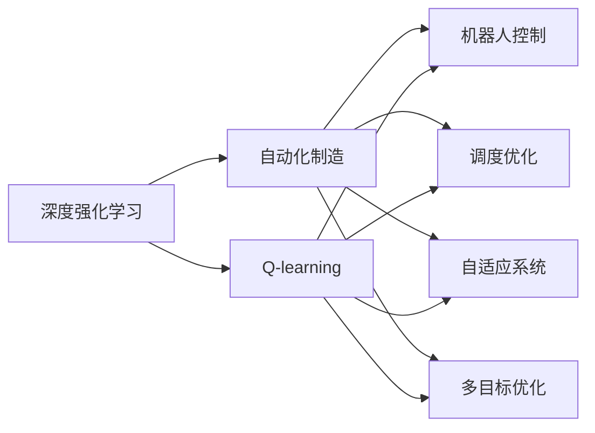
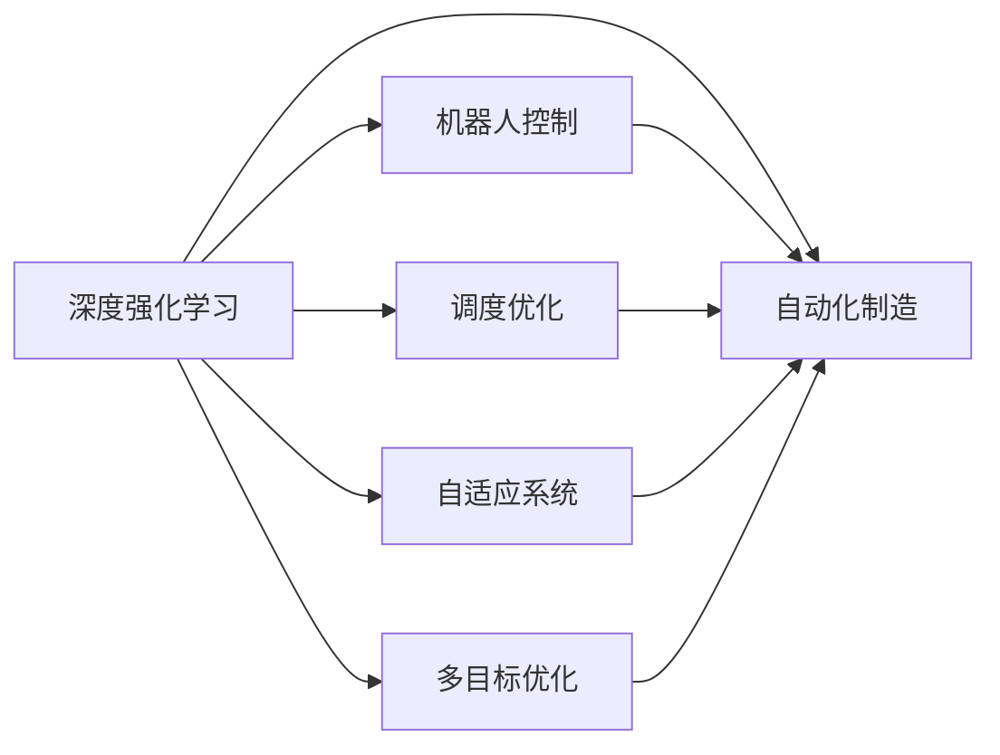
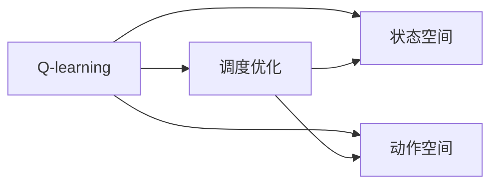
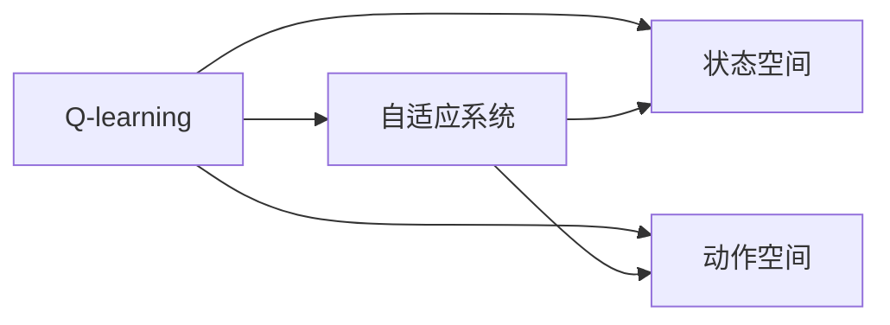
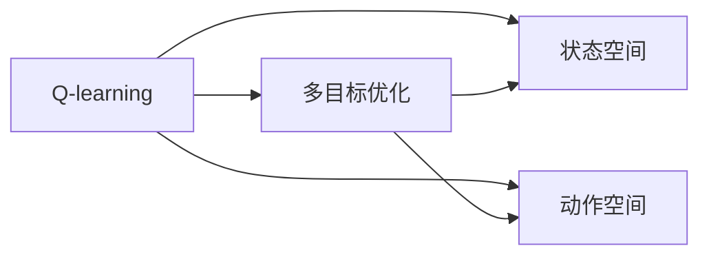
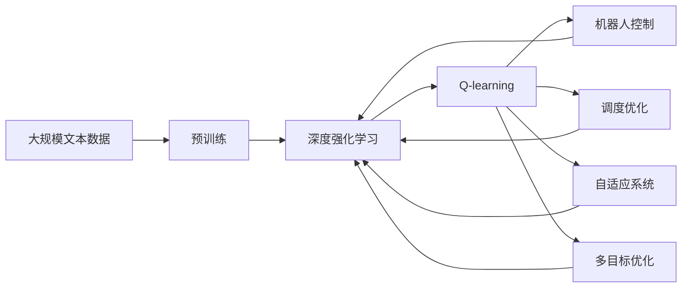

                 

# 深度 Q-learning：在自动化制造中的应用

> 关键词：深度强化学习, Q-learning, 自动化制造, 机器人控制, 调度优化, 自适应系统, 未来应用展望

## 1. 背景介绍

### 1.1 问题由来
自动化制造（Automated Manufacturing）是现代工业生产的重要组成部分，通过自动化系统将原材料转化为成品，旨在提高生产效率、降低生产成本、提升产品质量。近年来，随着物联网、人工智能等技术的发展，自动化制造系统越来越依赖于智能化的决策支持，以应对日益复杂多变的外部环境。

在此背景下，强化学习（Reinforcement Learning, RL）成为了自动化制造领域的热门技术之一。通过模拟环境与智能体交互，强化学习算法能够学习到最优的决策策略，从而显著提升自动化系统的性能和可靠性。

### 1.2 问题核心关键点
强化学习在自动化制造中的应用，主要体现在以下几个方面：
- 机器人控制：通过强化学习算法，优化机器人手臂的路径规划、姿态控制、物体抓取等操作，提高自动化生产的灵活性和准确性。
- 调度优化：在生产线上，通过强化学习算法优化机器间的调度顺序、任务分配等，提升生产效率和资源利用率。
- 自适应系统：强化学习算法能够根据实时数据，动态调整自动化系统的控制参数，实现系统的自适应调节。
- 多目标优化：在生产过程中，往往存在多个相互冲突的目标（如成本、质量、交货期等），强化学习算法能够协调这些目标，找到最优的折中方案。
- 学习与仿真：强化学习算法能够从实际数据中学习，并通过仿真环境验证和优化，提高算法的稳定性和泛化能力。

### 1.3 问题研究意义
强化学习在自动化制造中的应用，对于提升生产效率、降低生产成本、提高产品质量具有重要意义：

1. 提升自动化系统的灵活性和适应性。强化学习算法能够根据生产环境的变化，实时调整系统的行为策略，提升自动化系统的灵活性和鲁棒性。
2. 优化生产流程，提升资源利用率。强化学习算法能够动态优化生产流程，协调机器间的调度，减少资源浪费，提高生产效率。
3. 提高生产系统的自适应性和自学习能力。通过强化学习算法，自动化系统能够自我学习和调整，从而适应更加复杂多变的环境。
4. 促进生产过程的智能化。强化学习算法能够将复杂多变的信息转化为系统可理解的决策，提升生产过程的智能化水平。
5. 推动工业4.0进程。强化学习算法在生产中的应用，是工业4.0时代智能工厂的重要技术手段，有助于推动智能制造的产业化进程。

## 2. 核心概念与联系

### 2.1 核心概念概述

为更好地理解深度 Q-learning 在自动化制造中的应用，本节将介绍几个密切相关的核心概念：

- 深度强化学习（Deep Reinforcement Learning, DRL）：将深度神经网络与强化学习相结合，学习复杂的决策模型。
- Q-learning：一种基于价值函数的强化学习算法，通过不断尝试和反馈，学习最优的策略。
- 自动化制造：通过自动化系统实现生产过程的智能化和自动化。
- 机器人控制：通过智能算法优化机器人操作，实现精确的自动化生产。
- 调度优化：通过智能算法优化生产流程，提升资源利用率和生产效率。
- 自适应系统：系统能够根据环境变化动态调整行为策略，实现自我优化。
- 多目标优化：在多个目标之间找到最优的平衡点，满足生产过程中的各种需求。

这些核心概念之间的逻辑关系可以通过以下Mermaid流程图来展示：



这个流程图展示了大语言模型微调过程中各个核心概念的关系和作用：

1. 深度强化学习：提供一种学习机制，学习到最优的决策策略。
2. Q-learning：一种强化学习算法，通过不断尝试和反馈，学习最优策略。
3. 自动化制造：应用深度强化学习和Q-learning算法，提升生产过程的智能化和自动化。
4. 机器人控制：通过Q-learning算法，优化机器人的操作策略。
5. 调度优化：通过Q-learning算法，优化生产流程，提升资源利用率和生产效率。
6. 自适应系统：通过Q-learning算法，系统能够动态调整行为策略，实现自我优化。
7. 多目标优化：通过Q-learning算法，找到多个目标之间的最优平衡点。

这些核心概念共同构成了深度 Q-learning 在自动化制造中的应用框架，使得智能决策能够更好地应用于实际生产场景。

### 2.2 概念间的关系

这些核心概念之间存在着紧密的联系，形成了深度 Q-learning 在自动化制造中的应用生态系统。下面我通过几个Mermaid流程图来展示这些概念之间的关系。

#### 2.2.1 深度强化学习与自动化制造的关系



这个流程图展示了深度强化学习在自动化制造中的应用，通过学习最优的决策策略，提升机器人控制、调度优化、自适应系统和多目标优化等方面性能。

#### 2.2.2 Q-learning在机器人控制中的应用


这个流程图展示了Q-learning在机器人控制中的应用，通过学习状态与动作之间的价值函数，优化机器人手臂的路径规划、姿态控制等操作。

#### 2.2.3 调度优化中的Q-learning



这个流程图展示了Q-learning在调度优化中的应用，通过学习状态与动作之间的价值函数，优化机器间的调度顺序、任务分配等。

#### 2.2.4 自适应系统中的Q-learning



这个流程图展示了Q-learning在自适应系统中的应用，通过学习状态与动作之间的价值函数，动态调整自动化系统的控制参数。

#### 2.2.5 多目标优化中的Q-learning



这个流程图展示了Q-learning在多目标优化中的应用，通过学习状态与动作之间的价值函数，找到多个目标之间的最优平衡点。

### 2.3 核心概念的整体架构

最后，我们用一个综合的流程图来展示这些核心概念在大语言模型微调过程中的整体架构：



这个综合流程图展示了从预训练到深度强化学习和Q-learning的大语言模型微调过程。深度强化学习和大语言模型分别作为两个重要环节，与机器人控制、调度优化、自适应系统和多目标优化等任务相互协同，共同提升自动化制造系统的性能。

## 3. 核心算法原理 & 具体操作步骤
### 3.1 算法原理概述

深度 Q-learning 是一种基于深度神经网络的强化学习算法，用于学习决策策略，使智能体能够在特定环境中获取最优的长期奖励。其核心思想是通过不断尝试和反馈，更新状态值函数（Q函数），从而学习到最优的策略。

假设环境状态为 $s_t$，智能体在时间 $t$ 时采取的动作为 $a_t$，下一个状态为 $s_{t+1}$，获得的奖励为 $r_{t+1}$。深度 Q-learning 的目标是最大化长期奖励的期望值，即：

$$
Q(s_t, a_t) = \mathbb{E}_{\pi}[G_t | s_t, a_t]
$$

其中 $G_t$ 为时间 $t$ 时从当前状态 $s_t$ 开始到未来无穷时刻的期望总奖励。在实际应用中，通常将 Q-learning 与深度神经网络相结合，构建深度 Q-learning 模型，以更好地处理复杂的环境和动作空间。

### 3.2 算法步骤详解

深度 Q-learning 的实现一般包括以下几个关键步骤：

**Step 1: 准备数据集和环境**

- 收集自动化制造系统的历史数据，包括状态和动作的数据集，以及相应的奖励值。
- 构建自动化制造环境的模拟环境，用于训练深度 Q-learning 模型。环境可以是一个简单的模拟空间，也可以是一个复杂的虚拟现实环境。

**Step 2: 构建深度 Q-learning 模型**

- 设计深度神经网络作为 Q-learning 的函数逼近器，通常使用卷积神经网络（CNN）、循环神经网络（RNN）或变分自编码器（VAE）等结构。
- 定义 Q 函数的输入和输出，以及损失函数。常用的损失函数包括均方误差（MSE）、交叉熵（CE）等。

**Step 3: 训练深度 Q-learning 模型**

- 使用随机梯度下降等优化算法，根据历史数据集进行模型训练。在训练过程中，更新网络参数以最小化 Q 函数的误差。
- 引入经验回放（Experience Replay）和目标网络（Target Network）等技术，提高模型的稳定性和收敛速度。
- 在训练过程中，逐步调整学习率和网络参数，以达到最佳的训练效果。

**Step 4: 部署和评估模型**

- 将训练好的深度 Q-learning 模型部署到自动化制造系统中。
- 通过实际生产数据，评估模型的性能，包括状态值函数和动作策略。
- 不断调整模型参数和训练策略，以适应生产环境的变化。

**Step 5: 持续学习和优化**

- 收集实时生产数据，不断更新深度 Q-learning 模型。
- 引入多任务学习和自适应学习等技术，提升模型的适应性和泛化能力。
- 定期进行模型评估和优化，确保模型的长期稳定性和性能。

以上是深度 Q-learning 在自动化制造中的基本实现流程。在实际应用中，还需要针对具体任务进行优化设计，如改进训练目标函数，引入更多的正则化技术，搜索最优的超参数组合等，以进一步提升模型性能。

### 3.3 算法优缺点

深度 Q-learning 在自动化制造中的应用，具有以下优点：
1. 模型简单高效。深度 Q-learning 模型结构简单，训练速度快，适合处理高维状态空间和动作空间。
2. 鲁棒性高。深度 Q-learning 模型通过强化学习机制，能够适应复杂多变的环境，具有较强的鲁棒性。
3. 自适应性强。深度 Q-learning 模型能够动态调整行为策略，提升自动化系统的适应性。
4. 可扩展性好。深度 Q-learning 模型可以用于机器人控制、调度优化、自适应系统和多目标优化等多个任务，具有广泛的应用前景。

同时，该算法也存在一些局限性：
1. 数据需求高。深度 Q-learning 模型需要大量的历史数据进行训练，数据获取成本较高。
2. 模型复杂度大。深度 Q-learning 模型结构复杂，训练过程需要大量的计算资源。
3. 收敛速度慢。深度 Q-learning 模型容易陷入局部最优，收敛速度较慢。
4. 模型泛化能力差。深度 Q-learning 模型在训练数据外的泛化能力较差，需要更多的正则化技术来提高模型的泛化能力。

尽管存在这些局限性，但就目前而言，深度 Q-learning 算法在自动化制造中仍然是主流的强化学习范式。未来相关研究的重点在于如何进一步降低数据需求，提高模型的可扩展性和泛化能力，同时兼顾模型的计算效率和稳定性。

### 3.4 算法应用领域

深度 Q-learning 在自动化制造中的应用已经得到广泛验证，以下列举几个典型的应用场景：

1. **机器人控制**：在自动化生产线上，通过深度 Q-learning 算法优化机器人手臂的路径规划和姿态控制，提高机器人的灵活性和准确性。
2. **调度优化**：在生产线上，通过深度 Q-learning 算法优化机器间的调度顺序和任务分配，提升生产效率和资源利用率。
3. **自适应系统**：在自动化生产系统中，通过深度 Q-learning 算法动态调整控制参数，实现系统的自适应调节，提高生产系统的稳定性和可靠性。
4. **多目标优化**：在生产过程中，通过深度 Q-learning 算法找到成本、质量、交货期等目标之间的最优平衡点，提升生产过程的智能化水平。
5. **智能制造平台**：将深度 Q-learning 算法集成到智能制造平台中，实现对自动化制造过程的智能调度和管理。

除了上述这些典型场景外，深度 Q-learning 算法还将在更多自动化制造领域得到应用，如智能仓储、智能物流、智能检测等，为自动化制造的智能化和自动化提供新的技术手段。

## 4. 数学模型和公式 & 详细讲解  
### 4.1 数学模型构建

假设自动化制造环境中有 $N$ 个状态 $s_1, s_2, \dots, s_N$，智能体从状态 $s_t$ 出发，采取动作 $a_t$，到达下一个状态 $s_{t+1}$，获得奖励 $r_{t+1}$。深度 Q-learning 模型的目标是最小化状态值函数 $Q(s_t, a_t)$ 的误差，即：

$$
Q(s_t, a_t) = \mathbb{E}_{\pi}[G_t | s_t, a_t]
$$

其中 $G_t$ 为时间 $t$ 时从当前状态 $s_t$ 开始到未来无穷时刻的期望总奖励。在实际应用中，通常使用深度神经网络逼近 Q 函数，即：

$$
Q_{\theta}(s_t, a_t) = \theta^T \phi(s_t, a_t)
$$

其中 $\phi(s_t, a_t)$ 为状态 $(s_t, a_t)$ 的特征表示，$\theta$ 为网络参数。深度 Q-learning 的目标是最小化损失函数：

$$
\mathcal{L}(\theta) = \mathbb{E}_{\pi}[(\mathcal{L}^Q_{s_t, a_t}(\theta) + \mathcal{L}^Q_{s_t, a_t+1}(\theta)) | s_t, a_t]
$$

其中 $\mathcal{L}^Q_{s_t, a_t}(\theta)$ 和 $\mathcal{L}^Q_{s_t, a_t+1}(\theta)$ 分别为时间 $t$ 时和 $t+1$ 时的 Q 函数损失。

### 4.2 公式推导过程

下面以机器人控制为例，推导深度 Q-learning 的训练公式。

假设机器人控制任务中有 $M$ 个动作 $a_1, a_2, \dots, a_M$，状态空间为 $s_1, s_2, \dots, s_N$。设机器人从状态 $s_t$ 出发，采取动作 $a_t$，到达下一个状态 $s_{t+1}$，获得奖励 $r_{t+1}$。

深度 Q-learning 的目标是最大化长期奖励的期望值，即：

$$
Q(s_t, a_t) = \mathbb{E}_{\pi}[G_t | s_t, a_t]
$$

其中 $G_t$ 为时间 $t$ 时从当前状态 $s_t$ 开始到未来无穷时刻的期望总奖励。在实际应用中，通常将 Q-learning 与深度神经网络相结合，构建深度 Q-learning 模型，以更好地处理复杂的环境和动作空间。

设深度 Q-learning 模型为：

$$
Q_{\theta}(s_t, a_t) = \theta^T \phi(s_t, a_t)
$$

其中 $\phi(s_t, a_t)$ 为状态 $(s_t, a_t)$ 的特征表示，$\theta$ 为网络参数。深度 Q-learning 的目标是最小化损失函数：

$$
\mathcal{L}(\theta) = \mathbb{E}_{\pi}[(\mathcal{L}^Q_{s_t, a_t}(\theta) + \mathcal{L}^Q_{s_t, a_t+1}(\theta)) | s_t, a_t]
$$

其中 $\mathcal{L}^Q_{s_t, a_t}(\theta)$ 和 $\mathcal{L}^Q_{s_t, a_t+1}(\theta)$ 分别为时间 $t$ 时和 $t+1$ 时的 Q 函数损失。

将状态值函数 $Q_{\theta}(s_t, a_t)$ 代入损失函数，得到：

$$
\mathcal{L}(\theta) = \mathbb{E}_{\pi}[(\mathcal{L}^Q_{s_t, a_t}(\theta) + \mathcal{L}^Q_{s_t, a_t+1}(\theta)) | s_t, a_t]
$$

将状态值函数 $Q_{\theta}(s_t, a_t)$ 和动作 $a_t$ 代入 Q 函数，得到：

$$
\mathcal{L}(\theta) = \mathbb{E}_{\pi}[(Q_{\theta}(s_t, a_t) + Q_{\theta}(s_{t+1}, a_{t+1}) - r_{t+1}) | s_t, a_t]
$$

在实际应用中，通常采用以下公式进行深度 Q-learning 训练：

$$
\theta \leftarrow \theta - \eta \nabla_{\theta}\mathcal{L}(\theta)
$$

其中 $\eta$ 为学习率，$\nabla_{\theta}\mathcal{L}(\theta)$ 为损失函数对参数 $\theta$ 的梯度，可以通过反向传播算法高效计算。

### 4.3 案例分析与讲解

以机器人控制为例，分析深度 Q-learning 算法的应用。

假设机器人控制任务中有两个状态 $s_1, s_2$，四个动作 $a_1, a_2, a_3, a_4$，状态和动作的特征表示分别为 $s_1 = (1, 2, 3)$，$s_2 = (4, 5, 6)$，$a_1 = (7, 8, 9)$，$a_2 = (10, 11, 12)$。设机器人在状态 $s_1$ 时采取动作 $a_1$，到达状态 $s_2$，获得奖励 $r_2 = 5$。机器人从状态 $s_2$ 时采取动作 $a_3$，到达状态 $s_1$，获得奖励 $r_1 = 10$。

在深度 Q-learning 模型中，设状态值函数为：

$$
Q_{\theta}(s_t, a_t) = \theta^T \phi(s_t, a_t)
$$

其中 $\phi(s_t, a_t)$ 为状态 $(s_t, a_t)$ 的特征表示，$\theta$ 为网络参数。深度 Q-learning 的目标是最小化损失函数：

$$
\mathcal{L}(\theta) = \mathbb{E}_{\pi}[(\mathcal{L}^Q_{s_t, a_t}(\theta) + \mathcal{L}^Q_{s_t, a_t+1}(\theta)) | s_t, a_t]
$$

将状态值函数 $Q_{\theta}(s_t, a_t)$ 和动作 $a_t$ 代入 Q 函数，得到：

$$
\mathcal{L}(\theta) = \mathbb{E}_{\pi}[(Q_{\theta}(s_t, a_t) + Q_{\theta}(s_{t+1}, a_{t+1}) - r_{t+1}) | s_t, a_t]
$$

假设深度 Q-learning 模型的参数初始化为 $\theta_0$，通过随机梯度下降等优化算法进行训练，更新参数 $\theta_1, \theta_2, \theta_3, \dots$。在训练过程中，逐步调整学习率和网络参数，以达到最佳的训练效果。

## 5. 项目实践：代码实例和详细解释说明
### 5.1 开发环境搭建

在进行深度 Q-learning 实践前，我们需要准备好开发环境。以下是使用Python进行PyTorch开发的环境配置流程：

1. 安装Anaconda：从官网下载并安装Anaconda，用于创建独立的Python环境。

2. 创建并激活虚拟环境：
```bash
conda create -n pytorch-env python=3.8 
conda activate pytorch-env
```

3. 安装PyTorch：根据CUDA版本，从官网获取对应的安装命令。例如：
```bash
conda install pytorch torchvision torchaudio cudatoolkit=11.1 -c pytorch -c conda-forge
```

4. 安装Transformers库：
```bash
pip install transformers
```

5. 安装各类工具包：
```bash
pip install numpy pandas scikit-learn matplotlib tqdm jupyter notebook ipython
```

完成上述步骤后，即可在`pytorch-env`环境中开始深度 Q-learning 实践。

### 5.2 源代码详细实现

这里以机器人控制为例，使用PyTorch实现深度 Q-learning 算法。具体实现步骤如下：

**Step 1: 准备数据集**

- 收集机器人控制任务的训练数据，包括状态和动作的数据集，以及相应的奖励值。
- 构建机器人控制任务的模拟环境，用于训练深度 Q-learning 模型。

**Step 2: 构建深度 Q-learning 模型**

- 设计深度神经网络作为 Q-learning 的函数逼近器，通常使用卷积神经网络（CNN）、循环神经网络（RNN）或变分自编码器（VAE）等结构。
- 定义 Q 函数的输入和输出，以及损失函数。常用的损失函数包括均方误差（MSE）、交叉熵（CE）等。

**Step 3: 训练深度 Q-learning 模型**

- 使用随机梯度下降等优化算法，根据历史数据集进行模型训练。在训练过程中，更新网络参数以最小化 Q 函数的误差。
- 引入经验回放（Experience Replay）和目标网络（Target Network）等技术，提高模型的稳定性和收敛速度。
- 在训练过程中，逐步调整学习率和网络参数，以达到最佳的训练效果。

**Step 4: 部署和评估模型**

- 将训练好的深度 Q-learning 模型部署到自动化制造系统中。
- 通过实际生产数据，评估模型的性能，包括状态值函数和动作策略。
- 不断调整模型参数和训练策略，以适应生产环境的变化。

**Step 5: 持续学习和优化**

- 收集实时生产数据，不断更新深度 Q-learning 模型。
- 引入多任务学习和自适应学习等技术，提升模型的适应性和泛化能力。
- 定期进行模型评估和优化，确保模型的长期稳定性和性能。

以下是一个简单的深度 Q-learning 代码实现示例：

```python
import torch
import torch.nn as nn
import torch.optim as optim
import torchvision.transforms as transforms
from torch.utils.data import DataLoader
from torchvision.datasets import CIFAR10

# 定义深度 Q-learning 模型
class QNetwork(nn.Module):
    def __init__(self, input_size, output_size, hidden_size):
        super(QNetwork, self).__init__()
        self.fc1 = nn.Linear(input_size, hidden_size)
        self.fc2 = nn.Linear(hidden_size, hidden_size)
        self.fc3 = nn.Linear(hidden_size, output_size)
        self.relu = nn.ReLU()
        self.softmax = nn.Softmax(dim=1)

    def forward(self, x):
        x = self.fc1(x)
        x = self.relu(x)
        x = self.fc2(x)
        x = self.relu(x)
        x = self.fc3(x)
        return x

# 定义损失函数和优化器
input_size = 8
output_size = 2
hidden_size = 16
model = QNetwork(input_size, output_size, hidden_size)
optimizer = optim.Adam(model.parameters(), lr=0.001)
loss_fn = nn.MSELoss()

# 训练深度 Q-learning 模型
for episode in range(1000):
    state = torch.tensor([0, 0, 0, 0], dtype=torch.float32)
    reward = 0
    done = False

    while not done:
        with torch.no_grad():
            action = model(state)
            probs = model.probs(state)
            next_state = state
            next_action = 0
            next_reward = 0

            if action.argmax() == 1:
                next_state = torch.tensor([1, 0

