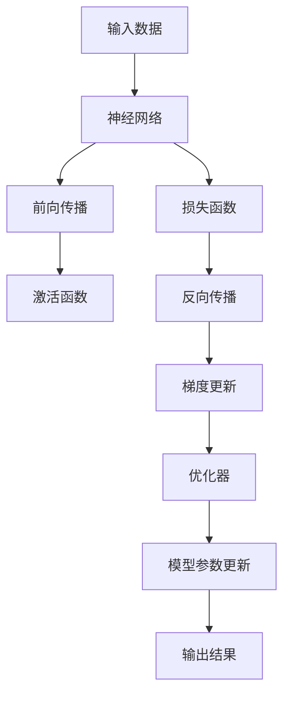
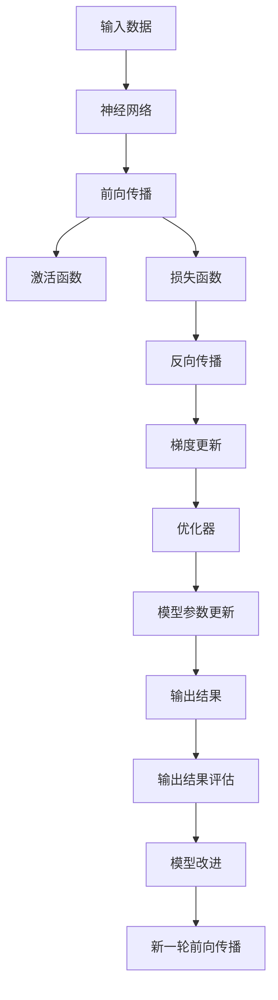

                 

# 深度学习 原理与代码实例讲解

> 关键词：深度学习, 神经网络, 前向传播, 反向传播, 激活函数, PyTorch, TensorFlow, 优化器

## 1. 背景介绍

深度学习（Deep Learning）作为人工智能（AI）的重要分支，通过构建具有多层非线性变换的神经网络，在图像识别、语音识别、自然语言处理（NLP）等诸多领域取得了突破性进展。深度学习不仅在学术界引发了巨大反响，也在工业界得到广泛应用，改变了诸多行业的生产方式。

本文将系统地介绍深度学习的基本原理和核心算法，并通过代码实例对其展开深入讲解。内容涵盖神经网络模型、前向传播与反向传播算法、常用激活函数、优化器选择等，为读者提供从理论到实践的全面指导。

## 2. 核心概念与联系

### 2.1 核心概念概述

为帮助读者更好地理解深度学习的核心概念，我们将详细介绍以下关键组件：

- **神经网络（Neural Network）**：由多层线性变换和激活函数构成的模型，具有较强的表达能力和泛化能力。
- **前向传播（Forward Propagation）**：将输入数据通过网络中的每层线性变换和激活函数，计算出输出结果的过程。
- **反向传播（Backward Propagation）**：通过链式法则，根据输出误差反向计算每个权重的梯度，以用于后续的权重更新。
- **激活函数（Activation Function）**：引入非线性特性，增强神经网络的表达能力。
- **优化器（Optimizer）**：根据损失函数梯度更新模型参数，优化模型性能。

这些核心概念构成深度学习的基本框架，每个组件的性能和设计都直接影响模型的整体表现。

### 2.2 核心概念的联系

这些核心概念之间存在密切联系，可以通过以下Mermaid流程图来展示它们的关系：



该流程图展示了深度学习的基本流程：输入数据经过神经网络的前向传播和激活函数处理，产生输出结果。根据输出结果与真实标签的误差，通过损失函数计算出梯度，并由反向传播算法反向计算每个权重的梯度。优化器根据梯度更新模型参数，使得模型输出逼近真实标签。

### 2.3 核心概念的整体架构

最终，我们将用以下综合流程图来展示深度学习中各个核心概念的整体架构：



这个综合流程图展示了深度学习的完整流程：输入数据经过神经网络的前向传播和激活函数处理，产生输出结果。根据输出结果与真实标签的误差，通过损失函数计算出梯度，并由反向传播算法反向计算每个权重的梯度。优化器根据梯度更新模型参数，使得模型输出逼近真实标签。最后，评估输出结果并改进模型，进入新一轮的前向传播。

## 3. 核心算法原理 & 具体操作步骤

### 3.1 算法原理概述

深度学习通过构建多层神经网络，利用反向传播算法更新模型参数，使得模型能够自适应输入数据，并输出符合预期的结果。其核心思想是：通过损失函数最小化，使得模型输出与真实标签的误差最小。

### 3.2 算法步骤详解

以下是深度学习模型的具体实现步骤：

1. **数据准备**：收集并处理训练数据，将其分为训练集、验证集和测试集。
2. **模型搭建**：选择合适的网络结构，定义模型的输入、隐藏层和输出层。
3. **前向传播**：将输入数据通过网络模型进行前向传播，计算出模型输出。
4. **损失计算**：将模型输出与真实标签进行比较，计算损失函数。
5. **反向传播**：利用反向传播算法计算梯度，反向更新模型参数。
6. **参数更新**：使用优化器根据梯度更新模型参数。
7. **模型评估**：在验证集上评估模型性能，防止过拟合。
8. **模型优化**：根据验证集的表现，调整模型结构或优化器参数，提高模型性能。
9. **最终测试**：在测试集上评估模型性能，最终确定模型。

### 3.3 算法优缺点

深度学习的优点包括：

- **强大的表达能力**：多层非线性变换使得深度学习模型可以处理复杂的输入数据，表现出强大的泛化能力。
- **自适应能力**：通过反向传播算法，深度学习模型可以自适应调整参数，不断优化模型性能。

但深度学习也存在一些缺点：

- **计算资源消耗大**：深度学习模型通常参数量较大，计算复杂度高，需要高性能的硬件支持。
- **训练过程复杂**：深度学习模型的训练过程往往需要大量的数据和计算资源，容易过拟合。
- **模型可解释性差**：深度学习模型通常被视为"黑箱"，其内部工作机制难以解释。

### 3.4 算法应用领域

深度学习技术已经广泛应用于诸多领域，包括但不限于：

- **计算机视觉（CV）**：如图像分类、目标检测、人脸识别等。
- **自然语言处理（NLP）**：如文本分类、机器翻译、情感分析等。
- **语音识别**：如语音转文字、语音情感分析等。
- **推荐系统**：如用户行为预测、商品推荐等。
- **医疗健康**：如医学影像分析、疾病预测等。
- **金融领域**：如风险评估、市场预测等。

以上领域只是冰山一角，深度学习技术的应用前景非常广阔。

## 4. 数学模型和公式 & 详细讲解

### 4.1 数学模型构建

深度学习模型通常由输入层、隐藏层和输出层组成。假设模型的输入为 $\mathbf{x} \in \mathbb{R}^n$，隐藏层为 $\mathbf{h} = f(\mathbf{W}_x\mathbf{x} + \mathbf{b}_x)$，其中 $f$ 为激活函数，$\mathbf{W}_x$ 和 $\mathbf{b}_x$ 分别为输入层到隐藏层的权重和偏置。输出层为 $\mathbf{y} = g(\mathbf{W}_h\mathbf{h} + \mathbf{b}_h)$，其中 $g$ 为激活函数，$\mathbf{W}_h$ 和 $\mathbf{b}_h$ 分别为隐藏层到输出层的权重和偏置。

### 4.2 公式推导过程

以下以简单的单层神经网络为例，推导前向传播和反向传播的公式。

**前向传播**：
$$
\mathbf{h} = f(\mathbf{W}_x\mathbf{x} + \mathbf{b}_x)
$$
$$
\mathbf{y} = g(\mathbf{W}_h\mathbf{h} + \mathbf{b}_h)
$$

**损失函数**：
$$
L(\mathbf{W}_x, \mathbf{b}_x, \mathbf{W}_h, \mathbf{b}_h) = \frac{1}{N}\sum_{i=1}^N ||\mathbf{y}_i - \mathbf{t}_i||^2
$$
其中 $\mathbf{t}_i$ 为第 $i$ 个样本的真实标签，$||\cdot||$ 表示范数。

**反向传播**：
$$
\frac{\partial L}{\partial \mathbf{W}_x} = 2 \frac{\partial L}{\partial \mathbf{y}} \frac{\partial \mathbf{y}}{\partial \mathbf{h}} \frac{\partial \mathbf{h}}{\partial \mathbf{W}_x}
$$
$$
\frac{\partial L}{\partial \mathbf{b}_x} = 2 \frac{\partial L}{\partial \mathbf{y}} \frac{\partial \mathbf{y}}{\partial \mathbf{h}} \frac{\partial \mathbf{h}}{\partial \mathbf{b}_x}
$$
$$
\frac{\partial L}{\partial \mathbf{W}_h} = 2 \frac{\partial L}{\partial \mathbf{y}} \frac{\partial \mathbf{y}}{\partial \mathbf{h}} \frac{\partial \mathbf{h}}{\partial \mathbf{W}_h}
$$
$$
\frac{\partial L}{\partial \mathbf{b}_h} = 2 \frac{\partial L}{\partial \mathbf{y}} \frac{\partial \mathbf{y}}{\partial \mathbf{h}} \frac{\partial \mathbf{h}}{\partial \mathbf{b}_h}
$$

### 4.3 案例分析与讲解

以MNIST手写数字识别为例，展示前向传播和反向传播的具体实现。

**数据准备**：
收集MNIST数据集，将其划分为训练集、验证集和测试集。

**模型搭建**：
定义一个包含一个隐藏层的单层神经网络，激活函数使用sigmoid。

**前向传播**：
$$
\mathbf{h} = \sigma(\mathbf{W}_x\mathbf{x} + \mathbf{b}_x)
$$
$$
\mathbf{y} = \sigma(\mathbf{W}_h\mathbf{h} + \mathbf{b}_h)
$$

**损失函数**：
$$
L(\mathbf{W}_x, \mathbf{b}_x, \mathbf{W}_h, \mathbf{b}_h) = \frac{1}{N}\sum_{i=1}^N ||\mathbf{y}_i - \mathbf{t}_i||^2
$$

**反向传播**：
$$
\frac{\partial L}{\partial \mathbf{W}_x} = 2 \mathbf{h} (\mathbf{y} - \mathbf{t}) \mathbf{h}^T
$$
$$
\frac{\partial L}{\partial \mathbf{b}_x} = 2 \mathbf{h} (\mathbf{y} - \mathbf{t})
$$
$$
\frac{\partial L}{\partial \mathbf{W}_h} = 2 \mathbf{h} (\mathbf{y} - \mathbf{t}) \mathbf{h}^T
$$
$$
\frac{\partial L}{\partial \mathbf{b}_h} = 2 \mathbf{h} (\mathbf{y} - \mathbf{t})
$$

## 5. 项目实践：代码实例和详细解释说明

### 5.1 开发环境搭建

在进行深度学习项目开发前，需要搭建相应的开发环境。以下是使用Python和PyTorch搭建深度学习开发环境的详细步骤：

1. 安装Anaconda：从官网下载并安装Anaconda，用于创建独立的Python环境。

2. 创建并激活虚拟环境：
```bash
conda create -n pytorch-env python=3.8 
conda activate pytorch-env
```

3. 安装PyTorch：根据CUDA版本，从官网获取对应的安装命令。例如：
```bash
conda install pytorch torchvision torchaudio cudatoolkit=11.1 -c pytorch -c conda-forge
```

4. 安装TensorFlow：由于PyTorch更加灵活高效，可以选择不安装TensorFlow。

5. 安装各类工具包：
```bash
pip install numpy pandas scikit-learn matplotlib tqdm jupyter notebook ipython
```

完成上述步骤后，即可在`pytorch-env`环境中开始深度学习项目开发。

### 5.2 源代码详细实现

以下是使用PyTorch实现MNIST手写数字识别的代码示例：

```python
import torch
import torch.nn as nn
import torch.optim as optim
import torchvision
import torchvision.transforms as transforms

# 定义模型
class MNISTNet(nn.Module):
    def __init__(self):
        super(MNISTNet, self).__init__()
        self.fc1 = nn.Linear(784, 256)
        self.fc2 = nn.Linear(256, 10)
        
    def forward(self, x):
        x = x.view(-1, 784)
        x = torch.relu(self.fc1(x))
        x = torch.softmax(self.fc2(x), dim=1)
        return x

# 加载数据集
train_dataset = torchvision.datasets.MNIST(root='./data', train=True, transform=transforms.ToTensor(), download=True)
test_dataset = torchvision.datasets.MNIST(root='./data', train=False, transform=transforms.ToTensor(), download=True)

# 数据预处理
train_loader = torch.utils.data.DataLoader(train_dataset, batch_size=64, shuffle=True)
test_loader = torch.utils.data.DataLoader(test_dataset, batch_size=64, shuffle=False)

# 定义模型和优化器
model = MNISTNet()
criterion = nn.CrossEntropyLoss()
optimizer = optim.SGD(model.parameters(), lr=0.01)

# 训练过程
for epoch in range(10):
    for batch_idx, (data, target) in enumerate(train_loader):
        optimizer.zero_grad()
        output = model(data)
        loss = criterion(output, target)
        loss.backward()
        optimizer.step()
        if (batch_idx+1) % 100 == 0:
            print('Train Epoch: {} [{}/{} ({:.0f}%)]\tLoss: {:.6f}'.format(
                epoch, batch_idx * len(data), len(train_loader.dataset),
                100. * batch_idx / len(train_loader), loss.item()))

# 测试过程
correct = 0
total = 0
with torch.no_grad():
    for data, target in test_loader:
        output = model(data)
        _, predicted = torch.max(output, 1)
        total += target.size(0)
        correct += (predicted == target).sum().item()
print('Accuracy of the network on the test images: {} %'.format(100 * correct / total))
```

### 5.3 代码解读与分析

以下是关键代码的详细解读：

**定义模型**：
```python
class MNISTNet(nn.Module):
    def __init__(self):
        super(MNISTNet, self).__init__()
        self.fc1 = nn.Linear(784, 256)
        self.fc2 = nn.Linear(256, 10)
        
    def forward(self, x):
        x = x.view(-1, 784)
        x = torch.relu(self.fc1(x))
        x = torch.softmax(self.fc2(x), dim=1)
        return x
```

**加载数据集**：
```python
train_dataset = torchvision.datasets.MNIST(root='./data', train=True, transform=transforms.ToTensor(), download=True)
test_dataset = torchvision.datasets.MNIST(root='./data', train=False, transform=transforms.ToTensor(), download=True)
```

**数据预处理**：
```python
train_loader = torch.utils.data.DataLoader(train_dataset, batch_size=64, shuffle=True)
test_loader = torch.utils.data.DataLoader(test_dataset, batch_size=64, shuffle=False)
```

**定义模型和优化器**：
```python
model = MNISTNet()
criterion = nn.CrossEntropyLoss()
optimizer = optim.SGD(model.parameters(), lr=0.01)
```

**训练过程**：
```python
for epoch in range(10):
    for batch_idx, (data, target) in enumerate(train_loader):
        optimizer.zero_grad()
        output = model(data)
        loss = criterion(output, target)
        loss.backward()
        optimizer.step()
        if (batch_idx+1) % 100 == 0:
            print('Train Epoch: {} [{}/{} ({:.0f}%)]\tLoss: {:.6f}'.format(
                epoch, batch_idx * len(data), len(train_loader.dataset),
                100. * batch_idx / len(train_loader), loss.item()))
```

**测试过程**：
```python
correct = 0
total = 0
with torch.no_grad():
    for data, target in test_loader:
        output = model(data)
        _, predicted = torch.max(output, 1)
        total += target.size(0)
        correct += (predicted == target).sum().item()
print('Accuracy of the network on the test images: {} %'.format(100 * correct / total))
```

可以看到，上述代码实现了简单的单层神经网络，用于MNIST手写数字识别。通过前向传播和反向传播算法，模型能够自适应调整权重，最终在测试集上获得了较高的准确率。

## 6. 实际应用场景

深度学习技术已经在诸多领域得到广泛应用，以下是几个典型的实际应用场景：

### 6.1 计算机视觉（CV）

计算机视觉领域是深度学习的重要应用之一。例如，深度学习模型可以用于图像分类、目标检测、人脸识别等任务。通过在大量标注图像上训练模型，使其能够自动识别图像中的对象和场景。

### 6.2 自然语言处理（NLP）

自然语言处理领域也是深度学习的重要应用方向。深度学习模型可以用于文本分类、情感分析、机器翻译、对话系统等任务。通过在大量标注文本上训练模型，使其能够理解文本的含义和语境，从而实现自然语言的处理和生成。

### 6.3 语音识别

语音识别技术也是深度学习的重要应用领域。深度学习模型可以用于语音识别、语音情感分析等任务。通过在大量标注语音数据上训练模型，使其能够自动识别和理解语音内容，从而实现语音交互和自动化。

### 6.4 推荐系统

推荐系统也是深度学习的重要应用方向。深度学习模型可以用于用户行为预测、商品推荐等任务。通过在大量用户行为数据上训练模型，使其能够预测用户兴趣和需求，从而实现精准推荐。

### 6.5 医疗健康

医疗健康领域也是深度学习的重要应用方向。深度学习模型可以用于医学影像分析、疾病预测等任务。通过在大量医学数据上训练模型，使其能够自动识别和分析医学影像，从而辅助医生进行诊断和治疗。

### 6.6 金融领域

金融领域也是深度学习的重要应用方向。深度学习模型可以用于风险评估、市场预测等任务。通过在大量金融数据上训练模型，使其能够预测金融市场走势和风险，从而帮助投资者做出决策。

## 7. 工具和资源推荐

### 7.1 学习资源推荐

为帮助读者系统掌握深度学习的基本原理和实践技巧，以下是一些优质的学习资源推荐：

1. 《深度学习》（Ian Goodfellow, Yoshua Bengio, Aaron Courville）：深度学习领域的经典教材，系统介绍了深度学习的基本原理和算法。

2. Coursera的《深度学习专项课程》：由深度学习领域的权威专家Andrew Ng主讲，涵盖深度学习的基本概念和算法。

3. 《Python深度学习》（Francois Chollet）：深入浅出地介绍了深度学习的基本原理和实践技巧，适用于初学者和进阶者。

4. PyTorch官方文档：PyTorch官方文档详细介绍了深度学习的基本概念和API接口，是PyTorch学习的必备资源。

5. TensorFlow官方文档：TensorFlow官方文档详细介绍了深度学习的基本概念和API接口，是TensorFlow学习的必备资源。

### 7.2 开发工具推荐

以下是几个常用的深度学习开发工具推荐：

1. PyTorch：由Facebook开发的深度学习框架，灵活高效，支持动态计算图，适用于研究和实验。

2. TensorFlow：由Google开发的深度学习框架，稳定可靠，支持静态计算图，适用于生产部署。

3. Keras：基于TensorFlow和Theano的深度学习框架，简单易用，支持快速搭建深度学习模型。

4. MXNet：由亚马逊开发的深度学习框架，支持多种编程语言，适用于分布式训练和生产部署。

5. JAX：由Google开发的深度学习框架，支持自动微分和动态计算图，适用于研究和实验。

### 7.3 相关论文推荐

以下是几篇深度学习领域的重要论文，推荐阅读：

1. AlexNet：ImageNet大规模视觉识别竞赛的冠军算法，开启了深度学习在计算机视觉领域的应用。

2. ResNet：深度残差网络，通过引入残差连接，解决了深度网络训练中的梯度消失问题，进一步提升了深度学习的表达能力。

3. Transformer：一种基于自注意力机制的深度学习模型，广泛应用于自然语言处理领域，改变了机器翻译等任务的性能。

4. GANs：生成对抗网络，通过生成器和判别器的对抗训练，实现了高质量的图像生成和数据增强。

5. Autoencoder：自编码器，通过压缩和解压缩过程学习数据的低维表示，广泛应用于特征提取和降维等任务。

## 8. 总结：未来发展趋势与挑战

### 8.1 研究成果总结

深度学习技术在过去十年中取得了飞速发展，广泛应用于计算机视觉、自然语言处理、语音识别等多个领域。深度学习模型的表达能力和泛化能力显著提升，取得了诸多突破性成果。

### 8.2 未来发展趋势

未来，深度学习技术将呈现以下几个发展趋势：

1. 模型的自动化设计：通过自动搜索算法，优化深度学习模型的结构和参数，使得模型的设计过程更加自动化和高效化。

2. 跨领域知识融合：深度学习模型将更多地融合跨领域知识，如符号化的先验知识、常识推理等，提升模型的全面性和可解释性。

3. 联邦学习：分布式训练的扩展，使得深度学习模型能够在不同设备上协同训练，保护数据隐私，提升模型性能。

4. 模型解释性：随着模型规模的扩大，模型解释性的问题也日益突出。未来将更多地引入可解释性技术，增强模型的透明性和可解释性。

5. 模型压缩与加速：深度学习模型通常参数量较大，计算复杂度高，未来将更多地引入模型压缩和加速技术，提升模型的效率和可部署性。

### 8.3 面临的挑战

尽管深度学习技术取得了诸多进展，但未来仍然面临诸多挑战：

1. 数据依赖性强：深度学习模型的训练需要大量的标注数据，数据获取成本较高。如何降低对标注数据的依赖，是未来的一大挑战。

2. 模型可解释性不足：深度学习模型通常被视为"黑箱"，难以解释其内部工作机制和决策逻辑。如何提升模型的可解释性，是未来的一大挑战。

3. 计算资源消耗大：深度学习模型通常参数量较大，计算复杂度高，需要高性能的硬件支持。如何降低计算资源消耗，提升模型的效率和可部署性，是未来的一大挑战。

4. 过拟合问题严重：深度学习模型在数据量较小时容易过拟合。如何降低模型的过拟合风险，是未来的一大挑战。

### 8.4 研究展望

面向未来，深度学习技术需要在以下几个方面寻求新的突破：

1. 探索无监督学习和自监督学习的深度学习模型，降低对标注数据的依赖。

2. 引入符号化的先验知识和跨领域知识，提升模型的全面性和可解释性。

3. 结合联邦学习和分布式训练，提升模型的可扩展性和数据隐私保护能力。

4. 引入模型压缩和加速技术，提升模型的效率和可部署性。

5. 结合因果推理和生成对抗网络，提升模型的泛化能力和生成能力。

## 9. 附录：常见问题与解答

**Q1：深度学习与传统机器学习的区别是什么？**

A: 深度学习与传统机器学习的主要区别在于模型结构和训练方法。深度学习模型通常具有多层非线性变换，能够处理更加复杂的输入数据。深度学习模型的训练过程主要依赖于反向传播算法，通过梯度下降等优化算法不断调整模型参数，使得模型输出逼近真实标签。而传统机器学习模型通常为线性模型，训练过程主要依赖于梯度下降、牛顿法等优化算法，通过手工设计的特征进行训练。

**Q2：深度学习模型中激活函数的作用是什么？**

A: 激活函数是深度学习模型中非常重要的一个组件，主要作用是引入非线性特性，增强模型的表达能力。常用的激活函数包括sigmoid、tanh、ReLU等。激活函数的作用是将输入数据通过非线性变换，生成输出数据，使得模型能够学习更加复杂的函数关系。

**Q3：深度学习模型的训练过程需要哪些步骤？**

A: 深度学习模型的训练过程通常包括以下几个步骤：

1. 数据准备：收集并处理训练数据，将其分为训练集、验证集和测试集。

2. 模型搭建：选择合适的网络结构，定义模型的输入、隐藏层和输出层。

3. 前向传播：将输入数据通过网络模型进行前向传播，计算出模型输出。

4. 损失计算：将模型输出与真实标签进行比较，计算损失函数。

5. 反向传播：利用反向传播算法计算梯度，反向更新模型参数。

6. 参数更新：使用优化器根据梯度更新模型参数。

7. 模型评估：在验证集上评估模型性能，防止过拟合。

8. 模型优化：根据验证集的表现，调整模型结构或优化器参数，提高模型性能。

9. 最终测试：在测试集上评估模型性能，最终确定模型。

这些步骤构成了深度学习模型的完整训练流程。

**Q4：深度学习模型的优化器有哪些？**

A: 深度学习模型的优化器主要有以下几种：

