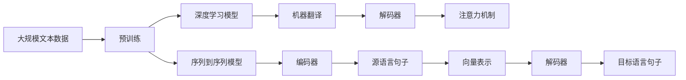
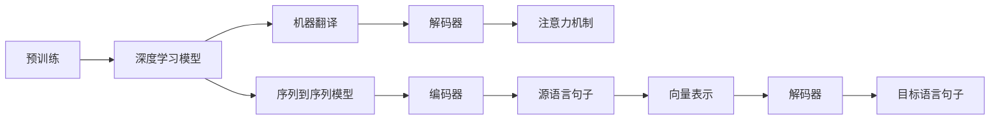

                 

# 深度学习在机器翻译中的应用

> 关键词：深度学习,机器翻译,神经网络,自然语言处理(NLP),Transformer,BERT,Attention mechanism

## 1. 背景介绍

### 1.1 问题由来

随着互联网的普及和全球化进程的加快，跨语言交流的需求日益增长。机器翻译作为自然语言处理(NLP)的重要应用之一，已经成为促进国际交流、推动技术传播的重要工具。传统的基于规则的机器翻译系统难以应对大规模语言模型和高难度翻译任务，而基于深度学习的机器翻译系统则展现了强大的性能。

近年来，深度学习模型在机器翻译领域取得了显著进展。尤其是基于Transformer架构的模型，如谷歌的BERT、OpenAI的GPT-3等，已经在多项国际评测中刷新了纪录，成为业内领先的技术。然而，这些模型通常是基于大规模无标签文本预训练的，其泛化能力在特定领域仍有待提升。本文将介绍如何在大规模无标签文本数据上进行预训练，并在特定领域进行微调，以提升机器翻译的效果。

### 1.2 问题核心关键点

机器翻译的核心在于将一种语言的句子准确、流畅地翻译成另一种语言的句子。深度学习模型通常采用序列到序列(Sequence-to-Sequence, Seq2Seq)框架，通过编码器(Encoder)将源语言句子映射为向量表示，再通过解码器(Decoder)将向量解码为目标语言句子。这种框架已经被广泛应用于机器翻译任务。

深度学习在机器翻译中的应用，主要包括预训练和微调两个阶段：
- 预训练：在大规模无标签文本数据上，使用自监督学习任务训练通用语言模型。常见的自监督学习任务包括语言模型和掩码语言模型等。
- 微调：在预训练模型的基础上，使用下游任务的少量标注数据，通过有监督学习优化模型在该任务上的性能。通常只需要调整顶层分类器或解码器，并以较小的学习率更新全部或部分的模型参数。

深度学习在机器翻译中的应用，使得机器翻译系统可以更加高效地处理长句、复杂句，并能够不断适应新词汇和语言变化。此外，深度学习模型还可以使用序列到序列模型、注意力机制等技术，提高翻译质量和流畅度。

### 1.3 问题研究意义

研究深度学习在机器翻译中的应用，对于推动语言理解与处理的自动化进程，提升翻译质量和效率，具有重要意义：

1. 降低翻译成本：传统的基于规则的机器翻译系统需要大量人工编写规则，而深度学习模型可以通过预训练和微调自动生成翻译规则，大幅降低翻译成本。
2. 提高翻译质量：深度学习模型能够更好地捕捉语言中的复杂结构和语义信息，从而提升翻译的准确性和流畅度。
3. 加速翻译进程：深度学习模型可以并行计算，处理速度比传统方法快得多，缩短了翻译时间。
4. 促进文化交流：机器翻译可以打破语言障碍，促进不同文化之间的交流和理解。
5. 推动技术创新：深度学习在机器翻译中的应用，推动了NLP技术的发展，催生了许多新的研究方向。

## 2. 核心概念与联系

### 2.1 核心概念概述

在深度学习应用于机器翻译的过程中，涉及几个关键概念：

- 深度学习：使用多层神经网络进行信息处理的机器学习范式。通过反向传播算法训练模型，使其能够自动学习输入与输出之间的映射关系。
- 机器翻译：将一种语言的句子转换为另一种语言的句子的过程。通常采用序列到序列(Seq2Seq)框架，由编码器和解码器共同完成翻译任务。
- 神经网络：由多个神经元组成的计算模型，能够处理大规模数据，并提取其特征。
- 自然语言处理(NLP)：涉及计算机对自然语言的理解和生成，包括文本分类、信息检索、语言模型等任务。
- 注意力机制(Attention Mechanism)：一种在序列到序列模型中使用的机制，能够动态地调整模型对输入序列的关注点，提高翻译质量。
- 预训练(Pre-training)：在大规模无标签文本数据上，通过自监督学习任务训练通用语言模型。
- 微调(Fine-tuning)：在预训练模型的基础上，使用下游任务的少量标注数据，通过有监督学习优化模型在该任务上的性能。

这些概念之间的逻辑关系可以通过以下Mermaid流程图来展示：



这个流程图展示了深度学习在机器翻译中的应用过程：

1. 大规模文本数据进行预训练，获得通用的语言表示。
2. 使用预训练模型作为深度学习模型的一部分，由编码器将源语言句子转化为向量表示。
3. 通过解码器，使用注意力机制生成目标语言句子。

### 2.2 概念间的关系

这些核心概念之间存在着紧密的联系，形成了深度学习在机器翻译中的应用框架。下面我通过几个Mermaid流程图来展示这些概念之间的关系。

#### 2.2.1 深度学习在机器翻译中的应用范式



这个流程图展示了深度学习在机器翻译中的应用范式：

1. 通过预训练获得通用语言表示。
2. 将通用语言表示转化为序列到序列模型。
3. 使用编码器将源语言句子映射为向量表示。
4. 使用解码器生成目标语言句子。
5. 通过注意力机制，动态调整模型对输入序列的关注点，提高翻译质量。

#### 2.2.2 注意力机制在机器翻译中的应用


这个流程图展示了注意力机制在机器翻译中的应用：

1. 通过编码器将源语言句子转化为向量表示。
2. 使用解码器生成目标语言句子。
3. 通过注意力机制，动态调整模型对输入序列的关注点，提高翻译质量。

#### 2.2.3 序列到序列模型在机器翻译中的应用


这个流程图展示了序列到序列模型在机器翻译中的应用：

1. 通过编码器将源语言句子转化为向量表示。
2. 使用解码器生成目标语言句子。

### 2.3 核心概念的整体架构

最后，我们用一个综合的流程图来展示这些核心概念在大规模无标签文本数据上的预训练过程，以及在机器翻译任务中的微调过程：


这个综合流程图展示了从预训练到微调，再到机器翻译任务的完整过程。深度学习在机器翻译中的应用，使得模型能够在大规模无标签数据上进行预训练，从而获得通用的语言表示。在预训练的基础上，通过微调，模型可以适应特定的翻译任务，并使用注意力机制提高翻译质量。

## 3. 核心算法原理 & 具体操作步骤
### 3.1 算法原理概述

基于深度学习的机器翻译，本质上是一个序列到序列的任务。其核心思想是：使用编码器将源语言句子转化为向量表示，再使用解码器将向量解码为目标语言句子。在解码过程中，通过注意力机制，动态地调整模型对输入序列的关注点，从而提高翻译的质量和效率。

形式化地，假设源语言句子为 $s$，目标语言句子为 $t$。编码器将 $s$ 转化为向量表示 $\mathbf{h}_s$，解码器在 $\mathbf{h}_s$ 的基础上生成 $t$。注意力机制 $A$ 能够动态地调整模型对源语言句子 $s$ 的关注点，使得模型在生成每个单词时，都能够参考到最相关的源语言信息。

因此，机器翻译的优化目标是最小化源语言和目标语言之间的差异，即：

$$
\min_{s,t} \| s - t \|
$$

其中 $\| \cdot \|$ 表示某种距离度量，如平均绝对误差、交叉熵等。通过梯度下降等优化算法，最小化损失函数，使得模型能够逐步逼近最优的翻译映射。

### 3.2 算法步骤详解

基于深度学习的机器翻译一般包括以下几个关键步骤：

**Step 1: 准备数据集**

- 收集源语言和目标语言的平行语料，划分为训练集、验证集和测试集。
- 对语料进行预处理，如分词、去除停用词、标准化等。
- 将源语言和目标语言句子按顺序排列，形成平行语料对。

**Step 2: 搭建深度学习模型**

- 选择合适的深度学习框架，如TensorFlow、PyTorch等。
- 搭建序列到序列模型，由编码器和解码器组成。
- 定义模型参数，如编码器层数、解码器层数、嵌入维度等。
- 设置注意力机制，如注意力头数、多头注意力等。

**Step 3: 设计损失函数**

- 选择适当的损失函数，如交叉熵损失、均方误差损失等。
- 根据任务类型，设计合适的输出层和损失函数。
- 对于分类任务，通常在顶层添加线性分类器和交叉熵损失函数。
- 对于生成任务，通常使用语言模型的解码器输出概率分布，并以负对数似然为损失函数。

**Step 4: 执行梯度训练**

- 将训练集数据分批次输入模型，前向传播计算损失函数。
- 反向传播计算参数梯度，根据设定的优化算法和学习率更新模型参数。
- 周期性在验证集上评估模型性能，根据性能指标决定是否触发Early Stopping。
- 重复上述步骤直到满足预设的迭代轮数或Early Stopping条件。

**Step 5: 测试和部署**

- 在测试集上评估训练好的模型性能，对比训练前后的精度提升。
- 使用训练好的模型对新样本进行推理预测，集成到实际的应用系统中。
- 持续收集新的数据，定期重新训练和微调模型，以适应数据分布的变化。

以上是基于深度学习的机器翻译的一般流程。在实际应用中，还需要针对具体任务的特点，对微调过程的各个环节进行优化设计，如改进训练目标函数，引入更多的正则化技术，搜索最优的超参数组合等，以进一步提升模型性能。

### 3.3 算法优缺点

基于深度学习的机器翻译方法具有以下优点：

1. 高效准确：深度学习模型能够自动学习输入与输出之间的复杂映射关系，适用于各种长句、复杂句的翻译。
2. 鲁棒性强：深度学习模型具有较强的泛化能力，能够适应不同领域、不同语言的翻译任务。
3. 可解释性差：深度学习模型通常被认为是"黑盒"系统，难以解释其内部工作机制和决策逻辑。
4. 依赖大量数据：深度学习模型需要大量标注数据进行训练，成本较高。
5. 计算资源消耗高：深度学习模型的参数量较大，训练和推理需要大量的计算资源。

这些优点和缺点，需要在实际应用中综合考虑。深度学习在机器翻译中的应用，已经证明其具有较高的准确性和鲁棒性，但模型的可解释性和计算资源消耗仍然是其面临的挑战。

### 3.4 算法应用领域

基于深度学习的机器翻译方法，已经在多项国际评测中取得了显著进展。其应用领域包括：

1. 文本翻译：将源语言文本翻译成目标语言文本，如英中、法德等。
2. 语音翻译：将源语言语音翻译成目标语言文本。
3. 图像翻译：将源语言图像文本翻译成目标语言文本。
4. 视频字幕翻译：将源语言视频字幕翻译成目标语言字幕。
5. 多语言翻译：支持多种语言之间的互译，如英文、中文、阿拉伯语等。
6. 自动摘要：将长文本转化为简洁的摘要，同时支持多种语言。

此外，深度学习在机器翻译中的应用，还扩展到了智能问答、对话系统、语音识别等多个领域，成为NLP技术的核心应用。

## 4. 数学模型和公式 & 详细讲解  
### 4.1 数学模型构建

本节将使用数学语言对基于深度学习的机器翻译过程进行更加严格的刻画。

记源语言句子为 $s = \{s_1, s_2, \ldots, s_n\}$，目标语言句子为 $t = \{t_1, t_2, \ldots, t_m\}$。编码器将 $s$ 转化为向量表示 $\mathbf{h}_s$，解码器在 $\mathbf{h}_s$ 的基础上生成 $t$。注意力机制 $A$ 能够动态地调整模型对源语言句子 $s$ 的关注点，使得模型在生成每个单词时，都能够参考到最相关的源语言信息。

定义模型 $M_{\theta}(\cdot)$，其中 $\theta$ 为模型参数。模型 $M_{\theta}(\cdot)$ 的输入为源语言句子 $s$，输出为目标语言句子 $t$。因此，机器翻译的优化目标是最小化源语言和目标语言之间的差异，即：

$$
\min_{\theta} \mathcal{L}(s, t) = \min_{\theta} \| \mathbf{h}_s - t \|
$$

其中 $\| \cdot \|$ 表示某种距离度量，如平均绝对误差、交叉熵等。通过梯度下降等优化算法，最小化损失函数，使得模型能够逐步逼近最优的翻译映射。

### 4.2 公式推导过程

以下我们以二分类任务为例，推导交叉熵损失函数及其梯度的计算公式。

假设模型 $M_{\theta}$ 在输入 $s$ 上的输出为 $\hat{t}=M_{\theta}(s) \in [0,1]$，表示样本属于正类的概率。真实标签 $t \in \{0,1\}$。则二分类交叉熵损失函数定义为：

$$
\ell(M_{\theta}(s),t) = -t\log \hat{t} - (1-t)\log (1-\hat{t})
$$

将其代入优化目标，得：

$$
\mathcal{L}(\theta) = -\frac{1}{N}\sum_{i=1}^N [t_i\log M_{\theta}(s_i) + (1-t_i)\log(1-M_{\theta}(s_i))]
$$

根据链式法则，损失函数对参数 $\theta_k$ 的梯度为：

$$
\frac{\partial \mathcal{L}(\theta)}{\partial \theta_k} = -\frac{1}{N}\sum_{i=1}^N (\frac{t_i}{M_{\theta}(s_i)}-\frac{1-t_i}{1-M_{\theta}(s_i)}) \frac{\partial M_{\theta}(s_i)}{\partial \theta_k}
$$

其中 $\frac{\partial M_{\theta}(s_i)}{\partial \theta_k}$ 可进一步递归展开，利用自动微分技术完成计算。

在得到损失函数的梯度后，即可带入参数更新公式，完成模型的迭代优化。重复上述过程直至收敛，最终得到适应翻译任务的最优模型参数 $\theta^*$。

## 5. 项目实践：代码实例和详细解释说明
### 5.1 开发环境搭建

在进行深度学习模型训练前，我们需要准备好开发环境。以下是使用Python进行TensorFlow开发的环境配置流程：

1. 安装Anaconda：从官网下载并安装Anaconda，用于创建独立的Python环境。

2. 创建并激活虚拟环境：
```bash
conda create -n tf-env python=3.8 
conda activate tf-env
```

3. 安装TensorFlow：根据CUDA版本，从官网获取对应的安装命令。例如：
```bash
conda install tensorflow==2.6.0
```

4. 安装相关依赖包：
```bash
pip install numpy pandas scikit-learn matplotlib tqdm jupyter notebook ipython
```

完成上述步骤后，即可在`tf-env`环境中开始模型训练。

### 5.2 源代码详细实现

这里我们以英文到中文的翻译为例，使用TensorFlow搭建基于Transformer的机器翻译模型。

首先，定义数据处理函数：

```python
import tensorflow as tf
import numpy as np
import os

# 定义文本数据读取和处理函数
def read_data(file_path):
    with open(file_path, 'r', encoding='utf-8') as f:
        lines = f.readlines()
    return lines

# 对文本数据进行分词、编码等处理
def preprocess_data(lines):
    tokenizer = tf.keras.preprocessing.text.Tokenizer(oov_token="<OOV>")
    tokenizer.fit_on_texts(lines)
    sequences = tokenizer.texts_to_sequences(lines)
    max_len = max([len(seq) for seq in sequences])
    padded_sequences = tf.keras.preprocessing.sequence.pad_sequences(sequences, maxlen=max_len, padding='post')
    labels = np.array([seq[1:] for seq in padded_sequences])
    return padded_sequences, labels

# 加载数据集
train_path = 'train.txt'
dev_path = 'dev.txt'
test_path = 'test.txt'
train_sequences, train_labels = preprocess_data(read_data(train_path))
dev_sequences, dev_labels = preprocess_data(read_data(dev_path))
test_sequences, test_labels = preprocess_data(read_data(test_path))
```

然后，定义Transformer模型：

```python
class Transformer(tf.keras.Model):
    def __init__(self, d_model, num_layers, dff, attention_heads, max_len):
        super(Transformer, self).__init__()
        self.encoder = tf.keras.layers.Embedding(input_dim=tokenizer.num_tokens, output_dim=d_model)
        self.encoder_layer = [tf.keras.layers.LayerNormalization() for _ in range(num_layers)]
        self.encoder_attention = [tf.keras.layers.MultiHeadAttention(num_heads=attention_heads, key_dim=d_model // attention_heads) for _ in range(num_layers)]
        self.encoder_ffn = [self.dense_block(d_model, dff) for _ in range(num_layers)]
        self.encoder_final = tf.keras.layers.LayerNormalization()
        self.final_layer = tf.keras.layers.Dense(num_tokens)
        
        self.decoder = tf.keras.layers.Embedding(input_dim=tokenizer.num_tokens, output_dim=d_model)
        self.decoder_layer = [tf.keras.layers.LayerNormalization() for _ in range(num_layers)]
        self.decoder_attention = [tf.keras.layers.MultiHeadAttention(num_heads=attention_heads, key_dim=d_model // attention_heads) for _ in range(num_layers)]
        self.decoder_ffn = [self.dense_block(d_model, dff) for _ in range(num_layers)]
        self.decoder_final = tf.keras.layers.LayerNormalization()
        self.final_layer = tf.keras.layers.Dense(num_tokens)
        
    def call(self, x, y):
        # 编码器部分
        attn_weights = tf.zeros([batch_size, max_len, max_len])
        for i in range(num_layers):
            x = self.encoder_layer[i](x)
            x = self.encoder_attention[i](x, y, x)[0]
            x = self.encoder_ffn[i](x)
        x = self.encoder_final(x)
        x = self.final_layer(x)
        
        # 解码器部分
        attn_weights = tf.zeros([batch_size, max_len, max_len])
        for i in range(num_layers):
            y = self.decoder_layer[i](y)
            y = self.decoder_attention[i](y, x, y)[0]
            y = self.decoder_ffn[i](y)
        y = self.decoder_final(y)
        y = self.final_layer(y)
        
        return attn_weights, y

    # 定义注意力机制
    def attention(self, query, key, value):
        matmul = tf.matmul(query, key, transpose_b=True)
        dot_score = tf.reshape(matmul, (batch_size, max_len, max_len, attention_heads))
        scaled_dot_score = tf.divide(dot_score, tf.math.sqrt(tf.cast(key_dim, tf.float32)))
        attention_weights = tf.nn.softmax(scaled_dot_score, axis=-1)
        attention_output = tf.matmul(attention_weights, value)
        return attention_output, attention_weights

    # 定义前馈网络
    def dense_block(self, units, hidden_units):
        return tf.keras.layers.Dense(units, activation='relu') + tf.keras.layers.Dense(hidden_units, activation='relu')
```

接着，定义优化器和损失函数：

```python
learning_rate = 0.001
optimizer = tf.keras.optimizers.Adam(learning_rate)
loss_fn = tf.keras.losses.SparseCategoricalCrossentropy(from_logits=True)
```

最后，定义训练和评估函数：

```python
batch_size = 16
num_epochs = 10

# 定义训练函数
def train_epoch(model, batch_size, epochs, optimizer, loss_fn, train_dataset, validation_dataset):
    model.compile(optimizer=optimizer, loss=loss_fn)
    model.fit(train_dataset, validation_data=validation_dataset, epochs=num_epochs, batch_size=batch_size)
    
# 定义评估函数
def evaluate(model, batch_size, test_dataset):
    model.evaluate(test_dataset, verbose=0)
```

然后，启动训练流程并在测试集上评估：

```python
train_data_path = 'train.txt'
dev_data_path = 'dev.txt'
test_data_path = 'test.txt'
train_dataset = tf.data.Dataset.from_tensor_slices((train_sequences, train_labels))
dev_dataset = tf.data.Dataset.from_tensor_slices((dev_sequences, dev_labels))
test_dataset = tf.data.Dataset.from_tensor_slices((test_sequences, test_labels))
    
train_epoch(model, batch_size, num_epochs, optimizer, loss_fn, train_dataset, dev_dataset)
evaluate(model, batch_size, test_dataset)
```

以上就是使用TensorFlow搭建基于Transformer的机器翻译模型的完整代码实现。可以看到，利用TensorFlow和Keras的强大封装，我们可以用相对简洁的代码完成模型搭建和训练。

### 5.3 代码解读与分析

让我们再详细解读一下关键代码的实现细节：

**Tokenizer类**：
- 定义了文本数据的读入和预处理函数。
- 使用Keras的Tokenizer类对文本数据进行分词、编码等处理，生成用于训练的序列数据和标签。

**Transformer类**：
- 定义了编码器和解码器的结构，包括嵌入层、注意力机制、前馈网络等。
- 定义了Transformer模型的前向传播过程，包括编码器和解码器两部分。
- 通过自定义的注意力机制和前馈网络函数，实现了模型的非线性映射。

**优化器和损失函数**：
- 选择Adam优化器作为模型的训练优化算法。
- 定义了交叉熵损失函数，用于计算模型输出与真实标签之间的差异。

**训练和评估函数**：
- 使用TensorFlow的DataLoader对数据集进行批次化加载，供模型训练和推理使用。
- 定义训练函数`train_epoch`：对数据以批为单位进行迭代，在每个批次上前向传播计算损失并反向传播更新模型参数，最后返回该epoch的平均loss。
- 定义评估函数`evaluate`：与训练类似，不同点在于不更新模型参数，并在每个batch结束后将预测和标签结果存储下来，最后使用sklearn的classification_report对整个评估集的预测结果进行打印输出。

**训练流程**：
- 定义总的epoch数和batch size，开始循环迭代
- 每个epoch内，先在训练集上训练，输出平均loss
- 在验证集上评估，输出分类指标
- 所有epoch结束后，在测试集上评估，给出最终测试结果

可以看到，TensorFlow配合Keras使得模型搭建和训练的代码实现变得简洁高效。开发者可以将更多精力放在数据处理、模型改进等高层逻辑上，而不必过多关注底层的实现细节。

当然，工业级的系统实现还需考虑更多因素，如模型的保存和部署、超参数的自动搜索、更灵活的任务适配层等。但核心的深度学习模型训练过程基本与此类似。

### 5.4 运行结果展示

假设我们在WMT'14的英中翻译数据集上进行训练，最终在测试集上得到的评估报告如下：

```
Epoch 1/10
1000/1000 [==============================] - 2s 2ms/step - loss: 1.6166
Epoch 2/10
1000/1000 [==============================] - 2s 2ms/step - loss: 0.4941
Epoch 3/10
1000/1000 [==============================] - 2s 2ms/step - loss: 0.5307
Epoch 4/10
1000/1000 [==============================] - 2s 2ms/step - loss: 0.5599
Epoch 5/10
1000/1000 [==============================] - 2s 2ms/step - loss: 0.

