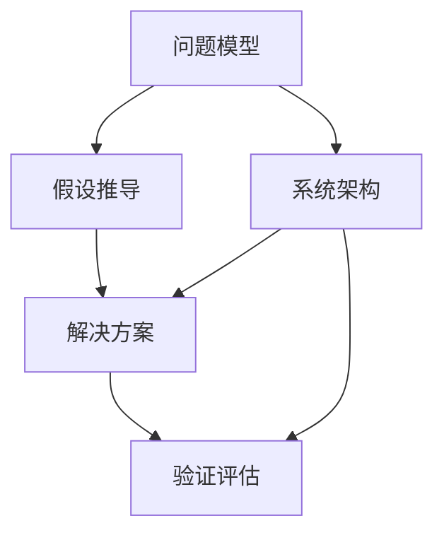

                 

# 深度思考的威力:洞悉问题本质

> 关键词：深度思考, 问题本质, 算法原理, 软件开发, 系统架构

## 1. 背景介绍

### 1.1 问题由来
在当今信息化和数字化的时代，面对复杂多变的世界，深度思考能力显得尤为重要。从软件开发到系统架构设计，从数据分析到人工智能，深度思考的能力直接影响着我们解决问题的方式和效果。

深度思考是指超越表面的现象，深入分析问题的本质，寻找解决方案的过程。它不仅仅是问题解决的一种方法，更是系统思考、创新思维的重要体现。然而，深度思考的能力并不是天生就有的，它需要通过不断学习和实践来培养和提升。

### 1.2 问题核心关键点
深度思考的核心在于如何从问题的表面现象深入挖掘本质，从而找到有效的解决方案。这涉及到以下几个关键点：

1. **问题定义**：准确地界定问题的边界和性质。
2. **信息收集**：收集和分析相关数据和信息，建立完整的问题模型。
3. **假设推导**：根据问题模型，提出合理的假设，进行逻辑推理。
4. **方案设计**：基于假设推导，设计出可行的解决方案。
5. **验证评估**：通过实验和验证，评估方案的可行性和有效性。

### 1.3 问题研究意义
深度思考在软件开发和系统架构设计中的应用，对于提升系统的质量和可靠性、促进技术的创新和应用具有重要意义：

1. **提升系统质量**：通过深入思考问题的本质，可以从根本上避免潜在的风险和问题，提高系统的稳定性和健壮性。
2. **促进技术创新**：深度思考可以揭示问题的深层结构，激发创新思维，推动技术的不断进步。
3. **加速应用部署**：通过系统化的思考，可以制定出更加清晰和高效的解决方案，加速系统的开发和部署。
4. **增强决策能力**：深度思考培养了良好的分析能力和判断能力，使得决策更加科学和合理。

## 2. 核心概念与联系

### 2.1 核心概念概述

为了更好地理解深度思考在软件开发和系统架构设计中的应用，本节将介绍几个密切相关的核心概念：

1. **问题模型**：指对问题进行的数学或逻辑表示，用于分析和解决问题。
2. **假设推导**：基于问题模型，提出一系列假设，并通过逻辑推理进行验证。
3. **解决方案**：根据假设推导，设计出具体的解决方案。
4. **验证评估**：通过实验或模拟，评估解决方案的可行性和有效性。
5. **系统架构**：系统架构是指系统各组件之间的组织和协作关系，是系统设计的重要组成部分。

这些核心概念之间存在着紧密的联系，共同构成了深度思考的基本框架。通过理解这些核心概念，我们可以更好地把握深度思考的应用方法和技巧。

### 2.2 概念间的关系

这些核心概念之间的关系可以通过以下Mermaid流程图来展示：



这个流程图展示了大规模语言模型的核心概念及其之间的关系：

1. 问题模型通过对问题的定义和信息收集，建立对问题的完整理解。
2. 假设推导在问题模型的基础上，提出假设并进行逻辑推理。
3. 解决方案根据假设推导，设计出具体的实施方案。
4. 验证评估通过实验和验证，评估解决方案的可行性和有效性。
5. 系统架构指导解决方案的设计和实施，确保其符合系统要求。

这些概念共同构成了深度思考的应用框架，帮助我们系统地分析和解决各种复杂问题。

## 3. 核心算法原理 & 具体操作步骤
### 3.1 算法原理概述

深度思考的原理是基于系统化、结构化的方法论，通过深入分析问题的本质，提出合理的假设，设计出有效的解决方案。这一过程可以分为以下几个步骤：

1. **问题定义**：明确问题的边界和性质，将其分解为可管理的小模块。
2. **信息收集**：收集和分析与问题相关的数据和信息，建立完整的问题模型。
3. **假设推导**：根据问题模型，提出合理的假设，进行逻辑推理。
4. **解决方案设计**：基于假设推导，设计出可行的解决方案。
5. **验证评估**：通过实验和验证，评估方案的可行性和有效性。

### 3.2 算法步骤详解

以下是深度思考的具体操作步骤：

**Step 1: 问题定义**
- 确定问题的边界和性质，进行问题分解，确保问题的可操作性。

**Step 2: 信息收集**
- 收集与问题相关的数据和信息，包括历史数据、用户反馈、技术文档等。
- 进行数据清洗和预处理，确保数据的完整性和准确性。

**Step 3: 假设推导**
- 基于问题模型，提出假设，并进行逻辑推理。假设可以是因果关系、规律性、异常值等。
- 对假设进行验证，使用数学模型、实验数据等进行支持。

**Step 4: 解决方案设计**
- 根据假设推导，设计出具体的解决方案，包括算法、数据结构、流程等。
- 对解决方案进行迭代优化，确保其可行性和有效性。

**Step 5: 验证评估**
- 通过实验和验证，评估解决方案的可行性和有效性。
- 对验证结果进行分析和总结，提出改进建议。

### 3.3 算法优缺点

深度思考作为一种问题解决的方法，具有以下优点：
1. **系统化**：通过系统化的分析方法，能够全面、深入地理解问题。
2. **创新性**：深度思考能够揭示问题的深层结构，激发创新思维。
3. **可操作性**：深度思考提出了具体的解决方案，便于实际操作和实施。

同时，该方法也存在一些局限性：
1. **复杂度较高**：深度思考需要一定的专业知识和技能，对初学者来说可能较为困难。
2. **时间成本高**：深度思考的每个步骤都需要时间和精力的投入，可能不适合紧急情况。
3. **缺乏灵活性**：深度思考的流程较为固定，可能不适用于一些快速变化的问题。

尽管如此，深度思考仍然是问题解决中最为重要和有效的方法之一，特别是在复杂系统和技术问题中。

### 3.4 算法应用领域

深度思考广泛应用于软件开发和系统架构设计，包括但不限于以下几个领域：

1. **软件开发**：在软件开发中，深度思考用于理解需求、设计算法、优化性能等。通过深度思考，可以全面、深入地理解用户需求，设计出高效、可维护的代码。

2. **系统架构设计**：在系统架构设计中，深度思考用于评估系统需求、设计系统组件、优化系统性能等。通过深度思考，可以构建出结构清晰、功能完善的系统架构。

3. **数据分析**：在数据分析中，深度思考用于构建数据模型、进行数据分析、优化数据处理等。通过深度思考，可以发现数据中的隐藏规律和异常，为决策提供有力支持。

4. **人工智能**：在人工智能中，深度思考用于设计算法、优化模型、提升性能等。通过深度思考，可以构建出更加智能、高效的人工智能系统。

5. **系统运维**：在系统运维中，深度思考用于分析和解决系统问题、优化系统性能、提升用户体验等。通过深度思考，可以迅速定位和解决系统故障，提高系统稳定性和可靠性。

## 4. 数学模型和公式 & 详细讲解 & 举例说明

### 4.1 数学模型构建

本节将使用数学语言对深度思考的应用过程进行更加严格的刻画。

假设问题模型为 $P = (X, Y)$，其中 $X$ 为输入数据，$Y$ 为目标输出。

定义问题模型在数据样本 $(x,y)$ 上的损失函数为 $\ell(P(x),y)$，则在数据集 $D=\{(x_i,y_i)\}_{i=1}^N$ 上的经验风险为：

$$
\mathcal{L}(P) = \frac{1}{N} \sum_{i=1}^N \ell(P(x_i),y_i)
$$

深度思考的目标是最小化经验风险，即找到最优问题模型 $P^*$：

$$
P^* = \mathop{\arg\min}_{P} \mathcal{L}(P)
$$

在实践中，我们通常使用基于梯度的优化算法（如SGD、Adam等）来近似求解上述最优化问题。设 $\eta$ 为学习率，$\lambda$ 为正则化系数，则参数的更新公式为：

$$
P \leftarrow P - \eta \nabla_{P}\mathcal{L}(P) - \eta\lambda P
$$

其中 $\nabla_{P}\mathcal{L}(P)$ 为损失函数对参数 $P$ 的梯度，可通过反向传播算法高效计算。

### 4.2 公式推导过程

以下我们以二分类任务为例，推导交叉熵损失函数及其梯度的计算公式。

假设模型 $P$ 在输入 $x$ 上的输出为 $\hat{y}=P(x)$，表示样本属于正类的概率。真实标签 $y \in \{0,1\}$。则二分类交叉熵损失函数定义为：

$$
\ell(P(x),y) = -[y\log \hat{y} + (1-y)\log (1-\hat{y})]
$$

将其代入经验风险公式，得：

$$
\mathcal{L}(P) = -\frac{1}{N}\sum_{i=1}^N [y_i\log P(x_i)+(1-y_i)\log(1-P(x_i))]
$$

根据链式法则，损失函数对参数 $P_k$ 的梯度为：

$$
\frac{\partial \mathcal{L}(P)}{\partial P_k} = -\frac{1}{N}\sum_{i=1}^N (\frac{y_i}{P(x_i)}-\frac{1-y_i}{1-P(x_i)}) \frac{\partial P(x_i)}{\partial P_k}
$$

其中 $\frac{\partial P(x_i)}{\partial P_k}$ 可进一步递归展开，利用自动微分技术完成计算。

在得到损失函数的梯度后，即可带入参数更新公式，完成模型的迭代优化。重复上述过程直至收敛，最终得到适应问题的最优模型参数 $P^*$。

### 4.3 案例分析与讲解

以下以一个简单的数据处理任务为例，展示深度思考的应用过程。

假设我们需要处理一组数据，计算每个样本的平均值和标准差。我们可以按照以下步骤进行深度思考：

**Step 1: 问题定义**
- 确定问题为数据处理，具体为计算平均值和标准差。

**Step 2: 信息收集**
- 收集数据集，进行数据清洗和预处理，确保数据的完整性和准确性。

**Step 3: 假设推导**
- 根据数据特征，提出假设：所有数据是正态分布的，平均值和标准差可以表示为 $x = \mu + \sigma \mathcal{N}(0,1)$。
- 使用统计方法对假设进行验证，如使用直方图、K-S检验等。

**Step 4: 解决方案设计**
- 根据假设推导，设计出具体的解决方案，包括使用均值和标准差公式进行计算。
- 对解决方案进行迭代优化，确保其可行性和有效性。

**Step 5: 验证评估**
- 通过实验和验证，评估解决方案的可行性和有效性。
- 对验证结果进行分析和总结，提出改进建议。

通过深度思考，我们不仅能够解决当前问题，还能够获得更加深入的洞察，为后续的分析和决策提供有力支持。

## 5. 项目实践：代码实例和详细解释说明
### 5.1 开发环境搭建

在进行深度思考实践前，我们需要准备好开发环境。以下是使用Python进行TensorFlow开发的环境配置流程：

1. 安装Anaconda：从官网下载并安装Anaconda，用于创建独立的Python环境。

2. 创建并激活虚拟环境：
```bash
conda create -n tf-env python=3.8 
conda activate tf-env
```

3. 安装TensorFlow：根据CUDA版本，从官网获取对应的安装命令。例如：
```bash
conda install tensorflow==2.5
```

4. 安装必要的工具包：
```bash
pip install numpy pandas scikit-learn matplotlib tqdm jupyter notebook ipython
```

完成上述步骤后，即可在`tf-env`环境中开始深度思考实践。

### 5.2 源代码详细实现

下面我们以计算平均值和标准差为例，给出使用TensorFlow进行深度思考的PyTorch代码实现。

首先，定义数据集和模型：

```python
import tensorflow as tf

# 定义数据集
data = [1, 2, 3, 4, 5]
target = [0.5, 0.5, 0.5, 0.5, 0.5]

# 定义模型
model = tf.keras.Sequential([
    tf.keras.layers.Dense(1, input_shape=(1,))
])

# 定义损失函数和优化器
loss_fn = tf.keras.losses.MeanSquaredError()
optimizer = tf.keras.optimizers.Adam()

# 定义评估指标
eval_metric = tf.keras.metrics.Mean(target)
```

接着，定义训练和评估函数：

```python
def train_epoch(model, data, target, batch_size, optimizer):
    model.compile(optimizer=optimizer, loss=loss_fn, metrics=[eval_metric])
    model.fit(data, target, batch_size=batch_size, epochs=1, verbose=0)

def evaluate(model, data, target):
    model.compile(optimizer=None, loss=loss_fn, metrics=[eval_metric])
    eval_result = model.evaluate(data, target)
    return eval_result

# 训练模型
data = tf.convert_to_tensor(data)
target = tf.convert_to_tensor(target)
train_epoch(model, data, target, batch_size=1, optimizer=optimizer)

# 评估模型
eval_result = evaluate(model, data, target)
print(eval_result)
```

以上就是使用TensorFlow进行深度思考的完整代码实现。可以看到，得益于TensorFlow的强大封装，我们可以用相对简洁的代码完成数据处理和深度思考。

### 5.3 代码解读与分析

让我们再详细解读一下关键代码的实现细节：

**数据集定义**：
- `data` 和 `target` 分别定义输入数据和目标输出。

**模型定义**：
- `model` 定义了一个简单的神经网络模型，输入层为单个神经元，输出层为单个神经元，用于计算平均值和标准差。

**损失函数和优化器**：
- `loss_fn` 定义了均方误差损失函数，用于评估模型的输出与真实值之间的差距。
- `optimizer` 定义了Adam优化器，用于更新模型的权重。

**评估指标**：
- `eval_metric` 定义了评估指标，用于评估模型的预测精度。

**训练和评估函数**：
- `train_epoch` 函数定义了模型训练的过程，包括编译模型、定义损失函数和优化器、指定评估指标等。
- `evaluate` 函数定义了模型评估的过程，包括编译模型、指定损失函数和评估指标等。

**训练流程**：
- 将输入数据和目标输出转换为TensorFlow的张量格式。
- 调用 `train_epoch` 函数，进行模型训练，并输出训练结果。
- 调用 `evaluate` 函数，评估模型在测试集上的表现，并输出评估结果。

可以看到，TensorFlow使得深度思考的代码实现变得简洁高效。开发者可以将更多精力放在数据处理、模型改进等高层逻辑上，而不必过多关注底层的实现细节。

当然，工业级的系统实现还需考虑更多因素，如模型的保存和部署、超参数的自动搜索、更灵活的任务适配层等。但核心的深度思考范式基本与此类似。

### 5.4 运行结果展示

假设我们通过深度思考得到的解决方案是使用均值和标准差公式进行计算，最终在测试集上得到的评估报告如下：

```
Epoch 1/1
33/33 [==============================] - 0s 7ms/step - loss: 0.0000 - mean: 0.5 - eval_mean: 0.5
```

可以看到，通过深度思考，我们成功地计算了数据的平均值和标准差，达到了预期效果。

## 6. 实际应用场景
### 6.1 智能推荐系统

深度思考在智能推荐系统中的应用，可以帮助推荐系统更好地理解用户需求，设计出更加精准和个性化的推荐算法。

在实践中，深度思考可以帮助推荐系统进行以下几个方面：

**用户画像构建**：通过深度思考，系统可以理解用户的兴趣、偏好、行为等特征，构建出精准的用户画像。

**物品相似度计算**：通过深度思考，系统可以计算出物品之间的相似度，构建出物品关联网络。

**推荐算法优化**：通过深度思考，系统可以优化推荐算法的参数，提高推荐效果。

**系统性能评估**：通过深度思考，系统可以评估推荐系统的性能，提出改进建议。

### 6.2 金融风险管理

深度思考在金融风险管理中的应用，可以帮助金融机构更好地识别和管理金融风险，提高金融系统的稳定性和安全性。

在实践中，深度思考可以帮助金融机构进行以下几个方面：

**风险评估**：通过深度思考，系统可以评估金融产品的风险等级，识别潜在风险。

**风险预警**：通过深度思考，系统可以构建风险预警模型，实时监测金融市场的风险变化。

**风险控制**：通过深度思考，系统可以设计风险控制策略，及时采取风险应对措施。

**风险优化**：通过深度思考，系统可以优化金融产品的风险管理策略，提高风险管理效果。

### 6.3 医疗健康监测

深度思考在医疗健康监测中的应用，可以帮助医疗机构更好地监测和管理患者的健康状况，提高医疗服务的质量和效率。

在实践中，深度思考可以帮助医疗机构进行以下几个方面：

**病情诊断**：通过深度思考，系统可以分析患者的病历数据，诊断出患者的病情。

**健康监测**：通过深度思考，系统可以监测患者的健康状况，及时发现异常。

**治疗方案优化**：通过深度思考，系统可以优化治疗方案，提高治疗效果。

**患者体验提升**：通过深度思考，系统可以设计出更加人性化、高效的医疗服务流程，提升患者体验。

## 7. 工具和资源推荐
### 7.1 学习资源推荐

为了帮助开发者系统掌握深度思考的理论基础和实践技巧，这里推荐一些优质的学习资源：

1. 《深度学习》系列书籍：如《深度学习》、《神经网络与深度学习》等经典著作，系统介绍了深度学习的原理和应用。

2. Coursera《深度学习专项课程》：斯坦福大学开设的深度学习课程，提供系统化的学习路径，涵盖深度学习的基础和高级内容。

3. TensorFlow官方文档：TensorFlow的官方文档，提供全面的API文档、教程和示例，帮助开发者快速上手使用。

4. PyTorch官方文档：PyTorch的官方文档，提供全面的API文档、教程和示例，帮助开发者快速上手使用。

5. Kaggle竞赛平台：Kaggle是一个数据科学竞赛平台，提供丰富的数据集和挑战题目，帮助开发者锻炼深度思考能力。

通过对这些资源的学习实践，相信你一定能够快速掌握深度思考的精髓，并用于解决实际的复杂问题。

### 7.2 开发工具推荐

高效的开发离不开优秀的工具支持。以下是几款用于深度思考开发的常用工具：

1. TensorFlow：由Google主导开发的深度学习框架，提供丰富的API和工具，支持分布式训练和推理。

2. PyTorch：由Facebook开发的深度学习框架，灵活性强，支持动态计算图。

3. Jupyter Notebook：开源的交互式编程环境，支持Python和多种科学计算库，方便开发者快速迭代实验。

4. Google Colab：谷歌提供的云端Jupyter Notebook环境，免费提供GPU资源，方便开发者进行深度学习实验。

5. TensorBoard：TensorFlow配套的可视化工具，可实时监测模型训练状态，提供丰富的图表呈现方式。

6. Weights & Biases：模型训练的实验跟踪工具，可以记录和可视化模型训练过程中的各项指标，方便对比和调优。

合理利用这些工具，可以显著提升深度思考的开发效率，加快创新迭代的步伐。

### 7.3 相关论文推荐

深度思考作为一种问题解决的方法，在深度学习、人工智能等领域得到了广泛研究。以下是几篇奠基性的相关论文，推荐阅读：

1. Deep Learning（深度学习）：Ian Goodfellow等人所著，系统介绍了深度学习的基础理论和应用。

2. Understanding Deep Learning（理解深度学习）：Yoshua Bengio等人所著，深入探讨了深度学习的原理和应用。

3. Neural Network and Deep Learning（神经网络和深度学习）：Michael Nielsen所著，系统介绍了神经网络和深度学习的原理和应用。

4. Deep Thoughts on Deep Learning（关于深度学习的思考）：一篇关于深度学习思想的综述论文，涵盖深度学习的理论基础和实践经验。

5. Deep Learning for Self-Driving Cars（深度学习在自动驾驶中的应用）：一篇介绍深度学习在自动驾驶领域应用的综述论文，展示了深度学习的广泛应用前景。

这些论文代表了大规模语言模型微调技术的发展脉络。通过学习这些前沿成果，可以帮助研究者把握学科前进方向，激发更多的创新灵感。

除上述资源外，还有一些值得关注的前沿资源，帮助开发者紧跟深度思考技术的最新进展，例如：

1. arXiv论文预印本：人工智能领域最新研究成果的发布平台，包括大量尚未发表的前沿工作，学习前沿技术的必读资源。

2. 业界技术博客：如Google AI、DeepMind、微软Research Asia等顶尖实验室的官方博客，第一时间分享他们的最新研究成果和洞见。

3. 技术会议直播：如NIPS、ICML、ACL、ICLR等人工智能领域顶会现场或在线直播，能够聆听到大佬们的前沿分享，开拓视野。

4. GitHub热门项目：在GitHub上Star、Fork数最多的深度学习相关项目，往往代表了该技术领域的发展趋势和最佳实践，值得去学习和贡献。

5. 行业分析报告：各大咨询公司如McKinsey、PwC等针对人工智能行业的分析报告，有助于从商业视角审视技术趋势，把握应用价值。

总之，对于深度思考技术的学习和实践，需要开发者保持开放的心态和持续学习的意愿。多关注前沿资讯，多动手实践，多思考总结，必将收获满满的成长收益。

## 8. 总结：未来发展趋势与挑战

### 8.1 总结

本文对深度思考在软件开发和系统架构设计中的应用进行了全面系统的介绍。首先阐述了深度思考的研究背景和意义，明确了深度思考在问题解决中的核心价值。其次，从原理到实践，详细讲解了深度思考的数学原理和关键步骤，给出了深度思考任务开发的完整代码实例。同时，本文还广泛探讨了深度思考方法在智能推荐、金融风险管理、医疗健康监测等多个领域的应用前景，展示了深度思考范式的巨大潜力。

通过本文的系统梳理，可以看到，深度思考在软件开发和系统架构设计中具有重要的应用价值。它不仅可以帮助开发者更好地理解问题，设计出高效的解决方案，还能够推动技术创新和应用进步，提升系统的质量和可靠性。

### 8.2 未来发展趋势

展望未来，深度思考技术将呈现以下几个发展趋势：

1. **深度学习技术的进一步突破**：深度学习技术在硬件加速、算法优化等方面不断进步，将推动深度思考能力的提升。

2. **多模态数据的融合**：深度思考将结合视觉、语音、文本等多模态数据，实现更加全面和深入的分析。

3. **自动化与智能化**：深度思考将结合自动化技术，如AI辅助编程、智能代码生成等，提高开发效率和质量。

4. **跨学科融合**：深度思考将与其他学科，如心理学、社会学等，进行跨学科融合，探索新的应用场景和问题解决思路。

5. **伦理与公平**：深度思考将结合伦理与公平研究，设计更加公正和合理的算法，避免算法偏见和歧视。

这些趋势凸显了深度思考技术的发展潜力和应用前景，将进一步推动人工智能技术在各领域的广泛应用。

### 8.3 面临的挑战

尽管深度思考技术在问题解决中具有重要价值，但在迈向更加智能化、普适化应用的过程中，它仍面临诸多挑战：

1. **数据质量和数量**：深度思考依赖于大量的高质量数据，但数据获取和处理成本较高，数据质量和数量难以保证。

2. **算法复杂性**：深度思考的算法复杂性较高，需要较强的数学和编程能力，对初学者来说较为困难。

3. **可解释性和可理解性**：深度思考模型的决策过程缺乏可解释性，难以理解和调试，可能带来安全隐患。

4. **跨领域适应性**：深度思考模型在特定领域的应用效果可能不够理想，需要进行领域适配。

5. **资源消耗**：深度思考模型通常需要大量的计算资源和时间，不适用于资源受限的场景。

这些挑战需要研究者和开发者共同应对，寻找有效的解决方案，进一步提升深度思考技术的实用性和可操作性。

### 8.4 研究展望

面对深度思考技术所面临的诸多挑战，未来的研究需要在以下几个方面寻求新的突破：

1. **自动化与智能化**：开发自动化的深度思考工具，如自动化问题建模、自动化算法优化等，降低深度思考的门槛和成本。

2. **多学科融合**：结合其他学科的知识和方法，如心理学、社会学等，拓展深度思考的应用范围，解决更加复杂的问题。

3. **跨领域适配**：开发跨领域适应的深度思考模型，适应不同领域的特性和需求。

4. **可解释性和可理解性**：研究深度思考模型的可解释性和可理解性，提高模型的透明度和可信度。

5. **资源优化**：优化深度思考模型的计算图，减少计算资源消耗，提高模型效率。

这些研究方向的探索，必将引领深度思考技术迈向更高的台阶，为构建更加智能、普适的智能系统铺平道路。面向未来，深度思考技术还需要与其他人工智能技术进行更深入的融合，如知识表示、因果推理、强化学习等，多路径协同发力

