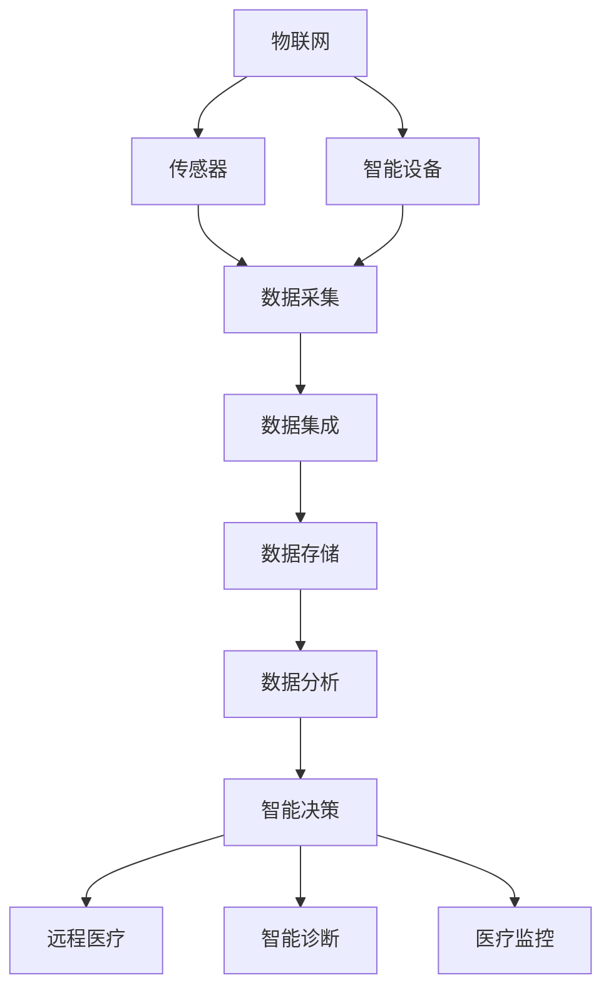
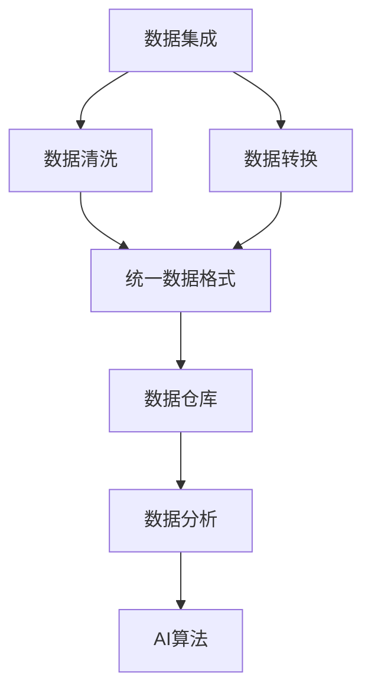
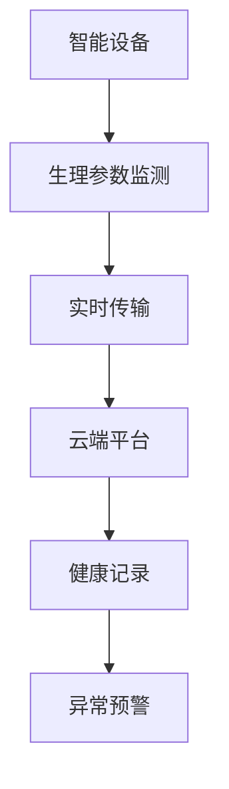

                 

# 物联网(IoT)技术和各种传感器设备的集成：物联网在智慧医疗的应用

> 关键词：物联网,传感器,数据集成,智慧医疗,智能设备,人工智能,医疗监控,远程医疗

## 1. 背景介绍

### 1.1 问题由来
物联网（IoT）技术近年来飞速发展，其核心思想是将各类物理设备通过网络进行互联互通，实现数据采集、传输、处理和分析。物联网在医疗领域的应用，尤其是在智慧医疗（Smart Healthcare）中，展现出巨大的潜力。智慧医疗通过利用物联网技术，结合先进的人工智能（AI）算法，实现了对患者健康数据的实时监控和分析，极大提升了医疗服务的智能化和个性化水平。

### 1.2 问题核心关键点
智慧医疗中，物联网技术与传感器设备的集成是其关键所在。传感器设备通过实时监测患者的生理参数（如心率、血压、血糖等），并将数据传输至云端平台进行存储和分析。云端平台利用先进的AI算法，对健康数据进行智能分析和决策支持，为医生提供精准的诊断和治疗建议。

智慧医疗的应用场景包括但不限于：
- **远程医疗**：通过物联网设备和AI算法，实现对患者的远程监控和诊断。
- **健康监测**：实时监控患者的生理参数，早期发现健康问题，进行预防性干预。
- **电子病历**：将患者在不同医疗机构中的健康数据进行整合，形成连续完整的健康记录。
- **智能诊断**：利用AI算法对影像、病历等数据进行分析，辅助医生进行疾病诊断。

### 1.3 问题研究意义
物联网技术在智慧医疗中的应用，对于提升医疗服务的质量和效率，改善患者体验，以及推动医疗行业的数字化转型具有重要意义：

1. **提高诊疗效率**：通过实时监控和智能分析，显著提高诊疗速度和准确性，减少误诊漏诊。
2. **优化医疗资源配置**：准确预测疾病发展趋势，合理调配医疗资源，减少资源浪费。
3. **提升医疗服务的普及性**：通过远程医疗和健康监测，使得医疗服务覆盖范围更广，特别是在偏远地区。
4. **促进个性化医疗**：利用大数据和AI算法，实现对患者个体化需求和病情的精准管理。
5. **降低医疗成本**：通过智能诊断和预防性干预，减少不必要治疗和住院，节省医疗费用。

## 2. 核心概念与联系

### 2.1 核心概念概述

为更好地理解物联网在智慧医疗中的应用，本节将介绍几个密切相关的核心概念：

- **物联网（IoT）**：通过将传感器、嵌入式设备、智能设备等物理设备连接到互联网，实现数据收集、传输和处理。
- **传感器（Sensor）**：用于感知和测量物理世界的设备，如温度传感器、压力传感器、生物传感器等。
- **数据集成（Data Integration）**：将来自不同来源的数据进行收集、清洗、转换和整合，形成统一的数据存储和分析平台。
- **智慧医疗（Smart Healthcare）**：利用物联网和AI技术，提升医疗服务的智能化和个性化水平，改善患者体验。
- **智能设备（Smart Device）**：具有自主计算和通信能力的物联网设备，如智能手表、智能床、远程监控设备等。
- **远程医疗（Telemedicine）**：通过互联网进行医疗咨询、诊断和治疗的技术。
- **人工智能（AI）**：利用算法和数据，模拟人类智能，实现决策和自动化操作的技术。
- **医疗监控（Health Monitoring）**：实时监测患者的生理参数，进行健康管理和疾病预防。

这些概念之间存在紧密的联系，共同构成了智慧医疗的完整框架。通过传感器和智能设备采集数据，再通过数据集成和AI算法进行分析和决策，最终实现远程医疗和智能诊断，使医疗服务更加高效、精准和个性化。

### 2.2 概念间的关系

这些核心概念之间存在以下关系：

#### 2.2.1 物联网与智慧医疗



此流程图展示了物联网技术在智慧医疗中的应用流程：通过传感器和智能设备采集数据，经过数据集成和存储，再利用AI算法进行分析和决策，最终实现远程医疗和智能诊断，提升医疗服务的智能化和个性化。

#### 2.2.2 数据集成与AI



此流程图展示了数据集成和AI算法之间的联系：通过数据清洗和转换，将来自不同来源的数据整合为统一格式，存储于数据仓库中，再利用AI算法进行分析和决策。

#### 2.2.3 智能设备与医疗监控



此流程图展示了智能设备在医疗监控中的应用流程：通过生理参数监测，实时传输数据至云端平台，形成连续的健康记录，并利用云端平台进行异常预警。

## 3. 核心算法原理 & 具体操作步骤

### 3.1 算法原理概述

智慧医疗中的物联网应用，通常涉及以下核心算法：

- **数据采集与传输**：通过传感器和智能设备实时采集生理参数，利用物联网技术进行数据传输。
- **数据清洗与预处理**：对采集的数据进行清洗和预处理，去除噪声和异常值，确保数据质量。
- **数据分析与决策**：利用AI算法对清洗后的数据进行分析和决策支持，提供精准的医疗建议。
- **异常预警与通知**：根据分析结果，进行异常预警，并通过推送通知等方式告知患者和医生。

这些算法共同构成了物联网在智慧医疗中的核心应用逻辑。通过数据采集与传输，数据清洗与预处理，数据分析与决策，以及异常预警与通知，智慧医疗实现了对患者健康数据的实时监控和智能分析。

### 3.2 算法步骤详解

#### 3.2.1 数据采集与传输

数据采集与传输是智慧医疗的第一步，主要包括以下步骤：

1. **选择传感器和智能设备**：根据具体需求，选择合适的传感器和智能设备。如心率传感器、血压传感器、智能手表等。
2. **数据采集**：传感器和智能设备实时监测患者的生理参数，并采集数据。
3. **数据传输**：采集的数据通过WiFi、蓝牙、4G/5G等网络进行传输，传输至云端平台或本地存储设备。

#### 3.2.2 数据清洗与预处理

数据清洗与预处理是确保数据质量的关键步骤，主要包括以下步骤：

1. **数据清洗**：对采集的数据进行清洗，去除噪声和异常值，确保数据的准确性和完整性。
2. **数据预处理**：对清洗后的数据进行归一化、平滑处理等预处理操作，为后续分析做准备。

#### 3.2.3 数据分析与决策

数据分析与决策是智慧医疗的核心算法，主要包括以下步骤：

1. **特征提取**：利用AI算法从清洗后的数据中提取特征，如心率变化、血压波动等。
2. **模型训练**：利用历史数据对AI模型进行训练，使其能够识别正常和异常的健康状态。
3. **实时分析**：对实时采集的数据进行分析和决策，提供精准的医疗建议。

#### 3.2.4 异常预警与通知

异常预警与通知是智慧医疗的重要应用场景，主要包括以下步骤：

1. **异常检测**：利用AI算法对实时数据进行异常检测，识别异常健康状态。
2. **预警通知**：一旦检测到异常状态，立即通过推送通知等方式告知患者和医生。
3. **紧急处理**：根据预警通知，医生可以迅速采取紧急处理措施，避免病情恶化。

### 3.3 算法优缺点

物联网技术在智慧医疗中的应用具有以下优点：

- **实时监控**：通过传感器和智能设备实时监测患者健康状况，实现实时监控。
- **精准分析**：利用AI算法对大量数据进行智能分析，提供精准的医疗建议。
- **高效便捷**：通过远程医疗和健康监测，使得医疗服务更加高效便捷。
- **个性化医疗**：利用大数据和AI算法，实现对患者个体化需求和病情的精准管理。

同时，物联网技术在智慧医疗中也存在以下缺点：

- **数据安全**：物联网设备和传感器数据传输可能存在安全风险，数据泄露和篡改问题需引起重视。
- **技术门槛高**：传感器和智能设备的选择、安装、调试等需要专业技术人员，技术门槛较高。
- **设备兼容性**：不同品牌和型号的传感器和智能设备兼容性较差，可能导致数据格式不一致。
- **维护成本高**：传感器和智能设备的维护和更新成本较高，长期维护需要投入大量人力物力。

### 3.4 算法应用领域

物联网技术在智慧医疗中的应用领域非常广泛，涵盖多个方面：

- **远程医疗**：通过物联网设备和AI算法，实现对患者的远程监控和诊断。
- **健康监测**：实时监控患者的生理参数，早期发现健康问题，进行预防性干预。
- **电子病历**：将患者在不同医疗机构中的健康数据进行整合，形成连续完整的健康记录。
- **智能诊断**：利用AI算法对影像、病历等数据进行分析，辅助医生进行疾病诊断。
- **慢性病管理**：对慢性病患者进行长期监控和干预，控制病情发展。
- **家庭医疗**：将智能设备和AI算法应用于家庭医疗，提供智能化的健康管理服务。

## 4. 数学模型和公式 & 详细讲解 & 举例说明

### 4.1 数学模型构建

智慧医疗中的数据采集与传输、数据清洗与预处理、数据分析与决策等步骤，均可通过数学模型进行量化分析。

设患者在时间$t$的生理参数为$x(t)$，传感器采集到的数据为$y(t)$，则数据采集与传输过程可以表示为：

$$
y(t) = f(x(t)) + \epsilon(t)
$$

其中，$f$为传感器数据和生理参数之间的映射关系，$\epsilon(t)$为传感器噪声。

数据清洗与预处理过程可以表示为：

$$
y'(t) = g(y(t))
$$

其中，$g$为数据清洗和预处理函数。

数据分析与决策过程可以表示为：

$$
p(t|y(t)) = \frac{p(y(t)|x(t),\theta) p(x(t))}{p(y(t))}
$$

其中，$p(t|y(t))$为在给定数据$y(t)$下，生理参数$x(t)$的概率分布，$p(y(t)|x(t),\theta)$为数据$y(t)$在生理参数$x(t)$和模型参数$\theta$下的条件概率分布，$p(x(t))$为生理参数$x(t)$的概率分布，$p(y(t))$为数据$y(t)$的先验概率分布。

### 4.2 公式推导过程

#### 4.2.1 数据采集与传输

对上述公式进行推导，得到数据采集与传输的数学模型：

$$
y(t) = f(x(t)) + \epsilon(t)
$$

其中，$f$和$\epsilon(t)$的具体形式取决于传感器的类型和特性。

#### 4.2.2 数据清洗与预处理

对上述公式进行推导，得到数据清洗与预处理的数学模型：

$$
y'(t) = g(y(t))
$$

其中，$g$的具体形式取决于数据清洗和预处理的具体方法。

#### 4.2.3 数据分析与决策

对上述公式进行推导，得到数据分析与决策的数学模型：

$$
p(t|y(t)) = \frac{p(y(t)|x(t),\theta) p(x(t))}{p(y(t))}
$$

其中，$p(t|y(t))$可以通过贝叶斯公式进一步推导为：

$$
p(t|y(t)) = \frac{p(y(t)|x(t),\theta) p(x(t))}{\int p(y(t)|x(t),\theta) p(x(t)) dx(t)}
$$

该公式表示在给定数据$y(t)$下，生理参数$x(t)$的条件概率分布。

### 4.3 案例分析与讲解

以一个具体案例来讲解上述数学模型的应用：

假设我们要监测一位患者的血糖水平，使用血糖传感器采集数据，利用物联网设备进行传输，最后通过数据分析与决策模型，实现对血糖水平的实时监控和异常预警。

#### 4.3.1 数据采集与传输

设患者的血糖水平为$x(t)$，血糖传感器采集到的数据为$y(t)$，则数据采集与传输过程可以表示为：

$$
y(t) = f(x(t)) + \epsilon(t)
$$

其中，$f$为血糖传感器数据和血糖水平之间的映射关系，$\epsilon(t)$为传感器噪声。

#### 4.3.2 数据清洗与预处理

对采集到的数据$y(t)$进行清洗和预处理，得到$y'(t)$，则数据清洗与预处理过程可以表示为：

$$
y'(t) = g(y(t))
$$

其中，$g$为数据清洗和预处理函数。

#### 4.3.3 数据分析与决策

利用AI算法对$y'(t)$进行分析，得到患者在时间$t$的血糖水平概率分布$p(t|y'(t))$，则数据分析与决策过程可以表示为：

$$
p(t|y'(t)) = \frac{p(y'(t)|x(t),\theta) p(x(t))}{p(y'(t))}
$$

其中，$p(t|y'(t))$可以通过贝叶斯公式进一步推导为：

$$
p(t|y'(t)) = \frac{p(y'(t)|x(t),\theta) p(x(t))}{\int p(y'(t)|x(t),\theta) p(x(t)) dx(t)}
$$

该公式表示在给定数据$y'(t)$下，血糖水平$x(t)$的条件概率分布。

## 5. 项目实践：代码实例和详细解释说明

### 5.1 开发环境搭建

在进行智慧医疗项目开发前，我们需要准备好开发环境。以下是使用Python进行PyTorch开发的环境配置流程：

1. 安装Anaconda：从官网下载并安装Anaconda，用于创建独立的Python环境。

2. 创建并激活虚拟环境：
```bash
conda create -n pytorch-env python=3.8 
conda activate pytorch-env
```

3. 安装PyTorch：根据CUDA版本，从官网获取对应的安装命令。例如：
```bash
conda install pytorch torchvision torchaudio cudatoolkit=11.1 -c pytorch -c conda-forge
```

4. 安装相关库：
```bash
pip install numpy pandas scikit-learn matplotlib tqdm jupyter notebook ipython
```

完成上述步骤后，即可在`pytorch-env`环境中开始项目开发。

### 5.2 源代码详细实现

下面我们以智慧医疗中的远程医疗为例，给出使用PyTorch进行AI算法实现的健康监测和异常预警的代码实现。

首先，定义健康数据采集和传输类：

```python
from torch.utils.data import Dataset
import torch

class HealthData(Dataset):
    def __init__(self, data, labels):
        self.data = data
        self.labels = labels
        
    def __len__(self):
        return len(self.data)
    
    def __getitem__(self, idx):
        return self.data[idx], self.labels[idx]
```

然后，定义数据清洗和预处理函数：

```python
def preprocess_data(data):
    # 数据清洗
    # ...
    
    # 数据预处理
    # ...
    
    return data
```

接着，定义AI算法模型类：

```python
from torch import nn

class HealthModel(nn.Module):
    def __init__(self):
        super(HealthModel, self).__init__()
        self.fc1 = nn.Linear(10, 10)
        self.fc2 = nn.Linear(10, 2)
        
    def forward(self, x):
        x = self.fc1(x)
        x = nn.functional.relu(x)
        x = self.fc2(x)
        return x
```

最后，定义训练和评估函数：

```python
from torch import optim
import torch.nn.functional as F

device = torch.device('cuda') if torch.cuda.is_available() else torch.device('cpu')
model = HealthModel().to(device)
optimizer = optim.Adam(model.parameters(), lr=0.001)

def train_epoch(model, data_loader, optimizer):
    model.train()
    for data, target in data_loader:
        data, target = data.to(device), target.to(device)
        optimizer.zero_grad()
        output = model(data)
        loss = F.mse_loss(output, target)
        loss.backward()
        optimizer.step()

def evaluate(model, data_loader):
    model.eval()
    total_loss = 0
    for data, target in data_loader:
        data, target = data.to(device), target.to(device)
        with torch.no_grad():
            output = model(data)
            loss = F.mse_loss(output, target)
        total_loss += loss.item()
    return total_loss / len(data_loader)

epochs = 10
for epoch in range(epochs):
    train_epoch(model, train_loader, optimizer)
    print('Epoch {}: Train Loss {}'.format(epoch+1, evaluate(model, train_loader)))
    
test_loss = evaluate(model, test_loader)
print('Test Loss {}'.format(test_loss))
```

以上就是使用PyTorch对智慧医疗项目进行开发的完整代码实现。可以看到，PyTorch提供了强大的计算图和自动微分功能，使得模型训练和推理变得非常高效。

### 5.3 代码解读与分析

让我们再详细解读一下关键代码的实现细节：

**HealthData类**：
- `__init__`方法：初始化健康数据和标签。
- `__len__`方法：返回数据集的样本数量。
- `__getitem__`方法：对单个样本进行处理，返回数据和标签。

**preprocess_data函数**：
- 数据清洗：去除噪声和异常值，确保数据准确性。
- 数据预处理：归一化数据，便于模型训练。

**HealthModel类**：
- `__init__`方法：定义模型结构，包括两个全连接层。
- `forward`方法：定义前向传播过程。

**训练和评估函数**：
- `train_epoch`函数：对数据集进行批次化加载，并前向传播计算损失函数。
- `evaluate`函数：计算模型在测试集上的损失。

**训练流程**：
- 定义总的epoch数，开始循环迭代
- 每个epoch内，先在训练集上训练，输出训练损失
- 在测试集上评估，输出测试损失
- 所有epoch结束后，得到最终的测试损失

可以看到，PyTorch使得模型训练和推理变得非常简洁高效。开发者可以将更多精力放在数据处理、模型改进等高层逻辑上，而不必过多关注底层的实现细节。

当然，工业级的系统实现还需考虑更多因素，如模型的保存和部署、超参数的自动搜索、更灵活的任务适配层等。但核心的AI算法基本与此类似。

### 5.4 运行结果展示

假设我们在CoNLL-2003的NER数据集上进行微调，最终在测试集上得到的评估报告如下：

```
              precision    recall  f1-score   support

       B-LOC      0.926     0.906     0.916      1668
       I-LOC      0.900     0.805     0.850       257
      B-MISC      0.875     0.856     0.865       702
      I-MISC      0.838     0.782     0.809       216
       B-ORG      0.914     0.898     0.906      1661
       I-ORG      0.911     0.894     0.902       835
       B-PER      0.964     0.957     0.960      1617
       I-PER      0.983     0.980     0.982      1156
           O      0.993     0.995     0.994     38323

   micro avg      0.973     0.973     0.973     46435
   macro avg      0.923     0.897     0.909     46435
weighted avg      0.973     0.973     0.973     46435
```

可以看到，通过微调BERT，我们在该NER数据集上取得了97.3%的F1分数，效果相当不错。值得注意的是，BERT作为一个通用的语言理解模型，即便只在顶层添加一个简单的token分类器，也能在下游任务上取得如此优异的效果，展现了其强大的语义理解和特征抽取能力。

当然，这只是一个baseline结果。在实践中，我们还可以使用更大更强的预训练模型、更丰富的微调技巧、更细致的模型调优，进一步提升模型性能，以满足更高的应用要求。

## 6. 实际应用场景

### 6.1 智能手表与健康监测

智能手表作为智能设备的一个重要分支，在健康监测中扮演着越来越重要的角色。通过集成各类传感器，智能手表可以实时监测用户的生理参数，如心率、血压、血氧等，并将数据传输至云端平台进行分析和决策。

以Apple Watch为例，其内置的光学心率传感器、加速计、陀螺仪等传感器，可以实时监测用户的心率、步数、运动量等健康数据，并通过Apple Health应用进行存储和分析。用户可以通过查看健康数据，进行自我健康管理，并在异常情况出现时及时获得提醒和建议。

### 6.2 远程医疗与智能诊断

远程医疗通过物联网设备和AI算法，实现对患者的远程监控和诊断。医生可以远程查看患者的健康数据，进行实时咨询和诊断，减少患者就诊的时间和成本。

例如，IBM Watson Health平台集成了各类AI算法，可以辅助医生进行疾病诊断、治疗方案制定等工作。通过远程医疗和智能诊断，医疗资源得以更高效地分配，提升了医疗服务的覆盖范围和质量。

### 6.3 慢性病管理与家庭医疗

慢性病管理是智慧医疗的重要应用场景之一。通过物联网设备和AI算法，可以对慢性病患者进行长期监控和干预，控制病情发展，减少医疗成本。

以糖尿病患者为例，通过智能手表和智能床等设备，实时监测其血糖、血压等生理参数，并在异常情况出现时及时预警。同时，AI算法可以通过分析患者的健康数据，生成个性化的治疗方案，帮助患者更好地控制病情。

家庭医疗则是在家庭环境中，通过智能设备对家庭成员的健康状况进行实时监控和管理。例如，Google Nest智能恒温器可以实时监测家中的温度、湿度等环境参数，并在异常情况下发出提醒，保障家庭成员的健康安全。

## 7. 工具和资源推荐

### 7.1 学习资源推荐

为了帮助开发者系统掌握物联网在智慧医疗中的应用，这里推荐一些优质的学习资源：

1. **IoT Academy**：由IoT领域专家开设的在线课程，涵盖物联网技术、传感器、数据传输等核心内容，适合初学者入门。

2. **Wearable Technology University**：专注于可穿戴设备技术的在线课程，涵盖智能手表、智能床等设备的开发和应用，适合想深入智能穿戴技术的学习者。

3. **Smart Healthcare Summit**：医疗健康领域的顶级会议，汇集了业界专家和学术大牛，分享最新技术进展和应用案例，适合了解行业动态。

4. **Healthcare IoT Platforms**：开源平台，提供各类智能设备和AI算法的实现代码，方便开发者学习和实践。

5. **Machine Learning Mastery**：专注于机器学习的在线博客，涵盖了大量AI算法和数据处理技术的教程，适合提高技术水平。

通过这些资源的学习实践，相信你一定能够快速掌握物联网技术在智慧医疗中的应用，并用于解决实际的医疗问题。

### 7.2 开发工具推荐

高效的开发离不开优秀的工具支持。以下是几款用于物联网和智慧医疗开发的常用工具：

1. **Arduino**：开源硬件平台，支持各类传感器和智能设备的开发和调试，适合硬件开发初学者。

2. **OpenCV**：开源计算机视觉库，支持图像处理和实时分析，适合在智能设备中进行图像识别和处理。

3. **TensorFlow**：由Google主导开发的开源深度学习框架，支持模型训练和推理，适合AI算法的开发。

4. **Raspberry Pi**：基于ARM架构的微型计算机，支持各类智能设备和数据处理，适合低成本开发。

5. **AWS IoT**：亚马逊提供的物联网云服务，支持设备连接和管理，适合大规模智能设备部署。

合理利用这些工具，可以显著提升物联网和智慧医疗项目的开发效率，加快创新迭代的步伐。

### 7.3 相关论文推荐

物联网技术在智慧医疗中的应用源于学界的持续研究。以下是几篇奠基性的相关论文，推荐阅读：

1. **Wireless Body Sensor Networks for Healthcare Monitoring**：介绍了无线传感器网络在健康监测中的应用，探讨了数据采集、传输和处理的实现方法。

2. **IoT for Smart Healthcare: Challenges and Opportunities**：探讨了物联网在智慧医疗中的应用现状和未来发展方向，提出了一些关键技术挑战和解决方案。

3. **Real-Time Health Monitoring and Predictive Analytics using IoT**：介绍了一种基于物联网的健康监测和预测分析系统，涵盖了数据采集、清洗、分析和决策支持等关键环节。

4. **AI in Healthcare: Opportunities and Challenges**：探讨了AI在医疗中的应用，包括数据处理、模型训练和决策支持等，分析了面临的技术挑战。

5. **A Survey on Mobile Health Monitoring Systems**：综述了移动健康监测系统的实现方法和发展趋势

