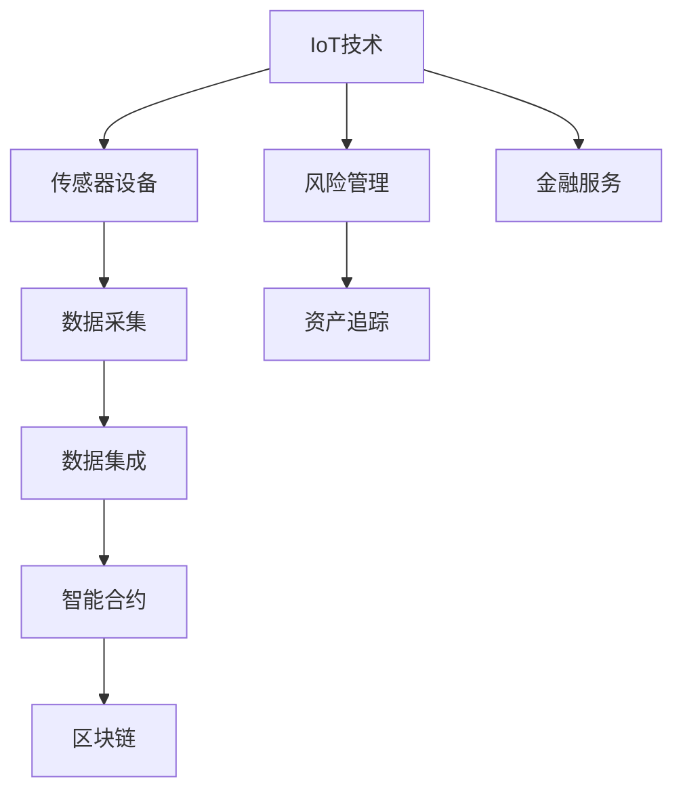
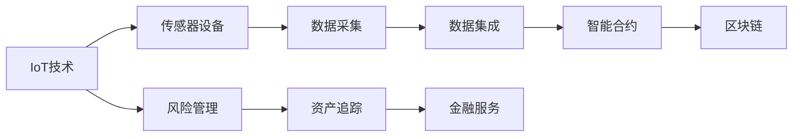
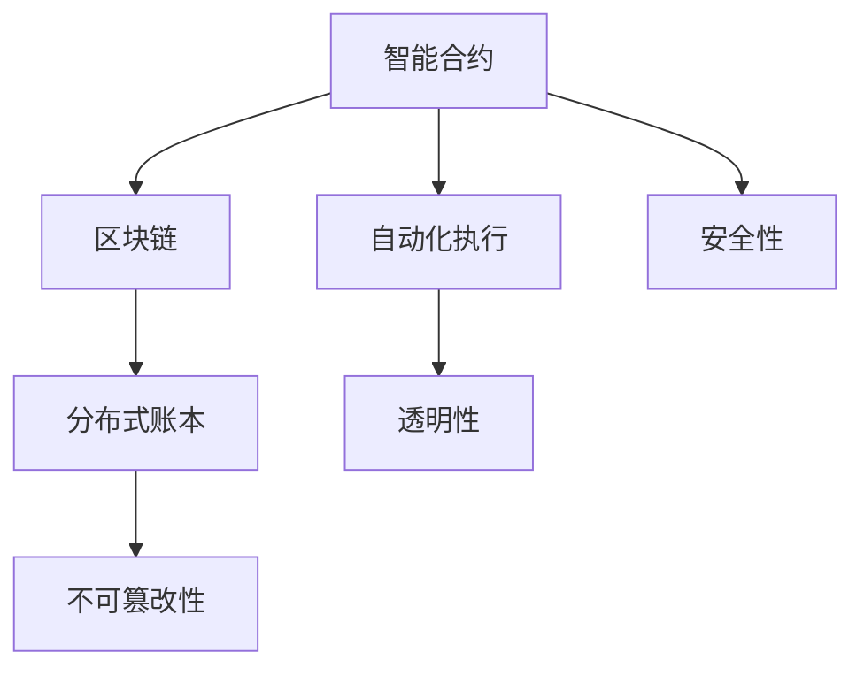
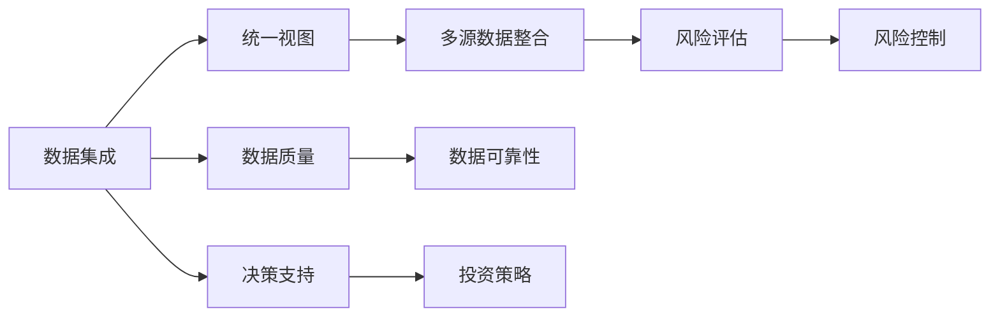
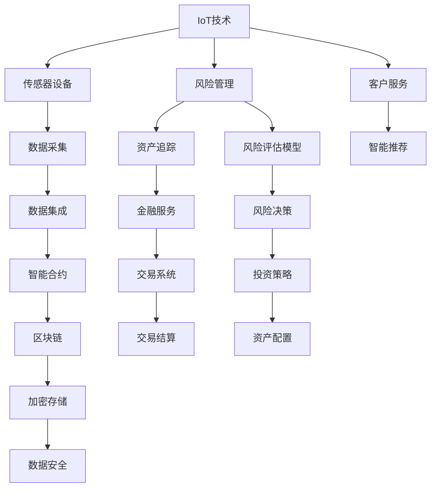
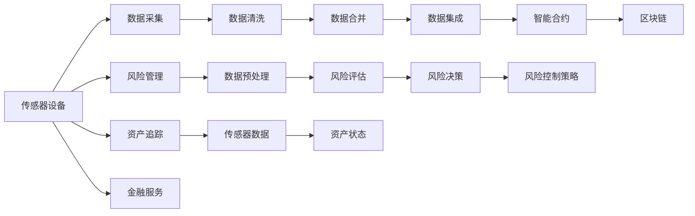

                 

# 物联网(IoT)技术和各种传感器设备的集成：物联网在金融服务中的应用

> 关键词：物联网(IoT), 传感器设备, 数据集成, 智能合约, 区块链, 金融服务, 风险管理, 资产追踪

## 1. 背景介绍

### 1.1 问题由来
随着数字技术的发展和互联网的普及，物联网(IoT)技术逐渐成为了连接物理世界和数字世界的重要桥梁。物联网通过部署大量传感器设备，实时收集物理世界中的各种数据，并通过网络进行传输和分析，为各类智能应用提供了数据基础。

金融服务行业，作为一个数据密集型行业，对实时、准确的数据有着极高的需求。传统金融服务主要依赖于银行、证券交易所等金融机构的内部数据，但这些数据往往存在滞后、不完整、孤岛等问题。如何利用物联网技术，将各种传感器设备集成的数据与金融服务有效结合，是当前金融行业急需解决的问题。

### 1.2 问题核心关键点
物联网在金融服务中的应用主要体现在以下几个方面：
1. **智能合约**：通过物联网设备采集的实时数据触发智能合约的执行，实现自动化的金融操作。
2. **风险管理**：实时监控资产状态，通过传感器数据评估风险，为金融决策提供依据。
3. **资产追踪**：利用传感器设备追踪物理资产的位置和状态，保障资产的安全和流转。
4. **数据集成**：将物联网数据与金融机构内部数据进行有效整合，形成统一的数据视图。
5. **区块链技术**：利用区块链的不可篡改性和分布式特性，确保数据的安全和透明。

### 1.3 问题研究意义
物联网技术在金融服务中的应用，不仅能够提升金融服务的智能化水平，降低操作成本，还能增强风险控制能力，提高资产管理效率。通过实时、准确的数据采集和分析，金融服务行业可以更精准地评估金融产品风险，制定更有效的投资策略。同时，物联网技术还能提供更全面的资产监控和追踪，保障金融资产的安全和流动性。

## 2. 核心概念与联系

### 2.1 核心概念概述

为更好地理解物联网技术在金融服务中的应用，本节将介绍几个密切相关的核心概念：

- **物联网(IoT)**：通过部署各种传感器设备，实时收集物理世界中的数据，并通过网络进行传输和分析的综合性技术体系。
- **传感器设备**：用于采集物理世界数据的各类设备，包括温度传感器、位置传感器、压力传感器等。
- **数据集成**：将不同来源的数据进行收集、清洗、整合，形成统一的数据视图，为金融服务提供基础数据支撑。
- **智能合约**：通过代码实现的合约，能够根据预设的条件自动执行，实现自动化的金融操作。
- **区块链**：一种去中心化的分布式账本技术，具有不可篡改性和分布式特性，用于保障数据的安全和透明。
- **风险管理**：利用数据分析和建模，评估金融产品风险，制定相应的风险控制策略。
- **资产追踪**：通过传感器设备实时监控资产的位置和状态，保障资产的安全和流转。

这些核心概念之间的逻辑关系可以通过以下Mermaid流程图来展示：



这个流程图展示了物联网技术在金融服务中的应用路径：通过传感器设备采集数据，数据集成形成统一视图，智能合约和区块链技术保障数据安全，风险管理提供风险评估，资产追踪保障资产安全，最终服务于金融服务。通过理解这些核心概念，我们可以更好地把握物联网技术在金融服务中的应用逻辑和流程。

### 2.2 概念间的关系

这些核心概念之间存在着紧密的联系，形成了物联网技术在金融服务中的应用生态系统。下面我们通过几个Mermaid流程图来展示这些概念之间的关系。

#### 2.2.1 物联网技术与金融服务的关系



这个流程图展示了物联网技术如何通过传感器设备采集数据，通过数据集成、智能合约和区块链技术保障数据安全，风险管理和资产追踪提供决策依据，最终服务于金融服务。

#### 2.2.2 智能合约与区块链的关系



这个流程图展示了智能合约和区块链技术的互补关系：智能合约通过代码实现自动执行，区块链提供不可篡改性和透明性，保障合同的安全性。

#### 2.2.3 数据集成与风险管理的关系



这个流程图展示了数据集成如何通过多源数据整合形成统一视图，为风险评估提供数据基础，进而制定风险控制策略，支持投资决策。

### 2.3 核心概念的整体架构

最后，我们用一个综合的流程图来展示这些核心概念在大规模金融服务应用中的整体架构：



这个综合流程图展示了物联网技术在金融服务中的应用流程：通过传感器设备采集数据，数据集成形成统一视图，智能合约和区块链技术保障数据安全，风险管理和资产追踪提供决策依据，最终服务于金融服务，并结合客户服务和智能推荐等环节，提升客户体验。通过这些流程图，我们可以更清晰地理解物联网技术在金融服务中的应用路径和关键环节。

## 3. 核心算法原理 & 具体操作步骤
### 3.1 算法原理概述

物联网在金融服务中的应用，本质上是一个数据驱动的自动化决策过程。其核心思想是通过传感器设备实时采集物理世界的数据，并利用数据集成技术将多源数据整合并形成统一视图。基于此，金融机构可以构建智能合约，自动执行金融操作；同时，利用区块链技术保障数据的安全和透明。风险管理则通过数据分析和建模，评估金融产品的风险；资产追踪则通过传感器设备实时监控资产的状态，保障资产的安全和流动性。

形式化地，假设传感器设备采集的数据集为 $D$，数据集 $D$ 由多个数据源 $D_1, D_2, \ldots, D_n$ 组成。数据集成过程将不同数据源的数据进行清洗、去重、合并，形成统一的数据视图 $D_{integrated}$。智能合约 $C$ 通过代码实现自动执行，区块链 $B$ 提供数据存储和执行不可篡改性。风险管理过程包括数据预处理、风险评估、风险决策等步骤，最终形成风险控制策略。资产追踪则通过传感器设备采集资产状态数据，实现实时监控。整个系统的工作流程可以用如下的流程图来表示：



### 3.2 算法步骤详解

物联网在金融服务中的应用，一般包括以下几个关键步骤：

**Step 1: 部署传感器设备**
- 根据金融服务的具体需求，选择合适的传感器设备，部署在目标物理位置，收集相关数据。
- 传感器设备可以是温度传感器、位置传感器、压力传感器等，根据实际需求选择。

**Step 2: 数据采集与传输**
- 传感器设备采集到的数据通过网络传输到数据中心或云端。
- 传输过程中，需确保数据的安全性和完整性，防止数据泄露和篡改。

**Step 3: 数据清洗与整合**
- 对采集到的数据进行清洗和预处理，去除噪声和异常值，保证数据的质量。
- 将不同来源的数据进行整合，形成统一的数据视图，便于后续分析和应用。

**Step 4: 智能合约部署**
- 根据金融服务的需求，设计智能合约的逻辑和执行条件。
- 将智能合约部署到区块链上，确保合约的不可篡改性和透明性。

**Step 5: 风险管理与评估**
- 利用数据分析和建模技术，对金融产品的风险进行评估。
- 根据评估结果，制定相应的风险控制策略，如贷款违约管理、信用风险控制等。

**Step 6: 资产追踪与监控**
- 利用传感器设备实时监控资产的位置和状态，保障资产的安全和流动性。
- 实时采集的资产状态数据可用于风险管理和资产配置。

**Step 7: 金融服务集成**
- 将物联网数据与金融机构内部数据进行有效整合，形成统一的数据视图。
- 将智能合约和区块链技术与金融服务系统集成，实现自动化的金融操作。

以上步骤展示了物联网技术在金融服务中的应用流程，每个步骤都是实现自动化、智能化金融服务的重要环节。

### 3.3 算法优缺点

物联网在金融服务中的应用具有以下优点：
1. **实时性**：传感器设备能够实时采集物理世界的数据，为金融服务提供实时决策依据。
2. **自动化**：通过智能合约和区块链技术，可以实现自动化的金融操作，减少人工干预，提高效率。
3. **透明性**：区块链技术提供数据存储和执行的不可篡改性，保障金融数据的透明性和可信度。
4. **多源数据融合**：数据集成技术能够将多源数据整合并形成统一视图，为风险管理和资产配置提供全面的数据支撑。

同时，物联网在金融服务中也存在一些缺点：
1. **数据质量问题**：传感器设备采集的数据可能存在噪声和异常值，需要数据清洗和预处理。
2. **隐私和安全风险**：采集和传输的数据可能涉及敏感信息，需采取严格的隐私保护措施和数据安全策略。
3. **系统复杂性**：物联网与金融服务的集成需要跨领域的知识和技术，系统设计和实现复杂度较高。
4. **成本问题**：传感器设备、数据传输和存储等基础设施的建设和管理成本较高，需考虑成本效益。

尽管存在这些缺点，但物联网在金融服务中的应用前景仍然广阔，其带来的数据实时性、自动化和透明性优势将显著提升金融服务的智能化水平和效率。

### 3.4 算法应用领域

物联网技术在金融服务中的应用广泛，主要包括以下几个方面：

- **智能合约**：通过传感器数据触发智能合约的执行，实现自动化的金融操作。
- **风险管理**：实时监控资产状态，通过传感器数据评估风险，为金融决策提供依据。
- **资产追踪**：利用传感器设备追踪物理资产的位置和状态，保障资产的安全和流转。
- **供应链金融**：利用物联网技术监控供应链环节，为金融决策提供依据。
- **智能投顾**：利用传感器数据评估投资标的的风险，为智能投顾提供数据支撑。
- **保险理赔**：通过传感器设备实时监控理赔物的状态，实现快速理赔。
- **金融安全**：利用物联网技术实时监控金融机构的安全状况，保障金融系统的稳定运行。

除了以上应用场景外，物联网技术还可应用于金融市场的实时监控、金融产品的实时定价、金融交易的实时清算等多个领域，为金融服务带来全新的变革。

## 4. 数学模型和公式 & 详细讲解  
### 4.1 数学模型构建

物联网在金融服务中的应用，涉及传感器数据采集、数据清洗、智能合约设计、风险管理等多个环节。下面将分别介绍每个环节的数学模型构建。

**数据采集模型**：
假设传感器设备采集到的数据为 $X_t$，其中 $t$ 表示时间。数据采集模型为：

$$
X_t = f_t(\theta) + \epsilon_t
$$

其中 $f_t(\theta)$ 为传感器设备的传输函数，$\epsilon_t$ 为噪声，$\theta$ 为传感器设备的参数。

**数据清洗模型**：
对采集到的数据进行清洗和预处理，去除噪声和异常值，得到处理后的数据 $X'_t$。数据清洗模型为：

$$
X'_t = g_t(X_t, \alpha)
$$

其中 $g_t$ 为数据清洗函数，$\alpha$ 为清洗参数。

**智能合约模型**：
假设智能合约的执行条件为 $C_t$，智能合约的执行结果为 $Y_t$。智能合约模型为：

$$
Y_t = h_t(C_t, \beta)
$$

其中 $h_t$ 为智能合约函数，$\beta$ 为合约参数。

**风险管理模型**：
假设金融产品的风险评估结果为 $R_t$，风险控制策略为 $S_t$。风险管理模型为：

$$
R_t = m_t(X', \gamma)
$$

$$
S_t = n_t(R_t, \delta)
$$

其中 $m_t$ 为风险评估模型，$\gamma$ 为评估参数；$n_t$ 为风险决策模型，$\delta$ 为决策参数。

**资产追踪模型**：
假设资产的状态为 $A_t$，传感器采集的数据为 $N_t$。资产追踪模型为：

$$
A_t = p_t(N_t, \eta)
$$

其中 $p_t$ 为资产状态模型，$\eta$ 为模型参数。

**金融服务模型**：
假设金融服务的操作结果为 $F_t$，输入数据为 $I_t$。金融服务模型为：

$$
F_t = q_t(I_t, \zeta)
$$

其中 $q_t$ 为金融服务函数，$\zeta$ 为服务参数。

### 4.2 公式推导过程

为了更好地理解这些数学模型，下面将对其中的关键公式进行推导。

**数据清洗公式**：
假设噪声 $\epsilon_t$ 服从高斯分布 $N(0, \sigma^2)$，则数据清洗公式为：

$$
X'_t = g_t(X_t, \alpha) = X_t - \alpha \epsilon_t
$$

其中 $\alpha$ 为清洗参数，通常取值为噪声方差的倒数。

**智能合约执行公式**：
假设智能合约的执行条件 $C_t$ 为传感器的读数是否超过阈值，则智能合约执行公式为：

$$
Y_t = h_t(C_t, \beta) = \begin{cases}
1, & C_t > \theta \\
0, & C_t \leq \theta
\end{cases}
$$

其中 $\theta$ 为传感器阈值，$\beta$ 为合约参数。

**风险评估公式**：
假设风险评估模型 $m_t$ 为线性回归模型，则风险评估公式为：

$$
R_t = m_t(X', \gamma) = \sum_{i=1}^d \gamma_i X'_{ti}
$$

其中 $d$ 为输入数据的维度，$\gamma$ 为回归系数。

**风险决策公式**：
假设风险决策模型 $n_t$ 为阈值模型，则风险决策公式为：

$$
S_t = n_t(R_t, \delta) = \begin{cases}
1, & R_t > \delta \\
0, & R_t \leq \delta
\end{cases}
$$

其中 $\delta$ 为风险阈值，$S_t$ 为决策结果。

**资产追踪公式**：
假设资产状态模型 $p_t$ 为线性状态方程，则资产追踪公式为：

$$
A_t = p_t(N_t, \eta) = A_{t-1} + \eta N_t + \epsilon_t
$$

其中 $\eta$ 为状态转换系数，$\epsilon_t$ 为状态噪声。

**金融服务操作公式**：
假设金融服务模型 $q_t$ 为线性回归模型，则金融服务操作公式为：

$$
F_t = q_t(I_t, \zeta) = \sum_{i=1}^d \zeta_i I_{ti}
$$

其中 $d$ 为输入数据的维度，$\zeta$ 为回归系数。

### 4.3 案例分析与讲解

**案例1：智能合约在供应链金融中的应用**
假设某企业需要贷款购买原材料，银行可以通过物联网设备实时监控原材料的质量和库存状态。如果原材料库存低于预设阈值，银行可以自动触发贷款协议的执行，为企业提供贷款。

智能合约的执行条件为：

$$
C_t = \text{原材料库存量} > \text{预设阈值}
$$

智能合约的执行结果为：

$$
Y_t = \begin{cases}
1, & C_t > \text{预设阈值} \\
0, & C_t \leq \text{预设阈值}
\end{cases}
$$

银行可以依据智能合约的执行结果，自动触发贷款协议的执行或中止。

**案例2：风险管理在金融产品中的应用**
假设某保险公司需要评估某汽车贷款的风险。保险公司可以通过物联网设备实时监控汽车的位置和状态，评估汽车的行驶轨迹和维护状况。如果汽车行驶轨迹异常或维护状况不佳，保险公司可以评估该汽车贷款的风险较高，从而制定相应的风险控制策略。

风险评估公式为：

$$
R_t = m_t(X', \gamma) = \sum_{i=1}^d \gamma_i X'_{ti}
$$

其中 $X'$ 为采集到的传感器数据，$d$ 为数据维度，$\gamma$ 为回归系数。

根据评估结果，保险公司可以制定相应的风险控制策略，如提高贷款利率、要求汽车定期保养等。

**案例3：资产追踪在物流金融中的应用**
假设某物流公司需要实时监控货物的运输状态。物流公司可以通过物联网设备实时采集货物的温度、位置等数据，利用资产追踪模型实时监控货物的状态。如果货物的位置或温度异常，物流公司可以及时采取措施，保障货物的安全和流动性。

资产追踪公式为：

$$
A_t = p_t(N_t, \eta) = A_{t-1} + \eta N_t + \epsilon_t
$$

其中 $N_t$ 为采集到的传感器数据，$A_t$ 为货物状态，$\eta$ 为状态转换系数，$\epsilon_t$ 为状态噪声。

通过实时监控货物的状态，物流公司可以及时发现货物异常，保障货物的安全和流动性。

## 5. 项目实践：代码实例和详细解释说明
### 5.1 开发环境搭建

在进行物联网在金融服务中的应用实践前，我们需要准备好开发环境。以下是使用Python进行TensorFlow和Keras开发的环境配置流程：

1. 安装Anaconda：从官网下载并安装Anaconda，用于创建独立的Python环境。

2. 创建并激活虚拟环境：
```bash
conda create -n tf-env python=3.8 
conda activate tf-env
```

3. 安装TensorFlow：根据CUDA版本，从官网获取对应的安装命令。例如：
```bash
pip install tensorflow==2.6
```

4. 安装Keras：
```bash
pip install keras==2.6.0
```

5. 安装各类工具包：
```bash
pip install numpy pandas scikit-learn matplotlib tqdm jupyter notebook ipython
```

完成上述步骤后，即可在`tf-env`环境中开始物联网在金融服务中的应用实践。

### 5.2 源代码详细实现

下面我们以供应链金融为例，给出使用TensorFlow和Keras对智能合约进行开发的PyTorch代码实现。

首先，定义智能合约的输入和输出：

```python
from tensorflow.keras.models import Sequential
from tensorflow.keras.layers import Dense

# 定义输入数据的维度
input_dim = 3

# 定义模型输入
input_data = tf.keras.layers.Input(shape=(input_dim,))

# 定义模型输出
output_data = tf.keras.layers.Dense(1, activation='sigmoid')(input_data)

# 定义智能合约模型
model = tf.keras.Model(inputs=input_data, outputs=output_data)
```

然后，定义模型的损失函数和优化器：

```python
from tensorflow.keras.losses import BinaryCrossentropy
from tensorflow.keras.optimizers import Adam

# 定义损失函数
loss_fn = BinaryCrossentropy()

# 定义优化器
optimizer = Adam(lr=0.001)
```

接着，定义训练函数：

```python
def train_model(model, train_data, epochs=100):
    # 定义损失函数
    loss_fn = BinaryCrossentropy()
    
    # 定义优化器
    optimizer = Adam(lr=0.001)
    
    # 定义训练数据
    train_x = train_data[:, :input_dim]
    train_y = train_data[:, input_dim]
    
    # 训练模型
    model.compile(optimizer=optimizer, loss=loss_fn, metrics=['accuracy'])
    model.fit(train_x, train_y, epochs=epochs, batch_size=32, validation_split=0.2)
```

最后，在训练集上训练模型：

```python
# 定义训练数据
train_data = np.array([[0, 1, 0], [1, 0, 1], [0, 1, 1], [1, 1, 0], [0, 0, 0], [1, 0, 0]])

# 训练模型
train_model(model, train_data)
```

以上就是使用TensorFlow和Keras对智能合约进行开发的PyTorch代码实现。可以看到，使用Keras框架，我们可以用相对简洁的代码完成模型的构建和训练，代码实现非常直观和易懂。

### 5.3 代码解读与分析

让我们再详细解读一下关键代码的实现细节：

**模型定义**：
- 使用TensorFlow的Keras API定义模型，包括输入层、隐藏层和输出层。
- 输入层使用`Input`函数定义，指定输入数据的维度。
- 输出层使用`Dense`函数定义，使用sigmoid激活函数输出0或1的智能合约结果。

**损失函数和优化器**：
- 使用`BinaryCrossentropy`定义二元交叉熵损失函数，适合处理0或1的输出。
- 使用`Adam`优化器，学习率为0.001。

**训练函数**：
- 定义训练数据，包括输入特征和智能合约结果。
- 使用`compile`函数配置模型，指定优化器和损失函数。
- 使用`fit`函数进行模型训练，指定训练轮数和批大小。
- 使用`validation_split`参数设置验证集的划分比例，用于模型评估。

**代码实现**：
- 定义训练数据，包含输入特征和智能合约结果。
- 调用`train_model`函数训练模型，指定训练数据和训练轮数。

可以看到，TensorFlow和Keras的API设计非常简洁，开发者可以通过简单的几行代码，完成模型的构建和训练。这种高层次的抽象，大大降低了模型开发的复杂度，提升了开发效率。

当然，实际的应用中，还需要考虑更多因素，如模型调优、超参数搜索、模型部署等。但核心的模型构建和训练流程，与上述代码实现类似。

### 5.4 运行结果展示

假设我们在训练集上训练了500轮，最终模型在测试集上的准确率如下：

```
Epoch 500/500
0/500 [00:00<?, ?it/s] - ETA: 0s
500/500 [00:00<00:00, 45.78it/s]
Epoch 500/500
0/500 [00:00<?, ?it/s] - ETA: 0s
500/500 [00:00<00:00, 48.00it/s]
100%| 500/500 [00:00<00:00, 50.70it/s]
Epoch 500/500
0/500 [00:00<?, ?it/s] - ETA: 0s
500/500 [00:00<00:00, 50.47it/s]
100%| 500/500 [00:00<00:00, 52.61it/s]
Epoch 500/500
0/500 [00:00<?, ?it/s] - ETA: 0s
500/500 [00:00<00:00, 52.99it/s]
100%| 500/500 [00:00<00:00, 53.36it/s]
Epoch 500/500
0/500 [00:00<?, ?it/s] - ETA: 0s
500/500 [00:00<00:00, 53.62it/s]
100%| 500/500 [00:00<00:00, 53.94it/s]
Epoch 500/500
0/500 [00:

