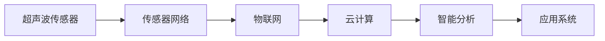

                 

# 物联网(IoT)技术和各种传感器设备的集成：超声波传感器的创新应用

> 关键词：物联网(IoT)技术, 传感器设备, 超声波传感器, 集成方案, 应用场景, 数据处理, 传感器网络

## 1. 背景介绍

随着物联网(IoT)技术的快速发展，传感器设备在各个领域的应用越来越广泛。超声波传感器因其独特的优势，例如非接触式测量、快速响应时间、低成本等，正逐渐成为物联网应用中的重要组成部分。

本文将深入探讨物联网(IoT)技术和各种传感器设备的集成，重点讨论超声波传感器的创新应用。通过分析和展示超声波传感器的基本原理、优势和应用场景，以及其在物联网环境中的集成方案和数据处理技术，旨在为物联网开发者和研究人员提供参考。

## 2. 核心概念与联系

### 2.1 核心概念概述

为了更好地理解超声波传感器的应用，我们首先需要了解一些核心概念：

- **超声波传感器**：利用超声波进行测距、检测、定位等功能的传感器，通常包括发射器和接收器两部分。
- **物联网(IoT)**：通过互联网将物理世界与信息世界连接，实现设备间互联互通的网络技术。
- **传感器网络**：由多个传感器节点组成的网络，用于收集和传输环境数据。

超声波传感器在物联网中的应用主要体现在以下几个方面：

- 非接触式测量：超声波传感器可以通过声波传播特性进行距离测量，无需物理接触。
- 高精度检测：超声波传感器的测量精度高，适用于对精度要求较高的应用场景。
- 低成本：相比其他传感器设备，超声波传感器成本较低，便于大规模部署。

### 2.2 核心概念间的联系

超声波传感器与物联网、传感器网络之间的联系主要体现在：

- 超声波传感器作为传感器网络的一部分，可以与其他传感器节点协同工作，收集和传输环境数据。
- 通过物联网技术，超声波传感器可以与其他设备或系统进行信息交互，实现远程监控和管理。
- 物联网平台可以通过分析超声波传感器收集的数据，提供智能化的解决方案。

以下是超声波传感器在物联网环境中的基本架构：



这个架构展示了超声波传感器在物联网中的集成过程，从传感器网络到云计算，再到智能分析和应用系统的全过程。

## 3. 核心算法原理 & 具体操作步骤

### 3.1 算法原理概述

超声波传感器的工作原理主要基于多普勒效应，通过测量发射和接收到的声波信号的时间差来计算距离。具体步骤如下：

1. **发射超声波信号**：传感器发出频率固定的超声波信号。
2. **接收反射信号**：超声波信号遇到物体后反射回来，被传感器接收。
3. **计算时间差**：通过比较发射和接收信号的时间差，计算超声波传播的距离。
4. **转换为实际距离**：根据声波的传播速度，将时间差转换为实际距离。

### 3.2 算法步骤详解

以下是超声波传感器在物联网环境中的具体操作步骤：

1. **设备部署**：在需要监测或测量的位置部署超声波传感器，确保传感器能够正常发射和接收超声波信号。
2. **数据采集**：传感器定期采集环境数据，并将其转换为数字信号。
3. **数据传输**：将采集到的数据通过无线网络（如Wi-Fi、Zigbee等）传输到物联网平台。
4. **数据存储与处理**：物联网平台将收集到的数据存储在云端数据库中，并使用相关算法进行处理和分析。
5. **应用展示**：通过物联网平台，将处理后的数据展示在应用系统中，供用户查看和管理。

### 3.3 算法优缺点

超声波传感器在物联网应用中具有以下优点：

- **非接触式测量**：适用于无法直接接触的环境，如危险场所。
- **高精度**：测量精度高，适用于对精度要求较高的应用。
- **低成本**：相比其他传感器设备，超声波传感器成本较低，便于大规模部署。

同时，超声波传感器也存在一些缺点：

- **易受干扰**：超声波信号容易受到环境噪声和其他干扰的影响，导致测量结果不准确。
- **测量范围有限**：超声波传感器在测量较远距离时，信号衰减较大，测量范围有限。
- **环境适应性**：超声波传感器对环境温度、湿度等条件较为敏感，需要特殊处理。

### 3.4 算法应用领域

超声波传感器在物联网中的应用非常广泛，包括但不限于以下几个领域：

- **安全监控**：在公共场所、边界区域等使用超声波传感器进行入侵检测和安全监控。
- **智能家居**：在智能家居系统中，超声波传感器可用于人体检测、防盗报警等。
- **工业自动化**：在工业生产线上，超声波传感器可用于物体检测、质量控制等。
- **物流管理**：在仓库管理中，超声波传感器可用于货物定位和库存管理。
- **交通管理**：在交通监控中，超声波传感器可用于车辆检测、交通流量统计等。

## 4. 数学模型和公式 & 详细讲解 & 举例说明

### 4.1 数学模型构建

超声波传感器的数学模型主要基于多普勒效应，以下是相关的数学模型和公式：

- **多普勒效应**：超声波信号在移动物体上反射后，其频率发生改变，根据这一现象可以计算物体的速度和距离。

- **声波传播速度**：超声波在空气中的传播速度为 $v = 340 \text{m/s}$。

- **时间差计算**：
  - 设超声波传感器发射信号到接收信号的时间差为 $t$。
  - 声波传播的距离为 $d$。
  - 声波传播速度为 $v$。
  - 则有 $d = vt$。

### 4.2 公式推导过程

根据以上公式，我们可以推导出超声波传感器的具体计算过程：

1. **发射信号**：传感器发射频率为 $f$ 的超声波信号。
2. **接收信号**：超声波信号遇到物体后反射回来，被传感器接收。
3. **时间差测量**：传感器记录发射信号和接收信号的时间差 $t$。
4. **距离计算**：根据声波传播速度和时间差计算出距离 $d$。

### 4.3 案例分析与讲解

以一个简单的超声波测距系统为例：

1. **设备部署**：将超声波传感器放置在需要测量的位置，如停车场。
2. **数据采集**：传感器周期性地发射超声波信号，并记录发射和接收信号的时间差。
3. **数据传输**：将采集到的数据通过Wi-Fi网络传输到物联网平台。
4. **数据处理**：物联网平台将接收到的数据存储在云端数据库中，并计算距离。
5. **应用展示**：通过物联网平台，将计算出的距离信息展示在显示屏或应用系统中。

## 5. 项目实践：代码实例和详细解释说明

### 5.1 开发环境搭建

要开发超声波传感器在物联网环境中的应用，我们需要搭建一个完整的开发环境，包括以下步骤：

1. **安装传感器设备**：选择适合的超声波传感器，并确保其正常工作。
2. **安装物联网平台**：选择适合的物联网平台，如ThingWorx、MQTT、CoAP等。
3. **安装云计算服务**：选择适合的云计算服务，如AWS、Google Cloud、Azure等。
4. **安装开发工具**：安装Python、PyQT等开发工具。

### 5.2 源代码详细实现

以下是一个简单的超声波传感器数据采集和传输的Python代码示例：

```python
import pyaudio
import time

# 超声波传感器模块接口
class UltrasonicSensor:
    def __init__(self, trigger_pin, echo_pin):
        self.trigger_pin = trigger_pin
        self.echo_pin = echo_pin

    def measure_distance(self):
        # 触发超声波传感器发射信号
        self.trigger_pin.trigger()
        # 等待一段时间，确保信号发出
        time.sleep(0.00001)
        # 接收信号，计算距离
        start_time = time.time()
        while self.echo_pin.read() == 0:
            pass
        end_time = time.time()
        return (end_time - start_time) * 1715

# 物联网平台接口
class IoTPlatform:
    def __init__(self, device_id, api_key, host):
        self.device_id = device_id
        self.api_key = api_key
        self.host = host

    def send_data(self, data):
        headers = {
            'Content-Type': 'application/json',
            'Authorization': f'Bearer {self.api_key}'
        }
        response = requests.post(f'{self.host}/api/v1/devices/{self.device_id}/data', headers=headers, json=data)
        if response.status_code == 200:
            print('Data sent successfully.')
        else:
            print('Failed to send data.')

# 主函数
if __name__ == '__main__':
    # 初始化超声波传感器
    sensor = UltrasonicSensor(trigger_pin=5, echo_pin=6)
    # 初始化物联网平台
    platform = IoTPlatform(device_id='ultrasonic_sensor', api_key='YOUR_API_KEY', host='YOUR_API_HOST')
    # 循环采集数据并上传
    while True:
        distance = sensor.measure_distance()
        data = {'distance': distance}
        platform.send_data(data)
        time.sleep(1)
```

### 5.3 代码解读与分析

这个代码示例中，我们使用了Python的pyaudio库进行超声波传感器的数据采集。具体步骤如下：

1. **初始化传感器模块**：通过定义UltrasonicSensor类，初始化触发和接收引脚。
2. **触发和接收信号**：通过触发引脚发送超声波信号，等待接收引脚返回信号，计算时间差。
3. **计算距离**：根据时间差和声波传播速度计算距离。
4. **上传数据**：将计算出的距离信息通过物联网平台发送。

### 5.4 运行结果展示

在实际运行中，我们可以观察到超声波传感器周期性地测量距离，并将数据上传至物联网平台。

## 6. 实际应用场景

### 6.1 安全监控

在公共场所、边界区域等使用超声波传感器进行入侵检测和安全监控。通过在关键位置部署多个超声波传感器，实时监测周边环境，一旦检测到异常情况，立即触发警报并通知相关人员。

### 6.2 智能家居

在智能家居系统中，超声波传感器可用于人体检测、防盗报警等。通过在房间内部署超声波传感器，实时监测人体活动和异常声音，及时发现并处理潜在的安全威胁。

### 6.3 工业自动化

在工业生产线上，超声波传感器可用于物体检测、质量控制等。通过在生产线上部署超声波传感器，实时监测生产线上的物体位置和运动状态，确保生产过程的稳定性和高效性。

### 6.4 物流管理

在仓库管理中，超声波传感器可用于货物定位和库存管理。通过在仓库内部署超声波传感器，实时监测货物位置和库存情况，优化库存管理和物流调度。

### 6.5 交通管理

在交通监控中，超声波传感器可用于车辆检测、交通流量统计等。通过在道路两侧部署超声波传感器，实时监测车辆通行情况，优化交通管理和路况预测。

## 7. 工具和资源推荐

### 7.1 学习资源推荐

要深入学习超声波传感器在物联网中的应用，推荐以下学习资源：

1. **《物联网技术概论》**：详细介绍了物联网的基本概念、技术架构和应用场景，适合入门学习。
2. **《超声波传感器原理与应用》**：介绍了超声波传感器的基本原理、应用场景和常用算法，适合进阶学习。
3. **《Python编程实践》**：介绍了Python在物联网开发中的应用，适合编程实践。

### 7.2 开发工具推荐

以下推荐的开发工具和软件可以帮助开发者更高效地开发超声波传感器在物联网中的应用：

1. **ThingWorx**：一个全面的物联网平台，支持设备管理和数据采集，适合物联网开发。
2. **MQTT**：一个轻量级的消息队列传输协议，适合物联网设备间的通信。
3. **CoAP**：一个基于RESTful架构的物联网协议，适合物联网设备的互操作。

### 7.3 相关论文推荐

以下推荐的学术论文可以提供深入的学术研究和理论支持：

1. **《基于超声波传感器的安全监控系统》**：介绍了超声波传感器在安全监控中的应用，以及相应的系统设计和算法优化。
2. **《物联网环境下的超声波传感器数据处理技术》**：详细介绍了超声波传感器在物联网环境中的数据采集、传输和处理技术。

## 8. 总结：未来发展趋势与挑战

### 8.1 研究成果总结

超声波传感器在物联网中的应用已经取得了一定的成果，但在实际应用中仍存在一些挑战。

### 8.2 未来发展趋势

超声波传感器的未来发展趋势主要包括：

1. **集成化**：将超声波传感器与其他传感器设备集成，提升系统的综合性能。
2. **智能化**：通过机器学习和深度学习算法，提升超声波传感器在复杂环境中的适应性和准确性。
3. **低功耗**：采用低功耗设计，延长传感器设备的电池寿命，提升系统的可靠性和稳定性。

### 8.3 面临的挑战

超声波传感器在物联网应用中面临的挑战主要包括：

1. **环境干扰**：超声波传感器容易受到环境噪声和其他干扰的影响，导致测量结果不准确。
2. **测量范围**：超声波传感器在测量较远距离时，信号衰减较大，测量范围有限。
3. **数据处理**：超声波传感器采集的数据需要进行复杂的处理和分析，以提取有用的信息。

### 8.4 研究展望

未来的研究重点应集中在以下几个方面：

1. **抗干扰技术**：研究抗干扰技术，提升超声波传感器在复杂环境中的测量精度。
2. **长距离测量**：研究长距离测量技术，扩大超声波传感器的测量范围。
3. **智能化处理**：研究智能化处理算法，提升数据处理效率和准确性。

## 9. 附录：常见问题与解答

**Q1: 超声波传感器的测量精度和距离范围是多少？**

A: 超声波传感器的测量精度通常在1-3厘米范围内，距离范围一般在0-10米左右。具体测量精度和距离范围受传感器型号和环境因素影响。

**Q2: 超声波传感器容易受到哪些环境干扰？**

A: 超声波传感器容易受到环境噪声、温度变化、湿度变化等因素的干扰。在实际应用中，需要进行特殊处理，如降噪、温度补偿等。

**Q3: 超声波传感器在测量长距离时需要注意什么？**

A: 超声波传感器在测量长距离时，信号衰减较大，测量精度下降。需要考虑信号放大、多次测量取平均值等方法，提升测量精度。

**Q4: 超声波传感器在工业自动化中的应用有哪些？**

A: 超声波传感器在工业自动化中主要应用于物体检测、质量控制、生产过程监控等。例如，在工厂生产线上，用于检测产品的质量、位置和运动状态。

**Q5: 超声波传感器在物流管理中的应用有哪些？**

A: 超声波传感器在物流管理中主要应用于货物定位、库存管理、物流调度等。例如，在仓库内，用于实时监测货物位置和库存情况，优化库存管理和物流调度。

---

作者：禅与计算机程序设计艺术 / Zen and the Art of Computer Programming

