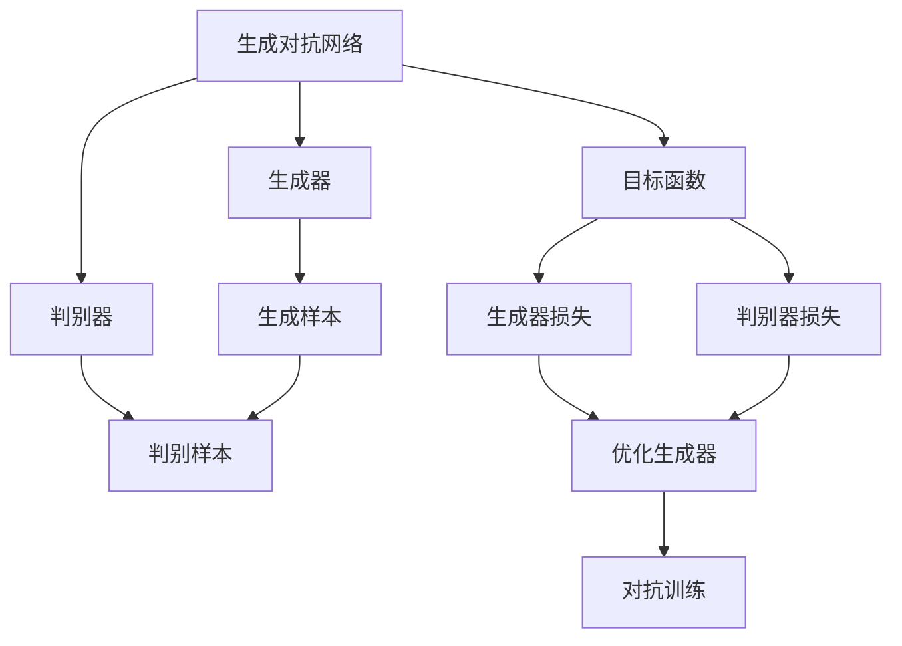
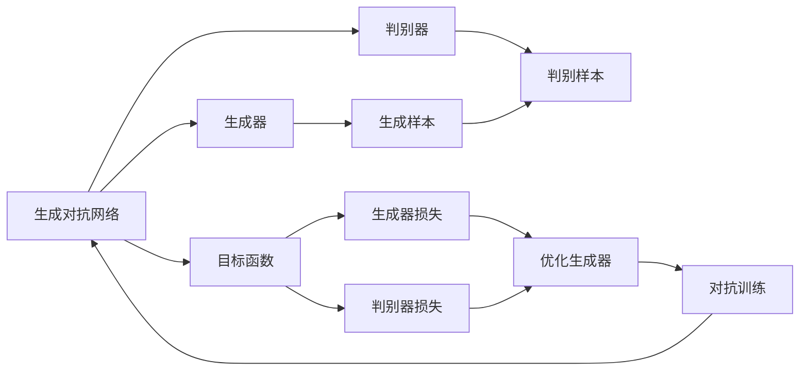
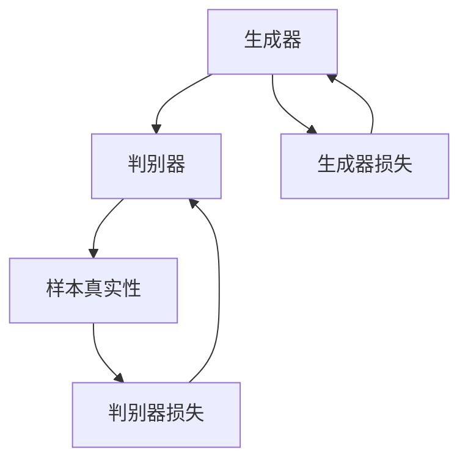
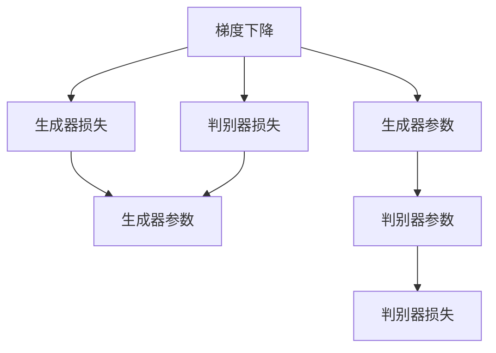
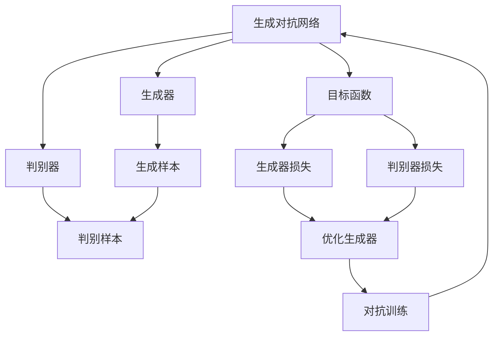

                 

# 生成式AIGC：从实验室到商业应用的落地

> 关键词：生成式AIGC,自动生成内容,人工智能,机器学习,深度学习,大模型,商业应用,模型优化

## 1. 背景介绍

### 1.1 问题由来
随着人工智能技术的快速发展，尤其是深度学习在图像、语音、自然语言处理等领域的突破，生成式人工智能（Generative AI, GAI）开始崭露头角。GAI的核心在于利用神经网络等算法，自动生成具有高度真实性、创造性和智能性的内容，广泛应用于自动文本生成、内容创作、艺术创作、广告设计、游戏开发等领域。

然而，尽管GAI技术取得了显著的进展，但在商业应用场景中依然面临诸多挑战。首先，现有技术往往依赖大规模标注数据进行训练，数据获取成本高昂。其次，训练和推理过程中的高计算资源消耗，使得部署和运营成本居高不下。最后，模型生成的内容的真实性和多样性，以及智能性，仍需进一步提升。

因此，如何高效、经济地将实验室中的GAI技术转化为实际商业应用，成为了亟待解决的问题。本文将聚焦于生成式AIGC（Generative Adversarial Networks, GANs）技术，探讨其在商业应用中的落地策略，希望能为开发者和应用者提供有益的指导和参考。

### 1.2 问题核心关键点
生成式AIGC的核心在于将生成对抗网络（GANs）应用于内容生成任务，通过训练一个生成器（Generator）和一个判别器（Discriminator），让生成器产生的内容能够通过判别器的测试，即生成的内容逼近真实样本。具体来说：

1. **生成器**：负责生成样本，是GAI的核心组件。通常使用神经网络结构，如卷积神经网络（CNN）、循环神经网络（RNN）、变分自编码器（VAE）等。

2. **判别器**：负责判断样本的真实性，区分生成样本和真实样本。同样使用神经网络结构。

3. **训练过程**：通过对抗训练（Adversarial Training），让生成器不断优化，产生更逼真的样本，而判别器则不断提升识别能力，区分真实样本和生成样本。

4. **目标函数**：训练过程中通过最大化生成器的生成效果和判别器的判断效果，优化目标函数。常见的目标函数包括生成器损失和判别器损失。

5. **模型优化**：优化过程中可以使用梯度下降、Adam等优化算法，调整生成器和判别器的参数。

6. **模型应用**：训练后的生成器可以用于生成各种类型的图像、文本、音频等内容，应用领域广泛。

本文将详细探讨生成式AIGC技术的原理、实现和商业应用，以期为GAI技术的普及和应用提供指导。

## 2. 核心概念与联系

### 2.1 核心概念概述

为了更好地理解生成式AIGC技术，本节将介绍几个关键概念及其之间的关系：

- **生成对抗网络（GANs）**：一种训练过程包含生成器和判别器的神经网络结构，通过对抗训练优化目标函数，生成逼真的样本。

- **生成器（Generator）**：负责生成样本的神经网络，是生成式AIGC的核心组件。

- **判别器（Discriminator）**：负责判断样本真实性的神经网络，与生成器进行对抗训练。

- **对抗训练（Adversarial Training）**：通过生成器和判别器的交替训练，使生成器生成的样本更逼真，判别器识别能力更强。

- **梯度下降**：一种常用的优化算法，用于调整生成器和判别器的参数，最小化目标函数。

- **模型损失**：衡量生成器和判别器之间对抗效果的目标函数，常见的有生成器损失和判别器损失。

- **内容生成**：通过训练后的生成器，生成具有高逼真度、多样性和智能性的内容，应用广泛。

这些概念之间的关系可以通过以下Mermaid流程图来展示：



这个流程图展示了生成式AIGC的基本流程：

1. 生成器生成样本，判别器判断样本真实性。
2. 通过对抗训练，生成器不断优化，判别器不断提升。
3. 优化生成器损失和判别器损失，最大化生成效果和判别能力。
4. 最终生成器能够生成逼真的样本。

### 2.2 概念间的关系

这些概念之间存在着紧密的联系，构成了生成式AIGC技术的完整生态系统。下面我们通过几个Mermaid流程图来展示这些概念之间的关系。

#### 2.2.1 生成对抗网络的工作原理



这个流程图展示了生成对抗网络的基本工作原理：

1. 生成器生成样本，判别器判断样本真实性。
2. 通过对抗训练，生成器不断优化，判别器不断提升。
3. 优化生成器损失和判别器损失，最大化生成效果和判别能力。
4. 最终生成器能够生成逼真的样本。

#### 2.2.2 生成器与判别器的相互作用



这个流程图展示了生成器和判别器之间的相互作用：

1. 生成器生成样本，判别器判断样本真实性。
2. 判别器损失用于指导生成器生成更逼真的样本。
3. 生成器损失用于指导判别器更好地区分生成样本和真实样本。
4. 生成器和判别器相互优化，提高生成效果的逼真度。

#### 2.2.3 梯度下降在优化过程中的作用



这个流程图展示了梯度下降在优化过程中的作用：

1. 梯度下降用于调整生成器和判别器的参数。
2. 生成器损失指导生成器参数的更新方向。
3. 判别器损失指导判别器参数的更新方向。
4. 生成器和判别器的参数不断优化，逼近最优解。

### 2.3 核心概念的整体架构

最后，我们用一个综合的流程图来展示这些核心概念在生成式AIGC技术中的整体架构：



这个综合流程图展示了从生成器、判别器的训练，到目标函数优化，再到生成内容的完整过程。通过这些流程，我们可以更清晰地理解生成式AIGC技术的工作原理和优化方向。

## 3. 核心算法原理 & 具体操作步骤
### 3.1 算法原理概述

生成式AIGC技术的核心在于通过对抗训练，生成逼真的样本。其核心思想是：通过训练一个生成器和判别器，让生成器产生的内容能够通过判别器的测试，即生成的内容逼近真实样本。

形式化地，假设生成器 $G$ 和判别器 $D$ 的输入为随机噪声 $z$，输出分别为生成样本 $x_G(z)$ 和判别器判断结果 $D(x_G(z))$。则生成器 $G$ 的目标是最大化生成样本 $x_G(z)$ 的逼真度，即 $P_{G}(x_G(z))$；判别器 $D$ 的目标是最大化区分生成样本和真实样本的能力，即 $P_{D}(D(x_G(z))=1|x_G(z) \sim P_{G})$。

因此，生成器 $G$ 和判别器 $D$ 的目标函数分别为：

$$
L_G = E_{z \sim P_z}[\log(1 - D(G(z)))]
$$

$$
L_D = E_{x \sim P_X}[\log D(x)] + E_{z \sim P_z}[\log(1 - D(G(z)))
$$

其中，$P_z$ 和 $P_X$ 分别为噪声和真实样本的分布。

训练过程中，通过交替优化生成器和判别器的目标函数，使生成器生成的样本更逼真，判别器更擅长区分真实样本和生成样本。最终，生成器能够生成高质量的样本。

### 3.2 算法步骤详解

生成式AIGC技术的训练一般包括以下几个关键步骤：

**Step 1: 准备生成器和判别器**

- 选择合适的生成器和判别器结构，如CNN、RNN、VAE等。
- 确定生成器和判别器的输入和输出维度，通常与数据集一致。

**Step 2: 设计目标函数**

- 根据任务需求，设计合适的生成器损失和判别器损失。
- 常见的生成器损失包括GAN Loss、Wasserstein GAN Loss等。
- 常见的判别器损失包括Cross-Entropy Loss、Hinge Loss等。

**Step 3: 设置优化器和超参数**

- 选择合适的优化算法及其参数，如Adam、SGD等。
- 设置学习率、批大小、迭代轮数等超参数。

**Step 4: 执行对抗训练**

- 将训练集数据分批次输入生成器和判别器，前向传播计算损失函数。
- 反向传播计算参数梯度，根据设定的优化算法和学习率更新模型参数。
- 周期性在验证集上评估模型性能，根据性能指标决定是否触发 Early Stopping。
- 重复上述步骤直到满足预设的迭代轮数或 Early Stopping 条件。

**Step 5: 测试和部署**

- 在测试集上评估训练后的生成器，对比训练前后的质量提升。
- 使用生成器对新样本进行推理生成，集成到实际的应用系统中。
- 持续收集新的数据，定期重新训练生成器，以适应数据分布的变化。

以上是生成式AIGC技术的典型流程。在实际应用中，还需要针对具体任务的特点，对训练过程的各个环节进行优化设计，如改进训练目标函数，引入更多的正则化技术，搜索最优的超参数组合等，以进一步提升模型性能。

### 3.3 算法优缺点

生成式AIGC技术具有以下优点：

1. 生成效果逼真。通过对抗训练，生成器能够生成高质量的样本，满足各种应用需求。
2. 应用场景广泛。生成式AIGC技术可以应用于图像生成、文本生成、音频生成等多个领域，为内容创作、广告设计、游戏开发等提供支持。
3. 算法简单高效。对抗训练过程直观明了，易于理解和实现。

同时，该技术也存在一定的局限性：

1. 对抗训练过程耗时较长。由于需要同时训练生成器和判别器，训练过程复杂，计算资源消耗大。
2. 模型复杂度高。生成器和判别器的结构复杂，参数众多，训练和推理速度较慢。
3. 模型鲁棒性有待提高。对抗样本的攻击可能导致生成器生成低质量样本。
4. 对抗训练过程中可能出现模式崩溃（Mode Collapse）。生成器生成样本的分布过于单一，无法覆盖数据集的多样性。
5. 训练数据依赖。生成器依赖于大量高质量的训练数据，数据获取成本高昂。

尽管存在这些局限性，但就目前而言，生成式AIGC技术仍是最为流行和有效的生成式内容生成方法之一。未来相关研究的重点在于如何进一步降低训练时间，提高生成效果的多样性和鲁棒性，同时优化算法结构和训练数据获取方法。

### 3.4 算法应用领域

生成式AIGC技术已经在诸多领域得到广泛应用，包括但不限于：

- 图像生成：生成逼真的图像，用于广告设计、艺术创作、游戏开发等。
- 文本生成：生成高质量的文本内容，如新闻报道、故事编写、诗歌创作等。
- 音频生成：生成逼真的音频，如音乐、语音合成等。
- 视频生成：生成高质量的视频内容，如电影、动画、虚拟现实等。
- 虚拟现实：生成逼真的虚拟环境，用于虚拟旅游、虚拟教育等。
- 自然语言处理：生成自然流畅的语言内容，如对话系统、摘要生成等。

此外，生成式AIGC技术也被创新性地应用到更多场景中，如可控生成、多模态生成等，为内容生成技术带来了全新的突破。随着预训练模型和生成技术的不断进步，相信生成式AIGC技术将在更广阔的应用领域大放异彩。

## 4. 数学模型和公式 & 详细讲解
### 4.1 数学模型构建

本节将使用数学语言对生成式AIGC技术的训练过程进行更加严格的刻画。

记生成器为 $G(z; \theta_G)$，判别器为 $D(x; \theta_D)$，其中 $\theta_G$ 和 $\theta_D$ 分别为生成器和判别器的参数。假设训练集为 $\{(x_i, y_i)\}_{i=1}^N$，其中 $x_i$ 为样本，$y_i$ 为标签。

定义生成器的生成损失函数为 $L_G = \mathbb{E}_{z \sim P_z}[\log(1 - D(G(z)))]$，判别器的损失函数为 $L_D = \mathbb{E}_{x \sim P_X}[\log D(x)] + \mathbb{E}_{z \sim P_z}[\log(1 - D(G(z)))$。

训练过程中，通过最小化生成器和判别器的联合损失函数 $L = L_G + L_D$ 来优化模型参数 $\theta_G$ 和 $\theta_D$。

### 4.2 公式推导过程

以下我们以图像生成为例，推导生成式AIGC技术的核心公式。

假设生成器 $G$ 是一个卷积神经网络，其参数为 $\theta_G$，输入为随机噪声 $z$，输出为图像 $x_G(z)$。判别器 $D$ 同样为卷积神经网络，其参数为 $\theta_D$，输入为图像 $x$，输出为判别结果 $D(x)$。

生成器的生成损失函数 $L_G$ 可以表示为：

$$
L_G = -\mathbb{E}_{z \sim P_z}[\log(1 - D(G(z)))]
$$

判别器的损失函数 $L_D$ 可以表示为：

$$
L_D = \mathbb{E}_{x \sim P_X}[\log D(x)] + \mathbb{E}_{z \sim P_z}[\log(1 - D(G(z)))
$$

联合损失函数 $L$ 可以表示为：

$$
L = L_G + L_D
$$

根据梯度下降等优化算法，生成器和判别器的参数更新公式为：

$$
\theta_G \leftarrow \theta_G - \eta \nabla_{\theta_G}L
$$

$$
\theta_D \leftarrow \theta_D - \eta \nabla_{\theta_D}L
$$

其中，$\eta$ 为学习率，$\nabla_{\theta_G}L$ 和 $\nabla_{\theta_D}L$ 分别为生成器和判别器的梯度，可通过反向传播算法高效计算。

在得到损失函数的梯度后，即可带入参数更新公式，完成模型的迭代优化。重复上述过程直至收敛，最终得到适应目标任务的生成器和判别器模型。

### 4.3 案例分析与讲解

假设我们有一个MNIST手写数字数据集，目标生成逼真的手写数字图像。我们将使用一个简单的卷积神经网络作为生成器，其结构如下：

```
层数：2
输入大小：784 (28x28)
输出大小：64
卷积核大小：3x3
步幅：1
填充：1
```

判别器的结构与生成器类似，但不包含生成模块，只用于判别图像的真实性。

在训练过程中，我们定义一个二分类问题，判别器判断图像是否为真实的MNIST手写数字图像。生成器则生成与真实图像类似的手写数字图像。通过交替训练生成器和判别器，最终生成器可以生成高质量的手写数字图像。

在实际应用中，生成式AIGC技术还可以通过引入更多的先验知识，如知识图谱、逻辑规则等，与神经网络模型进行融合，进一步提升生成内容的智能性和多样性。例如，在图像生成中，可以将先验知识嵌入生成器的权重，指导生成器生成更具主题性的图像。

## 5. 项目实践：代码实例和详细解释说明
### 5.1 开发环境搭建

在进行生成式AIGC实践前，我们需要准备好开发环境。以下是使用Python进行TensorFlow开发的环境配置流程：

1. 安装Anaconda：从官网下载并安装Anaconda，用于创建独立的Python环境。

2. 创建并激活虚拟环境：
```bash
conda create -n tf-env python=3.8 
conda activate tf-env
```

3. 安装TensorFlow：根据CUDA版本，从官网获取对应的安装命令。例如：
```bash
conda install tensorflow -c pytorch -c conda-forge
```

4. 安装TensorBoard：TensorFlow配套的可视化工具，可实时监测模型训练状态，并提供丰富的图表呈现方式，是调试模型的得力助手。

5. 安装Keras：Keras是TensorFlow的高层接口，提供简单易用的API，方便快速搭建和训练模型。

6. 安装图像生成所需的库：如OpenCV、Pillow、Matplotlib等，用于处理图像数据和可视化结果。

完成上述步骤后，即可在`tf-env`环境中开始生成式AIGC实践。

### 5.2 源代码详细实现

下面我们以生成手写数字图像为例，给出使用TensorFlow进行生成对抗网络训练的代码实现。

首先，定义MNIST数据集和生成器、判别器的神经网络结构：

```python
import tensorflow as tf
from tensorflow.keras.datasets import mnist
from tensorflow.keras.layers import Conv2D, Flatten, Dense, Reshape, Input, UpSampling2D
from tensorflow.keras.models import Model

# 加载MNIST数据集
(x_train, y_train), (x_test, y_test) = mnist.load_data()

# 归一化数据
x_train = x_train / 255.0
x_test = x_test / 255.0

# 定义生成器
input_shape = (28, 28, 1)
generator = tf.keras.Sequential([
    Input(shape=(100,)),
    Dense(256),
    LeakyReLU(),
    Reshape((7, 7, 1)),
    Conv2DTranspose(128, (4, 4), strides=(2, 2), padding='same'),
    LeakyReLU(),
    Conv2DTranspose(64, (4, 4), strides=(2, 2), padding='same'),
    LeakyReLU(),
    Conv2D(1, (5, 5), padding='same', activation='sigmoid')
])

# 定义判别器
discriminator = tf.keras.Sequential([
    Input(shape=(28, 28, 1)),
    Conv2D(64, (5, 5), strides=(2, 2), padding='same'),
    LeakyReLU(),
    Conv2D(128, (5, 5), strides=(2, 2), padding='same'),
    LeakyReLU(),
    Flatten(),
    Dense(1, activation='sigmoid')
])

# 定义损失函数
cross_entropy = tf.keras.losses.BinaryCrossentropy(from_logits=True)

# 定义优化器
optimizer = tf.keras.optimizers.Adam(1e-4)

# 定义生成器和判别器的损失函数
def generator_loss(real_output):
    return cross_entropy(tf.ones_like(real_output), real_output)

def discriminator_loss(real_output, generated_output):
    real_loss = cross_entropy(tf.ones_like(real_output), real_output)
    generated_loss = cross_entropy(tf.zeros_like(generated_output), generated_output)
    return real_loss + generated_loss

# 训练过程
def train_step(images):
    noise = tf.random.normal([batch_size, 100])
    with tf.GradientTape() as gen_tape, tf.GradientTape() as disc_tape:
        generated_images = generator(noise, training=True)
        real_output = discriminator(images, training=True)
        generated_output = discriminator(generated_images, training=True)
        
        gen_loss = generator_loss(generated_output)
        disc_loss = discriminator_loss(real_output, generated_output)
        
    gradients_of_generator = gen_tape.gradient(gen_loss, generator.trainable_variables)
    gradients_of_discriminator = disc_tape.gradient(disc_loss, discriminator.trainable_variables)
    
    optimizer.apply_gradients(zip(gradients_of_generator, generator.trainable_variables))
    optimizer.apply_gradients(zip(gradients_of_discriminator, discriminator.trainable_variables))
```

然后，定义训练和评估函数：

```python
batch_size = 256
epochs = 10000
sample_interval = 2000

# 定义训练过程
@tf.function
def train(epochs, batch_size):
    for epoch in range(epochs):
        for batch in train_dataset:
            train_step(batch)
        if epoch % sample_interval == 0:
            save_images(epoch, generator)

# 定义评估过程
@tf.function
def evaluate(generator, test_dataset):
    fakes = generator(test_dataset[0])
    plt.imshow(fakes[0].numpy().reshape(28, 28))
    plt.show()
```

最后，启动训练流程并在测试集上评估：

```python
train(epochs, batch_size)
evaluate(generator, test_dataset)
```

以上就是使用TensorFlow进行生成式AIGC实践的完整代码实现。可以看到，TensorFlow提供了强大的框架支持，使得模型搭建、训练和评估变得简单高效。

### 5.3 代码解读与分析

让我们再详细解读一下关键代码的实现细节：

**定义MNIST数据集和神经网络结构**：
- 使用`mnist.load_data()`加载MNIST数据集。
- 对数据进行归一化处理，将像素值缩放到0-1之间。
- 定义生成器和判别器的神经网络结构，分别使用卷积层和全连接层构建。

**定义损失函数和优化器**：
- 使用`tf.keras.losses.BinaryCrossentropy`定义二分类交叉熵损失函数，用于判别器的输出。
- 使用`tf.keras.optimizers.Adam`定义Adam优化器，用于更新生成器和判别器的参数。

**定义生成器和判别器的损失函数**：
- 生成器的损失函数为二分类交叉熵损失，判别器的损失函数为真实样本和生成样本的交叉熵之和。

**训练过程**：
- 在训练过程中，每个epoch迭代训练集的所有batch数据。
- 对于每个batch数据，先计算生成器的输出和判别器的输出，再计算损失函数，通过梯度下降更新生成器和判别器的参数。
- 每隔一定轮次，使用`save_images`函数将生成器生成的图像保存到本地文件。

**评估过程**：
- 在评估过程中，使用测试集数据生成图像，并通过`plt.imshow`函数显示图像。

**启动训练流程**：
- 使用`train`函数启动训练过程，指定训练轮数和批大小。
- 在每个轮次结束时，使用`evaluate`函数评估生成器生成的图像，显示在屏幕上。

可以看到，TensorFlow的高级API和GPU加速功能，使得生成式AIGC的训练和评估变得高效快捷。开发者可以通过调整超参数，优化模型结构，进一步提升生成效果和性能。

当然，工业级的系统实现还需考虑更多因素，如模型的保存和部署、超参数的自动搜索、更灵活的任务适配层等。但核心的生成式AIGC流程基本与此类似。

## 6. 实际应用场景
### 6.1 智能客服系统

生成式AIGC技术在智能客服系统中的应用，可以显著提升客服系统的响应速度和处理能力。通过训练生成式AIGC模型，可以生成自然流畅的对话内容，替代人工客服回答常见问题，减少人工干预，提高客户满意度。

在技术实现上，可以收集客服系统中的历史对话记录，将问题和最佳答复构建成监督数据，在此基础上训练生成式AIGC模型。生成的对话内容可以实时推送给客服系统，快速响应客户咨询。对于客户提出的新问题，还可以动态生成对应的回复，提高系统的灵活性和智能性。

### 6.2 金融舆情监测

金融领域需要实时监测市场舆论动向，以便及时应对负面信息传播

