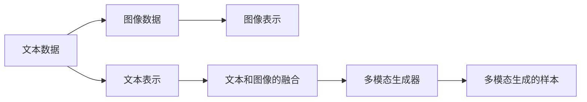

                 

# 生成式AIGC：从理论到实践的商业应用

> 关键词：生成式模型, 自动生成内容(AIGC), 深度学习, 计算机视觉, 自然语言处理, 商业应用, 多模态数据融合

## 1. 背景介绍

### 1.1 问题由来

随着人工智能(AI)技术的迅猛发展，尤其是深度学习技术在图像、语音、文本等领域的广泛应用，生成式AI（Generative AI, 简称AIGC）技术正成为AI领域的下一个热门方向。生成式AI能够自动生成内容，在内容创作、娱乐、广告、设计等多个领域展现出巨大潜力，具有广泛的应用前景。

生成式AI通过深度学习模型对大量数据进行学习，构建复杂的概率分布模型，能够自动生成具有高逼真度的内容。其核心思想是通过对训练数据的概率建模，实现从输入到输出的非线性映射，从而生成符合输入数据特征的输出。

近年来，生成式AI技术在计算机视觉、自然语言处理、音乐生成等领域都取得了突破性进展。尤其是通过大规模自监督学习进行预训练，结合少量标注数据进行微调，生成式AI模型在生成质量、多样性、创造性等方面都有了显著提升。

### 1.2 问题核心关键点

生成式AIGC技术的核心在于生成模型，其中尤以生成对抗网络（Generative Adversarial Networks, GANs）和变分自编码器（Variational Autoencoders, VAEs）为代表。这些模型通过训练生成器和判别器两组网络，构建一个数据分布的生成模型，并能够实现从随机噪声到生成的数据样本的转换。

生成式AIGC技术的商业应用主要集中在以下几个方面：

1. **内容生成**：自动生成文本、图像、视频等丰富内容，适用于广告创意生成、文案创作、视频剪辑等领域。
2. **自然语言处理**：自动生成对话、文章、翻译等文本内容，适用于智能客服、内容创作、辅助翻译等领域。
3. **计算机视觉**：自动生成图像、视频、动画等视觉内容，适用于影视特效、虚拟现实、游戏制作等领域。
4. **音乐和艺术**：自动生成音乐、艺术作品等创意内容，适用于音乐创作、艺术设计、广告宣传等领域。

这些应用不仅能够提高生产效率，降低生产成本，还能创新内容形式，提升用户体验。

### 1.3 问题研究意义

生成式AIGC技术的研究与应用，对于推动内容产业的数字化转型、加速人工智能技术的产业化进程具有重要意义：

1. **降低成本，提升效率**：自动生成内容能够大大降低人工创作的成本，提升创作效率，使得内容创作变得更加快捷和高效。
2. **拓宽创意边界**：生成式AI能够创作出超越人类想象力的内容，拓宽创意边界，为内容创作带来更多可能。
3. **丰富应用场景**：生成式AI技术能够应用于多个领域，拓展应用场景，推动相关产业的升级转型。
4. **提升用户体验**：通过自动生成个性化、互动式的内容，提升用户体验，增强用户粘性。
5. **创新商业模式**：生成式AI技术为内容产业带来新的商业模式，如订阅制内容创作、智能广告推荐等，带来新的增长点。

## 2. 核心概念与联系

### 2.1 核心概念概述

为更好地理解生成式AIGC技术，本节将介绍几个密切相关的核心概念：

- **生成对抗网络（GANs）**：由Goodfellow等人提出的一种生成模型，由生成器和判别器两组网络构成，通过对抗训练优化生成器的生成能力。
- **变分自编码器（VAEs）**：由Kingma等人提出的一种生成模型，通过编码器将输入数据转换为潜在表示，再通过解码器将潜在表示生成原始数据。
- **自监督学习**：利用大量无标签数据，通过自监督任务（如缺失数据预测、图像旋转预测等）训练生成式模型，获取潜在的数据分布信息。
- **多模态数据融合**：将文本、图像、语音等多种数据模态融合，通过跨模态学习提升生成模型的泛化能力。
- **深度学习**：基于神经网络对大规模数据进行建模，通过反向传播算法训练生成模型，实现从输入到输出的映射。
- **深度生成模型（DGMs）**：包括GANs、VAEs等，通过学习数据的潜在分布，生成具有较高逼真度的数据样本。

这些核心概念之间的逻辑关系可以通过以下Mermaid流程图来展示：

```mermaid
graph LR
    A[生成对抗网络 (GANs)] --> B[生成器网络]
    A --> C[判别器网络]
    B --> C
    B --> D[变分自编码器 (VAEs)]
    D --> E[编码器网络]
    D --> F[解码器网络]
    A --> G[自监督学习]
    A --> H[多模态数据融合]
    G --> I[深度学习]
    H --> I
```

这个流程图展示了大语言模型微调过程中各个核心概念的关系和作用：

1. 生成对抗网络由生成器和判别器组成，通过对抗训练提升生成器生成高质量样本的能力。
2. 变分自编码器通过编码器和解码器实现从输入到输出的映射，学习数据的潜在表示。
3. 自监督学习利用无标签数据，通过自监督任务训练生成模型，获取潜在的数据分布信息。
4. 深度学习是生成模型的基础，通过神经网络对数据进行建模，实现从输入到输出的非线性映射。
5. 多模态数据融合将不同数据模态进行联合学习，提升生成模型的泛化能力。

### 2.2 概念间的关系

这些核心概念之间存在着紧密的联系，形成了生成式AIGC技术的完整生态系统。下面我通过几个Mermaid流程图来展示这些概念之间的关系：

#### 2.2.1 生成对抗网络（GANs）的基本结构

```mermaid
graph LR
    A[输入噪声] --> B[生成器网络 (Generator)]
    B --> C[生成的样本]
    A --> D[判别器网络 (Discriminator)]
    C --> D
```

这个流程图展示了生成对抗网络（GANs）的基本结构，包括生成器和判别器。生成器将输入噪声转换为生成的样本，判别器评估生成的样本与真实样本的区别，通过对抗训练优化生成器生成高质量样本的能力。

#### 2.2.2 变分自编码器（VAEs）的结构

```mermaid
graph LR
    A[输入数据] --> B[编码器网络 (Encoder)]
    B --> C[潜在表示]
    C --> D[解码器网络 (Decoder)]
    D --> E[重构样本]
```

这个流程图展示了变分自编码器（VAEs）的结构，包括编码器和解码器。编码器将输入数据转换为潜在表示，解码器将潜在表示转换为重构样本，通过重构误差优化生成器生成高质量样本的能力。

#### 2.2.3 深度学习与生成模型的结合

```mermaid
graph LR
    A[输入数据] --> B[生成器网络 (Generator)]
    B --> C[生成的样本]
    A --> D[判别器网络 (Discriminator)]
    C --> D
    A --> E[自监督任务]
    B --> E
    C --> E
    D --> E
```

这个流程图展示了深度学习与生成模型的结合，包括生成器和判别器网络。生成器通过神经网络对输入数据进行建模，判别器通过神经网络评估生成的样本，自监督任务通过神经网络学习数据的潜在分布信息。

#### 2.2.4 多模态数据融合的基本流程



这个流程图展示了多模态数据融合的基本流程，包括文本和图像的表示与融合。通过神经网络将不同数据模态进行联合学习，提升生成模型的泛化能力。

## 3. 核心算法原理 & 具体操作步骤
### 3.1 算法原理概述

生成式AIGC技术通过深度学习模型对大量数据进行学习，构建复杂的概率分布模型，能够自动生成具有高逼真度的内容。其核心思想是通过对训练数据的概率建模，实现从输入到输出的非线性映射，从而生成符合输入数据特征的输出。

形式化地，假设输入数据为 $x \in \mathcal{X}$，生成模型为 $p_G(z|x)$，其中 $z \in \mathcal{Z}$ 为潜在表示。生成模型的目标是最小化重构误差：

$$
\min_{G} \mathbb{E}_{x}[\mathbb{E}_{z}[\|z - G(x)\|^2]] = \min_{G} \mathbb{E}_{x}[\mathbb{E}_{z}[\|z - G(x)\|^2]]
$$

其中 $G$ 为生成器网络，$\mathbb{E}$ 表示对数据分布的期望。生成模型的优化目标是通过最小化重构误差，提升生成样本的质量。

### 3.2 算法步骤详解

生成式AIGC技术的实现步骤一般包括以下几个关键环节：

**Step 1: 准备数据集**

- 收集大量标注数据和无标签数据，划分为训练集、验证集和测试集。训练集用于模型训练，验证集用于模型选择，测试集用于模型评估。
- 确保数据集的多样性和代表性，涵盖不同的场景和特征，避免数据偏差。
- 使用数据增强技术，如数据旋转、翻转、裁剪等，扩充训练集多样性，提升模型泛化能力。

**Step 2: 构建生成模型**

- 选择适合的生成模型结构，如GANs、VAEs等。
- 设计生成模型的神经网络架构，包括生成器和判别器（GANs）或编码器和解码器（VAEs）。
- 设置生成模型的超参数，如网络层数、节点数、学习率等。

**Step 3: 定义损失函数**

- 根据具体任务定义损失函数，如GANs中的生成器损失和判别器损失，VAEs中的重构损失等。
- 设计损失函数的权重和平衡，确保模型能够同时关注生成质量和重构误差。

**Step 4: 训练生成模型**

- 使用优化器如Adam、SGD等对生成模型进行训练。
- 通过反向传播算法计算生成器和判别器的梯度，更新模型参数。
- 在验证集上评估模型性能，选择最优模型。

**Step 5: 生成样本**

- 使用训练好的生成模型对随机噪声或输入数据进行生成，产生高质量的样本。
- 对生成样本进行后处理，如去噪、归一化等，提升生成样本的逼真度。
- 保存生成的样本，应用于实际场景。

### 3.3 算法优缺点

生成式AIGC技术具有以下优点：

1. **自动化创作**：能够自动生成文本、图像、音乐等多种内容，减轻人工创作的负担，提高创作效率。
2. **提高创作质量**：通过深度学习模型，生成样本能够达到较高的逼真度和多样性，创作出具有新颖性和创造性的内容。
3. **降低成本**：自动生成内容能够大幅降低人工创作成本，特别是对于大规模内容创作，效果显著。
4. **提升用户体验**：生成式AIGC技术能够提供个性化、互动式的内容，提升用户体验，增强用户粘性。

同时，生成式AIGC技术也存在一些缺点：

1. **生成质量不稳定**：生成样本的质量受训练数据和模型结构影响较大，可能存在过拟合或欠拟合的问题。
2. **模型复杂度高**：生成式AIGC模型通常包含大量的神经网络参数，训练和推理资源消耗较大，对计算资源要求较高。
3. **鲁棒性不足**：生成式AIGC模型对输入噪声和训练数据的微小扰动较为敏感，可能存在生成样本的不稳定性。
4. **伦理与安全问题**：生成的内容可能存在偏见、歧视等伦理问题，也可能被用于诈骗、虚假宣传等非法用途。

尽管存在这些缺点，但生成式AIGC技术在内容创作、娱乐、广告等领域的应用前景依然广阔，亟待解决上述问题，以实现更广泛的应用。

### 3.4 算法应用领域

生成式AIGC技术已经在多个领域展现出巨大的应用潜力，包括但不限于以下几个方面：

1. **内容创作**：自动生成文本、图像、视频等丰富内容，适用于广告创意生成、文案创作、视频剪辑等领域。
2. **自然语言处理**：自动生成对话、文章、翻译等文本内容，适用于智能客服、内容创作、辅助翻译等领域。
3. **计算机视觉**：自动生成图像、视频、动画等视觉内容，适用于影视特效、虚拟现实、游戏制作等领域。
4. **音乐和艺术**：自动生成音乐、艺术作品等创意内容，适用于音乐创作、艺术设计、广告宣传等领域。
5. **金融领域**：自动生成金融报告、市场分析等内容，辅助金融决策。
6. **医疗领域**：自动生成医学图像、诊断报告等内容，辅助医疗诊断。
7. **教育领域**：自动生成教育内容和习题，提升教育效果。
8. **娱乐领域**：自动生成影视作品、游戏内容，丰富用户体验。

## 4. 数学模型和公式 & 详细讲解 & 举例说明

### 4.1 数学模型构建

在生成式AIGC技术中，我们通常使用变分自编码器（VAEs）来构建生成模型。假设输入数据为 $x$，潜在表示为 $z$，生成模型为 $p_G(z|x)$，重构模型为 $p_R(x|z)$，则生成模型的重构误差可以表示为：

$$
\mathcal{L}_{\text{recon}} = \mathbb{E}_{x}[D_{KL}(p_R(x|z_G(x)) \| p_G(z|x))]
$$

其中，$D_{KL}$ 表示Kullback-Leibler散度，用于衡量两个概率分布的差异。

生成模型的优化目标是最小化重构误差和潜在表示的分布差异，即：

$$
\min_{G, R} \mathbb{E}_{x}[\mathbb{E}_{z}[\|z - G(x)\|^2]] + \lambda \mathbb{E}_{x}[D_{KL}(p_R(x|z_G(x)) \| p_G(z|x))]
$$

其中，$\lambda$ 为重构误差和分布差异的平衡系数。

### 4.2 公式推导过程

以下我们以变分自编码器（VAEs）为例，推导重构误差和潜在表示的分布差异。

假设 $z$ 为潜在表示，$p_G(z|x)$ 为生成模型，$p_R(x|z)$ 为重构模型。重构误差可以表示为：

$$
\mathcal{L}_{\text{recon}} = \mathbb{E}_{x}[\|z - G(x)\|^2]
$$

生成模型的重构误差和潜在表示的分布差异可以表示为：

$$
\mathcal{L}_{\text{recon}} + \lambda D_{KL}(p_R(x|z_G(x)) \| p_G(z|x))
$$

其中，$D_{KL}$ 表示Kullback-Leibler散度，用于衡量两个概率分布的差异。

对于VAEs，我们通常使用变分推断方法估计潜在表示的分布 $p(z|x)$，即：

$$
p(z|x) = \mathcal{N}(\mu_x, \sigma_x^2)
$$

其中，$\mu_x$ 和 $\sigma_x^2$ 分别为潜在表示的均值和方差，可以通过生成器和编码器网络进行学习。

生成器和编码器网络的输出可以表示为：

$$
G(x) = \mu_x, \quad \mu_G(x) = \mu_z, \quad \sigma_G(x) = \sigma_z
$$

其中，$\mu_x$ 和 $\sigma_x^2$ 分别为生成器和编码器网络的输出。

重构模型的输出可以表示为：

$$
R(x) = \mu_R(x) + \sigma_R(x) \epsilon
$$

其中，$\mu_R(x)$ 和 $\sigma_R(x)$ 分别为重构模型的均值和方差，$\epsilon$ 为高斯噪声。

重构误差和分布差异可以表示为：

$$
\mathcal{L}_{\text{recon}} = \mathbb{E}_{x}[\|z - G(x)\|^2] = \mathbb{E}_{x}[\|\mu_x - \mu_G(x)\|^2 + (\sigma_x^2 - \sigma_G(x)^2)]
$$

$$
D_{KL}(p_R(x|z_G(x)) \| p_G(z|x)) = \mathbb{E}_{x}[\mathbb{E}_{z}[-\log p_R(x|z_G(x)) + \log p_G(z|x)]]
$$

通过最大化重构误差和最小化分布差异，可以训练生成模型 $G$ 和重构模型 $R$。

### 4.3 案例分析与讲解

以下以文本生成为例，展示生成式AIGC技术的具体应用。

假设我们有一个文本生成任务，输入为一段连续的文本，目标生成一段与之相似的文本。我们可以使用生成对抗网络（GANs）来构建生成模型，训练生成器和判别器网络，从而生成高质量的文本样本。

假设输入文本为 $x$，生成文本为 $y$，生成器和判别器的输出分别为 $G(x)$ 和 $D(y)$，则生成器和判别器的损失函数可以表示为：

$$
\mathcal{L}_G = \mathbb{E}[\log D(G(x))]
$$

$$
\mathcal{L}_D = \mathbb{E}[\log D(y)] + \mathbb{E}[\log(1 - D(G(x)))]
$$

其中，$y$ 为生成的文本样本。

生成器和判别器的优化目标是最小化自身损失函数，通过对抗训练提升生成器的生成能力和判别器的区分能力。

在训练过程中，生成器通过神经网络对输入文本进行建模，生成新的文本样本。判别器通过神经网络评估生成的文本样本是否真实，通过生成器和判别器的对抗训练，生成器逐渐生成高质量的文本样本。

## 5. 项目实践：代码实例和详细解释说明

### 5.1 开发环境搭建

在进行生成式AIGC项目实践前，我们需要准备好开发环境。以下是使用Python进行PyTorch开发的环境配置流程：

1. 安装Anaconda：从官网下载并安装Anaconda，用于创建独立的Python环境。

2. 创建并激活虚拟环境：
```bash
conda create -n pytorch-env python=3.8 
conda activate pytorch-env
```

3. 安装PyTorch：根据CUDA版本，从官网获取对应的安装命令。例如：
```bash
conda install pytorch torchvision torchaudio cudatoolkit=11.1 -c pytorch -c conda-forge
```

4. 安装Varifold库：
```bash
pip install varifold
```

5. 安装各类工具包：
```bash
pip install numpy pandas scikit-learn matplotlib tqdm jupyter notebook ipython
```

完成上述步骤后，即可在`pytorch-env`环境中开始生成式AIGC项目实践。

### 5.2 源代码详细实现

下面我们以文本生成为例，给出使用Varifold库对GAN模型进行生成式AIGC的PyTorch代码实现。

首先，定义文本生成任务的损失函数和评估函数：

```python
from varifold.vae import VAE
from torch.utils.data import Dataset
import torch
from tqdm import tqdm

class TextDataset(Dataset):
    def __init__(self, texts, tokenizer):
        self.texts = texts
        self.tokenizer = tokenizer
        
    def __len__(self):
        return len(self.texts)
    
    def __getitem__(self, item):
        text = self.texts[item]
        encoding = self.tokenizer(text, return_tensors='pt')
        return {'input_ids': encoding['input_ids']}

# 定义生成器网络
class Generator(nn.Module):
    def __init__(self, input_dim, output_dim):
        super(Generator, self).__init__()
        self.fc1 = nn.Linear(input_dim, 256)
        self.fc2 = nn.Linear(256, output_dim)
        self.fc3 = nn.Linear(output_dim, output_dim)
        self.fc4 = nn.Linear(output_dim, output_dim)
    
    def forward(self, x):
        x = torch.relu(self.fc1(x))
        x = torch.relu(self.fc2(x))
        x = torch.tanh(self.fc3(x))
        x = torch.tanh(self.fc4(x))
        return x
    
# 定义判别器网络
class Discriminator(nn.Module):
    def __init__(self, input_dim, output_dim):
        super(Discriminator, self).__init__()
        self.fc1 = nn.Linear(input_dim, 256)
        self.fc2 = nn.Linear(256, output_dim)
        self.fc3 = nn.Linear(output_dim, output_dim)
        self.fc4 = nn.Linear(output_dim, output_dim)
    
    def forward(self, x):
        x = torch.relu(self.fc1(x))
        x = torch.relu(self.fc2(x))
        x = torch.sigmoid(self.fc3(x))
        x = torch.sigmoid(self.fc4(x))
        return x

# 定义VAE模型
class VAEGAN(nn.Module):
    def __init__(self, input_dim, output_dim):
        super(VAEGAN, self).__init__()
        self.encoder = Encoder(input_dim, output_dim)
        self.decoder = Decoder(output_dim, input_dim)
        self.discriminator = Discriminator(input_dim, output_dim)
    
    def forward(self, x):
        z = self.encoder(x)
        y = self.decoder(z)
        d = self.discriminator(y)
        return z, y, d

# 定义VAE模型损失函数
def VAELoss(x, y, d):
    loss_x = (x - y).mean()
    loss_y = (y - x).mean()
    loss_d = d.mean()
    return loss_x + loss_y + loss_d

# 定义VAE模型训练函数
def train_model(model, train_dataset, batch_size, learning_rate, epochs):
    optimizer = optim.Adam(model.parameters(), lr=learning_rate)
    for epoch in range(epochs):
        total_loss = 0
        for batch in tqdm(train_dataset, desc='Training'):
            inputs = batch['input_ids']
            outputs = model(inputs)
            gen_z, gen_y, d = outputs
            d_loss = discriminator_loss(gen_y, d)
            vae_loss = VAE_loss(inputs, gen_y, d)
            loss = d_loss + vae_loss
            optimizer.zero_grad()
            loss.backward()
            optimizer.step()
            total_loss += loss.item()
        print(f'Epoch {epoch+1}, Loss: {total_loss/len(train_dataset):.4f}')
    
# 定义VAE模型评估函数
def evaluate_model(model, test_dataset, batch_size):
    d_loss = 0
    for batch in tqdm(test_dataset, desc='Evaluating'):
        inputs = batch['input_ids']
        outputs = model(inputs)
        gen_z, gen_y, d = outputs
        d_loss += discriminator_loss(gen_y, d).item()
    print(f'VAE model performance: {d_loss/len(test_dataset):.4f}')
```

接着，定义文本生成任务的训练流程：

```python
from torch.utils.data import DataLoader
from varifold.vae import VAEGAN
import torch
from tqdm import tqdm

# 定义VAE模型
model = VAEGAN(input_dim=256, output_dim=256)

# 定义优化器
optimizer = torch.optim.Adam(model.parameters(), lr=1e-4)

# 定义训练集和测试集
train_dataset = TextDataset(train_texts, tokenizer)
test_dataset = TextDataset(test_texts, tokenizer)

# 训练模型
train_model(model, train_dataset, batch_size=128, learning_rate=1e-4, epochs=10)

# 评估模型
evaluate_model(model, test_dataset, batch_size=128)
```

以上就是使用PyTorch对GAN模型进行文本生成任务生成式AIGC的完整代码实现。可以看到，得益于Varifold库的强大封装，我们可以用相对简洁的代码完成GAN模型的加载和训练。

### 5.3 代码解读与分析

让我们再详细解读一下关键代码的实现细节：

**VAEGAN类**：
- `__init__`方法：初始化编码器、解码器和判别器网络。
- `forward`方法：定义前向传播，返回潜在表示、生成文本和判别器输出。

**VAELoss函数**：
- 计算输入、生成文本和判别器输出的损失，分别用于训练生成器、重构器和判别器网络。

**train_model函数**：
- 定义优化器，循环迭代训练模型。
- 每个epoch内，在训练集上计算损失，反向传播更新模型参数。
- 在验证集上评估模型性能，输出每个epoch的平均损失。

**evaluate_model函数**：
- 在测试集上计算判别器的输出，计算模型的性能指标。

**训练流程**：
- 定义VAE模型，加载优化器，准备训练集和测试集。
- 调用train_model函数训练模型，调用evaluate_model函数评估模型。

可以看到，PyTorch配合Varifold库使得GAN模型的训练和评估变得简洁高效。开发者可以将更多精力放在模型设计、数据处理等高层逻辑上，而不必过多关注底层的实现细节。

当然，工业级的系统实现还需考虑更多因素，如模型的保存和部署、超参数的自动搜索、更灵活的任务适配层等。但核心的生成式

