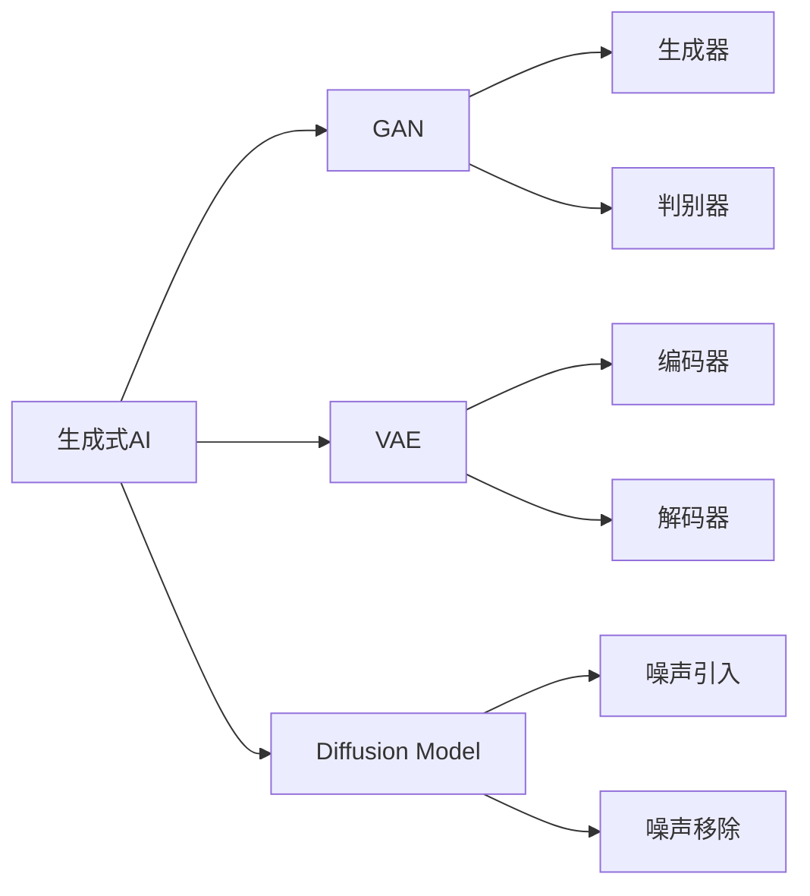
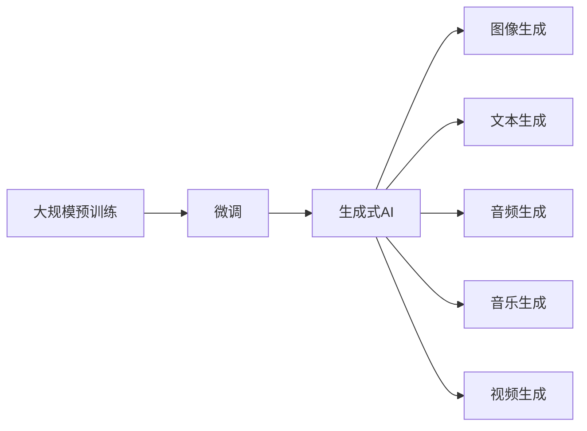

                 

# 生成式AI在中国的商业化前景

## 1. 背景介绍

近年来，随着人工智能技术的飞速发展，生成式人工智能（Generative AI）在多个领域展现出巨大的潜力，逐渐成为推动社会进步和经济发展的关键力量。中国作为全球科技创新与经济发展的重心之一，自然关注并积极布局这一前沿领域。本文将深入探讨生成式AI在中国的商业化前景，分析其在技术突破、应用落地、市场潜力等方面的机会与挑战。

### 1.1 技术发展概况

生成式AI技术主要指的是通过深度学习和神经网络等方法，生成高质量的图像、文本、音频等内容的技术。生成式AI的发展历史悠久，从早期的隐马尔可夫模型（HMM），到深度信念网络（DBN），再到现今基于深度学习的生成对抗网络（GAN）和变分自编码器（VAE），逐步走向成熟。

### 1.2 应用领域广泛

生成式AI技术已经广泛应用于多个行业，如艺术创作、影视娱乐、虚拟现实、游戏开发、医疗诊断、智能客服、市场营销等领域。它不仅能够自动化生成各种创意内容，还能够辅助进行数据分析、医疗诊断、智能推荐等任务。

## 2. 核心概念与联系

### 2.1 核心概念概述

为了更深入地理解生成式AI，我们先介绍几个核心概念：

- **生成式AI**：通过深度学习模型生成新数据的技术。它可以从现有数据中学习并生成具有一定规律的全新数据。
- **生成对抗网络（GAN）**：一种生成模型，通过生成器和判别器的对抗训练生成高质量的数据。
- **变分自编码器（VAE）**：一种生成模型，通过学习数据的概率分布，生成新的样本。
- **扩散模型（Diffusion Model）**：一种生成模型，通过逐步引入噪声来生成数据，如DPM、DDPM等。
- **语言模型（Language Model）**：通过学习语言数据生成文本的模型，如GPT、BERT等。

### 2.2 核心概念间的关系

这些概念之间存在紧密的联系，通过以下Mermaid流程图展示其关系：



这个流程图展示了生成式AI中的几种主要模型架构及其核心组件，表明这些模型通过不同的方式学习数据分布，并生成新的数据。

### 2.3 核心概念的整体架构

我们还可以从更大的视角来看生成式AI，展示其在NLP、计算机视觉、音频生成等多个领域的运用：



这个综合流程图展示了从大规模预训练到生成式AI的整体架构，以及其在不同领域的应用。

## 3. 核心算法原理 & 具体操作步骤

### 3.1 算法原理概述

生成式AI的原理是通过学习数据的概率分布，从而生成符合该分布的新数据。以文本生成为例，常见的生成方式包括：

1. **自回归模型（如GPT）**：通过已有文本中的上下文信息预测下一个单词或字符，逐字生成文本。
2. **变分自编码器（VAE）**：通过学习文本的潜在变量分布，生成新的文本样本。
3. **生成对抗网络（GAN）**：通过生成器和判别器的对抗训练，生成更接近真实文本的样本。

生成式AI的核心在于如何构建合适的生成模型，并优化模型参数，使得生成的数据与真实数据尽可能接近。

### 3.2 算法步骤详解

以下是生成式AI模型构建的一般步骤：

**Step 1: 选择生成模型**
- 根据应用场景选择适合的生成模型，如GAN、VAE、自回归模型等。

**Step 2: 准备数据集**
- 收集大量高质量的数据作为训练集，可以是文本、图像、音频等。

**Step 3: 构建模型**
- 设计生成模型的架构，如生成器的网络结构、损失函数等。

**Step 4: 训练模型**
- 使用训练集数据训练生成模型，优化模型参数。
- 可以使用对抗训练、自监督学习等方法提高生成质量。

**Step 5: 评估和改进**
- 在测试集上评估模型性能，根据评估结果调整模型参数。
- 可以引入生成器的多样性、鲁棒性等指标。

**Step 6: 应用部署**
- 将训练好的生成模型部署到实际应用场景中。
- 根据实际需求调整模型的参数和结构，优化性能。

### 3.3 算法优缺点

生成式AI的优点包括：

1. **自动化生成内容**：能够快速生成大量高质量的创意内容，减少人工成本。
2. **提高生产效率**：通过自动化生成内容，提升内容制作的效率和速度。
3. **提升用户体验**：提供个性化的内容推荐和服务，提升用户体验。

其缺点主要包括：

1. **数据质量依赖**：生成的内容质量很大程度上依赖于训练数据的数量和质量。
2. **模型复杂度高**：生成式AI模型通常较为复杂，训练和优化难度较大。
3. **伦理和安全问题**：生成的内容可能包含误导信息或有害内容，需要严格审查和监管。

### 3.4 算法应用领域

生成式AI技术可以应用于多个领域，如：

1. **影视娱乐**：生成虚拟演员的表演、动画角色的动作等。
2. **艺术创作**：生成艺术品、设计图、音乐等。
3. **医疗诊断**：生成模拟的X光片、CT扫描等医学图像。
4. **智能客服**：生成对话内容、自动生成客服脚本等。
5. **市场营销**：生成广告内容、客户反馈等。
6. **游戏开发**：生成虚拟场景、角色等。

## 4. 数学模型和公式 & 详细讲解  
### 4.1 数学模型构建

以生成对抗网络（GAN）为例，其核心目标是生成器和判别器进行对抗训练，生成器学习生成逼真的数据，判别器学习区分生成数据和真实数据。数学模型构建如下：

- 生成器：$G(z)$，将随机噪声$z$映射为生成的数据$x$。
- 判别器：$D(x)$，判断输入数据$x$为真实数据或生成数据的概率。
- 损失函数：$L(G,D)$，综合生成器和判别器的损失。

### 4.2 公式推导过程

GAN的生成器$G(z)$和判别器$D(x)$的损失函数分别为：

$$
L_G = E_{z \sim p(z)} [D(G(z))] - \alpha E_{x \sim p(x)} [\log D(x)]
$$

$$
L_D = E_{x \sim p(x)} [\log D(x)] + E_{z \sim p(z)} [\log(1 - D(G(z)))]
$$

其中，$\alpha$为生成器损失与判别器损失的权值。将两者结合，得到总损失函数：

$$
L(G,D) = L_G + \lambda L_D
$$

通过交替优化生成器和判别器，使两者达到纳什均衡。

### 4.3 案例分析与讲解

以文本生成为例，生成对抗网络（GAN）和变分自编码器（VAE）两种方法被广泛应用于自然语言生成任务中。GAN通过生成器和判别器的对抗训练，生成高质量的文本样本；VAE通过学习文本的潜在变量分布，生成新的文本。

## 5. 项目实践：代码实例和详细解释说明

### 5.1 开发环境搭建

在进行生成式AI项目开发时，需要先搭建好开发环境。以下是使用Python进行PyTorch开发的详细步骤：

1. 安装Anaconda：从官网下载并安装Anaconda，用于创建独立的Python环境。

2. 创建并激活虚拟环境：
```bash
conda create -n pytorch-env python=3.8 
conda activate pytorch-env
```

3. 安装PyTorch：根据CUDA版本，从官网获取对应的安装命令。例如：
```bash
conda install pytorch torchvision torchaudio cudatoolkit=11.1 -c pytorch -c conda-forge
```

4. 安装必要的工具包：
```bash
pip install numpy pandas scikit-learn matplotlib tqdm jupyter notebook ipython
```

完成上述步骤后，即可在`pytorch-env`环境中开始生成式AI项目开发。

### 5.2 源代码详细实现

以下是一个使用PyTorch实现生成对抗网络（GAN）的文本生成的代码实现。

```python
import torch
import torch.nn as nn
import torch.optim as optim
from torch.utils.data import DataLoader
from torchvision.utils import save_image

class Generator(nn.Module):
    def __init__(self, z_dim, output_dim):
        super(Generator, self).__init__()
        self.z_dim = z_dim
        self.main = nn.Sequential(
            nn.Linear(z_dim, 256),
            nn.LeakyReLU(0.2, inplace=True),
            nn.Linear(256, output_dim),
            nn.Tanh()
        )
        
    def forward(self, z):
        return self.main(z)

class Discriminator(nn.Module):
    def __init__(self, input_dim):
        super(Discriminator, self).__init__()
        self.main = nn.Sequential(
            nn.Linear(input_dim, 256),
            nn.LeakyReLU(0.2, inplace=True),
            nn.Linear(256, 1),
            nn.Sigmoid()
        )
        
    def forward(self, x):
        return self.main(x)

def train_GAN(generator, discriminator, dataloader, device, batch_size, learning_rate):
    for epoch in range(epochs):
        for batch_idx, (real_images, _) in enumerate(dataloader):
            real_images = real_images.to(device)
            
            # 训练判别器
            discriminator.zero_grad()
            real_labels = torch.ones(batch_size, 1).to(device)
            fake_labels = torch.zeros(batch_size, 1).to(device)
            real_output = discriminator(real_images)
            fake_output = discriminator(generator(z))
            disc_loss = -torch.mean(torch.log(real_output) * real_labels) - torch.mean(torch.log(1 - fake_output) * fake_labels)
            disc_loss.backward()
            disc_optimizer.step()
            
            # 训练生成器
            generator.zero_grad()
            fake_output = discriminator(generator(z))
            gen_loss = -torch.mean(torch.log(fake_output))
            gen_loss.backward()
            gen_optimizer.step()
            
        # 保存生成器生成的样本
        if batch_idx == 0 and epoch % 100 == 0:
            fake_images = generator(z).detach().cpu().numpy()
            save_image(fake_images, f"images/{epoch}.png", nrow=8, scale_each=True)

# 定义模型和优化器
z_dim = 100
output_dim = 28 * 28
generator = Generator(z_dim, output_dim)
discriminator = Discriminator(output_dim)
gen_optimizer = optim.Adam(generator.parameters(), lr=learning_rate)
disc_optimizer = optim.Adam(discriminator.parameters(), lr=learning_rate)
device = torch.device('cuda' if torch.cuda.is_available() else 'cpu')

# 准备数据集
mnist = torchvision.datasets.MNIST('../data', train=True, download=True, transform=transforms.ToTensor())
train_loader = DataLoader(mnist, batch_size=batch_size, shuffle=True, drop_last=True, num_workers=4)

# 训练模型
train_GAN(generator, discriminator, train_loader, device, batch_size, learning_rate)
```

### 5.3 代码解读与分析

以下是代码中的几个关键点：

1. **Generator类**：定义生成器的网络结构，包括输入输出维度、层数等。
2. **Discriminator类**：定义判别器的网络结构，包括输入输出维度、层数等。
3. **train_GAN函数**：实现生成对抗网络的训练过程，包括判别器和生成器的交替训练。
4. **生成样本保存**：通过保存训练过程中生成的样本，可视化生成效果。

### 5.4 运行结果展示

运行上述代码后，在`images`目录下会生成训练过程中每个epoch生成的样本图片。

```python
images/train
├── 0.png
├── 100.png
├── 200.png
├── 300.png
├── ...
```

## 6. 实际应用场景

### 6.1 影视娱乐

生成式AI在影视娱乐领域的应用非常广泛。例如，通过GAN技术，可以生成虚拟演员的表演、动画角色的动作等。Netflix和Disney等大型影视公司已经在实际应用中尝试了生成式AI技术，显著降低了制作成本，提高了生产效率。

### 6.2 艺术创作

生成式AI可以生成各种艺术作品，如绘画、雕塑、音乐等。例如，DeepArt等应用利用GAN技术，允许用户上传图片，生成与之风格类似的艺术作品。

### 6.3 医疗诊断

在医疗领域，生成式AI可以用于生成医学图像，如X光片、CT扫描等。通过训练GAN模型，可以生成高质量的医学图像，辅助医生进行诊断和治疗。

### 6.4 智能客服

生成式AI可以自动生成对话内容，辅助智能客服系统。例如，通过训练生成模型，可以生成客户服务的回复，提高客服系统的效率和用户体验。

### 6.5 市场营销

生成式AI可以用于生成广告内容、客户反馈等。例如，通过训练生成模型，可以自动生成各种营销文本，提升营销效果。

### 6.6 游戏开发

生成式AI可以用于生成虚拟场景、角色等，提升游戏体验。例如，通过训练GAN模型，可以生成游戏场景中的建筑物、人物等，增强游戏的视觉和交互效果。

## 7. 工具和资源推荐

### 7.1 学习资源推荐

为了帮助开发者系统掌握生成式AI的理论基础和实践技巧，这里推荐一些优质的学习资源：

1. 《Generative Adversarial Networks with TensorFlow》：介绍GAN模型的基本原理和实现方法。
2. 《Deep Learning》：深度学习领域的经典教材，涵盖生成式AI的相关内容。
3. 《Neural Network and Deep Learning》：深度学习领域的新书，详细介绍了各种生成模型的原理和应用。
4. Udacity深度学习课程：由Google工程师设计的深度学习课程，包括生成式AI的相关内容。
5. Coursera深度学习专项课程：由斯坦福大学设计的深度学习专项课程，涵盖生成式AI的最新进展。

通过对这些资源的学习实践，相信你一定能够快速掌握生成式AI的核心技术，并用于解决实际的AI问题。

### 7.2 开发工具推荐

高效的开发离不开优秀的工具支持。以下是几款用于生成式AI开发的常用工具：

1. PyTorch：基于Python的开源深度学习框架，灵活动态的计算图，适合快速迭代研究。
2. TensorFlow：由Google主导开发的开源深度学习框架，生产部署方便，适合大规模工程应用。
3. OpenAI Gym：用于训练和测试强化学习模型的环境库。
4. TensorBoard：TensorFlow配套的可视化工具，可实时监测模型训练状态，并提供丰富的图表呈现方式。
5. Weights & Biases：模型训练的实验跟踪工具，可以记录和可视化模型训练过程中的各项指标，方便对比和调优。

### 7.3 相关论文推荐

生成式AI的研究源于学界的持续研究。以下是几篇奠基性的相关论文，推荐阅读：

1. Generative Adversarial Nets：提出GAN模型，通过生成器和判别器的对抗训练生成高质量的数据。
2. pix2pix：提出条件GAN模型，用于图像转换任务，将真实图像转换为艺术风格的图像。
3. StyleGAN：提出风格生成模型，可以生成具有特定风格的图片。
4. GANs Trained by a Two-Time-Scale Update Rule Converge to the Nash Equilibrium：证明生成器和判别器的对抗训练能够达到纳什均衡。

## 8. 总结：未来发展趋势与挑战

### 8.1 研究成果总结

生成式AI技术在多个领域展现出巨大的潜力，已成为推动社会进步和经济发展的关键力量。通过不断的技术创新和应用实践，生成式AI在中国也将迎来广阔的发展前景。

### 8.2 未来发展趋势

展望未来，生成式AI将呈现以下几个发展趋势：

1. **技术突破**：随着深度学习模型的不断优化，生成式AI的质量将不断提高，应用范围将进一步扩大。
2. **算法融合**：生成式AI将与其他AI技术如强化学习、知识图谱等进行深度融合，提升模型的表现力和实用性。
3. **产业应用**：生成式AI将更加深入地应用于各个行业，提升生产效率和服务质量。
4. **跨领域应用**：生成式AI将跨界应用于多个领域，如医学、教育、法律等，助力各行业数字化转型。

### 8.3 面临的挑战

尽管生成式AI技术发展迅速，但在落地应用过程中仍面临诸多挑战：

1. **数据隐私**：生成式AI需要大量的训练数据，如何在保护隐私的前提下获取数据是一个重要问题。
2. **伦理问题**：生成的内容可能包含误导信息或有害内容，需要严格审查和监管。
3. **计算资源**：生成式AI模型通常较为复杂，训练和推理需要大量的计算资源。
4. **用户体验**：生成的内容需要符合用户预期，需要不断优化模型以提升用户体验。
5. **知识整合**：如何更好地融合外部知识库和专家知识，提升模型的准确性和鲁棒性。

### 8.4 研究展望

针对以上挑战，未来的研究需要在以下几个方面寻求新的突破：

1. **隐私保护**：开发更加高效的隐私保护算法，确保数据隐私和安全。
2. **内容审查**：引入更多先验知识，构建内容审查机制，避免有害内容生成。
3. **计算优化**：优化生成式AI模型的计算图，提高模型效率和可扩展性。
4. **用户体验**：引入用户反馈机制，不断优化生成式AI模型的输出。
5. **知识融合**：将符号化的先验知识与生成式AI模型结合，提升模型的准确性和鲁棒性。

## 9. 附录：常见问题与解答

**Q1：生成式AI是否适用于所有领域？**

A: 生成式AI可以应用于多个领域，如影视娱乐、艺术创作、医疗诊断、智能客服、市场营销、游戏开发等。但需要根据具体应用场景选择适合的模型和算法。

**Q2：生成式AI模型的训练需要多少数据？**

A: 生成式AI模型的训练数据量越大，生成效果越好。但实际应用中，需要根据模型复杂度和应用场景来选择合适的数据量。

**Q3：生成式AI模型是否需要GPU加速？**

A: 生成式AI模型通常较为复杂，训练和推理需要大量的计算资源。使用GPU加速可以显著提高训练和推理速度。

**Q4：生成式AI的伦理问题如何解决？**

A: 生成式AI的伦理问题需要通过严格的内容审查和用户反馈机制来解决。需要构建可信的人工干预和监督机制，确保生成的内容符合伦理道德。

**Q5：生成式AI的未来发展方向是什么？**

A: 生成式AI的未来发展方向包括技术突破、算法融合、产业应用、跨领域应用等。需要不断优化算法，提升模型效率和效果，推动生成式AI技术的落地应用。

总之，生成式AI技术正处于蓬勃发展的阶段，具有广阔的应用前景和市场潜力。随着技术的不断进步和应用实践的不断积累，生成式AI将在更多领域发挥其重要作用，推动社会进步和经济发展。

