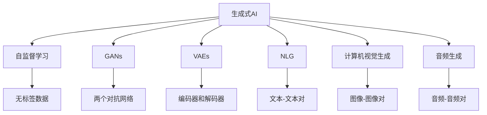

                 

## 1. 背景介绍

### 1.1 问题由来

随着深度学习技术的发展，生成式人工智能（Generative AI）已经在图像生成、文本创作、音乐创作等多个领域展示了其强大的创造力和应用潜力。然而，这些生成式AI模型通常基于大量的数据和复杂的计算，需要耗费大量时间和资源进行训练和优化。实际应用中，生成式AI面临诸多挑战，包括数据采集、模型设计、计算效率、模型鲁棒性、用户隐私保护等问题。本文将详细探讨生成式AI的实际应用场景及面临的挑战，并提出一些解决方案和未来展望。

### 1.2 问题核心关键点

生成式AI的核心在于利用机器学习算法生成符合特定分布的输出数据，如文本、图像、音频等。它通过自监督学习、对抗生成网络（GANs）、变分自编码器（VAEs）等方法，学习数据的内在结构和生成机制。生成式AI在许多领域的应用，如艺术创作、游戏设计、医学影像生成、自然语言生成等，展示了其在模拟和创造方面的强大能力。

## 2. 核心概念与联系

### 2.1 核心概念概述

为更好地理解生成式AI的应用，本节将介绍几个关键概念：

- **生成式AI**：使用机器学习算法生成符合特定分布的输出数据，如文本、图像、音频等。
- **自监督学习**：使用无标签数据进行模型训练，通过模型自身学习数据的内在结构，以生成符合期望的输出。
- **对抗生成网络（GANs）**：通过两个神经网络相互对抗，一个生成网络（Generator）学习生成数据，另一个判别网络（Discriminator）学习判别生成的数据与真实数据。
- **变分自编码器（VAEs）**：通过编码器和解码器学习数据分布的隐空间，并生成符合期望的数据。
- **自然语言生成（NLG）**：使用机器学习算法生成自然语言文本，如文本摘要、对话生成等。
- **计算机视觉生成**：使用机器学习算法生成图像或视频，如图像超分辨率、图像风格转换等。
- **音频生成**：使用机器学习算法生成音频，如语音合成、音乐创作等。

这些概念之间的联系和区别可以通过以下Mermaid流程图来展示：



这个流程图展示了生成式AI的各种关键技术及其相互关系：

- 自监督学习通过无标签数据进行训练，模型自身学习数据的内在结构。
- GANs通过两个对抗网络学习生成数据和判别数据。
- VAEs通过编码器和解码器学习数据分布的隐空间。
- NLG生成自然语言文本，如文本摘要、对话生成。
- 计算机视觉生成生成图像或视频，如图像超分辨率、图像风格转换。
- 音频生成生成音频，如语音合成、音乐创作。

## 3. 核心算法原理 & 具体操作步骤

### 3.1 算法原理概述

生成式AI的核心算法包括自监督学习、GANs、VAEs等，它们通过不同的方式学习数据的生成机制，以生成符合期望的输出。具体来说，生成式AI模型通常包含以下几个关键组件：

1. **编码器（Encoder）**：将输入数据映射到隐空间，用于学习数据的内在结构。
2. **生成器（Generator）**：从隐空间生成符合期望的输出数据。
3. **判别器（Discriminator）**：区分生成的数据和真实数据，用于提高生成器生成数据的逼真度。
4. **解码器（Decoder）**：将隐空间解码回原始数据空间，用于生成和恢复数据。

这些组件共同构成了生成式AI的核心框架，使得模型能够从数据中学习并生成新的样本。

### 3.2 算法步骤详解

基于生成式AI的核心算法，以下是生成式AI模型的具体操作步骤：

**Step 1: 数据准备**
- 收集和预处理生成式AI模型所需的数据。数据可以是图像、文本、音频等，但需要确保数据的多样性和质量。
- 将数据划分为训练集、验证集和测试集。通常需要从不同来源和场景中收集数据，以提高模型的泛化能力。

**Step 2: 模型搭建**
- 选择合适的生成式AI算法，如自监督学习、GANs、VAEs等。
- 搭建模型架构，包括编码器、生成器、判别器（如有）和解码器等组件。
- 定义损失函数，如交叉熵、均方误差、GAN损失等，用于训练模型。

**Step 3: 模型训练**
- 使用训练集对模型进行训练，优化模型参数，以最小化损失函数。
- 定期在验证集上评估模型性能，调整模型参数和训练策略，避免过拟合。
- 迭代训练，直至模型收敛或达到预设的训练轮数。

**Step 4: 模型评估**
- 使用测试集对模型进行最终评估，评估指标包括精度、召回率、F1分数等。
- 分析模型输出的质量，检查是否存在偏差和噪声。
- 对模型进行改进和优化，如调整超参数、优化模型架构等。

**Step 5: 模型应用**
- 将训练好的模型应用于实际任务，如文本生成、图像生成、音频生成等。
- 对模型输出进行后处理，如文本纠错、图像增强等，提高输出质量。
- 监控模型性能，确保模型输出的稳定性和鲁棒性。

### 3.3 算法优缺点

生成式AI的优点包括：

- 生成高质量的输出数据，如逼真的图像、自然的语言等。
- 能够处理复杂的生成任务，如风格迁移、文本摘要等。
- 可以通过迁移学习和预训练技术，提高模型的泛化能力。

其缺点包括：

- 数据需求高，需要大量高质量的标注数据进行训练。
- 模型复杂度高，计算资源消耗大。
- 生成的数据可能存在偏差和噪声，需要大量的人工干预和后处理。

### 3.4 算法应用领域

生成式AI技术广泛应用于以下几个领域：

1. **自然语言生成（NLG）**：用于文本摘要、对话生成、机器翻译、文本创作等。
2. **计算机视觉生成**：用于图像超分辨率、图像风格转换、人脸生成、视频合成等。
3. **音频生成**：用于语音合成、音乐创作、声音效果生成等。
4. **游戏设计**：用于生成虚拟角色、场景、物品等。
5. **艺术创作**：用于生成绘画、雕塑、音乐等艺术作品。
6. **医疗影像生成**：用于生成医学图像、模拟手术等。

## 4. 数学模型和公式 & 详细讲解

### 4.1 数学模型构建

假设生成式AI模型的输入为 $x$，输出为 $y$，隐空间为 $z$。模型包括编码器 $E$、生成器 $G$ 和解码器 $D$。

- 编码器将输入 $x$ 映射到隐空间 $z$，即 $z = E(x)$。
- 生成器从隐空间 $z$ 生成输出 $y$，即 $y = G(z)$。
- 解码器将隐空间 $z$ 解码回输入空间 $x$，即 $x = D(z)$。

### 4.2 公式推导过程

以GANs为例，其基本流程包括两个网络，生成器 $G$ 和判别器 $D$，目标是最小化判别器损失 $L_D$ 和最大化生成器损失 $L_G$。

判别器 $D$ 的损失函数为：

$$L_D = -\mathbb{E}_{x\sim p_x}[\log D(x)] - \mathbb{E}_{z\sim p_z}[\log(1-D(G(z)))]$$

生成器 $G$ 的损失函数为：

$$L_G = -\mathbb{E}_{z\sim p_z}[\log D(G(z))]$$

其中 $p_x$ 为真实数据的分布，$p_z$ 为隐空间的分布。通过交替优化判别器 $D$ 和生成器 $G$，使生成器生成的数据越来越逼真，判别器无法区分真实数据和生成数据。

## 5. 项目实践：代码实例和详细解释说明

### 5.1 开发环境搭建

在进行生成式AI的实践前，我们需要准备好开发环境。以下是使用Python进行PyTorch开发的环境配置流程：

1. 安装Anaconda：从官网下载并安装Anaconda，用于创建独立的Python环境。

2. 创建并激活虚拟环境：
```bash
conda create -n pytorch-env python=3.8 
conda activate pytorch-env
```

3. 安装PyTorch：根据CUDA版本，从官网获取对应的安装命令。例如：
```bash
conda install pytorch torchvision torchaudio cudatoolkit=11.1 -c pytorch -c conda-forge
```

4. 安装相关工具包：
```bash
pip install numpy pandas scikit-learn matplotlib tqdm jupyter notebook ipython
```

完成上述步骤后，即可在`pytorch-env`环境中开始生成式AI的实践。

### 5.2 源代码详细实现

下面我们以GANs生成图像为例，给出使用PyTorch实现的完整代码。

```python
import torch
import torch.nn as nn
import torch.optim as optim
from torchvision import datasets, transforms

# 定义生成器网络
class Generator(nn.Module):
    def __init__(self):
        super(Generator, self).__init__()
        self.encoder = nn.Sequential(
            nn.Linear(100, 256),
            nn.LeakyReLU(0.2, inplace=True),
            nn.Linear(256, 512),
            nn.LeakyReLU(0.2, inplace=True),
            nn.Linear(512, 784),
            nn.Tanh()
        )
    
    def forward(self, z):
        return self.encoder(z)

# 定义判别器网络
class Discriminator(nn.Module):
    def __init__(self):
        super(Discriminator, self).__init__()
        self.decoder = nn.Sequential(
            nn.Linear(784, 512),
            nn.LeakyReLU(0.2, inplace=True),
            nn.Dropout(0.3),
            nn.Linear(512, 256),
            nn.LeakyReLU(0.2, inplace=True),
            nn.Dropout(0.3),
            nn.Linear(256, 1),
            nn.Sigmoid()
        )
    
    def forward(self, x):
        return self.decoder(x)

# 定义损失函数
def loss_fn(disc_loss, gen_loss):
    return disc_loss, gen_loss

# 定义优化器
def optim_fn(learning_rate, generator, discriminator):
    return optim.Adam([{'params': generator.parameters()}, {'params': discriminator.parameters()}], lr=learning_rate)

# 数据准备
train_dataset = datasets.MNIST(root='./mnist', train=True, transform=transforms.ToTensor(), download=True)
test_dataset = datasets.MNIST(root='./mnist', train=False, transform=transforms.ToTensor(), download=True)

# 定义超参数
num_epochs = 100
batch_size = 64
learning_rate = 0.0002

# 定义模型和优化器
G = Generator()
D = Discriminator()
D_loss, G_loss = loss_fn(0.0, 0.0)
opt_G, opt_D = optim_fn(learning_rate, G, D)

# 定义训练函数
def train_GAN():
    for epoch in range(num_epochs):
        for i, (images, _) in enumerate(train_loader):
            real_images = images.view(-1, 28 * 28)
            z = torch.randn(batch_size, 100)
            fake_images = G(z)
            real_loss = D(fake_images).mean()
            fake_loss = D(real_images).mean()
            G_loss.backward(real_loss + fake_loss)
            D_loss.backward(fake_loss)
            opt_G.zero_grad()
            opt_D.zero_grad()
            train_GAN()

# 训练模型
train_GAN()
```

以上代码实现了一个简单的GANs模型，用于生成手写数字图像。通过训练GANs模型，可以生成逼真的手写数字图像，用于生成式AI的实践和研究。

### 5.3 代码解读与分析

让我们再详细解读一下关键代码的实现细节：

**Generator和Discriminator类**：
- `Generator`类定义生成器网络，使用LeakyReLU激活函数，从随机噪声中生成图像。
- `Discriminator`类定义判别器网络，使用LeakyReLU激活函数和Dropout技术，判别图像是否为真实图像。

**loss_fn和optim_fn函数**：
- `loss_fn`函数定义GANs模型的损失函数，包括生成器损失和判别器损失。
- `optim_fn`函数定义优化器，使用Adam优化算法，交替优化生成器和判别器。

**数据准备和模型初始化**：
- 使用PyTorch的`datasets.MNIST`类加载手写数字数据集。
- 定义超参数，包括训练轮数、批次大小和优化器学习率。
- 初始化生成器和判别器模型，以及损失函数和优化器。

**训练函数train_GAN**：
- 使用训练集数据，对生成器和判别器交替进行优化。
- 计算生成器和判别器的损失，使用优化器更新模型参数。
- 每轮训练后，评估模型的性能。

**运行结果展示**：
- 通过训练GANs模型，可以生成逼真的手写数字图像。训练结束后，可以在测试集上评估模型的性能，生成新的手写数字图像。

## 6. 实际应用场景

### 6.1 生成式文本创作

生成式AI在自然语言生成（NLG）方面有着广泛的应用，如文本摘要、对话生成、机器翻译等。以文本生成为例，可以使用深度学习模型生成符合特定风格或主题的文本，用于新闻报道、小说创作、广告文案等。

在实际应用中，可以将预训练的语言模型作为基础模型，使用生成式AI技术对模型进行微调，使其能够生成高质量的文本。例如，使用GPT-3等大模型进行微调，可以生成逼真的新闻报道、小说章节、广告文案等，用于内容创作和市场营销。

### 6.2 图像超分辨率

图像超分辨率是生成式AI在计算机视觉领域的重要应用之一。通过对低分辨率图像进行生成式训练，可以得到高分辨率的图像，提高图像质量。

例如，使用GANs模型对低分辨率图像进行超分辨率训练，可以生成清晰的图像。这些高分辨率图像可以用于医学影像、影视制作、游戏设计等领域，提高图像质量和使用效果。

### 6.3 医学影像生成

医学影像生成是生成式AI在医疗领域的重要应用之一。通过训练生成式模型，可以从少量样本生成大量的医学影像，用于模拟手术、辅助诊断、教学培训等。

例如，使用GANs模型对医学影像进行生成式训练，可以生成逼真的医学图像，用于模拟手术、辅助诊断等。这些医学图像可以用于医生培训、教学演示、病历记录等，提高医疗质量和效率。

### 6.4 未来应用展望

随着生成式AI技术的不断发展，未来的应用将更加广泛和深入。以下列举几个可能的应用方向：

1. **自动驾驶**：生成式AI可以用于自动驾驶中的环境建模和场景预测，提高自动驾驶的安全性和稳定性。
2. **智能家居**：生成式AI可以用于智能家居中的自然语言理解和对话生成，提高智能家居的交互性和便捷性。
3. **虚拟现实**：生成式AI可以用于虚拟现实中的场景生成和交互，提高虚拟现实的真实感和沉浸感。
4. **虚拟主播**：生成式AI可以用于虚拟主播的语音生成和自然语言理解，提高虚拟主播的交互性和情感表达。

## 7. 工具和资源推荐

### 7.1 学习资源推荐

为了帮助开发者系统掌握生成式AI的理论基础和实践技巧，这里推荐一些优质的学习资源：

1. **《Generative Adversarial Networks: An Overview》**：Ian Goodfellow等撰写的综述论文，详细介绍了GANs的基本原理和应用。
2. **《The Unreasonable Effectiveness of Generative Adversarial Networks》**：Andrew Ng在Stanford的演讲，介绍了GANs在图像生成、音乐生成等方面的应用。
3. **Deep Learning Specialization**：Andrew Ng在Coursera开设的深度学习课程，涵盖深度学习的基本理论和实践，包括生成式AI的介绍。
4. **PyTorch官方文档**：PyTorch官方文档提供了丰富的生成式AI资源和样例代码，是学习PyTorch的重要参考。
5. **Transformers库官方文档**：Transformers库提供了多种生成式AI模型的实现，是学习和使用生成式AI的重要工具。

### 7.2 开发工具推荐

高效的开发离不开优秀的工具支持。以下是几款用于生成式AI开发的常用工具：

1. **PyTorch**：基于Python的开源深度学习框架，灵活动态的计算图，适合快速迭代研究。
2. **TensorFlow**：由Google主导开发的开源深度学习框架，生产部署方便，适合大规模工程应用。
3. **Transformers库**：HuggingFace开发的NLP工具库，集成了多种生成式AI模型的实现，是学习和使用生成式AI的重要工具。
4. **Weights & Biases**：模型训练的实验跟踪工具，可以记录和可视化模型训练过程中的各项指标，方便对比和调优。
5. **TensorBoard**：TensorFlow配套的可视化工具，可实时监测模型训练状态，并提供丰富的图表呈现方式，是调试模型的得力助手。

### 7.3 相关论文推荐

生成式AI的发展源于学界的持续研究。以下是几篇奠基性的相关论文，推荐阅读：

1. **Image Super-Resolution Using a Generative Adversarial Network**：Ian Goodfellow等撰写的论文，介绍了使用GANs进行图像超分辨率的方法。
2. **StackGAN: Text to Photo-Realistic Image Synthesis with Attentive Stacked Generative Adversarial Networks**：Zhang等撰写的论文，介绍了使用StackGAN生成逼真图像的方法。
3. **Attention Is All You Need**：Ashish Vaswani等撰写的论文，介绍了使用Transformer进行自然语言生成的方法。
4. **Character-Level GANs for Text Generation**：Marc-Alexandre Dubois等撰写的论文，介绍了使用GANs进行文本生成的方法。
5. **GPT-3: Language Models are Unsupervised Multitask Learners**：OpenAI撰写的论文，介绍了使用GPT-3进行自然语言生成的方法。

除上述资源外，还有一些值得关注的前沿资源，帮助开发者紧跟生成式AI技术的最新进展，例如：

1. **arXiv论文预印本**：人工智能领域最新研究成果的发布平台，包括大量尚未发表的前沿工作，学习前沿技术的必读资源。
2. **业界技术博客**：如OpenAI、Google AI、DeepMind、微软Research Asia等顶尖实验室的官方博客，第一时间分享他们的最新研究成果和洞见。
3. **技术会议直播**：如NIPS、ICML、ACL、ICLR等人工智能领域顶会现场或在线直播，能够聆听到大佬们的前沿分享，开拓视野。
4. **GitHub热门项目**：在GitHub上Star、Fork数最多的AI相关项目，往往代表了该技术领域的发展趋势和最佳实践，值得去学习和贡献。
5. **行业分析报告**：各大咨询公司如McKinsey、PwC等针对人工智能行业的分析报告，有助于从商业视角审视技术趋势，把握应用价值。

## 8. 总结：未来发展趋势与挑战

### 8.1 总结

本文对生成式AI的实际应用和挑战进行了全面系统的介绍。首先阐述了生成式AI的研究背景和意义，明确了生成式AI在自然语言生成、图像生成、音频生成等领域的强大应用潜力。其次，从原理到实践，详细讲解了GANs、VAEs等核心算法，以及具体的训练步骤和代码实现。同时，本文还广泛探讨了生成式AI在智能家居、自动驾驶、医学影像生成等多个行业领域的应用前景，展示了生成式AI技术的广阔前景。

通过本文的系统梳理，可以看到，生成式AI技术已经在多个领域展示了其强大的创造力和应用潜力，未来必将进一步拓展其应用边界，推动人工智能技术的发展和普及。

### 8.2 未来发展趋势

展望未来，生成式AI将呈现以下几个发展趋势：

1. **模型规模持续增大**：随着算力成本的下降和数据规模的扩张，生成式AI模型的参数量还将持续增长。超大规模模型蕴含的丰富知识，有望支撑更加复杂多变的生成任务。
2. **生成技术日趋多样化**：除了GANs和VAEs，未来还会涌现更多生成技术，如VAEs、变分自编码器（VAEs）、自适应生成模型等，以适应不同的生成任务。
3. **跨模态生成技术崛起**：生成式AI将更多地关注跨模态生成技术，如视觉、语音、文本等多种模态的融合，实现更加全面的生成能力。
4. **生成式学习范式改进**：生成式AI将引入更多生成式学习范式，如对抗生成网络（GANs）、自监督学习、强化学习等，提高生成质量和学习效率。
5. **生成式模型可解释性增强**：生成式AI将引入更多可解释性技术，如生成对抗网络（GANs）、因果推断、知识蒸馏等，提高模型的可解释性和可靠性。

以上趋势凸显了生成式AI技术的广阔前景。这些方向的探索发展，必将进一步提升生成式AI的质量和应用范围，为生成式AI技术的落地应用铺平道路。

### 8.3 面临的挑战

尽管生成式AI已经取得了瞩目成就，但在迈向更加智能化、普适化应用的过程中，它仍面临着诸多挑战：

1. **数据需求高**：生成式AI需要大量高质量的数据进行训练，获取高质量数据是一个瓶颈。
2. **计算资源消耗大**：生成式AI模型通常参数量较大，计算资源消耗大，难以大规模部署。
3. **生成数据质量不稳定**：生成的数据可能存在噪声、偏差等问题，需要大量人工干预和后处理。
4. **生成式模型鲁棒性不足**：生成式模型在面对域外数据时，泛化性能往往大打折扣。
5. **生成式模型可解释性不足**：生成式模型通常被认为是"黑盒"系统，难以解释其内部工作机制和决策逻辑。

### 8.4 研究展望

面对生成式AI面临的诸多挑战，未来的研究需要在以下几个方面寻求新的突破：

1. **数据增强和生成式学习**：通过数据增强和生成式学习技术，提高生成式AI模型对小样本数据的适应能力。
2. **跨模态生成技术**：引入跨模态生成技术，实现视觉、语音、文本等多种模态的融合，提高生成式AI的生成能力。
3. **生成式模型优化**：开发更高效的生成式AI模型架构和优化算法，提高生成质量和计算效率。
4. **生成式模型可解释性**：引入生成式模型可解释性技术，提高生成式AI模型的可解释性和可靠性。

这些研究方向将进一步推动生成式AI技术的发展，为生成式AI技术的落地应用提供新的突破口。面向未来，生成式AI技术还需要与其他人工智能技术进行更深入的融合，如知识表示、因果推理、强化学习等，多路径协同发力，共同推动生成式AI技术的发展和应用。

## 9. 附录：常见问题与解答

**Q1：生成式AI的训练过程是否需要大量标注数据？**

A: 生成式AI的训练过程通常需要大量无标签数据进行自监督学习，不需要标注数据。但对于某些特定的生成任务，如文本生成、图像生成等，可能需要少量的标注数据进行微调。

**Q2：生成式AI的模型规模和训练成本是否过于庞大？**

A: 生成式AI模型通常参数量较大，训练成本较高。但随着硬件设备的进步和算力成本的下降，生成式AI的模型规模和训练成本将逐步降低。

**Q3：生成式AI生成的数据是否存在偏差和噪声？**

A: 生成式AI生成的数据可能存在偏差和噪声，需要大量人工干预和后处理。但通过优化模型架构和训练策略，可以有效减少偏差和噪声。

**Q4：生成式AI的生成质量是否稳定？**

A: 生成式AI的生成质量不稳定，受训练数据、模型参数、超参数等因素的影响。通过优化超参数、数据增强等技术，可以提高生成质量。

**Q5：生成式AI在实际应用中是否存在安全隐患？**

A: 生成式AI在实际应用中可能存在安全隐患，如生成的内容可能包含偏见、有害信息等。需要通过数据清洗、模型优化等手段，确保生成内容的合法性和安全性。

**Q6：生成式AI是否适用于所有应用场景？**

A: 生成式AI适用于大部分应用场景，但在某些特殊场景下，如医疗、金融等，可能需要特定的模型和数据进行微调。

总之，生成式AI技术在自然语言生成、图像生成、音频生成等诸多领域展现出强大的创造力和应用潜力。但同时也面临数据需求高、计算资源消耗大、生成质量不稳定等挑战。通过不断优化模型架构、改进训练策略、提升数据质量等手段，生成式AI技术必将进一步拓展其应用边界，推动人工智能技术的发展和普及。

---

作者：禅与计算机程序设计艺术 / Zen and the Art of Computer Programming

