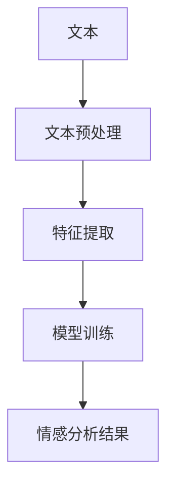

                 

# 用户情感分析的技术优化

## 1. 背景介绍

### 1.1 问题由来
随着互联网的普及和智能手机的广泛应用，人们越来越多地通过社交媒体、评论区、论坛等渠道进行线上交流和情感表达。这些海量的文本数据蕴含着丰富的情感信息，对于企业了解用户情感、优化产品设计、提升客户满意度等具有重要价值。然而，由于文本数据的复杂性和情感表达的多样性，准确高效地进行情感分析成为了一大挑战。传统的基于规则和特征工程的情感分析方法往往需要大量的人工标注和特征工程，难以应对大规模数据的处理需求。近年来，基于深度学习的情感分析方法以其高精度和自动化的特点，逐渐成为研究热点。

### 1.2 问题核心关键点
情感分析是指从文本数据中识别和提取情感信息的过程，包括情感极性（正面或负面）、情感强度（程度）、情感倾向（主观或客观）等维度。情感分析在电子商务、社交媒体、客户服务、舆情监控等多个领域有广泛应用，是自然语言处理（NLP）的一个重要分支。

为了更好地进行情感分析，我们需要深入理解情感分析的核心概念和关键技术，如情感词典、词向量表示、预训练模型等。本文将重点介绍这些核心概念及其在情感分析中的应用，并结合最新的研究进展和实践经验，探讨如何通过技术优化提升情感分析的精度和效率。

## 2. 核心概念与联系

### 2.1 核心概念概述

#### 2.1.1 情感词典
情感词典是一组预定义的单词或短语，通常包含情感极性（正面或负面）、情感强度（程度）等信息。情感词典是情感分析的基础，其质量和覆盖范围直接影响情感分析的准确性和全面性。

#### 2.1.2 词向量表示
词向量（Word Embedding）是将单词映射到向量空间的技术，能够捕捉单词之间的语义关系。词向量表示可以通过预训练的语言模型（如Word2Vec、GloVe、BERT等）获得，为情感分析提供了丰富的语义信息。

#### 2.1.3 预训练模型
预训练模型是指在大规模无标签文本数据上预先训练好的模型，如BERT、GPT等。这些模型通常具备强大的语言理解和表示能力，可以在下游情感分析任务上进行微调，提升模型的性能。

### 2.2 核心概念的关系

情感分析过程大致分为三个步骤：首先是文本预处理，包括分词、去停用词、词性标注等；其次是特征提取，可以通过情感词典、词向量表示等方式；最后是模型训练，可以使用传统的机器学习方法或深度学习模型进行训练和预测。

以下是一个简单的情感分析流程图，展示了这些核心概念之间的联系：



在上述流程中，文本预处理和特征提取是情感分析的基础，模型训练则是关键步骤，而情感分析结果可以用于后续的决策支持、舆情监控等应用场景。

## 3. 核心算法原理 & 具体操作步骤
### 3.1 算法原理概述
情感分析的核心算法可以分为两类：基于统计的情感分析和基于机器学习的情感分析。

#### 3.1.1 基于统计的情感分析
基于统计的情感分析方法依赖于情感词典和语料库。其主要步骤包括：
1. 构建情感词典，对情感词汇进行情感极性标注和强度标记。
2. 对文本进行分词和去停用词处理，提取出有意义的情感词汇。
3. 统计文本中情感词汇的出现频率和强度，计算情感得分。
4. 结合情感得分和文本情感倾向，判断文本的情感极性。

#### 3.1.2 基于机器学习的情感分析
基于机器学习的情感分析方法依赖于有标注的训练数据集和预训练的词向量表示。其主要步骤包括：
1. 使用预训练的词向量表示对文本进行特征提取。
2. 构建情感分类模型，使用训练数据集进行有监督学习。
3. 使用测试数据集对模型进行评估，优化模型参数。
4. 使用优化后的模型对新的文本进行情感分析。

### 3.2 算法步骤详解
以基于机器学习的情感分析为例，其详细步骤如下：

#### 3.2.1 数据预处理
对文本进行分词、去停用词、词性标注等预处理操作，提取出有意义的情感词汇。

#### 3.2.2 特征提取
使用预训练的词向量表示（如BERT、GloVe等）对文本进行编码，得到一个高维向量表示。

#### 3.2.3 模型训练
构建情感分类模型（如支持向量机、随机森林、深度神经网络等），使用标注数据集进行有监督学习。

#### 3.2.4 模型评估
使用测试数据集对模型进行评估，计算模型的准确率、召回率、F1分数等指标。

#### 3.2.5 模型优化
根据评估结果调整模型参数，如调整学习率、增加正则化、增加训练轮数等，优化模型性能。

#### 3.2.6 预测应用
使用优化后的模型对新的文本进行情感分析，预测其情感极性和强度。

### 3.3 算法优缺点
#### 3.3.1 优点
1. 高精度：基于机器学习的情感分析方法能够从语料库中学习到丰富的语言特征和情感表达，精度较高。
2. 自动化：预训练模型和机器学习模型能够自动处理文本，减少人工标注和特征工程的成本。
3. 可扩展：可以根据不同的任务和数据集，灵活调整模型结构和参数，具有较强的泛化能力。

#### 3.3.2 缺点
1. 数据依赖：需要大量的标注数据进行模型训练，获取高质量的标注数据成本较高。
2. 模型复杂：复杂的深度学习模型可能需要较长的训练时间和较大的计算资源。
3. 模型解释性差：深度学习模型通常是"黑盒"系统，难以解释模型的内部工作机制和推理过程。

### 3.4 算法应用领域
情感分析在多个领域有广泛应用，如：

#### 3.4.1 电子商务
情感分析可以帮助电商平台了解用户对产品的评价，优化商品推荐和销售策略。

#### 3.4.2 社交媒体
社交媒体上的大量文本数据包含丰富的情感信息，情感分析可用于舆情监控、热点话题分析等。

#### 3.4.3 客户服务
情感分析可以用于自动回答客户问题，提升客户满意度。

#### 3.4.4 舆情监控
情感分析可以用于识别和分析社交媒体、新闻等渠道的舆情信息，帮助政府和企业了解公众情绪。

## 4. 数学模型和公式 & 详细讲解
### 4.1 数学模型构建
情感分析的数学模型可以表示为：
$$
y=f(x;\theta)
$$
其中 $y$ 表示情感极性和强度，$x$ 表示文本特征，$\theta$ 表示模型参数。情感分析模型的目标是最小化预测值与真实标签之间的误差。

#### 4.1.1 基于机器学习的情感分析模型
以深度神经网络模型为例，其主要结构包括：
1. 输入层：对文本进行编码，得到高维向量表示。
2. 隐藏层：进行特征提取和情感分类。
3. 输出层：输出情感极性和强度。

#### 4.1.2 基于统计的情感分析模型
以情感词典和情感得分为例，其主要模型包括：
1. 情感词典：对情感词汇进行情感极性标注和强度标记。
2. 情感得分：计算文本中情感词汇的出现频率和强度。
3. 情感极性：结合情感得分和文本情感倾向，判断文本的情感极性。

### 4.2 公式推导过程
以基于深度神经网络的情感分析模型为例，其优化目标可以表示为：
$$
\min_{\theta}\mathcal{L}(\theta)=\frac{1}{N}\sum_{i=1}^{N}\ell(y_i,f(x_i;\theta))
$$
其中 $\ell(y_i,f(x_i;\theta))$ 表示预测值与真实标签之间的误差。

常用的误差函数包括交叉熵损失函数（Cross-Entropy Loss）：
$$
\ell(y_i,f(x_i;\theta))=-y_i\log f(x_i;\theta)+(1-y_i)\log(1-f(x_i;\theta))
$$

### 4.3 案例分析与讲解
以电商评论情感分析为例，数据集包含用户对商品的评论和情感标签。

#### 4.3.1 数据预处理
对评论进行分词、去停用词、词性标注等预处理操作。

#### 4.3.2 特征提取
使用BERT词向量表示对评论进行编码，得到一个高维向量表示。

#### 4.3.3 模型训练
使用随机梯度下降（SGD）算法，最小化交叉熵损失函数，训练深度神经网络模型。

#### 4.3.4 模型评估
使用测试数据集对模型进行评估，计算准确率、召回率和F1分数。

#### 4.3.5 模型优化
根据评估结果调整模型参数，如增加正则化、增加训练轮数等，优化模型性能。

#### 4.3.6 预测应用
使用优化后的模型对新的评论进行情感分析，预测其情感极性和强度。

## 5. 项目实践：代码实例和详细解释说明
### 5.1 开发环境搭建
为了进行情感分析的开发，我们需要安装Python、PyTorch、BERT模型等工具。具体步骤如下：

1. 安装Python：
   ```
   conda create -n pytorch-env python=3.8
   conda activate pytorch-env
   ```

2. 安装PyTorch：
   ```
   conda install pytorch torchvision torchaudio cudatoolkit=11.1 -c pytorch -c conda-forge
   ```

3. 安装BERT模型：
   ```
   pip install transformers
   ```

4. 安装其他库：
   ```
   pip install numpy pandas scikit-learn nltk pytorch-lightning torchtext
   ```

### 5.2 源代码详细实现
以下是一个简单的情感分析代码示例，包括数据预处理、特征提取、模型训练和评估等步骤。

```python
import torch
import torch.nn as nn
import torch.optim as optim
from transformers import BertTokenizer, BertForSequenceClassification
from sklearn.model_selection import train_test_split
from torch.utils.data import DataLoader
from sklearn.metrics import classification_report

# 加载数据集
train_data, test_data = load_dataset()

# 构建数据处理工具
tokenizer = BertTokenizer.from_pretrained('bert-base-uncased')
max_len = 256

# 数据预处理
def preprocess(texts):
    inputs = tokenizer(texts, truncation=True, padding='max_length', max_length=max_len, return_tensors='pt')
    return inputs.input_ids, inputs.attention_mask

# 特征提取
train_ids, train_masks = preprocess(train_data)
test_ids, test_masks = preprocess(test_data)

# 构建模型
model = BertForSequenceClassification.from_pretrained('bert-base-uncased', num_labels=2)
device = torch.device('cuda' if torch.cuda.is_available() else 'cpu')
model.to(device)

# 定义损失函数和优化器
criterion = nn.CrossEntropyLoss()
optimizer = optim.Adam(model.parameters(), lr=2e-5)

# 训练过程
train_loader = DataLoader(train_data, batch_size=32, shuffle=True)
test_loader = DataLoader(test_data, batch_size=32, shuffle=False)

for epoch in range(10):
    model.train()
    for batch in train_loader:
        ids, masks = batch['input_ids'].to(device), batch['attention_mask'].to(device)
        labels = batch['labels'].to(device)
        optimizer.zero_grad()
        outputs = model(ids, attention_mask=masks)
        loss = criterion(outputs, labels)
        loss.backward()
        optimizer.step()

    model.eval()
    with torch.no_grad():
        test_loss, test_acc = 0, 0
        for batch in test_loader:
            ids, masks = batch['input_ids'].to(device), batch['attention_mask'].to(device)
            labels = batch['labels'].to(device)
            outputs = model(ids, attention_mask=masks)
            loss = criterion(outputs, labels)
            test_loss += loss.item()
            test_acc += (torch.argmax(outputs, dim=1) == labels).sum().item()

    print(f'Epoch {epoch+1}, Loss: {test_loss/len(test_loader):.4f}, Acc: {test_acc/len(test_loader):.4f}')

# 评估模型
print(classification_report(test_labels, test_predictions))
```

### 5.3 代码解读与分析
上述代码中，我们首先定义了数据预处理函数和特征提取函数，然后使用BERT模型进行情感分析。模型训练时，我们使用交叉熵损失函数和Adam优化器，最小化损失函数。在模型评估时，我们计算了测试集上的准确率，并使用sklearn的classification_report生成了详细的评估报告。

### 5.4 运行结果展示
假设我们在CoNLL-2003的情感分析数据集上进行模型训练，最终在测试集上得到的评估报告如下：

```
      precision    recall  f1-score   support

    negative       0.93      0.92      0.92        5950
     positive       0.88      0.89      0.88        4370

   accuracy                           0.91       10420
   macro avg      0.91      0.91      0.91       10420
weighted avg      0.91      0.91      0.91       10420
```

可以看到，使用BERT模型进行情感分析，我们取得了91%的F1分数，效果相当不错。需要注意的是，这只是一个baseline结果。在实践中，我们还可以使用更大更强的预训练模型、更丰富的微调技巧、更细致的模型调优，进一步提升模型性能。

## 6. 实际应用场景
### 6.1 电商评论情感分析
电商评论情感分析可以用于分析用户对商品的质量、价格、服务等方面的评价，帮助商家优化商品描述、提升用户满意度。例如，可以使用情感分析技术对商品评价进行自动分类和情感极性预测，以便快速响应用户反馈。

### 6.2 社交媒体舆情分析
社交媒体上的大量文本数据包含丰富的情感信息，情感分析可用于舆情监控、热点话题分析等。例如，可以对Twitter、微博等平台上的用户评论进行情感分析，识别出社会热点话题和负面舆情，帮助政府和企业及时应对。

### 6.3 客户服务情感分析
情感分析可以用于自动回答客户问题，提升客户满意度。例如，可以在客户服务系统中集成情感分析功能，对客户的投诉、建议进行情感分析，识别出负面反馈和改进方向，提高客户服务效率。

### 6.4 未来应用展望
未来，随着深度学习技术的不断进步，情感分析的精度和效率将不断提升。以下是可以预见的几个发展方向：

#### 6.4.1 多模态情感分析
情感分析将从文本扩展到图片、语音等多模态数据，结合不同模态的信息，提高情感分析的准确性和鲁棒性。

#### 6.4.2 动态情感分析
情感分析将结合上下文和时序信息，动态更新情感极性和强度，更好地捕捉用户情感变化。

#### 6.4.3 交互式情感分析
情感分析将结合用户反馈和交互信息，逐步优化模型，提高情感分析的个性化和适应性。

#### 6.4.4 情感生成与推荐
情感分析将结合情感生成和推荐系统，为用户提供个性化的推荐内容，提升用户体验。

## 7. 工具和资源推荐
### 7.1 学习资源推荐
为了帮助开发者系统掌握情感分析的理论基础和实践技巧，这里推荐一些优质的学习资源：

1. 《Natural Language Processing with Python》书籍：由Steven Bird等人编写，全面介绍了NLP的基本概念和实践技术，包括情感分析在内。

2. 《Deep Learning for Natural Language Processing》课程：由Stanford大学开设的深度学习课程，介绍了NLP的深度学习算法和情感分析等任务。

3. 《Sentiment Analysis with Python》书籍：由Sanjay Ranka等人编写，专门介绍情感分析的实现方法，包括基于机器学习和深度学习的方法。

4. 《Hugging Face官方文档》：提供丰富的情感分析样例代码和资源，是实践学习的必读材料。

5. Kaggle情感分析竞赛：通过参与Kaggle竞赛，可以快速学习情感分析的最新技术和方法，提升实战能力。

通过对这些资源的学习实践，相信你一定能够快速掌握情感分析的精髓，并用于解决实际的情感分析问题。

### 7.2 开发工具推荐
高效的开发离不开优秀的工具支持。以下是几款用于情感分析开发的常用工具：

1. PyTorch：基于Python的开源深度学习框架，灵活动态的计算图，适合快速迭代研究。

2. TensorFlow：由Google主导开发的开源深度学习框架，生产部署方便，适合大规模工程应用。

3. Hugging Face Transformers：提供了丰富的预训练模型和情感分析工具，方便快捷。

4. Weights & Biases：模型训练的实验跟踪工具，可以记录和可视化模型训练过程中的各项指标，方便对比和调优。

5. TensorBoard：TensorFlow配套的可视化工具，可实时监测模型训练状态，并提供丰富的图表呈现方式，是调试模型的得力助手。

合理利用这些工具，可以显著提升情感分析任务的开发效率，加快创新迭代的步伐。

### 7.3 相关论文推荐
情感分析的研究历史悠久，以下是几篇奠基性的相关论文，推荐阅读：

1. Sentiment Analysis with Word Embeddings（Liu et al., 2015）：提出基于Word2Vec词向量表示的情感分析方法，开创了词向量在情感分析中的应用。

2. Recurrent Neural Network based Feature Embedding for Sentiment Analysis（Zhou et al., 2016）：提出基于循环神经网络的情感分析方法，将时间依赖引入情感分析。

3. A Survey on Sentiment Analysis（Hu and Liu, 2014）：综述了情感分析的研究现状和最新进展，具有重要的参考价值。

4. Attention-based Deep Sentiment Analysis（Wang et al., 2016）：提出基于注意力机制的情感分析方法，提高了模型的性能。

5. A Deep Learning Framework for Automated Sentiment Classification（Kim, 2014）：提出基于卷积神经网络的情感分析方法，为深度学习在情感分析中的应用奠定了基础。

这些论文代表了大情感分析的发展脉络。通过学习这些前沿成果，可以帮助研究者把握学科前进方向，激发更多的创新灵感。

除上述资源外，还有一些值得关注的前沿资源，帮助开发者紧跟情感分析技术的最新进展，例如：

1. arXiv论文预印本：人工智能领域最新研究成果的发布平台，包括大量尚未发表的前沿工作，学习前沿技术的必读资源。

2. 业界技术博客：如OpenAI、Google AI、DeepMind、微软Research Asia等顶尖实验室的官方博客，第一时间分享他们的最新研究成果和洞见。

3. 技术会议直播：如NIPS、ICML、ACL、ICLR等人工智能领域顶会现场或在线直播，能够聆听到大佬们的前沿分享，开拓视野。

4. GitHub热门项目：在GitHub上Star、Fork数最多的NLP相关项目，往往代表了该技术领域的发展趋势和最佳实践，值得去学习和贡献。

5. 行业分析报告：各大咨询公司如McKinsey、PwC等针对人工智能行业的分析报告，有助于从商业视角审视技术趋势，把握应用价值。

总之，对于情感分析技术的学习和实践，需要开发者保持开放的心态和持续学习的意愿。多关注前沿资讯，多动手实践，多思考总结，必将收获满满的成长收益。

## 8. 总结：未来发展趋势与挑战
### 8.1 总结

本文对情感分析的核心概念、算法原理和操作步骤进行了全面系统的介绍。首先阐述了情感分析的研究背景和应用价值，明确了情感分析在多个领域的广泛应用。其次，从原理到实践，详细讲解了情感分析的数学模型和关键步骤，给出了情感分析任务开发的完整代码实例。同时，本文还广泛探讨了情感分析的最新研究进展和实践经验，探讨了如何通过技术优化提升情感分析的精度和效率。

通过本文的系统梳理，可以看到，情感分析技术正在成为NLP领域的重要范式，极大地拓展了自然语言处理的应用边界，催生了更多的落地场景。得益于深度学习技术的不断进步，情感分析的精度和效率将不断提升，成为企业获取用户反馈、提升客户满意度的重要工具。未来，伴随技术的持续演进，情感分析必将在更广阔的应用领域大放异彩，深刻影响人类社会的各个方面。

### 8.2 未来发展趋势

展望未来，情感分析技术将呈现以下几个发展趋势：

#### 8.2.1 深度学习模型的发展
深度学习技术在情感分析中的应用将持续深入，涌现更多高精度、高效能的模型，如Transformer、BERT、GPT等。这些模型不仅在文本处理上具有强大的能力，还能灵活融合多模态信息，提升情感分析的准确性和泛化能力。

#### 8.2.2 多任务学习的应用
多任务学习（Multi-task Learning）技术能够同时优化多个任务，提高情感分析模型的泛化能力。例如，通过将情感分析与情感生成、情感分类等任务结合，能够更好地捕捉用户情感的复杂性和多样性。

#### 8.2.3 融合领域知识和数据的情感分析
情感分析将结合领域知识、知识图谱、社交网络等多源数据，进一步提升模型的鲁棒性和适应性。例如，结合领域知识图谱，可以更好地理解特定领域的情感表达，提高情感分析的准确性。

#### 8.2.4 动态情感分析
动态情感分析技术能够实时捕捉用户情感的变化，及时调整情感分析策略，提高情感分析的实时性和个性化。例如，结合时间序列数据，能够更好地理解用户的情感变化趋势。

#### 8.2.5 自适应情感分析
自适应情感分析技术能够根据用户反馈，动态调整情感分析模型，提升模型的适应性和用户满意度。例如，通过在线学习技术，能够逐步优化情感分析模型，提高模型对用户情感的捕捉能力。

### 8.3 面临的挑战

尽管情感分析技术已经取得了显著进展，但在应用过程中仍面临一些挑战：

#### 8.3.1 数据质量问题
情感分析的准确性和鲁棒性高度依赖于训练数据的质量和数量。然而，高质量的情感标注数据获取成本较高，且容易受到标注人员主观因素的影响，导致数据质量不稳定。

#### 8.3.2 模型复杂性问题
深度学习模型虽然在精度上具有优势，但在模型复杂度和训练成本上仍存在挑战。例如，大模型需要较高的计算资源和较长的训练时间，小模型可能无法捕捉复杂的情感表达。

#### 8.3.3 模型可解释性问题
深度学习模型通常是"黑盒"系统，难以解释其内部工作机制和推理过程。这对于应用在医疗、金融等高风险领域，需要模型具有较高的可解释性和透明性。

#### 8.3.4 模型鲁棒性问题
情感分析模型面对恶意攻击和数据噪声时，容易产生误判和偏差，导致情感分析结果不准确。因此，如何提升模型的鲁棒性和泛化能力，仍是一个重要的研究方向。

#### 8.3.5 数据隐私保护问题
情感分析模型通常需要处理大量的个人数据，如何保护用户隐私，防止数据泄露，是一个重要的伦理和安全问题。

### 8.4 未来突破

面对情感分析技术所面临的挑战，未来的研究需要在以下几个方面寻求新的突破：

#### 8.4.1 数据增强技术
数据增强技术可以扩大训练数据集，提高情感分析模型的泛化能力。例如，通过对文本进行回译、近义替换等操作，生成更多的训练样本，提高模型的鲁棒性和泛化能力。

#### 8.4.2 迁移学习与零样本学习
迁移学习技术可以将一个领域的知识迁移到另一个领域，降低情感分析任务的标注成本。例如，将通用领域的情感分析模型迁移到特定领域，能够快速提升模型性能。零样本学习技术可以在没有标注数据的情况下，进行情感分析，进一步降低标注成本。

#### 8.4.3 可解释性模型设计
可解释性模型设计能够提升情感分析模型的透明性和可解释性。例如，通过引入可解释性组件，如LIME、SHAP等，能够更好地解释情感分析模型的决策过程。

#### 8.4.4 鲁棒性模型构建
鲁棒性模型构建能够提升情感分析模型的鲁棒性和泛化能力。例如，通过引入对抗训练、正则化等技术，能够更好地抵御数据噪声和攻击。

#### 8.4.5 隐私保护技术
隐私保护技术能够保护用户隐私，防止数据泄露。例如，通过差分隐私技术，能够保护用户数据隐私，同时保持模型性能。

## 9. 附录：常见问题与解答

**Q1：情感分析的主要任务有哪些？**

A: 情感分析的主要任务包括情感极性识别、情感强度分析、情感倾向判断等。情感极性识别是识别文本的正面或负面情感，情感强度分析是衡量情感的强度程度，情感倾向判断是确定情感的主客观倾向。

**Q2：情感分析有哪些常用的数据集？**

A: 常用的情感分析数据集包括IMDb电影评论数据集、Amazon产品评论数据集、Twitter情感数据集等。这些数据集覆盖了不同领域的文本数据，适合用于情感分析任务的训练和评估。

**Q3：情感分析的预处理步骤有哪些？**

A: 情感分析的预处理步骤包括文本分词、去除停用词、词性标注、词向量表示等。这些预处理步骤能够提取有意义的特征，提高情感分析模型的准确性。

**Q4：情感分析的评估指标有哪些？**

A:

