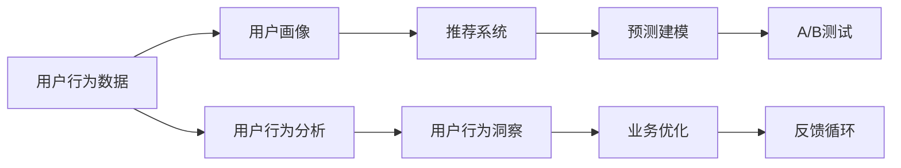

                 

## 1. 背景介绍

在当今数字化时代，消费者行为变得越来越复杂，消费者对于商品的需求也在不断变化和演化。为应对这些变化，企业需要深入了解用户的购买行为、偏好和需求，并基于这些信息进行有效的决策和优化。用户行为分析（User Behavior Analysis, UBA）成为了企业洞察用户需求，优化商品供给的关键手段。人工智能（AI）技术的崛起，尤其是机器学习、自然语言处理、推荐系统等技术，为这一过程提供了强有力的支持。

### 1.1 用户行为分析的必要性

用户行为分析旨在通过分析用户的各种行为数据，如浏览记录、购买记录、评价、搜索关键词等，来揭示用户需求和行为模式。这对于以下方面具有重要意义：

- **市场洞察**：帮助企业理解市场趋势和消费者需求的变化。
- **个性化推荐**：基于用户的行为数据，推荐个性化的商品，提高用户的满意度和粘性。
- **库存管理**：通过分析用户购买行为，优化库存管理，减少库存积压和缺货风险。
- **价格优化**：根据用户购买行为，制定更具竞争力的价格策略，提高销售效率和利润率。

### 1.2 用户行为分析的挑战

尽管用户行为分析具有巨大的潜力，但在实际应用中也面临诸多挑战：

- **数据隐私**：用户行为数据的收集和使用必须遵循隐私保护法规，如GDPR等。
- **数据质量**：数据收集和处理的完整性、准确性、及时性对分析结果影响重大。
- **模型复杂性**：处理大规模复杂数据，需要构建复杂的机器学习模型。
- **计算资源**：大数据和复杂模型的训练和运行需要强大的计算资源。

## 2. 核心概念与联系

### 2.1 核心概念概述

用户行为分析涉及多个核心概念，理解这些概念及其相互作用对于构建有效的用户行为分析系统至关重要。以下是几个核心概念及其相互关系：

- **用户行为数据**：用户的各种在线行为数据，如点击、浏览、购买、评价等。
- **用户画像**：通过分析用户行为数据，构建详细的用户描述，包括用户的基本信息、兴趣偏好、消费行为等。
- **推荐系统**：基于用户画像，推荐个性化的商品或内容，提升用户满意度和转化率。
- **预测建模**：使用机器学习模型预测用户行为，如购买意愿、流失风险等。
- **A/B测试**：通过对比不同的用户界面、广告策略等，评估其对用户行为的影响。

这些概念通过数据收集、分析和应用，形成一个闭环的反馈系统，不断优化用户体验和业务效率。

### 2.2 核心概念间的联系

通过一个简化的Mermaid流程图，我们可以清晰地展示这些概念之间的联系：



这个流程图展示了从用户行为数据的收集，到用户画像的构建，再到推荐系统、预测建模、A/B测试的应用，最终回到业务优化和反馈循环的整个过程。

## 3. 核心算法原理 & 具体操作步骤

### 3.1 算法原理概述

用户行为分析的核心算法原理主要包括以下几个方面：

- **特征工程**：从原始用户行为数据中提取有意义的特征，供机器学习模型使用。
- **机器学习模型**：使用各种机器学习算法，如协同过滤、决策树、随机森林、深度学习等，对用户行为数据进行建模。
- **深度学习模型**：通过深度神经网络，如卷积神经网络（CNN）、循环神经网络（RNN）、变压器（Transformer）等，对用户行为数据进行更深入的分析和预测。
- **强化学习**：通过奖励机制，优化推荐策略和业务决策。

这些算法共同构成了用户行为分析的技术框架，从数据预处理到模型训练，再到结果解释和应用，形成了完整的流程。

### 3.2 算法步骤详解

用户行为分析的具体操作步骤可以概括为以下几个步骤：

1. **数据收集**：收集用户的行为数据，如点击、浏览、购买、评价等。数据来源包括网站、移动应用、社交媒体等。

2. **数据预处理**：清洗和标准化数据，去除噪声和异常值，进行数据归一化和特征工程。

3. **用户画像构建**：基于处理后的数据，构建用户的详细画像，包括用户的兴趣偏好、行为模式等。

4. **推荐系统设计**：设计个性化的推荐算法，如协同过滤、内容推荐、混合推荐等，提高用户满意度。

5. **预测建模**：使用机器学习或深度学习模型预测用户行为，如购买意愿、流失风险等，为业务决策提供依据。

6. **A/B测试**：设计不同的业务策略，通过A/B测试评估其效果，优化业务流程。

7. **结果反馈**：将分析结果反馈到业务流程中，持续优化和迭代。

### 3.3 算法优缺点

用户行为分析具有以下优点：

- **准确性高**：通过机器学习和深度学习模型，能够精准预测用户行为，提高推荐效果。
- **个性化强**：能够根据用户画像，提供个性化的商品或内容推荐。
- **决策支持**：提供实时的数据洞察和业务优化建议。

同时，也存在一些缺点：

- **数据隐私**：收集和处理用户数据必须遵循隐私保护法规。
- **计算资源消耗**：大规模数据和复杂模型的训练和运行需要大量计算资源。
- **模型复杂性**：需要构建和维护复杂的机器学习模型。
- **结果解释性**：复杂模型结果的解释性较差，需要结合业务知识进行理解。

### 3.4 算法应用领域

用户行为分析在多个领域中具有广泛的应用，包括但不限于：

- **电商领域**：个性化推荐、库存管理、价格优化等。
- **金融领域**：风险管理、客户分析、市场洞察等。
- **媒体领域**：内容推荐、广告投放、用户流失预测等。
- **健康医疗**：患者行为预测、治疗方案优化、健康管理等。
- **政府和企业**：社会治理、客户服务、业务优化等。

## 4. 数学模型和公式 & 详细讲解  
### 4.1 数学模型构建

用户行为分析的数学模型构建通常包括以下几个步骤：

- **用户行为表示**：将用户行为数据转换为向量表示，如使用one-hot编码、TF-IDF等。
- **特征选择**：从原始数据中选择有意义的特征，如点击次数、浏览时间、购买金额等。
- **模型选择**：选择合适的机器学习或深度学习模型，如线性回归、决策树、随机森林、协同过滤、深度神经网络等。
- **损失函数**：设计合适的损失函数，如均方误差（MSE）、交叉熵（CE）等，评估模型预测性能。

### 4.2 公式推导过程

以协同过滤为例，协同过滤是一种常用的推荐算法，其基本思想是通过用户对物品的评分数据，推测用户可能对其他物品的评分。假设用户集为 $U$，物品集为 $I$，用户 $u$ 对物品 $i$ 的评分用 $r_{ui}$ 表示，协同过滤的目标是通过用户之间的评分相似性，推断用户对新物品的评分。

协同过滤的损失函数为均方误差（MSE），目标是最小化预测评分和实际评分之间的误差：

$$
\min_{\theta} \sum_{i \in I} \sum_{u \in U} (r_{ui} - \theta^T f(u, i))^2
$$

其中 $\theta$ 是模型参数，$f(u, i)$ 是用户 $u$ 对物品 $i$ 的评分预测函数。协同过滤的常用算法包括基于用户的矩阵分解（User-based Matrix Factorization）和基于物品的矩阵分解（Item-based Matrix Factorization）。

### 4.3 案例分析与讲解

以在线零售商为例，假设商家希望通过用户行为分析，优化商品推荐系统。商家首先收集用户在网站上的行为数据，包括浏览记录、购买记录、评价等。然后，对数据进行预处理和特征工程，构建用户画像，如用户兴趣、消费习惯等。接下来，使用协同过滤算法，预测用户对未购买商品的可能评分，并将其排序，推荐给用户。商家还可以通过A/B测试，不断优化推荐策略，提升用户满意度和转化率。

## 5. 项目实践：代码实例和详细解释说明

### 5.1 开发环境搭建

用户行为分析项目的开发环境搭建包括以下几个步骤：

1. **安装Python**：
   ```
   sudo apt-get update
   sudo apt-get install python3
   ```

2. **安装相关库**：
   ```
   pip install pandas numpy scikit-learn tensorflow keras
   ```

3. **数据准备**：
   准备用户行为数据集，如点击记录、购买记录等。

4. **数据预处理**：
   使用Pandas库进行数据清洗和特征工程。

5. **模型训练**：
   使用TensorFlow或Keras构建和训练机器学习模型。

### 5.2 源代码详细实现

以下是一个基于协同过滤的用户行为分析项目的示例代码：

```python
import pandas as pd
import numpy as np
from sklearn.model_selection import train_test_split
from sklearn.metrics import mean_squared_error
from tensorflow.keras.layers import Input, Dense, Embedding, Dot, Flatten
from tensorflow.keras.models import Model
from tensorflow.keras.callbacks import EarlyStopping

# 加载数据
data = pd.read_csv('user_behavior_data.csv')
X = data.drop('rating', axis=1).values
y = data['rating'].values

# 数据预处理
X_train, X_test, y_train, y_test = train_test_split(X, y, test_size=0.2, random_state=42)

# 构建模型
user_input = Input(shape=(1,), name='user')
item_input = Input(shape=(1,), name='item')
user_embedding = Embedding(input_dim=1000, output_dim=10, name='user_embedding')(user_input)
item_embedding = Embedding(input_dim=1000, output_dim=10, name='item_embedding')(item_input)
dot_product = Dot(axes=1)([user_embedding, item_embedding])
flatten = Flatten()(dot_product)
rating_prediction = Dense(1, activation='linear')(flatten)
model = Model(inputs=[user_input, item_input], outputs=[rating_prediction])

# 编译模型
model.compile(optimizer='adam', loss='mse')

# 训练模型
early_stopping = EarlyStopping(patience=5)
model.fit([X_train[:, 0], X_train[:, 1]], y_train, validation_data=([X_test[:, 0], X_test[:, 1]], y_test), epochs=50, callbacks=[early_stopping])

# 评估模型
mse = mean_squared_error(y_test, model.predict([X_test[:, 0], X_test[:, 1]]))
print(f'Mean Squared Error: {mse:.4f}')
```

### 5.3 代码解读与分析

以上代码实现了一个基于协同过滤的用户行为分析系统。以下是代码的详细解读：

1. **数据加载和预处理**：使用Pandas库加载用户行为数据，并进行特征工程和数据分割。

2. **模型构建**：使用Keras构建协同过滤模型，包括用户和物品的嵌入层、点积层和线性预测层。

3. **模型编译和训练**：使用Adam优化器和均方误差损失函数编译模型，并设置早期停止回调以避免过拟合。

4. **模型评估**：使用测试集评估模型的均方误差，并输出结果。

### 5.4 运行结果展示

假设模型在测试集上的均方误差为0.5，则说明模型的预测效果较好，用户行为分析的准确性较高。

## 6. 实际应用场景

### 6.1 电商领域

在电商领域，用户行为分析具有广泛的应用。商家通过分析用户的行为数据，能够提供个性化的商品推荐、优化库存管理和价格策略，提升用户体验和销售业绩。例如，某电商网站通过对用户的点击、浏览和购买记录进行分析，构建用户画像，预测用户可能感兴趣的商品，并推送相关广告和推荐。

### 6.2 金融领域

金融行业同样依赖用户行为分析进行风险管理和客户分析。银行和保险公司通过分析用户的交易数据、信贷记录和保险索赔记录，预测用户的信用风险、流失风险和健康风险，制定相应的管理策略。例如，某保险公司通过分析用户的保险索赔记录，预测用户可能发生的意外伤害，提前采取预防措施。

### 6.3 媒体领域

在媒体领域，用户行为分析用于内容推荐和广告投放。媒体平台通过分析用户对不同内容的观看记录和反馈，推荐用户可能感兴趣的视频、文章和广告，提高用户粘性和广告效果。例如，某视频网站通过分析用户的观看历史和评分数据，推荐相似内容，并展示相关广告。

## 7. 工具和资源推荐

### 7.1 学习资源推荐

为了深入了解用户行为分析，以下是一些推荐的资源：

1. **《Python数据分析》**：该书详细介绍了Pandas、NumPy等库的使用，是数据处理和分析的基础。
2. **《机器学习实战》**：该书介绍了各种机器学习算法和模型，适合初学者入门。
3. **《深度学习入门》**：该书详细介绍了深度学习的基本概念和实现方法，适合进阶学习。
4. **Coursera用户行为分析课程**：该课程由约翰霍普金斯大学提供，讲解用户行为分析和推荐系统。

### 7.2 开发工具推荐

以下是一些推荐的开发工具：

1. **Jupyter Notebook**：适合进行交互式数据分析和模型开发。
2. **TensorBoard**：用于可视化模型训练过程和结果，帮助调试和优化模型。
3. **A/B Testing Tools**：如Optimizely、VWO等，用于设计A/B测试并评估结果。
4. **Docker和Kubernetes**：用于容器化部署和扩展用户行为分析系统。

### 7.3 相关论文推荐

以下是几篇具有代表性的相关论文：

1. **《A Comprehensive Survey on Recommender Systems》**：该论文总结了各种推荐算法及其优缺点，适合了解推荐系统的全貌。
2. **《User Behavior Prediction in E-Commerce》**：该论文详细介绍了用户行为预测在电商领域的应用，包含多个经典案例。
3. **《Deep Learning for Recommender Systems》**：该论文探讨了深度学习在推荐系统中的应用，展示了其优越性。

## 8. 总结：未来发展趋势与挑战

### 8.1 研究成果总结

用户行为分析已经成为数据分析和业务优化的重要手段。通过机器学习和深度学习技术，用户行为分析能够提供精准的预测和推荐，优化业务流程，提升用户体验。

### 8.2 未来发展趋势

未来，用户行为分析将呈现以下几个发展趋势：

1. **多模态数据融合**：结合文本、图像、音频等多模态数据，提供更加全面和准确的用户行为洞察。
2. **实时分析和响应**：通过流式数据处理技术，实现实时行为分析，及时响应用户需求。
3. **联邦学习**：在保护用户隐私的前提下，通过联邦学习技术，实现跨平台的用户行为分析。
4. **跨领域应用**：用户行为分析技术将被应用于更多领域，如医疗、交通、城市管理等。

### 8.3 面临的挑战

尽管用户行为分析具有巨大的潜力，但在应用过程中也面临以下挑战：

1. **数据隐私和安全**：如何保护用户数据隐私和安全，是用户行为分析应用的重要挑战。
2. **计算资源消耗**：大规模数据和复杂模型的训练和运行需要大量的计算资源。
3. **模型复杂性**：需要构建和维护复杂的机器学习模型，增加了应用难度。
4. **结果解释性**：复杂模型结果的解释性较差，需要结合业务知识进行理解。

### 8.4 研究展望

未来的研究需要重点关注以下几个方向：

1. **隐私保护技术**：开发更先进的隐私保护技术，保护用户数据隐私和安全。
2. **实时分析技术**：研究实时数据处理和分析技术，提高用户行为分析的实时性和响应速度。
3. **跨平台合作**：建立跨平台的用户行为分析系统，实现数据共享和协同优化。
4. **模型解释性**：开发更具解释性的模型，提高用户行为分析的可理解和可解释性。

## 9. 附录：常见问题与解答

**Q1: 用户行为分析的优势是什么？**

A: 用户行为分析能够通过分析用户的行为数据，深入了解用户的兴趣和需求，提供个性化的推荐和服务，优化业务流程，提升用户体验。

**Q2: 用户行为分析在实施过程中面临哪些挑战？**

A: 数据隐私和安全、计算资源消耗、模型复杂性和结果解释性是用户行为分析在实施过程中面临的主要挑战。

**Q3: 用户行为分析在实际应用中有哪些成功案例？**

A: 电商领域的应用，如亚马逊和阿里巴巴的推荐系统，通过用户行为分析，显著提升了用户的购物体验和转化率。金融领域的应用，如花旗银行和伯克希尔哈撒韦保险公司的风险管理，通过用户行为分析，有效预测和管理风险。

**Q4: 用户行为分析需要哪些技术支持？**

A: 用户行为分析需要数据收集和处理技术、机器学习技术、深度学习技术、A/B测试技术等支持。

**Q5: 用户行为分析在未来的发展趋势是什么？**

A: 用户行为分析未来将呈现多模态数据融合、实时分析和响应、联邦学习、跨领域应用等发展趋势。

---

作者：禅与计算机程序设计艺术 / Zen and the Art of Computer Programming

