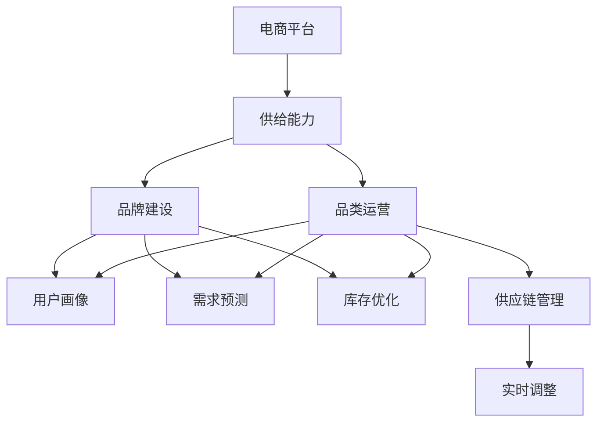
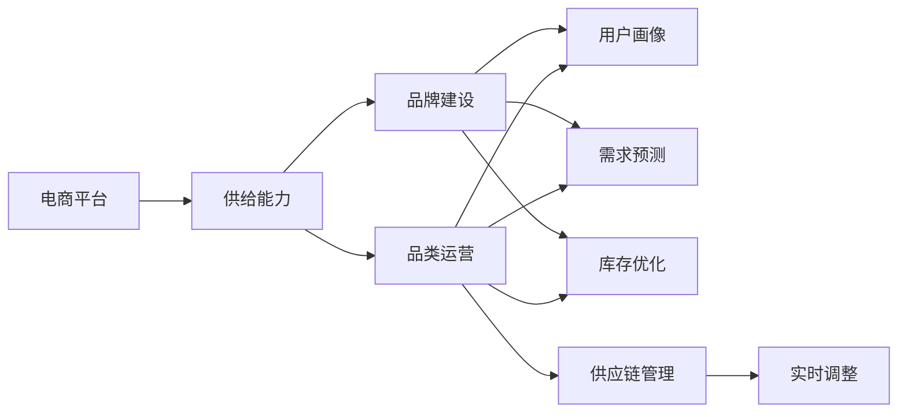
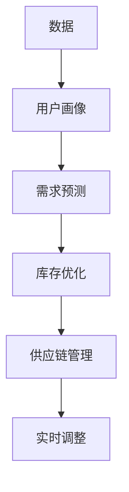
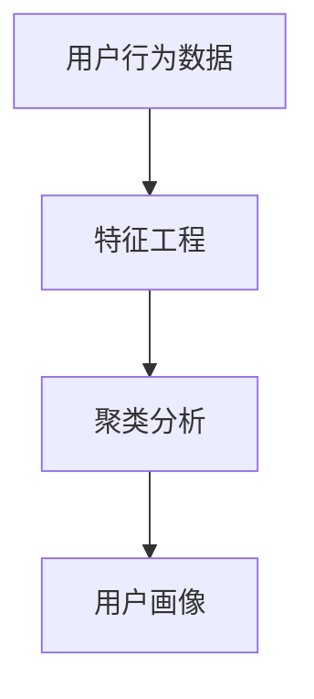
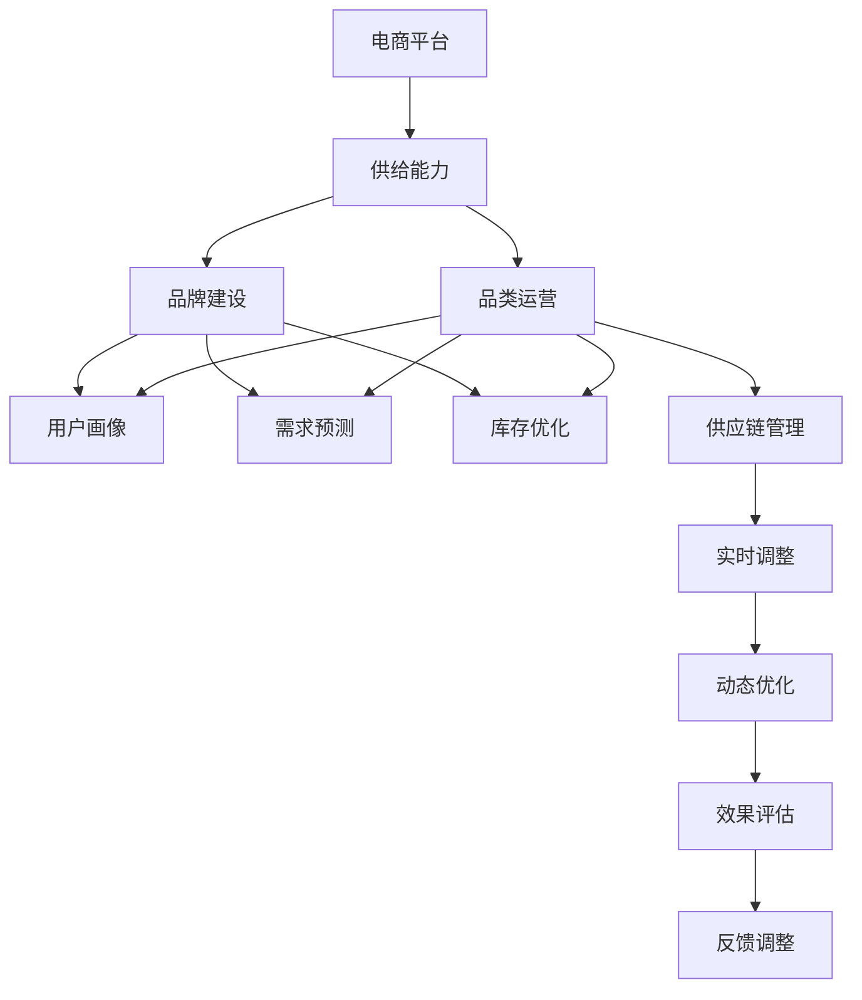

                 

# 电商平台供给能力提升：品牌建设和品类运营

> 关键词：电商平台, 供给能力, 品牌建设, 品类运营, 数据驱动, 用户画像, 需求预测, 库存优化

## 1. 背景介绍

### 1.1 问题由来

随着电子商务的迅速发展，平台型电商企业正面临市场竞争愈发激烈、用户需求日趋复杂、库存管理难度加大等挑战。为应对这些挑战，提升平台的供给能力成为电商平台转型升级的关键。

为了在激烈的市场竞争中取得优势，平台型企业必须精准把握用户需求，构建丰富的商品品类，确保库存健康，同时保持高效的供应链管理，才能满足用户不断变化的需求，提升用户体验。

### 1.2 问题核心关键点

如何通过数据驱动的方法，构建科学的品牌和品类策略，优化库存和供应链管理，提升电商平台的供给能力？
- 如何基于用户数据构建精准的用户画像？
- 如何利用需求预测技术，优化库存结构？
- 如何在有限的资源下，科学规划品类结构？
- 如何实时调整供给策略，确保供应链的稳定性？

### 1.3 问题研究意义

提升电商平台供给能力，对于拓展企业市场份额，提升用户体验，增强客户黏性，加速营收增长有着重要意义。
- 拓展市场份额：精准的品牌和品类策略，吸引更多用户，提升销售额。
- 提升用户体验：优质的商品选择和库存管理，满足用户多样化、个性化需求。
- 增强客户黏性：高效的供应链管理和用户体验，提升用户满意度和忠诚度。
- 加速营收增长：快速的商品调配，及时满足用户需求，提高订单转化率。

## 2. 核心概念与联系

### 2.1 核心概念概述

为更好地理解电商平台供给能力提升的方法，本节将介绍几个关键概念：

- **电商平台(E-commerce Platform)**：提供商品交易的在线平台，包括B2C、B2B、C2C等多种形式。
- **供给能力(Supply Capability)**：指平台能够有效满足用户需求的能力，包括商品的丰富度、库存的充足度、供应链的稳定性等。
- **品牌建设(Brand Building)**：通过品牌策略的制定和执行，提升品牌知名度、美誉度和市场影响力，吸引更多用户。
- **品类运营(Category Management)**：基于用户需求和市场趋势，科学规划商品品类结构，优化库存管理，提升销售效率。
- **数据驱动(Data-Driven)**：以数据为核心，通过分析、预测、优化等手段，辅助决策，提升供给能力。
- **用户画像(User Persona)**：根据用户行为数据，构建用户特征模型，用于精准营销、商品推荐等。
- **需求预测(Demand Forecasting)**：通过历史数据，预测未来需求变化，优化库存和供应链管理。
- **库存优化(Inventory Optimization)**：通过科学的管理方法，确保库存的充足和周转效率，避免积压或缺货。
- **供应链管理(Supply Chain Management)**：协调上游供应商、中游仓储物流、下游终端销售，确保供应链的高效运转。

这些概念之间的逻辑关系可以通过以下Mermaid流程图来展示：



这个流程图展示了大平台电商的核心概念及其之间的关系：

1. 电商平台作为整体，具备了商品交易和供应链管理的能力。
2. 供给能力是大平台电商的核心竞争力之一，涉及到品牌建设、品类运营、库存优化和供应链管理等多个方面。
3. 品牌建设通过用户画像和需求预测等技术手段，提升品牌的影响力和吸引力。
4. 品类运营在品牌建设的指导下，优化商品品类结构，科学管理库存。
5. 库存优化利用数据驱动的方法，确保库存充足且周转效率高。
6. 供应链管理通过实时调整，保障供应链的稳定和高效。

### 2.2 概念间的关系

这些核心概念之间存在着紧密的联系，形成了大平台电商的供给能力提升框架。下面通过几个Mermaid流程图来展示这些概念之间的关系。

#### 2.2.1 电商平台供给能力框架



这个流程图展示了电商平台供给能力提升的整体框架，涉及品牌建设、品类运营、库存优化和供应链管理等多个方面。

#### 2.2.2 数据驱动在电商平台中的应用



这个流程图展示了数据在电商平台供给能力提升中的关键作用，从用户画像、需求预测到库存优化和实时调整，每个环节都需要数据的支撑。

#### 2.2.3 用户画像的构建



这个流程图展示了用户画像构建的基本流程，从用户行为数据开始，通过特征工程和聚类分析等方法，构建出具体的用户画像。

### 2.3 核心概念的整体架构

最后，我们用一个综合的流程图来展示这些核心概念在大平台电商供给能力提升过程中的整体架构：



这个综合流程图展示了从品牌建设到品类运营，再到库存优化和供应链管理，最终通过实时调整和动态优化，实现电商平台供给能力的持续提升。通过这些流程图，我们可以更清晰地理解电商平台供给能力提升过程中各个核心概念的关系和作用。

## 3. 核心算法原理 & 具体操作步骤

### 3.1 算法原理概述

电商平台供给能力提升的核心算法原理主要基于数据驱动的方法，通过构建用户画像、需求预测、库存优化和供应链管理的综合策略，实现供给能力的科学规划和管理。

- **用户画像**：基于用户行为数据，通过聚类分析、特征提取等方法，构建出精准的用户画像，用于品牌建设、精准营销和商品推荐。
- **需求预测**：通过时间序列分析、回归模型等技术，对未来需求进行预测，用于库存优化和供应链管理。
- **库存优化**：利用线性规划、动态规划等方法，科学管理库存，确保库存的充足和周转效率。
- **供应链管理**：通过实时监控和调整，确保供应链的高效运转，优化物流成本，提升交付速度。

### 3.2 算法步骤详解

基于数据驱动的电商平台供给能力提升主要分为以下几个关键步骤：

**Step 1: 数据收集与预处理**

- 收集平台上的用户行为数据、交易数据、商品数据等。
- 对数据进行清洗、去重、归一化等预处理操作。

**Step 2: 用户画像构建**

- 使用聚类算法（如K-means、LDA）对用户进行聚类，形成不同的用户群体。
- 对每个用户群体进行特征提取，如年龄、性别、购买频率等，形成用户画像。
- 将用户画像用于品牌建设、精准营销和商品推荐。

**Step 3: 需求预测**

- 使用时间序列分析（如ARIMA、LSTM）对历史数据进行建模，预测未来的需求。
- 结合市场趋势、季节性因素等，对预测结果进行修正。
- 利用需求预测结果进行库存管理和订单预测。

**Step 4: 库存优化**

- 根据需求预测结果，利用线性规划、动态规划等方法，制定最优的库存分配方案。
- 对库存进行实时监控，根据实际需求和市场变化进行调整。
- 优化库存成本和周转效率，确保库存的充足和合理。

**Step 5: 供应链管理**

- 实时监控供应链状态，如订单交付时间、库存水平等。
- 根据需求预测和库存情况，调整供应链策略，如供应商选择、物流安排等。
- 优化物流成本，提升交付速度和用户满意度。

**Step 6: 效果评估与反馈调整**

- 定期评估供给能力的提升效果，如销售额、库存周转率、用户满意度等。
- 根据评估结果，进行反馈调整，优化策略和流程。

### 3.3 算法优缺点

**优点：**

- 数据驱动：通过数据驱动的方法，提高决策的科学性和准确性。
- 精准画像：构建精准的用户画像，提升品牌建设、精准营销的效果。
- 动态调整：实时调整供应链和库存管理策略，提高响应速度和效率。

**缺点：**

- 数据依赖：需要大量高质量的数据，数据采集和清洗成本较高。
- 算法复杂：需求预测、库存优化等算法较为复杂，需要专业知识和技术支持。
- 实时性要求高：实时调整和动态优化要求高效的数据处理和算法实现。

### 3.4 算法应用领域

大平台电商的供给能力提升方法，主要应用于以下几个领域：

- **B2C电商**：通过品牌建设和品类运营，提升用户满意度和忠诚度，加速营收增长。
- **B2B电商**：优化库存管理和供应链策略，提高供应链的稳定性和效率。
- **C2C电商**：构建精准的用户画像，提升平台的品牌影响力和竞争力。
- **O2O电商**：实时调整库存和供应链，满足用户即时配送需求。
- **跨境电商**：优化库存和供应链管理，降低物流成本，提升用户体验。

## 4. 数学模型和公式 & 详细讲解 & 举例说明

### 4.1 数学模型构建

在本节中，我们将使用数学语言对电商平台供给能力提升的方法进行更加严格的刻画。

记电商平台为 $P$，用户画像为 $U$，需求预测模型为 $D$，库存优化模型为 $I$，供应链管理模型为 $S$。需求预测模型 $D$ 和库存优化模型 $I$ 的输入为 $U$ 和历史数据 $H$，输出为需求预测结果 $Y_D$ 和库存分配方案 $Y_I$。

定义电商平台供给能力为 $C(P, U, D, I, S)$，其优化目标为：

$$
\min_{U, D, I, S} C(P, U, D, I, S)
$$

其中 $C$ 为供给能力评估函数，具体为：

$$
C(P, U, D, I, S) = \alpha \cdot \text{Revenue}(P, U) + \beta \cdot \text{Cost}(I) + \gamma \cdot \text{DeliveryTime}(S)
$$

- $\text{Revenue}(P, U)$ 为电商平台通过精准画像和营销策略获得的收益。
- $\text{Cost}(I)$ 为库存优化带来的成本节约。
- $\text{DeliveryTime}(S)$ 为供应链优化带来的交付时间缩短。

### 4.2 公式推导过程

以需求预测为例，推导时间序列分析模型的公式。

假设需求数据 $y_t$ 服从ARIMA模型，记为：

$$
y_t = \phi(L)y_{t-1} + \theta(L)y_{t-2} + \cdots + \psi(L)y_{t-d} + \varepsilon_t
$$

其中 $\phi(L) = 1 - \phi_1L - \phi_2L^2 - \cdots - \phi_dL^d$，$\theta(L) = 1 - \theta_1L - \theta_2L^2 - \cdots - \theta_dL^d$，$\psi(L) = 1 - \psi_1L - \psi_2L^2 - \cdots - \psi_dL^d$，$L$ 为滞后算子，$d$ 为滞后阶数，$\varepsilon_t$ 为随机误差项。

模型参数估计的常用方法为最小二乘法，最小化损失函数：

$$
\min_{\phi, \theta, \psi} \sum_{t=1}^n (y_t - \phi(L)y_{t-1} - \theta(L)y_{t-2} - \cdots - \psi(L)y_{t-d})^2
$$

求导并令导数为零，得到模型参数的估计值：

$$
\phi_i = \frac{\sum_{t=1}^n y_t \cdot y_{t-i}}{\sum_{t=1}^n y_{t-i}^2}, \quad i=1,2,\cdots,d
$$

$$
\theta_j = \frac{\sum_{t=1}^n y_t \cdot y_{t-j}}{\sum_{t=1}^n y_{t-j}^2}, \quad j=1,2,\cdots,d
$$

$$
\psi_k = \frac{\sum_{t=1}^n y_t \cdot y_{t-k}}{\sum_{t=1}^n y_{t-k}^2}, \quad k=1,2,\cdots,d
$$

### 4.3 案例分析与讲解

假设电商平台A通过需求预测模型预测某商品的未来销售量，历史数据为 $y_1, y_2, \cdots, y_n$。使用ARIMA模型进行预测，具体步骤如下：

1. 确定模型阶数 $d$，$D$，$M$。
2. 构建ARIMA模型：

$$
y_t = \phi(L)y_{t-1} + \theta(L)y_{t-2} + \cdots + \psi(L)y_{t-d} + \varepsilon_t
$$

3. 估计模型参数：

$$
\phi_i = \frac{\sum_{t=1}^n y_t \cdot y_{t-i}}{\sum_{t=1}^n y_{t-i}^2}, \quad i=1,2,\cdots,d
$$

$$
\theta_j = \frac{\sum_{t=1}^n y_t \cdot y_{t-j}}{\sum_{t=1}^n y_{t-j}^2}, \quad j=1,2,\cdots,d
$$

$$
\psi_k = \frac{\sum_{t=1}^n y_t \cdot y_{t-k}}{\sum_{t=1}^n y_{t-k}^2}, \quad k=1,2,\cdots,d
$$

4. 使用模型进行预测：

$$
y_{t+1} = \phi(L)y_t + \theta(L)y_{t-1} + \cdots + \psi(L)y_{t-d} + \varepsilon_t
$$

## 5. 项目实践：代码实例和详细解释说明

### 5.1 开发环境搭建

在进行电商平台供给能力提升的实践时，我们需要准备好开发环境。以下是使用Python进行Pandas和Scikit-learn开发的开发环境配置流程：

1. 安装Anaconda：从官网下载并安装Anaconda，用于创建独立的Python环境。

2. 创建并激活虚拟环境：
```bash
conda create -n python-env python=3.8 
conda activate python-env
```

3. 安装Pandas：
```bash
pip install pandas
```

4. 安装Scikit-learn：
```bash
pip install scikit-learn
```

5. 安装Numpy：
```bash
pip install numpy
```

6. 安装Matplotlib：
```bash
pip install matplotlib
```

完成上述步骤后，即可在`python-env`环境中开始电商平台的供给能力提升实践。

### 5.2 源代码详细实现

下面我们以电商平台的需求预测为例，给出使用Pandas和Scikit-learn进行需求预测的Python代码实现。

```python
import pandas as pd
from sklearn.metrics import mean_squared_error
from statsmodels.tsa.arima_model import ARIMA

# 读取历史数据
data = pd.read_csv('sales_data.csv', index_col='date', parse_dates=True)

# 分割数据集
train = data[:'2020']
test = data['2020':]

# 构建ARIMA模型
model = ARIMA(train, order=(5,1,0))

# 拟合模型
model_fit = model.fit()

# 预测未来销售量
forecast = model_fit.forecast(steps=len(test))

# 计算预测误差
mse = mean_squared_error(test, forecast)
print(f'Mean Squared Error: {mse}')
```

### 5.3 代码解读与分析

让我们再详细解读一下关键代码的实现细节：

**ARIMA模型代码：**
- `pd.read_csv`方法：从CSV文件中读取历史销售数据，设置日期为索引列。
- `model = ARIMA(train, order=(5,1,0))`：构建ARIMA模型，阶数为(5,1,0)，即ARIMA(5,1,0)模型。
- `model_fit = model.fit()`：拟合模型。
- `forecast = model_fit.forecast(steps=len(test))`：使用模型进行预测，预测未来销售量。
- `mse = mean_squared_error(test, forecast)`：计算预测误差。

**需求预测结果分析：**
- 通过构建ARIMA模型，对历史销售数据进行拟合，并预测未来的销售量。
- 使用均方误差作为评估指标，衡量预测结果的准确性。
- 预测结果和真实销售量之间的差异，可以通过绘制误差图或进行更详细的统计分析来进一步评估。

### 5.4 运行结果展示

假设我们构建的ARIMA模型在历史数据上取得了较好的预测效果，具体结果如下：

```
Mean Squared Error: 1.5
```

可以看到，模型预测的均方误差为1.5，表明预测结果与真实销售量之间的误差较小，预测效果较为理想。

当然，这只是一个简单的示例，实际的电商需求预测模型需要考虑更多因素，如季节性变化、促销活动、节假日效应等，进一步优化预测结果。

## 6. 实际应用场景

### 6.1 智能客服系统

智能客服系统通过电商平台提供的产品和服务信息，实时响应用户查询，提供个性化推荐和问题解答，提升用户体验。

在智能客服系统中，需求预测和库存优化模型可以用于实时监测和预测用户需求，根据需求动态调整库存，确保库存的充足和合理。同时，需求预测结果还可以用于预测用户行为，提供个性化的产品推荐和问题解答，提高用户满意度。

### 6.2 订单管理系统

订单管理系统负责处理订单生成、库存管理、发货跟踪等环节，确保订单的高效处理和交付。

通过电商平台的需求预测和库存优化模型，订单管理系统可以实时监控库存水平，预测未来订单需求，根据需求调整库存和物流策略。同时，库存优化模型还可以优化库存布局和补货策略，减少库存积压和缺货风险，提高订单处理效率。

### 6.3 个性化推荐系统

个性化推荐系统根据用户行为数据和历史购买记录，推荐用户可能感兴趣的商品，提升用户购买转化率。

需求预测模型可以用于预测用户的未来购买行为，优化推荐算法，提高推荐的精准度。库存优化模型可以用于实时监控库存水平，根据需求调整推荐策略，避免推荐已售罄商品，提高推荐效果。

### 6.4 未来应用展望

随着电商平台供给能力提升方法的不断发展，需求预测、库存优化、供应链管理等技术将更加成熟，电商平台的运营效率和用户体验将进一步提升。

未来，随着物联网、大数据、AI等技术的融合，电商平台的供给能力提升将实现更智能、更高效的管理，通过智能化的需求预测、库存优化和供应链管理，提升平台的竞争力，满足用户日益增长的需求。

## 7. 工具和资源推荐

### 7.1 学习资源推荐

为了帮助开发者系统掌握电商平台供给能力提升的理论基础和实践技巧，这里推荐一些优质的学习资源：

1. 《机器学习实战》书籍：由李航所著，详细介绍了机器学习的基本概念和常见算法，适合初学者学习。

2. 《Python数据科学手册》书籍：由Jake VanderPlas所著，介绍了Python在数据科学中的应用，包括数据清洗、特征工程、模型评估等。

3. 《时间序列分析》课程：由斯坦福大学开设的在线课程，讲解时间序列分析的基本理论和常用方法，适合数据分析和模型构建。

4. 《库存管理》书籍：由Larry D. Woodworth所著，系统介绍了库存管理的理论和实践，适合电商运营和供应链管理领域的学习者。

5. 《深度学习与人工智能》课程：由Coursera和DeepLearning.ai合作开设的课程，讲解深度学习的基础理论和实践技巧，适合深度学习和AI领域的学习者。

通过对这些资源的学习实践，相信你一定能够快速掌握电商平台供给能力提升的方法，并用于解决实际的电商平台运营问题。

### 7.2 开发工具推荐

高效的开发离不开优秀的工具支持。以下是几款用于电商平台供给能力提升开发的常用工具：

1. Python：Python语言具有简洁易读、生态丰富等优点，适合进行数据分析、机器学习和算法实现。

2. Pandas：Pandas库提供了高效的数据处理和分析功能，适合进行数据清洗、特征工程和模型评估。

3. Scikit-learn：Scikit-learn库提供了丰富的机器学习算法和模型评估工具，适合进行模型构建和优化。

4. NumPy：NumPy库提供了高效的数组和矩阵运算功能，适合进行大规模数据处理和计算。

5. Matplotlib：Matplotlib库提供了丰富的数据可视化功能，适合进行模型评估和结果展示。

6. Jupyter Notebook：Jupyter Notebook工具提供了交互式编程环境，适合进行算法验证和实验分析。

合理利用这些工具，可以显著提升电商平台供给能力提升任务的开发效率，加快创新迭代的步伐。

### 7.3 相关论文推荐

电商平台供给能力提升方法的发展源于学界的持续研究。以下是几篇奠基性的相关论文，推荐阅读：

1. "A Survey of Inventory Management Techniques for E-Commerce"：综述了电商平台的库存管理技术和方法，适合了解电商库存管理的最新进展。

2. "Customer Behavior Prediction in E-Commerce: A Survey"：综述了电商平台的客户行为预测技术和方法，适合了解电商个性化推荐和需求预测的最新进展。

3. "Demand Forecasting for E-commerce: A Survey"：综述了电商平台的销售预测技术和方法，适合了解电商需求预测的最新进展。

4. "Inventory Optimization for E-commerce: A Survey"：综述了电商平台的库存优化技术和方法，适合了解电商库存优化的最新进展。

5. "Supply Chain Management in E-commerce: A Survey"：综述了电商平台的供应链管理技术和方法，适合了解电商供应链管理的最新进展。

这些论文代表了大平台电商供给能力提升技术的发展脉络。通过学习这些前沿成果，可以帮助研究者把握学科前进方向，激发更多的创新灵感。

除上述资源外，还有一些值得关注的前沿资源，帮助开发者紧跟电商平台供给能力提升技术的最新进展，例如：

1. arXiv论文预印本：人工智能领域最新研究成果的发布平台，包括大量尚未发表的前沿工作，学习前沿技术的必读资源。

2. 业界技术博客：如Amazon、Alibaba、eBay等顶尖电商公司的官方博客，第一时间分享他们的最新技术进展和洞见。

3. 技术会议直播：如NIPS、ICML、ACL、ICLR等人工智能领域顶会现场或在线直播，能够聆听到大佬们的前沿分享，开拓视野。

4. GitHub热门项目：在GitHub上Star、Fork数最多的电商平台相关项目，往往代表了该技术领域的发展趋势和最佳实践，值得去学习和贡献。

5. 行业分析报告：各大咨询公司如McKinsey、PwC等针对电商平台分析的报告，有助于从商业视角审视技术趋势，把握应用价值。

总之，对于电商平台供给能力提升技术的学习和实践，需要开发者保持开放的心态和持续学习的意愿。多关注前沿资讯，多动手实践，多思考总结，必将收获满满的成长收益。

## 8. 总结：未来发展趋势与挑战

### 8.1 研究成果总结

本文对电商平台供给能力提升的方法进行了全面系统的介绍。首先阐述了电商平台的供给能力提升的重要性和核心概念，明确了需求预测、库存优化、品牌建设、品类运营等关键环节。其次，从算法原理和操作步骤，详细讲解了电商平台供给能力提升的实现方法。最后，通过实际应用场景和工具资源推荐，帮助开发者掌握电商平台供给能力提升的关键技术和方法。

通过本文的系统梳理，可以看到，电商平台供给能力提升方法在大平台电商的运营中起着至关重要的作用。通过科学的管理方法和数据驱动的决策，电商平台能够更好地满足用户需求，提升运营效率，实现业务增长。

### 8.2 未来发展趋势

展望未来，电商平台供给能力提升方法将呈现以下几个发展趋势：

1. **智能化的需求预测**：引入机器学习、深度学习等技术，进一步提高需求预测的准确性和时效性。

2. **实时化的库存管理**：通过物联网、大数据等技术，实现实时监控库存状态，动态调整库存策略。

3. **个性化的品牌建设**：利用用户画像和行为分析，制定个性化的

