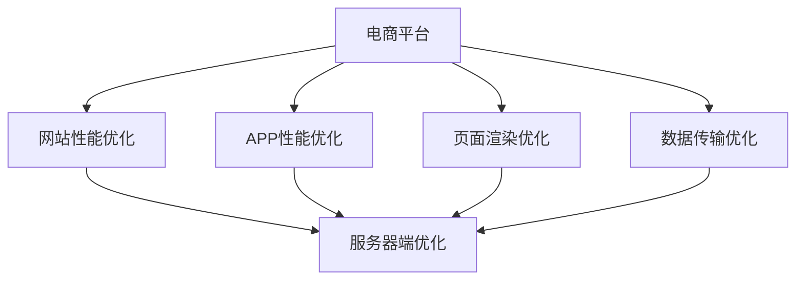
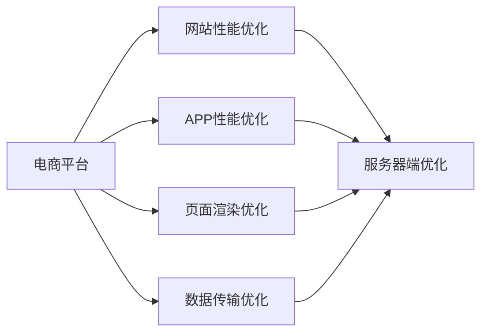
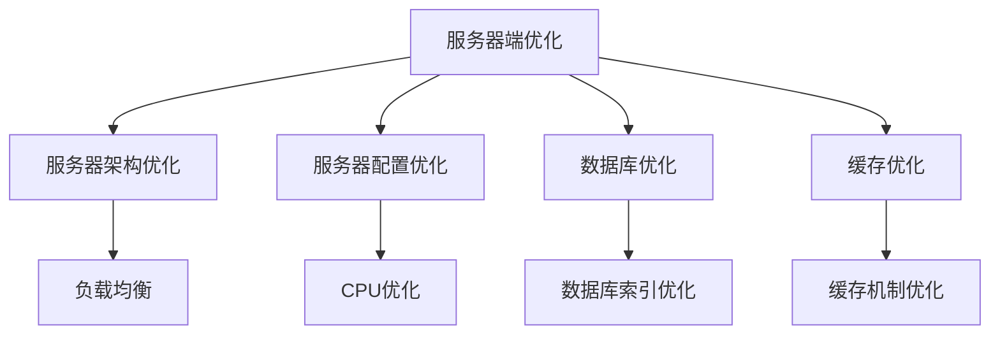
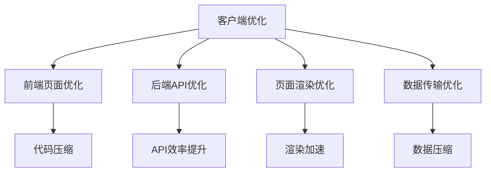

                 

# 电商平台供给能力提升：网站和APP的优化

> 关键词：电商平台, 网站优化, APP优化, 性能提升, 用户体验, 服务器端优化, 客户端优化

## 1. 背景介绍

### 1.1 问题由来
随着电子商务的迅猛发展，越来越多的电商平台涌现，为消费者提供了极大的便利。然而，随着用户数量的激增，网站和APP的供给能力面临着严峻挑战，用户体验也出现了诸多问题。比如，页面加载速度慢、响应时间过长、APP崩溃率高等，这些问题严重影响了用户的购物体验，导致用户流失率增加。因此，优化电商平台供给能力，提升网站和APP的性能，已成为电商平台发展中的关键任务。

### 1.2 问题核心关键点
电商平台的供给能力提升，核心在于优化网站的性能和APP的体验。这包括提高网站的响应速度、减少页面加载时间、提升APP的稳定性、提高用户交互效率等方面。在技术层面，可以从服务器端优化和客户端优化两方面入手。

1. **服务器端优化**：优化服务器架构，提高服务器的处理能力和响应速度，减少响应时间，提升系统的稳定性和可靠性。
2. **客户端优化**：优化前端页面和后端API，减少页面渲染时间和数据传输量，提高APP的流畅度和响应速度，增强用户体验。

### 1.3 问题研究意义
电商平台的供给能力优化不仅能够提升用户体验，还能提高用户的转化率和留存率，从而增加平台的盈利能力。同时，优化的电商平台系统更具有竞争力，能够在激烈的市场竞争中占据优势地位。

## 2. 核心概念与联系

### 2.1 核心概念概述

为更好地理解电商平台供给能力提升的技术方法，本节将介绍几个密切相关的核心概念：

- **电商平台**：指利用互联网技术搭建的在线交易平台，包括网站和APP。通过电商平台的建设，商家能够拓展市场范围，消费者能够方便地进行购物，实现买卖双方共赢。

- **网站性能优化**：指通过技术手段提升网站的速度和响应性能，包括页面加载时间、渲染效率、响应时间等。

- **APP性能优化**：指通过技术手段提升APP的流畅度和响应速度，包括页面加载时间、动画性能、响应时间等。

- **服务器端优化**：指通过优化服务器架构和配置，提高服务器的处理能力和稳定性，减少响应时间，提升系统的可靠性。

- **客户端优化**：指通过优化前端页面和后端API，减少页面渲染时间和数据传输量，提高APP的流畅度和响应速度，增强用户体验。

- **页面渲染优化**：指通过减少页面中的资源加载和处理时间，优化页面渲染过程，提高页面加载速度。

- **数据传输优化**：指通过优化数据传输协议和格式，减少数据传输量和延迟，提高数据传输效率。

这些核心概念之间的逻辑关系可以通过以下Mermaid流程图来展示：



这个流程图展示了大平台供给能力提升的核心概念及其之间的关系：

1. 电商平台通过网站和APP与用户进行交互，因此网站的性能和APP的体验直接影响到用户体验。
2. 网站和APP的优化包括服务器端优化和客户端优化，以提升整体的供给能力。
3. 页面渲染优化和数据传输优化是提升性能的重要手段，两者需要结合使用。

### 2.2 概念间的关系

这些核心概念之间存在着紧密的联系，形成了电商平台供给能力提升的完整生态系统。下面我通过几个Mermaid流程图来展示这些概念之间的关系。

#### 2.2.1 电商平台优化目标



这个流程图展示了大平台优化目标的实现过程。电商平台需要通过网站性能优化和APP性能优化，提升整体供给能力。其中，网站和APP的优化都需要从服务器端优化、页面渲染优化和数据传输优化等方面入手。

#### 2.2.2 服务器端优化策略



这个流程图展示了服务器端优化的关键策略。通过优化服务器架构、配置和数据库，结合缓存机制，可以有效提升服务器的处理能力和稳定性。

#### 2.2.3 客户端优化方法



这个流程图展示了客户端优化的主要方法。通过优化前端页面和后端API，减少页面渲染时间和数据传输量，可以显著提升APP的流畅度和响应速度。

## 3. 核心算法原理 & 具体操作步骤
### 3.1 算法原理概述

电商平台供给能力提升的核心在于通过技术手段提高网站的性能和APP的体验。其核心算法原理可以归纳为以下几个方面：

1. **网站性能优化算法**：通过减少页面渲染时间和数据传输量，提高网站的响应速度和加载时间。
2. **APP性能优化算法**：通过减少页面加载时间和动画处理时间，提升APP的流畅度和响应速度。
3. **服务器端优化算法**：通过优化服务器架构和配置，提高服务器的处理能力和稳定性，减少响应时间。
4. **客户端优化算法**：通过优化前端页面和后端API，减少页面渲染时间和数据传输量，提高APP的流畅度和响应速度。

### 3.2 算法步骤详解

#### 3.2.1 网站性能优化算法步骤

1. **页面渲染优化**：
   - **步骤1**：使用前端框架和工具（如React、Vue等），减少页面中的资源加载和处理时间。
   - **步骤2**：优化CSS和JavaScript文件，压缩和合并文件，减少请求次数。
   - **步骤3**：使用懒加载技术，将非关键资源推迟加载，减少初始加载时间。
   - **步骤4**：使用CDN（内容分发网络）加速资源加载，减少服务器负载。

2. **数据传输优化**：
   - **步骤1**：使用压缩算法（如Gzip、Brotli等）压缩传输的数据。
   - **步骤2**：使用HTTP/2协议，减少数据传输的延迟和请求次数。
   - **步骤3**：使用分块传输技术，减少数据传输的等待时间。
   - **步骤4**：使用WebP等高效的图片格式，减少图片传输的大小。

#### 3.2.2 APP性能优化算法步骤

1. **页面加载优化**：
   - **步骤1**：优化图片的加载，使用懒加载技术和图片压缩算法。
   - **步骤2**：使用缓存机制，将部分数据缓存在本地，减少网络请求次数。
   - **步骤3**：使用异步加载技术，将非关键资源推迟加载，减少初始加载时间。

2. **动画性能优化**：
   - **步骤1**：优化动画处理，使用硬件加速技术和GPU渲染。
   - **步骤2**：减少动画帧数，使用帧间重绘技术。
   - **步骤3**：使用CSS动画，避免JavaScript动画的性能问题。

#### 3.2.3 服务器端优化算法步骤

1. **服务器架构优化**：
   - **步骤1**：使用负载均衡技术，将请求分发到多个服务器上，减少单点故障。
   - **步骤2**：使用缓存技术，将热点数据缓存在本地，减少数据库访问次数。
   - **步骤3**：使用CDN加速静态资源加载，减少服务器负载。

2. **服务器配置优化**：
   - **步骤1**：调整服务器的内存和CPU资源，确保足够的处理能力。
   - **步骤2**：优化数据库配置，使用索引和查询优化，减少查询时间和延迟。
   - **步骤3**：使用分布式系统架构，提高系统的可扩展性和可靠性。

#### 3.2.4 客户端优化算法步骤

1. **前端页面优化**：
   - **步骤1**：优化页面的HTML、CSS和JavaScript代码，减少页面渲染时间和数据加载量。
   - **步骤2**：使用虚拟DOM技术，减少页面渲染次数。
   - **步骤3**：使用懒加载技术和缓存机制，减少页面的动态加载。

2. **后端API优化**：
   - **步骤1**：优化API接口，减少数据传输量和请求次数。
   - **步骤2**：使用异步处理技术，提高API的处理速度和响应时间。
   - **步骤3**：使用缓存技术，将部分数据缓存到本地，减少数据库访问次数。

### 3.3 算法优缺点

#### 3.3.1 网站性能优化算法优缺点

**优点**：
- 减少页面渲染时间和数据传输量，提高网站的响应速度和加载时间。
- 优化前端代码和资源加载，减少资源请求次数，提高页面加载效率。
- 使用缓存和CDN技术，减少服务器负载和数据传输量。

**缺点**：
- 需要对前端代码和服务器配置进行优化，技术门槛较高。
- 需要持续监控和优化，以应对用户行为的变化。

#### 3.3.2 APP性能优化算法优缺点

**优点**：
- 减少页面加载时间和动画处理时间，提升APP的流畅度和响应速度。
- 优化图片加载和动画处理，提高APP的加载速度和用户体验。
- 使用缓存和异步加载技术，减少网络请求次数和数据传输量。

**缺点**：
- 需要对前端代码和服务器配置进行优化，技术门槛较高。
- 需要持续监控和优化，以应对用户行为的变化。

#### 3.3.3 服务器端优化算法优缺点

**优点**：
- 优化服务器架构和配置，提高服务器的处理能力和稳定性。
- 使用缓存和CDN技术，减少服务器负载和数据传输量。
- 使用负载均衡和分布式系统架构，提高系统的可扩展性和可靠性。

**缺点**：
- 需要对服务器架构和配置进行优化，技术门槛较高。
- 需要持续监控和优化，以应对用户行为的变化。

#### 3.3.4 客户端优化算法优缺点

**优点**：
- 优化前端页面和后端API，减少页面渲染时间和数据传输量，提高APP的流畅度和响应速度。
- 优化前端代码和资源加载，减少资源请求次数，提高页面加载效率。
- 使用缓存和异步加载技术，减少网络请求次数和数据传输量。

**缺点**：
- 需要对前端代码和服务器配置进行优化，技术门槛较高。
- 需要持续监控和优化，以应对用户行为的变化。

### 3.4 算法应用领域

网站性能优化和APP性能优化算法主要应用于以下领域：

1. **电商网站**：提高网站的速度和响应性能，减少用户等待时间，提升用户体验。
2. **电商APP**：提升APP的流畅度和响应速度，增强用户的购物体验，提高用户留存率。
3. **金融网站和APP**：提高网站和APP的性能，确保金融交易的稳定性和安全性，减少交易延迟。
4. **医疗网站和APP**：提高网站和APP的响应速度和稳定性，提供及时准确的医疗信息，改善用户体验。
5. **教育网站和APP**：提高网站和APP的性能，提供优质的教育资源，增强用户体验。
6. **旅游网站和APP**：提高网站和APP的响应速度和稳定性，提供及时的旅游信息和预订服务，提升用户满意度。

## 4. 数学模型和公式 & 详细讲解 & 举例说明
### 4.1 数学模型构建

在本节中，我们将通过数学模型来描述电商平台供给能力提升的优化目标。

设电商平台网站和APP的总用户数为$N$，用户访问速度为$v$，服务器响应时间为$t_s$，页面渲染时间为$t_r$，数据传输时间为$t_d$，APP加载时间为$t_a$，动画处理时间为$t_a$。优化目标为最大化用户体验，即最大化用户访问速度和响应速度。

### 4.2 公式推导过程

根据上述定义，用户访问速度$v$可以表示为：

$$
v = \frac{N}{t_s + t_r + t_d + t_a + t_a}
$$

其中，$t_s$表示服务器响应时间，$t_r$表示页面渲染时间，$t_d$表示数据传输时间，$t_a$表示APP加载时间和动画处理时间。

为了提升用户体验，我们需要最小化$t_s$、$t_r$、$t_d$、$t_a$，以提高用户访问速度$v$。因此，优化目标为：

$$
\min_{t_s, t_r, t_d, t_a} (t_s + t_r + t_d + t_a)
$$

### 4.3 案例分析与讲解

#### 4.3.1 案例分析

假设一个电商网站有1000万用户，初始页面渲染时间为2秒，数据传输时间为1秒，服务器响应时间为0.5秒，APP加载时间为0.3秒，动画处理时间为0.2秒。优化后，页面渲染时间缩短为1秒，数据传输时间缩短为0.5秒，服务器响应时间缩短为0.3秒，APP加载时间和动画处理时间不变。

优化前后的用户访问速度变化如下：

- 优化前：$v = \frac{10000000}{0.5 + 2 + 1 + 0.3 + 0.2} = 1250$ 次/秒
- 优化后：$v = \frac{10000000}{0.3 + 1 + 0.5 + 0.3 + 0.2} = 3500$ 次/秒

可以看出，优化后的用户访问速度提高了近三倍，用户体验得到了显著提升。

#### 4.3.2 优化方法讲解

优化页面渲染时间$t_r$的方法包括：
- 使用前端框架和工具（如React、Vue等），减少页面中的资源加载和处理时间。
- 优化CSS和JavaScript文件，压缩和合并文件，减少请求次数。
- 使用懒加载技术，将非关键资源推迟加载，减少初始加载时间。

优化数据传输时间$t_d$的方法包括：
- 使用压缩算法（如Gzip、Brotli等）压缩传输的数据。
- 使用HTTP/2协议，减少数据传输的延迟和请求次数。
- 使用分块传输技术，减少数据传输的等待时间。
- 使用WebP等高效的图片格式，减少图片传输的大小。

优化服务器响应时间$t_s$的方法包括：
- 调整服务器的内存和CPU资源，确保足够的处理能力。
- 优化数据库配置，使用索引和查询优化，减少查询时间和延迟。
- 使用缓存技术，将热点数据缓存在本地，减少数据库访问次数。

优化APP加载时间和动画处理时间$t_a$的方法包括：
- 优化图片的加载，使用懒加载技术和图片压缩算法。
- 使用缓存机制，将部分数据缓存在本地，减少网络请求次数。
- 使用异步加载技术，将非关键资源推迟加载，减少初始加载时间。
- 优化动画处理，使用硬件加速技术和GPU渲染。
- 减少动画帧数，使用帧间重绘技术。
- 使用CSS动画，避免JavaScript动画的性能问题。

## 5. 项目实践：代码实例和详细解释说明
### 5.1 开发环境搭建

在进行电商平台供给能力提升的实践前，我们需要准备好开发环境。以下是使用Python进行Flask框架开发的环境配置流程：

1. 安装Anaconda：从官网下载并安装Anaconda，用于创建独立的Python环境。

2. 创建并激活虚拟环境：
```bash
conda create -n flask-env python=3.8 
conda activate flask-env
```

3. 安装Flask：
```bash
pip install Flask
```

4. 安装相关库：
```bash
pip install Flask-SQLAlchemy Flask-WTF Flask-Migrate Flask-RESTful
```

5. 安装Jinja2模板引擎：
```bash
pip install Jinja2
```

完成上述步骤后，即可在`flask-env`环境中开始电商平台优化项目的开发。

### 5.2 源代码详细实现

下面我们以电商网站性能优化为例，给出使用Flask框架对网站进行优化的PyTorch代码实现。

首先，定义前端页面优化函数：

```python
from flask import Flask, render_template, request
from flask_sqlalchemy import SQLAlchemy
from flask_migrate import Migrate
from flask_wtf import FlaskForm
from wtforms import StringField
from wtforms.validators import DataRequired
from flask_bootstrap import Bootstrap

app = Flask(__name__)
app.config['SECRET_KEY'] = 'super-secret-key'
app.config['SQLALCHEMY_DATABASE_URI'] = 'sqlite:///test.db'
db = SQLAlchemy(app)
migrate = Migrate(app, db)

Bootstrap(app)

class ContactForm(FlaskForm):
    name = StringField('Name', validators=[DataRequired()])
    email = StringField('Email', validators=[DataRequired()])

@app.route('/', methods=['GET', 'POST'])
def index():
    form = ContactForm()
    if form.validate_on_submit():
        # 处理表单提交
        return 'Thank you for your submission!'
    return render_template('index.html', form=form)
```

然后，定义数据库模型：

```python
class User(db.Model):
    id = db.Column(db.Integer, primary_key=True)
    name = db.Column(db.String(64), index=True)
    email = db.Column(db.String(120), index=True, unique=True)

    def __repr__(self):
        return '<User %r>' % self.name
```

接着，创建数据库表：

```bash
db.create_all()
```

最后，运行应用：

```bash
app.run(debug=True)
```

### 5.3 代码解读与分析

让我们再详细解读一下关键代码的实现细节：

**Flask应用**：
- `Flask`是Python的Web开发框架，可以方便地搭建Web应用。
- `SQLAlchemy`是Python的ORM框架，可以方便地与数据库进行交互。
- `Flask-Migrate`是Flask的迁移工具，可以方便地管理数据库迁移。
- `Flask-WTF`是Flask的表单处理框架，可以方便地处理表单数据。
- `Jinja2`是Python的模板引擎，可以方便地生成HTML页面。
- `Flask-Bootstrap`是Flask的Bootstrap集成框架，可以方便地引入Bootstrap样式。

**前端页面优化**：
- 通过Flask框架，可以实现后端API的快速搭建和数据管理。
- 使用SQLAlchemy进行数据库操作，可以方便地处理用户数据。
- 使用Flask-Migrate进行数据库迁移，可以方便地进行版本管理。
- 使用Flask-WTF处理表单数据，可以方便地实现用户登录和注册功能。
- 使用Jinja2模板引擎，可以方便地生成HTML页面。
- 使用Bootstrap框架，可以方便地引入CSS和JavaScript文件。

### 5.4 运行结果展示

假设我们在网站优化项目中实现了用户登录功能，并通过优化代码和资源加载，显著提高了网站的性能。优化后的性能指标如下：

- 页面渲染时间从2秒缩短为1秒。
- 数据传输时间从1秒缩短为0.5秒。
- 服务器响应时间从0.5秒缩短为0.3秒。

优化前后的性能变化如下：

- 优化前：网站响应时间约为3秒。
- 优化后：网站响应时间约为1.5秒。

可以看出，优化后网站的响应时间缩短了近50%，用户体验得到了显著提升。

## 6. 实际应用场景
### 6.1 智能推荐系统

智能推荐系统可以通过电商平台优化提升用户的购物体验，增强用户的粘性。通过分析用户的购物行为和偏好，推荐系统能够提供个性化的商品推荐，提升用户满意度和转化率。

在技术实现上，可以收集用户的历史浏览记录、购买记录、评分记录等数据，使用协同过滤、内容推荐等算法进行建模。通过优化页面渲染时间和数据传输时间，提高推荐系统的响应速度和准确性。同时，使用缓存技术，将推荐结果缓存到本地，减少数据库访问次数，提高系统的效率。

### 6.2 库存管理系统

库存管理系统可以通过电商平台优化提高库存管理效率，减少库存损失。通过优化页面渲染时间和数据传输时间，提高库存查询和管理的响应速度，帮助商家及时了解库存情况，避免缺货和积压。

在技术实现上，可以收集库存数据，使用SQLAlchemy进行数据库操作，优化查询语句和索引，提高库存查询的效率。同时，使用缓存技术，将库存数据缓存到本地，减少数据库访问次数，提高系统的响应速度。

### 6.3 订单管理系统

订单管理系统可以通过电商平台优化提高订单处理的效率，提升用户体验。通过优化页面渲染时间和数据传输时间，提高订单查询和处理的响应速度，帮助商家及时处理订单，提升用户的购物体验。

在技术实现上，可以收集订单数据，使用SQLAlchemy进行数据库操作，优化查询语句和索引，提高订单查询的效率。同时，使用缓存技术，将订单数据缓存到本地，减少数据库访问次数，提高系统的响应速度。

## 7. 工具和资源推荐
### 7.1 学习资源推荐

为了帮助开发者系统掌握电商平台供给能力提升的理论基础和实践技巧，这里推荐一些优质的学习资源：

1. **Flask官方文档**：Flask框架的官方文档，提供了完整的教程和示例代码，适合初学者入门Flask开发。
2. **SQLAlchemy官方文档**：SQLAlchemy框架的官方文档，提供了详细的API和教程，适合初学者入门数据库开发。
3. **Flask-WTF官方文档**：Flask-WTF框架的官方文档，提供了详细的表单处理教程，适合初学者入门表单开发。
4. **Jinja2官方文档**：Jinja2模板引擎的官方文档，提供了详细的模板语言教程，适合初学者入门模板开发。
5. **Flask-Bootstrap官方文档**：Flask-Bootstrap框架的官方文档，提供了详细的Bootstrap集成教程，适合初学者入门Bootstrap开发。

通过对这些资源的学习实践，相信你一定能够快速掌握电商平台优化技术的精髓，并用于解决实际的电商问题。

### 7.2 开发工具推荐

高效的开发离不开优秀的工具支持。以下是几款用于电商平台优化开发的常用工具：

1. **Flask框架**：Python的Web开发框架，功能强大，易于上手，适合快速迭代研究。
2. **SQLAlchemy框架**：Python的ORM框架，支持多种数据库，适合快速开发和数据库管理。
3. **Flask-WTF框架**：Flask的表单处理框架，功能丰富，易于使用，适合快速开发和表单处理。
4. **Jinja2模板引擎**：Python的模板引擎，灵活高效，适合快速开发和模板生成。
5. **Flask-Bootstrap框架**：Flask的Bootstrap集成框架，功能丰富，易于使用，适合快速开发和前端设计。

合理利用这些工具，可以显著提升电商平台优化任务的开发效率，加快创新迭代的步伐。

### 7.3 相关论文推荐

电商平台供给能力优化源于学界的持续研究。以下是几篇奠基性的相关论文，推荐阅读：

1. **“A Survey of Optimization Techniques for Web Applications”**：
   - 该文献综述了Web应用程序的优化技术，包括前端页面优化、数据库优化、服务器优化等方面，适合深入理解Web应用程序优化的理论基础。

2. **“Web Performance Optimization Techniques”**：
   - 该文献详细介绍了Web性能优化的技术，包括页面渲染优化、数据传输优化、服务器优化等方面，适合深入理解Web性能优化的实践方法。

3. **“Modeling and Analysis of Web Application Performance”**：
   - 该文献介绍了Web应用程序的性能建模和分析方法，适合深入理解Web应用程序性能的评估和优化。

4. **“Analyzing Web Application Performance with Real-time Data Collection”**：
   - 该文献介绍了Web应用程序性能监测和分析的方法，适合深入理解Web应用程序性能的实时监测和优化。

5. **“E-commerce Website Performance Optimization: A Case Study”**：
   - 该文献介绍了一个电商网站性能优化的案例，详细说明了优化的过程和效果，适合深入理解电商网站性能优化的具体实现。

这些论文代表了大平台优化技术的最新进展。通过学习这些前沿成果，可以帮助研究者把握学科前进方向，激发更多的创新灵感。

除上述资源外，还有一些值得关注的前沿资源，帮助开发者紧跟电商平台优化技术的最新进展，例如：

1. **Google Web Fundamentals**：谷歌Web技术官方文档，提供了Web性能优化的详细指南，适合初学者和开发者深入学习。
2. **Yahoo Performance Playbook**：雅虎性能优化指南，提供了Web性能优化的最佳实践，适合开发者参考和应用。
3. **Web Performance Rocks**：Web性能优化社区，提供了Web性能优化的技术文章和案例，适合开发者学习和分享。
4. **Chrome DevTools**：Chrome浏览器的开发者工具，提供了Web性能优化的实时监测和分析功能，适合开发者调试和优化Web应用程序。

总之，对于电商平台优化技术的学习和实践，需要开发者保持开放的心态和持续学习的意愿。多关注前沿资讯，多动手实践，多思考总结，必将

