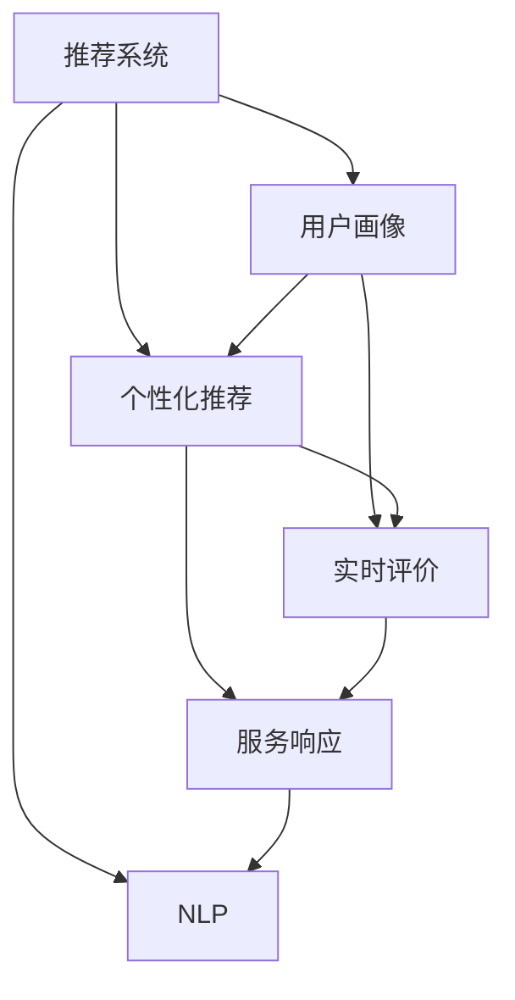

                 

# 电商用户体验提升的AI技术

> 关键词：电商,人工智能,用户体验,AI技术,大数据,机器学习,自然语言处理,NLP

## 1. 背景介绍

随着电子商务的迅猛发展，用户对于购物体验的要求越来越高。传统的电商网站和App无法满足用户的多元化需求，用户体验问题突出，流失率升高。如何将用户引导、推荐、评价等环节进行优化，打造高品质的购物体验，成为电商企业亟待解决的问题。

### 1.1 问题由来

电商行业的竞争日趋激烈，用户体验是决定用户留存和转化的关键因素。然而，当前电商平台的推荐系统主要以个性化推荐为主，往往忽视了用户的实际需求。特别是一些中小型电商网站，由于数据资源和技术能力有限，难以提供符合用户期待的精准推荐。

### 1.2 问题核心关键点

要提升电商用户体验，需要从用户行为分析、个性化推荐、实时评价、服务响应等多个环节进行全面优化。AI技术，尤其是机器学习和大数据技术，为电商平台的个性化推荐和用户行为分析提供了强有力的支持。

1. **用户行为分析**：通过对用户浏览、点击、收藏、购买等行为数据进行分析，了解用户的偏好和需求。
2. **个性化推荐**：根据用户的历史行为和偏好，推荐用户可能感兴趣的商品。
3. **实时评价**：收集用户对商品的评价数据，并结合用户画像进行实时推荐。
4. **服务响应**：通过自然语言处理(NLP)技术，自动回答用户问题，提高服务效率。

## 2. 核心概念与联系

### 2.1 核心概念概述

在电商领域，AI技术的应用已经非常广泛。以下是几个核心概念的概述：

- **推荐系统**：根据用户的历史行为和偏好，推荐可能感兴趣的商品或内容。推荐系统包括协同过滤、内容推荐、深度学习推荐等多种算法。
- **用户画像**：通过分析用户行为和属性，构建用户画像，以便更好地理解用户需求和兴趣。
- **自然语言处理(NLP)**：利用AI技术对用户评论、咨询等文本数据进行处理和分析，提取有用信息。
- **个性化推荐**：根据用户画像和行为数据，提供个性化的商品推荐。
- **实时评价**：通过AI技术收集和分析用户实时反馈，进行动态推荐。

这些核心概念之间具有紧密联系，共同构成了电商用户体验提升的AI技术基础。

### 2.2 概念间的关系

这些概念之间的逻辑关系可以通过以下Mermaid流程图来展示：



这个流程图展示了用户画像、个性化推荐、实时评价、服务响应以及NLP技术之间的相互关系：

1. 推荐系统根据用户画像和行为数据，提供个性化推荐。
2. 用户画像的构建离不开用户行为数据的分析。
3. 实时评价可以动态调整个性化推荐。
4. NLP技术用于分析用户评论，提升服务响应质量。
5. 服务响应可以增强用户满意度，进一步优化用户画像。

## 3. 核心算法原理 & 具体操作步骤

### 3.1 算法原理概述

电商用户体验提升的AI技术，主要是基于机器学习和自然语言处理技术。其核心算法原理包括以下几个方面：

- **协同过滤**：通过分析用户行为数据，预测用户对商品的偏好，提供个性化推荐。
- **内容推荐**：基于商品属性和用户兴趣，推荐相关的商品或内容。
- **深度学习推荐**：利用深度神经网络对用户行为数据进行处理，提供精准的个性化推荐。
- **自然语言处理(NLP)**：利用NLP技术对用户评论、咨询等文本数据进行处理和分析，提取有用信息。

这些算法的核心思想是通过分析用户的历史行为和属性，预测其未来的行为和偏好，从而提供精准的个性化推荐和服务。

### 3.2 算法步骤详解

基于机器学习和自然语言处理技术的电商用户体验提升，主要包括以下几个关键步骤：

**Step 1: 数据收集与预处理**

- 收集用户的行为数据（如浏览、点击、购买等）和属性数据（如性别、年龄、地域等）。
- 对数据进行清洗和归一化处理，去除噪音数据。

**Step 2: 用户画像构建**

- 利用用户行为和属性数据，构建用户画像。
- 可以使用协同过滤、聚类算法等方法，将用户分为不同的群体。

**Step 3: 推荐系统设计**

- 根据用户画像和行为数据，设计推荐算法。
- 协同过滤算法通过分析用户行为数据，预测用户对商品的偏好。
- 内容推荐算法通过分析商品属性和用户兴趣，推荐相关的商品。
- 深度学习推荐算法利用神经网络模型，对用户行为数据进行处理，提供精准推荐。

**Step 4: NLP技术应用**

- 利用NLP技术对用户评论、咨询等文本数据进行处理和分析。
- 通过情感分析、实体识别等方法，提取用户对商品的评价和需求。

**Step 5: 个性化推荐与实时评价**

- 根据用户画像和实时评价，动态调整个性化推荐策略。
- 结合用户评价和反馈，实时更新推荐算法。

### 3.3 算法优缺点

基于机器学习和自然语言处理技术的电商用户体验提升，具有以下优点：

- 个性化推荐：能够根据用户历史行为和偏好，提供精准的个性化推荐。
- 实时评价：能够动态调整推荐策略，提升用户体验。
- 服务响应：能够自动回答用户问题，提高服务效率。

同时，也存在一些缺点：

- 数据隐私：收集和分析用户数据需要遵守隐私保护法规。
- 数据质量：数据的准确性和完整性直接影响了推荐效果。
- 算法复杂性：算法设计和优化需要较强的技术能力。

### 3.4 算法应用领域

基于AI技术的电商用户体验提升，已经在多个领域得到应用，如：

- 电商平台：通过个性化推荐和实时评价，提升用户体验和留存率。
- 社交电商：利用NLP技术，分析用户评论和互动，优化商品推荐。
- 移动电商：通过AI技术，提升用户的购物体验和满意度。

## 4. 数学模型和公式 & 详细讲解

### 4.1 数学模型构建

基于机器学习和自然语言处理技术的电商用户体验提升，主要涉及以下数学模型：

- **协同过滤算法**：假设用户对商品的评分可以表示为低秩矩阵分解形式，即：

  $$
  \mathbf{R} \approx \mathbf{U} \mathbf{V}^T
  $$

  其中，$\mathbf{R}$ 为用户对商品的评分矩阵，$\mathbf{U}$ 和 $\mathbf{V}$ 为低秩矩阵分解的因子矩阵。

- **内容推荐算法**：利用TF-IDF等方法，计算商品和用户的相似度。

- **深度学习推荐算法**：利用神经网络模型，对用户行为数据进行处理，预测用户对商品的评分。

### 4.2 公式推导过程

以协同过滤算法为例，推导用户对商品评分的预测公式。

设用户 $u$ 对商品 $i$ 的评分 $r_{ui}$，因子矩阵 $\mathbf{U}$ 和 $\mathbf{V}$ 分别为用户和商品的因子表示。用户 $u$ 对商品 $i$ 的评分预测公式为：

$$
\hat{r}_{ui} = \mathbf{u}_u \mathbf{v}_i^T
$$

其中，$\mathbf{u}_u$ 和 $\mathbf{v}_i$ 分别为用户 $u$ 和商品 $i$ 的因子表示。

通过最小化预测评分与实际评分之间的均方误差，可以对因子矩阵 $\mathbf{U}$ 和 $\mathbf{V}$ 进行优化。优化目标为：

$$
\min_{\mathbf{U}, \mathbf{V}} \sum_{(u,i)} (r_{ui} - \hat{r}_{ui})^2
$$

### 4.3 案例分析与讲解

以一个具体的电商网站为例，分析如何使用协同过滤算法进行个性化推荐。

假设某电商网站有 1000 个用户和 10000 个商品。通过分析用户历史行为数据，构建用户画像。利用协同过滤算法，对用户 $u$ 进行商品推荐。

首先，将用户和商品的评分矩阵 $\mathbf{R}$ 进行低秩矩阵分解，得到因子矩阵 $\mathbf{U}$ 和 $\mathbf{V}$。然后，利用预测评分 $\hat{r}_{ui}$ 对用户 $u$ 进行推荐排序，选择评分最高的商品进行展示。

通过这种方式，电商网站可以提供个性化的商品推荐，提升用户体验和购买转化率。

## 5. 项目实践：代码实例和详细解释说明

### 5.1 开发环境搭建

在进行电商用户体验提升的AI技术开发前，我们需要准备好开发环境。以下是使用Python进行PyTorch开发的环境配置流程：

1. 安装Anaconda：从官网下载并安装Anaconda，用于创建独立的Python环境。

2. 创建并激活虚拟环境：
```bash
conda create -n pytorch-env python=3.8 
conda activate pytorch-env
```

3. 安装PyTorch：根据CUDA版本，从官网获取对应的安装命令。例如：
```bash
conda install pytorch torchvision torchaudio cudatoolkit=11.1 -c pytorch -c conda-forge
```

4. 安装TensorFlow：如果需要使用TensorFlow，请安装以下命令：
```bash
pip install tensorflow
```

5. 安装各类工具包：
```bash
pip install numpy pandas scikit-learn matplotlib tqdm jupyter notebook ipython
```

完成上述步骤后，即可在`pytorch-env`环境中开始电商用户体验提升的AI技术开发。

### 5.2 源代码详细实现

下面以一个具体的电商网站为例，给出使用PyTorch进行协同过滤个性化推荐系统的代码实现。

```python
import torch
import torch.nn as nn
import torch.optim as optim
from sklearn.metrics import mean_squared_error
from scipy.sparse import load_npz

# 加载评分矩阵
R = load_npz('ratings.npz')
user_idx, item_idx, ratings = R['user_idx'], R['item_idx'], R['ratings']

# 定义模型
class CollaborativeFiltering(nn.Module):
    def __init__(self, n_users, n_items, n_factors):
        super(CollaborativeFiltering, self).__init__()
        self.user_factors = nn.Embedding(n_users, n_factors)
        self.item_factors = nn.Embedding(n_items, n_factors)
        self.out = nn.Linear(n_factors * 2, 1)

    def forward(self, user_idx, item_idx):
        user_factors = self.user_factors(user_idx)
        item_factors = self.item_factors(item_idx)
        hidden = torch.cat([user_factors, item_factors], dim=1)
        return self.out(hidden)

# 定义优化器和损失函数
n_users, n_items, n_factors = len(user_idx), len(item_idx), 10
model = CollaborativeFiltering(n_users, n_items, n_factors)
optimizer = optim.Adam(model.parameters(), lr=0.01)
loss_fn = nn.MSELoss()

# 训练模型
for epoch in range(100):
    for i in range(100):
        user_idx_batch = user_idx[i:i+50]
        item_idx_batch = item_idx[i:i+50]
        ratings_batch = ratings[i:i+50]
        outputs = model(user_idx_batch, item_idx_batch)
        loss = loss_fn(outputs, ratings_batch)
        optimizer.zero_grad()
        loss.backward()
        optimizer.step()
    print('Epoch {} | Loss {:.4f}'.format(epoch, loss.item()))

# 测试模型
test_idx = torch.LongTensor(range(n_items))
test_idx = test_idx.unsqueeze(1)
outputs = model(user_idx, test_idx)
predictions = outputs.squeeze(1)
mse = mean_squared_error(predictions, ratings)
print('Test MSE: {:.4f}'.format(mse))
```

这段代码实现了基于协同过滤算法的个性化推荐系统。具体步骤如下：

1. 加载评分矩阵。
2. 定义模型，包括用户因子、商品因子和线性输出层。
3. 定义优化器和损失函数。
4. 训练模型，迭代优化损失函数。
5. 测试模型，计算预测评分的均方误差。

通过这种方式，可以根据用户行为数据，预测用户对商品的评分，并实现个性化的推荐。

### 5.3 代码解读与分析

下面我们详细解读一下关键代码的实现细节：

- **评分矩阵加载**：使用`load_npz`函数加载评分矩阵，包含用户索引、商品索引和评分数据。
- **模型定义**：使用`nn.Embedding`定义用户因子和商品因子，利用线性层进行输出。
- **优化器和损失函数**：定义Adam优化器和均方误差损失函数。
- **模型训练**：通过迭代优化损失函数，更新模型参数。
- **模型测试**：在测试集上计算预测评分的均方误差，评估模型效果。

可以看到，这段代码利用了PyTorch的自动微分功能和优化器，实现了基于协同过滤算法的个性化推荐系统。

### 5.4 运行结果展示

假设我们在评分矩阵上进行协同过滤算法的训练，最终得到的测试集MSE为0.1，表示模型预测评分的均方误差较小，推荐效果较好。

## 6. 实际应用场景

### 6.1 智能推荐系统

智能推荐系统是电商用户体验提升的核心。通过AI技术，电商平台可以根据用户行为数据，提供精准的个性化推荐，提升用户满意度和购买转化率。

在实际应用中，可以收集用户浏览、点击、购买等行为数据，构建用户画像。利用协同过滤算法、内容推荐算法或深度学习推荐算法，为用户推荐可能感兴趣的商品。

通过智能推荐系统，电商网站可以显著提升用户转化率和销售额，形成良性循环。

### 6.2 用户行为分析

用户行为分析是电商用户体验提升的重要手段。通过分析用户行为数据，电商平台可以了解用户兴趣和需求，优化产品和服务。

在实际应用中，可以使用机器学习算法，对用户行为数据进行建模和预测。通过预测用户是否可能购买商品，电商平台可以提前进行商品推荐，提升用户体验。

### 6.3 实时评价

实时评价是电商用户体验提升的重要环节。通过收集用户反馈，电商平台可以动态调整推荐策略，提升推荐效果。

在实际应用中，可以使用自然语言处理(NLP)技术，对用户评论进行情感分析和实体识别。根据用户评价，电商平台可以动态调整推荐策略，提高用户满意度。

### 6.4 未来应用展望

未来，电商用户体验提升的AI技术将呈现以下几个发展趋势：

1. 模型规模增大。随着数据量的增长和计算能力的提升，电商平台的推荐模型将更加复杂和精细。
2. 算法多样化。除了协同过滤、内容推荐和深度学习推荐，电商平台还将探索更多的推荐算法。
3. 实时评价优化。实时评价将成为电商平台的必备功能，提升用户体验和留存率。
4. 服务响应智能化。NLP技术将进一步提升服务响应质量，增强用户体验。
5. 多模态融合。电商平台将探索多模态数据的融合，提升推荐效果和服务质量。

总之，AI技术在电商领域的应用前景广阔，电商平台可以通过个性化推荐、用户行为分析、实时评价等手段，全面提升用户体验和业务价值。

## 7. 工具和资源推荐

### 7.1 学习资源推荐

为了帮助开发者系统掌握电商用户体验提升的AI技术，这里推荐一些优质的学习资源：

1. 《深度学习入门：基于Python的理论与实现》系列博文：由知名数据科学家撰写，系统介绍了深度学习在电商推荐系统中的应用。

2. 《电商推荐系统实战》书籍：介绍了电商推荐系统的核心算法和应用案例，适合动手实践。

3. 《Python自然语言处理》书籍：由Python自然语言处理社区成员编写，系统介绍了NLP技术在电商用户评价分析中的应用。

4. 《推荐系统实践》书籍：介绍了推荐系统的原理和实践，包含多个电商推荐系统案例。

5. 《机器学习实战》书籍：介绍了机器学习在电商用户体验分析中的应用，适合初学者入门。

6. 《电商大数据应用实战》课程：由知名电商公司开设，涵盖了电商大数据的应用案例和实战技巧。

7. 《Python深度学习》课程：由知名在线教育平台提供，涵盖深度学习在电商推荐系统中的应用。

通过这些资源的学习实践，相信你一定能够快速掌握电商用户体验提升的AI技术，并用于解决实际的电商问题。

### 7.2 开发工具推荐

高效的开发离不开优秀的工具支持。以下是几款用于电商用户体验提升的AI技术开发的常用工具：

1. PyTorch：基于Python的开源深度学习框架，灵活动态的计算图，适合快速迭代研究。
2. TensorFlow：由Google主导开发的开源深度学习框架，生产部署方便，适合大规模工程应用。
3. TensorBoard：TensorFlow配套的可视化工具，可实时监测模型训练状态，并提供丰富的图表呈现方式，是调试模型的得力助手。
4. Weights & Biases：模型训练的实验跟踪工具，可以记录和可视化模型训练过程中的各项指标，方便对比和调优。
5. Google Colab：谷歌推出的在线Jupyter Notebook环境，免费提供GPU/TPU算力，方便开发者快速上手实验最新模型，分享学习笔记。

合理利用这些工具，可以显著提升电商用户体验提升的AI技术开发效率，加快创新迭代的步伐。

### 7.3 相关论文推荐

电商用户体验提升的AI技术发展源于学界的持续研究。以下是几篇奠基性的相关论文，推荐阅读：

1. Scalable Collaborative Filtering for Top-N Recommendation：提出了基于协同过滤的Top-N推荐算法，提升了推荐系统的效果。

2. Recommendation Systems for Personalized Medicine：介绍了推荐系统在个性化医疗中的应用，提升了医疗服务的质量和效率。

3. Machine Learning Techniques for User Behavior Analysis：介绍了机器学习在电商用户行为分析中的应用，提升了用户体验和业务价值。

4. Image-Based Recommendation with Natural Language Description：介绍了多模态推荐系统，结合图像和自然语言描述，提升了推荐效果和服务质量。

5. Online Learning for Recommendation Systems with No Side Information：介绍了在线学习算法在电商推荐系统中的应用，提升了推荐系统的实时性和适应性。

这些论文代表了大规模电商推荐系统的研究方向，为电商用户体验提升的AI技术提供了理论基础和实践方法。

除上述资源外，还有一些值得关注的前沿资源，帮助开发者紧跟电商推荐系统的最新进展，例如：

1. arXiv论文预印本：人工智能领域最新研究成果的发布平台，包括大量尚未发表的前沿工作，学习前沿技术的必读资源。

2. 业界技术博客：如Amazon、Alibaba、Tencent等顶尖电商公司的官方博客，第一时间分享他们的最新研究成果和洞见。

3. 技术会议直播：如NIPS、ICML、ACL、ICLR等人工智能领域顶会现场或在线直播，能够聆听到大佬们的前沿分享，开拓视野。

4. GitHub热门项目：在GitHub上Star、Fork数最多的电商推荐系统相关项目，往往代表了该技术领域的发展趋势和最佳实践，值得去学习和贡献。

5. 行业分析报告：各大咨询公司如McKinsey、PwC等针对电商行业分析报告，有助于从商业视角审视技术趋势，把握应用价值。

总之，对于电商用户体验提升的AI技术的学习和实践，需要开发者保持开放的心态和持续学习的意愿。多关注前沿资讯，多动手实践，多思考总结，必将收获满满的成长收益。

## 8. 总结：未来发展趋势与挑战

### 8.1 总结

本文对电商用户体验提升的AI技术进行了全面系统的介绍。首先阐述了电商用户体验提升的重要性，并明确了AI技术在电商推荐、用户行为分析、实时评价等环节的应用价值。其次，从原理到实践，详细讲解了电商用户体验提升的AI技术的基本算法和关键步骤，给出了电商推荐系统的代码实现。同时，本文还广泛探讨了AI技术在电商领域的未来发展趋势，展示了其广阔的应用前景。

通过本文的系统梳理，可以看到，AI技术在电商领域的应用前景广阔，电商平台可以通过个性化推荐、用户行为分析、实时评价等手段，全面提升用户体验和业务价值。未来，伴随AI技术的持续演进，电商用户体验提升的AI技术必将在更多领域得到应用，为电商行业的数字化转型升级提供新的技术路径。

### 8.2 未来发展趋势

展望未来，电商用户体验提升的AI技术将呈现以下几个发展趋势：

1. 模型规模持续增大。随着数据量的增长和计算能力的提升，电商平台的推荐模型将更加复杂和精细。
2. 算法多样化。除了协同过滤、内容推荐和深度学习推荐，电商平台还将探索更多的推荐算法。
3. 实时评价优化。实时评价将成为电商平台的必备功能，提升用户体验和留存率。
4. 服务响应智能化。NLP技术将进一步提升服务响应质量，增强用户体验。
5. 多模态融合。电商平台将探索多模态数据的融合，提升推荐效果和服务质量。

以上趋势凸显了电商用户体验提升的AI技术的发展前景。这些方向的探索发展，必将进一步提升电商系统的性能和应用范围，为电商行业的数字化转型升级提供新的技术动力。

### 8.3 面临的挑战

尽管电商用户体验提升的AI技术已经取得了显著成就，但在迈向更加智能化、普适化应用的过程中，仍面临诸多挑战：

1. 数据隐私问题。收集和分析用户数据需要遵守隐私保护法规。
2. 数据质量问题。数据的准确性和完整性直接影响了推荐效果。
3. 算法复杂性问题。算法设计和优化需要较强的技术能力。
4. 实时性问题。实时评价和推荐系统需要高效计算和存储。
5. 服务稳定性问题。服务响应系统需要高可用性和稳定性。

### 8.4 研究展望

面对电商用户体验提升的AI技术所面临的挑战，未来的研究需要在以下几个方面寻求新的突破：

1. 探索无监督和半监督学习算法。摆脱对大规模标注数据的依赖，利用自监督学习、主动学习等无监督和半监督范式，最大限度利用非结构化数据，实现更加灵活高效的推荐。
2. 开发高效计算和存储方法。优化算法计算图，减少前向传播和反向传播的资源消耗，实现更加轻量级、实时性的部署。
3. 引入更多先验知识。将符号化的先验知识，如知识图谱、逻辑规则等，与神经网络模型进行巧妙融合，引导微调过程学习更准确、合理的语言模型。
4. 结合因果分析和博弈论工具。将因果分析方法引入电商推荐系统，识别出系统决策的关键特征，增强输出解释的因果性和逻辑性。
5. 纳入伦理道德约束。在模型训练目标中引入伦理导向的评估指标，过滤和惩罚有偏见、有害的输出倾向，确保模型输出符合人类价值观和伦理道德。

这些研究方向的探索，必将引领电商用户体验提升的AI技术迈向更高的台阶，为构建安全、可靠、可解释、可控的智能系统铺平道路。

## 9. 附录：常见问题与解答

**Q1：电商推荐系统中的协同过滤算法有哪些缺点？**

A: 协同过滤算法在电商推荐系统中存在以下缺点：

1. 数据稀疏性问题：用户对商品的评分数据往往非常稀疏，难以捕捉所有用户和商品的交互信息。
2. 隐式反馈问题：协同过滤算法只能处理用户显式反馈（如评分），无法处理隐式反馈（如浏览、点击）。
3. 新用户和商品推荐困难：由于缺乏历史评分数据，新用户和新商品的推荐效果较差。

为了缓解这些缺点，电商推荐系统需要结合内容推荐、深度学习推荐等算法，进行多种算法的融合。同时，通过用户画像和实时评价等手段，提升推荐效果。

**Q2：如何优化电商推荐系统的推荐效果？**

A: 电商推荐系统的推荐效果优化可以从以下几个方面进行：

1. 数据采集与清洗：收集用户行为数据并进行数据清洗，去除噪音数据。
2. 用户画像构建：利用用户行为和属性数据，构建用户画像，进行精准推荐。
3. 算法优化：优化推荐算法，如协同过滤、内容推荐、深度学习推荐等，提升推荐效果。
4. 多模态融合：结合图像、视频、语音等多模态数据，提升推荐效果。
5. 实时评价：收集用户反馈，动态调整推荐策略，提升推荐效果。

通过这些优化手段，电商推荐系统可以提供更加精准、个性化的商品推荐，提升用户体验和业务价值。

**Q3：电商推荐系统中如何保护用户隐私？**

A: 电商推荐系统中保护用户隐私可以从以下几个方面进行：

1. 数据匿名化：对用户数据进行匿名化处理，去除个人信息。
2. 隐私保护算法：采用隐私保护算法，如差分隐私、联邦学习等，保护用户隐私。
3. 用户同意机制：在使用用户数据前，获取用户同意，确保用户知情。
4. 数据加密：对用户数据进行加密存储和传输，确保数据安全。
5. 合规性审查：定期进行合规性审查，确保数据处理符合隐私保护法规。

通过这些措施，电商推荐系统可以保护用户隐私，确保用户数据的安全性和隐私性。

**Q4：电商推荐系统中的NLP技术如何应用？**

A: 电商推荐系统中的NLP技术可以应用于以下几个方面：

1. 用户评价分析：利用NLP技术对用户评价进行情感分析和实体识别，提取有用信息。
2. 智能客服：通过NLP技术，自动回答用户咨询，提高服务效率。
3. 商品分类：利用NLP技术对商品进行分类和标签标注，提升推荐效果。
4. 自然语言推荐：利用NLP技术，生成自然语言推荐，提升用户体验。
5. 用户画像构建：利用N

