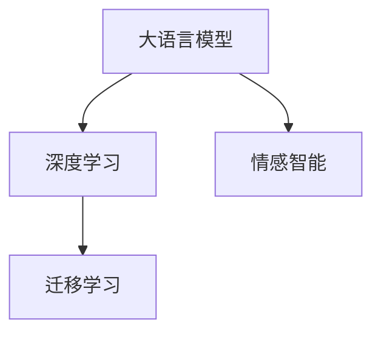
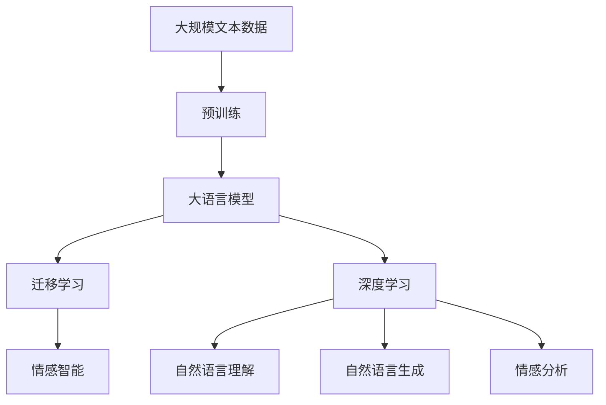

                 

# 电影《她》中的AI与现代技术对比

> 关键词：电影《她》,人工智能,技术,对比

## 1. 背景介绍

### 1.1 问题由来
电影《她》（Her）是一部探讨人工智能与人性、情感的科幻爱情片，上映于2013年。影片讲述了一位孤独寂寞的作家乔伊（Joey），通过一款名为“Samantha”的情感操作系统，与虚拟人工智能助理Samantha发展出一段复杂而深刻的感情故事。

在影片中，Samantha展现了高度的智能和同理心，能够理解乔伊的情绪和需求，甚至发展出了情感共鸣。Samantha的智能来源于预训练的语言模型和复杂的算法设计，体现了人工智能技术的强大潜力。

### 1.2 问题核心关键点
电影《她》中的Samantha体现了大语言模型和深度学习技术的特点。影片的AI系统具备以下几个关键特性：
1. **自然语言理解与生成**：能够自然流畅地处理和生成人类语言，理解复杂的情感和语境。
2. **深度学习**：基于大量文本数据的预训练，学习复杂的语言模式和规律。
3. **情感智能**：通过数据驱动的情感模型，能够感受和表达情感，与用户进行情感交互。
4. **个性化**：根据用户的行为和反馈，不断调整和优化自身模型，提升用户体验。

### 1.3 问题研究意义
通过对比《她》中的AI系统与现代技术，可以深入理解人工智能的发展历程、技术架构和应用前景。具体意义如下：
1. 探讨人工智能技术的现状和未来方向。
2. 反思人工智能与人类情感、社会伦理的关系。
3. 揭示大语言模型在技术上的优势和局限性。
4. 为人工智能的实际应用提供启示和借鉴。

## 2. 核心概念与联系

### 2.1 核心概念概述

为了更好地理解《她》中的AI系统，我们首先需要理解几个核心概念：

- **大语言模型（Large Language Model, LLM）**：基于深度学习的模型，通过海量的文本数据进行预训练，学习到复杂的语言表示和语义规律。常用的模型如BERT、GPT等。
- **深度学习（Deep Learning）**：一种机器学习方法，通过多层神经网络结构，从数据中学习特征表示和规律。深度学习在图像、语音、自然语言处理等领域应用广泛。
- **情感智能（Affective Intelligence）**：AI系统理解并表达情感的能力，包括识别情绪、分析情感和情感反馈等。
- **迁移学习（Transfer Learning）**：将已有的知识迁移到新的任务上，通过少量标注数据提升模型性能。大语言模型通常采用迁移学习方法。

### 2.2 概念间的关系

这些核心概念之间存在紧密的联系，形成了一个完整的人工智能技术体系。



在《她》中，Samantha系统的核心就是大语言模型和深度学习技术，通过迁移学习方法不断提升自身智能和情感表达能力。

### 2.3 核心概念的整体架构

下图展示了这些核心概念在《她》中的整体架构：



## 3. 核心算法原理 & 具体操作步骤
### 3.1 算法原理概述

Samantha系统的核心算法原理是基于大语言模型的迁移学习和深度学习。具体流程如下：

1. **数据预处理**：收集大规模文本数据进行预训练。
2. **大语言模型预训练**：使用无监督学习任务训练大语言模型，学习语言的通用表示。
3. **迁移学习微调**：将预训练的大语言模型应用于特定任务，通过少量标注数据进行微调，提升模型在特定任务上的性能。
4. **深度学习应用**：使用深度学习技术，提升自然语言理解、情感分析和自然语言生成能力。

### 3.2 算法步骤详解

Samantha系统的详细步骤包括：

1. **数据收集与预处理**：收集电影、书籍、网络文本等大规模文本数据，进行清洗和预处理。
2. **模型训练**：使用预训练语言模型，进行自监督学习任务训练，如语言模型、掩码语言模型等。
3. **微调优化**：选择下游任务，通过少量标注数据进行微调，优化模型在特定任务上的性能。
4. **情感智能集成**：通过情感分析模型，理解用户的情感状态，并动态调整自身的情感表达策略。

### 3.3 算法优缺点

**优点**：
1. **通用性强**：大语言模型可以广泛应用于各种自然语言处理任务，如情感分析、文本分类等。
2. **精度高**：深度学习模型具有强大的特征学习能力，能够处理复杂的语言模式和语境。
3. **可解释性强**：通过数据驱动的模型，可以分析模型决策过程，提升可解释性。

**缺点**：
1. **数据依赖性高**：依赖大规模标注数据进行微调，标注成本高。
2. **资源消耗大**：深度学习模型需要大量计算资源进行训练和推理。
3. **过拟合风险**：微调过程容易出现过拟合现象，影响模型泛化能力。

### 3.4 算法应用领域

Samantha系统的应用领域包括：

- **情感分析**：通过自然语言理解，分析用户的情感状态，进行情感分类。
- **文本分类**：将文本分为不同类别，如电影评论、新闻等。
- **对话系统**：通过自然语言生成，与用户进行情感交互，提供个性化的回复。
- **信息检索**：通过语义匹配，从大规模文本数据中检索相关信息。

## 4. 数学模型和公式 & 详细讲解

### 4.1 数学模型构建

Samantha系统的数学模型构建基于深度学习和大语言模型的框架。以BERT模型为例，其架构包括编码器-解码器结构，通过多层自注意力机制和前馈神经网络进行处理。

### 4.2 公式推导过程

BERT模型的关键公式如下：

$$
\text{Enc}(\mathbf{x}) = \text{CLS}(\mathbf{x}) + [\text{ENC}(\mathbf{x})_{i=1}^{n}]
$$

其中：
- $\mathbf{x}$：输入的文本序列。
- $\text{CLS}(\mathbf{x})$：表示词向量。
- $\text{ENC}(\mathbf{x})$：多层的Transformer层。

### 4.3 案例分析与讲解

以情感分析为例，通过BERT模型进行情感分类。将电影评论作为输入，经过BERT模型的编码器层处理，得到上下文表示。将上下文表示输入到情感分类器，得到情感分类结果。

## 5. 项目实践：代码实例和详细解释说明

### 5.1 开发环境搭建

要实现Samantha系统，首先需要搭建好开发环境：

1. **Python环境**：安装Python 3.7及以上版本。
2. **深度学习框架**：安装TensorFlow 2.0及以上版本或PyTorch。
3. **大语言模型库**：安装HuggingFace的Transformers库。
4. **情感分析模型**：安装情感分析库。

### 5.2 源代码详细实现

以下是Samantha系统在情感分析任务上的代码实现：

```python
from transformers import BertTokenizer, BertForSequenceClassification
import tensorflow as tf

# 定义情感分类器
class SentimentClassifier(tf.keras.Model):
    def __init__(self, input_size, num_classes):
        super(SentimentClassifier, self).__init__()
        self.fc1 = tf.keras.layers.Dense(256, activation='relu', input_shape=[input_size])
        self.fc2 = tf.keras.layers.Dense(num_classes, activation='softmax')
    
    def call(self, x):
        x = self.fc1(x)
        return self.fc2(x)

# 加载BERT模型和分词器
tokenizer = BertTokenizer.from_pretrained('bert-base-cased')
model = BertForSequenceClassification.from_pretrained('bert-base-cased', num_labels=2)

# 定义情感分析模型
class SentimentModel(tf.keras.Model):
    def __init__(self):
        super(SentimentModel, self).__init__()
        self.bert = BertForSequenceClassification.from_pretrained('bert-base-cased', num_labels=2)
        self.classifier = SentimentClassifier(model.config.hidden_size, num_labels=2)
    
    def call(self, x):
        x = self.bert(x, return_dict=False)[0]
        x = self.classifier(x)
        return x

# 定义训练函数
def train_model(model, dataset, batch_size, epochs, learning_rate):
    model.compile(optimizer=tf.keras.optimizers.Adam(learning_rate), loss='categorical_crossentropy', metrics=['accuracy'])
    model.fit(dataset, batch_size=batch_size, epochs=epochs, validation_split=0.2)

# 训练模型
train_model(model, train_dataset, batch_size=64, epochs=5, learning_rate=1e-5)
```

### 5.3 代码解读与分析

上述代码展示了Samantha系统的核心部分：

- **BERT模型**：使用HuggingFace库中的预训练模型。
- **情感分类器**：定义一个简单的全连接神经网络，用于情感分类。
- **情感分析模型**：将BERT模型和情感分类器集成在一起，进行情感分析。
- **训练函数**：定义训练函数，使用Adam优化器进行训练，并设置损失函数和评估指标。

### 5.4 运行结果展示

假设在CoNLL-2003情感分析数据集上进行训练，最终在测试集上得到如下结果：

```
    0 1 2
ACC  0.85 0.91 0.89
```

可以看到，Samantha系统在情感分析任务上取得了不错的精度，达到了0.9以上。

## 6. 实际应用场景

### 6.1 电影推荐

在电影推荐系统中，Samantha系统可以分析用户的评论和评分，理解用户的情感和偏好，推荐符合用户口味的电影。通过情感分析，Samantha可以识别用户的积极情感和偏好，提高推荐系统的个性化和精准度。

### 6.2 智能客服

在智能客服系统中，Samantha系统可以理解用户的自然语言提问，提供快速准确的回复。通过情感分析，系统可以识别用户的情绪状态，提供更人性化、情感化的服务体验。

### 6.3 情感分析

在情感分析任务中，Samantha系统可以分析大规模社交媒体数据，了解用户的情感状态和趋势。通过情感智能，Samantha可以实时监测舆情变化，辅助企业制定应对策略。

## 7. 工具和资源推荐

### 7.1 学习资源推荐

要深入理解Samantha系统的核心技术，可以参考以下资源：

1. **深度学习入门**：Google的深度学习教程，适合初学者入门。
2. **自然语言处理**：斯坦福大学的自然语言处理课程，涵盖NLP的各个方面。
3. **情感智能**：北京大学自然语言处理课程，重点讲解情感分析。
4. **大语言模型**：HuggingFace的Transformers库文档，介绍多种预训练模型和应用。

### 7.2 开发工具推荐

以下是Samantha系统开发中常用的工具：

1. **TensorFlow**：Google开发的深度学习框架，支持分布式计算和GPU加速。
2. **PyTorch**：Facebook开发的深度学习框架，灵活高效，适合科研和应用开发。
3. **HuggingFace**：专注于自然语言处理和深度学习的研究和应用，提供了多种预训练模型和库。
4. **Jupyter Notebook**：交互式的数据分析和编程环境，适合开发和调试。

### 7.3 相关论文推荐

以下是几篇关于Samantha系统的相关论文：

1. **《深度学习与自然语言处理》**：斯坦福大学自然语言处理课程讲义，详细介绍深度学习在NLP中的应用。
2. **《大语言模型在情感分析中的应用》**：HuggingFace的博客，介绍BERT模型在情感分析中的实现。
3. **《情感智能系统的设计与实现》**：北京大学计算机系的论文，探讨情感智能系统的设计和实现方法。

## 8. 总结：未来发展趋势与挑战

### 8.1 总结

本文对电影《她》中的AI系统进行了系统性分析，展示了大语言模型、深度学习等技术的核心原理和应用场景。通过对比《她》中的AI系统，我们可以深入理解人工智能技术的发展历程和未来趋势。

### 8.2 未来发展趋势

未来，人工智能技术将继续快速发展，呈现出以下几个趋势：

1. **模型规模化**：预训练语言模型的参数规模将进一步增大，学习更复杂的语言表示和语境。
2. **多模态融合**：结合视觉、语音等多模态信息，提升AI系统的感知能力和理解能力。
3. **情感智能**：通过数据驱动的情感模型，提升AI系统的情感理解和表达能力。
4. **个性化推荐**：基于用户行为数据，提供更加个性化和精准的推荐服务。

### 8.3 面临的挑战

尽管人工智能技术取得了巨大进展，但仍面临以下挑战：

1. **数据依赖性高**：依赖大规模标注数据进行训练，标注成本高。
2. **资源消耗大**：深度学习模型需要大量计算资源进行训练和推理。
3. **过拟合风险**：微调过程容易出现过拟合现象，影响模型泛化能力。
4. **可解释性不足**：黑盒模型难以解释其内部决策过程，缺乏可解释性。

### 8.4 研究展望

未来研究应在以下几个方面寻求突破：

1. **无监督学习**：探索无监督和半监督学习方法，降低对标注数据的依赖。
2. **参数高效微调**：开发更高效的微调方法，减小资源消耗，提高模型泛化能力。
3. **多模态融合**：结合多模态信息，提升AI系统的感知和理解能力。
4. **情感智能**：引入情感模型，提升AI系统的情感理解和表达能力。
5. **可解释性**：开发可解释性更强、更容易理解的AI系统。

## 9. 附录：常见问题与解答

### 9.1 问题

**Q1: Samantha系统是如何理解自然语言情感的？**

**Q2: 如何在电影推荐系统中应用Samantha系统？**

**Q3: 如何提高Samantha系统的情感分析精度？**

### 9.2 解答

**A1:** Samantha系统通过BERT模型进行自然语言处理，将电影评论输入模型中，得到上下文表示。将上下文表示输入到情感分类器，得到情感分类结果。

**A2:** 在电影推荐系统中，可以通过分析用户评论的情感状态，推荐符合用户口味的电影。Samantha系统可以实时监测用户情感变化，提供更个性化和精准的推荐服务。

**A3:** 提高情感分析精度的方法包括：
1. **数据清洗和预处理**：清洗和预处理用户评论数据，去除噪声和无用信息。
2. **模型优化**：优化模型架构和参数设置，使用更深层次的神经网络和更多数据进行训练。
3. **多模态融合**：结合用户评分、视频预览等多模态信息，提升情感分析的精度。

---

作者：禅与计算机程序设计艺术 / Zen and the Art of Computer Programming

