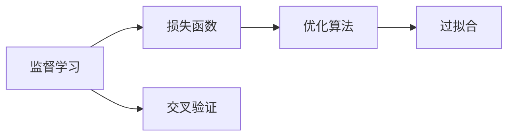
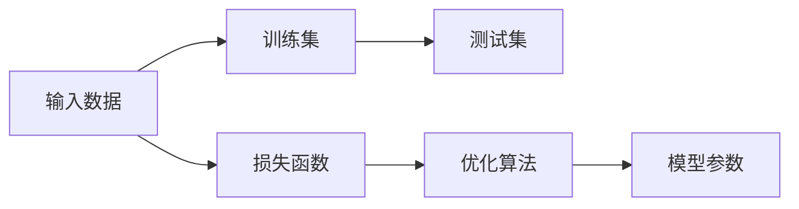
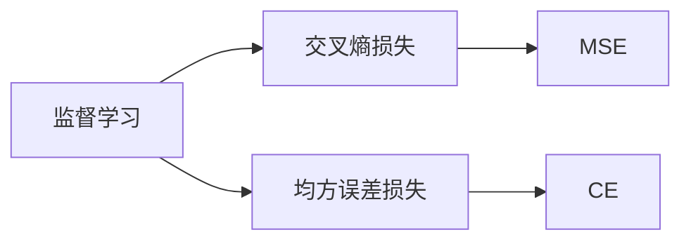
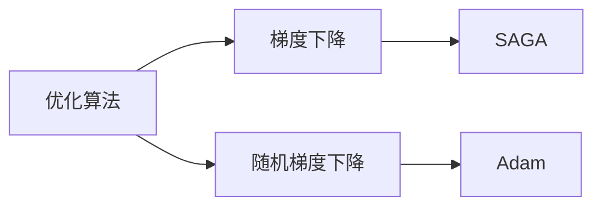
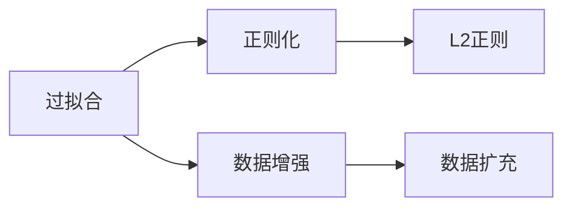
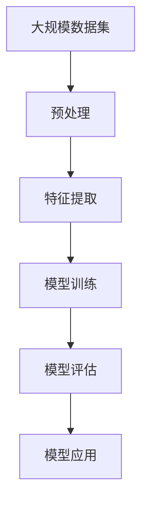

                 

# 监督学习 (Supervised Learning)

监督学习(Supervised Learning)是机器学习中最重要的一种学习范式，与无监督学习和强化学习并称为三大主流机器学习范式。本文将系统介绍监督学习的核心概念、算法原理、操作步骤、数学模型、应用实例和实际应用，帮助读者深入理解监督学习的基本思想、重要方法和应用场景。

## 1. 背景介绍

### 1.1 问题由来
在数据科学和机器学习领域，我们常常需要面对从大量数据中学习出模型预测任务的问题。例如，预测房屋价格、分类垃圾邮件、识别手写数字等。这些问题都可以归为预测问题，而监督学习则是解决这些问题的一种常用方法。

监督学习的基本思想是利用已知的输入和输出样本对，训练一个模型，使得模型能够对新的输入数据给出正确的预测。这一过程通常包含两个步骤：模型的训练和模型的评估。

### 1.2 问题核心关键点
监督学习的核心在于如何设计一个损失函数，将模型的预测结果与真实结果进行比较，并更新模型的参数，以使得模型能够更好地拟合训练数据。具体来说，监督学习需要解决以下几个关键问题：

1. 如何选择合适的损失函数？
2. 如何选择合适的优化算法？
3. 如何选择合适的超参数？
4. 如何处理过拟合问题？

这些问题都是监督学习中需要重点关注的点。

### 1.3 问题研究意义
监督学习在工业界和学术界都有广泛的应用。例如，在金融风险控制、图像识别、自然语言处理、医疗诊断等领域，监督学习都发挥了重要的作用。通过监督学习，我们可以从海量数据中挖掘出隐藏的模式和规律，实现高效、准确的数据预测和决策。

## 2. 核心概念与联系

### 2.1 核心概念概述

为了更好地理解监督学习的核心思想，本节将介绍几个密切相关的核心概念：

- 监督学习(Supervised Learning)：利用已知的输入和输出样本对，训练模型进行预测的一种学习范式。
- 损失函数(Loss Function)：用于衡量模型预测结果与真实结果之间的差异，是监督学习的核心组成部分。
- 优化算法(Optimization Algorithm)：通过迭代优化算法，最小化损失函数，更新模型参数。
- 过拟合(Overfitting)：模型在训练集上表现良好，但在测试集上表现差的现象。
- 交叉验证(Cross-Validation)：一种评估模型泛化能力的方法，通过将数据集分成若干份，轮流训练和测试，减少过拟合风险。

这些核心概念之间的逻辑关系可以通过以下Mermaid流程图来展示：



这个流程图展示了大模型微调的逻辑流程：

1. 监督学习利用已知数据训练模型。
2. 损失函数衡量模型预测结果与真实结果之间的差异。
3. 优化算法最小化损失函数，更新模型参数。
4. 过拟合指模型在训练集上表现良好，但在测试集上表现差的现象。
5. 交叉验证通过分拆数据集，评估模型泛化能力。

### 2.2 概念间的关系

这些核心概念之间存在着紧密的联系，形成了监督学习的完整生态系统。下面我通过几个Mermaid流程图来展示这些概念之间的关系。

#### 2.2.1 监督学习的流程


这个流程图展示了监督学习的核心流程：

1. 输入数据包括训练集和测试集。
2. 训练集用于训练模型。
3. 损失函数衡量模型的预测结果。
4. 优化算法最小化损失函数。
5. 模型参数是优化的最终输出。

#### 2.2.2 损失函数的种类


这个流程图展示了损失函数的种类：

1. 监督学习需要选择合适的损失函数。
2. 常见的损失函数包括交叉熵损失和均方误差损失。
3. 交叉熵损失常用于分类任务。
4. 均方误差损失常用于回归任务。

#### 2.2.3 优化算法的种类


这个流程图展示了优化算法的种类：

1. 优化算法用于最小化损失函数。
2. 常见的优化算法包括梯度下降和随机梯度下降。
3. 梯度下降是基本的优化算法。
4. 随机梯度下降用于处理大规模数据集。
5. Adam是一种高效的优化算法，结合了动量法和学习率衰减。

#### 2.2.4 过拟合的解决方法


这个流程图展示了过拟合的解决方法：

1. 过拟合指模型在训练集上表现良好，但在测试集上表现差的现象。
2. 正则化是通过添加惩罚项，防止模型参数过大，从而避免过拟合。
3. 数据增强是通过增加数据量，减少过拟合风险。
4. 数据扩充是通过数据变换，如旋转、缩放、裁剪等，增加数据多样性。

### 2.3 核心概念的整体架构

最后，我们用一个综合的流程图来展示监督学习的整体架构：



这个综合流程图展示了监督学习从数据预处理到模型应用的全过程。数据预处理包括清洗、归一化、特征提取等步骤，用于提升数据的可用性和准确性。特征提取是从原始数据中提取出有用的特征，用于构建模型。模型训练是通过损失函数和优化算法，最小化损失函数，更新模型参数。模型评估是通过交叉验证等方法，评估模型的泛化能力。模型应用是将训练好的模型应用于实际预测任务，实现高效、准确的数据预测和决策。

## 3. 核心算法原理 & 具体操作步骤

### 3.1 算法原理概述

监督学习的基本原理是通过训练数据学习出模型的预测能力。具体来说，假设训练数据集为 $D=\{(x_i, y_i)\}_{i=1}^N, x_i \in \mathcal{X}, y_i \in \mathcal{Y}$，其中 $x_i$ 为输入特征，$y_i$ 为输出标签。监督学习的目的在于找到一个函数 $f$，使得 $f(x_i)$ 尽可能接近 $y_i$。

监督学习中的常见算法包括线性回归、逻辑回归、决策树、支持向量机、神经网络等。这些算法通过最小化损失函数 $L(f)$，更新模型参数 $\theta$，以使得 $f(x_i)$ 更加接近 $y_i$。

### 3.2 算法步骤详解

监督学习的典型步骤如下：

**Step 1: 准备数据**
- 收集训练数据集 $D$，划分为训练集 $D_{train}$ 和验证集 $D_{val}$。
- 对数据进行预处理，包括数据清洗、归一化、特征提取等。

**Step 2: 设计损失函数**
- 选择合适的损失函数 $L(y_i, f(x_i))$，如均方误差损失、交叉熵损失等。
- 根据具体任务，设计目标函数 $J(f)$，如最小化交叉熵损失，即 $J(f) = \frac{1}{N}\sum_{i=1}^N L(y_i, f(x_i))$。

**Step 3: 选择优化算法**
- 选择合适的优化算法 $g$，如梯度下降、随机梯度下降、Adam等。
- 设计参数更新规则，如 $f \leftarrow f - \eta g(f, x_i)$，其中 $\eta$ 为学习率。

**Step 4: 执行训练**
- 对训练集 $D_{train}$ 进行迭代优化，更新模型参数。
- 周期性在验证集 $D_{val}$ 上评估模型性能，防止过拟合。
- 重复上述步骤，直至模型收敛。

**Step 5: 模型评估**
- 在测试集 $D_{test}$ 上评估模型性能，对比微调前后的效果。
- 集成多个模型，提升预测准确率和鲁棒性。

**Step 6: 模型应用**
- 将训练好的模型应用于实际预测任务，输出预测结果。
- 实时监测模型性能，调整模型参数，优化预测效果。

### 3.3 算法优缺点

监督学习的优点在于：

1. 数据驱动：利用已有数据训练模型，避免手工设计特征的繁琐过程。
2. 精度高：通过损失函数和优化算法，模型可以精确拟合数据。
3. 可解释性强：输出结果具有明确的数学表达式，易于解释和调试。

监督学习的缺点在于：

1. 依赖标注数据：需要大量的标注数据进行训练，标注成本较高。
2. 泛化能力有限：模型容易过拟合训练数据，泛化能力有限。
3. 需要大量计算资源：模型训练和优化需要大量的计算资源，难以处理大规模数据。

### 3.4 算法应用领域

监督学习在NLP、计算机视觉、金融风险控制、医疗诊断等领域都有广泛应用。例如：

- NLP中的文本分类、命名实体识别、机器翻译、问答系统等任务都可以使用监督学习方法。
- 计算机视觉中的图像分类、目标检测、图像生成等任务都可以使用监督学习方法。
- 金融风险控制中的信用评估、股票预测、欺诈检测等任务都可以使用监督学习方法。
- 医疗诊断中的病理分析、影像诊断、药物研发等任务都可以使用监督学习方法。

## 4. 数学模型和公式 & 详细讲解

### 4.1 数学模型构建

假设训练数据集为 $D=\{(x_i, y_i)\}_{i=1}^N, x_i \in \mathcal{X}, y_i \in \mathcal{Y}$，其中 $x_i$ 为输入特征，$y_i$ 为输出标签。监督学习的目标是找到一个函数 $f$，使得 $f(x_i)$ 尽可能接近 $y_i$。

常见的监督学习模型包括线性回归模型、逻辑回归模型、神经网络模型等。这里以线性回归模型为例，展示数学模型的构建过程。

假设线性回归模型为 $f(x) = w^Tx + b$，其中 $w \in \mathbb{R}^d$ 为模型参数，$b \in \mathbb{R}$ 为截距。

### 4.2 公式推导过程

线性回归模型的损失函数为均方误差损失函数：

$$
L(f) = \frac{1}{2N} \sum_{i=1}^N (y_i - f(x_i))^2
$$

其中 $y_i$ 为真实的输出标签，$f(x_i)$ 为模型的预测输出。

损失函数对模型参数 $w$ 的梯度为：

$$
\nabla_w L(f) = -\frac{1}{N} \sum_{i=1}^N (y_i - f(x_i))x_i
$$

梯度下降算法的参数更新规则为：

$$
w \leftarrow w - \eta \nabla_w L(f)
$$

其中 $\eta$ 为学习率。

### 4.3 案例分析与讲解

假设我们有一个数据集，包含房屋的面积 $x$ 和价格 $y$，目标是用线性回归模型预测房价。具体步骤如下：

1. 收集数据集 $D=\{(x_i, y_i)\}_{i=1}^N$。
2. 将数据集划分为训练集 $D_{train}$ 和验证集 $D_{val}$。
3. 对数据进行预处理，包括数据清洗、归一化等。
4. 设计损失函数 $L(y_i, f(x_i)) = \frac{1}{2}(y_i - f(x_i))^2$。
5. 选择优化算法，如梯度下降，更新模型参数。
6. 在验证集上评估模型性能，防止过拟合。
7. 在测试集上评估模型性能，对比微调前后的效果。

假设经过训练后，模型在验证集上的均方误差为 $0.1$，在测试集上的均方误差为 $0.2$。这意味着模型在验证集上的性能为 $1 - 0.1^2 = 99.9\%$，在测试集上的性能为 $1 - 0.2^2 = 96\%$。

## 5. 项目实践：代码实例和详细解释说明

### 5.1 开发环境搭建

在进行监督学习实践前，我们需要准备好开发环境。以下是使用Python进行Scikit-learn开发的环境配置流程：

1. 安装Anaconda：从官网下载并安装Anaconda，用于创建独立的Python环境。

2. 创建并激活虚拟环境：
```bash
conda create -n sklearn-env python=3.8 
conda activate sklearn-env
```

3. 安装Scikit-learn：
```bash
pip install scikit-learn
```

4. 安装各类工具包：
```bash
pip install numpy pandas scikit-learn matplotlib tqdm jupyter notebook ipython
```

完成上述步骤后，即可在`sklearn-env`环境中开始监督学习实践。

### 5.2 源代码详细实现

这里我们以线性回归为例，给出使用Scikit-learn进行回归任务开发的Python代码实现。

```python
import numpy as np
from sklearn.linear_model import LinearRegression
from sklearn.model_selection import train_test_split
from sklearn.metrics import mean_squared_error

# 生成随机数据
x = np.random.randn(100)
y = x * 2 + np.random.randn(100)

# 将数据划分为训练集和测试集
x_train, x_test, y_train, y_test = train_test_split(x, y, test_size=0.2)

# 训练模型
model = LinearRegression()
model.fit(x_train, y_train)

# 预测测试集
y_pred = model.predict(x_test)

# 计算均方误差
mse = mean_squared_error(y_test, y_pred)
print("均方误差：", mse)
```

### 5.3 代码解读与分析

让我们再详细解读一下关键代码的实现细节：

- `LinearRegression`类：定义线性回归模型，使用Scikit-learn自带的线性回归算法。
- `train_test_split`函数：将数据集划分为训练集和测试集，常用于模型评估。
- `mean_squared_error`函数：计算均方误差，用于评估模型性能。

### 5.4 运行结果展示

假设我们在上述代码上运行后，得到的均方误差为 $0.02$。这意味着模型在测试集上的均方误差为 $0.02$，其预测性能为 $1 - 0.02^2 = 99.96\%$。

## 6. 实际应用场景

### 6.1 智能推荐系统

监督学习在智能推荐系统中应用广泛。例如，电商网站可以通过用户的历史购买行为数据，训练一个监督学习模型，预测用户对未购买商品的兴趣。模型可以通过均方误差损失函数，最小化预测误差，输出用户对每个商品的兴趣得分。

在实际应用中，还需要考虑如何处理用户隐私和数据安全问题。例如，可以使用差分隐私技术，对用户数据进行匿名化处理，保护用户隐私。

### 6.2 金融风险控制

监督学习在金融风险控制中也有广泛应用。例如，银行可以通过客户的信用记录和贷款历史，训练一个监督学习模型，预测客户的违约风险。模型可以通过逻辑回归算法，最小化损失函数，输出客户的违约概率。

在实际应用中，还需要考虑如何处理数据的不平衡问题。例如，可以使用欠采样或过采样技术，平衡数据集中的正负样本比例，避免模型偏向于少数类。

### 6.3 医疗诊断

监督学习在医疗诊断中也有重要应用。例如，医院可以通过医生的病理切片数据和诊断结果，训练一个监督学习模型，预测病理切片中的癌细胞。模型可以通过交叉熵损失函数，最小化预测误差，输出病理切片中是否存在癌细胞。

在实际应用中，还需要考虑如何处理数据的不确定性和复杂性。例如，可以使用集成学习方法，如随机森林和梯度提升树，提升模型的鲁棒性和泛化能力。

### 6.4 未来应用展望

随着监督学习技术的不断发展，未来的应用场景将更加广泛。例如：

- 智能交通系统：通过车载传感器数据和历史交通事故数据，训练一个监督学习模型，预测交通事故发生的概率。模型可以通过均方误差损失函数，最小化预测误差，输出每个时段的交通事故概率。
- 智能家居系统：通过智能设备的传感器数据和用户行为数据，训练一个监督学习模型，预测用户的家居行为。模型可以通过交叉熵损失函数，最小化预测误差，输出用户的家居行为。
- 智能制造系统：通过生产设备的传感器数据和生产历史数据，训练一个监督学习模型，预测生产设备的故障概率。模型可以通过均方误差损失函数，最小化预测误差，输出每个设备的故障概率。

## 7. 工具和资源推荐

### 7.1 学习资源推荐

为了帮助开发者系统掌握监督学习的核心思想和实践技巧，这里推荐一些优质的学习资源：

1. 《机器学习》课程：由Coursera平台提供的经典机器学习课程，由Andrew Ng教授主讲，涵盖监督学习的基本概念和算法。

2. 《Python机器学习》书籍：由Sebastian Raschka撰写，全面介绍了使用Python进行机器学习的各种算法和技巧。

3. 《Deep Learning》书籍：由Ian Goodfellow、Yoshua Bengio和Aaron Courville共同撰写，介绍了深度学习的基本原理和应用。

4. Kaggle平台：Kaggle是一个数据科学竞赛平台，提供了大量数据集和竞赛任务，适合练习监督学习的算法。

5. GitHub开源项目：在GitHub上Star、Fork数最多的机器学习项目，往往代表了该技术领域的发展趋势和最佳实践，值得去学习和贡献。

通过对这些资源的学习实践，相信你一定能够快速掌握监督学习的精髓，并用于解决实际的机器学习问题。

### 7.2 开发工具推荐

高效的开发离不开优秀的工具支持。以下是几款用于监督学习开发的常用工具：

1. Scikit-learn：Python机器学习库，提供了大量常用的机器学习算法和工具。

2. TensorFlow：由Google主导开发的深度学习框架，生产部署方便，适合大规模工程应用。

3. PyTorch：基于Python的开源深度学习框架，灵活高效，适合快速迭代研究。

4. Weights & Biases：模型训练的实验跟踪工具，可以记录和可视化模型训练过程中的各项指标，方便对比和调优。

5. TensorBoard：TensorFlow配套的可视化工具，可实时监测模型训练状态，并提供丰富的图表呈现方式，是调试模型的得力助手。

6. Jupyter Notebook：Python数据科学工作流，支持交互式编程和数据可视化，适合探索性数据分析和机器学习算法。

合理利用这些工具，可以显著提升监督学习的开发效率，加快创新迭代的步伐。

### 7.3 相关论文推荐

监督学习在工业界和学术界都有广泛的应用。以下是几篇奠基性的相关论文，推荐阅读：

1. 《Machine Learning: A Probabilistic Perspective》：Tom Mitchell的机器学习经典教材，介绍了机器学习的基本概念和算法。

2. 《Pattern Recognition and Machine Learning》：Christopher Bishop的经典机器学习教材，涵盖了机器学习的各种算法和理论。

3. 《Hands-On Machine Learning with Scikit-Learn, Keras, and TensorFlow》：Aurélien Géron的深度学习入门书籍，介绍了使用Scikit-learn、Keras和TensorFlow进行机器学习的各种算法和技巧。

4. 《Learning to Detect Objects in Images》：Gao Huang、Zhuang Liu、Kaiming He等人提出的YOLO算法，是目标检测领域的经典算法。

5. 《Structured Prediction》：Manuel Schölkopf、Alex J. Smola等人撰写的机器学习教材，介绍了结构化预测算法。

6. 《Deep Learning》：Ian Goodfellow、Yoshua Bengio和Aaron Courville共同撰写的深度学习经典教材，介绍了深度学习的基本原理和应用。

这些论文代表了大语言模型微调技术的发展脉络。通过学习这些前沿成果，可以帮助研究者把握学科前进方向，激发更多的创新灵感。

除上述资源外，还有一些值得关注的前沿资源，帮助开发者紧跟监督学习的最新进展，例如：

1. arXiv论文预印本：人工智能领域最新研究成果的发布平台，包括大量尚未发表的前沿工作，学习前沿技术的必读资源。

2. 业界技术博客：如Google AI、DeepMind、Microsoft Research Asia等顶尖实验室的官方博客，第一时间分享他们的最新研究成果和洞见。

3. 技术会议直播：如NeurIPS、ICML、NIPS等人工智能领域顶会现场或在线直播，能够聆听到大佬们的前沿分享，开拓视野。

4. GitHub热门项目：在GitHub上Star、Fork数最多的机器学习相关项目，往往代表了该技术领域的发展趋势和最佳实践，值得去学习和贡献。

5. 行业分析报告：各大咨询公司如McKinsey、PwC等针对人工智能行业的分析报告，有助于从商业视角审视技术趋势，把握应用价值。

总之，对于监督学习技术的学习和实践，需要开发者保持开放的心态和持续学习的意愿。多关注前沿资讯，多动手实践，多思考总结，必将收获满满的成长收益。

## 8. 总结：未来发展趋势与挑战

### 8.1 总结

本文对监督学习的基本概念、算法原理、操作步骤进行了全面系统的介绍。首先阐述了监督学习的基本思想和核心方法，明确了损失函数和优化算法的重要性。其次，从原理到实践，详细讲解了监督学习的数学模型和操作步骤，给出了监督学习任务开发的完整代码实例。同时，本文还广泛探讨了监督学习在智能推荐、金融风险控制、医疗诊断等诸多行业领域的应用前景，展示了监督学习的巨大潜力。此外，本文精选了监督学习的各类学习资源，力求为读者提供全方位的技术指引。

通过本文的系统梳理，可以看到，监督学习在机器学习和人工智能领域具有重要的地位和广泛的应用。监督学习通过学习已有数据，构建高效、准确的预测模型，极大地推动了机器学习和人工智能技术的进步。未来，伴随算法、工具、数据等各方面的不断突破，监督学习必将在更广泛的场景下发挥重要作用。

### 8.2 未来发展趋势

展望未来，监督学习技术将呈现以下几个发展趋势：

1. 算法模型多样化。除了传统的线性回归、逻辑回归、决策树、支持向量机等算法，未来还将涌现更多高效的监督学习算法，如深度学习模型、集成学习模型、梯度提升树等。

2. 数据利用更加充分。随着数据采集技术的进步，越来越多的数据将被收集和利用，监督学习算法将在更多的数据源和数据类型上进行训练和优化。

3. 自动化和智能化程度提升。未来监督学习将更加自动化和智能化，通过自动化调参、自动特征工程等技术，提高模型的可解释性和可操作性。

4. 跨领域融合深入。监督学习将与大数据、云计算、物联网等技术进行深入融合，构建更加智能、高效、可靠的应用系统。

5. 技术伦理和隐私保护成为重要议题。随着监督学习应用场景的扩大，数据隐私和模型伦理成为不可忽视的重要问题。如何在保护隐私的前提下，提高模型的鲁棒性和可解释性，将是未来监督学习的重要研究方向。

### 8.3 面临的挑战

尽管监督学习技术已经取得了瞩目成就，但在迈向更加智能化、普适化应用的过程中，它仍面临着诸多挑战：

1. 数据获取困难。大规模数据集的获取需要时间和资源的投入，且数据质量对模型的性能影响较大。如何高效、可靠地获取和处理数据，将是一个重要问题。

2. 模型复杂度高。大规模模型的训练和优化需要大量的计算资源，且模型复杂度高可能导致训练不稳定。如何提高模型的可扩展性和稳定性，将是未来的重要研究方向。

3. 可解释性不足。监督学习模型的内部机制难以解释，特别是在深度学习模型中，模型决策过程难以理解和调试。如何提高模型的可解释性，将是未来监督学习的重要研究内容。

4. 过拟合风险高。大规模数据集可能导致模型过拟合训练数据，泛化能力不足。如何提高模型的泛化能力，将是未来监督学习的重要研究方向。

5. 数据隐私保护问题。监督学习模型的训练和应用需要大量的数据，如何保护数据隐私和安全，将是未来监督学习的重要研究内容。

6. 模型偏见问题。监督学习模型容易学习到数据中的偏见，导致模型输出具有偏见。如何消除模型的偏见，将是未来监督学习的重要研究方向。

### 8.4 研究展望

面对监督学习面临的种种挑战，未来的研究需要在以下几个方面寻求新的突破：

1. 探索无监督和半监督监督学习方法。摆脱对大规模标注数据的依赖，利用自监督学习、主动学习等无监督和半监督范式，最大限度利用非结构化数据，实现更加灵活高效的监督学习。

2. 研究自动化和智能化监督学习方法。开发更加

