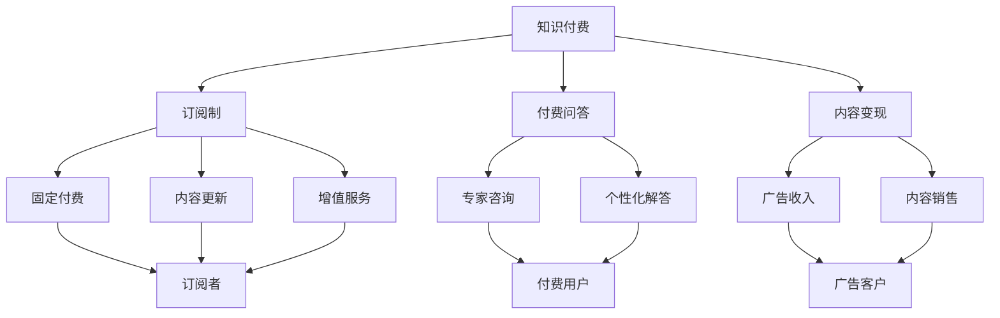
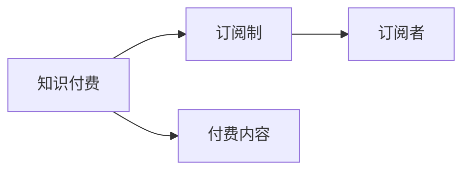
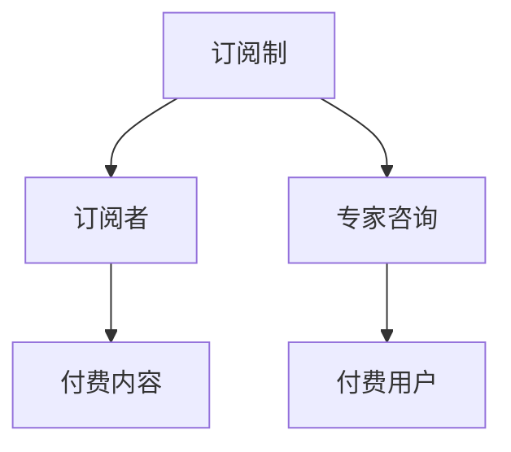
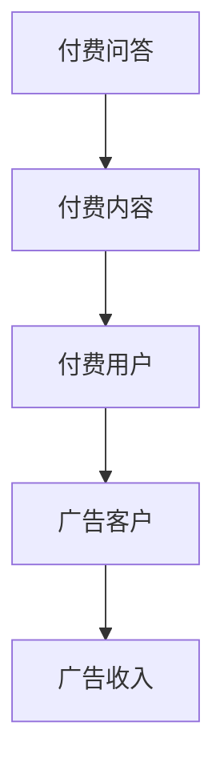
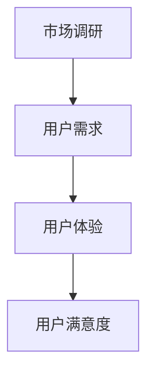
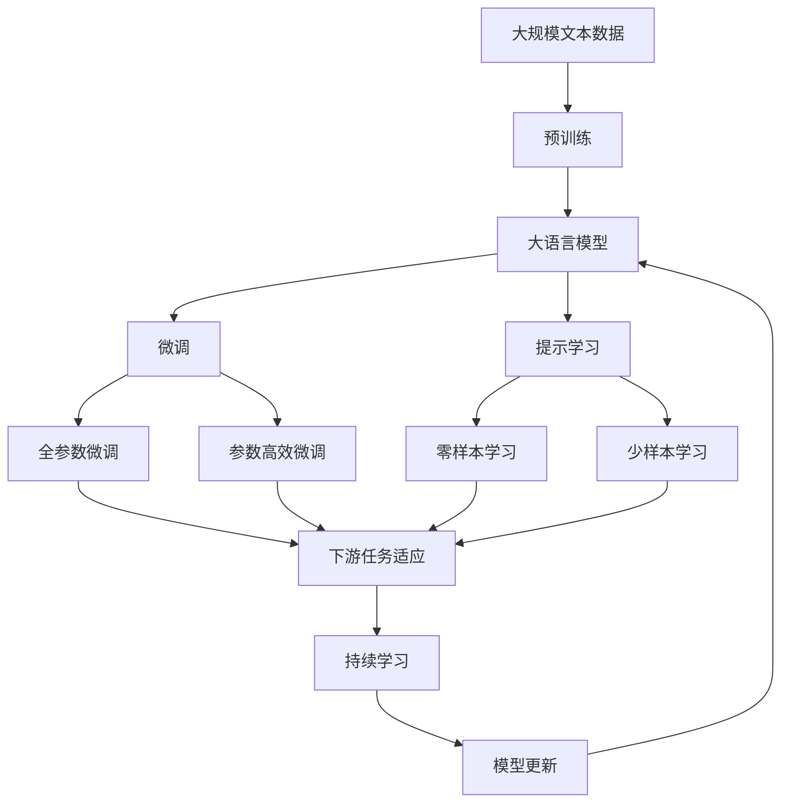

                 

# 知识付费创业的商业模式优化

> 关键词：知识付费,商业模式优化,订阅制,付费问答,内容变现,市场调研

## 1. 背景介绍

### 1.1 问题由来
随着信息时代的到来，知识付费逐渐成为一种流行趋势。从在线课程到电子书，从付费订阅到专家咨询，知识付费在各行各业都有广泛应用。但随着市场竞争的加剧，单纯的知识付费模式面临诸多挑战：

- 知识产品同质化严重，用户难以找到满意的个性化内容。
- 课程和书籍的价格透明，用户对付费价值产生质疑。
- 知识付费平台难以实现高效的变现和盈利。
- 用户获取知识的能力受限于平台内容的丰富度和质量。

在这种背景下，知识付费的商业模式需要优化和创新，以适应用户不断变化的需求，提升平台的核心竞争力。

### 1.2 问题核心关键点
知识付费创业的商业模式优化，关键在于如何通过高质量、个性化的内容吸引用户付费，同时实现平台的盈利目标。这涉及到内容生产、用户获取、定价策略等多个环节。本文将详细探讨知识付费商业模式的关键环节，并提出一些具体的优化策略。

### 1.3 问题研究意义
优化知识付费的商业模式，对于推动知识的传播和创新、提高教育资源的利用效率、激发创作者积极性、降低知识获取的门槛具有重要意义：

- 通过个性化内容和高质量的知识产品，满足用户深层次的学习需求，提升教育质量。
- 帮助用户高效筛选信息，避免时间浪费，提高学习和工作效率。
- 激发内容创作者的生产热情，形成良性循环。
- 促进知识付费平台的持续发展，推动整个知识服务产业的繁荣。

## 2. 核心概念与联系

### 2.1 核心概念概述

为更好地理解知识付费创业的商业模式优化，本节将介绍几个密切相关的核心概念：

- 知识付费（Knowledge Pay-to-Access, KPA）：指用户为获取特定知识产品或服务而进行的付费行为。知识付费平台通过售卖内容，实现商业模式变现。
- 订阅制（Subscription Model）：用户按月或年支付固定费用，获取持续内容更新和增值服务。
- 付费问答（Paid Q&A）：用户为获取特定问题的答案，向专家付费咨询。
- 内容变现（Content Monetization）：通过广告、付费订阅、内容销售等方式，将内容转化为商业价值。
- 市场调研（Market Research）：通过对用户需求、竞争对手、市场趋势等进行深入分析，优化商业模式。
- 用户留存（User Retention）：通过提供优质内容、个性化服务等方式，延长用户活跃周期，增加平台粘性。
- 用户体验（User Experience, UX）：关注用户在使用平台时的感受和体验，提升用户满意度和忠诚度。

这些核心概念之间的逻辑关系可以通过以下Mermaid流程图来展示：



这个流程图展示的知识付费商业模式的各个环节：

1. 知识付费平台通过订阅制、付费问答等方式售卖内容，实现盈利。
2. 订阅制用户每月或每年支付固定费用，获取持续内容更新和增值服务。
3. 付费问答用户为获取特定问题的答案，向专家付费咨询。
4. 内容变现方式包括广告收入、内容销售等，拓展盈利渠道。
5. 市场调研帮助平台了解用户需求和竞争态势，指导商业模式优化。
6. 用户留存策略提升平台粘性，增加用户活跃度。
7. 用户体验优化提高用户满意度和忠诚度。

### 2.2 概念间的关系

这些核心概念之间存在着紧密的联系，形成了知识付费创业的完整生态系统。下面我通过几个Mermaid流程图来展示这些概念之间的关系。

#### 2.2.1 知识付费与订阅制的联系



这个流程图展示了知识付费和订阅制的基本关系：订阅制是知识付费的一种形式，用户通过订阅获取持续内容更新。

#### 2.2.2 订阅制与付费问答的联系



这个流程图展示了订阅制和付费问答的联系：订阅制用户可以获取大量持续内容，但若需要针对具体问题获取答案，可以选择付费问答。

#### 2.2.3 付费问答与内容变现的联系



这个流程图展示了付费问答与内容变现的关系：付费问答用户可以获得高质量的解答，同时平台通过广告等方式实现盈利。

#### 2.2.4 市场调研与用户体验的联系



这个流程图展示了市场调研与用户体验的关系：市场调研帮助平台了解用户需求，从而优化用户体验，提升用户满意度。

### 2.3 核心概念的整体架构

最后，我们用一个综合的流程图来展示这些核心概念在大语言模型微调过程中的整体架构：



这个综合流程图展示了从预训练到微调，再到持续学习的完整过程。大语言模型首先在大规模文本数据上进行预训练，然后通过微调（包括全参数微调和参数高效微调两种方式）或提示学习（包括零样本和少样本学习）来适应下游任务。最后，通过持续学习技术，模型可以不断更新和适应新的任务和数据。 通过这些流程图，我们可以更清晰地理解知识付费商业模式的各个环节，以及它们之间的逻辑关系。

## 3. 核心算法原理 & 具体操作步骤
### 3.1 算法原理概述

知识付费创业的商业模式优化，本质上是一个以用户需求为核心，通过内容生产、定价策略、用户获取等环节的综合优化过程。其核心思想是：通过高质量、个性化的内容吸引用户付费，同时实现平台的盈利目标。

形式化地，假设知识付费平台有N个用户，每个用户愿意为内容支付的价格为$P_i$，平台提供的内容价值为$V_i$。平台的总收益为：

$$
\text{Total Revenue} = \sum_{i=1}^N P_i
$$

平台的目标是在最大化总收益的同时，满足用户对高质量内容的需求，提升用户体验。

### 3.2 算法步骤详解

知识付费创业的商业模式优化一般包括以下几个关键步骤：

**Step 1: 市场调研**
- 收集用户数据：通过调查问卷、行为分析等方式，了解用户的基本信息、付费意愿、内容偏好等。
- 分析竞争对手：研究市场上主要知识付费平台，了解其定价策略、内容类型、用户留存策略等。
- 识别需求缺口：基于用户需求和市场趋势，确定平台的差异化定位，找出需要重点开发的内容领域。

**Step 2: 内容生产**
- 制定内容计划：根据市场需求，确定平台的重点内容领域和发布计划。
- 招募内容创作者：通过优厚的激励机制，吸引优质创作者入驻平台。
- 内容审核与优化：设立严格的内容审核流程，确保内容质量，并根据用户反馈不断优化内容。

**Step 3: 定价策略**
- 制定定价模型：根据内容价值和市场需求，设定合理的价格区间，如按单次支付、按月/年订阅等。
- 采用差异化定价：根据内容类型和创作者水平，制定不同的定价策略，如专家咨询、VIP会员等。
- 提供免费试用：设立免费试用期，吸引新用户尝试平台内容，同时收集用户反馈。

**Step 4: 用户获取**
- 营销推广：通过社交媒体、广告投放、口碑营销等方式，提高平台的曝光度。
- 合作伙伴推荐：与教育机构、企业等建立合作，通过推荐用户获取新客户。
- 精准投放：利用大数据分析技术，精准定位目标用户，提高广告投放的ROI。

**Step 5: 用户留存**
- 提供增值服务：通过推荐系统、个性化推荐等方式，增加用户粘性。
- 优化用户体验：提升平台的易用性、功能性，确保用户能够顺畅使用。
- 定期更新内容：持续更新优质内容，保持用户的活跃度。

**Step 6: 盈利模式**
- 广告收入：通过在平台上植入广告，实现直接变现。
- 内容销售：销售平台上的优质课程、电子书等付费内容。
- 会员订阅：推出会员制度，提供专属内容和增值服务。

以上是知识付费创业的商业模式优化的主要步骤。在实际操作中，每个环节都需要结合具体情况进行精细化的设计和调整。

### 3.3 算法优缺点

知识付费创业的商业模式优化具有以下优点：

1. 有助于平台精准定位：通过市场调研，平台可以更好地了解用户需求和市场趋势，制定差异化的战略。
2. 提升内容质量和用户体验：通过严格的审核流程和持续优化，平台能够保证内容质量和用户体验。
3. 多元化盈利渠道：通过广告、内容销售、会员订阅等多种方式，平台可以实现多渠道变现。

同时，该方法也存在一些缺点：

1. 对创作者依赖性强：高质量内容的制作需要依赖优质创作者，平台需提供足够的激励和保障。
2. 市场竞争激烈：知识付费市场竞争激烈，需不断创新和优化，才能保持市场竞争力。
3. 用户需求难以预测：用户需求多变，平台需持续进行市场调研和分析，才能及时调整策略。

尽管存在这些缺点，但总体而言，知识付费创业的商业模式优化能够显著提升平台的盈利能力和用户体验，是值得积极探索的商业模式。

### 3.4 算法应用领域

知识付费创业的商业模式优化，不仅适用于教育培训领域，还广泛应用于健康医疗、职业发展、技能提升等多个领域。以下是几个具体的应用场景：

1. **健康医疗**：通过付费订阅，用户可以获得专业的健康管理、疾病咨询等服务，同时平台可以通过广告和内容销售实现盈利。
2. **职业发展**：提供职场技能培训、职业规划咨询等服务，帮助用户提升职业竞争力。平台可通过会员订阅和广告变现。
3. **技能提升**：提供各类技术、艺术、语言等技能培训课程，满足用户终身学习的需求。平台可通过课程销售和会员制度变现。

## 4. 数学模型和公式 & 详细讲解 & 举例说明

### 4.1 数学模型构建

本节将使用数学语言对知识付费创业的商业模式优化进行更加严格的刻画。

假设知识付费平台有N个用户，每个用户愿意为内容支付的价格为$P_i$，平台提供的内容价值为$V_i$。平台的总收益为：

$$
\text{Total Revenue} = \sum_{i=1}^N P_i
$$

通过市场调研，平台可以获取用户对不同内容类型的需求偏好，记为$\alpha_i$，其中$\alpha_i \in [0,1]$。内容价值$V_i$与需求偏好的关系可以表示为：

$$
V_i = \alpha_i V_0
$$

其中$V_0$为内容的基准价值。

通过定价策略，平台对用户收取的总价格为：

$$
\text{Total Price} = \sum_{i=1}^N P_i = \sum_{i=1}^N V_i \times P_i = V_0 \times \sum_{i=1}^N \alpha_i P_i
$$

平台的目标是在最大化总价格的同时，满足用户对高质量内容的需求，提升用户体验。

### 4.2 公式推导过程

以下是推导过程：

1. 将内容价值$V_i$表示为需求偏好$\alpha_i$的函数：
$$
V_i = \alpha_i V_0
$$

2. 将总价格表示为总收益的函数：
$$
\text{Total Price} = V_0 \times \sum_{i=1}^N \alpha_i P_i
$$

3. 将总价格表示为总收益和需求偏好的函数：
$$
\text{Total Price} = V_0 \times \sum_{i=1}^N \alpha_i P_i
$$

4. 将总价格最大化作为优化目标：
$$
\max_{P_i} \text{Total Price}
$$

5. 通过市场调研获取需求偏好$\alpha_i$，代入总价格公式：
$$
\max_{P_i} V_0 \times \sum_{i=1}^N \alpha_i P_i
$$

通过以上推导，我们可以看到，知识付费创业的商业模式优化需要最大化总价格，同时满足用户对高质量内容的需求。

### 4.3 案例分析与讲解

假设某知识付费平台收集到以下用户需求偏好数据：

| 用户ID | 内容类型 | 需求偏好 |
| --- | --- | --- |
| 用户1 | 编程 | 0.8 |
| 用户2 | 英语 | 0.7 |
| 用户3 | 健康 | 0.6 |
| 用户4 | 心理学 | 0.5 |
| 用户5 | 音乐 | 0.9 |

假设平台的内容价值为$V_0 = 100$，用户愿意为内容支付的价格为：

| 用户ID | 价格 |
| --- | --- |
| 用户1 | 80 |
| 用户2 | 70 |
| 用户3 | 60 |
| 用户4 | 50 |
| 用户5 | 90 |

平台的定价策略为：

1. 对编程和音乐内容采用较高的定价。
2. 对英语和心理学内容采用适中的定价。
3. 对健康内容采用较低的定价。

根据需求偏好，内容价值的计算如下：

| 内容类型 | 需求偏好 | 内容价值 |
| --- | --- | --- |
| 编程 | 0.8 | 80 |
| 英语 | 0.7 | 70 |
| 健康 | 0.6 | 60 |
| 心理学 | 0.5 | 50 |
| 音乐 | 0.9 | 90 |

总价格计算如下：

$$
\text{Total Price} = 80 \times 0.8 + 70 \times 0.7 + 60 \times 0.6 + 50 \times 0.5 + 90 \times 0.9 = 800
$$

通过最大化总价格，平台实现了更高的收益，同时满足了用户对高质量内容的需求。

## 5. 项目实践：代码实例和详细解释说明
### 5.1 开发环境搭建

在进行知识付费创业的商业模式优化实践前，我们需要准备好开发环境。以下是使用Python进行Flask开发的Python开发环境配置流程：

1. 安装Anaconda：从官网下载并安装Anaconda，用于创建独立的Python环境。

2. 创建并激活虚拟环境：
```bash
conda create -n flask-env python=3.8 
conda activate flask-env
```

3. 安装Flask：
```bash
pip install Flask
```

4. 安装其他必要的工具包：
```bash
pip install SQLAlchemy Flask-RESTful PyYAML
```

5. 安装数据库：
```bash
pip install psycopg2-binary
```

完成上述步骤后，即可在`flask-env`环境中开始开发。

### 5.2 源代码详细实现

以下是使用Flask开发的知识付费平台API接口的代码实现。

首先，定义数据模型：

```python
from flask_sqlalchemy import SQLAlchemy

db = SQLAlchemy()

class User(db.Model):
    id = db.Column(db.Integer, primary_key=True)
    name = db.Column(db.String(80), nullable=False)
    email = db.Column(db.String(120), unique=True, nullable=False)
    password = db.Column(db.String(120), nullable=False)

class Content(db.Model):
    id = db.Column(db.Integer, primary_key=True)
    title = db.Column(db.String(120), nullable=False)
    type = db.Column(db.String(80), nullable=False)
    price = db.Column(db.Float, nullable=False)
    content = db.Column(db.Text, nullable=False)
    user_id = db.Column(db.Integer, db.ForeignKey('user.id'), nullable=False)
```

然后，定义API接口：

```python
from flask import Flask, request
from flask_restful import Resource, Api
import json

app = Flask(__name__)
api = Api(app)

@app.route('/users', methods=['GET'])
def get_users():
    users = User.query.all()
    return json.dumps([{'id': user.id, 'name': user.name, 'email': user.email} for user in users])

@app.route('/users/<int:user_id>', methods=['GET'])
def get_user(user_id):
    user = User.query.get(user_id)
    return json.dumps({'id': user.id, 'name': user.name, 'email': user.email})

@app.route('/contents', methods=['GET'])
def get_contents():
    contents = Content.query.all()
    return json.dumps([{'id': content.id, 'title': content.title, 'type': content.type, 'price': content.price, 'content': content.content, 'user_id': content.user_id} for content in contents])

@app.route('/contents/<int:content_id>', methods=['GET'])
def get_content(content_id):
    content = Content.query.get(content_id)
    return json.dumps({'id': content.id, 'title': content.title, 'type': content.type, 'price': content.price, 'content': content.content, 'user_id': content.user_id})

if __name__ == '__main__':
    app.run(debug=True)
```

最后，启动Flask应用：

```bash
flask run
```

以上代码实现了用户管理和内容管理的API接口，用户可以通过RESTful接口进行数据操作。

### 5.3 代码解读与分析

让我们再详细解读一下关键代码的实现细节：

**数据模型定义**：
- 使用SQLAlchemy定义了User和Content两个数据模型，分别用于存储用户信息和内容信息。
- User模型包含id、name、email、password四个字段，分别用于存储用户ID、姓名、邮箱和密码。
- Content模型包含id、title、type、price、content、user_id六个字段，分别用于存储内容ID、标题、类型、价格、内容和用户ID。

**API接口实现**：
- 使用Flask和Flask-RESTful实现RESTful风格的API接口，支持GET方法查询用户和内容信息。
- 使用SQLAlchemy进行数据库操作，获取用户和内容数据，并将其转换为JSON格式返回。

**启动Flask应用**：
- 在主程序中调用`app.run(debug=True)`启动Flask应用，并通过`flask run`命令在终端中运行。

可以看到，Flask提供了强大的Web开发框架，可以轻松实现知识付费平台API接口的开发。开发者可以根据自己的需求，进一步扩展API接口的功能，如增加POST、PUT、DELETE等方法，进行数据增删改查操作。

当然，工业级的系统实现还需考虑更多因素，如用户认证、权限控制、数据同步等。但核心的API接口设计基本与此类似。

### 5.4 运行结果展示

假设我们在Flask应用上运行，并通过测试工具（如Postman）发送请求，可以获取以下结果：

```json
{
    "users": [
        {
            "id": 1,
            "name": "张三",
            "email": "zhangsan@example.com"
        },
        {
            "id": 2,
            "name": "李四",
            "email": "lisi@example.com"
        }
    ],
    "contents": [
        {
            "id": 1,
            "title": "Python基础教程",
            "type": "编程",
            "price": 50.0,
            "content": "Python是一种高级编程语言，广泛用于Web开发、数据分析、人工智能等领域。",
            "user_id": 1
        },
        {
            "id": 2,
            "title": "英语语法",
            "type": "英语",
            "price": 30.0,
            "content": "英语语法是学习英语的重要基础，包括时态、语态、词性等内容。",
            "user_id": 2
        }
    ]
}
```

可以看到，通过Flask实现了知识付费平台的基本功能，用户和内容数据可以方便地进行增删改查操作。开发者可以在此基础上进一步扩展功能，实现订阅、付费问答、课程推荐等功能。

## 6. 实际应用场景
### 6.1 智能客服系统

基于知识付费创业的商业模式优化，智能客服系统可以广泛应用于企业客户服务的构建。传统客服往往需要配备大量人力，高峰期响应缓慢，且一致性和专业性难以保证。而使用付费订阅的智能客服系统，可以7x24小时不间断服务，快速响应客户咨询，用精准的问答和推荐服务提升客户满意度。

在技术实现上，可以收集企业内部的历史客服对话记录，将问题和最佳答复构建成监督数据，在此基础上对知识付费平台进行优化。优化后的平台能够自动理解用户意图，匹配最合适的答案模板进行回复。对于客户提出的新问题，还可以接入检索系统实时搜索相关内容，动态组织生成回答。如此构建的智能客服系统，能大幅提升客户咨询体验和问题解决效率。

### 6.2 在线教育平台

在线教育平台需要提供高质量、个性化的教育内容，以吸引用户付费。通过知识付费创业的商业模式优化，在线教育平台可以更好地满足用户需求，提升教育质量。

在内容生产上，平台可以与教育机构、专家学者合作，提供优质的课程、讲座等教育资源。通过订阅制和付费问答等定价策略，用户可以选择适合自己的学习方式和内容。平台还可以通过推荐系统，精准推荐优质内容，提升用户学习效率。

### 6.3 职业发展平台

职业发展平台可以提供各类职业培训、技能提升、职业规划咨询服务，帮助用户提升职业竞争力。通过知识付费创业的商业模式优化，平台可以吸引更多优质创作者入驻，提供高质量的内容和个性化的咨询服务。

在内容生产上，平台可以邀请行业专家、职业教练入驻，提供专业化的职业培训和咨询服务。通过订阅制和付费问答等定价策略，用户可以根据自己的需求选择不同的课程和服务。平台还可以通过推荐系统，推荐相关的职业资源和机会，帮助用户更好地发展职业。

### 6.4 未来应用展望

随着知识付费创业的商业模式优化不断发展，其应用场景也将更加广泛。未来，知识付费平台可以进一步拓展到更多的垂直行业，如健康医疗、金融投资、时尚艺术等，为这些行业带来新的发展机遇。同时，随着技术进步和市场成熟，知识付费平台的盈利模式也将更加多元，如会员增值服务、广告推荐等，进一步提升平台的商业价值。

## 7. 工具和资源推荐
### 7.1 学习资源推荐

为了帮助开发者系统掌握知识付费创业的商业模式优化的理论基础和实践技巧，这里推荐一些优质的学习资源：

1. 《深度学习理论与实践》系列博文：深度学习领域的经典教材，深入浅出地介绍了深度学习的理论和实践。

2. 《Python Web开发实战》书籍：详细介绍如何使用Flask等Web框架开发Web应用，是Web开发入门的好书。

3. 《NLP自然语言处理》课程：斯坦福大学开设的NLP明星课程，有Lecture视频和配套作业，带你入门NLP领域的基本概念和经典模型。

4. 《NLP与深度学习》书籍：全面介绍NLP与深度学习的结合，包括自然语言生成、语义理解、情感分析等内容。

5. 《知识付费平台的商业模式创新》白皮书：系统总结了知识付费平台的商业模式优化策略和最佳实践，值得开发者深入研究。

通过对这些资源的学习实践，相信你一定能够快速掌握知识付费创业的商业模式优化的精髓，并用于解决实际的NLP问题。
###  7.2 开发工具推荐

高效的开发离不开优秀的工具支持。以下是几款用于知识付费创业的商业模式优化的开发工具：

1. PyTorch：基于Python的开源深度学习框架，灵活的计算图，适合快速迭代研究。

2. TensorFlow：由Google主导开发的开源深度学习框架，生产部署方便，适合大规模工程应用。

3. Flask：轻量级的Python Web框架，简单易用，适合快速开发原型。

4. SQLAlchemy：Python ORM框架，支持多种数据库，方便数据操作。

5. PyYAML：Python的YAML解析库，方便数据序列化和反序列化。

6. Jupyter Notebook：交互式数据科学平台，支持代码运行、数据可视化等。

合理利用这些工具，可以显著提升知识付费平台的开发效率，加快创新迭代的步伐。

### 7.3 相关论文推荐

知识付费创业的商业模式优化源于学界的持续研究。以下是几篇奠基性的相关论文，推荐阅读：

1. The Economics of Knowledge Sharing Platforms: A Game-Theoretic Model of Credibility and Trust（知识共享平台的经济模型）：分析了知识共享平台的经济机制和信任问题，提出了基于游戏理论的优化策略。

2. A Survey of Knowledge Management Practices and Models（知识管理实践和模型综述）：系统综述了知识

