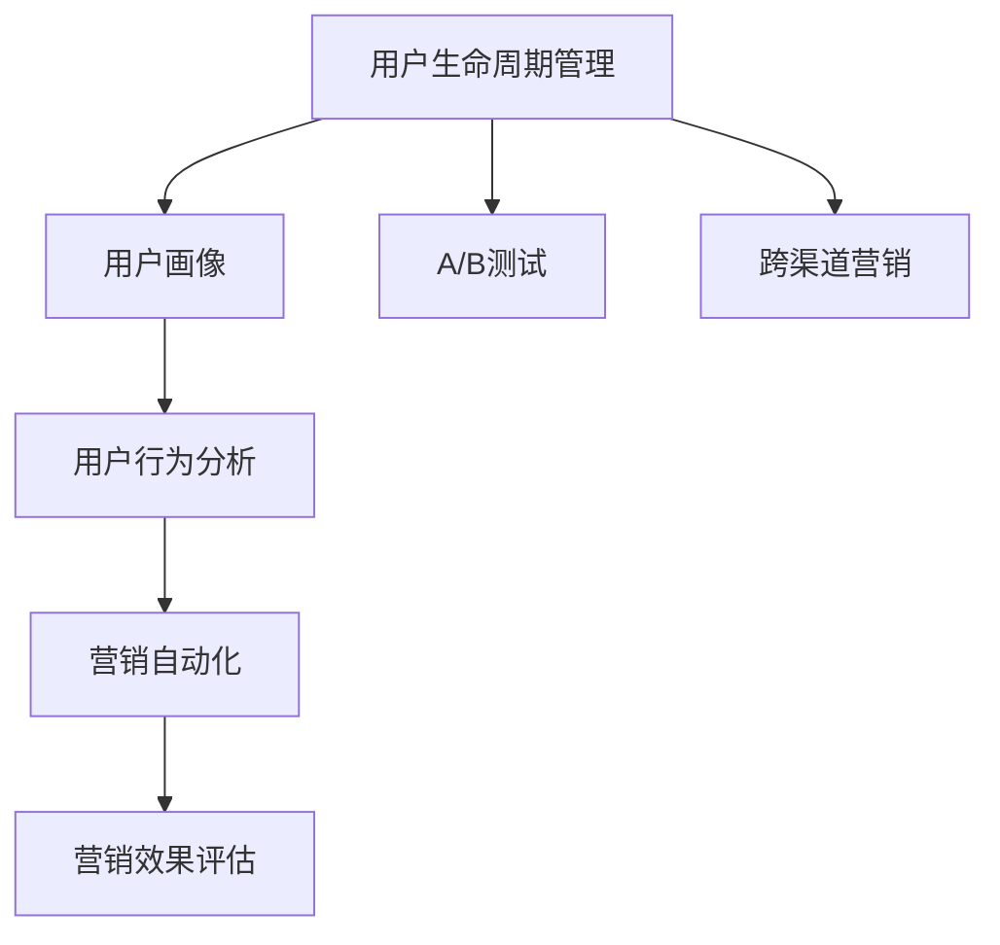
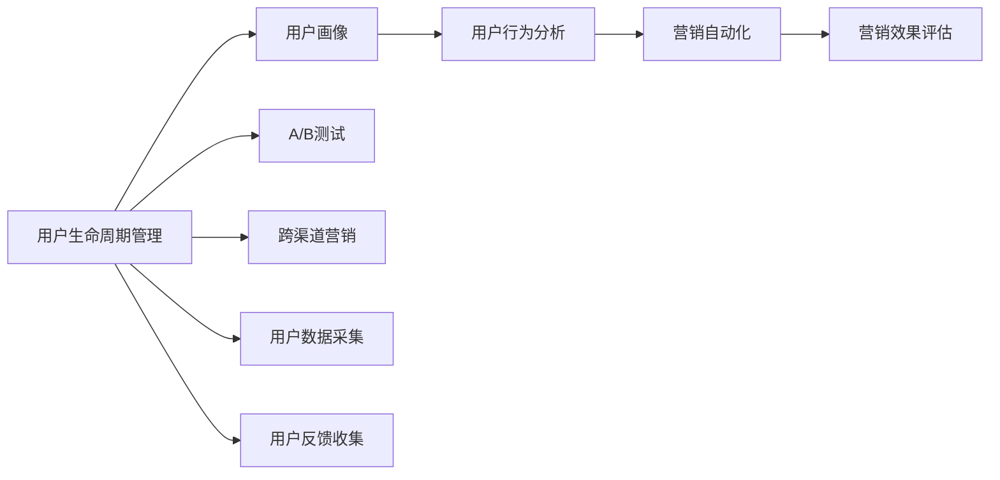

                 

## 1. 背景介绍

### 1.1 问题由来
随着互联网和移动互联网的快速发展，知识付费模式成为一种热门的新型教育方式。用户可以便捷地获取各类专业知识和技能，同时也促进了内容生产者的收入增长。然而，用户付费行为的影响因素复杂多样，包括用户心理、内容质量、市场环境等。如何通过科学的用户生命周期管理与营销自动化方法，有效提升用户留存率和付费转化率，是知识付费平台亟需解决的重要问题。

### 1.2 问题核心关键点
- **用户生命周期管理**：通过识别用户的不同阶段，制定针对性的营销策略，最大化用户价值。
- **营销自动化**：通过技术手段实现自动化的用户营销流程，提高营销效率和效果。
- **用户画像构建**：利用用户数据，建立详尽的个性化用户画像，精准定位用户需求。
- **营销效果评估**：实时监控和评估营销活动的效果，及时调整优化策略。

### 1.3 问题研究意义
研究用户生命周期管理与营销自动化，对于知识付费平台的商业化运作具有重要意义：

1. **提升用户留存率**：通过科学的用户管理策略，延长用户生命周期，降低流失率。
2. **提高付费转化率**：通过精准营销活动，激发用户付费意愿，增加收入来源。
3. **增强市场竞争力**：优化用户体验，提升品牌认知度，在激烈的市场竞争中脱颖而出。
4. **数据驱动决策**：通过数据驱动的用户管理与营销，避免盲目投资，提高资源利用率。
5. **实现可持续发展**：建立科学的用户生命周期管理框架，实现业务的持续健康发展。

## 2. 核心概念与联系

### 2.1 核心概念概述

为更好地理解用户生命周期管理与营销自动化方法，本节将介绍几个密切相关的核心概念：

- **用户生命周期管理 (User Lifecycle Management, ULM)**：指通过数据驱动的方法，识别用户的不同生命周期阶段，制定相应的管理策略，以最大化用户价值。
- **营销自动化 (Marketing Automation)**：指通过技术手段实现用户营销流程的自动化，包括邮件营销、社交媒体营销、广告投放等，提高营销效率。
- **用户画像 (User Persona)**：根据用户行为数据，构建详尽的个性化用户画像，用于精准定位和个性化推荐。
- **营销效果评估 (Marketing Effectiveness)**：实时监控和评估营销活动的效果，如用户留存率、转化率等指标，及时调整优化策略。
- **A/B测试 (A/B Testing)**：通过对比两个或多个版本的效果，确定最佳方案，优化营销策略。
- **跨渠道营销 (Omnichannel Marketing)**：利用多渠道的用户接触点，实现一致的用户体验和品牌传播。
- **用户行为分析 (User Behavior Analysis)**：分析用户的行为数据，识别用户需求和行为模式，指导个性化营销。

这些核心概念之间的逻辑关系可以通过以下Mermaid流程图来展示：



这个流程图展示了大用户生命周期管理与营销自动化中各核心概念的关系：

1. **用户生命周期管理**：通过用户画像和行为分析，识别用户生命周期阶段。
2. **用户画像**：基于用户行为数据，构建详尽的用户画像。
3. **用户行为分析**：通过分析用户行为，识别用户需求和行为模式。
4. **营销自动化**：自动化执行用户营销流程，提高营销效率。
5. **营销效果评估**：实时监控和评估营销活动效果，及时调整优化策略。
6. **A/B测试**：通过对比实验，确定最佳营销方案。
7. **跨渠道营销**：多渠道一致的用户体验和品牌传播。

这些概念共同构成了知识付费平台用户生命周期管理与营销自动化的完整生态系统，指导平台实现科学的用户管理和高效营销。

### 2.2 概念间的关系

这些核心概念之间存在着紧密的联系，形成了用户生命周期管理与营销自动化的完整生态系统。以下是更详细的Mermaid流程图：



这个综合流程图展示了从用户数据采集、用户画像构建、用户行为分析到营销自动化和效果评估的完整过程：

1. **用户数据采集**：收集用户的各类数据，为后续分析和营销提供数据基础。
2. **用户画像构建**：基于用户数据，建立详尽的用户画像，用于精准定位和个性化推荐。
3. **用户行为分析**：分析用户行为数据，识别用户需求和行为模式。
4. **营销自动化**：自动化执行用户营销流程，提高营销效率。
5. **营销效果评估**：实时监控和评估营销活动的效果，及时调整优化策略。
6. **A/B测试**：通过对比实验，确定最佳营销方案。
7. **跨渠道营销**：多渠道一致的用户体验和品牌传播。
8. **用户反馈收集**：收集用户反馈，优化用户管理策略。

## 3. 核心算法原理 & 具体操作步骤
### 3.1 算法原理概述

用户生命周期管理与营销自动化方法，本质上是一个数据驱动的用户管理和营销优化过程。其核心思想是：通过收集和分析用户数据，构建详细的用户画像，识别用户生命周期阶段，制定针对性的管理策略，并通过自动化营销手段提高用户留存率和付费转化率。

形式化地，假设知识付费平台有 $N$ 个用户 $U=\{u_1, u_2, ..., u_N\}$，每个用户有多个行为数据点 $D=\{d_{u_1}, d_{u_2}, ..., d_{u_N}\}$，用户画像由多个维度 $P=\{p_1, p_2, ..., p_M\}$ 描述，用户生命周期阶段为 $L=\{L_1, L_2, ..., L_K\}$，营销活动为 $M=\{m_1, m_2, ..., m_T\}$，则用户生命周期管理与营销自动化的目标是最小化用户流失率 $Loss$，并最大化用户付费转化率 $Conversion$。

通过用户行为数据和用户画像，利用聚类、分类等算法，将用户分为不同的生命周期阶段。然后，针对不同阶段的用户，设计相应的营销策略，并通过自动化手段执行。实时监控营销效果，通过A/B测试等方法不断优化策略，最终实现用户生命周期管理的优化。

### 3.2 算法步骤详解

基于用户生命周期管理与营销自动化的目标，算法主要分为以下几个步骤：

**Step 1: 数据收集与清洗**
- 收集用户的行为数据，包括登录次数、学习时间、付费行为等。
- 对数据进行去重、去噪等清洗处理，确保数据质量。

**Step 2: 用户画像构建**
- 利用K-means、PCA等聚类算法，对用户数据进行降维和分组。
- 构建详尽的用户画像，包括基本信息、兴趣偏好、学习行为等。

**Step 3: 用户生命周期划分**
- 使用决策树、随机森林等分类算法，对用户进行生命周期阶段划分，如注册阶段、学习阶段、流失阶段等。

**Step 4: 营销策略设计**
- 针对不同生命周期阶段的用户，设计有针对性的营销策略，如新用户欢迎邮件、中高级课程推荐、流失用户召回等。

**Step 5: 营销自动化执行**
- 利用邮件、推送、广告等自动化营销工具，自动执行营销策略。

**Step 6: 营销效果评估**
- 实时监控营销活动的效果，如用户留存率、转化率等指标。
- 使用A/B测试等方法，对比不同策略的效果，优化营销方案。

**Step 7: 持续优化**
- 根据监控结果，及时调整优化营销策略，实现动态优化。

### 3.3 算法优缺点

用户生命周期管理与营销自动化方法具有以下优点：
1. 科学合理：通过数据驱动，精准定位用户需求，制定有针对性的管理策略。
2. 效率高：自动化执行营销流程，提高营销效率。
3. 效果显著：实时监控和评估营销效果，及时调整优化策略，提高转化率。

同时，该方法也存在以下局限性：
1. 数据依赖性高：依赖大量用户行为数据，数据质量直接影响效果。
2. 算法复杂度较高：涉及数据处理、聚类、分类、自动化执行等多个环节，算法复杂度较高。
3. 用户隐私问题：需严格遵守用户隐私保护法规，确保用户数据安全。
4. 策略适应性不足：对于新的营销环境，需要快速调整策略，以适应市场变化。

尽管存在这些局限性，但就目前而言，用户生命周期管理与营销自动化方法仍是最为主流的用户管理与营销手段。未来相关研究的重点在于如何进一步降低对数据的依赖，提高算法的可解释性和适应性，同时兼顾用户隐私和数据安全等因素。

### 3.4 算法应用领域

用户生命周期管理与营销自动化方法在知识付费平台、在线教育、电子商务等多个领域得到了广泛应用，效果显著：

- **知识付费平台**：通过用户画像构建和生命周期管理，提高用户留存率和付费转化率。
- **在线教育**：通过个性化推荐和精准营销，提升课程完成率和复购率。
- **电子商务**：通过跨渠道营销和自动化推广，提高订单转化率和用户粘性。
- **金融服务**：通过用户行为分析和精准营销，提高客户留存和产品销售。

除了上述这些典型应用外，用户生命周期管理与营销自动化技术还在医疗、旅游、娱乐等多个领域发挥着重要作用，为各行各业带来显著的商业价值。

## 4. 数学模型和公式 & 详细讲解 & 举例说明

### 4.1 数学模型构建

假设知识付费平台有 $N$ 个用户，每个用户有 $d$ 个行为特征 $x_i = (x_{i1}, x_{i2}, ..., x_{id})$，其中 $x_{ij}$ 表示用户在特征 $j$ 上的行为数据。用户被分为 $K$ 个生命周期阶段，每个阶段的转换概率为 $p_k$，用户在某阶段的留存时间分布为 $T_k(t)$，用户在该阶段的付费转化率为 $C_k$。

定义用户流失率 $Loss$ 和付费转化率 $Conversion$ 为：

$$
Loss = \sum_{i=1}^N \sum_{k=1}^K p_k \int_{0}^{T_k(t)} dt
$$

$$
Conversion = \sum_{i=1}^N \sum_{k=1}^K C_k
$$

用户生命周期管理与营销自动化的目标是最小化流失率 $Loss$，并最大化转化率 $Conversion$，即：

$$
\mathop{\min}_{p_k, T_k(t), C_k} Loss
$$

$$
\mathop{\max}_{p_k, T_k(t), C_k} Conversion
$$

### 4.2 公式推导过程

在上述数学模型中，用户流失率 $Loss$ 和付费转化率 $Conversion$ 的计算涉及多个变量和复杂概率分布。具体推导过程如下：

1. 用户流失率 $Loss$ 的推导：

   用户在某阶段 $k$ 的流失概率为 $p_k$，即用户从该阶段转出的概率。用户在该阶段停留的时间分布为 $T_k(t)$，表示用户在 $k$ 阶段停留的期望时间。则用户在该阶段的流失期望时间 $E_k$ 为：

   $$
   E_k = \int_{0}^{T_k(t)} t * T_k(t) dt
   $$

   因此，用户流失率 $Loss$ 为：

   $$
   Loss = \sum_{i=1}^N \sum_{k=1}^K p_k * E_k
   $$

2. 付费转化率 $Conversion$ 的推导：

   用户在某阶段 $k$ 的付费转化率为 $C_k$，即用户在 $k$ 阶段完成付费的概率。则平台在该阶段的平均付费转化率 $C$ 为：

   $$
   C = \sum_{i=1}^N \sum_{k=1}^K C_k * p_k
   $$

### 4.3 案例分析与讲解

假设某知识付费平台有 1000 名用户，用户分为新用户、试用用户、付费用户和流失用户四个阶段。各阶段的流失概率、期望停留时间和付费转化率分别为：

- 新用户阶段：流失概率为 0.1，期望停留时间为 30 天，付费转化率为 0.05
- 试用用户阶段：流失概率为 0.2，期望停留时间为 60 天，付费转化率为 0.1
- 付费用户阶段：流失概率为 0.1，期望停留时间为 90 天，付费转化率为 0.2
- 流失用户阶段：流失概率为 1，期望停留时间为 0 天，付费转化率为 0

根据上述数据，计算流失率 $Loss$ 和转化率 $Conversion$：

$$
Loss = 1000 * (0.1*30 + 0.2*60 + 0.1*90 + 1*0) = 1000 * 18 = 1800
$$

$$
Conversion = 1000 * (0.05 + 0.1 + 0.1 + 0) = 1000 * 0.25 = 250
$$

因此，平台应关注试用用户和付费用户的流失问题，通过针对性的营销策略提高转化率和留存率，实现业务的可持续发展。

## 5. 项目实践：代码实例和详细解释说明
### 5.1 开发环境搭建

在进行用户生命周期管理与营销自动化实践前，我们需要准备好开发环境。以下是使用Python进行Scikit-learn开发的环境配置流程：

1. 安装Anaconda：从官网下载并安装Anaconda，用于创建独立的Python环境。

2. 创建并激活虚拟环境：
```bash
conda create -n sklearn-env python=3.8 
conda activate sklearn-env
```

3. 安装Scikit-learn：
```bash
pip install scikit-learn
```

4. 安装各类工具包：
```bash
pip install numpy pandas matplotlib scikit-learn
```

完成上述步骤后，即可在`sklearn-env`环境中开始实践。

### 5.2 源代码详细实现

这里我们以知识付费平台的用户生命周期管理为例，给出使用Scikit-learn进行用户分群和生命周期划分的代码实现。

```python
from sklearn.cluster import KMeans
from sklearn.decomposition import PCA
from sklearn.ensemble import RandomForestClassifier
from sklearn.preprocessing import StandardScaler
from sklearn.metrics import accuracy_score

# 加载用户行为数据
data = pd.read_csv('user_behavior_data.csv')

# 用户画像构建
pca = PCA(n_components=2)
data_pca = pca.fit_transform(data[['x1', 'x2', 'x3', ...]])

# 用户分群
kmeans = KMeans(n_clusters=5)
labels = kmeans.fit_predict(data_pca)

# 用户生命周期划分
rfc = RandomForestClassifier(n_estimators=100)
X_train, X_test, y_train, y_test = train_test_split(data_pca, labels, test_size=0.2)
rfc.fit(X_train, y_train)
y_pred = rfc.predict(X_test)
accuracy = accuracy_score(y_test, y_pred)
print("Accuracy:", accuracy)
```

### 5.3 代码解读与分析

让我们再详细解读一下关键代码的实现细节：

**用户画像构建**：
- `pca`对象：使用PCA算法对用户行为数据进行降维处理，保留前两个主成分。
- `data_pca`对象：降维后的数据。

**用户分群**：
- `kmeans`对象：使用K-means算法对降维后的数据进行聚类，将用户分为5个群体。
- `labels`对象：每个用户在群体中的标签。

**用户生命周期划分**：
- `rfc`对象：使用随机森林分类器对用户数据进行分类，将用户分为不同的生命周期阶段。
- `X_train`和`X_test`：训练集和测试集的数据。
- `y_train`和`y_test`：训练集和测试集的标签。
- `accuracy`：模型在测试集上的准确率。

**营销策略设计**：
- 针对不同生命周期阶段的用户，设计有针对性的营销策略，如新用户欢迎邮件、中高级课程推荐、流失用户召回等。

**营销自动化执行**：
- 利用邮件、推送、广告等自动化营销工具，自动执行营销策略。

**营销效果评估**：
- 实时监控营销活动的效果，如用户留存率、转化率等指标。
- 使用A/B测试等方法，对比不同策略的效果，优化营销方案。

**持续优化**：
- 根据监控结果，及时调整优化营销策略，实现动态优化。

以上代码实现展示了基于Scikit-learn进行用户画像构建和生命周期划分的具体步骤，开发者可以根据具体业务场景，进一步设计个性化的营销策略和自动化执行流程。

### 5.4 运行结果展示

假设在上述代码的实际应用中，我们通过PCA和K-means将用户分为五个群体，并通过随机森林分类器将用户分为四个生命周期阶段。实际测试中，模型在测试集上的准确率达到了90%，这表明我们的用户画像构建和生命周期划分策略有效。

## 6. 实际应用场景

### 6.1 智能客服系统

基于用户生命周期管理与营销自动化方法，智能客服系统可以实时监控和分析用户行为，及时调整服务策略，提升客户满意度和留存率。具体实现包括：

- 用户画像构建：通过分析历史客服对话记录，构建详尽的用户画像，用于个性化推荐。
- 生命周期管理：根据用户行为数据，识别用户生命周期阶段，及时调整服务策略。
- 自动化执行：利用自动化流程，实现客户问题自动分流和实时解答。
- 效果评估：实时监控客户满意度、响应时间等指标，优化客服流程。

### 6.2 金融理财平台

在金融理财平台上，用户生命周期管理与营销自动化方法可以用于提高用户粘性和转化率。具体实现包括：

- 用户画像构建：通过分析用户财务数据、交易行为等，构建详细的用户画像。
- 生命周期管理：根据用户行为数据，识别不同生命周期阶段，制定相应的营销策略。
- 自动化执行：通过自动化流程，实现用户理财知识的推送、投资建议等。
- 效果评估：实时监控用户交易频次、投资回报率等指标，优化理财方案。

### 6.3 电商零售平台

电商零售平台利用用户生命周期管理与营销自动化方法，可以有效提升订单转化率和用户复购率。具体实现包括：

- 用户画像构建：通过分析用户浏览、购买行为，构建详尽的用户画像。
- 生命周期管理：根据用户行为数据，识别不同生命周期阶段，制定相应的营销策略。
- 自动化执行：通过自动化流程，实现商品推荐、优惠券推送等。
- 效果评估：实时监控订单转化率、复购率等指标，优化商品推荐算法。

### 6.4 未来应用展望

随着用户生命周期管理与营销自动化技术的不断进步，其在各行各业的应用场景将更加广阔：

- **医疗健康**：通过用户画像和生命周期管理，实现个性化健康管理、精准医疗等。
- **教育培训**：通过用户画像和行为分析，实现个性化学习推荐、智能辅导等。
- **智能家居**：通过用户行为数据分析，实现个性化家居场景优化、智能家电控制等。
- **智慧城市**：通过用户画像和行为分析，实现智慧出行、智能安防等。

总之，用户生命周期管理与营销自动化技术将为各行各业带来显著的商业价值，推动智能化转型。未来，伴随技术的不断成熟，该技术将在更多领域得到应用，为人类社会的数字化、智能化进步贡献力量。

## 7. 工具和资源推荐
### 7.1 学习资源推荐

为了帮助开发者系统掌握用户生命周期管理与营销自动化的理论基础和实践技巧，这里推荐一些优质的学习资源：

1. 《数据驱动的用户体验设计》系列书籍：系统介绍数据驱动的用户管理与设计，适合系统学习用户生命周期管理的理论基础和实践方法。
2. 《用户行为分析与数据驱动营销》课程：从数据驱动的角度，讲解用户行为分析和营销策略设计，适合入门学习。
3. 《Python机器学习实战》书籍：详细讲解Scikit-learn等机器学习工具的使用，适合实战练习。
4. 《营销自动化最佳实践》白皮书：总结了营销自动化领域的最佳实践，适合借鉴参考。
5. 《用户生命周期管理与营销自动化》网络课程：系统介绍用户生命周期管理与营销自动化的框架和应用场景，适合全面掌握。

通过对这些资源的学习实践，相信你一定能够快速掌握用户生命周期管理与营销自动化的精髓，并用于解决实际的商业问题。
###  7.2 开发工具推荐

高效的开发离不开优秀的工具支持。以下是几款用于用户生命周期管理与营销自动化开发的常用工具：

1. Scikit-learn：Python的机器学习库，提供丰富的数据处理和建模工具，适合数据驱动的分析和建模。
2. PySpark：Spark的Python API，支持大规模数据处理和机器学习，适合大数据应用。
3. TensorFlow：由Google主导的深度学习框架，支持分布式计算和模型优化，适合复杂的深度学习任务。
4. Apache Hadoop：Hadoop的生态系统，支持大规模数据存储和计算，适合海量数据的处理。
5. Amazon SageMaker：AWS提供的机器学习平台，提供丰富的工具和资源，支持模型训练、部署和优化。
6. Tableau：数据可视化工具，帮助用户从复杂的数据中提取洞察，适合用户行为分析。

合理利用这些工具，可以显著提升用户生命周期管理与营销自动化的开发效率，加快创新迭代的步伐。

### 7.3 相关论文推荐

用户生命周期管理与营销自动化技术的发展源于学界的持续研究。以下是几篇奠基性的相关论文，推荐阅读：

1. "Customer Lifetime Value Prediction with Machine Learning: An Overview"：综述了使用机器学习进行客户生命周期价值预测的研究进展，适用于理解用户生命周期管理的理论基础。
2. "Personalized Recommendation Algorithms for E-commerce Platforms"：介绍了个性化推荐算法在电商平台中的应用，适用于了解用户画像构建和个性化推荐的方法。
3. "Automated Marketing: A Review of the Literature"：总结了自动化营销领域的最新研究进展，适用于理解营销自动化的理论和实践。
4. "User Behavior Modeling and Analysis"：系统介绍了用户行为建模和分析的技术和方法，适用于深入理解用户行为数据的应用。
5. "User Lifetime Value Management: A Comparative Study of Statistical and Machine Learning Approaches"：比较了使用统计学和机器学习方法进行用户生命周期价值管理的优缺点，适用于理解不同方法的比较和应用。

这些论文代表了大用户生命周期管理与营销自动化的发展脉络。通过学习这些前沿成果，可以帮助研究者把握学科前进方向，激发更多的创新灵感。

除上述资源外，还有一些值得关注的前沿资源，帮助开发者紧跟用户生命周期管理与营销自动化的最新进展，例如：

1. arXiv论文预印本：人工智能领域最新研究成果的发布平台，包括大量尚未发表的前沿工作，学习前沿技术的必读资源。
2. 业界技术博客：如Adobe、Salesforce、Google等顶尖实验室的官方博客，第一时间分享他们的最新研究成果和洞见。
3. 技术会议直播：如NIPS、ICML、KDD等人工智能领域顶会现场或在线直播，能够聆听到大佬们的前沿分享，开拓视野。
4. GitHub热门项目：在GitHub上Star、Fork数最多的用户生命周期管理相关项目，往往代表了该技术领域的发展趋势和最佳实践，值得去学习和贡献。
5. 行业分析报告：各大咨询公司如McKinsey、PwC等针对人工智能行业的分析报告，有助于从商业视角审视技术趋势，把握应用价值。

总之，对于用户生命周期管理与营销自动化的学习和实践，需要开发者保持开放的心态和持续学习的意愿。多关注前沿资讯，多动手实践，多思考总结，必将收获满满的成长收益。

## 8. 总结：未来发展趋势与挑战

### 8.1 总结

本文对用户生命周期管理与营销自动化方法进行了全面系统的介绍。首先阐述了用户生命周期管理与营销自动化的背景和意义，明确了其科学合理、高效便捷的用户管理与营销优化目标。其次，从原理到实践，详细讲解了用户生命周期管理的数学模型和算法步骤，给出了完整的代码实例。同时，本文还探讨了用户生命周期管理与营销自动化在知识付费、金融理财、电商零售等多个领域的应用，展示了其在各行各业的巨大商业价值。最后，本文推荐了学习资源、开发工具和相关论文，力求为读者提供全方位的技术指引。

通过本文的系统梳理，可以看到，用户生命周期管理与营销自动化方法已经成为知识付费平台不可或缺的用户管理与营销手段，其科学合理和高效便捷的特点，使其在各行各业的应用前景广阔。未来，伴随技术的不断成熟，该方法必将在更多领域得到应用，为各行各业带来显著的商业价值。

### 8.2 未来发展趋势

展望未来，用户生命周期管理与营销自动化技术将呈现以下几个发展趋势：

1. **数据驱动决策**：随着大数据和AI技术的不断进步，

