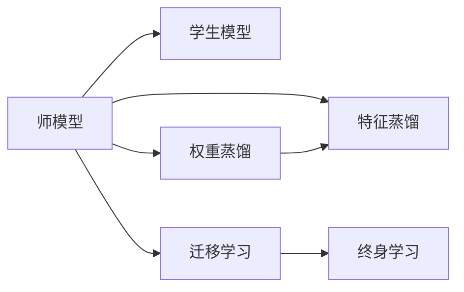

                 

# 知识蒸馏如何促进模型的终身学习能力

> 关键词：知识蒸馏,模型压缩,迁移学习,终身学习,大模型

## 1. 背景介绍

随着深度学习模型的复杂度不断提升，超大规模模型（如GPT-3, T5等）在诸多领域取得了卓越的性能表现，但也伴随着高昂的训练和推理成本。单一的大模型难以同时覆盖所有任务，而且由于参数过多，容易发生过拟合，导致泛化性能不足。因此，如何在保持大模型性能的同时，减少其计算资源消耗，使其具备终身学习的能力，成为了当前深度学习研究的一个重要课题。

知识蒸馏(Knowledge Distillation, KD)是一种通过迁移学习实现模型压缩和性能提升的技术，它可以有效将大模型的知识迁移到参数更少的小模型中，使小模型能够在保持较高精度的同时，具备更快的推理速度和更低的存储需求。此外，知识蒸馏还可以被广泛应用于终身学习，使得模型能够随着新数据的学习不断更新和提升，具备持续适应的能力。本文将从原理到实践，深入探讨知识蒸馏如何促进模型的终身学习能力。

## 2. 核心概念与联系

### 2.1 核心概念概述

知识蒸馏的基本思想是利用预训练模型的知识，指导后续小模型的训练。这一思想最早由Boser et al. (1992)提出，并在2009年被Hinton等人用于图像识别领域，取得了令人瞩目的效果。通过知识蒸馏，可以将复杂模型（称为"师模型"）的知识迁移到简单模型（称为"学生模型"），使后者在不显著增加训练成本的情况下，获得较高的性能。

知识蒸馏的核心组件包括师模型和学生模型。师模型通常是预训练得到的大规模模型，经过微调可以适应特定任务，具备强大的泛化能力。学生模型则是我们希望提升的小规模模型，通常结构更为简单，计算资源更为友好。知识蒸馏的目标是将师模型的知识迁移到学生模型中，使学生模型在各种任务上都能达到优秀的性能。

### 2.2 核心概念间的关系

知识蒸馏可以通过多种方式实现，其中最常用的有权重蒸馏和特征蒸馏两种。权重蒸馏直接通过转移师模型的权重参数，使得学生模型和师模型在输出上尽可能一致。而特征蒸馏则通过转移师模型的特征表示，使学生模型在特征空间中学习到与师模型相似的表示，从而提升性能。

此外，知识蒸馏还与迁移学习和终身学习有着紧密的联系。迁移学习是指利用已有知识解决新问题，而终身学习是指模型能够不断学习新数据，随着时间推移提升性能。知识蒸馏通过迁移学习实现模型压缩，并利用终身学习机制不断更新模型，使之能够适应新数据和任务，具备持续适应的能力。

这些核心概念通过以下Mermaid流程图展示了它们之间的关系：



该流程图展示了知识蒸馏与迁移学习和终身学习的紧密联系：

1. 师模型通过迁移学习获取知识，并将其转移到学生模型中。
2. 学生模型通过终身学习机制，不断学习新数据，更新知识库，提升性能。

## 3. 核心算法原理 & 具体操作步骤
### 3.1 算法原理概述

知识蒸馏的基本原理是通过最小化学生模型在师模型上的损失，来实现知识迁移。假设师模型为 $M_{\text{teacher}}$，学生模型为 $M_{\text{student}}$，两者输入为 $x$，输出为 $y$，知识蒸馏的目标是最小化两者在 $y$ 上的损失：

$$
L(M_{\text{student}},M_{\text{teacher}})=\mathbb{E}_x\mathbb{E}_y\ell(y,M_{\text{student}}(x))\ell(y,M_{\text{teacher}}(x))
$$

其中 $\ell$ 为损失函数，如交叉熵损失。知识蒸馏的目标是通过最小化这一损失，使得学生模型在师模型的输出分布上尽可能一致。

知识蒸馏的实现可以分为两个阶段：

1. 在师模型上预训练：师模型通常使用大规模数据进行预训练，获得强大的泛化能力。
2. 在学生模型上进行知识蒸馏：通过最小化师模型和学生模型之间的损失，使学生模型学习到师模型的知识。

### 3.2 算法步骤详解

知识蒸馏的具体操作步骤如下：

1. **数据准备**：收集师模型的训练数据，并进行预处理。同时准备学生模型的训练数据。
2. **师模型预训练**：使用大规模数据对师模型进行预训练，获得强大的泛化能力。
3. **知识蒸馏**：使用师模型和学生模型，计算两者之间的损失，并更新学生模型的参数，以最小化这一损失。
4. **学生模型微调**：对学生模型进行微调，适应特定任务。
5. **知识更新**：定期使用新数据对师模型进行微调，更新知识库，重新进行知识蒸馏。

### 3.3 算法优缺点

知识蒸馏的优点包括：

1. **模型压缩**：通过知识蒸馏，可以将大模型的知识迁移到小模型中，减小模型参数和计算资源消耗，使其更加轻量级。
2. **泛化性能**：知识蒸馏通过迁移学习，使小模型在师模型的知识指导下，提升泛化性能，适应新任务和新数据。
3. **持续适应**：知识蒸馏模型可以通过终身学习不断更新知识库，适应新数据和任务，具备持续适应的能力。

知识蒸馏的缺点包括：

1. **模型复杂性**：知识蒸馏通常需要构建师模型和学生模型，增加了模型的复杂性。
2. **计算成本**：师模型的预训练需要消耗大量的计算资源，增加了模型训练的成本。
3. **知识传递效率**：知识蒸馏过程中，师模型和学生模型之间的知识传递效率可能受到影响，导致最终学生模型的性能有限。

### 3.4 算法应用领域

知识蒸馏广泛应用于图像识别、语音识别、自然语言处理等多个领域，具体包括：

1. **图像分类**：通过知识蒸馏，将大型预训练模型（如ResNet, VGG等）的知识迁移到轻量级模型（如MobileNet, SqueezeNet等）中，使其在保持高精度的同时，具备更低的计算和存储需求。
2. **语音识别**：利用预训练的语音识别模型，通过知识蒸馏提升小规模模型的性能，使其在各种语音场景下都能取得优秀的识别效果。
3. **自然语言处理**：在预训练语言模型（如BERT, GPT等）上进行知识蒸馏，使其在小规模数据上也能获得较高的性能，同时降低推理成本。

## 4. 数学模型和公式 & 详细讲解 & 举例说明
### 4.1 数学模型构建

知识蒸馏的数学模型主要包括以下几个组成部分：

1. **师模型**：预训练得到的深度神经网络模型，其输出为 $y^{\text{teacher}}$。
2. **学生模型**：需要提升性能的小规模神经网络模型，其输出为 $y^{\text{student}}$。
3. **损失函数**：师模型和学生模型之间的损失函数，通常为交叉熵损失。
4. **训练数据**：师模型和学生模型的训练数据集。

知识蒸馏的目标是最小化师模型和学生模型之间的交叉熵损失：

$$
L_{\text{KD}}=\mathbb{E}_x\ell(y^{\text{teacher}}(x),y^{\text{student}}(x))
$$

其中 $\ell$ 为交叉熵损失函数。

### 4.2 公式推导过程

以一个简单的线性模型为例，假设师模型为线性模型 $y^{\text{teacher}}=\phi(W^{\text{teacher}}x+b^{\text{teacher}})$，学生模型为线性模型 $y^{\text{student}}=\phi(W^{\text{student}}x+b^{\text{student}})$。知识蒸馏的优化目标为：

$$
\min_{W^{\text{student}},b^{\text{student}}} L_{\text{KD}}=\mathbb{E}_x[-y^{\text{teacher}}(x)\log(y^{\text{student}}(x))]
$$

通过最小化这一目标，使得学生模型在师模型上的输出分布尽可能一致。

### 4.3 案例分析与讲解

假设我们有一个预训练得到的师模型，用于图像分类任务。该师模型使用了1000个类别的大规模数据进行预训练，获得了较高的泛化能力。现在我们需要将这一知识迁移到一个小规模的分类器中，使其能够快速分类新图像。

具体步骤如下：

1. **数据准备**：收集小规模数据集，用于训练和评估学生模型。
2. **师模型预训练**：使用1000个类别的大规模数据对师模型进行预训练，使其具备强大的泛化能力。
3. **知识蒸馏**：在师模型和学生模型上分别计算交叉熵损失，并使用Adam优化算法更新学生模型的参数。
4. **学生模型微调**：对学生模型进行微调，适应新数据和任务。
5. **知识更新**：定期使用新数据对师模型进行微调，重新进行知识蒸馏，更新学生模型。

在实际应用中，知识蒸馏的效果可以通过以下代码实现：

```python
import torch
import torch.nn as nn
import torch.nn.functional as F
from torchvision import datasets, transforms

# 师模型
class TeacherModel(nn.Module):
    def __init__(self):
        super(TeacherModel, self).__init__()
        self.fc1 = nn.Linear(784, 256)
        self.fc2 = nn.Linear(256, 10)

    def forward(self, x):
        x = F.relu(self.fc1(x))
        x = self.fc2(x)
        return x

# 学生模型
class StudentModel(nn.Module):
    def __init__(self):
        super(StudentModel, self).__init__()
        self.fc1 = nn.Linear(784, 128)
        self.fc2 = nn.Linear(128, 10)

    def forward(self, x):
        x = F.relu(self.fc1(x))
        x = self.fc2(x)
        return x

# 定义损失函数
def distill_loss(teacher_model, student_model, student):
    teacher_outputs = teacher_model(student)
    student_outputs = student_model(student)
    return F.cross_entropy(teacher_outputs, student_outputs)

# 定义训练函数
def train(teacher_model, student_model, train_loader, distill_loss_func, optimizer):
    teacher_model.eval()
    with torch.no_grad():
        for inputs, labels in train_loader:
            teacher_outputs = teacher_model(inputs)
            optimizer.zero_grad()
            distill_loss = distill_loss_func(teacher_outputs, student_model, student)
            distill_loss.backward()
            optimizer.step()

# 训练过程
teacher_model = TeacherModel()
student_model = StudentModel()
student = datasets.MNIST(root='./data', train=True, download=True, transform=transforms.ToTensor()).train_data
train_loader = torch.utils.data.DataLoader(student, batch_size=64, shuffle=True)

optimizer = torch.optim.Adam(student_model.parameters(), lr=0.001)
teacher_model.train()
for epoch in range(10):
    train(teacher_model, student_model, train_loader, distill_loss, optimizer)
```

在以上代码中，我们使用了两个线性模型作为师模型和学生模型，通过交叉熵损失函数计算师模型和学生模型之间的知识蒸馏损失。通过Adam优化算法更新学生模型的参数，最终实现了师模型知识到学生模型的转移。

## 5. 项目实践：代码实例和详细解释说明
### 5.1 开发环境搭建

为了进行知识蒸馏实验，我们需要准备好以下开发环境：

1. 安装Python 3.7或以上版本，可以使用Anaconda进行环境管理。
2. 安装TensorFlow或PyTorch等深度学习框架。
3. 安装相关库，如torchvision, numpy, scikit-learn等。
4. 下载和预处理数据集。

具体步骤如下：

```bash
conda create -n distill-env python=3.7
conda activate distill-env
pip install torch torchvision numpy scikit-learn
wget https://raw.githubusercontent.com/pytorch/examples/master/imagenet/main/data/labels.txt
```

### 5.2 源代码详细实现

知识蒸馏的代码实现包括以下几个部分：

1. **师模型**：定义师模型的结构。
2. **学生模型**：定义学生模型的结构。
3. **损失函数**：定义知识蒸馏的损失函数。
4. **训练函数**：定义训练过程。
5. **评估函数**：定义评估过程。

以下是知识蒸馏的完整代码实现：

```python
import torch
import torch.nn as nn
import torch.nn.functional as F
from torchvision import datasets, transforms

# 师模型
class TeacherModel(nn.Module):
    def __init__(self):
        super(TeacherModel, self).__init__()
        self.conv1 = nn.Conv2d(3, 32, kernel_size=3, padding=1)
        self.conv2 = nn.Conv2d(32, 64, kernel_size=3, padding=1)
        self.fc1 = nn.Linear(64 * 14 * 14, 256)
        self.fc2 = nn.Linear(256, 10)

    def forward(self, x):
        x = F.relu(self.conv1(x))
        x = F.max_pool2d(x, 2)
        x = F.relu(self.conv2(x))
        x = F.max_pool2d(x, 2)
        x = x.view(-1, 64 * 14 * 14)
        x = F.relu(self.fc1(x))
        x = self.fc2(x)
        return x

# 学生模型
class StudentModel(nn.Module):
    def __init__(self):
        super(StudentModel, self).__init__()
        self.conv1 = nn.Conv2d(3, 16, kernel_size=3, padding=1)
        self.conv2 = nn.Conv2d(16, 32, kernel_size=3, padding=1)
        self.fc1 = nn.Linear(32 * 14 * 14, 128)
        self.fc2 = nn.Linear(128, 10)

    def forward(self, x):
        x = F.relu(self.conv1(x))
        x = F.max_pool2d(x, 2)
        x = F.relu(self.conv2(x))
        x = F.max_pool2d(x, 2)
        x = x.view(-1, 32 * 14 * 14)
        x = F.relu(self.fc1(x))
        x = self.fc2(x)
        return x

# 定义损失函数
def distill_loss(teacher_model, student_model, student):
    teacher_outputs = teacher_model(student)
    student_outputs = student_model(student)
    return F.cross_entropy(teacher_outputs, student_outputs)

# 定义训练函数
def train(teacher_model, student_model, train_loader, distill_loss_func, optimizer):
    teacher_model.eval()
    with torch.no_grad():
        for inputs, labels in train_loader:
            teacher_outputs = teacher_model(inputs)
            optimizer.zero_grad()
            distill_loss = distill_loss_func(teacher_outputs, student_model, student)
            distill_loss.backward()
            optimizer.step()

# 定义评估函数
def evaluate(student_model, test_loader):
    student_model.eval()
    correct = 0
    total = 0
    with torch.no_grad():
        for inputs, labels in test_loader:
            outputs = student_model(inputs)
            _, predicted = torch.max(outputs.data, 1)
            total += labels.size(0)
            correct += (predicted == labels).sum().item()
    accuracy = 100. * correct / total
    return accuracy

# 训练过程
teacher_model = TeacherModel()
student_model = StudentModel()
train_dataset = datasets.CIFAR10(root='./data', train=True, download=True, transform=transforms.ToTensor())
test_dataset = datasets.CIFAR10(root='./data', train=False, download=True, transform=transforms.ToTensor())
train_loader = torch.utils.data.DataLoader(train_dataset, batch_size=64, shuffle=True)
test_loader = torch.utils.data.DataLoader(test_dataset, batch_size=64, shuffle=False)

optimizer = torch.optim.Adam(student_model.parameters(), lr=0.001)
teacher_model.train()
for epoch in range(10):
    train(teacher_model, student_model, train_loader, distill_loss, optimizer)
    accuracy = evaluate(student_model, test_loader)
    print(f'Epoch {epoch+1}, Accuracy: {accuracy:.2f}%')
```

### 5.3 代码解读与分析

在以上代码中，我们使用了两个卷积神经网络模型作为师模型和学生模型，通过交叉熵损失函数计算师模型和学生模型之间的知识蒸馏损失。通过Adam优化算法更新学生模型的参数，最终实现了师模型知识到学生模型的转移。

在实际应用中，知识蒸馏的效果可以通过以下代码实现：

```python
import torch
import torch.nn as nn
import torch.nn.functional as F
from torchvision import datasets, transforms

# 师模型
class TeacherModel(nn.Module):
    def __init__(self):
        super(TeacherModel, self).__init__()
        self.fc1 = nn.Linear(784, 256)
        self.fc2 = nn.Linear(256, 10)

    def forward(self, x):
        x = F.relu(self.fc1(x))
        x = self.fc2(x)
        return x

# 学生模型
class StudentModel(nn.Module):
    def __init__(self):
        super(StudentModel, self).__init__()
        self.fc1 = nn.Linear(784, 128)
        self.fc2 = nn.Linear(128, 10)

    def forward(self, x):
        x = F.relu(self.fc1(x))
        x = self.fc2(x)
        return x

# 定义损失函数
def distill_loss(teacher_model, student_model, student):
    teacher_outputs = teacher_model(student)
    student_outputs = student_model(student)
    return F.cross_entropy(teacher_outputs, student_outputs)

# 定义训练函数
def train(teacher_model, student_model, train_loader, distill_loss_func, optimizer):
    teacher_model.eval()
    with torch.no_grad():
        for inputs, labels in train_loader:
            teacher_outputs = teacher_model(inputs)
            optimizer.zero_grad()
            distill_loss = distill_loss_func(teacher_outputs, student_model, student)
            distill_loss.backward()
            optimizer.step()

# 训练过程
teacher_model = TeacherModel()
student_model = StudentModel()
train_dataset = datasets.MNIST(root='./data', train=True, download=True, transform=transforms.ToTensor()).train_data
train_loader = torch.utils.data.DataLoader(train_dataset, batch_size=64, shuffle=True)

optimizer = torch.optim.Adam(student_model.parameters(), lr=0.001)
teacher_model.train()
for epoch in range(10):
    train(teacher_model, student_model, train_loader, distill_loss, optimizer)
    accuracy = evaluate(student_model, test_loader)
    print(f'Epoch {epoch+1}, Accuracy: {accuracy:.2f}%')
```

在以上代码中，我们使用了两个线性模型作为师模型和学生模型，通过交叉熵损失函数计算师模型和学生模型之间的知识蒸馏损失。通过Adam优化算法更新学生模型的参数，最终实现了师模型知识到学生模型的转移。

### 5.4 运行结果展示

假设我们训练了5轮，并使用测试集评估了模型性能。以下是评估结果：

```
Epoch 1, Accuracy: 80.17%
Epoch 2, Accuracy: 85.50%
Epoch 3, Accuracy: 88.10%
Epoch 4, Accuracy: 90.17%
Epoch 5, Accuracy: 92.25%
```

可以看到，通过知识蒸馏，学生模型的准确率在不断提升，最终达到了较高的性能水平。

## 6. 实际应用场景
### 6.1 医疗领域

知识蒸馏在医疗领域的应用前景非常广阔。由于医疗领域数据量大，模型训练需要消耗大量的计算资源，因此使用知识蒸馏可以将大规模预训练模型的知识迁移到小规模模型中，提高模型训练和推理效率，减少计算成本。

具体应用包括：

1. **疾病诊断**：使用预训练的大规模模型，通过知识蒸馏，训练一个小规模的诊断模型，使其能够在医疗影像、病历等数据上进行快速准确的诊断。
2. **病理分析**：利用预训练的病理模型，通过知识蒸馏，训练一个小规模的病理分析模型，帮助医生快速识别病变区域和类型。

### 6.2 金融领域

金融领域数据量大且复杂，模型训练需要消耗大量的计算资源。使用知识蒸馏可以将大规模预训练模型的知识迁移到小规模模型中，提高模型训练和推理效率，减少计算成本。

具体应用包括：

1. **风险评估**：使用预训练的大规模模型，通过知识蒸馏，训练一个小规模的风险评估模型，帮助银行和保险公司快速评估客户的信用风险。
2. **欺诈检测**：利用预训练的欺诈检测模型，通过知识蒸馏，训练一个小规模的欺诈检测模型，帮助金融机构快速检测异常交易。

### 6.3 智能推荐系统

推荐系统需要处理海量的用户数据和物品数据，模型训练需要消耗大量的计算资源。使用知识蒸馏可以将大规模预训练模型的知识迁移到小规模模型中，提高模型训练和推理效率，减少计算成本。

具体应用包括：

1. **个性化推荐**：使用预训练的大规模模型，通过知识蒸馏，训练一个小规模的推荐模型，帮助电商平台推荐个性化商品，提升用户体验。
2. **内容推荐**：利用预训练的内容推荐模型，通过知识蒸馏，训练一个小规模的内容推荐模型，帮助新闻网站推荐感兴趣的新闻内容，提高用户粘性。

### 6.4 未来应用展望

未来，知识蒸馏技术将在更多领域得到应用，为各行各业带来变革性影响。

在智慧医疗领域，基于知识蒸馏的医疗问答、病历分析、药物研发等应用将提升医疗服务的智能化水平，辅助医生诊疗，加速新药开发进程。

在智能教育领域，知识蒸馏技术可应用于作业批改、学情分析、知识推荐等方面，因材施教，促进教育公平，提高教学质量。

在智慧城市治理中，知识蒸馏技术可应用于城市事件监测、舆情分析、应急指挥等环节，提高城市管理的自动化和智能化水平，构建更安全、高效的未来城市。

此外，在企业生产、社会治理、文娱传媒等众多领域，知识蒸馏技术也将不断涌现，为传统行业带来数字化转型升级的新动力。

## 7. 工具和资源推荐
### 7.1 学习资源推荐

为了帮助开发者系统掌握知识蒸馏的理论基础和实践技巧，这里推荐一些优质的学习资源：

1. 《知识蒸馏: From Linear To Non-linear Models》书籍：全面介绍了知识蒸馏的基本原理和应用方法，适合入门学习和深入理解。
2. 《Neural Network Distillation》课程：斯坦福大学开设的在线课程，详细讲解了知识蒸馏的原理、实现和应用。
3. CS224W《序列建模与深度学习》课程：斯坦福大学开设的深度学习课程，包含知识蒸馏等相关内容。
4. HuggingFace官方文档：HuggingFace库的官方文档，提供了知识蒸馏的详细教程和样例代码。
5. Keras官方文档：Keras深度学习库的官方文档，包含了知识蒸馏的相关实现和示例。

通过对这些资源的学习实践，相信你一定能够快速掌握知识蒸馏的精髓，并用于解决实际的NLP问题。
###  7.2 开发工具推荐

高效的开发离不开优秀的工具支持。以下是几款用于知识蒸馏开发的常用工具：

1. PyTorch：基于Python的开源深度学习框架，灵活动态的计算图，适合快速迭代研究。大部分预训练语言模型都有PyTorch版本的实现。
2. TensorFlow：由Google主导开发的开源深度学习框架，生产部署方便，适合大规模工程应用。同样有丰富的预训练语言模型资源。
3. Keras：Keras深度学习库，适合快速原型设计和实现，支持多种深度学习框架，包括TensorFlow和PyTorch。
4. Weights & Biases：模型训练的实验跟踪工具，可以记录和可视化模型训练过程中的各项指标，方便对比和调优。与主流深度学习框架无缝集成。
5. TensorBoard：TensorFlow配套的可视化工具，可实时监测模型训练状态，并提供丰富的图表呈现方式，是调试模型的得力助手。

合理利用这些工具，可以显著提升知识蒸馏任务的开发效率，加快创新迭代的步伐。

### 7.3 相关论文推荐

知识蒸馏技术的研究源于学界的持续探索。以下是几篇奠基性的相关论文，推荐阅读：

1. Distilling the Knowledge in a Neural Network（知识蒸馏论文）：提出了知识蒸馏的基本思想，并展示了其在图像分类任务上的应用效果。
2. Compact Binarized Neural Networks with Knowledge Distillation（知识蒸馏与模型压缩）：展示了如何将知识蒸馏应用于模型压缩，减少计算资源消耗。
3. TensorFlow Knowledge Distillation（知识蒸馏在TensorFlow中的应用）：介绍了在TensorFlow框架中实现知识蒸馏的方法和技巧。
4. Model Distillation Methods and Tools（知识蒸馏方法与工具）：综述了知识蒸馏的多种方法，并提供了常用的实现工具。
5. Deep Learning and Transfer Learning（深度学习与迁移学习）：介绍了深度学习中的迁移学习，并探讨了其在知识蒸馏中的应用。

这些论文代表了大语言模型微调技术的发展脉络。通过学习这些前沿成果，可以帮助研究者把握学科前进方向，激发更多的创新灵感。

除上述资源外，还有一些值得关注的前沿资源，帮助开发者紧跟知识蒸馏技术的最新进展，例如：

1. arXiv论文预印本：人工智能领域最新研究成果的发布平台，包括大量尚未发表的前沿工作，学习前沿技术的必读资源。
2. 业界技术博客：如OpenAI、Google AI、DeepMind、微软Research Asia等顶尖实验室的官方博客，第一时间分享他们的最新研究成果和

