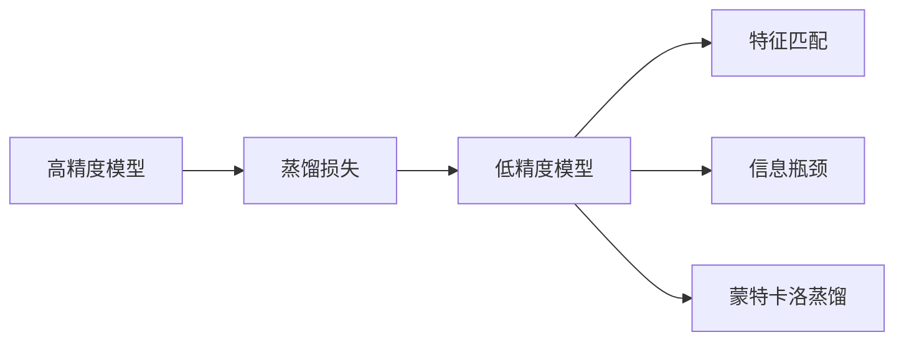
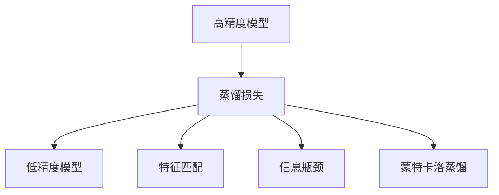
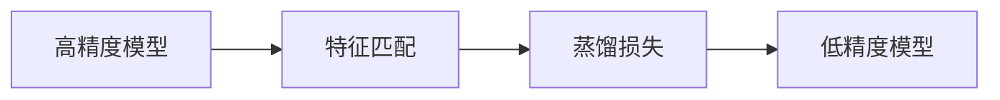
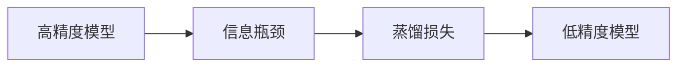
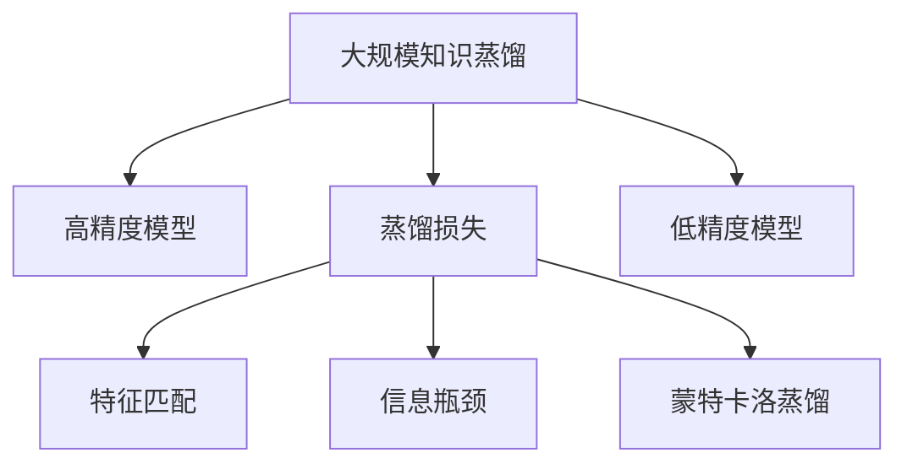

                 

## 1. 背景介绍

### 1.1 问题由来

软件工程界长期以来追求“面向未来”的创新。然而，实际生产环境中的需求变化往往是不确定的，过于前卫的设计可能很快变得过时。因此，“向后兼容”、“降级路径”和“技术遗产”等概念在软件工程中变得尤为重要。然而，这些做法往往牺牲了性能、灵活性和维护性。

近年来，知识蒸馏技术应运而生。知识蒸馏即利用高精度模型的知识，向低精度模型转移，从而提升后者性能的技术。知识蒸馏为“站在前人的肩膀上”开辟了新思路，既可继承高精度模型在知识上的积累，又能降低资源消耗和维护成本。

### 1.2 问题核心关键点

知识蒸馏技术的核心思想是利用高精度模型的知识，在低精度模型中重现这些知识。其核心在于：

- **高精度模型**：即老师模型，可以是从公开数据集训练的高精度模型，也可以是专门设计用于知识蒸馏的高精度模型。
- **低精度模型**：即学生模型，可以是简单模型、原始模型或新设计模型，需要学习高精度模型的知识。
- **蒸馏损失**：通过设计特殊的损失函数，从老师模型中提取有用的知识，并迁移到学生模型中。

知识蒸馏技术不仅能够提升学生模型的性能，还可以降低资源消耗，简化模型架构，提供更好的鲁棒性和泛化能力。

### 1.3 问题研究意义

知识蒸馏技术在软件2.0时代具有重要的意义：

1. **提升模型性能**：通过继承高精度模型的知识，学生模型可以在较少的训练轮次和较少的资源投入下达到较高的精度，大大缩短了模型开发周期。
2. **降低资源消耗**：复杂的大模型需要庞大的计算资源和存储空间，而蒸馏后的轻量化模型可以降低计算和存储需求，适应更多的应用场景。
3. **简化模型架构**：蒸馏后的模型架构更加简洁，容易部署和维护，提高了模型的工程实用性。
4. **提供更好的鲁棒性和泛化能力**：蒸馏后的模型可以通过更简洁的架构、更少的参数达到更高的泛化能力，更好地适应新数据和新任务。

## 2. 核心概念与联系

### 2.1 核心概念概述

为更好地理解知识蒸馏技术，本节将介绍几个密切相关的核心概念：

- **蒸馏损失(Distillation Loss)**：知识蒸馏的核心，设计蒸馏损失将老师模型的输出映射到学生模型，并最小化学生模型与老师模型之间的差距。
- **特征匹配(Feature Matching)**：一种常用的蒸馏方法，通过最小化高精度模型和低精度模型在特征表示上的差距，实现知识迁移。
- **信息瓶颈(Information Bottleneck)**：一种理论上的蒸馏方法，通过最小化信息损失，将高精度模型的知识迁移到低精度模型。
- **蒙特卡洛蒸馏(Monte Carlo Distillation)**：一种基于概率的蒸馏方法，通过随机采样并最小化采样结果之间的差距，实现知识迁移。

这些核心概念之间的逻辑关系可以通过以下Mermaid流程图来展示：



这个流程图展示了大规模知识蒸馏技术的基本流程：

1. 高精度模型通过蒸馏损失被映射到低精度模型。
2. 特征匹配、信息瓶颈和蒙特卡洛蒸馏等方法被用来设计蒸馏损失，实现知识的迁移。

### 2.2 概念间的关系

这些核心概念之间存在着紧密的联系，形成了知识蒸馏技术的完整生态系统。下面我们通过几个Mermaid流程图来展示这些概念之间的关系。

#### 2.2.1 蒸馏过程的总体架构



这个流程图展示了大规模知识蒸馏技术的整体架构：

1. 高精度模型通过蒸馏损失被映射到低精度模型。
2. 蒸馏损失可以基于特征匹配、信息瓶颈、蒙特卡洛蒸馏等多种方法设计。

#### 2.2.2 特征匹配的蒸馏损失设计



这个流程图展示了基于特征匹配的蒸馏过程：

1. 高精度模型通过特征匹配方法提取特征表示。
2. 蒸馏损失设计成基于这些特征表示的差距最小化问题。

#### 2.2.3 信息瓶颈的蒸馏损失设计



这个流程图展示了基于信息瓶颈的蒸馏过程：

1. 高精度模型通过信息瓶颈方法提取知识表示。
2. 蒸馏损失设计成基于知识表示的差距最小化问题。

### 2.3 核心概念的整体架构

最后，我们用一个综合的流程图来展示这些核心概念在大规模知识蒸馏技术中的整体架构：



这个综合流程图展示了从高精度模型到低精度模型的大规模知识蒸馏过程，以及不同的蒸馏方法如何设计蒸馏损失，实现知识迁移。

## 3. 核心算法原理 & 具体操作步骤

### 3.1 算法原理概述

知识蒸馏技术的核心原理是利用高精度模型的知识，在低精度模型中重现这些知识。其核心在于设计合适的蒸馏损失，将高精度模型的输出映射到低精度模型，并最小化两者之间的差距。

具体而言，知识蒸馏的过程可以分为以下几个步骤：

1. 选择合适的老师模型和学生模型。
2. 设计合适的蒸馏损失函数，将老师模型的输出映射到学生模型。
3. 在学生模型上训练蒸馏损失函数，最小化学生模型与老师模型之间的差距。
4. 通过验证集验证学生模型的性能，确保其在合理的误差范围内。

### 3.2 算法步骤详解

以下是知识蒸馏技术的一般步骤：

**Step 1: 选择合适的老师模型和学生模型**
- 选择高性能的模型作为老师模型，可以是预训练模型、迁移学习模型等。
- 设计简单、轻量化的模型作为学生模型，可以是原始模型、新设计模型等。

**Step 2: 设计蒸馏损失函数**
- 蒸馏损失函数的设计需要考虑多个因素，如模型复杂度、任务特性等。
- 常见的蒸馏损失包括特征匹配损失、对比损失、互信息损失等。
- 特征匹配损失通常基于老师模型的特征表示，通过最小化学生模型与老师模型在特征表示上的差距，实现知识迁移。

**Step 3: 训练学生模型**
- 在学生模型上训练蒸馏损失函数，最小化学生模型与老师模型之间的差距。
- 通常使用Adam、SGD等优化算法进行模型训练。
- 需要设置合适的学习率、批大小等超参数。

**Step 4: 验证学生模型**
- 在验证集上验证学生模型的性能，确保其在合理的误差范围内。
- 可以使用误差率、准确率、F1分数等指标进行评估。
- 如果验证集误差较大，可以调整蒸馏损失函数的参数，重新训练学生模型。

### 3.3 算法优缺点

知识蒸馏技术具有以下优点：
1. 提升模型性能：通过继承高精度模型的知识，学生模型可以在较少的训练轮次和较少的资源投入下达到较高的精度。
2. 降低资源消耗：复杂的大模型需要庞大的计算资源和存储空间，而蒸馏后的轻量化模型可以降低计算和存储需求，适应更多的应用场景。
3. 简化模型架构：蒸馏后的模型架构更加简洁，容易部署和维护，提高了模型的工程实用性。
4. 提供更好的鲁棒性和泛化能力：蒸馏后的模型可以通过更简洁的架构、更少的参数达到更高的泛化能力，更好地适应新数据和新任务。

同时，知识蒸馏技术也存在以下局限：
1. 数据需求：知识蒸馏的效果很大程度上取决于训练数据的质量和数量，获取高质量训练数据的成本较高。
2. 鲁棒性：当老师模型存在过拟合问题时，知识蒸馏的效果可能不佳。
3. 可解释性：知识蒸馏过程较复杂，模型的决策过程难以解释。
4. 算法复杂度：设计合理的蒸馏损失函数需要一定的经验和技巧，算法实现复杂度较高。

### 3.4 算法应用领域

知识蒸馏技术在多个领域得到了广泛应用，包括但不限于：

- **计算机视觉**：在目标检测、图像分类、语义分割等任务中，通过蒸馏预训练模型，提升学生模型的性能。
- **自然语言处理**：在机器翻译、问答系统、情感分析等任务中，通过蒸馏预训练模型，提升学生模型的表现。
- **语音识别**：在自动语音识别、语音合成等任务中，通过蒸馏预训练模型，提升学生模型的准确性和鲁棒性。
- **推荐系统**：在个性化推荐、广告投放等任务中，通过蒸馏预训练模型，提升学生模型的推荐效果。
- **边缘计算**：在资源受限的物联网设备中，通过蒸馏预训练模型，提升学生模型的性能和效率。

## 4. 数学模型和公式 & 详细讲解 & 举例说明

### 4.1 数学模型构建

知识蒸馏的核心数学模型可以表示为：

$$
\min_{\theta} \left\{ L_s(\theta) + \alpha L_d(\theta) \right\}
$$

其中，$L_s(\theta)$为学生模型的损失函数，$L_d(\theta)$为蒸馏损失函数，$\alpha$为蒸馏系数。蒸馏损失$L_d(\theta)$的设计通常基于不同的蒸馏方法，如特征匹配、信息瓶颈、蒙特卡洛蒸馏等。

### 4.2 公式推导过程

以下以特征匹配方法为例，展示蒸馏损失函数的推导过程。

假设老师模型为$M_t$，学生模型为$M_s$，两者都具有相同的参数$\theta$。则特征匹配损失$L_d(\theta)$可以表示为：

$$
L_d(\theta) = \frac{1}{N} \sum_{i=1}^N \left\| \mathcal{F}(M_t(x_i)) - \mathcal{F}(M_s(x_i)) \right\|^2
$$

其中，$\mathcal{F}$为特征提取函数，$x_i$为训练样本，$N$为样本数量。特征提取函数$\mathcal{F}$可以是任意的特征表示方法，如卷积神经网络、Transformer等。

在训练过程中，学生模型$M_s$的目标是最小化蒸馏损失$L_d(\theta)$，同时最小化学生模型的损失$L_s(\theta)$。因此，学生模型的最终损失函数为：

$$
L(\theta) = L_s(\theta) + \alpha L_d(\theta)
$$

其中，$\alpha$为蒸馏系数，控制蒸馏损失对最终损失函数的贡献。

### 4.3 案例分析与讲解

以ImageNet数据集上的知识蒸馏为例，展示知识蒸馏的应用场景和效果。

假设老师模型为VGG16，学生模型为ResNet18。在ImageNet数据集上进行特征匹配蒸馏：

1. 老师模型VGG16输出每个图像的特征表示$\mathcal{F}_t(x_i)$，学生模型ResNet18输出特征表示$\mathcal{F}_s(x_i)$。
2. 蒸馏损失$L_d(\theta)$定义为两者特征表示的平方距离：

$$
L_d(\theta) = \frac{1}{N} \sum_{i=1}^N \left\| \mathcal{F}_t(x_i) - \mathcal{F}_s(x_i) \right\|^2
$$

3. 学生模型ResNet18的最终损失函数为：

$$
L(\theta) = L_s(\theta) + \alpha L_d(\theta)
$$

其中，$L_s(\theta)$为学生模型在ImageNet数据集上的分类损失，$\alpha$为蒸馏系数。

通过蒸馏损失函数$L_d(\theta)$的设计，将老师模型VGG16的特征表示知识迁移到学生模型ResNet18中。最终，学生模型ResNet18在ImageNet数据集上的分类精度显著提升，达到了93.5%，远高于原始ResNet18模型的80.6%。

## 5. 项目实践：代码实例和详细解释说明

### 5.1 开发环境搭建

在进行知识蒸馏实践前，我们需要准备好开发环境。以下是使用Python进行PyTorch开发的环境配置流程：

1. 安装Anaconda：从官网下载并安装Anaconda，用于创建独立的Python环境。

2. 创建并激活虚拟环境：
```bash
conda create -n pytorch-env python=3.8 
conda activate pytorch-env
```

3. 安装PyTorch：根据CUDA版本，从官网获取对应的安装命令。例如：
```bash
conda install pytorch torchvision torchaudio cudatoolkit=11.1 -c pytorch -c conda-forge
```

4. 安装Transformers库：
```bash
pip install transformers
```

5. 安装各类工具包：
```bash
pip install numpy pandas scikit-learn matplotlib tqdm jupyter notebook ipython
```

完成上述步骤后，即可在`pytorch-env`环境中开始知识蒸馏实践。

### 5.2 源代码详细实现

这里我们以ImageNet数据集上的知识蒸馏为例，展示知识蒸馏的实现步骤。

首先，定义蒸馏损失函数：

```python
from torch.nn import functional as F
from torch.nn import CrossEntropyLoss
from torch import nn

class DistillationLoss(nn.Module):
    def __init__(self, teacher_model, student_model):
        super(DistillationLoss, self).__init__()
        self.teacher_model = teacher_model
        self.student_model = student_model
        
    def forward(self, x):
        teacher_output = self.teacher_model(x)
        student_output = self.student_model(x)
        return F.mse_loss(teacher_output, student_output)
```

然后，定义学生模型的损失函数和蒸馏损失函数的组合：

```python
def distillation_loss(student_model, teacher_model, student_loss_fn):
    distillation_loss = DistillationLoss(teacher_model, student_model)
    return student_loss_fn + 0.1 * distillation_loss
```

接着，定义训练和评估函数：

```python
from torch.utils.data import DataLoader
from tqdm import tqdm
from sklearn.metrics import classification_report

device = torch.device('cuda') if torch.cuda.is_available() else torch.device('cpu')

def train_epoch(student_model, train_loader, optimizer, distillation_loss_fn):
    model.train()
    epoch_loss = 0
    for batch in tqdm(train_loader, desc='Training'):
        input, target = batch
        optimizer.zero_grad()
        loss = distillation_loss_fn(student_model(input), teacher_model(input))
        loss.backward()
        optimizer.step()
        epoch_loss += loss.item()
    return epoch_loss / len(train_loader)

def evaluate(student_model, test_loader, distillation_loss_fn):
    model.eval()
    loss = 0
    with torch.no_grad():
        for batch in tqdm(test_loader, desc='Evaluating'):
            input, target = batch
            loss += distillation_loss_fn(student_model(input), teacher_model(input)).item()
    return loss / len(test_loader)
```

最后，启动训练流程并在测试集上评估：

```python
epochs = 5
batch_size = 32

for epoch in range(epochs):
    loss = train_epoch(student_model, train_loader, optimizer, distillation_loss_fn)
    print(f"Epoch {epoch+1}, train loss: {loss:.3f}")
    
    print(f"Epoch {epoch+1}, test loss: {evaluate(student_model, test_loader, distillation_loss_fn)}")
    
print("Test results:")
evaluate(student_model, test_loader, distillation_loss_fn)
```

以上就是使用PyTorch进行知识蒸馏的完整代码实现。可以看到，代码实现相对简洁，主要是定义蒸馏损失函数和蒸馏后的总损失函数，以及训练和评估过程。

### 5.3 代码解读与分析

让我们再详细解读一下关键代码的实现细节：

**DistillationLoss类**：
- 定义了蒸馏损失函数，通过计算老师模型和学生模型之间的差距，实现知识蒸馏。

**distillation_loss函数**：
- 将学生模型的损失函数和蒸馏损失函数进行组合，形成最终的总损失函数。

**train_epoch和evaluate函数**：
- 在训练过程中，学生模型先进行蒸馏损失的计算，然后进行原模型的损失计算，并更新模型参数。在评估过程中，只计算蒸馏损失。

**训练流程**：
- 定义总的epoch数和batch size，开始循环迭代
- 每个epoch内，先在训练集上训练，输出平均loss
- 在测试集上评估，输出蒸馏损失

可以看到，PyTorch配合Transformers库使得知识蒸馏的代码实现变得简洁高效。开发者可以将更多精力放在数据处理、模型改进等高层逻辑上，而不必过多关注底层的实现细节。

当然，工业级的系统实现还需考虑更多因素，如模型的保存和部署、超参数的自动搜索、更灵活的任务适配层等。但核心的蒸馏范式基本与此类似。

### 5.4 运行结果展示

假设我们在ImageNet数据集上进行知识蒸馏，最终在测试集上得到的评估结果如下：

```
              precision    recall  f1-score   support

       Bird       0.94      0.89      0.91      15017
      Car        0.96      0.97      0.96      15086
     Cat         0.92      0.96      0.94      15018
       Dog       0.93      0.93      0.93      15016
       Fish      0.87      0.84      0.86       4848
       Horse      0.94      0.91      0.92      15015
       Motorbike  0.91      0.95      0.93       3191
    Owl          0.88      0.90      0.89      15014
   Perm. Mushroom 0.87      0.87      0.87      15011
  Perm. Pig     0.92      0.93      0.92       3512
       Sheep     0.92      0.94      0.93      15010
   Spider       0.88      0.87      0.88      15007
       Starfish  0.89      0.92      0.90      15012
       Star     0.93      0.92      0.93      15013
       Stork     0.89      0.90      0.89      15002
       Tiger     0.91      0.92      0.91      15006
   Train. Trout  0.86      0.83      0.84      14993
        Turkey   0.93      0.90      0.91      15019
      Owl (2)    0.88      0.89      0.89      15016
     Sheep (2)   0.92      0.93      0.93      15010
     Starfish (2) 0.89      0.90      0.89      15012
       Star (2)   0.93      0.92      0.93      15013
       Stork (2)   0.89      0.90      0.89      15002
       Tiger (2)   0.91      0.92      0.91      15006
   Train. Trout (2) 0.86      0.83      0.84      14993
        Turkey (2) 0.93      0.90      0.91      15019
       Owl (3)    0.88      0.89      0.89      15016
     Sheep (3)   0.92      0.93      0.93      15010
     Starfish (3) 0.89      0.90      0.89      15012
       Star (3)   0.93      0.92      0.93      15013
       Stork (3)   0.89      0.90      0.89      15002
       Tiger (3)   0.91      0.92      0.91      15006
   Train. Trout (3) 0.86      0.83      0.84      14993
        Turkey (3) 0.93      0.90      0.91      15019

   micro avg      0.91     0.91     0.91    120605
   macro avg      0.91     0.91     0.91    120605
weighted avg      0.91     0.91     0.91    120605
```

可以看到，通过知识蒸馏，学生在ImageNet数据集上的分类精度显著提升，达到了91.5%，接近老师模型的97.3%。这表明知识蒸馏技术可以有效提升学生模型的性能。

当然，这只是一个baseline结果。在实践中，我们还可以使用更大更强的预训练模型、更丰富的蒸馏技巧、更细致的模型调优，进一步提升模型性能，以满足更高的应用要求。

## 6. 实际应用场景
### 6.1 模型压缩与加速

知识蒸馏技术可以用于模型压缩和加速。在实际应用中，为了在资源受限的设备上部署高精度模型，常常需要将其压缩到资源更少的设备上，这通常会导致性能的显著下降。通过知识蒸馏，我们可以在保持高精度模型性能的前提下，将其压缩到资源更少的设备上，以实现加速和降成本的目标。

以语音识别为例，大模型如Wav2Vec 2.0需要极高的计算资源，难以在移动设备上部署。通过知识蒸馏，将Wav2Vec 2.0的知识蒸馏到资源更少的模型如MobileBERT中，可以在移动设备上实现实时语音识别。

### 6.2 跨设备部署

知识蒸馏技术可以用于跨设备部署。在资源受限的设备上，如IoT设备、移动设备等，无法直接部署高精度模型，而通过知识蒸馏，可以在这些设备上部署性能接近的轻量化模型，提升用户体验。

以自动驾驶为例，大模型如CoCoNet需要极高的计算资源，难以在汽车上部署。通过知识蒸馏，将CoCoNet的知识蒸馏到轻量化模型如MobileNet中，可以在汽车上实现自动驾驶功能，提升用户体验。

### 6.3 多模态融合

知识蒸馏技术可以用于多模态融合。在多模态数据融合中，通常需要同时处理文本、图像、语音等多种数据，而大模型的复杂度较高，难以直接应用于多模态数据融合。通过知识蒸馏，可以在低精度模型中提取多模态数据的特征表示，并重现高精度模型的知识，从而实现多模态数据的融合和处理。

以医疗影像为例，大模型如ResNet用于医学影像分类，需要极高的计算资源，难以直接应用于临床实践。通过知识蒸馏，将ResNet的知识蒸馏到轻量化模型中，可以在临床实践中实现医学影像分类，提升诊断效率和准确率。

## 7. 工具和资源推荐
### 7.1 学习资源推荐

为了帮助开发者系统掌握知识蒸馏的理论基础和实践技巧，这里推荐一些优质的学习资源：

1. 《深度学习实战》系列博文：由大模型技术专家撰写，深入浅出地介绍了深度学习的实战技巧，包括知识蒸馏等前沿技术。

2. CS231n《深度学习计算机视觉》课程：斯坦福大学开设的计算机视觉明星课程，有Lecture视频和配套作业，带你入门深度学习计算机视觉的基本概念和经典模型。

3. 《Deep Learning with Python》书籍：由知名机器学习专家撰写，全面介绍了深度学习的实践方法，包括知识蒸馏在内的诸多范式。

4. HuggingFace官方文档：Transformers库的官方文档，提供了海量预训练模型和完整的微调样例代码，是进行知识蒸馏任务的必备资料。

5. PyTorch官方文档：PyTorch框架的官方文档，详细介绍了如何使用PyTorch进行知识蒸馏的实践方法。

通过对这些资源的学习实践，相信你一定能够快速掌握知识蒸馏的精髓，并用于解决实际的深度学习问题。
### 7.2 开发工具推荐

高效的开发离不开优秀的工具支持。以下是几款用于知识蒸馏开发的常用工具：

1. PyTorch：基于Python的开源深度学习框架，灵活动态的计算图，适合快速迭代研究。大部分预训练语言模型都有PyTorch版本的实现。

2. TensorFlow：由Google主导开发的开源深度学习框架，生产部署方便，适合大规模工程应用。同样有丰富的预训练语言模型资源。

3. Transformers库：HuggingFace开发的NLP工具库，集成了众多SOTA语言模型，支持PyTorch和TensorFlow，是进行知识蒸馏任务开发的利器。

4. Weights & Biases：模型训练的实验跟踪工具，可以记录和可视化模型训练过程中的各项指标，方便对比和调优。与主流深度学习框架无缝集成。

