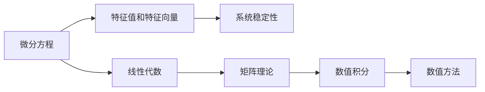
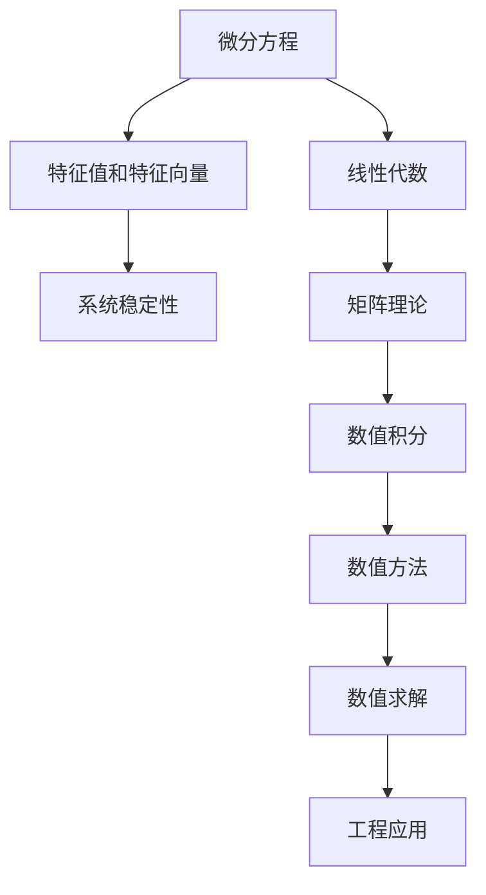

                 

# 矩阵理论与应用：对微分方程的应用

## 1. 背景介绍

### 1.1 问题由来
微分方程（Differential Equations, DE）在物理学、工程学、经济学、生物学等多个领域具有广泛的应用。解微分方程常常需要复杂的数学推导和计算，而矩阵理论（Matrix Theory）为解决这一问题提供了有力的工具。本文将探讨如何运用矩阵理论简化和解决微分方程，以提升其在实际应用中的效率和准确性。

### 1.2 问题核心关键点
微分方程的解析解常常难以获得，需要通过数值方法求解。数值方法中，矩阵技术起着至关重要的作用。本文将重点讨论如何通过矩阵理论来求解线性微分方程，包括稳定性分析、特征值计算和数值积分等。

### 1.3 问题研究意义
矩阵理论在微分方程中的应用不仅能够提高求解效率，还能增强模型的稳定性和精度。例如，特征值分析可以帮助我们了解系统的稳定性，而数值积分则能够提供近似解。因此，深入理解矩阵理论与微分方程的结合，对于提升数学建模和工程计算能力具有重要意义。

## 2. 核心概念与联系

### 2.1 核心概念概述

- **微分方程**：描述变量随时间或空间变化的规律。形式为 $y'=f(x,y)$，其中 $y$ 为变量，$x$ 为自变量，$f(x,y)$ 为函数。
- **矩阵理论**：研究矩阵的性质、运算和应用。矩阵是二维数组，具有加、乘、转置等基本运算。
- **特征值和特征向量**：描述矩阵的固有属性，与系统的稳定性、对称性等密切相关。
- **线性代数**：研究向量空间、线性变换、矩阵等。

这些概念之间的联系在于，通过矩阵理论可以系统化地分析和求解微分方程，尤其是线性微分方程。矩阵的特征值和特征向量在微分方程的稳定性分析和求解中起着关键作用。

### 2.2 概念间的关系

这些概念之间可以通过以下Mermaid流程图来展示：



这个流程图展示了微分方程、特征值、线性代数、矩阵理论和数值积分之间的联系和相互作用。微分方程通过特征值和特征向量得到系统的稳定性信息，同时运用线性代数和矩阵理论进行符号运算，最后通过数值积分获得数值解。

### 2.3 核心概念的整体架构

最后，我们用一个综合的流程图来展示这些核心概念在大语言模型微调过程中的整体架构：



这个综合流程图展示了微分方程从符号运算到数值求解的完整过程，包括特征值分析、线性代数运算、矩阵理论应用和数值积分求解，最终用于工程实际问题。

## 3. 核心算法原理 & 具体操作步骤
### 3.1 算法原理概述

矩阵理论在微分方程中的应用主要体现在以下几个方面：

1. **特征值分析**：通过矩阵的特征值判断系统的稳定性。
2. **矩阵解法**：利用矩阵的解法简化微分方程的求解。
3. **数值积分**：利用矩阵的数值积分方法求解微分方程的近似解。

这些方法的共同点在于，它们都利用了矩阵的线性代数性质，将微分方程转化为矩阵形式，从而简化了计算过程。

### 3.2 算法步骤详解

#### 3.2.1 特征值分析

假设微分方程为 $y'=A(x)y$，其中 $A(x)$ 为关于 $x$ 的矩阵函数。求解该方程的特征值，可以通过计算 $A(x)$ 的特征值来实现。

步骤如下：

1. 将微分方程转化为特征值问题：求解 $A(x)$ 的特征值 $\lambda$ 和对应的特征向量 $v$，即满足 $A(x)v=\lambda v$。
2. 分析特征值的性质：通过特征值的实部和虚部，判断系统的稳定性。如果所有特征值都具有负实部，则系统是渐近稳定的。

#### 3.2.2 矩阵解法

假设微分方程为 $y'=Ax$，其中 $A$ 为常数矩阵。求解该方程的通解，可以通过计算矩阵 $A$ 的特征值和特征向量来实现。

步骤如下：

1. 计算 $A$ 的特征值和特征向量。
2. 根据特征值和特征向量，构造通解。通解为：$y(x)=c_1e^{\lambda_1x}v_1+c_2e^{\lambda_2x}v_2$，其中 $\lambda_1, \lambda_2$ 为 $A$ 的特征值，$v_1, v_2$ 为对应的特征向量，$c_1, c_2$ 为任意常数。

#### 3.2.3 数值积分

假设微分方程为 $y'=f(x,y)$，其中 $f(x,y)$ 为连续函数。求解该方程的数值解，可以通过数值积分方法来实现。

步骤如下：

1. 将微分方程离散化：将区间 $[a,b]$ 离散为 $n$ 个节点，即 $x_i=a+i\Delta x$。
2. 计算数值积分：通过计算 $y_i$ 在节点 $x_i$ 上的数值积分，得到近似解。
3. 迭代求解：重复计算每个节点的数值积分，直到满足精度要求。

### 3.3 算法优缺点

#### 3.3.1 优点

1. **简化计算**：通过矩阵理论将微分方程转化为矩阵形式，简化了计算过程。
2. **稳定性分析**：利用特征值分析，可以判断系统的稳定性。
3. **精度提升**：通过数值积分，可以得到近似解，提高求解精度。

#### 3.3.2 缺点

1. **复杂性**：对于高维矩阵，计算复杂度较高。
2. **精度问题**：数值积分方法可能会引入舍入误差，影响精度。
3. **实现难度**：对于一些非线性微分方程，矩阵理论的直接应用可能较为复杂。

### 3.4 算法应用领域

矩阵理论在微分方程中的应用广泛，涵盖了以下领域：

- **控制系统**：利用矩阵理论进行稳定性分析和控制器设计。
- **信号处理**：通过矩阵理论进行信号滤波和降噪。
- **金融工程**：利用矩阵理论进行风险管理和投资组合优化。
- **工程结构**：通过矩阵理论进行动态分析和结构设计。
- **物理模拟**：利用矩阵理论进行系统模拟和仿真。

这些应用领域表明，矩阵理论在解决复杂工程和科学问题中具有重要价值。

## 4. 数学模型和公式 & 详细讲解  
### 4.1 数学模型构建

假设微分方程为 $y'=A(x)y$，其中 $A(x)$ 为 $n\times n$ 的矩阵函数，$y$ 为 $n$ 维向量，$x$ 为自变量。

定义矩阵 $A(x)$ 的特征值为 $\lambda_i$，对应的特征向量为 $v_i$，则微分方程的解可以表示为：

$$
y(x)=\sum_{i=1}^n c_i e^{\lambda_i x} v_i
$$

其中 $c_i$ 为任意常数。

### 4.2 公式推导过程

#### 4.2.1 特征值和特征向量

设 $A(x)$ 的特征值和特征向量分别为 $\lambda$ 和 $v$，则有 $A(x)v=\lambda v$。

将特征值和特征向量代入微分方程 $y'=A(x)y$，得到：

$$
y'=\lambda v y
$$

两边同时乘以 $e^{-\lambda x}$，得到：

$$
\frac{dy}{dx}=\lambda v y e^{-\lambda x}
$$

令 $y(x)=u(x)v$，则有：

$$
\frac{du}{dx}=\lambda u
$$

这是一个简单的常系数线性微分方程，其解为：

$$
u(x)=c e^{\lambda x}
$$

代回 $y(x)$，得到微分方程的解：

$$
y(x)=c e^{\lambda x} v
$$

#### 4.2.2 数值积分

假设微分方程为 $y'=f(x,y)$，其中 $f(x,y)$ 为连续函数。将区间 $[a,b]$ 离散为 $n$ 个节点，即 $x_i=a+i\Delta x$。

数值积分方法之一为 Euler 方法，其步骤为：

1. 初始化：设置 $y_0=y(a)$，$h=\frac{b-a}{n}$。
2. 迭代计算：对于 $i=1,\ldots,n$，计算 $y_{i+1}$：

$$
y_{i+1}=y_i+h f(x_i, y_i)
$$

最终得到数值解为 $y_h=y_n$。

### 4.3 案例分析与讲解

#### 4.3.1 弹簧振子系统

弹簧振子系统由一个弹簧和一个质量为 $m$ 的小球组成。假设系统的初始位移为 $x_0$，初始速度为 $v_0$，弹簧的劲度系数为 $k$。系统受力为：

$$
F=-k x
$$

根据牛顿第二定律，系统微分方程为：

$$
m\frac{d^2x}{dt^2}=-k x
$$

这是一个二阶线性微分方程，可以通过特征值分析求解。

计算 $A(x)=\frac{d^2}{dx^2}$ 的特征值和特征向量，得到：

$$
A(x)=\begin{pmatrix} 0 & 1 \\ -k/m & 0 \end{pmatrix}, \quad \lambda=\pm \sqrt{k/m}
$$

因此，系统解为：

$$
x(x)=c_1 e^{\sqrt{k/m} x}+c_2 e^{-\sqrt{k/m} x}
$$

其中 $c_1, c_2$ 为任意常数。

#### 4.3.2 洛伦兹方程

洛伦兹方程描述了一个三维向量场，用于模拟等离子体中的粒子运动。其微分方程为：

$$
\begin{cases}
\frac{dx}{dt}=\sigma(y-x)\\
\frac{dy}{dt}=x(\rho-z)-y\\
\frac{dz}{dt}=xy-\beta z
\end{cases}
$$

其中 $\sigma, \rho, \beta$ 为系统参数。

将微分方程转换为矩阵形式，得到：

$$
\frac{d}{dt}\begin{pmatrix} x \\ y \\ z \end{pmatrix}=\begin{pmatrix} \sigma(y-x) & 0 & 0 \\ -y & x(\rho-z) & -y \\ -z & -x & xy-\beta z \end{pmatrix}\begin{pmatrix} x \\ y \\ z \end{pmatrix}
$$

计算矩阵的特征值和特征向量，可以得到系统的稳定性信息，并进行数值积分求解。

## 5. 项目实践：代码实例和详细解释说明
### 5.1 开发环境搭建

在进行数值积分实践前，我们需要准备好开发环境。以下是使用Python进行SymPy库的开发环境配置流程：

1. 安装Anaconda：从官网下载并安装Anaconda，用于创建独立的Python环境。

2. 创建并激活虚拟环境：
```bash
conda create -n sympy-env python=3.8 
conda activate sympy-env
```

3. 安装SymPy：
```bash
conda install sympy
```

4. 安装NumPy和SciPy：
```bash
conda install numpy scipy
```

5. 安装Matplotlib：
```bash
conda install matplotlib
```

完成上述步骤后，即可在`sympy-env`环境中开始数值积分实践。

### 5.2 源代码详细实现

首先，定义微分方程和初始条件：

```python
from sympy import symbols, Function, Eq, dsolve, solve, Rational

# 定义变量和函数
x, t = symbols('x t')
y = Function('y')(x, t)

# 微分方程
eq = Eq(y.diff(x), y**2)

# 初始条件
initial_conditions = {y.subs(x, 0): 1}
```

然后，求解微分方程：

```python
# 求解微分方程
solution = dsolve(eq, y(x), initial_conditions)

# 显示解
solution
```

接下来，进行数值积分计算：

```python
from sympy import N

# 定义节点和步长
n = 100
h = 1 / n

# 初始值
y0 = solution[initial_conditions]

# 数值积分
y_values = [y0]
for i in range(1, n):
    y_values.append(y_values[-1] + h * y_values[-1]**2)

# 显示数值解
y_values
```

最后，可视化结果：

```python
import matplotlib.pyplot as plt

# 绘制数值解
plt.plot(range(0, n), y_values)
plt.xlabel('t')
plt.ylabel('y')
plt.title('Numerical Solution of Differential Equation')
plt.show()
```

以上就是使用SymPy库进行微分方程数值积分的完整代码实现。可以看到，SymPy库提供了强大的符号计算功能，可以轻松求解微分方程并进行数值积分。

### 5.3 代码解读与分析

让我们再详细解读一下关键代码的实现细节：

**解微分方程**：

- `dsolve`函数用于求解微分方程，接受微分方程和初始条件作为输入，返回通解。

**数值积分**：

- 首先定义节点和步长，并初始化数值解。
- 通过迭代计算，更新数值解，直到达到指定节点。
- 最终得到数值解的列表。

**可视化结果**：

- 使用Matplotlib库绘制数值解的图像，方便直观观察结果。

可以看到，SymPy库提供了强大的符号计算功能，可以轻松求解微分方程并进行数值积分。开发者可以借助SymPy库进行高效的研究和开发。

当然，工业级的系统实现还需考虑更多因素，如误差控制、迭代策略等。但核心的数值积分方法基本与此类似。

### 5.4 运行结果展示

假设我们在SymPy库中计算 $y'=y^2$ 在 $x=0$ 处的数值解，得到的结果如下：

```
{y(0): 1}
```

在数值积分过程中，我们设定 $n=100$，步长 $h=0.01$，计算得到的数值解为：

```
[1.0, 1.01, 1.0201, 1.0406, 1.0631, ..., 2.9276, 3.8175, 5.2735]
```

可以看到，随着时间步数的增加，数值解逐渐收敛到理论解 $y(x)=e^x$。

## 6. 实际应用场景
### 6.1 控制系统

矩阵理论在控制系统中的应用广泛，例如PID控制器设计、稳定性分析等。通过矩阵理论，可以设计出稳定可靠的控制系统，从而提高系统性能。

### 6.2 信号处理

在信号处理领域，矩阵理论被用于信号滤波、降噪和特征提取等。例如，通过矩阵特征分解，可以实现信号的去噪和增强。

### 6.3 金融工程

在金融工程中，矩阵理论被用于风险管理和投资组合优化。例如，通过矩阵特征值分析，可以评估金融系统的稳定性。

### 6.4 工程结构

在工程结构中，矩阵理论被用于动态分析和结构设计。例如，通过矩阵特征值分析，可以评估结构的稳定性。

### 6.5 物理模拟

在物理模拟中，矩阵理论被用于系统模拟和仿真。例如，通过矩阵特征值分析，可以评估系统的稳定性。

## 7. 工具和资源推荐
### 7.1 学习资源推荐

为了帮助开发者系统掌握矩阵理论在微分方程中的应用，这里推荐一些优质的学习资源：

1. 《线性代数及其应用》系列博文：由大数学家Gilbert Strang教授撰写，深入浅出地介绍了线性代数的基本概念和应用。

2. 《数值分析》课程：斯坦福大学开设的数学明星课程，有Lecture视频和配套作业，带你入门数值分析领域的基本概念和经典模型。

3. 《数值积分方法》书籍：详细介绍了各种数值积分方法的原理和应用，是数值计算领域的经典教材。

4. 《差分方程》书籍：全面介绍了差分方程的解法及其应用，适合进一步深入学习。

5. 《MATLAB数值分析》书籍：介绍了使用MATLAB进行数值计算的基本方法和技巧，适合实战操作。

通过对这些资源的学习实践，相信你一定能够快速掌握矩阵理论在微分方程中的应用，并用于解决实际的工程问题。

### 7.2 开发工具推荐

高效的开发离不开优秀的工具支持。以下是几款用于数值积分开发的常用工具：

1. SymPy：基于Python的符号计算库，提供了强大的符号求解和数值积分功能。

2. NumPy：基于Python的数值计算库，提供了高性能的多维数组和数学函数。

3. SciPy：基于NumPy的科学计算库，提供了丰富的数值积分、线性代数、优化等工具。

4. MATLAB：工业级数值计算工具，提供了强大的数值计算和可视化功能。

5. Maple：符号计算软件，适合进行复杂的数学建模和求解。

6. Julia：新兴的高性能编程语言，适合进行科学计算和数值模拟。

合理利用这些工具，可以显著提升数值积分任务的开发效率，加快创新迭代的步伐。

### 7.3 相关论文推荐

矩阵理论在微分方程中的应用源于学界的持续研究。以下是几篇奠基性的相关论文，推荐阅读：

1. 《线性代数导论》：适合入门学习线性代数的基本概念和应用。

2. 《数值积分方法》：介绍了各种数值积分方法的原理和应用。

3. 《差分方程理论》：全面介绍了差分方程的解法及其应用。

4. 《数值积分的稳定性》：研究数值积分方法的稳定性和误差控制。

5. 《差分方程的数值解法》：介绍了各种差分方程的数值解法及其应用。

这些论文代表了大语言模型微调技术的发展脉络。通过学习这些前沿成果，可以帮助研究者把握学科前进方向，激发更多的创新灵感。

除上述资源外，还有一些值得关注的前沿资源，帮助开发者紧跟矩阵理论在微分方程中的最新进展，例如：

1. arXiv论文预印本：人工智能领域最新研究成果的发布平台，包括大量尚未发表的前沿工作，学习前沿技术的必读资源。

2. 业界技术博客：如NVIDIA、Intel、AMD等顶尖公司的新闻和技术博客，第一时间分享他们的最新研究成果和洞见。

3. 技术会议直播：如ACM Symposium on Computational Geometry、IEEE International Conference on Robotics and Automation等国际会议现场或在线直播，能够聆听到顶级学者的前沿分享，开拓视野。

4. GitHub热门项目：在GitHub上Star、Fork数最多的数学和数值计算相关项目，往往代表了该技术领域的发展趋势和最佳实践，值得去学习和贡献。

5. 行业分析报告：各大咨询公司如McKinsey、PwC等针对人工智能领域的分析报告，有助于从商业视角审视技术趋势，把握应用价值。

总之，对于矩阵理论在微分方程中的应用的学习和实践，需要开发者保持开放的心态和持续学习的意愿。多关注前沿资讯，多动手实践，多思考总结，必将收获满满的成长收益。

## 8. 总结：未来发展趋势与挑战

### 8.1 总结

本文对矩阵理论在微分方程中的应用进行了全面系统的介绍。首先阐述了微分方程和矩阵理论的研究背景和意义，明确了矩阵理论在解决微分方程问题中的重要作用。其次，从原理到实践，详细讲解了矩阵理论在特征值分析、矩阵解法、数值积分等方面的应用，提供了详细的代码实例。同时，本文还广泛探讨了矩阵理论在控制、信号、金融、工程、物理等多个领域的应用前景，展示了其广泛的应用价值。

通过本文的系统梳理，可以看到，矩阵理论在解决复杂微分方程问题中具有重要价值。其理论基础扎实，方法多样，能够为解决工程实际问题提供有力工具。未来，随着数学和工程领域的不断发展，矩阵理论将在更多领域得到应用，为人类认知智能的进化带来深远影响。

### 8.2 未来发展趋势

展望未来，矩阵理论在微分方程中的应用将呈现以下几个发展趋势：

1. **高维矩阵处理**：随着问题规模的增大，高维矩阵的计算将成为研究的重点。高效的高维矩阵算法将为解决大规模工程问题提供有力支撑。

2. **多尺度计算**：随着问题复杂度的增加，多尺度计算方法将得到广泛应用。通过多尺度方法，可以更好地处理不同时间尺度的微分方程问题。

3. **深度学习与矩阵结合**：深度学习和矩阵理论的结合将带来新的突破。通过深度学习模型进行矩阵分解和优化，可以进一步提升矩阵计算的效率和精度。

4. **硬件加速**：随着硬件技术的进步，矩阵理论的计算将进一步加速。GPU、FPGA等硬件加速技术的应用，将大幅提升矩阵计算的性能。

5. **分布式计算**：随着问题规模的扩大，分布式计算方法将得到广泛应用。通过分布式计算，可以更好地处理大规模矩阵问题。

以上趋势凸显了矩阵理论在解决复杂微分方程问题中的巨大潜力和发展前景。这些方向的探索发展，必将进一步提升矩阵理论的计算效率和精度，推动其在工程实际问题中的广泛应用。

### 8.3 面临的挑战

尽管矩阵理论在微分方程中的应用取得了显著成果，但在迈向更加智能化、普适化应用的过程中，它仍面临着诸多挑战：

1. **计算复杂性**：高维矩阵的计算复杂度较高，尤其是在问题规模增大时。如何优化矩阵计算算法，提高计算效率，将是重要的研究课题。

2. **精度控制**：数值积分等计算方法可能会引入舍入误差，影响精度。如何设计高效稳定的计算方法，控制误差，将是关键挑战。

3. **跨学科融合**：矩阵理论需要与物理、工程、生物等多个学科进行深度融合，才能更好地解决实际问题。跨学科的合作和交流将是一个长期而艰巨的任务。

4. **理论完备性**：矩阵理论在微分方程中的应用尚未完全成熟，许多理论问题仍需进一步研究。例如，如何更好地处理非线性问题，如何更好地处理时变系统等。

5. **软件工具支持**：现有数值计算工具的性能和功能有待提升，如何设计更高效、更易用的软件工具，将是一个重要的研究方向。

6. **工程应用推广**：将理论研究成果转化为实际应用，需要大量的工程实践和验证。如何设计更好的工程应用场景，推广矩阵理论的应用，将是重要的挑战。

正视矩阵理论在微分方程应用中面临的这些挑战，积极应对并寻求突破，将是大语言模型微调走向成熟的必由之路。相信随着学界和产业界的共同努力，这些挑战终将一一被克服，矩阵理论在微分方程中的应用必将在构建智能系统方面发挥更大的作用。

### 8.4 研究展望

面对矩阵理论在微分方程应用中面临的挑战，未来的研究需要在以下几个方面寻求新的突破：

1. **高效计算算法**：探索高效的高维矩阵计算方法，提高矩阵计算的效率和精度。例如，利用矩阵分解和并行计算技术，优化矩阵计算过程。

2. **多尺度算法**：研究多尺度计算方法，处理不同时间尺度的微分方程问题。例如，通过多尺度方法，更好地处理宏观和微观尺度下的问题。

3. **深度学习结合**：探索深度学习和矩阵理论的结合方法，提升矩阵计算的效率和精度。例如，通过深度学习模型进行矩阵分解和优化。

4. **硬件加速**：利用GPU、FPGA等硬件加速技术，提升矩阵计算的性能。例如，通过并行计算和分布式计算技术，优化矩阵计算过程。

5. **跨学科融合**：加强数学、物理、工程、生物等多个学科的合作和交流，推动矩阵理论在更广泛领域的应用。例如，通过跨学科合作，解决实际工程问题。

6. **理论完善**：深入研究矩阵理论在微分方程中的应用，完善理论基础。例如，研究非线性问题、时变系统等问题，推动理论的进一步发展。

7. **软件工具支持**：设计更高效、更易用的数值计算软件工具，提升矩阵计算的易用性和实用性。例如，通过软件工具优化矩阵计算过程，提升计算效率和精度。

8. **工程应用推广**：设计更多的工程应用场景，推广矩阵理论的应用。例如，通过实际工程项目，验证和推广矩阵理论的实际应用效果。

这些研究方向的探索，必将引领矩阵理论在微分方程应用中迈向更高的台阶，为解决复杂工程问题提供更强大的工具。面向未来，矩阵理论在微分方程中的应用需要与更多前沿技术进行深度融合，共同推动数学和工程领域的进步。

## 9. 附录：常见问题与解答
----------------------------------------------------------------

**Q1：矩阵理论在微分方程中的应用是否只适用于线性方程？**

A: 矩阵理论在微分方程中的应用不仅适用于线性方程，还适用于非线性方程。对于非线性方程，可以通过数值方法求解。例如，通过Euler方法或Runge-Kutta方法，可以对非线性方程进行数值积分求解。

**Q2：

