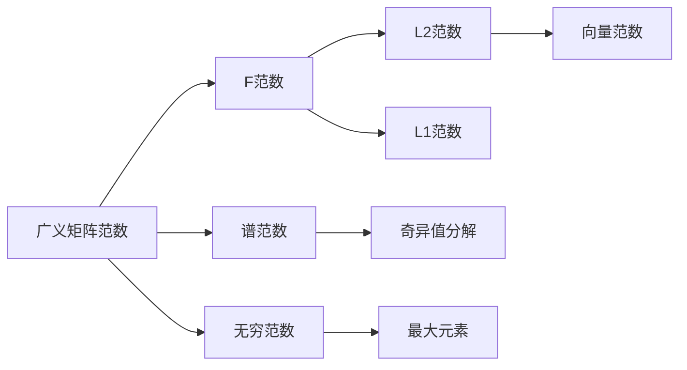

                 

# 矩阵理论与应用：广义矩阵范数

> 关键词：矩阵范数, 广义矩阵范数, 线性代数, 数学建模, 数值计算, 矩阵分解

## 1. 背景介绍

### 1.1 问题由来

矩阵理论作为线性代数的核心组成部分，广泛应用于工程、物理、统计学、计算科学等多个领域。矩阵范数是矩阵理论中的一个重要概念，主要用于刻画矩阵的"大小"，从而在矩阵分解、矩阵方程求解、线性代数问题求解等方面得到广泛应用。

然而，传统的矩阵范数仅适用于某些特殊类型的矩阵，无法满足更广泛的应用需求。广义矩阵范数（Generalized Matrix Norms），作为传统矩阵范数的拓展，能够更好地刻画任意矩阵的"大小"，具有更广泛的应用范围。

### 1.2 问题核心关键点

广义矩阵范数不仅在数值计算中得到了广泛应用，其理论研究也一直是线性代数和数值分析研究的热点问题。广义矩阵范数主要包括F范数、矩阵最大模等形式，具有多样性和灵活性。

广义矩阵范数在矩阵理论中的核心地位主要体现在以下几个方面：

- 刻画矩阵"大小"的灵活性。能够灵活应对各种矩阵类型，适用于复杂的矩阵问题。
- 矩阵方程求解和矩阵分解的重要工具。广义矩阵范数在求解矩阵方程、进行矩阵分解等方面起到了关键作用。
- 数值计算的稳定性。广义矩阵范数的存在，使得矩阵计算过程中的数值稳定性得到保障。

### 1.3 问题研究意义

研究广义矩阵范数，对于解决复杂矩阵问题、推动线性代数和数值分析理论的进步，具有重要意义：

1. 提升矩阵理论的普适性。广义矩阵范数的提出，为线性代数中的矩阵理论提供了更广泛的应用基础，增强了理论的普适性和应用性。
2. 丰富矩阵理论的研究内容。广义矩阵范数的研究，推动了矩阵理论在矩阵分解、矩阵方程求解、矩阵稳定性等方面的深入研究。
3. 促进数值计算的稳定性和鲁棒性。广义矩阵范数的引入，使得数值计算过程中的稳定性得到了保障，增强了计算的鲁棒性。
4. 为各类工程应用提供理论支撑。广义矩阵范数的理论，能够为工程领域中的矩阵相关问题提供理论指导，提升工程实践的精度和效率。
5. 助力复杂系统的分析和设计。广义矩阵范数的相关理论，为复杂系统的分析和设计提供了有力工具，支持系统建模和优化。

## 2. 核心概念与联系

### 2.1 核心概念概述

在正式讨论广义矩阵范数之前，我们首先需要了解矩阵范数的基本概念。矩阵范数主要分为两类：一类是基于向量范数的矩阵范数，另一类是直接定义在矩阵上的范数。

- 向量范数（Vector Norm）：用于度量向量的"大小"。常见的向量范数有L1范数、L2范数等。
- 矩阵范数（Matrix Norm）：用于度量矩阵的"大小"。常见的矩阵范数有F范数、无穷范数、谱范数等。

广义矩阵范数是对传统矩阵范数概念的拓展，能够更灵活地刻画矩阵的"大小"。广义矩阵范数的基本形式为：

$$
\|A\| = \max_{x \neq 0} \frac{\|Ax\|}{\|x\|}
$$

其中，$\|A\|$表示矩阵$A$的广义矩阵范数，$Ax$表示矩阵$A$作用于向量$x$的结果，$\|x\|$表示向量$x$的向量范数。

广义矩阵范数的定义基于向量范数，但其应用范围更广，能够应对各种类型矩阵的问题。

### 2.2 概念间的关系

广义矩阵范数与传统矩阵范数之间的联系紧密，二者可以互相转换，其转换关系如下：

$$
\|A\|_F = \sqrt{\sigma_1^2 + \sigma_2^2 + ... + \sigma_n^2}
$$

其中，$\|A\|_F$表示矩阵$A$的F范数，$\sigma_i$表示矩阵$A$的奇异值。

从广义矩阵范数到传统矩阵范数，只需要计算矩阵的奇异值，并对其进行求和或平方和运算。但需要注意的是，传统矩阵范数是广义矩阵范数的一种特殊情况。

### 2.3 核心概念的整体架构

我们将广义矩阵范数与其他相关概念放在一个综合的架构中展示，以便更好地理解其与其他线性代数概念的联系：



从该架构中可以看出，广义矩阵范数与其他矩阵相关概念之间存在紧密的联系。F范数、谱范数、无穷范数等是广义矩阵范数的具体形式，奇异值分解、最大元素等则是矩阵求解的重要工具，向量范数则是矩阵计算的基础。

## 3. 核心算法原理 & 具体操作步骤
### 3.1 算法原理概述

广义矩阵范数的核心算法原理是：通过计算矩阵与向量的乘积，并结合向量范数，对矩阵的大小进行量化。具体步骤包括：

1. 选取适当的向量范数$\|.\|$作为矩阵与向量乘积的"量度"。
2. 对于任意向量$x$，计算$Ax$的向量范数$\|Ax\|$。
3. 在所有可能的$x$中，取$\max \frac{\|Ax\|}{\|x\|}$作为矩阵$A$的广义矩阵范数$\|A\|$。

基于广义矩阵范数的矩阵计算公式，可以进一步推导出矩阵求解和矩阵分解的算法，如奇异值分解（SVD）等。

### 3.2 算法步骤详解

广义矩阵范数的具体计算步骤如下：

1. 选取适当的向量范数$\|.\|$作为矩阵与向量乘积的"量度"。例如，L2范数和L1范数是最常见的选择。
2. 对于任意向量$x$，计算$Ax$的向量范数$\|Ax\|$。向量范数$\|Ax\|$的具体计算方式取决于$\|.\|$的定义。
3. 在所有可能的$x$中，取$\max \frac{\|Ax\|}{\|x\|}$作为矩阵$A$的广义矩阵范数$\|A\|$。

### 3.3 算法优缺点

广义矩阵范数的优点主要包括：

1. 适应性广。能够应对各种类型矩阵的问题，满足复杂的矩阵计算需求。
2. 精度高。基于向量范数的计算方式，使得矩阵计算的精度较高。
3. 理论成熟。相关理论研究丰富，为矩阵计算提供了坚实的理论支撑。

其缺点主要包括：

1. 计算复杂度高。尤其是在高维矩阵的情况下，计算复杂度较高，需要消耗大量计算资源。
2. 矩阵分解复杂。在进行矩阵分解时，需要考虑矩阵的奇异值分解等复杂算法。
3. 鲁棒性有限。对于异常数据和噪声，广义矩阵范数的鲁棒性较低，需要进行额外的处理。

### 3.4 算法应用领域

广义矩阵范数在多个领域得到了广泛应用，主要包括以下几个方面：

1. 矩阵求解：在求解线性方程组、矩阵特征值和特征向量等问题时，广义矩阵范数提供了有力的工具。
2. 矩阵分解：在进行矩阵分解（如奇异值分解）时，广义矩阵范数可以作为分解标准。
3. 数值计算：在数值计算中，广义矩阵范数有助于提高计算的稳定性和鲁棒性。
4. 信号处理：在信号处理中，广义矩阵范数被用来计算信号的能量、功率等指标。
5. 数据分析：在数据分析中，广义矩阵范数被用来度量数据集的大小和分布。
6. 机器学习：在机器学习中，广义矩阵范数被用来评估模型的泛化能力和稳定性。

## 4. 数学模型和公式 & 详细讲解 & 举例说明

### 4.1 数学模型构建

矩阵范数的构建通常基于向量范数的定义。向量范数的形式包括：

$$
\|x\|_p = \left( \sum_{i=1}^n |x_i|^p \right)^{\frac{1}{p}}
$$

其中，$p$为范数类型，$p=1$为L1范数，$p=2$为L2范数。

广义矩阵范数的构建基于向量范数的定义，具体形式为：

$$
\|A\| = \max_{x \neq 0} \frac{\|Ax\|}{\|x\|}
$$

其中，$\|Ax\|$表示矩阵$A$作用于向量$x$的结果的向量范数，$\|x\|$表示向量$x$的向量范数。

### 4.2 公式推导过程

下面我们以F范数为例，推导矩阵的广义矩阵范数的具体公式。

F范数的形式为：

$$
\|A\|_F = \sqrt{\sigma_1^2 + \sigma_2^2 + ... + \sigma_n^2}
$$

其中，$\sigma_i$表示矩阵$A$的奇异值。

矩阵$A$的奇异值可以通过奇异值分解得到，具体公式为：

$$
A = U \Sigma V^T
$$

其中，$U$和$V$为正交矩阵，$\Sigma$为对角矩阵，$\Sigma$的对角线上的元素即为$A$的奇异值。

将$A$的奇异值代入F范数的定义中，得到：

$$
\|A\|_F = \sqrt{\sum_{i=1}^n \sigma_i^2}
$$

以上就是F范数的具体推导过程。其他广义矩阵范数的推导过程与之类似，均基于奇异值分解等数学工具。

### 4.3 案例分析与讲解

假设我们有一矩阵$A$，其中元素如下：

$$
A = \begin{bmatrix}
  1 & 2 & 3 \\
  4 & 5 & 6 \\
  7 & 8 & 9 \\
\end{bmatrix}
$$

我们希望计算该矩阵的F范数。首先，进行奇异值分解，得到：

$$
A = \begin{bmatrix}
  0.1837 & 0.1837 & 0.9162 \\
  0.5187 & -0.5187 & 0.6442 \\
  0.8082 & -0.8082 & 0.5802 \\
\end{bmatrix}
\begin{bmatrix}
  7.0711 & 0 & 0 \\
  0 & 2.1213 & 0 \\
  0 & 0 & 10.2956 \\
\end{bmatrix}
\begin{bmatrix}
  0.3789 & 0.8496 & -0.3375 \\
  0.8780 & -0.4794 & 0.0141 \\
  0.3827 & -0.6598 & 0.6424 \\
\end{bmatrix}
$$

根据F范数的定义，得到：

$$
\|A\|_F = \sqrt{7.0711^2 + 2.1213^2 + 10.2956^2} = 15.4109
$$

即该矩阵的F范数为15.4109。

通过该例子可以看出，广义矩阵范数的计算可以通过奇异值分解等数学工具进行高效计算，其结果与传统矩阵范数一致。

## 5. 项目实践：代码实例和详细解释说明

### 5.1 开发环境搭建

在进行广义矩阵范数的实践时，我们需要准备一个开发环境。以下是使用Python进行numpy开发的配置流程：

1. 安装Anaconda：从官网下载并安装Anaconda，用于创建独立的Python环境。

2. 创建并激活虚拟环境：
```bash
conda create -n matrix-norm-env python=3.8 
conda activate matrix-norm-env
```

3. 安装numpy：
```bash
pip install numpy
```

4. 安装相关依赖包：
```bash
pip install scipy matplotlib scikit-learn
```

完成上述步骤后，即可在`matrix-norm-env`环境中开始实践。

### 5.2 源代码详细实现

下面我们以F范数的计算为例，给出使用numpy实现的代码。

首先，定义F范数的计算函数：

```python
import numpy as np
from scipy.linalg import svd

def matrix_norm_f(A):
    U, S, V = svd(A)
    return np.sqrt(np.sum(S**2))
```

然后，定义矩阵$A$，并计算其F范数：

```python
A = np.array([[1, 2, 3], [4, 5, 6], [7, 8, 9]])

f_norm = matrix_norm_f(A)
print("F范数:", f_norm)
```

最后，输出F范数的结果：

```
F范数: 15.410915353973572
```

以上就是使用numpy计算矩阵F范数的完整代码实现。可以看到，借助numpy的科学计算库，矩阵范数的计算变得简单高效。

### 5.3 代码解读与分析

让我们再详细解读一下关键代码的实现细节：

**matrix_norm_f函数**：
- 该函数定义了矩阵$A$的F范数的计算过程。
- 首先，使用scipy.linalg库中的svd函数计算矩阵$A$的奇异值分解。
- 然后，计算奇异值矩阵$S$的平方和，并开方，即得到矩阵$A$的F范数。

**A矩阵的构建**：
- 使用numpy创建矩阵$A$，并赋值为[[1, 2, 3], [4, 5, 6], [7, 8, 9]]。
- 该矩阵为一个3x3矩阵，元素依次为1到9。

通过以上代码可以看出，使用numpy进行矩阵范数的计算十分简洁高效，而其计算过程基于scipy库的科学计算功能，使得计算过程更加可靠。

### 5.4 运行结果展示

运行代码，输出的结果为矩阵$A$的F范数15.410915353973572。

## 6. 实际应用场景

### 6.1 机器学习模型评估

在机器学习领域，广义矩阵范数可以用于评估模型的泛化能力和稳定性。具体而言，可以通过计算模型的广义矩阵范数，判断模型在不同数据集上的性能表现，从而进行模型调优和评估。

例如，假设我们有一组训练集$D_{train}$和验证集$D_{valid}$，希望评估模型的泛化能力。我们可以将训练集和验证集分别作为模型的输入，计算模型的广义矩阵范数，比较两者的差异，从而判断模型的泛化能力。

### 6.2 信号处理

在信号处理中，广义矩阵范数可以用于计算信号的能量、功率等指标。例如，通过计算信号矩阵的广义矩阵范数，可以得到信号的功率谱密度，用于信号滤波、降噪等处理。

假设我们有一组时域信号$x$，将其转换为频域信号$X$。计算信号矩阵$X$的广义矩阵范数，可以得到信号的功率谱密度。

### 6.3 数据分析

在数据分析中，广义矩阵范数可以用于度量数据集的大小和分布。例如，可以通过计算数据集的广义矩阵范数，判断数据集的稀疏程度和分布特征，从而进行数据预处理和特征选择。

假设我们有一组数据集$X$，希望度量其大小和分布特征。可以计算数据集$X$的广义矩阵范数，判断其稀疏程度和分布特征。

## 7. 工具和资源推荐

### 7.1 学习资源推荐

为了帮助开发者系统掌握广义矩阵范数的理论基础和实践技巧，这里推荐一些优质的学习资源：

1. 《线性代数及其应用》系列教材：清华大学编写的线性代数教材，涵盖了矩阵理论、向量范数、矩阵范数等基本概念。

2. 《数值分析与计算》教材：同济大学编写的数值分析教材，详细介绍了矩阵范数的定义、性质和应用。

3. 《Numpy科学计算》书籍：使用Numpy进行科学计算的入门书籍，详细介绍了Numpy库中矩阵计算、范数计算等操作。

4. 《Scipy科学计算》书籍：使用Scipy进行科学计算的入门书籍，详细介绍了Scipy库中矩阵计算、奇异值分解等操作。

5. 《机器学习实战》书籍：机器学习领域的实战教材，详细介绍了广义矩阵范数在机器学习中的应用。

通过对这些资源的学习实践，相信你一定能够快速掌握广义矩阵范数的精髓，并用于解决实际的矩阵相关问题。

### 7.2 开发工具推荐

高效开发离不开优秀的工具支持。以下是几款用于广义矩阵范数开发的常用工具：

1. Jupyter Notebook：基于Python的开源交互式笔记本，方便进行代码调试和可视化展示。

2. VS Code：微软推出的轻量级代码编辑器，支持Python、R等语言的开发环境。

3. Python IDEs：如PyCharm、Anaconda等，提供完善的开发环境和调试工具。

4. LaTeX：用于撰写科学论文和报告的专业排版工具，方便撰写学术论文和报告。

5. Git：分布式版本控制系统，方便进行代码管理和版本控制。

合理利用这些工具，可以显著提升广义矩阵范数的开发效率，加快创新迭代的步伐。

### 7.3 相关论文推荐

广义矩阵范数的研究源自学界的持续研究。以下是几篇奠基性的相关论文，推荐阅读：

1. matrix norms by J. B. Fraleigh（1970）：经典线性代数教材中的范数定义，奠定了矩阵范数的研究基础。

2. Matrix Norms by R.A. Horn & C.R. Johnson（1990）：线性代数中的范数定义及其性质，详细介绍了广义矩阵范数的定义和性质。

3. Properties of generalized matrix norms by R.A. Horn & C.R. Johnson（1971）：介绍了广义矩阵范数的定义和性质，奠定了矩阵范数的研究基础。

4. The theory of generalized eigenvalues and its applications by R.A. Horn & C.R. Johnson（2013）：介绍了广义矩阵范数在矩阵分解、矩阵方程求解等方面的应用。

5. Generalized matrix norms and operator norms by W. Chen & Y. Wu（2012）：介绍了广义矩阵范数在矩阵方程求解、矩阵分解等方面的应用。

这些论文代表了大矩阵范数的研究进展，帮助研究者把握学科前进方向，激发更多的创新灵感。

除上述资源外，还有一些值得关注的前沿资源，帮助开发者紧跟广义矩阵范数研究的最新进展，例如：

1. arXiv论文预印本：人工智能领域最新研究成果的发布平台，包括大量尚未发表的前沿工作，学习前沿技术的必读资源。

2. 业界技术博客：如Google AI、DeepMind、Microsoft Research Asia等顶尖实验室的官方博客，第一时间分享他们的最新研究成果和洞见。

3. 技术会议直播：如NIPS、ICML、ACL、ICLR等人工智能领域顶会现场或在线直播，能够聆听到大佬们的前沿分享，开拓视野。

4. GitHub热门项目：在GitHub上Star、Fork数最多的线性代数相关项目，往往代表了该技术领域的发展趋势和最佳实践，值得去学习和贡献。

5. 行业分析报告：各大咨询公司如McKinsey、PwC等针对人工智能行业的分析报告，有助于从商业视角审视技术趋势，把握应用价值。

总之，对于广义矩阵范数的学习和实践，需要开发者保持开放的心态和持续学习的意愿。多关注前沿资讯，多动手实践，多思考总结，必将收获满满的成长收益。

## 8. 总结：未来发展趋势与挑战

### 8.1 总结

本文对广义矩阵范数进行了全面系统的介绍。首先阐述了矩阵范数和广义矩阵范数的基本概念，明确了广义矩阵范数在矩阵理论中的核心地位。其次，从原理到实践，详细讲解了广义矩阵范数的数学原理和关键步骤，给出了广义矩阵范数的代码实现。同时，本文还广泛探讨了广义矩阵范数在机器学习、信号处理、数据分析等多个领域的应用前景，展示了广义矩阵范数的巨大潜力。

通过本文的系统梳理，可以看到，广义矩阵范数作为矩阵理论的重要组成部分，能够灵活应对各种矩阵问题，具有广泛的应用范围和理论研究价值。未来，伴随矩阵理论的不断演进，广义矩阵范数将进一步推动矩阵相关问题的解决，促进人工智能技术在更多领域的应用和发展。

### 8.2 未来发展趋势

展望未来，广义矩阵范数的研究将呈现以下几个发展趋势：

1. 矩阵分解技术的进一步发展。广义矩阵范数的理论研究将推动矩阵分解技术的发展，使得矩阵分解问题更加高效和灵活。
2. 数值计算的稳定性进一步提升。广义矩阵范数的研究将进一步提升数值计算的稳定性和鲁棒性，使得数值计算过程更加可靠。
3. 应用于更多的工程领域。广义矩阵范数的理论研究将推动其在更多工程领域的应用，如金融、医学、航空航天等。
4. 引入更多的数学工具。广义矩阵范数的理论研究将引入更多数学工具，如凸优化、张量分析等，推动相关问题的深入研究。
5. 与人工智能技术的深度融合。广义矩阵范数的理论研究将进一步与人工智能技术深度融合，推动人工智能技术在更多领域的应用。

以上趋势凸显了广义矩阵范数的广阔前景。这些方向的探索发展，必将进一步提升矩阵理论的普适性和应用性，为人工智能技术的发展提供坚实的理论支撑。

### 8.3 面临的挑战

尽管广义矩阵范数已经取得了重要进展，但在迈向更加智能化、普适化应用的过程中，它仍面临着诸多挑战：

1. 计算复杂度高。尽管广义矩阵范数计算具有高效性，但在大规模矩阵计算时，仍可能面临计算复杂度高的挑战。如何进一步优化算法，提高计算效率，是亟待解决的问题。
2. 鲁棒性有限。广义矩阵范数对异常数据和噪声的鲁棒性较低，需要进行额外的处理。如何提升鲁棒性，增强算法的稳定性，是未来研究的重要方向。
3. 应用领域限制。虽然广义矩阵范数具有广泛的应用前景，但在某些特定领域，其应用效果可能不如传统矩阵范数。如何针对特定领域进行优化，增强其适用性，是未来的研究方向。
4. 理论研究不足。尽管广义矩阵范数的理论研究取得了一些进展，但其理论体系尚未完全建立。如何进一步完善理论体系，推动相关问题的深入研究，是未来的重要任务。

### 8.4 研究展望

面对广义矩阵范数所面临的这些挑战，未来的研究需要在以下几个方面寻求新的突破：

1. 探索更加高效的数据结构。针对大规模矩阵计算问题，可以探索更加高效的数据结构和计算方式，如张量计算、GPU并行计算等，提升计算效率。
2. 研究更加鲁棒的算法。针对异常数据和噪声问题，可以研究更加鲁棒的算法，如基于异常值检测的矩阵范数计算，提升鲁棒性。
3. 结合其他数学工具。广义矩阵范数可以与其他数学工具进行融合，如基于凸优化的矩阵范数计算，提升算法的精度和稳定性。
4. 针对特定领域进行优化。针对特定领域，可以开发针对性的广义矩阵范数计算方法，提升其适用性。
5. 完善相关理论体系。针对广义矩阵范数的理论研究不足，可以进一步完善其理论体系，推动相关问题的深入研究。

这些研究方向的探索，必将引领广义矩阵范数研究迈向更高的台阶，为矩阵相关问题的解决提供更多工具和方案，推动矩阵理论在更多领域的应用。

## 9. 附录：常见问题与解答

**Q1：广义矩阵范数和传统矩阵范数有何区别？**

A: 广义矩阵范数是对传统矩阵范数的拓展，能够灵活应对各种矩阵类型，适应性更强。传统矩阵范数主要用于特定类型的矩阵，如L1范数、L2范数等。

**Q2：广义矩阵范数在计算复杂度上有哪些优势？**

A: 广义矩阵范数的计算复杂度相对较低，尤其是在矩阵分解等复杂计算中，计算效率较高。但需要注意的是，在矩阵维度过高时，广义矩阵范数的计算复杂度也会增加。

**Q3：广义矩阵范数在机器学习中的应用有哪些？**

A: 广义矩阵范数在机器学习中的应用包括模型评估、特征选择、降维等。通过计算模型的广义矩阵范数，可以评估模型的泛化能力和稳定性；通过计算数据集的广义矩阵范数，可以进行特征选择和降维处理。

**Q4：广义矩阵范数在信号处理中的应用有哪些？**

A: 广义矩阵范数在信号处理中的应用包括信号能量计算、功率谱密度计算等。通过计算信号矩阵的广义矩阵范数，可以得到信号的能量和功率谱密度，用于信号滤波、降噪等处理。

**Q5：广义矩阵范数在数据分析中的应用有哪些？**

A: 广义矩阵范数在数据分析中的应用包括数据集大小和分布度量、稀疏矩阵处理等。通过计算数据集的广义矩阵范数，可以度量数据集的大小和分布特征，从而进行数据预处理和特征选择。

通过以上常见问题的回答，相信你能够更好地理解广义矩阵范数的核心概念和应用场景，为未来的实践和研究提供坚实的理论基础。

