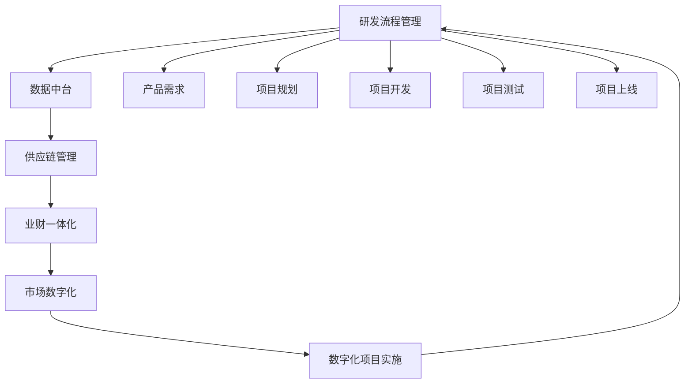
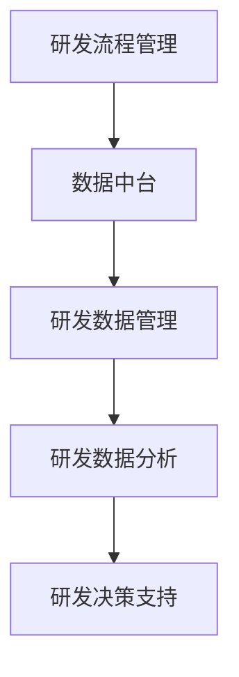
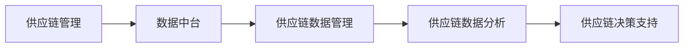
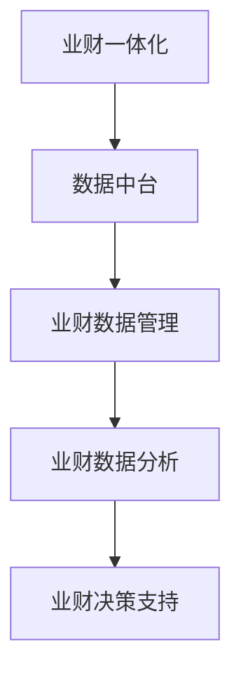
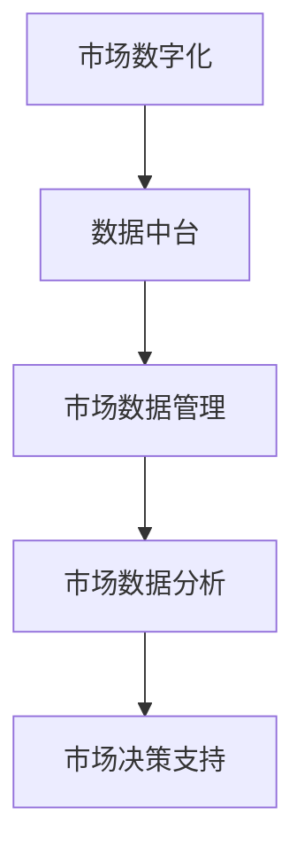

                 

# 研发/供应链/业财-体/数字营销流程与数字化项目实施方案

## 1. 背景介绍

### 1.1 问题由来
在数字化转型的大潮下，越来越多的企业开始重视研发、供应链、业财、市场等多个领域的数字化建设。这些领域涉及的业务复杂度高，数据量大，流程长，系统集成难度大。传统的烟囱式系统架构无法满足企业对数据共享、业务协同、决策支持的需求，亟需一套端到端的数字化解决方案。

### 1.2 问题核心关键点
数字化建设的核心在于打通各个部门的数据壁垒，实现数据的流转、共享、分析与应用。具体来说，需要通过一套完整的数字化项目实施方案，从业务需求分析、技术架构设计、数据中台建设、系统开发集成、流程优化再造等各个环节，全面推动企业数字化转型，提升企业运营效率和竞争优势。

### 1.3 问题研究意义
构建数字化解决方案，不仅能够降低企业的运营成本，提升管理效率，还能实现数据驱动的业务决策，增强企业的市场竞争力。通过数字化转型，企业可以在数字化的道路上走得更远，实现数字化创新与颠覆式变革。

## 2. 核心概念与联系

### 2.1 核心概念概述

为了更好地理解研发/供应链/业财/市场等领域的数字化建设流程，本节将介绍几个关键的概念和它们之间的联系：

- **研发流程管理**：通过数字化工具实现研发项目的全生命周期管理，包括需求收集、立项评审、任务分配、代码审查、测试验收、部署上线等环节。
- **供应链管理**：通过数字化平台实现供应链的数字化转型，包括采购、生产、仓储、物流等环节，实现供应链的可视化和智能化管理。
- **业财一体化**：通过数字化手段实现业务和财务的一体化管理，包括财务预算、资金管理、成本核算、财务分析等，提升财务数据的实时性和准确性。
- **市场数字化**：通过数字化手段实现市场运营的智能化、精准化管理，包括市场情报、营销推广、渠道管理、客户关系管理等，提升市场运营的效率和效果。
- **数据中台**：建立统一的数据存储和治理平台，实现数据的集中化管理和共享，为数字化应用提供数据支撑。

这些核心概念之间的联系可以通过以下Mermaid流程图来展示：



这个流程图展示了大语言模型的核心概念及其之间的关系：

1. 研发流程管理通过数据中台获取数据支撑，推进产品研发。
2. 供应链管理在数据中台的支持下，实现物料的可视化和智能化管理。
3. 业财一体化利用数据中台的数据支撑，提升财务数据的实时性和准确性。
4. 市场数字化借助数据中台的数据分析能力，提升市场运营的效率和效果。
5. 数字化项目实施过程，通过数据中台进行数据的集中化和治理。

通过这些核心概念，我们可以更好地把握数字化建设的整体架构和实施过程。

### 2.2 概念间的关系

这些核心概念之间存在着紧密的联系，形成了数字化建设的整体生态系统。下面我通过几个Mermaid流程图来展示这些概念之间的关系。

#### 2.2.1 研发流程管理与数据中台的关系



这个流程图展示了研发流程管理与数据中台之间的关系：

1. 研发流程管理通过数据中台获取研发数据。
2. 数据中台将研发数据管理起来，实现数据的集中化。
3. 数据分析模块对研发数据进行挖掘分析，生成数据报表。
4. 决策支持模块对分析结果进行应用，辅助研发决策。

#### 2.2.2 供应链管理与数据中台的关系



这个流程图展示了供应链管理与数据中台之间的关系：

1. 供应链管理通过数据中台获取供应链数据。
2. 数据中台将供应链数据管理起来，实现数据的集中化。
3. 数据分析模块对供应链数据进行挖掘分析，生成数据报表。
4. 决策支持模块对分析结果进行应用，辅助供应链决策。

#### 2.2.3 业财一体化与数据中台的关系



这个流程图展示了业财一体化与数据中台之间的关系：

1. 业财一体化通过数据中台获取业财数据。
2. 数据中台将业财数据管理起来，实现数据的集中化。
3. 数据分析模块对业财数据进行挖掘分析，生成数据报表。
4. 决策支持模块对分析结果进行应用，辅助业财决策。

#### 2.2.4 市场数字化与数据中台的关系



这个流程图展示了市场数字化与数据中台之间的关系：

1. 市场数字化通过数据中台获取市场数据。
2. 数据中台将市场数据管理起来，实现数据的集中化。
3. 数据分析模块对市场数据进行挖掘分析，生成数据报表。
4. 决策支持模块对分析结果进行应用，辅助市场决策。

### 2.3 核心概念的整体架构

最后，我们用一个综合的流程图来展示这些核心概念在大语言模型微调过程中的整体架构：


这个综合流程图展示了从研发流程管理到数据中台，再到供应链管理、业财一体化、市场数字化，最后到数字化项目实施的整体架构。通过这些核心概念的协同运作，可以实现企业数字化转型的全流程管理和优化。

## 3. 核心算法原理 & 具体操作步骤
### 3.1 算法原理概述

数字化项目的实施过程，实质上是通过数字化技术对业务流程进行优化和再造，实现数据的流转、共享、分析与应用。具体来说，包括以下几个步骤：

1. **业务需求分析**：通过对业务现状的调研和分析，确定数字化建设的目标和范围。
2. **技术架构设计**：根据业务需求和技术现状，设计合理的技术架构，包括数据中台、数字化平台、应用系统等。
3. **数据中台建设**：建立统一的数据存储和治理平台，实现数据的集中化管理和共享。
4. **系统开发集成**：根据技术架构设计，开发和集成各类数字化应用，实现业务功能的数字化。
5. **流程优化再造**：通过数字化平台，优化和再造业务流程，提升运营效率和效果。

### 3.2 算法步骤详解

数字化项目实施的核心算法步骤如下：

1. **业务需求分析**：
   - **需求调研**：通过问卷调查、访谈等方式，了解业务现状、问题和需求。
   - **需求整理**：将收集到的需求进行整理，形成需求文档，确定优先级和实施计划。

2. **技术架构设计**：
   - **架构设计**：根据业务需求，设计合理的技术架构，包括数据中台、数字化平台、应用系统等。
   - **技术选型**：选择合适的技术栈和工具，实现架构设计。

3. **数据中台建设**：
   - **数据收集**：从业务系统、应用系统、第三方接口等渠道，收集数据并存储到数据中台。
   - **数据治理**：对数据进行清洗、转换、标准化等治理工作，提升数据质量。
   - **数据共享**：实现数据在不同系统之间的共享和访问，支持业务协同和决策支持。

4. **系统开发集成**：
   - **应用开发**：根据技术架构设计，开发和集成各类数字化应用，实现业务功能的数字化。
   - **系统测试**：对开发的应用进行测试，确保系统稳定可靠。

5. **流程优化再造**：
   - **流程设计**：根据业务需求，设计优化的业务流程，提升运营效率和效果。
   - **流程实施**：通过数字化平台，实现流程的自动化和智能化。

### 3.3 算法优缺点

数字化项目实施的算法具有以下优点：

- **全面性**：覆盖了业务需求分析、技术架构设计、数据中台建设、系统开发集成、流程优化再造等各个环节，全面推动企业数字化转型。
- **协同性**：通过数据中台的支撑，实现各部门数据的共享和协同，提升运营效率和效果。
- **灵活性**：根据业务需求和技术现状，设计合理的技术架构，灵活应对业务变化。

同时，也存在以下缺点：

- **复杂性**：涉及多个环节和技术的集成，实施过程复杂。
- **资源需求高**：需要大量的数据、人力、技术资源，投入成本高。
- **风险大**：涉及多个系统的集成和数据迁移，风险较高。

### 3.4 算法应用领域

数字化项目实施的算法在研发、供应链、业财、市场等多个领域都有广泛应用：

- **研发流程管理**：通过数字化平台，实现研发项目的全生命周期管理，提升研发效率和质量。
- **供应链管理**：通过数字化平台，实现供应链的可视化和智能化管理，提升供应链的效率和灵活性。
- **业财一体化**：通过数字化平台，实现业务和财务的一体化管理，提升财务数据的实时性和准确性。
- **市场数字化**：通过数字化平台，实现市场运营的智能化、精准化管理，提升市场运营的效率和效果。

## 4. 数学模型和公式 & 详细讲解  
### 4.1 数学模型构建

为了更好地理解数字化项目实施的算法过程，我们可以使用数学语言进行刻画。

假设数字化项目实施的目标函数为 $F$，包括业务需求分析、技术架构设计、数据中台建设、系统开发集成、流程优化再造等各个环节，其数学模型为：

$$
F = f_{需求分析} + f_{架构设计} + f_{数据中台} + f_{系统集成} + f_{流程再造}
$$

其中，$f_{需求分析}$、$f_{架构设计}$、$f_{数据中台}$、$f_{系统集成}$、$f_{流程再造}$ 分别表示各个环节的目标函数。

### 4.2 公式推导过程

以业务需求分析为例，其目标函数可以表示为：

$$
f_{需求分析} = \sum_{i=1}^n a_i \times c_i
$$

其中，$n$ 表示需求项的数量，$a_i$ 表示第 $i$ 项需求的优先级，$c_i$ 表示第 $i$ 项需求的成本。

### 4.3 案例分析与讲解

假设某公司需要进行数字化转型，涉及研发、供应链、业财、市场等多个领域。我们通过以下案例来展示数字化项目实施的算法过程：

1. **业务需求分析**：通过对业务现状的调研和分析，确定数字化建设的目标和范围。需求分析过程如下：
   - **调研**：通过问卷调查、访谈等方式，了解业务现状、问题和需求。
   - **整理**：将收集到的需求进行整理，形成需求文档，确定优先级和实施计划。

2. **技术架构设计**：根据业务需求，设计合理的技术架构，包括数据中台、数字化平台、应用系统等。架构设计过程如下：
   - **设计**：根据业务需求，设计合理的技术架构，包括数据中台、数字化平台、应用系统等。
   - **选型**：选择合适的技术栈和工具，实现架构设计。

3. **数据中台建设**：建立统一的数据存储和治理平台，实现数据的集中化管理和共享。数据中台建设过程如下：
   - **收集**：从业务系统、应用系统、第三方接口等渠道，收集数据并存储到数据中台。
   - **治理**：对数据进行清洗、转换、标准化等治理工作，提升数据质量。
   - **共享**：实现数据在不同系统之间的共享和访问，支持业务协同和决策支持。

4. **系统开发集成**：根据技术架构设计，开发和集成各类数字化应用，实现业务功能的数字化。系统开发集成过程如下：
   - **开发**：根据技术架构设计，开发和集成各类数字化应用，实现业务功能的数字化。
   - **测试**：对开发的应用进行测试，确保系统稳定可靠。

5. **流程优化再造**：通过数字化平台，优化和再造业务流程，提升运营效率和效果。流程优化再造过程如下：
   - **设计**：根据业务需求，设计优化的业务流程，提升运营效率和效果。
   - **实施**：通过数字化平台，实现流程的自动化和智能化。

## 5. 项目实践：代码实例和详细解释说明
### 5.1 开发环境搭建

在进行数字化项目实施的实践前，我们需要准备好开发环境。以下是使用Python进行Django开发的环境配置流程：

1. 安装Anaconda：从官网下载并安装Anaconda，用于创建独立的Python环境。

2. 创建并激活虚拟环境：
```bash
conda create -n django-env python=3.8 
conda activate django-env
```

3. 安装Django：
```bash
pip install django
```

4. 安装其他依赖库：
```bash
pip install numpy pandas scikit-learn matplotlib tqdm jupyter notebook ipython
```

5. 安装Git：
```bash
brew install git
```

6. 配置Git：
```bash
git config --global user.name "Your Name"
git config --global user.email "your@email.com"
```

完成上述步骤后，即可在`django-env`环境中开始项目实践。

### 5.2 源代码详细实现

这里我们以研发流程管理系统的开发为例，给出使用Django进行数字化项目实施的PyTorch代码实现。

首先，定义项目的基本设置：

```python
import os
from django.conf import settings

def project_name():
    return os.path.basename(settings.BASE_DIR)
```

然后，定义模型的基本结构：

```python
from django.db import models
from django.contrib.auth.models import User
from django.core.validators import MinLengthValidator

class Project(models.Model):
    name = models.CharField(max_length=200, unique=True)
    description = models.TextField(validators=[MinLengthValidator(20)])
    owner = models.ForeignKey(User, on_delete=models.CASCADE)

    def __str__(self):
        return self.name
```

接下来，定义数据中台的模型：

```python
class DataHub(models.Model):
    name = models.CharField(max_length=200, unique=True)
    description = models.TextField(validators=[MinLengthValidator(20)])
    owner = models.ForeignKey(User, on_delete=models.CASCADE)

    def __str__(self):
        return self.name
```

最后，定义业务需求分析的模型：

```python
class Requirement(models.Model):
    project = models.ForeignKey(Project, on_delete=models.CASCADE)
    name = models.CharField(max_length=200, unique=True)
    description = models.TextField(validators=[MinLengthValidator(20)])
    priority = models.IntegerField()
    cost = models.FloatField()

    def __str__(self):
        return self.name
```

完整的项目代码结构如下：

```python
from django.contrib import admin
from django.urls import path, include
from .models import Project, DataHub, Requirement

urlpatterns = [
    path('admin/', admin.site.urls),
    path('projects/', include('projects.urls')),
    path('data_hubs/', include('data_hubs.urls')),
    path('requirements/', include('requirements.urls')),
]

def project_name():
    return os.path.basename(settings.BASE_DIR)
```

以上代码实现了研发流程管理系统的基本功能，包括项目、数据中台、业务需求分析的模型定义。开发人员可以根据具体业务需求，继续扩展和优化模型结构。

### 5.3 代码解读与分析

这里我们详细解读一下关键代码的实现细节：

**项目模型**：
- `Project`模型：表示一个研发项目，包括项目名称、描述、负责人等属性。
- `name`字段：项目名称，最大长度为200，唯一性约束。
- `description`字段：项目描述，最大长度为200，必须包含20个字符以上。
- `owner`字段：项目负责人，外键关联到`User`模型。

**数据中台模型**：
- `DataHub`模型：表示一个数据中台，包括数据中台名称、描述、负责人等属性。
- `name`字段：数据中台名称，最大长度为200，唯一性约束。
- `description`字段：数据中台描述，最大长度为200，必须包含20个字符以上。
- `owner`字段：数据中台负责人，外键关联到`User`模型。

**需求模型**：
- `Requirement`模型：表示一个业务需求，包括项目、需求名称、描述、优先级、成本等属性。
- `project`字段：关联到`Project`模型，表示所属项目。
- `name`字段：需求名称，最大长度为200，唯一性约束。
- `description`字段：需求描述，最大长度为200，必须包含20个字符以上。
- `priority`字段：需求优先级，整型。
- `cost`字段：需求成本，浮点数。

通过这些模型，可以构建一个完整的数字化项目实施的解决方案。在实际应用中，还需要考虑更多因素，如模型的扩展性、数据的安全性、系统的性能等。

### 5.4 运行结果展示

假设我们在项目实施过程中，收集到以下数据：

- 项目列表：包括项目名称、描述、负责人。
- 数据中台列表：包括数据中台名称、描述、负责人。
- 业务需求列表：包括项目、需求名称、描述、优先级、成本。

我们可以使用Django的Admin界面，展示这些数据，并进行基本的查询和分析。例如：

```python
from django.contrib import admin

@admin.register(Project)
class ProjectAdmin(admin.ModelAdmin):
    list_display = ('name', 'description', 'owner')

@admin.register(DataHub)
class DataHubAdmin(admin.ModelAdmin):
    list_display = ('name', 'description', 'owner')

@admin.register(Requirement)
class RequirementAdmin(admin.ModelAdmin):
    list_display = ('name', 'project', 'description', 'priority', 'cost')
```

通过这些代码，我们可以将项目、数据中台、业务需求的数据展示在Django的Admin界面，方便用户进行查询和分析。

## 6. 实际应用场景
### 6.1 智能客服系统

基于数字化项目实施的方法，智能客服系统可以应用于客户服务的全生命周期管理，包括客户信息管理、服务流程优化、客户关系管理等。

在智能客服系统中，我们可以通过数字化平台，收集客户的历史对话记录、服务过程记录、客户反馈等信息，通过数据分析和机器学习算法，对客户需求进行精准分析，优化服务流程，提升客户满意度。

### 6.2 供应链管理

供应链管理系统的数字化实施，可以实现供应链的可视化和智能化管理。通过数字化平台，实现供应链的可视化、智能化、自动化，提升供应链的效率和灵活性。

在供应链管理系统中，我们可以通过数字化平台，实时监控供应链的各个环节，如采购、生产、仓储、物流等，实现数据的可视化和智能化分析，优化供应链流程，提升供应链的效率和响应速度。

### 6.3 业财一体化

业财一体化系统的数字化实施，可以实现业务和财务的一体化管理，提升财务数据的实时性和准确性。通过数字化平台，实现业务和财务数据的同步、共享和分析，提升财务数据的实时性和准确性。

在业财一体化系统中，我们可以通过数字化平台，实时获取业务和财务数据，实现数据的同步、共享和分析，提升财务数据的实时性和准确性，为企业的决策提供有力的数据支撑。

### 6.4 市场数字化

市场数字化系统的数字化实施，可以实现市场运营的智能化、精准化管理。通过数字化平台，实现市场情报、营销推广、渠道管理、客户关系管理等功能的数字化，提升市场运营的效率和效果。

在市场数字化系统中，我们可以通过数字化平台，实时获取市场情报、分析营销效果、管理渠道资源、维护客户关系，实现市场的智能化、精准化管理，提升市场运营的效率和效果。

### 6.5 未来应用展望

随着数字化项目实施的不断深入，基于数字化技术的应用将覆盖企业的各个领域。未来，数字化技术将进一步推动企业的智能化、精准化管理，提升企业的运营效率和竞争优势。

在智慧医疗领域，数字化技术可以应用于医疗数据的收集、存储、分析、应用等环节，实现医疗服务的智能化和精准化，提升医疗服务的质量和效率。

在智能教育领域，数字化技术可以应用于学生管理、教学管理、课程管理等环节，实现教育的智能化和精准化，提升教育的质量和效果。

在智慧城市治理中，数字化技术可以应用于城市事件监测、舆情分析、应急指挥等环节，实现城市的智能化和精准化管理，提升城市的治理能力和服务水平。

此外，在企业生产、社会治理、文娱传媒等众多领域，数字化技术的应用也将不断涌现，为经济社会发展注入新的动力。相信随着技术的日益成熟，数字化项目实施必将在构建智能城市、智慧医疗、智能教育等领域大放异彩，深刻影响人类的生产生活方式。

## 7. 工具和资源推荐
### 7.1 学习资源推荐

为了帮助开发者系统掌握数字化项目实施的理论基础和实践技巧，这里推荐一些优质的学习资源：

1. 《Python网络爬虫开发实战》系列书籍：详细讲解了Python爬虫技术在数据收集、数据分析中的应用，适合新手入门。
2. 《Django Web开发实战》系列书籍：系统讲解了Django框架的使用，适合中高级开发者深入学习。
3. 《数据科学基础》系列课程：由斯坦福大学开设的在线课程，系统讲解了数据科学的基本概念和技能，适合初学者和专业人士。
4. 《Python数据科学手册》系列书籍：由Kaggle社区精选的Python数据科学书籍，涵盖数据清洗、数据分析、机器学习等多个方面，适合进阶学习。
5. Kaggle平台：世界顶级的数据科学竞赛平台，提供了大量数据集和挑战，适合实践和提升技能。

通过这些资源的学习实践，相信你一定能够快速掌握数字化项目实施的精髓，并用于解决实际的业务问题。

### 7.2 开发工具推荐

高效的开发离不开优秀的工具支持。以下是几款用于数字化项目实施开发的常用工具：

1. Python：Python是一门简单易学、功能强大的编程语言，广泛用于数据科学、机器学习、Web开发等领域。
2. Django：Django是一个强大的Web框架，提供了丰富的组件和工具，适合快速开发Web应用。
3. Git：Git是一个分布式版本控制系统，适合团队协作和版本管理。
4. Anaconda：Anaconda是一个数据科学和机器学习的集成环境，提供了丰富的科学计算库和工具，适合数据科学和机器学习开发。
5. Jupyter Notebook：Jupyter Notebook是一个交互式编程环境，适合数据科学和机器学习开发。

合理利用这些工具，可以显著提升数字化项目实施的开发效率，加快创新迭代的步伐。

### 7.3 相关论文推荐

数字化项目实施的研究源于学界的持续研究。以下是几篇奠基性的相关论文，推荐阅读：

1. 《Django Web Development》：Django框架的官方文档，详细讲解了Django框架的使用和最佳实践。
2. 《Python for Data Analysis》：使用Python进行数据分析的入门书籍，适合初学者学习。
3. 《Deep Learning with Python》：使用Python进行深度学习的入门书籍，适合初学者和专业人士学习。
4. 《TensorFlow》：TensorFlow的官方文档，详细讲解了TensorFlow框架的使用和最佳实践。
5. 《PyTorch》：PyTorch的官方文档，详细讲解了PyTorch框架的使用和最佳实践。

这些论文代表了大语言模型微调技术的发展脉络。通过学习这些前沿成果，可以帮助研究者把握学科前进方向，激发更多的创新灵感。

除上述资源外，还有一些值得关注的前沿资源，帮助开发者紧跟数字化项目实施技术的最新进展，例如：

1. arXiv论文预印本：人工智能领域最新研究成果的发布平台，包括大量尚未发表的前沿工作，学习前沿技术的必读资源。
2. 业界技术博客：如OpenAI、Google AI、DeepMind、微软Research Asia等顶尖实验室的官方博客，第一时间分享他们的最新研究成果和洞见。
3. 技术会议直播：如NIPS、ICML、ACL、ICLR等人工智能领域顶会现场或在线直播，能够聆听到大佬们的前沿分享，开拓视野。
4. GitHub热门项目：在GitHub上Star、Fork数最多的数字化项目相关项目，往往代表了该技术领域的发展趋势和最佳实践，值得去学习和贡献。
5. 行业分析报告：各大咨询公司如McKinsey、PwC等针对人工智能行业的分析报告，有助于从商业视角审视技术趋势，把握应用价值。

总之，对于数字化项目

