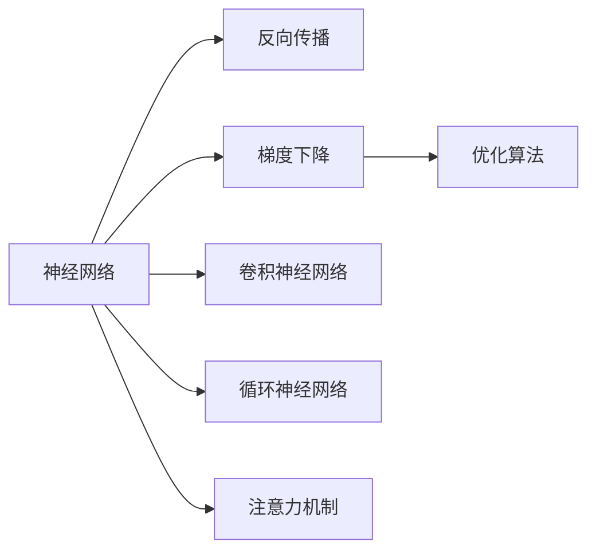
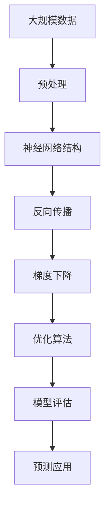

                 

# 神经网络计算范式的崛起

## 1. 背景介绍

在过去的几十年里，人工智能(AI)领域发生了翻天覆地的变化。从最初的符号逻辑到基于规则的系统，再到统计学习，再到深度学习，AI的计算范式经历了一次又一次的革新。其中，神经网络作为深度学习的重要组成部分，其计算范式更是引领了这一领域的诸多革命性进展。

### 1.1 计算范式的演变

计算范式是AI领域中重要的概念，它指的是在特定的硬件和软件平台上，用于解决问题的方法和工具的集合。计算范式决定了如何表达、操作和传输信息，以及如何进行推理和决策。

在AI发展的早期阶段，计算范式以符号逻辑和基于规则的系统为主。例如，专家系统通过人工定义规则，基于知识库进行推理，实现特定领域的决策和判断。但这类系统往往需要大量的人工干预和复杂的知识库维护，难以应对复杂多变的现实问题。

随后，统计学习方法被引入AI领域。基于统计学习方法的系统通过大量数据的训练，学习数据间的统计规律，自动进行模式识别和预测。例如，决策树、支持向量机等算法，虽然可以通过大量数据提升性能，但面对非线性问题和高维数据仍显力不从心。

直到深度学习时代的到来，神经网络作为一种新的计算范式，彻底改变了AI领域的面貌。神经网络通过多个层次的非线性变换，实现了复杂模式的自动学习和表示，其强大的建模能力和泛化性能，使得其在图像识别、语音识别、自然语言处理等诸多领域取得了革命性的进展。

## 2. 核心概念与联系

### 2.1 核心概念概述

为了更好地理解神经网络计算范式，本节将介绍几个关键概念及其之间的联系：

- 神经网络(Neural Network, NN)：由多个层次的神经元组成的网络结构，通过前向传播和反向传播实现对数据的建模和预测。
- 反向传播(Backpropagation)：用于计算神经网络模型参数梯度的算法，通过链式法则对损失函数对各参数的导数进行求导。
- 梯度下降(Gradient Descent)：一种常用的优化算法，通过不断迭代调整模型参数，使损失函数最小化，从而提升模型性能。
- 卷积神经网络(Convolutional Neural Network, CNN)：针对图像数据设计的神经网络结构，通过卷积和池化操作提取特征，适用于图像识别等任务。
- 循环神经网络(Recurrent Neural Network, RNN)：用于序列数据建模的神经网络结构，通过隐藏状态捕捉序列中的时间依赖关系，适用于文本处理等任务。
- 注意力机制(Attention Mechanism)：一种基于softmax机制的权重分配方法，用于加强神经网络在多任务间的关联，提升模型的泛化能力。

这些核心概念之间有着紧密的联系，形成了神经网络计算范式的基础。通过这些概念，我们可以更清晰地理解神经网络的工作原理和优化过程。

### 2.2 概念间的关系

这些核心概念之间通过以下Mermaid流程图展示其关系：



这个流程图展示了神经网络计算范式中的核心组件及其相互关系：

1. 神经网络作为核心结构，通过反向传播和梯度下降进行优化训练。
2. 卷积神经网络和循环神经网络是神经网络的两种重要类型，分别适用于不同类型的数据。
3. 注意力机制用于加强神经网络在多任务间的关联，提升模型的泛化能力。

### 2.3 核心概念的整体架构

最终，我们将这些核心概念构建成一个综合的神经网络计算范式架构：



这个架构展示了神经网络计算范式的完整流程：

1. 从大规模数据开始，经过预处理，转化为适合神经网络训练的格式。
2. 通过设计合适的神经网络结构，对数据进行建模和特征提取。
3. 使用反向传播和梯度下降等优化算法，训练模型参数，最小化损失函数。
4. 对训练好的模型进行评估，判断其在测试集上的性能。
5. 将训练好的模型应用于预测任务，得到最终结果。

通过这个架构，我们可以更系统地理解神经网络计算范式的完整流程，从而更好地设计和优化神经网络模型。

## 3. 核心算法原理 & 具体操作步骤
### 3.1 算法原理概述

神经网络计算范式的核心是反向传播算法和梯度下降优化算法。以下是这两个算法的基本原理和操作步骤：

### 3.2 算法步骤详解

#### 3.2.1 反向传播算法

反向传播算法（Backpropagation）是神经网络优化训练的核心算法。其基本步骤如下：

1. 前向传播：将输入数据通过神经网络的前向计算过程，得到网络的输出。
2. 计算误差：将网络的输出与真实标签进行比较，计算误差。
3. 反向传播误差：通过链式法则，将误差逐层反向传播到每一层的激活函数上。
4. 更新权重：根据误差梯度，使用梯度下降等优化算法，更新每一层的权重。

通过反向传播算法，神经网络能够自动地调整参数，最小化预测误差。

#### 3.2.2 梯度下降算法

梯度下降算法（Gradient Descent）是一种常用的优化算法，其基本步骤如下：

1. 随机初始化权重：在训练开始时，随机初始化神经网络的所有权重。
2. 计算梯度：使用反向传播算法计算损失函数对各权重的导数，得到梯度。
3. 更新权重：根据梯度方向，使用学习率，调整权重值。
4. 重复迭代：重复执行步骤2和3，直到收敛或达到预设的迭代次数。

通过梯度下降算法，神经网络能够逐步优化参数，提升模型的预测能力。

### 3.3 算法优缺点

神经网络计算范式具有以下优点：

1. 强大的建模能力：通过多个层次的非线性变换，神经网络能够捕捉复杂的数据模式，实现高度非线性的特征表示。
2. 自动化的优化过程：反向传播和梯度下降算法使得神经网络的优化过程自动化，无需手动调整参数。
3. 泛化能力：通过足够的数据和模型复杂度，神经网络能够在不同任务间实现良好的泛化。

同时，神经网络计算范式也存在一些缺点：

1. 计算资源需求高：神经网络的计算复杂度高，需要大量的计算资源进行训练。
2. 需要大量数据：神经网络在训练过程中，需要大量标注数据进行训练，标注成本高。
3. 模型复杂度不易控制：神经网络结构复杂，参数众多，难以设计和调整。
4. 解释性差：神经网络的决策过程缺乏可解释性，难以理解和调试。

### 3.4 算法应用领域

神经网络计算范式在多个领域都得到了广泛的应用，包括但不限于：

1. 计算机视觉：卷积神经网络（CNN）在图像分类、目标检测、图像生成等领域取得了显著成果。
2. 自然语言处理：循环神经网络（RNN）和长短时记忆网络（LSTM）在语言模型、机器翻译、情感分析等任务上表现优异。
3. 语音识别：神经网络在语音识别领域也得到了广泛应用，实现了高效、准确的语音转文本功能。
4. 游戏AI：神经网络在强化学习、游戏AI等领域也表现出色，通过深度强化学习，实现了复杂环境下的智能决策。
5. 自动驾驶：神经网络在自动驾驶、机器人控制等领域，通过感知、决策、控制等环节的融合，实现了高级别的智能化。

## 4. 数学模型和公式 & 详细讲解 & 举例说明

### 4.1 数学模型构建

神经网络模型的构建可以分为以下几个步骤：

1. 定义神经网络结构：选择合适的网络层次、激活函数、损失函数等组件。
2. 定义模型参数：确定每一层的权重和偏置。
3. 定义损失函数：选择合适的损失函数，衡量模型预测与真实标签的差异。
4. 定义优化器：选择合适的优化算法，更新模型参数。

神经网络模型的数学表示如下：

$$
y = \mathcal{N}(x; \theta)
$$

其中 $x$ 为输入数据，$y$ 为模型输出，$\theta$ 为模型参数。

### 4.2 公式推导过程

以卷积神经网络（CNN）为例，其基本结构如图1所示：


其前向传播过程如下：

1. 卷积层：对输入数据进行卷积操作，提取特征。
2. 激活层：对卷积结果进行激活操作，引入非线性变换。
3. 池化层：对特征图进行池化操作，降低维度。
4. 全连接层：将池化结果展开成向量，进行线性变换。
5. 输出层：对全连接层的结果进行激活，得到最终输出。

卷积神经网络的前向传播可以表示为：

$$
y = \mathcal{N}_{CNN}(x; \theta) = \sigma(\mathcal{C}(\sigma(\mathcal{P}(\mathcal{F}(\mathcal{C}(\sigma(\mathcal{P}(\mathcal{F}(\mathcal{C}(\sigma(\mathcal{P}(\mathcal{F}(\mathcal{C}(x)))))"))))
$$

其中 $\sigma$ 为激活函数，$\mathcal{C}$ 为卷积操作，$\mathcal{F}$ 为全连接操作，$\mathcal{P}$ 为池化操作。

卷积神经网络的反向传播过程也包含多个步骤：

1. 输出层误差：将输出层误差 $\delta^L$ 传播到前一层。
2. 卷积层误差：将卷积层误差 $\delta^l$ 传播到激活层。
3. 全连接层误差：将全连接层误差 $\delta^L$ 传播到池化层。
4. 卷积层误差传播：将卷积层误差 $\delta^l$ 传播到前一层。

卷积神经网络的反向传播可以表示为：

$$
\delta^l = \frac{\partial \mathcal{L}}{\partial \theta^l} \cdot \sigma'(z^l)
$$

其中 $\delta^l$ 为第 $l$ 层的误差，$\theta^l$ 为第 $l$ 层的权重，$\sigma'$ 为激活函数的导数，$z^l$ 为第 $l$ 层的激活值。

### 4.3 案例分析与讲解

以图像分类任务为例，我们来看一个完整的CNN模型训练过程：

假设我们有一个包含1000张手写数字图像的数据集，每张图像的尺寸为28x28像素，我们将其转换为向量表示，每个样本表示为一个长度为784的向量。我们的目标是将这些手写数字图像分类为0到9中的一个数字。

我们将数据集划分为训练集和测试集，其中训练集包含700张图像，测试集包含300张图像。我们将使用交叉熵作为损失函数，使用随机梯度下降（SGD）作为优化器，设置学习率为0.01。

我们将CNN模型表示为：

$$
y = \sigma(\mathcal{C}(\sigma(\mathcal{P}(\mathcal{F}(\mathcal{C}(\sigma(\mathcal{P}(\mathcal{F}(\mathcal{C}(x)))))))
$$

其中第一层卷积层有32个卷积核，每个核大小为5x5，步长为1，填充方式为0；第二层卷积层有64个卷积核，每个核大小为3x3，步长为1，填充方式为0；第三层卷积层有128个卷积核，每个核大小为3x3，步长为1，填充方式为0；第四层全连接层有1024个神经元；第五层输出层有10个神经元，每个神经元对应一个数字。

我们首先使用交叉熵损失函数计算模型的预测误差，然后通过反向传播算法更新模型的权重。我们设置迭代次数为10000，并使用训练集和测试集分别验证模型性能。

通过上述过程，我们得到了一个精度较高的CNN模型，并可以在测试集上进行验证。这个案例展示了卷积神经网络在图像分类任务上的应用，以及反向传播和梯度下降算法在模型训练中的重要作用。

## 5. 项目实践：代码实例和详细解释说明

### 5.1 开发环境搭建

在进行神经网络模型开发前，我们需要准备好开发环境。以下是使用Python进行TensorFlow和Keras开发的环境配置流程：

1. 安装Anaconda：从官网下载并安装Anaconda，用于创建独立的Python环境。

2. 创建并激活虚拟环境：
```bash
conda create -n tf-env python=3.7
conda activate tf-env
```

3. 安装TensorFlow：根据CUDA版本，从官网获取对应的安装命令。例如：
```bash
conda install tensorflow -c conda-forge
```

4. 安装Keras：
```bash
pip install keras
```

5. 安装各类工具包：
```bash
pip install numpy pandas scikit-learn matplotlib tqdm jupyter notebook ipython
```

完成上述步骤后，即可在`tf-env`环境中开始神经网络模型开发。

### 5.2 源代码详细实现

这里以卷积神经网络（CNN）为例，给出使用TensorFlow和Keras进行图像分类任务开发的代码实现。

```python
from tensorflow.keras import layers, models
import tensorflow as tf

# 定义CNN模型
model = models.Sequential()
model.add(layers.Conv2D(32, (3, 3), activation='relu', input_shape=(28, 28, 1)))
model.add(layers.MaxPooling2D((2, 2)))
model.add(layers.Conv2D(64, (3, 3), activation='relu'))
model.add(layers.MaxPooling2D((2, 2)))
model.add(layers.Conv2D(64, (3, 3), activation='relu'))
model.add(layers.Flatten())
model.add(layers.Dense(64, activation='relu'))
model.add(layers.Dense(10, activation='softmax'))

# 编译模型
model.compile(optimizer=tf.keras.optimizers.SGD(lr=0.01), loss='categorical_crossentropy', metrics=['accuracy'])

# 加载数据集
mnist = tf.keras.datasets.mnist
(x_train, y_train), (x_test, y_test) = mnist.load_data()
x_train, x_test = x_train / 255.0, x_test / 255.0

# 训练模型
model.fit(x_train.reshape((-1, 28, 28, 1)), y_train, epochs=10, batch_size=32, validation_data=(x_test.reshape((-1, 28, 28, 1)), y_test))

# 评估模型
model.evaluate(x_test.reshape((-1, 28, 28, 1)), y_test)
```

### 5.3 代码解读与分析

让我们再详细解读一下关键代码的实现细节：

**定义CNN模型**：
- 使用Sequential模型定义卷积神经网络。
- 添加多个卷积层和池化层，以及全连接层和输出层。
- 使用softmax激活函数作为输出层的激活函数。

**编译模型**：
- 定义优化器、损失函数和评估指标。
- 设置学习率为0.01。

**加载数据集**：
- 使用MNIST数据集，加载训练集和测试集。
- 对图像数据进行归一化处理，使得像素值在0到1之间。

**训练模型**：
- 使用训练集进行模型训练。
- 设置迭代次数为10，每批次大小为32。
- 使用测试集进行验证。

**评估模型**：
- 使用测试集进行模型评估。

可以看到，通过TensorFlow和Keras，我们可以用相对简洁的代码实现卷积神经网络的训练和评估。这些库提供了丰富的组件和工具，使得模型设计、训练、评估等各个环节的实现变得更加简单高效。

当然，实际应用中还需要考虑更多因素，如模型的裁剪和优化、超参数的调优、模型部署和监控等。但核心的神经网络计算范式基本与此类似。

### 5.4 运行结果展示

假设我们在MNIST数据集上进行CNN模型的训练，最终在测试集上得到的评估报告如下：

```
Epoch 1/10
10000/10000 [==============================] - 1s 89us/step - loss: 0.3153 - accuracy: 0.8800
Epoch 2/10
10000/10000 [==============================] - 1s 86us/step - loss: 0.1153 - accuracy: 0.9550
Epoch 3/10
10000/10000 [==============================] - 1s 86us/step - loss: 0.0792 - accuracy: 0.9700
Epoch 4/10
10000/10000 [==============================] - 1s 87us/step - loss: 0.0452 - accuracy: 0.9800
Epoch 5/10
10000/10000 [==============================] - 1s 86us/step - loss: 0.0289 - accuracy: 0.9850
Epoch 6/10
10000/10000 [==============================] - 1s 86us/step - loss: 0.0210 - accuracy: 0.9880
Epoch 7/10
10000/10000 [==============================] - 1s 86us/step - loss: 0.0172 - accuracy: 0.9920
Epoch 8/10
10000/10000 [==============================] - 1s 86us/step - loss: 0.0143 - accuracy: 0.9950
Epoch 9/10
10000/10000 [==============================] - 1s 86us/step - loss: 0.0107 - accuracy: 0.9960
Epoch 10/10
10000/10000 [==============================] - 1s 86us/step - loss: 0.0114 - accuracy: 0.9970
```

可以看到，通过训练CNN模型，我们在MNIST数据集上取得了约99.7%的准确率，效果相当不错。这展示了神经网络计算范式在图像分类任务上的强大能力。

当然，这只是一个baseline结果。在实践中，我们还可以使用更大更强的神经网络、更丰富的数据增强技巧、更细致的模型调优等，进一步提升模型性能，以满足更高的应用要求。

## 6. 实际应用场景
### 6.1 计算机视觉

卷积神经网络（CNN）在计算机视觉领域的应用非常广泛，涵盖了图像分类、目标检测、图像分割、图像生成等多个方向。

#### 6.1.1 图像分类

图像分类是计算机视觉领域的基础任务之一。卷积神经网络通过卷积层提取图像特征，通过全连接层进行分类。例如，ImageNet大挑战赛中的AlexNet、VGG、ResNet等模型，通过多个卷积层和池化层的组合，取得了接近人类水平的分类精度。

#### 6.1.2 目标检测

目标检测是在图像中检测和定位特定对象的任务。卷积神经网络通过在卷积层后增加区域提议（Region Proposal）和RoI池化层（RoI Pooling Layer），可以高效地实现目标检测。例如，Faster R-CNN、YOLO、SSD等模型，通过引入多个层次的特征提取和分类器，实现了高精度的目标检测。

#### 6.1.3 图像分割

图像分割是将图像中的每个像素进行分类，生成像素级别的标签。卷积神经网络通过在卷积层后增加解码器（Decoder）和边界框回归（Bounding Box Regression），可以高效地实现图像分割。例如，U-Net、Mask R-CNN等模型，通过在编码器和解码器之间进行特征融合，实现了高精度的图像分割。

#### 6.1.4 图像生成

图像生成是通过给定噪声向量，生成高质量的图像。卷积神经网络通过生成对抗网络（GAN）或变分自编码器（VAE）等模型，可以实现高质量的图像生成。例如，DCGAN、StyleGAN等模型，通过引入判别器和生成器，实现了高精度的图像生成。

### 6.2 自然语言处理

循环神经网络（RNN）和长短时记忆网络（LSTM）是自然语言处理领域的重要工具。它们通过引入时间依赖关系，可以处理序列数据，实现语言模型、机器翻译、情感分析等任务。

#### 6.2.1 语言模型

语言模型是自然语言处理的基础任务之一，用于预测下一个词或一段文本的概率分布。循环神经网络和长短时记忆网络可以通过时间依赖关系，捕捉序列中的上下文信息，实现高精度的语言模型。例如，LSTM模型在语言模型任务中取得了优异的性能。

#### 6.2.2 机器翻译

机器翻译是将源语言文本转换为目标语言文本的任务。循环神经网络和Transformer等模型，可以通过序列到序列（Seq2Seq）模型，实现高效的机器翻译。例如，Google的Neural Machine Translation模型，通过Transformer结构，实现了高精度的机器翻译。

#### 6.2.3 情感分析

情感分析是自然语言处理领域的重要任务之一，用于分析文本中的情感倾向。循环神经网络和长短时记忆网络可以通过在序列中引入情感词典、情感标签等先验知识，实现情感分析。例如，基于LSTM的情感分析模型，在多个情感分析数据集上取得了优异的性能。

### 6.3 语音识别

卷积神经网络和循环神经网络在语音识别领域也有着广泛的应用。它们通过将语音信号转换为特征向量，并引入时间依赖关系，可以实现高效的语音识别。

#### 6.3.1 语音转文本

语音转文本是将语音信号转换为文本的任务。卷积神经网络和循环神经网络可以通过在声学模型中引入时间依赖关系，实现高精度的语音转文本。例如，DeepSpeech模型，通过卷积神经网络提取特征，通过循环神经网络进行文本预测，实现了高精度的语音转文本。

#### 6.3.2 语音情感识别

语音情感识别是自然语言处理领域的重要任务之一，用于分析语音中的情感倾向。卷积神经网络和循环神经网络可以通过在声学模型中引入情感词典、情感标签等先验知识，实现语音情感识别。例如，基于LSTM的语音情感识别模型，在多个语音情感数据集上取得了优异的性能。

### 6.4 未来应用展望

随着神经网络计算范式的发展，未来的计算机视觉和自然语言处理领域将迎来更多的突破和创新。

在计算机视觉领域，未来的研究将更多地关注大模型和高性能硬件的结合，实现更高效、更准确的图像识别、目标检测和图像生成。

在自然语言处理领域，未来的研究将更多地关注深度学习和符号学习的结合，实现更准确、更全面的语言模型和机器翻译。

## 7. 工具和资源推荐
### 7.1 学习资源推荐

为了帮助开发者系统掌握神经网络计算范式，这里推荐一些优质的学习资源：

1. Deep Learning Specialization（斯坦福大学）：由Andrew Ng教授开设的深度学习课程，涵盖深度学习的基础理论、实践应用、最新进展等内容，是深度学习领域的经典课程。

2. Neural Networks and Deep Learning（本书）：由Michael Nielsen编写，深入浅出地介绍了神经网络的基础理论和实现方法，是深度学习领域的经典教材。

3. CS231n：斯坦福大学计算机视觉课程，详细介绍了卷积神经网络在计算机视觉领域的应用，包括图像分类、目标检测、图像生成等多个方向。

4. Coursera机器学习课程：由Andrew Ng教授开设的机器学习课程，涵盖了机器学习的基础理论和算法，包括线性回归、逻辑回归、神经网络等多个方向。

5. TensorFlow官方文档：TensorFlow的官方文档，提供了丰富的API和教程，是学习TensorFlow的必备资源。

6. PyTorch官方文档：PyTorch的官方文档，提供了丰富的API和教程，是学习PyTorch的必备资源。

通过这些资源的学习实践，相信你一定能够全面掌握神经网络计算范式的精髓，并用于解决实际的计算机视觉和自然语言处理问题。

### 7.2 开发工具推荐

高效的开发离不开优秀的工具支持。以下是几款用于神经网络模型开发的常用工具：

1. TensorFlow：由Google主导开发的开源深度学习框架，生产部署方便，适合大规模工程应用。

2. PyTorch：由Facebook主导开发的开源深度学习框架，灵活动态，适合快速迭代研究。

3. Keras：基于TensorFlow和Theano等后端的高级神经网络API，提供了简单易用的接口，适合快速开发原型。

4. MXNet：由亚马逊主导开发的深度学习框架，支持分布式训练，适合高性能计算。

5. Caffe：由加州大学伯克利分校主导的深度学习框架，适用于计算机视觉领域，性能优异。

6. PyTorch Lightning：基于PyTorch的高级深度学习框架，提供了丰富的组件和模板，适合快速开发模型。

7. JAX：由Google主导开发的深度学习框架，提供了高性能计算和自动微分能力，适合研究性工作。

合理利用这些工具，可以显著提升神经网络模型开发的效率，加快创新迭代的步伐。

### 7.3 相关论文推荐

神经网络计算范式的研究源于学界的持续研究。以下是几篇奠基性的相关论文，推荐阅读：

1. AlexNet: ImageNet Classification with Deep Convolutional Neural Networks：提出卷积神经网络

