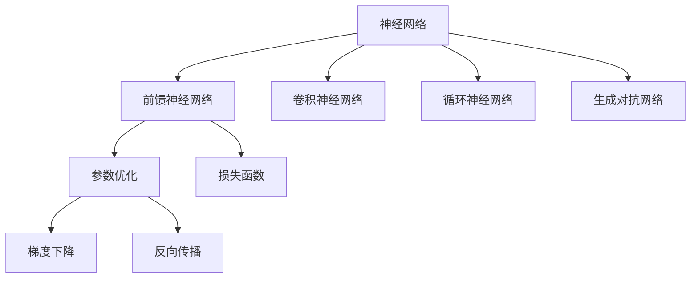
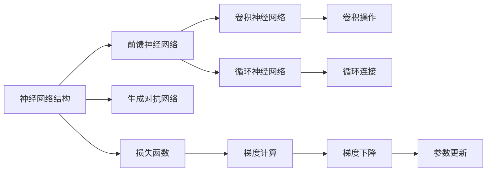
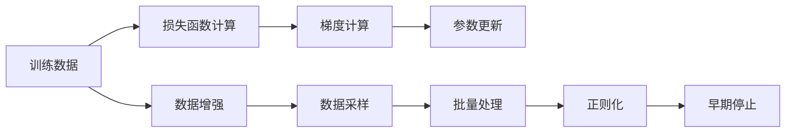
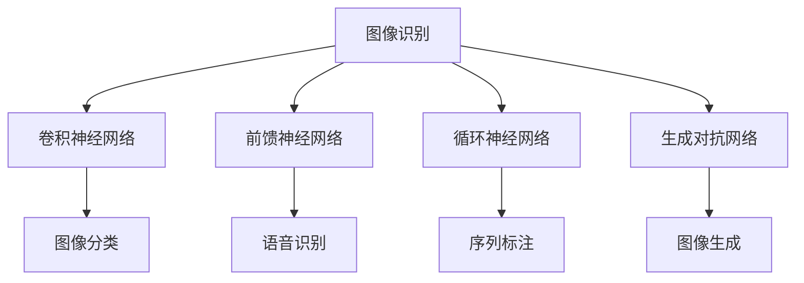
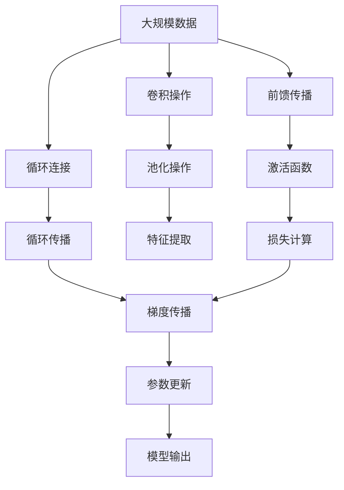

                 

# 神经网络：人工智能的基石

> 关键词：神经网络,人工智能,深度学习,前馈神经网络,卷积神经网络,循环神经网络,参数优化,反向传播,损失函数,梯度下降

## 1. 背景介绍

### 1.1 问题由来

人工智能（AI）作为当今最热门的技术领域之一，其核心技术之一是神经网络。自20世纪80年代以来，神经网络在图像识别、自然语言处理、语音识别、推荐系统等领域取得了突破性进展，成为了驱动AI技术发展的重要基石。在深度学习（Deep Learning）的浪潮下，神经网络不断演进，从传统的感知机、BP神经网络到卷积神经网络（CNN）、循环神经网络（RNN）、生成对抗网络（GAN）等新型网络结构被不断提出，推动了AI技术的应用和发展。

### 1.2 问题核心关键点

神经网络的核心思想是通过多层非线性映射，将输入映射到输出，从而实现对复杂非线性问题的建模和解决。其关键点在于：

- **网络结构**：网络由多个层次组成，每一层包含若干个神经元。
- **激活函数**：在每个神经元上应用非线性激活函数，以实现非线性映射。
- **参数学习**：通过梯度下降等优化算法，不断调整权重和偏置，最小化损失函数。
- **反向传播**：利用链式法则，将损失函数逐层向后传播，计算梯度。
- **损失函数**：衡量模型输出与真实标签之间的差异。
- **优化器**：如SGD、Adam等，用于更新网络参数。

神经网络的这些关键点，使得其能够处理大量数据，提取高层次的特征表示，并适应各种复杂的非线性问题。

### 1.3 问题研究意义

神经网络的研究对于推动AI技术的发展具有重要意义：

- **提高问题建模能力**：神经网络通过多层非线性映射，能够更好地捕捉输入数据中的复杂结构，提升模型的表达能力和泛化能力。
- **实现自动化特征提取**：网络自动学习输入数据的特征表示，减少人工特征工程的复杂度。
- **解决大规模数据处理**：神经网络在处理大规模数据时，具有强大的计算能力和并行处理能力。
- **加速AI技术落地**：神经网络已成为AI技术应用的主流范式，推动了智能推荐、图像识别、自然语言处理等多个领域的快速发展。
- **带来新的研究方向**：神经网络的研究催生了许多新的理论和技术，如深度强化学习、神经网络优化、迁移学习等，这些方向将引领未来的AI技术发展。

## 2. 核心概念与联系

### 2.1 核心概念概述

为了更好地理解神经网络的工作原理和优化过程，本节将介绍几个密切相关的核心概念：

- **前馈神经网络（Feedforward Neural Network）**：最基础的神经网络结构，数据从前到后单向流动，无反馈连接。
- **卷积神经网络（Convolutional Neural Network）**：专门用于处理图像数据的网络结构，通过卷积操作提取特征。
- **循环神经网络（Recurrent Neural Network）**：用于处理序列数据的网络结构，通过循环连接实现信息传递。
- **生成对抗网络（Generative Adversarial Network）**：由生成器和判别器两部分组成，通过对抗训练生成逼真样本。
- **参数优化**：使用梯度下降等算法，优化网络参数，最小化损失函数。
- **反向传播（Backpropagation）**：通过链式法则，将损失函数逐层向后传播，计算梯度。
- **损失函数（Loss Function）**：衡量模型输出与真实标签之间的差异，如均方误差、交叉熵等。
- **梯度下降（Gradient Descent）**：一种基于梯度的优化算法，通过迭代更新参数，最小化损失函数。

这些核心概念之间的逻辑关系可以通过以下Mermaid流程图来展示：



这个流程图展示了几类主要的神经网络结构及其与优化、训练过程的关系：

1. 神经网络结构包括前馈网络、卷积网络、循环网络和对抗网络等。
2. 优化过程包括参数优化、梯度下降和反向传播等步骤。
3. 训练过程中需要定义损失函数，衡量模型输出与真实标签之间的差异。

### 2.2 概念间的关系

这些核心概念之间存在着紧密的联系，形成了神经网络的完整生态系统。下面我通过几个Mermaid流程图来展示这些概念之间的关系。

#### 2.2.1 神经网络结构与优化过程



这个流程图展示了不同神经网络结构及其与优化过程的关系：

1. 神经网络结构包括前馈网络、卷积网络和循环网络等。
2. 优化过程包括计算梯度、梯度下降和参数更新等步骤。
3. 卷积网络使用卷积操作提取特征，循环网络使用循环连接传递信息。
4. 生成对抗网络通过对抗训练生成样本。

#### 2.2.2 神经网络训练的完整过程



这个流程图展示了神经网络训练的完整过程：

1. 训练数据通过损失函数计算，生成梯度。
2. 梯度用于参数更新，优化模型。
3. 数据增强、批量处理和正则化等技术用于避免过拟合。
4. 早期停止机制用于防止过拟合。

#### 2.2.3 神经网络的应用场景



这个流程图展示了神经网络在不同应用场景中的应用：

1. 卷积神经网络用于图像识别。
2. 前馈神经网络用于语音识别。
3. 循环神经网络用于序列标注。
4. 生成对抗网络用于图像生成。

### 2.3 核心概念的整体架构

最后，我们用一个综合的流程图来展示这些核心概念在大规模神经网络训练过程中的整体架构：



这个综合流程图展示了神经网络的训练过程：

1. 数据通过卷积和池化操作提取特征。
2. 特征通过前馈传播和激活函数映射到高层次表示。
3. 序列数据通过循环连接和循环传播传递信息。
4. 模型输出通过损失计算和梯度传播进行优化。
5. 优化后的模型用于新的数据输入。

通过这些流程图，我们可以更清晰地理解神经网络的工作原理和优化过程，为后续深入讨论具体的神经网络训练方法和技术奠定基础。

## 3. 核心算法原理 & 具体操作步骤
### 3.1 算法原理概述

神经网络的训练过程是一个优化问题。其核心目标是通过优化损失函数，找到最优的模型参数。神经网络的训练过程主要包括以下几个关键步骤：

- **前向传播（Forward Propagation）**：将输入数据通过神经网络进行正向传递，得到模型的预测输出。
- **损失函数计算（Loss Calculation）**：计算模型的预测输出与真实标签之间的差异，得到损失函数值。
- **梯度计算（Gradient Calculation）**：通过反向传播算法计算损失函数对每个参数的梯度。
- **参数更新（Parameter Update）**：使用梯度下降等优化算法，根据梯度更新模型参数，最小化损失函数。
- **迭代优化（Iterative Optimization）**：重复执行上述步骤，直至收敛。

通过这些步骤，神经网络可以不断优化其参数，提升模型的性能和泛化能力。

### 3.2 算法步骤详解

神经网络的训练过程可以总结为以下详细步骤：

1. **数据准备**：收集标注数据集，划分为训练集、验证集和测试集。对数据进行预处理，如归一化、标准化、数据增强等。
2. **模型初始化**：随机初始化神经网络的所有参数，如权重、偏置等。
3. **前向传播**：将训练数据通过神经网络进行正向传播，计算每个节点的输出值。
4. **损失函数计算**：将模型的预测输出与真实标签计算损失函数值。
5. **梯度计算**：通过反向传播算法计算损失函数对每个参数的梯度。
6. **参数更新**：使用梯度下降等优化算法，根据梯度更新模型参数。
7. **迭代优化**：重复执行上述步骤，直至收敛。

其中，前向传播和反向传播是神经网络训练的核心算法，其详细实现如下。

#### 3.2.1 前向传播

前向传播过程是从输入层开始，将数据逐层传递，计算每个节点的输出值。以一个简单的前馈神经网络为例，其前向传播过程如下：

1. 输入层：将输入数据 $x$ 传递给第一层神经元。
2. 隐层：通过线性变换和激活函数计算每个神经元的输出值 $h^{(l)}$。
3. 输出层：将隐层输出通过线性变换和激活函数计算最终的预测输出 $y$。

数学上，前向传播可以表示为：

$$
h^{(1)} = \sigma(W^{(1)}x + b^{(1)})
$$
$$
h^{(2)} = \sigma(W^{(2)}h^{(1)} + b^{(2)})
$$
$$
y = \sigma(W^{(3)}h^{(2)} + b^{(3)})
$$

其中，$\sigma$ 为激活函数，$W^{(l)}$ 和 $b^{(l)}$ 分别为第 $l$ 层的权重和偏置。

#### 3.2.2 反向传播

反向传播算法是通过链式法则计算损失函数对每个参数的梯度，从而指导参数更新。以一个简单的前馈神经网络为例，其反向传播过程如下：

1. 输出层：计算预测输出与真实标签之间的差异，得到损失函数值 $L$。
2. 隐层：从输出层开始，逐层反向计算梯度，直到输入层。
3. 参数更新：使用梯度下降等优化算法，根据梯度更新模型参数。

数学上，反向传播可以表示为：

$$
\frac{\partial L}{\partial y} = \frac{\partial L}{\partial h^{(2)}} \cdot \frac{\partial h^{(2)}}{\partial y}
$$
$$
\frac{\partial L}{\partial h^{(2)}} = \frac{\partial L}{\partial y} \cdot \frac{\partial y}{\partial h^{(2)}} = \frac{\partial L}{\partial y} \cdot \frac{\partial \sigma(W^{(3)}h^{(2)} + b^{(3)})}{\partial h^{(2)}}
$$
$$
\frac{\partial L}{\partial h^{(1)}} = \frac{\partial L}{\partial h^{(2)}} \cdot \frac{\partial h^{(2)}}{\partial h^{(1)}} = \frac{\partial L}{\partial h^{(2)}} \cdot \frac{\partial \sigma(W^{(2)}h^{(1)} + b^{(2)})}{\partial h^{(1)}}
$$

其中，$\frac{\partial L}{\partial y}$ 表示损失函数对预测输出的梯度，$\frac{\partial h^{(l)}}{\partial y}$ 表示隐层输出对预测输出的梯度，$\frac{\partial L}{\partial \sigma(W^{(l)}h^{(l-1)} + b^{(l)})}$ 表示隐层激活函数的导数。

### 3.3 算法优缺点

神经网络作为一种强大的机器学习算法，具有以下优点：

1. **强大的非线性建模能力**：通过多层非线性映射，能够处理复杂的非线性关系。
2. **高效的特征提取**：网络自动学习特征表示，减少人工特征工程的复杂度。
3. **并行计算能力**：神经网络在处理大规模数据时，具有强大的并行计算能力。
4. **泛化能力**：经过大量数据训练，神经网络能够泛化到未见过的数据上。
5. **可解释性**：深度学习模型的输出可以通过激活图和权重图等形式进行可视化，帮助理解模型行为。

同时，神经网络也存在一些缺点：

1. **训练成本高**：需要大量的标注数据和计算资源进行训练。
2. **过拟合风险**：在大规模数据上训练的神经网络容易过拟合，泛化能力不足。
3. **模型复杂性**：神经网络结构复杂，调试和优化困难。
4. **可解释性差**：神经网络通常被称为“黑箱”，难以解释其内部工作机制。
5. **计算资源消耗大**：神经网络需要大量的计算资源进行训练和推理。

尽管存在这些缺点，神经网络仍因其强大的表达能力和建模能力，成为当前最主流的机器学习算法之一。

### 3.4 算法应用领域

神经网络作为一种通用的机器学习算法，已经广泛应用于各个领域：

- **计算机视觉**：如图像识别、目标检测、图像生成等。
- **自然语言处理**：如文本分类、情感分析、机器翻译等。
- **语音识别**：如语音转文本、语音合成等。
- **推荐系统**：如协同过滤、内容推荐等。
- **游戏AI**：如AlphaGo等。
- **医学影像**：如疾病诊断、图像分割等。

神经网络不仅在学术界取得了显著成果，还广泛应用于工业界，推动了多个领域的技术革新。

## 4. 数学模型和公式 & 详细讲解  
### 4.1 数学模型构建

神经网络的数学模型可以表示为：

$$
\begin{aligned}
h^{(1)} &= \sigma(W^{(1)}x + b^{(1)}) \\
h^{(2)} &= \sigma(W^{(2)}h^{(1)} + b^{(2)}) \\
&\vdots \\
h^{(L)} &= \sigma(W^{(L)}h^{(L-1)} + b^{(L)})
\end{aligned}
$$

其中，$h^{(l)}$ 表示第 $l$ 层的隐层输出，$W^{(l)}$ 和 $b^{(l)}$ 分别为第 $l$ 层的权重和偏置，$\sigma$ 为激活函数，$x$ 为输入数据。

损失函数通常表示为：

$$
L = \frac{1}{N}\sum_{i=1}^N l(y_i, \hat{y}_i)
$$

其中，$y_i$ 为第 $i$ 个样本的真实标签，$\hat{y}_i$ 为模型的预测输出，$l$ 为损失函数。

### 4.2 公式推导过程

以二分类问题为例，常用的损失函数为二元交叉熵损失函数：

$$
l(y_i, \hat{y}_i) = -[y_i\log \hat{y}_i + (1-y_i)\log(1-\hat{y}_i)]
$$

将其代入损失函数公式，得：

$$
L = \frac{1}{N}\sum_{i=1}^N -[y_i\log \hat{y}_i + (1-y_i)\log(1-\hat{y}_i)]
$$

通过链式法则，可以计算出损失函数对第 $l$ 层的梯度：

$$
\frac{\partial L}{\partial h^{(l)}} = \frac{\partial L}{\partial z^{(l)}} \cdot \frac{\partial z^{(l)}}{\partial h^{(l)}} = \frac{\partial l(y_i, \hat{y}_i)}{\partial h^{(l)}} = \frac{\partial l(y_i, \hat{y}_i)}{\partial y} \cdot \frac{\partial y}{\partial h^{(l)}}
$$

其中，$z^{(l)}$ 为第 $l$ 层的激活函数输入，$\frac{\partial l(y_i, \hat{y}_i)}{\partial y}$ 表示损失函数对预测输出的梯度，$\frac{\partial y}{\partial h^{(l)}}$ 表示预测输出对隐层输出的梯度。

### 4.3 案例分析与讲解

以一个简单的前馈神经网络为例，分析其反向传播过程。该网络包含三层神经元，每个神经元具有两个输入。

假设输入数据 $x_1 = (1, 0)$，权重 $W^{(1)} = \begin{bmatrix} 0.5 & 0.5 \\ -0.5 & 0.5 \end{bmatrix}$，偏置 $b^{(1)} = (0.5, 0.5)$，激活函数 $\sigma(x) = \frac{1}{1+e^{-x}}$，损失函数为二元交叉熵。

其前向传播过程如下：

$$
h^{(1)} = \sigma(W^{(1)}x_1 + b^{(1)}) = \sigma(\begin{bmatrix} 0.5 & 0.5 \\ -0.5 & 0.5 \end{bmatrix}\begin{bmatrix} 1 \\ 0 \end{bmatrix} + \begin{bmatrix} 0.5 \\ 0.5 \end{bmatrix}) = \sigma(\begin{bmatrix} 0.75 \\ 0.25 \end{bmatrix}) = \begin{bmatrix} 0.788 \\ 0.212 \end{bmatrix}
$$

$$
h^{(2)} = \sigma(W^{(2)}h^{(1)} + b^{(2)}) = \sigma(\begin{bmatrix} 0.1 & 0.9 \\ 0.1 & 0.9 \end{bmatrix}\begin{bmatrix} 0.788 \\ 0.212 \end{bmatrix} + \begin{bmatrix} 0.1 \\ 0.1 \end{bmatrix}) = \sigma(\begin{bmatrix} 0.95 \\ 0.55 \end{bmatrix}) = \begin{bmatrix} 0.941 \\ 0.559 \end{bmatrix}
$$

$$
y = \sigma(W^{(3)}h^{(2)} + b^{(3)}) = \sigma(\begin{bmatrix} 0.5 & 0.5 \end{bmatrix}\begin{bmatrix} 0.941 \\ 0.559 \end{bmatrix} + \begin{bmatrix} 0.5 \\ 0.5 \end{bmatrix}) = \sigma(\begin{bmatrix} 0.905 \\ 0.645 \end{bmatrix}) = \begin{bmatrix} 0.779 \\ 0.221 \end{bmatrix}
$$

其损失函数计算如下：

$$
L = -\frac{1}{2}(y_1\log \hat{y}_1 + y_2\log \hat{y}_2) = -\frac{1}{2}(1\log 0.779 + 0\log 0.221) = 0.456
$$

其反向传播过程如下：

1. 输出层：计算预测输出与真实标签之间的差异，得到损失函数值 $L$。
2. 隐层：从输出层开始，逐层反向计算梯度，直到输入层。
3. 参数更新：使用梯度下降等优化算法，根据梯度更新模型参数。

具体梯度计算如下：

$$
\frac{\partial L}{\partial y} = \frac{\partial L}{\partial h^{(2)}} \cdot \frac{\partial h^{(2)}}{\partial y} = \frac{\partial L}{\partial y} \cdot \frac{\partial \sigma(W^{(3)}h^{(2)} + b^{(3)})}{\partial y} = \frac{\partial l(y_i, \hat{y}_i)}{\partial y} = -(y_1 - \hat{y}_1)
$$

$$
\frac{\partial L}{\partial h^{(2)}} = \frac{\partial L}{\partial y} \cdot \frac{\partial y}{\partial h^{(2)}} = \frac{\partial l(y_i, \hat{y}_i)}{\partial y} \cdot \frac{\partial \sigma(W^{(3)}h^{(2)} + b^{(3)})}{\partial h^{(2)}} = -(y_1 - \hat{y}_1) \cdot \frac{\partial \sigma(W^{(3)}h^{(2)} + b^{(3)})}{\partial h^{(2)}}
$$

$$
\frac{\partial L}{\partial h^{(1)}} = \frac{\partial L}{\partial h^{(2)}} \cdot \frac{\partial h^{(2)}}{\partial h^{(1)}} = \frac{\partial L}{\partial h^{(2)}} \cdot \frac{\partial \sigma(W^{(2)}h^{(1)} + b^{(2)})}{\partial h^{(1)}} = \frac{\partial L}{\partial h^{(2)}} \cdot \frac{\partial \sigma(W^{(2)}h^{(1)} + b^{(2)})}{\partial h^{(1)}}
$$

将上述梯度代入权重和偏置的更新公式：

$$
W^{(1)} = W^{(1)} - \eta \frac{\partial L}{\partial W^{(1)}} = W^{(1)} - \eta (\frac{\partial L}{\partial h^{(1)}} \cdot h^{(1)} + \frac{\partial L}{\partial b^{(1)}}) = W^{(1)} - \eta (0.228 \cdot \begin{bmatrix} 0.5 \\ -0.5 \end{bmatrix} + 0.228)
$$

$$
b^{(1)} = b^{(1)} - \eta \frac{\partial L}{\partial b^{(1)}} = b^{(1)} - \eta (0.228)
$$

$$
W^{(2)} = W^{(2)} - \eta \frac{\partial L}{\partial W^{(2)}} = W^{(2)} - \eta (\frac{\partial L}{\partial h^{(2)}} \cdot h^{(1)} + \frac{\partial L}{\partial b^{(2)}}) = W^{(2)} - \eta (0.022 \cdot \begin{bmatrix} 0.788 \\ 0.212 \end{bmatrix} + 0.022)
$$

$$
b^{(2)} = b^{(2)} - \eta \frac{\partial L}{\partial b^{(2)}} = b^{(2)} - \eta (0.022)
$$

$$
W^{(3)} = W^{(3)} - \eta \frac{\partial L}{\partial W^{(3)}} = W^{(3)} - \eta (\frac{\partial L}{\partial y} \cdot h^{(2)} + \frac{\partial L}{\partial b^{(3)}}) = W^{(3)} - \eta (-0.779 \cdot \begin{bmatrix} 0.941 \\ 0.559 \end{bmatrix} + 0.779)
$$

$$
b^{(3)} = b^{(3)} - \eta \frac{\partial L}{\partial b^{(3)}} = b^{(3)} - \eta (-0.779)
$$

通过上述过程，可以不断迭代更新神经网络参数，最小化损失函数，提升模型性能。

## 5. 项目实践：代码实例和详细解释说明
### 5.1 开发环境搭建

在进行神经网络训练实践前，我们需要准备好开发环境。以下是使用Python进行TensorFlow开发的环境配置流程：

1. 安装Anaconda：从官网下载并安装Anaconda，用于创建独立的Python环境。

2. 创建并激活虚拟环境：
```bash
conda create -n tf-env python=3.8 
conda activate tf-env
```

3. 安装TensorFlow：根据CUDA版本，从官网获取对应的安装命令。例如：
```bash
pip install tensorflow-gpu
```

4. 安装各类工具包：
```bash
pip install numpy pandas scikit-learn matplotlib tqdm jupyter notebook ipython
```

完成上述步骤后，即可在`tf-env`环境中开始神经

