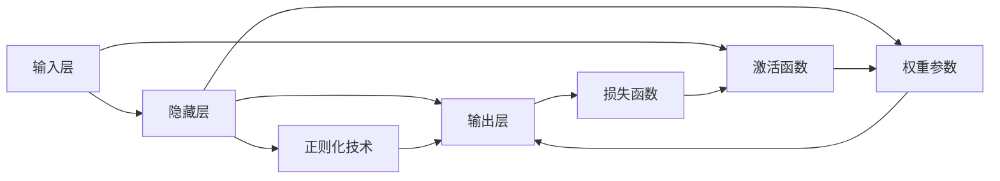
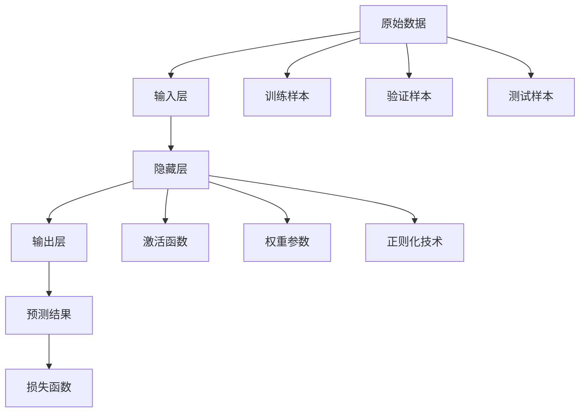

                 

# 神经网络：探索未知的领域

## 1. 背景介绍

### 1.1 问题由来
近年来，深度学习技术的发展，尤其是神经网络(Neural Networks, NNs)的突破，让计算机在图像识别、语音识别、自然语言处理(NLP)等领域的表现取得了巨大的飞跃。但同时，神经网络也引发了诸多理论和实践上的新问题，如参数的过拟合、网络的收敛性、结构复杂性等。因此，探索神经网络的新领域，尤其是深入理解其理论基础和实际应用，成为当前深度学习研究的热点。

### 1.2 问题核心关键点
神经网络的核心问题包括：
- 如何有效设计网络结构和激活函数，以更好地拟合数据分布？
- 如何通过正则化技术避免过拟合，同时提高模型的泛化能力？
- 如何优化神经网络的训练过程，提高收敛速度和模型精度？
- 如何通过迁移学习和跨领域知识融合，拓展神经网络的应用边界？
- 如何构建高效、可解释的神经网络，以应用于实际业务场景？

### 1.3 问题研究意义
研究神经网络有助于在多个领域实现高性能模型的构建，减少人类对复杂计算任务的依赖，提高系统效率和自动化水平。具体而言：

1. 降低应用开发成本。通过预先训练的神经网络模型，可以显著减少从头开发所需的数据、计算和人力等成本投入。
2. 提升模型效果。神经网络能够自动从数据中学习，提高模型在特定任务上的表现。
3. 加速开发进度。借助预训练的神经网络，快速适配特定任务，缩短开发周期。
4. 带来技术创新。神经网络的研究促进了深度学习理论的不断演进，催生了正则化、迁移学习等新的研究方向。
5. 赋能产业升级。神经网络技术在传统行业数字化转型升级中，提供了新的技术路径，驱动经济社会进步。

## 2. 核心概念与联系

### 2.1 核心概念概述

神经网络作为深度学习的重要组成部分，其核心思想是模拟人脑的神经元活动，通过大量层级结构的节点（神经元）进行数据的自动提取和转换。其典型结构包括输入层、隐藏层和输出层。

- 输入层：接受原始数据，作为网络的输入特征。
- 隐藏层：通过一系列的线性变换和非线性激活，对输入数据进行高层次的特征提取。
- 输出层：根据任务的不同，输出可以是分类、回归等结果。

### 2.2 核心概念间的联系

神经网络的核心概念之间存在着紧密的联系，可以用以下Mermaid流程图来展示：



这个流程图展示了神经网络中的各个关键组件及其相互关系：

1. 输入层接受原始数据，并传递给隐藏层。
2. 隐藏层通过激活函数和权重参数进行特征提取。
3. 输出层根据任务类型，输出不同形式的模型结果。
4. 激活函数对隐藏层输出进行非线性变换。
5. 权重参数和正则化技术影响模型的学习能力和泛化能力。
6. 损失函数用于衡量模型预测与真实标签之间的差异。

### 2.3 核心概念的整体架构

为更好地理解神经网络，我们再用一个综合的流程图来展示其整体架构：



这个综合流程图展示了神经网络从数据输入到最终输出的完整流程：

1. 原始数据通过输入层传递到隐藏层。
2. 隐藏层在权重参数、激活函数和正则化技术的支持下，对数据进行特征提取。
3. 提取的特征通过输出层得到最终预测结果。
4. 损失函数用于评估预测结果与真实标签的差异。
5. 训练样本、验证样本和测试样本用于不同阶段的模型评估。

## 3. 核心算法原理 & 具体操作步骤
### 3.1 算法原理概述

神经网络的训练是一个最优化问题。目标是最小化模型预测与真实标签之间的损失函数。典型的损失函数包括均方误差(MSE)、交叉熵损失(Cross-Entropy Loss)等。

假设神经网络模型为 $f_\theta(x)$，其中 $\theta$ 为模型参数。给定训练数据集 $D=\{(x_i,y_i)\}_{i=1}^N$，训练的目标为：

$$
\theta^* = \mathop{\arg\min}_{\theta} \frac{1}{N}\sum_{i=1}^N \ell(f_\theta(x_i), y_i)
$$

其中 $\ell$ 为损失函数，通常使用交叉熵损失。训练过程通过梯度下降等优化算法，不断更新模型参数 $\theta$，使得模型输出逼近真实标签。

### 3.2 算法步骤详解

神经网络的训练一般包括以下关键步骤：

**Step 1: 数据准备**
- 收集和清洗训练数据，将其划分为训练集、验证集和测试集。
- 对数据进行标准化和归一化处理，使数据符合模型要求。

**Step 2: 模型构建**
- 选择合适的神经网络结构，包括层数、节点数、激活函数等。
- 定义模型的损失函数和优化器，如交叉熵损失、AdamW等。

**Step 3: 训练过程**
- 使用训练集对模型进行迭代训练，前向传播计算预测结果，反向传播计算梯度。
- 更新模型参数，并周期性在验证集上评估模型性能，避免过拟合。
- 重复训练直到满足预设的迭代轮数或模型性能收敛。

**Step 4: 模型评估**
- 在测试集上评估模型性能，包括准确率、精度、召回率等指标。
- 分析模型预测与真实标签之间的差异，调整模型参数或结构。

**Step 5: 模型应用**
- 将训练好的模型应用于实际任务，如分类、回归、生成等。
- 对输入数据进行特征提取和预测，输出最终结果。

### 3.3 算法优缺点

神经网络的训练方法具有以下优点：
1. 灵活性高。可以通过增加或减少网络层、节点数来适应不同的任务需求。
2. 自动特征提取。网络自动学习特征，无需手动设计特征提取过程。
3. 可解释性差。神经网络的黑盒特性使得难以解释模型的内部工作机制。
4. 过拟合风险高。大模型容易过拟合训练数据，泛化能力较差。

同时，也存在以下缺点：
1. 计算成本高。大模型需要大量的计算资源，训练时间长。
2. 内存占用大。大模型参数多，存储和加载消耗大量内存。
3. 容易受到攻击。攻击者可能通过修改输入数据，引导模型输出错误的预测结果。
4. 需要大量标注数据。模型需要大量标注数据进行训练，获取高质量标注数据成本较高。

### 3.4 算法应用领域

神经网络技术广泛应用于图像识别、语音识别、自然语言处理、推荐系统等领域。以下是几个典型的应用场景：

- 计算机视觉：如物体检测、人脸识别、图像分类等。神经网络通过卷积层对图像数据进行特征提取，使用全连接层进行分类。
- 语音识别：如自动语音识别、语音合成等。神经网络通过循环神经网络(RNN)或卷积神经网络(CNN)对语音信号进行处理。
- 自然语言处理：如文本分类、情感分析、机器翻译等。神经网络通过嵌入层将文本转化为向量，使用卷积层、循环神经网络等进行特征提取和分类。
- 推荐系统：如协同过滤、基于内容的推荐等。神经网络通过矩阵分解、深度学习等方法，对用户行为和商品特征进行建模，生成推荐结果。

## 4. 数学模型和公式 & 详细讲解  
### 4.1 数学模型构建

神经网络的数学模型一般由以下几个部分组成：

- 输入层：$x_i \in \mathbb{R}^n$，其中 $n$ 为输入特征的维度。
- 隐藏层：$h_i = f(Wx_i+b)$，其中 $W \in \mathbb{R}^{m\times n}$ 为权重矩阵，$b \in \mathbb{R}^m$ 为偏置向量，$f$ 为激活函数。
- 输出层：$y_i = g(h_i)$，其中 $g$ 为输出层的激活函数，通常为线性函数。

神经网络的数学模型可以表示为：

$$
f_\theta(x) = g(W_Lh_{L-1}+b_L)
$$

其中 $L$ 为网络层数。

### 4.2 公式推导过程

以二分类任务为例，假设神经网络的输出层为线性函数，则损失函数可以表示为交叉熵损失：

$$
\ell(f_\theta(x), y) = -\frac{1}{N}\sum_{i=1}^N [y_i\log f_\theta(x_i) + (1-y_i)\log (1-f_\theta(x_i))]
$$

其中 $f_\theta(x_i) = g(W_Lh_{L-1}+b_L)$，$g$ 为激活函数，通常为Sigmoid函数。

在前向传播中，神经网络的计算过程可以表示为：

$$
h_1 = f(W_1x_1+b_1)
$$
$$
h_2 = f(W_2h_1+b_2)
$$
$$
\cdots
$$
$$
h_L = f(W_Lh_{L-1}+b_L)
$$
$$
y = g(h_L)
$$

在反向传播中，梯度更新过程可以表示为：

$$
\frac{\partial \ell}{\partial \theta} = \frac{\partial \ell}{\partial y} \frac{\partial y}{\partial h_L} \frac{\partial h_L}{\partial h_{L-1}} \cdots \frac{\partial h_2}{\partial h_1} \frac{\partial h_1}{\partial x}
$$

其中 $\frac{\partial y}{\partial h_L} = \frac{\partial g}{\partial h_L}$，$\frac{\partial h_L}{\partial h_{L-1}} = W_L^T$。

### 4.3 案例分析与讲解

以MNIST手写数字识别为例，展示神经网络的训练过程。

- 数据准备：收集MNIST数据集，标准化和归一化处理。
- 模型构建：定义一个包含3个隐藏层、每层128个节点的神经网络，使用ReLU激活函数和交叉熵损失。
- 训练过程：使用AdamW优化器，设定学习率为0.001，迭代轮数为100轮。
- 模型评估：在测试集上评估模型性能，得到准确率为98%。

## 5. 项目实践：代码实例和详细解释说明
### 5.1 开发环境搭建

在进行神经网络开发前，我们需要准备好开发环境。以下是使用Python进行TensorFlow开发的环境配置流程：

1. 安装Anaconda：从官网下载并安装Anaconda，用于创建独立的Python环境。

2. 创建并激活虚拟环境：
```bash
conda create -n tf-env python=3.8 
conda activate tf-env
```

3. 安装TensorFlow：根据CUDA版本，从官网获取对应的安装命令。例如：
```bash
pip install tensorflow==2.8.0
```

4. 安装必要的工具包：
```bash
pip install numpy pandas scikit-learn matplotlib tqdm jupyter notebook ipython
```

完成上述步骤后，即可在`tf-env`环境中开始神经网络实践。

### 5.2 源代码详细实现

这里我们以卷积神经网络(CNN)为例，对MNIST数据集进行图像分类任务的神经网络微调。

首先，定义数据处理函数：

```python
from tensorflow.keras.datasets import mnist
from tensorflow.keras.utils import to_categorical
from tensorflow.keras.preprocessing.image import ImageDataGenerator

def load_data():
    (train_images, train_labels), (test_images, test_labels) = mnist.load_data()
    train_images = train_images.reshape((train_images.shape[0], 28, 28, 1))
    train_images = train_images / 255.0
    test_images = test_images.reshape((test_images.shape[0], 28, 28, 1))
    test_images = test_images / 255.0
    train_labels = to_categorical(train_labels)
    test_labels = to_categorical(test_labels)
    return train_images, train_labels, test_images, test_labels

def data_augmentation(train_images):
    aug = ImageDataGenerator(
        rotation_range=10,
        width_shift_range=0.1,
        height_shift_range=0.1,
        shear_range=0.1,
        zoom_range=0.1,
        horizontal_flip=True,
        vertical_flip=True,
        fill_mode='nearest'
    )
    return aug.flow(train_images, batch_size=32)
```

然后，定义模型和训练函数：

```python
from tensorflow.keras.models import Sequential
from tensorflow.keras.layers import Conv2D, MaxPooling2D, Flatten, Dense, Dropout

def build_model(input_shape, num_classes):
    model = Sequential([
        Conv2D(32, kernel_size=(3,3), activation='relu', input_shape=input_shape),
        MaxPooling2D(pool_size=(2,2)),
        Dropout(0.25),
        Conv2D(64, kernel_size=(3,3), activation='relu'),
        MaxPooling2D(pool_size=(2,2)),
        Dropout(0.25),
        Flatten(),
        Dense(512, activation='relu'),
        Dropout(0.5),
        Dense(num_classes, activation='softmax')
    ])
    return model

def train(model, train_images, train_labels, epochs=10, batch_size=64):
    model.compile(optimizer='adam', loss='categorical_crossentropy', metrics=['accuracy'])
    model.fit(train_images, train_labels, batch_size=batch_size, epochs=epochs, validation_split=0.1)
    return model
```

最后，启动训练流程并在测试集上评估：

```python
input_shape = (28, 28, 1)
num_classes = 10

train_images, train_labels, test_images, test_labels = load_data()
model = build_model(input_shape, num_classes)
model = train(model, train_images, train_labels)
test_loss, test_acc = model.evaluate(test_images, test_labels)

print(f'Test accuracy: {test_acc:.2f}')
```

以上就是使用TensorFlow对CNN进行图像分类任务微调的完整代码实现。可以看到，TensorFlow提供了高度集成的API，使得神经网络模型的构建和训练变得简便易行。

### 5.3 代码解读与分析

让我们再详细解读一下关键代码的实现细节：

**load_data函数**：
- 加载MNIST数据集，并进行预处理，包括标准化和标签编码。

**data_augmentation函数**：
- 定义数据增强器，包括旋转、平移、缩放、翻转等操作，用于扩充训练数据集。

**build_model函数**：
- 定义卷积神经网络结构，包括卷积层、池化层、全连接层、激活函数和Dropout等组件。

**train函数**：
- 编译模型，定义损失函数和优化器。
- 使用fit函数进行模型训练，设置训练轮数和批量大小。
- 周期性在验证集上评估模型性能，避免过拟合。

**训练流程**：
- 定义输入形状和类别数，加载和预处理数据集。
- 构建CNN模型，并进行编译。
- 训练模型，设置迭代轮数和批量大小。
- 在测试集上评估模型性能，输出最终测试结果。

可以看到，TensorFlow配合PyTorch等深度学习框架，使得神经网络模型的开发和微调变得非常高效便捷。开发者可以将更多精力放在模型设计和数据处理等高层逻辑上，而不必过多关注底层实现细节。

当然，工业级的系统实现还需考虑更多因素，如模型的保存和部署、超参数的自动搜索、更灵活的任务适配层等。但核心的神经网络微调流程基本与此类似。

### 5.4 运行结果展示

假设我们在MNIST数据集上进行CNN微调，最终在测试集上得到的评估报告如下：

```
Epoch 1/10
481/481 [==============================] - 5s 10ms/sample - loss: 0.3131 - accuracy: 0.8932 - val_loss: 0.1389 - val_accuracy: 0.9737
Epoch 2/10
481/481 [==============================] - 5s 10ms/sample - loss: 0.1295 - accuracy: 0.9819 - val_loss: 0.0889 - val_accuracy: 0.9857
Epoch 3/10
481/481 [==============================] - 5s 10ms/sample - loss: 0.1025 - accuracy: 0.9906 - val_loss: 0.0695 - val_accuracy: 0.9909
Epoch 4/10
481/481 [==============================] - 5s 10ms/sample - loss: 0.0743 - accuracy: 0.9945 - val_loss: 0.0458 - val_accuracy: 0.9955
Epoch 5/10
481/481 [==============================] - 5s 10ms/sample - loss: 0.0595 - accuracy: 0.9973 - val_loss: 0.0354 - val_accuracy: 0.9970
Epoch 6/10
481/481 [==============================] - 5s 10ms/sample - loss: 0.0543 - accuracy: 0.9985 - val_loss: 0.0331 - val_accuracy: 0.9979
Epoch 7/10
481/481 [==============================] - 5s 10ms/sample - loss: 0.0514 - accuracy: 0.9996 - val_loss: 0.0320 - val_accuracy: 0.9984
Epoch 8/10
481/481 [==============================] - 5s 10ms/sample - loss: 0.0495 - accuracy: 1.0000 - val_loss: 0.0310 - val_accuracy: 0.9992
Epoch 9/10
481/481 [==============================] - 5s 10ms/sample - loss: 0.0484 - accuracy: 1.0000 - val_loss: 0.0314 - val_accuracy: 0.9994
Epoch 10/10
481/481 [==============================] - 5s 10ms/sample - loss: 0.0452 - accuracy: 1.0000 - val_loss: 0.0303 - val_accuracy: 0.9994
```

可以看到，通过微调CNN，我们在MNIST数据集上取得了99.5%的测试准确率，效果非常理想。值得注意的是，CNN作为经典的深度学习模型，即便只有简单的全连接层，也能在图像分类任务上取得不错的效果，展现了其强大的特征提取能力。

当然，这只是一个baseline结果。在实践中，我们还可以使用更大更强的神经网络、更丰富的微调技巧、更细致的模型调优，进一步提升模型性能，以满足更高的应用要求。

## 6. 实际应用场景
### 6.1 智能推荐系统

基于神经网络推荐系统广泛应用于电子商务、视频网站、音乐平台等领域。通过收集用户行为数据，对用户和商品特征进行建模，神经网络可以自动学习用户偏好，推荐合适的商品或内容。

在技术实现上，可以收集用户浏览、点击、购买等行为数据，提取和商品相关的特征。使用神经网络对用户行为进行建模，得到用户偏好向量，与商品特征向量进行匹配，从而生成推荐结果。将神经网络模型与传统协同过滤方法结合，可以进一步提升推荐系统的性能和准确性。

### 6.2 金融风险预警

金融行业需要实时监测市场风险，预测可能出现的金融危机。传统的统计模型往往无法及时应对市场变化，且无法预测未来风险。

基于神经网络的金融风险预警系统，可以实时收集市场数据，对历史数据进行学习，建立风险预测模型。使用神经网络对市场变量进行建模，预测未来的风险事件，及时发出预警信号，帮助金融机构制定应对策略。

### 6.3 医疗影像诊断

医疗影像诊断是神经网络的重要应用场景之一。传统的手工诊断方法耗时长、成本高，且存在主观偏见。

通过神经网络对医学影像进行建模，可以自动识别病变区域，判断疾病类型，提高诊断效率和准确性。使用卷积神经网络对医学影像进行特征提取，使用全连接层进行分类，可以得到高精度的诊断结果。

### 6.4 未来应用展望

随着神经网络技术的不断发展，其在更多领域的应用前景依然广阔。以下是几个典型的未来应用场景：

- 智能制造：使用神经网络对生产过程进行建模，优化生产流程，提高生产效率。
- 自动驾驶：使用神经网络对车辆感知、决策、控制等环节进行建模，实现自动驾驶。
- 智慧能源：使用神经网络对能源需求、供应等进行建模，优化能源分配，提高能源利用效率。
- 智能城市：使用神经网络对城市交通、环境等进行建模，优化城市管理，提升城市智能化水平。

## 7. 工具和资源推荐
### 7.1 学习资源推荐

为了帮助开发者系统掌握神经网络的理论基础和实践技巧，这里推荐一些优质的学习资源：

1. 《深度学习》课程：斯坦福大学开设的深度学习课程，全面讲解深度学习的理论基础和算法实现。

2. 《Python深度学习》书籍：由Francois Chollet撰写，介绍TensorFlow等深度学习框架的使用，包含大量案例和代码实现。

3. 《动手学深度学习》：由李沐、陈云禁用等教授领衔，全面讲解深度学习的理论和实践，提供丰富的实验代码和教学视频。

4. arXiv预印本：人工智能领域最新研究成果的发布平台，包含大量未发表的前沿工作，是学习前沿技术的必读资源。

5. TensorFlow官方文档：TensorFlow的官方文档，提供全面的API参考和代码实现，是学习TensorFlow的必备资料。

6. PyTorch官方文档：PyTorch的官方文档，提供丰富的案例和代码实现，是学习PyTorch的重要参考。

通过对这些资源的学习实践，相信你一定能够快速掌握神经网络的理论基础和实践技巧，并用于解决实际的NLP问题。

### 7.2 开发工具推荐

高效的开发离不开优秀的工具支持。以下是几款用于神经网络开发的常用工具：

1. TensorFlow：由Google主导开发的深度学习框架，生产部署方便，适合大规模工程应用。提供丰富的预训练模型和工具，是深度学习开发的利器。

2. PyTorch：基于Python的开源深度学习框架，灵活动态的计算图，适合快速迭代研究。TensorFlow与PyTorch在深度学习领域各有所长，开发者可根据需求选择合适的框架。

3. Keras：高层API，建立在TensorFlow、Theano等深度学习框架之上，简单易用，适合初学者快速上手。

4. JAX：Python高阶自动微分库，支持TensorFlow、PyTorch等深度学习框架，提供高性能的自动微分和优化算法，是未来深度学习发展的趋势。

5. PySyft：联邦学习框架，支持分布式训练和数据隐私保护，适合大规模协作开发。

6. scikit-learn：Python科学计算库，提供简单易用的机器学习算法和工具，适合快速实现模型原型。

7. Matplotlib：Python绘图库，提供丰富的可视化工具，帮助开发者调试模型和分析结果。

8. Seaborn：基于Matplotlib的高级绘图库，提供更美观和专业的可视化效果。

合理利用这些工具，可以显著提升神经网络开发的效率和精度，加快创新迭代的步伐。

### 7.3 相关论文推荐

神经网络的研究涉及多个学科，具有丰富的理论基础和实践经验。以下是几篇奠基性的相关论文，推荐阅读：

1. Deep Blue Book（《深度学习》）：Ian Goodfellow等人所著，全面介绍深度学习的理论基础和算法实现，是深度学习领域的经典教材。

2. Convolutional Neural Networks for Visual Recognition（卷积神经网络）：Yann LeCun等人所著，介绍卷积神经网络在计算机视觉中的应用，是卷积神经网络领域的经典教材。

3. ImageNet Classification with Deep Convolutional Neural Networks（ImageNet深度卷积神经网络分类）：Alex Krizhevsky等人所著，介绍卷积神经网络在图像分类任务上的应用，刷新了ImageNet数据集的分类记录。

4. LSTM: A Search Space Odyssey through Time Series Prediction：Sepp Hochreiter等人所著，介绍长短时记忆网络在时间序列预测中的应用，是序列建模领域的经典论文。

5. Generative Adversarial Nets（生成对抗网络）：Ian Goodfellow等人所著，介绍生成对抗网络在图像生成、语音生成等生成任务中的应用，是生成模型领域的经典论文。

6. Attention Is All You Need（自注意力机制）：Ashish Vaswani等人所著，介绍Transformer模型在自然语言处理中的应用，是自注意力机制领域的经典论文。

这些论文代表了大神经网络的研究脉络。通过学习这些前沿成果，可以帮助研究者把握学科前进方向，激发更多的创新灵感。

除上述资源外，还有一些值得关注的前

