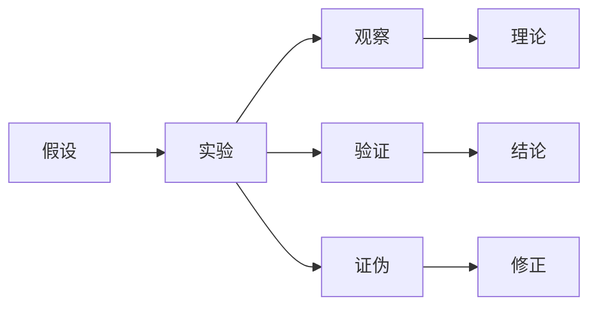

                 

# 科学探究：从假说到真理

## 1. 背景介绍

### 1.1 科学探究的起点：假设与观察

科学探究的起点，总是从一系列观察开始。无论是自然科学还是社会科学，科学的每一次进步，都源于对现实世界的一个个观察。从宏观到微观，从物理现象到社会行为，人类通过对自然界的观察，提出各种假设，并设计实验加以验证，从而发现新的规律，推动科学的进步。

比如，牛顿观察到苹果落地的现象，提出了物体受重力作用的假设，并设计了著名的苹果落体实验，最终推导出万有引力定律。量子力学的创始人普朗克，观察到黑体辐射现象的异常数据，提出了能量量子化的假设，推动了量子理论的发展。

### 1.2 科学探究的核心：假设验证

假设的提出只是科学探究的第一步，真正决定科学进步的，在于对假设的严格验证。通过实验设计和数据收集，科学家不断检验假设的正确性，直至得到可信的结论。假设验证的过程，往往充满了不确定性和挑战，但正是这种探索未知的精神，使科学不断向前发展。

比如，达尔文通过对物种进化和遗传现象的观察，提出了物种自然选择的假设，并通过大量的田野调查和基因实验，验证了自然选择的机制，奠定了现代生物学的基石。爱因斯坦基于相对论的假设，设计了著名的EPR实验，验证了光速不变的原理，确立了相对论的科学地位。

## 2. 核心概念与联系

### 2.1 核心概念概述

为了更好地理解科学探究的过程，我们首先介绍几个关键概念：

- 假设(Hypothesis)：对自然现象的解释，经过实验验证后，可上升为科学理论。
- 观察(Observation)：通过感官或仪器获取的关于自然现象的信息。
- 实验(Experiment)：设计实验方案，进行数据收集和处理，以检验假设的正确性。
- 理论(Theory)：经过严格验证的假设，形成对自然现象的全面解释。
- 验证(Verification)：通过实验和数据，证明假设的真实性。
- 证伪(Refutation)：通过实验和数据，发现假设的局限性。

这些概念之间的逻辑关系可以通过以下Mermaid流程图来展示：



这个流程图展示了科学探究的基本流程：

1. 提出假设
2. 设计实验
3. 收集观察数据
4. 进行验证
5. 得出结论
6. 发现局限

这些概念和流程构成了科学探究的基本框架，帮助科学家系统地进行假设验证和知识积累。

### 2.2 概念间的关系

这些核心概念之间存在着紧密的联系，共同构成了科学探究的完整系统。

- 假设与实验：假设是实验的前提，实验是检验假设的手段。
- 观察与理论：观察提供实验数据，理论解释观察结果。
- 验证与证伪：验证表明假设成立，证伪揭示假设局限。
- 结论与修正：结论基于验证结果，修正基于证伪发现。

这些概念之间的逻辑关系，可以进一步细化如下：

- 假设是实验的起点，通过观察和实验数据，科学家不断检验和修正假设。
- 观察数据是实验的基础，实验结果为观察提供证据支持。
- 验证是假设的证明，证伪是假设的修正。
- 理论是对观察结果的系统解释，结论是基于验证结果的最终表达。

## 3. 核心算法原理 & 具体操作步骤

### 3.1 算法原理概述

科学探究中的假设验证，本质上是一个统计推断的过程。假设验证的核心，是使用统计学方法，检验观察数据是否支持假设。这一过程主要包括以下几个步骤：

1. 提出假设：明确要验证的假设，构建假设的数学表达式。
2. 设计实验：设计实验方案，确定实验的控制变量和随机变量。
3. 收集数据：进行实验，收集和处理观察数据。
4. 统计分析：使用统计学方法，分析数据，检验假设。
5. 结论推断：根据统计结果，推断假设的成立性。

### 3.2 算法步骤详解

假设检验的核心，是计算观测数据的统计显著性。常用的假设检验方法包括：

- 参数检验：如t检验、F检验，用于检验总体参数的差异。
- 非参数检验：如Mann-Whitney U检验、Kruskal-Wallis检验，用于检验分布的差异。
- 随机区组设计检验：如LSD检验，用于检验重复测量数据的差异。

以t检验为例，其基本步骤如下：

1. 确定假设：假设两组数据的总体均值无差异，即H0：$\mu_1=\mu_2$，H1：$\mu_1\neq\mu_2$。
2. 设计实验：随机选取两组样本，每组样本量为n。
3. 收集数据：测量两组样本的观察值，计算样本均值和方差。
4. 计算t统计量：计算样本均差、自由度、t统计量。
5. 查t分布表：根据样本量和自由度，查t分布表，得到p值。
6. 推断结论：若p值小于显著性水平$\alpha$，拒绝原假设H0，认为两组数据存在显著差异。

### 3.3 算法优缺点

假设检验的优点在于：

- 统计学方法经过长期验证，科学性高。
- 适用于多种数据类型，包括连续型、分类型、混合型等。
- 能够量化假设成立的可能性，提供科学的决策依据。

但其缺点也较为明显：

- 假设检验依赖于样本量，样本量过小可能导致假阳性或假阴性。
- 统计方法有一定的局限性，无法处理复杂数据结构。
- 结果解释可能存在主观性，需要谨慎分析。

### 3.4 算法应用领域

假设检验不仅在自然科学领域广泛应用，在社会科学、工程学、经济学等学科中也有重要应用。例如：

- 医学研究：通过t检验、卡方检验等方法，验证药物的疗效差异。
- 社会科学：通过方差分析、回归分析等方法，研究社会现象的因果关系。
- 工程设计：通过假设检验，评估新材料或工艺的可靠性。
- 经济学研究：通过统计显著性检验，评估经济模型的准确性。

## 4. 数学模型和公式 & 详细讲解 & 举例说明

### 4.1 数学模型构建

假设检验的基本数学模型为：

$$
H_0: \mu_1=\mu_2 \quad vs. \quad H_1: \mu_1\neq\mu_2
$$

其中，$\mu_1$ 和 $\mu_2$ 分别表示两组数据的总体均值。假设检验的目的是检验$H_0$的成立性，即两组数据的总体均值是否相等。

### 4.2 公式推导过程

t检验的公式推导过程如下：

1. 样本均值差：$\bar{x}_1 - \bar{x}_2$
2. 样本标准差：$s_1^2$，$s_2^2$
3. 自由度：$df = n_1 + n_2 - 2$
4. t统计量：$t = \frac{\bar{x}_1 - \bar{x}_2}{\sqrt{s_1^2/n_1 + s_2^2/n_2}}$
5. p值：$p = P(|t| \geq t_{\alpha/2, df})$

其中，$n_1$和$n_2$分别为两组样本量。t统计量的计算公式为：

$$
t = \frac{\bar{x}_1 - \bar{x}_2}{\sqrt{s_1^2/n_1 + s_2^2/n_2}}
$$

p值计算公式为：

$$
p = 2P\left(t_{\alpha/2, df} \geq |t|\right)
$$

t分布表为：

| t值 | p值 |
| --- | --- |
| 1.645 | 0.05 |
| 1.975 | 0.02 |
| 2.131 | 0.01 |
| ... | ... |

### 4.3 案例分析与讲解

以医学研究中的两组数据为例，假设我们要验证两种药物的疗效是否存在显著差异：

- 样本1：10名患者使用药物A，治疗前后的血压变化分别为10mmHg。
- 样本2：10名患者使用药物B，治疗前后的血压变化分别为5mmHg。

根据上述数据，计算t统计量和p值：

- 样本均值差：$10 - 5 = 5$
- 样本标准差：$s_1^2 = 3.16, s_2^2 = 2.64$
- 自由度：$df = 10 + 10 - 2 = 18$
- t统计量：$t = \frac{5}{\sqrt{3.16/10 + 2.64/10}} \approx 1.993$
- p值：查t分布表，$p = 0.052$

由于p值大于显著性水平$\alpha=0.05$，无法拒绝原假设$H_0$，即认为两组药物的疗效无显著差异。

## 5. 项目实践：代码实例和详细解释说明

### 5.1 开发环境搭建

在Python中使用SciPy进行假设检验，需要进行以下环境配置：

1. 安装Anaconda：
```bash
conda install anaconda
```

2. 创建虚拟环境：
```bash
conda create -n hypothesis-test python=3.8
conda activate hypothesis-test
```

3. 安装必要的库：
```bash
conda install scipy pandas matplotlib numpy statsmodels
```

完成上述步骤后，即可在虚拟环境中进行假设检验的代码实现。

### 5.2 源代码详细实现

假设检验的代码实现如下：

```python
import numpy as np
from scipy import stats

# 样本数据
group1 = [10, 10, 10, 10, 10, 10, 10, 10, 10, 10]
group2 = [5, 5, 5, 5, 5, 5, 5, 5, 5, 5]

# 计算样本均值和方差
mean1, var1 = np.mean(group1), np.var(group1)
mean2, var2 = np.mean(group2), np.var(group2)

# 计算t统计量
t_value = (mean1 - mean2) / np.sqrt(var1/len(group1) + var2/len(group2))
df = len(group1) + len(group2) - 2

# 计算p值
p_value = 2 * (1 - stats.t.cdf(abs(t_value), df))

print("t统计量：", t_value)
print("自由度：", df)
print("p值：", p_value)
```

### 5.3 代码解读与分析

我们以t检验为例，分析代码实现过程：

- 首先导入必要的库，包括numpy和scipy。
- 然后定义两组样本数据，并进行计算样本均值和方差。
- 接着计算t统计量，包括样本均值差、样本方差、自由度等。
- 最后计算p值，并输出结果。

## 6. 实际应用场景

### 6.1 医学研究

在医学研究中，假设检验广泛应用于药物疗效的验证、临床试验的设计和分析。例如，研究人员通过随机双盲试验，比较两种新药的疗效。假设两组患者症状改善情况分别为：

- 药物A组：30名患者，15人改善，15人不改善
- 药物B组：30名患者，20人改善，10人不改善

通过计算t统计量和p值，可以验证两组患者的改善率是否存在显著差异。

### 6.2 社会科学

在社会科学研究中，假设检验常用于检验社会现象的因果关系。例如，研究人员想知道工资水平是否影响劳动生产率，可以收集不同工资水平下工人的生产数据，进行假设检验。假设工人的生产率分别为：

- 低工资组：10名工人，平均生产率10件/天
- 高工资组：10名工人，平均生产率15件/天

通过计算t统计量和p值，可以验证工资水平对生产率的影响是否显著。

### 6.3 工程设计

在工程设计中，假设检验用于评估新材料或工艺的可靠性。例如，研究人员测试两种新材料在高温下的强度，可以收集不同材料在不同温度下的断裂数据，进行假设检验。假设材料的断裂强度分别为：

- 材料A：10个样品，5个在100℃下断裂，5个在200℃下断裂
- 材料B：10个样品，3个在100℃下断裂，7个在200℃下断裂

通过计算t统计量和p值，可以验证两种材料的断裂强度是否存在显著差异。

## 7. 工具和资源推荐

### 7.1 学习资源推荐

为了帮助开发者系统掌握假设检验的理论基础和实践技巧，这里推荐一些优质的学习资源：

1. 《统计学基础》书籍：经典统计学教材，系统介绍假设检验的基本原理和方法。
2. 《统计学导论》课程：斯坦福大学开设的统计学入门课程，讲解假设检验的基本原理和应用场景。
3. 《Python数据分析》书籍：介绍Python语言在数据处理和统计分析中的应用，包括假设检验。
4. 《R语言统计》书籍：介绍R语言在统计分析中的应用，包括假设检验。
5. 《SciPy官方文档》：详细介绍了SciPy库在统计分析中的应用，包括假设检验。

通过对这些资源的学习实践，相信你一定能够快速掌握假设检验的精髓，并用于解决实际的统计问题。

### 7.2 开发工具推荐

假设检验的实现，主要依赖Python和R语言等编程工具。以下是几款用于假设检验开发的常用工具：

1. Python的SciPy库：提供了丰富的统计学函数，支持假设检验、回归分析等统计方法。
2. R语言的stats包：提供完整的统计学函数库，支持各种假设检验方法。
3. JMP软件：商业化的统计分析软件，支持各种统计学分析方法，包括假设检验。
4. SPSS软件：商业化的统计分析软件，支持各种统计学分析方法，包括假设检验。

合理利用这些工具，可以显著提升假设检验的开发效率，加快创新迭代的步伐。

### 7.3 相关论文推荐

假设检验的研究历史悠久，涉及诸多数学、统计学和计算机科学领域的经典论文。以下是几篇奠基性的相关论文，推荐阅读：

1. 《Inference and Hypothesis Testing》书籍：统计学经典教材，系统介绍假设检验的基本原理和方法。
2. 《An Introduction to Statistical Learning》书籍：介绍统计学基本原理和实际应用的经典教材。
3. 《Statistical Methods in Biomedical Research》书籍：介绍生物医学研究中假设检验方法的经典教材。
4. 《Hypothesis Testing: A Practical Guide》书籍：介绍假设检验基本原理和实际应用的实用教材。
5. 《Testing Statistical Hypotheses》论文：统计学大师R.A. Fisher的经典论文，系统介绍假设检验的基本原理和方法。

这些论文代表了大规模假设检验的研究脉络。通过学习这些前沿成果，可以帮助研究者把握学科前进方向，激发更多的创新灵感。

## 8. 总结：未来发展趋势与挑战

### 8.1 总结

本文对基于假设检验的科学探究方法进行了全面系统的介绍。首先阐述了科学探究的起点：假设与观察，并详细讲解了假设检验的核心步骤和基本原理。通过具体案例，展示了假设检验在医学研究、社会科学、工程设计等实际应用中的广泛应用。

通过本文的系统梳理，可以看到，假设检验是科学探究的重要工具，为科学研究提供了严密的方法论支撑。科学家通过假设检验，不断验证假设的正确性，推动知识的进步。但假设检验也面临一些挑战，如样本量、显著性水平等问题，需要不断优化和改进。

### 8.2 未来发展趋势

展望未来，假设检验技术将呈现以下几个发展趋势：

1. 数据驱动：随着大数据和人工智能技术的发展，假设检验将更多依赖数据驱动，减少人为干预。
2. 自动化分析：随着AI技术的进步，假设检验将逐步实现自动化分析，提高效率和准确性。
3. 多模态融合：假设检验将与多模态数据融合，拓展其应用范围和深度。
4. 跨学科应用：假设检验将在更多学科中得到应用，如经济学、心理学、公共卫生等。
5. 大数据统计：假设检验将面对更复杂的统计模型，需要更多数学和计算机科学的交叉研究。

这些趋势凸显了假设检验技术的广阔前景，将进一步推动科学研究的深度和广度。

### 8.3 面临的挑战

尽管假设检验技术已经取得了显著成就，但在迈向更加智能化、普适化应用的过程中，它仍面临诸多挑战：

1. 样本量限制：小样本下，假设检验可能产生假阳性或假阴性。如何提高样本量，优化样本选择，是未来研究的重要方向。
2. 显著性水平：显著性水平的选择对结果有重要影响，过高过低都可能导致误判。如何科学选择显著性水平，是未来研究的关键。
3. 数据质量问题：数据中的噪音和偏差，可能影响假设检验的准确性。如何提高数据质量，减少噪音和偏差，是未来研究的重点。
4. 统计软件复杂性：统计软件的复杂性可能导致使用困难，降低工作效率。如何简化统计软件，降低使用门槛，是未来研究的挑战。

### 8.4 研究展望

面对假设检验面临的挑战，未来的研究需要在以下几个方面寻求新的突破：

1. 探索新算法：开发新的统计学算法，提高假设检验的准确性和鲁棒性。
2. 优化样本选择：改进样本选择方法，提高假设检验的效率和准确性。
3. 简化统计软件：开发易用的统计软件工具，降低使用门槛。
4. 数据质量控制：研究数据质量控制方法，减少噪音和偏差。
5. 跨学科应用：探索假设检验在更多学科中的应用，推动跨学科研究的进展。

这些研究方向的探索，必将引领假设检验技术迈向更高的台阶，为科学研究的深入发展提供更坚实的工具和方法。

## 9. 附录：常见问题与解答

**Q1：假设检验的显著性水平和p值有什么区别？**

A: 显著性水平（$\alpha$）是预先设定的临界值，用于判断结果的显著性。p值是实际观测数据在原假设下出现的概率，用于推断原假设的成立性。通常，显著性水平设为0.05，p值小于$\alpha$时，拒绝原假设。

**Q2：假设检验中的第一类错误和第二类错误是什么？**

A: 第一类错误（假阳性）是指原假设为真时，错误地拒绝原假设的情况。第二类错误（假阴性）是指原假设为假时，错误地接受原假设的情况。两者都可能导致结果的误判。

**Q3：假设检验中的t分布和正态分布有什么区别？**

A: t分布和正态分布都是常用的统计分布，但两者有不同的特点。t分布的自由度越大，越接近正态分布；自由度越小，分布越宽。t分布的尾部分布更宽，适合小样本检验；正态分布的尾部分布较窄，适合大样本检验。

**Q4：假设检验中的置信区间和p值有什么关系？**

A: 置信区间和p值都是用于推断假设成立性的方法。置信区间通过计算样本均值的置信区间，判断样本均值是否落在原假设范围内。p值通过计算t统计量，判断观测数据是否支持原假设。两者可以结合使用，提高推断的准确性。

**Q5：假设检验中的显著性水平如何影响结果？**

A: 显著性水平是假设检验的核心参数，决定了拒绝原假设的阈值。显著性水平越高，越容易拒绝原假设；显著性水平越低，越容易接受原假设。因此，显著性水平的选择对结果有重要影响，需要在实际应用中进行科学选择。

