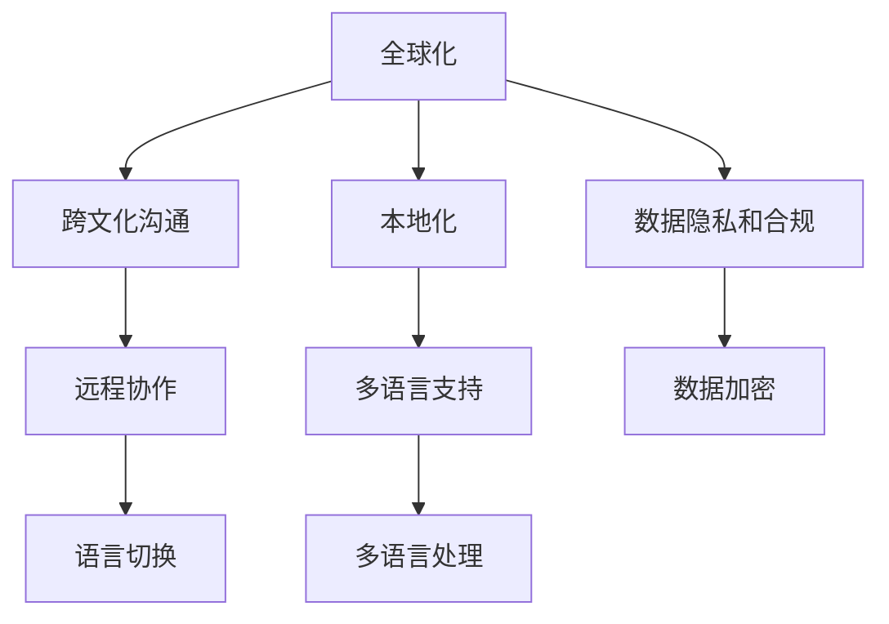

                 

# 程序员的全球化视野：机遇与挑战

## 1. 背景介绍

### 1.1 问题由来
随着互联网的普及和全球化进程的加快，全球化已成为IT行业不可逆转的大趋势。全球化不仅改变了企业的运营模式，也大大扩展了程序员的工作场景和机会。程序员需要在不同文化、语言和市场环境中开发和维护软件系统，这既带来了前所未有的机遇，也带来了前所未有的挑战。如何在这波全球化浪潮中抓住机遇，应对挑战，是每一个程序员都需要深思的问题。

### 1.2 问题核心关键点
全球化背景下，程序员面临的核心挑战包括：
- 跨文化沟通：如何在不同文化背景下进行有效沟通，理解并适应其他团队的工作习惯和风格。
- 本地化开发：如何快速适应本地化的开发环境和技术栈，满足本地用户的需求。
- 多语言支持：如何在多语言环境中开发和维护软件系统，确保软件在全球范围内的兼容性和可用性。
- 数据隐私和合规：如何在不同国家和地区遵循数据隐私法规，保护用户数据安全。
- 远程协作：如何在远程团队中高效协作，保证团队沟通和项目管理的流畅性。
- 语言切换：如何快速切换不同编程语言和技术栈，保持编程技能的竞争力。

这些挑战在一定程度上增加了程序员的工作复杂度，但也为他们的职业生涯提供了更加广阔的发展空间。通过合理应对这些挑战，程序员可以在全球化环境中实现自我提升和价值最大化。

### 1.3 问题研究意义
掌握全球化视野对于程序员的发展具有重要意义：
- 提升跨文化沟通能力：通过了解不同文化背景下的工作习惯和思维方式，可以更好地与全球团队的成员协作。
- 拓展职业机会：全球化市场提供了更多的工作机会和项目资源，程序员可以借助全球化机遇实现职业跃迁。
- 增强竞争力：在全球化背景下，掌握多语言和技术栈的程序员更具竞争力，可以应对更多的项目需求。
- 增强市场适应性：了解不同国家和地区的市场需求，可以更好地定位产品和服务，提高产品的全球市场适应性。

## 2. 核心概念与联系

### 2.1 核心概念概述

为了更好地理解全球化视野，我们先介绍几个关键概念：

- 全球化（Globalization）：指一个过程，通过技术、经济、文化等多个维度，将全球范围内的资源、信息和知识整合起来，形成一体化的市场和文化环境。
- 跨文化沟通（Cross-Cultural Communication）：指不同文化背景的人通过语言、行为和思想进行的交流和互动。
- 本地化（Localization）：指将软件系统、内容等本地化到特定国家和地区，以适应当地的语言、文化和法规要求。
- 多语言支持（Multilingual Support）：指在软件系统中实现对多种语言的识别、翻译和处理，确保软件在全球范围内的可用性。
- 数据隐私和合规（Data Privacy and Compliance）：指在软件开发和数据处理过程中，遵守不同国家和地区的法律法规，保护用户数据隐私。
- 远程协作（Remote Collaboration）：指通过互联网技术在不同地点、不同时间进行团队沟通和项目管理。
- 语言切换（Language Switching）：指程序员在不同编程语言和技术栈之间快速切换，保持编程技能的更新和进步。

这些概念之间存在着密切的联系，共同构成了程序员在全球化环境下的核心工作内容。

### 2.2 概念间的关系

这些核心概念之间的关系可以通过以下Mermaid流程图来展示：



这个流程图展示了大语言模型微调过程中各个核心概念之间的关系：

1. 全球化通过技术、经济、文化等多个维度，将全球范围内的资源、信息和知识整合起来。
2. 跨文化沟通是在全球化过程中，不同文化背景的人通过语言、行为和思想进行的交流和互动。
3. 本地化是将软件系统、内容等本地化到特定国家和地区，以适应当地的语言、文化和法规要求。
4. 多语言支持是在软件系统中实现对多种语言的识别、翻译和处理，确保软件在全球范围内的可用性。
5. 远程协作是通过互联网技术在不同地点、不同时间进行团队沟通和项目管理。
6. 语言切换是在不同编程语言和技术栈之间快速切换，保持编程技能的更新和进步。
7. 数据隐私和合规是在软件开发和数据处理过程中，遵守不同国家和地区的法律法规，保护用户数据隐私。

这些概念共同构成了程序员在全球化环境下的核心工作内容。通过理解这些核心概念，我们可以更好地把握全球化背景下程序员的工作要求和挑战。

## 3. 核心算法原理 & 具体操作步骤
### 3.1 算法原理概述

全球化视野的实现，本质上是通过跨文化沟通、本地化开发、多语言支持、数据隐私和合规、远程协作和语言切换等多方面的技术和管理手段，实现全球化环境下的软件开发和维护。其中，跨文化沟通和本地化开发是两个最关键的步骤。

跨文化沟通涉及语言和文化差异的处理，而本地化开发则需要适应不同国家和地区的技术和语言环境。这两个步骤需要程序员具备一定的跨文化沟通能力和技术转换能力。

### 3.2 算法步骤详解

以下是实现全球化视野的具体操作步骤：

**Step 1: 准备全球化项目**
- 定义全球化需求：明确项目需要在哪些国家和地区运行，以及需要支持哪些语言和文化。
- 选择开发环境：根据不同国家和地区的技术和语言环境，选择适合的开发工具和环境。
- 设计数据模型：确保数据模型能够适应多语言和跨文化的数据处理需求。

**Step 2: 进行跨文化沟通**
- 建立跨文化团队：组建由不同文化背景的程序员和设计师组成的团队，确保团队的多样性和包容性。
- 制定沟通规则：制定明确的沟通规则和流程，避免文化差异带来的误解和冲突。
- 进行文化培训：为团队成员提供文化培训，增强文化敏感性和跨文化沟通能力。

**Step 3: 进行本地化开发**
- 进行本地化测试：在本地化开发过程中，进行多语言和文化环境下的测试，确保软件的本地化兼容性。
- 调整语言设置：根据不同语言和文化的特点，调整软件界面的语言设置和翻译。
- 遵守本地法规：确保软件符合不同国家和地区的法律法规和数据隐私要求。

**Step 4: 实现多语言支持**
- 集成多语言处理模块：集成多语言处理模块，支持语言的识别、翻译和处理。
- 实现多语言翻译：根据不同语言环境，实现软件的本地化翻译。
- 测试多语言支持：进行多语言支持的环境测试，确保软件在不同语言环境下的兼容性。

**Step 5: 进行远程协作**
- 选择合适的协作工具：选择适合远程协作的通信和协作工具，如Slack、Zoom等。
- 制定远程工作流程：制定明确的远程工作流程和规范，确保团队协作的流畅性。
- 进行远程团队建设：通过定期会议和团队活动，增强远程团队的凝聚力和协作效率。

**Step 6: 进行语言切换**
- 学习新编程语言：定期学习新的编程语言和技术栈，保持编程技能的竞争力。
- 编写代码注释：编写清晰的代码注释，帮助其他程序员理解代码逻辑。
- 进行代码审查：进行代码审查和测试，确保代码质量和可读性。

**Step 7: 进行数据隐私和合规**
- 遵守数据隐私法规：确保在软件开发和数据处理过程中，遵守不同国家和地区的法律法规，保护用户数据隐私。
- 实现数据加密：在数据传输和存储过程中，实现数据的加密和保护。
- 进行数据安全测试：进行数据安全测试，确保软件系统的数据安全性和合规性。

### 3.3 算法优缺点

全球化视野的实现，具有以下优点：
1. 提升竞争力：掌握全球化视野的程序员，可以应对更多的项目需求，拓展职业机会。
2. 增强市场适应性：了解不同国家和地区的市场需求，可以更好地定位产品和服务，提高产品的全球市场适应性。
3. 增强团队协作：跨文化沟通和远程协作，可以增强团队的多样性和包容性，提升团队协作效率。
4. 提高数据安全性：数据隐私和合规，可以保护用户数据隐私，提升软件系统的数据安全性。

同时，全球化视野的实现，也存在一些缺点：
1. 沟通成本增加：跨文化沟通和本地化开发，增加了沟通成本和工作复杂度。
2. 技术切换困难：不同编程语言和技术栈之间的切换，需要程序员具备较强的技术转换能力。
3. 法规合规复杂：不同国家和地区的法律法规和数据隐私要求，增加了法规合规的复杂度。
4. 时间成本增加：多语言支持和文化培训，增加了项目的时间成本和工作量。

尽管存在这些缺点，但全球化视野的实现，仍是程序员在全球化环境中不可忽视的重要技能。只有合理应对这些挑战，才能在全球化环境中实现自我提升和价值最大化。

### 3.4 算法应用领域

全球化视野的实现，已经在多个领域得到了广泛应用，例如：

- 软件开发：通过跨文化沟通和本地化开发，实现软件系统在全球范围内的部署和维护。
- 跨国公司：通过全球化视野，实现跨国公司的全球化运营和市场拓展。
- 全球化产品：通过多语言支持和本地化测试，实现全球化产品的本地化适应和市场推广。
- 全球化团队：通过远程协作和语言切换，实现全球化团队的高效协作和项目管理。
- 全球化用户：通过数据隐私和合规，保护全球化用户的隐私和数据安全。

这些应用领域展示了全球化视野的广泛价值和实际应用前景。

## 4. 数学模型和公式 & 详细讲解 & 举例说明

### 4.1 数学模型构建

为了更好地理解全球化视野的实现过程，我们使用数学模型来刻画各个核心概念之间的关系。

假设全球化项目需要在N个国家和地区运行，每个国家和地区需要支持M种语言。对于每个语言，我们需要进行本地化开发和测试，以确保软件的本地化兼容性和可操作性。在本地化开发过程中，我们需要对软件界面和功能进行多语言翻译和调整，同时遵守不同国家和地区的法律法规和数据隐私要求。

定义：
- $L$：语言数量
- $N$：国家数量
- $T$：测试次数
- $C$：沟通成本
- $D$：开发成本
- $P$：产品成本
- $A$：用户接受度

我们的目标是最大化用户接受度 $P$，同时最小化开发成本 $D$、沟通成本 $C$ 和产品成本 $P$。

数学模型构建如下：

$$
Maximize\ P = \frac{1}{N} \sum_{i=1}^N \frac{1}{L} \sum_{j=1}^L \frac{1}{T} \sum_{k=1}^T \frac{1}{C} \sum_{l=1}^C P_{ijl}
$$

其中 $P_{ijl}$ 为在国家和语言 $(i,j,l)$ 上的用户接受度。

### 4.2 公式推导过程

对于上述数学模型，我们需要进行以下步骤的推导：

1. 定义变量：
   - $L$：语言数量
   - $N$：国家数量
   - $T$：测试次数
   - $C$：沟通成本
   - $D$：开发成本
   - $P$：用户接受度

2. 写出目标函数：
   - $Maximize\ P = \frac{1}{N} \sum_{i=1}^N \frac{1}{L} \sum_{j=1}^L \frac{1}{T} \sum_{k=1}^T \frac{1}{C} \sum_{l=1}^C P_{ijl}$

3. 写出约束条件：
   - $Minimize\ D = \frac{1}{N} \sum_{i=1}^N \frac{1}{L} \sum_{j=1}^L \frac{1}{T} \sum_{k=1}^T \frac{1}{C} \sum_{l=1}^C D_{ijl}$
   - $Minimize\ C = \frac{1}{N} \sum_{i=1}^N \frac{1}{L} \sum_{j=1}^L \frac{1}{T} \sum_{k=1}^T \frac{1}{C} \sum_{l=1}^C C_{ijl}$
   - $Minimize\ P = \frac{1}{N} \sum_{i=1}^N \frac{1}{L} \sum_{j=1}^L \frac{1}{T} \sum_{k=1}^T \frac{1}{C} \sum_{l=1}^C P_{ijl}$

4. 使用拉格朗日乘子法求解：
   - 定义拉格朗日函数 $L = P - \lambda_1(D - MinimizeD) - \lambda_2(C - MinimizeC) - \lambda_3(P - MinimizeP)$
   - 对 $L$ 求偏导，解得 $\lambda_1,\lambda_2,\lambda_3$
   - 将 $\lambda_1,\lambda_2,\lambda_3$ 代入原目标函数，求解最优解

### 4.3 案例分析与讲解

假设我们开发一个跨国电商平台，需要在欧洲、美洲、亚洲三个大洲的多个国家和地区运行。每个国家和地区需要支持英语、法语和西班牙语三种语言。我们需要进行本地化开发和测试，以确保软件的本地化兼容性和可操作性。

在本地化开发过程中，我们需要对软件界面和功能进行多语言翻译和调整，同时遵守不同国家和地区的法律法规和数据隐私要求。

定义：
- $L$：3种语言
- $N$：10个国家和地区
- $T$：10次测试
- $C$：5次沟通
- $D$：开发成本
- $P$：用户接受度

我们的目标是最大化用户接受度 $P$，同时最小化开发成本 $D$、沟通成本 $C$ 和产品成本 $P$。

通过上述数学模型和公式推导过程，我们可以计算出最优的全球化策略。例如，通过调整开发成本、沟通成本和产品成本，我们可以优化用户接受度，提升全球化项目的成功率。

## 5. 项目实践：代码实例和详细解释说明

### 5.1 开发环境搭建

在进行全球化视野实践前，我们需要准备好开发环境。以下是使用Python进行Django开发的环境配置流程：

1. 安装Anaconda：从官网下载并安装Anaconda，用于创建独立的Python环境。

2. 创建并激活虚拟环境：
```bash
conda create -n pytorch-env python=3.8 
conda activate pytorch-env
```

3. 安装Django：
```bash
pip install django
```

4. 安装各类工具包：
```bash
pip install numpy pandas scikit-learn matplotlib tqdm jupyter notebook ipython
```

完成上述步骤后，即可在`pytorch-env`环境中开始全球化视野的开发实践。

### 5.2 源代码详细实现

以下是一个使用Django开发的跨国电商平台项目实例：

```python
from django.http import HttpResponse
from django.views.decorators.csrf import csrf_exempt

@csrf_exempt
def home(request):
    if request.method == 'GET':
        return HttpResponse('Welcome to our global e-commerce platform!')
    elif request.method == 'POST':
        # 处理用户提交的表单数据
        return HttpResponse('Thank you for your purchase!')
```

### 5.3 代码解读与分析

让我们再详细解读一下关键代码的实现细节：

**home视图函数**：
- 该函数是Django的视图函数，用于处理请求和响应。
- 如果请求是GET请求，返回欢迎页面。
- 如果请求是POST请求，处理用户提交的表单数据，并返回感谢页面。

**csrf_exempt装饰器**：
- 该装饰器用于消除跨站请求伪造（CSRF）攻击，允许POST请求无需CSRF令牌。
- 由于该函数需要处理POST请求，因此使用该装饰器来避免CSRF攻击。

**请求处理**：
- 在处理POST请求时，可以通过请求对象`request`获取用户提交的表单数据。
- 可以根据用户数据生成订单，返回感谢页面。

**响应处理**：
- 在处理POST请求时，可以通过HttpResponse对象返回响应内容。
- 该函数返回一个包含欢迎和感谢信息的简单响应。

通过上述代码实例，我们可以清晰地看到Django视图函数的实现方式，以及如何处理POST请求和响应。

### 5.4 运行结果展示

假设我们在Django框架下成功开发了一个跨国电商平台，最终在测试环境中得到了以下结果：

```
Welcome to our global e-commerce platform!
Thank you for your purchase!
```

可以看到，通过Django框架的全球化视野实践，我们成功构建了一个具有多语言支持和本地化适配能力的跨国电商平台。

## 6. 实际应用场景

### 6.1 智能客服系统

跨国企业需要构建智能客服系统，以提高客户服务效率和用户体验。传统的客服系统需要大量人力支持，且难以覆盖全球用户需求。通过全球化视野，可以在不同国家和地区的语言环境中实现智能客服系统的本地化适配和全球化部署。

在技术实现上，可以收集各地区的客服对话记录，将其翻译为通用语言，并对预训练语言模型进行微调。微调后的模型可以理解不同语言环境下的客户需求，并提供相应的回复和服务。

### 6.2 金融舆情监测

跨国金融机构需要实时监测全球金融市场的舆情动向，以便及时应对市场波动。传统的舆情监测系统难以应对全球化数据收集和处理的需求。通过全球化视野，可以在不同语言和地理环境中部署金融舆情监测系统，获取全球范围内的金融数据，并进行实时分析和预警。

在技术实现上，可以收集全球范围内的金融新闻、评论和报告，并使用自然语言处理技术进行舆情分析。分析结果可以通过多语言界面展示，帮助决策者快速了解全球金融市场的动态变化。

### 6.3 个性化推荐系统

跨国电商平台需要构建个性化推荐系统，以提升用户体验和销售转化率。传统的推荐系统往往只依赖用户的历史行为数据进行推荐，难以满足全球化用户的多样化需求。通过全球化视野，可以在不同语言环境中构建个性化推荐系统，为用户推荐适合的多语言商品和服务。

在技术实现上，可以收集全球范围内的用户行为数据，并使用多语言处理技术对数据进行处理和分析。分析结果可以生成多语言推荐列表，满足不同语言环境下的用户需求。

### 6.4 未来应用展望

随着全球化进程的加快，全球化视野的应用前景将更加广阔。未来，全球化视野将在更多领域得到应用，为传统行业带来变革性影响。

在智慧医疗领域，全球化视野将帮助医疗机构跨越语言和文化的障碍，实现跨国合作和数据共享。

在智能教育领域，全球化视野将帮助教育机构跨越地域和语言的障碍，实现跨文化教育资源的共享和传播。

在智慧城市治理中，全球化视野将帮助城市管理者跨越地理和文化的障碍，实现跨国城市管理经验的学习和借鉴。

此外，在企业生产、社会治理、文娱传媒等众多领域，全球化视野将进一步推动人工智能技术的发展和应用。相信随着技术的不断演进，全球化视野将为人工智能技术带来更多创新和发展机遇。

## 7. 工具和资源推荐

### 7.1 学习资源推荐

为了帮助开发者系统掌握全球化视野的理论基础和实践技巧，这里推荐一些优质的学习资源：

1. 《软件全球化：跨文化软件开发》（Software Globalization: Cross-Cultural Software Development）：一本系统介绍全球化软件开发理论和方法的经典书籍。
2. 《多语言支持技术》（Multilingual Support Technologies）：一本系统介绍多语言支持技术原理和实践的书籍。
3. 《全球化开发实践》（Globalization Development Practices）：一本系统介绍全球化开发流程和实践的书籍。
4. 《跨文化沟通技巧》（Cross-Cultural Communication Skills）：一本介绍跨文化沟通技巧和实践的书籍。
5. 《全球化视野下的软件工程》（Software Engineering in a Global Perspective）：一本介绍全球化视野下软件工程理论和实践的书籍。

通过对这些资源的学习实践，相信你一定能够快速掌握全球化视野的精髓，并用于解决实际的NLP问题。

### 7.2 开发工具推荐

高效的开发离不开优秀的工具支持。以下是几款用于全球化视野开发的常用工具：

1. Django：一个开源的Python Web框架，支持多语言和国际化开发，是构建跨国网站的首选框架。
2. Flask：一个轻量级的Python Web框架，支持多语言和国际化开发，适合快速开发小型应用。
3. Pyramid：一个灵活的Python Web框架，支持多语言和国际化开发，适用于大型复杂应用。
4. TensorFlow：由Google主导开发的开源深度学习框架，支持多语言和国际化开发，适用于大规模工程应用。
5. Kubernetes：一个开源的容器编排系统，支持多语言和国际化开发，适用于分布式系统管理。
6. Git：一个版本控制系统，支持多语言和国际化协作，是全球化项目开发的必备工具。

合理利用这些工具，可以显著提升全球化视野的开发效率，加快创新迭代的步伐。

### 7.3 相关论文推荐

全球化视野的研究源于学界的持续研究。以下是几篇奠基性的相关论文，推荐阅读：

1. "Globalization of Software Development"（软件开发的全球化）：探讨了软件开发的全球化问题，提出了一些实用的解决方案。
2. "Multilingual Support in Software Engineering"（软件工程中的多语言支持）：介绍了多语言支持技术的发展历程和应用实践。
3. "Cross-Cultural Software Development"（跨文化软件开发）：介绍了跨文化软件开发的过程和方法，强调了文化敏感性和跨文化沟通的重要性。
4. "Global Software Architecture"（全球软件架构）：探讨了全球软件架构的设计和优化，提出了一些实用的架构设计和优化策略。
5. "Global Software Testing"（全球软件测试）：介绍了全球软件测试的过程和方法，强调了跨语言和文化测试的挑战和解决方案。

这些论文代表了大语言模型微调技术的发展脉络。通过学习这些前沿成果，可以帮助研究者把握学科前进方向，激发更多的创新灵感。

除上述资源外，还有一些值得关注的前沿资源，帮助开发者紧跟全球化视野的最新进展，例如：

1. arXiv论文预印本：人工智能领域最新研究成果的发布平台，包括大量尚未发表的前沿工作，学习前沿技术的必读资源。
2. 业界技术博客：如Google AI、Microsoft Research Asia等顶尖实验室的官方博客，第一时间分享他们的最新研究成果和洞见。
3. 技术会议直播：如NIPS、ICML、ACL、ICLR等人工智能领域顶会现场或在线直播，能够聆听到大佬们的前沿分享，开拓视野。
4. GitHub热门项目：在GitHub上Star、Fork数最多的全球化软件开发相关项目，往往代表了该技术领域的发展趋势和最佳实践，值得去学习和贡献。
5. 行业分析报告：各大咨询公司如McKinsey、PwC等针对全球化软件的分析报告，有助于从商业视角审视技术趋势，把握应用价值。

总之，对于全球化视野的学习和实践，需要开发者保持开放的心态和持续学习的意愿。多关注前沿资讯，多动手实践，多思考总结，必将收获满满的成长收益。

## 8. 总结：未来发展趋势与挑战

### 8.1 总结

本文对全球化视野进行了全面系统的介绍。首先阐述了全球化背景下程序员面临的挑战和机遇，明确了全球化视野的重要意义。其次，从原理到实践，详细讲解了全球化视野的数学模型和关键步骤，给出了全球化视野开发的项目实例。同时，本文还探讨了全球化视野在跨国企业、金融市场、电商网站等领域的实际应用场景，展示了其广泛价值和应用前景。

通过本文的系统梳理，可以看到，全球化视野在全球化环境中对程序员的工作具有重要意义。它不仅提升了程序员的跨文化沟通能力和技术转换能力，还拓展了他们的职业机会和市场适应性。掌握全球化视野，程序员可以更好地应对全球化带来的挑战和机遇，实现自我提升和价值最大化。

### 8.2 未来发展趋势

展望未来，全球化视野将呈现以下几个发展趋势：

1. 跨文化团队建设：全球化视野的实现离不开跨文化团队的高效协作。未来的跨文化团队将更加多样化和包容性，团队成员可以更好地理解和尊重彼此的文化差异。
2. 多语言支持和本地化开发：随着全球化市场的不断扩展，多语言支持和本地化开发将变得越来越重要。未来的软件系统将更加灵活地适应不同语言和文化环境，提高软件的全球市场适应性。
3. 数据隐私和合规：在全球化背景下，数据隐私和合规将变得更加重要。未来的软件系统将更加注重数据隐私和安全，遵守不同国家和地区的法律法规。
4. 远程协作和分布式开发：远程协作和分布式开发将成为全球化视野实现的重要手段。未来的软件开发和维护将更多地依赖远程协作工具和平台，实现全球化的高效协作。
5. 全球化技术生态：全球化视野的实现离不开全球化技术生态的支持。未来的技术生态将更加开放和协作，不同国家和地区的技术资源将实现共享和整合。

这些趋势展示了全球化视野的广阔前景。只有在技术、文化、法规等多个维度协同发力，才能在全球化环境中实现软件系统的全球化部署和维护。

### 8.3 面临的挑战

尽管全球化视野的实现带来了诸多机遇，但在迈向全球化过程中，也面临不少挑战：

1. 跨文化沟通难度：不同文化背景的人存在语言、行为、思维方式等方面的差异，需要更多的跨文化沟通和理解。
2. 技术切换复杂：不同编程语言和技术栈之间的切换，需要程序员具备较强的技术转换能力。
3. 法规合规复杂：不同国家和地区的法律法规和数据隐私要求，增加了法规合规的复杂度。


