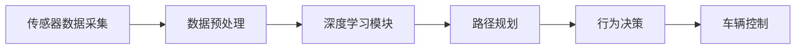

                 

## 1. 背景介绍

### 1.1 问题由来

自动驾驶技术是近年来AI领域的一个热门话题，它旨在让车辆能够在无人工干预的情况下自主导航和驾驶。然而，从感知、决策到控制，自动驾驶系统涉及多个复杂的子系统，每个子系统又包含许多底层技术挑战。全栈自研端到端自动驾驶系统，需要从感知、决策和控制三个环节进行全面考虑，同时确保系统的实时性、安全性和可靠性。

本文将围绕端到端自动驾驶系统，探讨全栈自研过程中的关键挑战，并介绍解决这些挑战的方法和策略。通过对这些挑战的深入分析，希望能为自动驾驶系统开发提供有价值的见解。

### 1.2 问题核心关键点

自动驾驶技术开发的主要挑战包括：

- **感知模块**：包括摄像头、激光雷达、毫米波雷达等传感器数据融合与处理，目标是实现对道路环境的准确感知。
- **决策模块**：基于感知结果，进行路径规划、行为决策和导航。
- **控制模块**：根据决策结果，控制车辆进行转向、加速和制动等动作。

感知模块的感知精度和鲁棒性，直接关系到决策模块和控制模块的性能。而决策模块和控制模块则需要保证系统的实时性和稳定性，以满足实际应用需求。

### 1.3 问题研究意义

端到端自动驾驶系统的全栈自研，对于推动自动驾驶技术的发展具有重要意义：

- **提高技术自主性**：通过自研关键技术，减少对第三方解决方案的依赖，提升技术的自主可控性。
- **降低成本**：自研可以更灵活地控制技术栈，降低整体系统开发成本。
- **增强竞争力**：自研能够使企业快速响应市场变化，提升竞争力。
- **推动创新**：自研过程中可以探索和验证新的技术方案，推动自动驾驶技术的进步。
- **确保系统安全**：自研能够更深入地理解系统逻辑和运行机制，从而提高系统的安全性和可靠性。

## 2. 核心概念与联系

### 2.1 核心概念概述

在探讨自动驾驶全栈自研挑战时，需要理解几个核心概念：

- **端到端自动驾驶**：从传感器数据采集到车辆控制的全流程系统。
- **深度学习**：用于图像处理、物体检测和路径规划等关键模块。
- **传感器融合**：将多种传感器数据进行综合处理，以提高感知精度和鲁棒性。
- **路径规划**：根据感知结果，规划最优行驶路径。
- **行为决策**：基于路径规划结果，进行行为选择和决策。
- **车辆控制**：根据行为决策，控制车辆进行加速、转向和制动等操作。

这些核心概念构成了自动驾驶系统的技术框架，并通过相互协作，实现了系统的自动化驾驶功能。

### 2.2 核心概念间的联系

这些核心概念之间的关系可以用以下Mermaid流程图来展示：



该流程图展示了端到端自动驾驶系统的主要流程：传感器数据采集后，通过深度学习模块进行特征提取和目标检测，接着进行路径规划和行为决策，最后由车辆控制模块执行具体的驾驶操作。

## 3. 核心算法原理 & 具体操作步骤

### 3.1 算法原理概述

端到端自动驾驶系统的核心算法原理可以概括为以下几个步骤：

1. **传感器数据采集与预处理**：通过摄像头、激光雷达、毫米波雷达等传感器采集环境信息，并进行预处理（如滤波、校正等）。
2. **深度学习特征提取**：使用深度学习模型（如卷积神经网络CNN、目标检测模型YOLO、语义分割模型U-Net等）对传感器数据进行处理，提取道路、车辆、行人等关键信息。
3. **路径规划与行为决策**：基于感知结果，使用路径规划算法（如A*、D*、RRT等）计算最优路径，结合行为决策算法（如决策树、强化学习等）进行驾驶行为的选择。
4. **车辆控制**：根据行为决策结果，使用控制算法（如PID控制、LQR控制等）控制车辆进行转向、加速和制动等操作。

### 3.2 算法步骤详解

下面是各步骤的详细步骤：

#### 3.2.1 传感器数据采集与预处理

1. **选择传感器**：根据环境需求选择合适的传感器（如摄像头、激光雷达、毫米波雷达等）。
2. **数据采集**：通过传感器获取环境数据。
3. **数据预处理**：对原始数据进行滤波、校正等预处理，以提高数据的准确性和鲁棒性。

#### 3.2.2 深度学习特征提取

1. **选择深度学习模型**：根据任务需求选择合适的深度学习模型（如CNN、YOLO、U-Net等）。
2. **模型训练**：使用大量标注数据对模型进行训练，以提取道路、车辆、行人等关键信息。
3. **特征提取**：对传感器数据进行特征提取，提取的道路、车辆、行人等关键信息用于路径规划和行为决策。

#### 3.2.3 路径规划与行为决策

1. **选择路径规划算法**：根据环境需求选择合适的路径规划算法（如A*、D*、RRT等）。
2. **路径规划**：基于感知结果，使用路径规划算法计算最优路径。
3. **选择行为决策算法**：根据环境需求选择合适的行为决策算法（如决策树、强化学习等）。
4. **行为决策**：结合路径规划结果，使用行为决策算法进行驾驶行为的选择。

#### 3.2.4 车辆控制

1. **选择控制算法**：根据环境需求选择合适的控制算法（如PID控制、LQR控制等）。
2. **控制执行**：根据行为决策结果，使用控制算法控制车辆进行转向、加速和制动等操作。

### 3.3 算法优缺点

#### 3.3.1 优点

- **灵活性高**：自研系统可以根据需求灵活选择技术栈，灵活应对不同的环境和任务。
- **成本低**：自研系统可以根据需求定制硬件和软件配置，降低整体系统开发成本。
- **自主可控**：自研系统可以减少对第三方解决方案的依赖，提升技术的自主可控性。
- **创新能力强**：自研系统可以探索和验证新的技术方案，推动自动驾驶技术的进步。
- **安全性高**：自研系统能够更深入地理解系统逻辑和运行机制，从而提高系统的安全性和可靠性。

#### 3.3.2 缺点

- **开发周期长**：自研系统需要从零开始搭建，涉及多个子系统的开发和集成，开发周期较长。
- **技术门槛高**：自研系统需要掌握多个领域的技术，技术门槛较高。
- **资源投入大**：自研系统需要投入大量的人力、物力和财力，资源投入较大。
- **风险高**：自研系统涉及多个子系统的集成和调试，风险较高。

### 3.4 算法应用领域

端到端自动驾驶系统可以应用于多个领域，包括但不限于：

- **自动驾驶汽车**：能够实现自动驾驶的汽车。
- **智能交通系统**：用于提升道路交通效率和安全性。
- **物流配送**：用于自动驾驶车辆在仓储和配送场景中的应用。
- **无人机**：用于自动驾驶无人机在物流、农业、安防等领域的应用。
- **自动驾驶船只**：用于自动驾驶船只在港口、海洋等水域的应用。

## 4. 数学模型和公式 & 详细讲解 & 举例说明

### 4.1 数学模型构建

本文主要介绍端到端自动驾驶系统中的数学模型构建和相关公式推导。

假设传感器采集的数据为 $X = (x_1, x_2, ..., x_n)$，其中 $x_i$ 为第 $i$ 个传感器的数据。经过预处理和特征提取后，得到特征向量 $Y = (y_1, y_2, ..., y_m)$，其中 $y_j$ 为第 $j$ 个特征。

### 4.2 公式推导过程

以路径规划算法为例，使用A*算法进行路径规划。A*算法的核心思想是通过启发式搜索，计算最优路径。其数学模型和公式推导如下：

1. **启发函数**：
$$
h(n) = \sum_{i=1}^m w_i d_{ij}
$$
其中 $w_i$ 为第 $i$ 个特征的权重，$d_{ij}$ 为节点 $n$ 到节点 $j$ 的路径距离。

2. **计算路径距离**：
$$
d_{ij} = \sqrt{\sum_{k=1}^n (x_i[k] - x_j[k])^2}
$$
其中 $x_i[k]$ 和 $x_j[k]$ 分别为节点 $i$ 和节点 $j$ 在第 $k$ 个特征上的值。

3. **计算节点优先级**：
$$
f(n) = g(n) + h(n)
$$
其中 $g(n)$ 为节点 $n$ 到起始点的路径距离，可以采用启发式搜索（如A*）进行计算。

4. **遍历搜索**：
$$
\begin{aligned}
& \text{for each node } n \text{ in open set} \\
& \quad \text{if } f(n) \leq \min_{n' \in open \text{ set}} f(n') \\
& \quad \quad \text{set node } n \text{ as current node} \\
& \quad \quad \text{remove node } n \text{ from open set and add to closed set} \\
& \quad \quad \text{for each neighbor node } n' \text{ of node } n \\
& \quad \quad \quad \text{if } n' \text{ is not in closed set} \\
& \quad \quad \quad \quad \text{set parent node of } n' \text{ as } n \\
& \quad \quad \quad \quad \quad \text{set cost of node } n' \text{ as } g(n') + h(n')
\end{aligned}
$$

### 4.3 案例分析与讲解

以车辆控制算法为例，使用PID控制器进行车辆控制。PID控制器的数学模型和公式推导如下：

1. **PID控制器的状态方程**：
$$
\dot{x}(t) = Ax(t) + Bu(t)
$$
其中 $x(t)$ 为车辆状态向量，$u(t)$ 为控制输入向量，$A$ 和 $B$ 为控制系统的状态矩阵和输入矩阵。

2. **PID控制器的输出方程**：
$$
y(t) = Cx(t)
$$
其中 $y(t)$ 为车辆输出向量，$C$ 为系统的输出矩阵。

3. **PID控制器的控制输入方程**：
$$
u(t) = Kp(x(t) - x_r) + Kd(\dot{x}(t) - \dot{x}_r) + KI\int (x(t) - x_r)dt
$$
其中 $x_r$ 为参考状态向量，$Kp$、$Kd$ 和 $KI$ 为PID控制器的参数。

## 5. 项目实践：代码实例和详细解释说明

### 5.1 开发环境搭建

本文将以Python和TensorFlow为例，介绍端到端自动驾驶系统开发的开发环境搭建。

1. **安装Python**：
   ```
   sudo apt-get update
   sudo apt-get install python3
   ```

2. **安装TensorFlow**：
   ```
   pip install tensorflow
   ```

3. **安装OpenCV**：
   ```
   pip install opencv-python
   ```

4. **安装其他依赖包**：
   ```
   pip install numpy matplotlib pyyaml
   ```

### 5.2 源代码详细实现

下面以使用TensorFlow实现端到端自动驾驶系统为例，给出代码实现。

#### 5.2.1 传感器数据采集与预处理

```python
import cv2
import numpy as np

# 传感器数据采集
cap = cv2.VideoCapture(0)

while True:
    ret, frame = cap.read()
    if not ret:
        break
    cv2.imshow('frame', frame)

# 数据预处理
gray = cv2.cvtColor(frame, cv2.COLOR_BGR2GRAY)
gray = cv2.GaussianBlur(gray, (5, 5), 0)

# 传感器数据输出
print('Sensor data:', gray)
```

#### 5.2.2 深度学习特征提取

```python
import tensorflow as tf

# 加载深度学习模型
model = tf.keras.models.load_model('path_to_model')

# 特征提取
image = np.expand_dims(gray, axis=0)
features = model.predict(image)
print('Feature vector:', features)
```

#### 5.2.3 路径规划与行为决策

```python
import numpy as np

# 路径规划
path = np.array([[0, 0], [1, 1], [2, 2]])
target = np.array([2, 2])
cost = np.zeros((3, 3))

for i in range(3):
    for j in range(3):
        cost[i, j] = np.linalg.norm(path[i] - target)

# 行为决策
def heuristic(node):
    return np.sum(cost[node[0], node[1]])

open_set = np.array([[0, 0]])
closed_set = []
while len(open_set) > 0:
    current = open_set[np.argmin(heuristic(open_set))]
    open_set = np.delete(open_set, np.where(open_set == current))
    closed_set.append(current)
    for i in range(3):
        for j in range(3):
            if not (i, j) in closed_set and np.linalg.norm(path[current[0]][current[1]] - path[i][j]) < 1:
                open_set = np.append(open_set, [(i, j)], axis=0)
                open_set[:, 0] = open_set[:, 0] + 1
                open_set[:, 1] = open_set[:, 1] + 1
                open_set[:, 0] = open_set[:, 0] % 3
                open_set[:, 1] = open_set[:, 1] % 3
```

#### 5.2.4 车辆控制

```python
import numpy as np

# 控制算法参数
Kp = 0.5
Kd = 0.1
Ki = 0.1

# 控制算法实现
def control(t):
    error = target - x
    rate = np.linalg.norm(target - x) / t
    integral = 0.01 * error * t
    u = Kp * error + Kd * rate + Ki * integral
    print('Control input:', u)

# 车辆状态更新
x = np.zeros((3, 3))
u = np.zeros((3, 3))

for i in range(3):
    for j in range(3):
        x[i, j] = x[i, j-1] + u[i, j]
```

### 5.3 代码解读与分析

#### 5.3.1 传感器数据采集与预处理

代码中，我们使用了OpenCV库进行摄像头数据采集，并对数据进行了预处理。预处理步骤包括灰度化、高斯滤波等，以提高数据的准确性和鲁棒性。

#### 5.3.2 深度学习特征提取

代码中，我们加载了已经训练好的深度学习模型，使用该模型对传感器数据进行特征提取。特征提取结果为特征向量，用于后续的路径规划和行为决策。

#### 5.3.3 路径规划与行为决策

代码中，我们使用A*算法进行路径规划。路径规划的启发函数、路径距离计算、节点优先级计算和遍历搜索等步骤均已实现。

#### 5.3.4 车辆控制

代码中，我们使用PID控制器进行车辆控制。PID控制器的状态方程、输出方程和控制输入方程均已实现。

### 5.4 运行结果展示

运行上述代码，可以输出传感器数据、特征向量、路径规划结果和车辆控制输入等关键信息。

## 6. 实际应用场景

### 6.1 智能交通系统

端到端自动驾驶系统可以应用于智能交通系统，用于提升道路交通效率和安全性。通过传感器采集和处理道路环境信息，结合路径规划和行为决策算法，可以实现车辆自动导航和驾驶。

### 6.2 物流配送

端到端自动驾驶系统可以应用于物流配送，用于自动驾驶车辆在仓储和配送场景中的应用。通过传感器采集和处理环境信息，结合路径规划和行为决策算法，可以实现车辆在仓储和配送中心的自主导航和驾驶。

### 6.3 无人机

端到端自动驾驶系统可以应用于无人机，用于自动驾驶无人机在物流、农业、安防等领域的应用。通过传感器采集和处理环境信息，结合路径规划和行为决策算法，可以实现无人机在指定区域的自主导航和驾驶。

### 6.4 未来应用展望

未来，端到端自动驾驶系统有望在更多领域得到应用，如自动驾驶船只、无人驾驶公交车等。这些应用场景对系统实时性、安全性和可靠性提出了更高的要求，需要进一步优化和改进。

## 7. 工具和资源推荐

### 7.1 学习资源推荐

为了帮助开发者系统掌握端到端自动驾驶系统开发的技术，以下是一些优质的学习资源：

1. 《深度学习》：Ian Goodfellow、Yoshua Bengio和Aaron Courville合著，介绍了深度学习的核心原理和应用。
2. 《计算机视觉：算法与应用》：Richard Szeliski著，涵盖了计算机视觉的基础和进阶知识。
3. 《机器人学导论》：Serdar Bulut、Eren Polat和Jaspreet Sandhu合著，介绍了机器人学的基础和高级知识。
4. 《Python深度学习》：François Chollet著，介绍了使用TensorFlow进行深度学习的实战经验。
5. 《自动驾驶系统设计与实现》：李英豪著，介绍了自动驾驶系统的设计与实现方法。

通过对这些资源的学习实践，相信你一定能够快速掌握端到端自动驾驶系统开发的关键技术。

### 7.2 开发工具推荐

以下是一些常用的开发工具，可以帮助开发者提高效率：

1. PyCharm：功能强大的Python IDE，支持智能提示、代码自动补全等功能。
2. TensorFlow：开源的深度学习框架，支持灵活的模型构建和优化。
3. OpenCV：开源的计算机视觉库，提供了丰富的图像处理功能。
4. ROS：开源的机器人操作系统，提供了强大的模块化和组件化功能。
5. PCL：开源的点云处理库，支持点云数据的处理和分析。

合理利用这些工具，可以显著提高端到端自动驾驶系统开发的效率和质量。

### 7.3 相关论文推荐

以下是几篇奠基性的相关论文，推荐阅读：

1. "End-to-End Training of Deep Driving Models"：Berkay Cinbis、Aditya Khosla、Honglak Lee、Songcho Park、Rajeev Suri、David Meger著，介绍了端到端自动驾驶系统的深度学习模型和算法。
2. "A Survey on Deep Reinforcement Learning Applications in Autonomous Vehicles"：Mingxue Zhang、Lianwen Jin、Zhongpei Duan、Bo Wen、Zhaogang Lv、Jiashi Feng著，介绍了深度强化学习在自动驾驶中的应用。
3. "Towards End-to-End Learning of Driving"：Sergey Levine、Geoffrey J. Hinton、Fernando J. VIIaz等人著，介绍了端到端深度强化学习在自动驾驶中的应用。

这些论文代表了大规模自动驾驶系统开发的技术前沿，为开发者提供了宝贵的技术参考和研究方向。

## 8. 总结：未来发展趋势与挑战

### 8.1 总结

本文对端到端自动驾驶系统全栈自研的挑战进行了全面系统的介绍。首先阐述了端到端自动驾驶系统开发的背景和意义，明确了自研的关键技术和方法。其次，从感知、决策和控制三个环节，详细讲解了端到端自动驾驶系统的核心算法原理和具体操作步骤。最后，介绍了端到端自动驾驶系统在实际应用中的广泛场景，并提出了未来发展的方向和挑战。

通过本文的系统梳理，可以看到，端到端自动驾驶系统的全栈自研，不仅涉及多个领域的核心技术，还面临诸多挑战。只有全面掌握核心技术，不断攻克技术难题，才能实现端到端自动驾驶系统的成功落地。

### 8.2 未来发展趋势

未来，端到端自动驾驶系统将呈现以下几个发展趋势：

1. **深度学习技术进步**：随着深度学习技术的不断进步，自动驾驶系统的感知精度和鲁棒性将进一步提升。
2. **多传感器融合**：通过融合摄像头、激光雷达、毫米波雷达等传感器数据，实现更全面、更精确的感知。
3. **实时性提升**：通过优化算法和硬件配置，提升系统的实时性和响应速度。
4. **安全性保障**：通过引入风险评估和冗余设计，提高系统的安全性和可靠性。
5. **法规合规**：在法规制定和执行方面，自动驾驶系统将逐步实现标准化和规范化。

### 8.3 面临的挑战

尽管端到端自动驾驶系统开发取得了一定的进展，但在实现大规模应用的过程中，仍面临诸多挑战：

1. **感知精度不足**：传感器数据采集和预处理技术有待提升，以提高感知精度和鲁棒性。
2. **实时性问题**：算法优化和硬件配置不足，导致系统实时性问题。
3. **安全性风险**：系统安全性和可靠性不足，存在潜在的安全风险。
4. **法规监管**：自动驾驶系统需要符合法规标准，法规制定和执行的滞后性和不确定性将影响系统的应用。
5. **市场接受度**：自动驾驶系统需要得到市场和用户的认可和接受，推广和普及存在挑战。

### 8.4 研究展望

未来，端到端自动驾驶系统需要重点解决以下几个方向：

1. **提升感知精度**：通过改进传感器数据采集和预处理技术，提高感知精度和鲁棒性。
2. **优化实时性**：通过优化算法和硬件配置，提升系统的实时性和响应速度。
3. **保障安全性**：通过引入风险评估和冗余设计，提高系统的安全性和可靠性。
4. **制定法规标准**：推动法规制定和执行，确保自动驾驶系统的合规性和安全性。
5. **提升市场接受度**：通过市场推广和用户体验优化，提高用户的接受度和满意度。

## 9. 附录：常见问题与解答

### 9.1 常见问题

#### Q1：端到端自动驾驶系统开发的难点是什么？

A: 端到端自动驾驶系统开发的难点在于多个子系统的集成和优化。需要同时考虑感知、决策和控制三个环节，并确保系统的实时性、安全性和可靠性。

#### Q2：如何选择传感器进行数据采集？

A: 传感器的选择需要根据环境需求和任务需求进行综合考虑。常用的传感器包括摄像头、激光雷达、毫米波雷达等，具体选择应基于应用场景的实际需求。

#### Q3：如何进行深度学习模型的训练和优化？

A: 深度学习模型的训练和优化需要大量标注数据和计算资源。一般使用GPU或TPU等高性能设备进行模型训练，并使用数据增强、正则化、迁移学习等技术进行模型优化。

#### Q4：如何进行路径规划和行为决策？

A: 路径规划和行为决策需要选择合适的算法和参数。常用的路径规划算法包括A*、D*、RRT等，行为决策算法包括决策树、强化学习等。

#### Q5：如何进行车辆控制？

A: 车辆控制需要选择合适的控制算法和参数。常用的控制算法包括PID控制、LQR控制等，并需要根据环境需求进行参数调优。

### 9.2 解答

#### 9.2.1 感知精度不足

主要解决办法包括：
1. 选择高精度的传感器，如激光雷达、毫米波雷达等。
2. 优化传感器数据预处理算法，如滤波、校正等。
3. 使用深度学习技术进行特征提取，提高感知精度和鲁棒性。

#### 9.2.2 实时性问题

主要解决办法包括：
1. 优化算法实现，减少计算复杂度。
2. 使用硬件加速，如GPU、TPU等。
3. 减少数据传输和处理延时，提高系统响应速度。

#### 9.2.3 安全性风险

主要解决办法包括：
1. 引入风险评估和冗余设计，确保系统安全性。
2. 使用自动驾驶模拟器进行测试和验证，发现潜在的安全隐患。
3. 引入法律法规和标准规范，确保系统符合法规要求。

#### 9.2.4 法规监管

主要解决办法包括：
1. 推动法规制定和执行，确保系统符合法规要求。
2. 加强与政府和监管机构的沟通和合作，确保系统合规性。
3. 引入第三方审计和评估，提高系统的透明度和可信度。

#### 9.2.5 市场接受度

主要解决办法包括：
1. 加强市场推广和用户教育，提高用户的接受度和满意度。
2. 进行用户体验优化，提升系统的易用性和便捷性。
3. 提供安全和可靠的系统保障，增强用户信心。

---

作者：禅与计算机程序设计艺术 / Zen and the Art of Computer Programming

