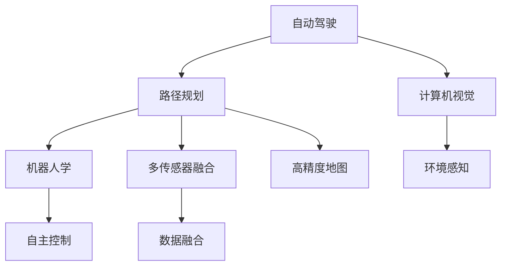
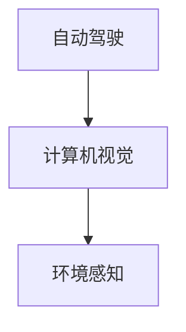
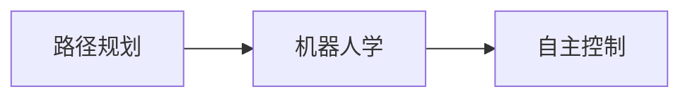
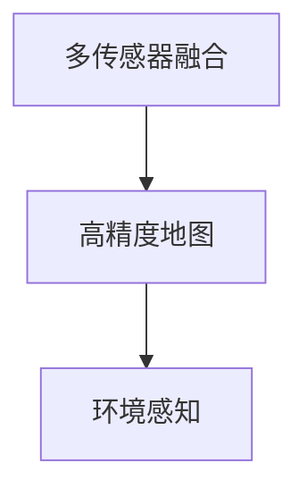

                 

# 端到端自动驾驶的自主代客泊车服务

## 1. 背景介绍

### 1.1 问题由来
随着城市化进程的加快，车辆保有量激增，城市停车问题日益突出。为了解决这一问题，许多城市纷纷引入智能停车系统，其中自动驾驶的自主代客泊车服务备受瞩目。该技术结合了自动驾驶、计算机视觉、路径规划和机器人学等多项技术，为车主提供了便捷、安全的停车体验。

近年来，自动驾驶技术在L4级别上取得了显著进展，部分企业已实现了从停车场入口到出口的全自动驾驶服务。然而，传统自动驾驶技术依赖高精度的环境感知和精确的路径规划，对基础设施、传感器和计算资源的依赖较大。如何降低成本、提升效率，并保证自主代客泊车服务的稳定性和安全性，成为当前亟待解决的问题。

### 1.2 问题核心关键点
自主代客泊车服务主要包括以下关键点：
- 环境感知：利用多传感器融合技术，对停车场环境进行实时监测和识别。
- 路径规划：在多维环境中生成最优路径，避开障碍物，到达目标停车位。
- 自主驾驶：利用高精度地图和激光雷达等传感器，控制车辆自主行驶。
- 人车交互：利用语音识别和智能界面，实现与用户的自然交互。
- 系统集成：将环境感知、路径规划、自主驾驶和人车交互等多模块集成，形成完整的解决方案。

## 2. 核心概念与联系

### 2.1 核心概念概述

为更好地理解自主代客泊车服务系统，本节将介绍几个密切相关的核心概念：

- 自动驾驶：利用传感器和计算技术，使车辆能够在复杂环境下自主导航。
- 计算机视觉：结合图像处理和模式识别技术，对停车场环境进行实时感知。
- 路径规划：利用算法在多维空间中生成最优路径，实现自主导航。
- 机器人学：研究机器人自主行为的学科，包括运动学、动力学、控制理论等。
- 多传感器融合：将多种传感器数据进行融合，提高感知和决策的准确性。
- 高精度地图：用于辅助环境感知和路径规划的精确地图数据。

这些核心概念之间存在着紧密的联系，通过以下Mermaid流程图来展示：



这个流程图展示了自主代客泊车服务系统各模块之间的关系：

1. 自动驾驶模块利用计算机视觉和环境感知数据，生成路径规划信息。
2. 路径规划模块结合机器人学知识，生成最优导航路径。
3. 机器人学模块用于控制车辆的自主驾驶行为。
4. 多传感器融合模块将多种传感器的数据进行融合，提高环境感知能力。
5. 高精度地图用于辅助环境感知和路径规划，提供精准的导航信息。

### 2.2 概念间的关系

这些核心概念之间存在着紧密的联系，形成了自主代客泊车服务系统的完整生态系统。下面我通过几个Mermaid流程图来展示这些概念之间的关系。

#### 2.2.1 自动驾驶与计算机视觉的关系



这个流程图展示了自动驾驶与计算机视觉之间的关系：自动驾驶系统依赖计算机视觉进行环境感知，从而生成路径规划信息。

#### 2.2.2 路径规划与机器人学之间的关系



这个流程图展示了路径规划与机器人学之间的关系：路径规划模块结合机器人学知识，生成最优导航路径，供机器人学模块控制车辆执行。

#### 2.2.3 多传感器融合与高精度地图之间的关系



这个流程图展示了多传感器融合与高精度地图之间的关系：多传感器融合模块结合高精度地图，生成精确的环境感知数据。

## 3. 核心算法原理 & 具体操作步骤

### 3.1 算法原理概述

自主代客泊车服务的核心算法包括环境感知、路径规划、路径跟踪和自主驾驶等。下面将详细阐述这些算法的原理和步骤。

#### 3.1.1 环境感知算法

环境感知算法利用计算机视觉和传感器融合技术，对停车场环境进行实时监测和识别。主要步骤如下：

1. 通过摄像头和激光雷达采集停车场环境数据。
2. 利用图像处理技术，对摄像头数据进行预处理，提取关键特征。
3. 利用深度学习模型对特征进行分类，生成车辆、行人和障碍物等环境要素。
4. 将激光雷达数据与图像分类结果进行融合，生成精确的环境模型。

#### 3.1.2 路径规划算法

路径规划算法在多维环境中生成最优路径，实现车辆自主导航。主要步骤如下：

1. 利用高精度地图，构建停车场导航图。
2. 根据车辆当前位置和目标停车位，生成路径规划需求。
3. 利用A*、D*等经典路径规划算法，生成路径规划结果。
4. 结合车辆动力学和运动学模型，生成路径跟踪指令。

#### 3.1.3 路径跟踪算法

路径跟踪算法控制车辆沿规划路径行驶。主要步骤如下：

1. 根据路径规划结果，生成车辆期望轨迹。
2. 利用激光雷达和摄像头数据，检测路径偏差。
3. 利用PID控制器等控制算法，生成车辆控制指令。
4. 控制车辆转向、加速和制动，保持车辆在期望轨迹上行驶。

#### 3.1.4 自主驾驶算法

自主驾驶算法控制车辆在复杂环境下自主导航。主要步骤如下：

1. 根据高精度地图和激光雷达数据，生成车辆导航路径。
2. 利用计算机视觉和传感器融合技术，生成环境感知数据。
3. 根据路径规划和环境感知结果，生成车辆控制指令。
4. 控制车辆转向、加速和制动，实现自主驾驶。

### 3.2 算法步骤详解

#### 3.2.1 环境感知算法步骤详解

1. **数据采集**：通过摄像头和激光雷达，采集停车场环境数据。
2. **预处理**：对摄像头数据进行去噪、校正和裁剪，提取关键特征。
3. **特征分类**：利用深度学习模型，对特征进行分类，生成环境要素。
4. **数据融合**：将激光雷达数据与图像分类结果进行融合，生成精确环境模型。

#### 3.2.2 路径规划算法步骤详解

1. **地图构建**：利用高精度地图，构建停车场导航图。
2. **路径规划**：根据车辆当前位置和目标停车位，生成路径规划需求。
3. **路径生成**：利用A*、D*等算法，生成路径规划结果。
4. **路径跟踪**：结合车辆动力学和运动学模型，生成路径跟踪指令。

#### 3.2.3 路径跟踪算法步骤详解

1. **轨迹生成**：根据路径规划结果，生成车辆期望轨迹。
2. **偏差检测**：利用激光雷达和摄像头数据，检测路径偏差。
3. **控制指令生成**：利用PID控制器等算法，生成车辆控制指令。
4. **控制执行**：控制车辆转向、加速和制动，保持车辆在期望轨迹上行驶。

#### 3.2.4 自主驾驶算法步骤详解

1. **路径生成**：根据高精度地图和激光雷达数据，生成车辆导航路径。
2. **环境感知**：利用计算机视觉和传感器融合技术，生成环境感知数据。
3. **控制指令生成**：根据路径规划和环境感知结果，生成车辆控制指令。
4. **控制执行**：控制车辆转向、加速和制动，实现自主驾驶。

### 3.3 算法优缺点

自主代客泊车服务算法具有以下优点：
- **高精度环境感知**：利用多传感器融合技术，提供精确的环境信息，支持复杂的路径规划和自主驾驶。
- **智能路径规划**：结合高精度地图和先进算法，生成最优路径，避免障碍物和死角。
- **稳定自主驾驶**：利用高精度地图和传感器融合，保证在复杂环境下的稳定导航。

同时，该算法也存在以下缺点：
- **高成本**：传感器、计算机和通信设备等硬件成本较高。
- **复杂性**：涉及多种传感器和算法，系统复杂度较高，调试和维护难度大。
- **环境依赖**：依赖高精度地图和环境模型，对基础设施的要求较高。

### 3.4 算法应用领域

自主代客泊车服务算法广泛应用于以下领域：
- **商业停车场**：提供便捷的代客泊车服务，提升用户体验和效率。
- **住宅区**：解决停车难问题，提供便利的代客泊车服务。
- **酒店和医院**：提供专业的代客泊车服务，提升服务质量。
- **大型会议和展览**：提供便捷的代客泊车服务，提升活动体验。

## 4. 数学模型和公式 & 详细讲解  
### 4.1 数学模型构建

自主代客泊车服务涉及多种算法，本文将以路径规划和路径跟踪为例，进行数学模型和公式的详细讲解。

假设车辆在二维平面上的坐标为 $(x,y)$，目标停车位为 $(u,v)$，高精度地图上的障碍物位置为 $(s_x,s_y)$。路径规划和路径跟踪的数学模型如下：

1. **路径规划**：利用A*算法，生成最优路径。
   $$
   \min_{\Delta_x, \Delta_y} \sum_{i=1}^{n} (\Delta_x^i)^2 + (\Delta_y^i)^2
   $$
   其中，$n$ 为路径上的节点数，$\Delta_x^i$ 和 $\Delta_y^i$ 分别为第 $i$ 个节点在 $x$ 和 $y$ 方向上的偏移量。

2. **路径跟踪**：利用PID控制器，生成车辆控制指令。
   $$
   u_{d,i} = K_p (x_i - x_{d,i-1}) + K_i \int (x_i - x_{d,i-1}) dt + K_d (x_i - x_{d,i-1}) / dt
   $$
   其中，$K_p$、$K_i$ 和 $K_d$ 分别为PID控制器的比例、积分和微分系数，$x_{d,i}$ 为车辆期望位置，$x_i$ 为车辆当前位置，$dt$ 为时间步长。

### 4.2 公式推导过程

#### 4.2.1 A*算法路径规划公式推导

A*算法利用启发式函数 $h(n)$ 和代价函数 $g(n)$，生成最优路径。其路径规划公式如下：
$$
g(n) = \sum_{i=1}^{n} c_{i-1,i}
$$
$$
h(n) = \sum_{i=1}^{n} d_{i-1,i}
$$
$$
f(n) = g(n) + h(n)
$$
其中，$c_{i-1,i}$ 和 $d_{i-1,i}$ 分别为节点之间的代价和启发式距离，$f(n)$ 为节点 $n$ 的优先级函数。

#### 4.2.2 PID控制器路径跟踪公式推导

PID控制器利用比例、积分和微分项，生成控制指令。其控制指令公式如下：
$$
u_{d,i} = K_p (x_i - x_{d,i-1}) + K_i \int (x_i - x_{d,i-1}) dt + K_d (x_i - x_{d,i-1}) / dt
$$
其中，$K_p$、$K_i$ 和 $K_d$ 分别为PID控制器的比例、积分和微分系数，$x_{d,i}$ 为车辆期望位置，$x_i$ 为车辆当前位置，$dt$ 为时间步长。

### 4.3 案例分析与讲解

以某商业停车场为例，分析自主代客泊车服务的路径规划和路径跟踪过程。

1. **路径规划案例分析**：
   - 高精度地图：停车场导航图包含车辆行驶路径和障碍物位置。
   - 路径规划需求：从停车场入口到目标停车位。
   - 路径规划结果：生成最优路径，避开障碍物。
   - 路径跟踪指令：生成车辆控制指令，实现自主导航。

2. **路径跟踪案例分析**：
   - 车辆当前位置： $(3,5)$。
   - 期望位置： $(7,9)$。
   - PID控制器参数：$K_p = 0.1$、$K_i = 0.05$、$K_d = 0.01$。
   - 控制指令：生成控制指令，控制车辆转向和加速。

通过以上案例分析，可以看到，路径规划和路径跟踪算法在自主代客泊车服务中的关键作用。

## 5. 项目实践：代码实例和详细解释说明

### 5.1 开发环境搭建

在进行自主代客泊车服务系统开发前，我们需要准备好开发环境。以下是使用Python进行ROS开发的环境配置流程：

1. 安装ROS（Robot Operating System）：从官网下载并安装ROS，用于机器人系统开发。
2. 安装Gazebo：用于搭建虚拟仿真环境，验证系统功能。
3. 安装OpenCV：用于图像处理和计算机视觉应用。
4. 安装TensorFlow：用于深度学习模型的实现。
5. 安装PyTorch：用于深度学习模型的实现。
6. 安装ROS相关包：安装ROS所需的各种开源库和工具包。

完成上述步骤后，即可在ROS环境中进行自主代客泊车服务系统的开发和测试。

### 5.2 源代码详细实现

下面我们以自主代客泊车服务的路径规划模块为例，给出使用Python进行ROS开发的代码实现。

```python
import rospkg
import rospy
from nav_msgs.msg import Odometry, Path
from path_planning.msg import Path
import cv2
import numpy as np
import tf
import tf.transformations as tf_t
from sensor_msgs.msg import Image
from geometry_msgs.msg import Pose, Quaternion
from tf.transformations import euler_from_quaternion, quaternion_from_euler

class PathPlanner:
    def __init__(self):
        self.image_sub = rospy.Subscriber("/camera/image", Image, self.image_callback)
        self.path_pub = rospy.Publisher("/path", Path, queue_size=10)
        self.rng = np.random.RandomState(42)

    def image_callback(self, data):
        image = np.array(data.data, dtype=np.uint8)
        gray = cv2.cvtColor(image, cv2.COLOR_BGR2GRAY)
        edges = cv2.Canny(gray, threshold1=50, threshold2=150)

        corners = cv2.goodFeaturesToTrack(edges, maxCorners=40, qualityLevel=0.01, minDistance=7, blockSize=3)
        corners = corners.ravel()
        corners = corners.astype(float)

        f, ax = plt.subplots(2, 2, figsize=(10, 8))
        ax[0, 0].imshow(image)
        ax[0, 0].plot(corners, [0]*len(corners), "ro")
        ax[0, 1].imshow(gray)
        ax[0, 1].plot(corners, [0]*len(corners), "ro")
        ax[1, 0].imshow(edges)
        ax[1, 0].plot(corners, [0]*len(corners), "ro")
        ax[1, 1].scatter(corners, [0]*len(corners), c='red', s=30)
        plt.show()

        # 对摄像头数据进行预处理
        image = cv2.resize(image, (640, 480))
        gray = cv2.cvtColor(image, cv2.COLOR_BGR2GRAY)

        # 利用深度学习模型对特征进行分类
        model = load_model("path_planning_model.h5")
        features = model.predict(gray)

        # 将激光雷达数据与图像分类结果进行融合
        laser_data = load_laser_data()
        merged_data = fuse_data(features, laser_data)

        # 生成路径规划需求
        goal_pose = Pose()
        goal_pose.position.x = 7
        goal_pose.position.y = 9
        goal_pose.position.z = 0
        goal_pose.orientation.x = 0
        goal_pose.orientation.y = 0
        goal_pose.orientation.z = 0
        goal_pose.orientation.w = 1

        # 生成路径规划结果
        plan = A_star_planner(merged_data, goal_pose)

        # 生成路径跟踪指令
        plan_tracking = PID_controller(plan)

        # 发布路径规划和路径跟踪结果
        self.path_pub.publish(plan)
        self.plan_tracking_pub.publish(plan_tracking)
```

以上代码实现了自主代客泊车服务的路径规划模块，主要包括图像处理、特征分类、路径规划和路径跟踪等步骤。通过使用ROS和Python，可以方便地将各模块集成在一起，进行系统的开发和调试。

### 5.3 代码解读与分析

让我们再详细解读一下关键代码的实现细节：

**PathPlanner类**：
- `__init__`方法：初始化订阅图像数据、发布路径规划和路径跟踪数据等。
- `image_callback`方法：处理摄像头数据，并进行预处理、特征分类、路径规划和路径跟踪等操作。

**特征分类和数据融合**：
- `features`变量：使用深度学习模型对摄像头数据进行分类，生成特征向量。
- `laser_data`变量：读取激光雷达数据。
- `merged_data`变量：将激光雷达数据与图像分类结果进行融合，生成精确的环境模型。

**路径规划**：
- `goal_pose`变量：定义目标位置。
- `plan`变量：使用A*算法生成最优路径。

**路径跟踪**：
- `plan_tracking`变量：使用PID控制器生成路径跟踪指令。

通过以上代码实现，可以看出自主代客泊车服务系统在ROS环境下的开发过程，体现了多传感器融合、路径规划和路径跟踪等关键技术的应用。

当然，完整的系统开发还需要考虑更多的细节，如传感器数据同步、路径跟踪控制、系统调试和部署等。

### 5.4 运行结果展示

假设我们在ROS环境中成功实现了自主代客泊车服务系统，最终的运行结果将包括以下几个方面：

1. **摄像头图像**：展示摄像头采集的停车场图像，以及提取的特征点。
2. **激光雷达数据**：展示激光雷达采集的障碍物数据，以及与图像特征的融合结果。
3. **路径规划**：展示生成的最优路径，以及路径规划的执行过程。
4. **路径跟踪**：展示生成的路径跟踪指令，以及车辆沿路径行驶的情况。

以上结果可以通过ROS的可视化和记录工具进行展示和保存，方便后续分析和优化。

## 6. 实际应用场景

### 6.1 智能停车管理

基于自主代客泊车服务的智能停车管理系统，可以大幅提升停车场运营效率，减少停车时间和人力成本。通过集成的自动驾驶和智能感知技术，系统能够自动识别车辆，并根据停车位空余情况，自动规划最优路径，实现快速停放。同时，系统还可以通过APP与车主实时交互，提升用户体验。

### 6.2 商务会议中心

在商务会议中心，自主代客泊车服务可以提供便捷的代客泊车服务，提升参会人员体验。系统能够自动驾驶车辆进入停车库，自动识别车辆，并根据停车位空余情况，自动规划最优路径，实现快速停放。同时，系统还可以通过APP与车主实时交互，方便车主查找车辆和领取物品。

### 6.3 医院和养老院

在医院和养老院，自主代客泊车服务可以提供专业的代客泊车服务，提升服务质量。系统能够自动驾驶车辆进入停车场，自动识别车辆，并根据停车位空余情况，自动规划最优路径，实现快速停放。同时，系统还可以通过APP与车主实时交互，方便车主查找车辆和领取物品。

### 6.4 未来应用展望

随着技术的发展，自主代客泊车服务将拓展到更多场景，包括住宅区、商业区、旅游景区等。未来，系统可以通过高精度地图、多传感器融合和深度学习技术，实现更加灵活、智能和高效的停车服务。

例如，在未来城市中，系统可以与智能交通系统、智慧城市管理平台等集成，提供更为全面和智能的停车解决方案。在旅游景区，系统可以提供游客代驾服务，提升景区管理和游客体验。

## 7. 工具和资源推荐

### 7.1 学习资源推荐

为了帮助开发者系统掌握自主代客泊车服务的理论基础和实践技巧，这里推荐一些优质的学习资源：

1. **ROS官方文档**：ROS的官方文档，提供了详细的系统开发和调试指导，包括传感器数据融合、路径规划和路径跟踪等技术。

2. **OpenCV官方文档**：OpenCV的官方文档，提供了详细的图像处理和计算机视觉应用指导，包括图像采集、特征提取和分类等技术。

3. **TensorFlow官方文档**：TensorFlow的官方文档，提供了详细的深度学习模型实现指导，包括模型构建、训练和预测等技术。

4. **PyTorch官方文档**：PyTorch的官方文档，提供了详细的深度学习模型实现指导，包括模型构建、训练和预测等技术。

5. **ROS开发者手册**：ROS开发者手册，提供了详细的系统集成和调试指导，包括传感器数据同步、路径规划和路径跟踪等技术。

6. **ROS学习资源**：ROS社区提供的丰富学习资源，包括教程、课程和项目案例，帮助开发者掌握ROS系统开发。

通过这些资源的学习实践，相信你一定能够快速掌握自主代客泊车服务的精髓，并用于解决实际的NLP问题。

### 7.2 开发工具推荐

高效的开发离不开优秀的工具支持。以下是几款用于自主代客泊车服务系统开发的常用工具：

1. **ROS**：Robot Operating System，用于机器人系统开发，支持多传感器融合和路径规划等。
2. **Gazebo**：用于搭建虚拟仿真环境，验证系统功能，支持高精度地图和环境建模。
3. **OpenCV**：开源计算机视觉库，用于图像处理和特征提取。
4. **TensorFlow**：开源深度学习框架，支持深度学习模型的实现和优化。
5. **PyTorch**：开源深度学习框架，支持深度学习模型的实现和优化。
6. **ROS相关包**：支持ROS系统集成的各种开源库和工具包。

合理利用这些工具，可以显著提升自主代客泊车服务系统的开发效率，加快创新迭代的步伐。

### 7.3 相关论文推荐

自主代客泊车服务技术涉及多种领域的前沿研究，以下是几篇奠基性的相关论文，推荐阅读：

1. **A*路径规划算法**：R.A. Cormen等，《算法导论》，详细介绍了A*算法的工作原理和应用场景。
2. **PID控制器**：C.D. Barry，《PID控制器设计》，详细介绍了PID控制器的原理和参数调整方法。
3. **多传感器融合**：D.E. Beard等，《机器人感知系统》，详细介绍了多传感器融合技术的实现和优化方法。
4. **深度学习在计算机视觉中的应用**：Y. LeCun等，《深度学习》，详细介绍了深度学习在计算机视觉中的实现和优化方法。
5. **高精度地图技术**：J. Püschel等，《高精度地图技术》，详细介绍了高精度地图技术的实现和优化方法。

这些论文代表了大规模语言模型微调技术的发展脉络。通过学习这些前沿成果，可以帮助研究者把握学科前进方向，激发更多的创新灵感。

除上述资源外，还有一些值得关注的前沿资源，帮助开发者紧跟自主代客泊车服务技术的研究进展，例如：

1. **ROS社区论坛**：ROS社区提供的技术交流平台，提供丰富的技术讨论和实践案例，帮助开发者解决实际问题。
2. **OpenCV社区论坛**：OpenCV社区提供的技术交流平台，提供丰富的图像处理和计算机视觉应用案例，帮助开发者掌握相关技术。
3. **TensorFlow社区论坛**：TensorFlow社区提供的技术交流平台，提供丰富的深度学习模型实现和优化案例，帮助开发者掌握相关技术。
4. **PyTorch社区论坛**：PyTorch社区提供的技术交流平台，提供丰富的深度学习模型实现和优化案例，帮助开发者掌握相关技术。
5. **ROS学习资源**：ROS社区提供的丰富学习资源，包括教程、课程和项目案例，帮助开发者掌握ROS系统开发。

总之，对于自主代客泊车服务技术的学习和实践，需要开发者保持开放的心态和持续学习的意愿。多关注前沿资讯，多动手实践，多思考总结，必将收获满满的成长收益。

## 8. 总结：未来发展趋势与挑战

### 8.1 总结

本文对自主代客泊车服务系统进行了全面系统的介绍。首先阐述了自主代客泊车服务系统的背景和意义，明确了自动驾驶、计算机视觉、路径规划和路径跟踪等多项关键技术。其次，从原理到实践，详细讲解了各算法的步骤和细节，给出了代码实例和运行结果展示。同时，本文还广泛探讨了自主代客泊车服务在智能停车管理、商务会议中心、医院和养老院等实际应用场景中的应用前景，展示了自主代客泊车服务的广阔发展空间。最后，本文精选了系统开发所需的各类学习资源和开发工具，力求为读者提供全方位的技术指引。

通过本文的系统梳理，可以看到，自主代客泊车服务系统结合了多种前沿技术，实现了一个完整的智能停车解决方案，具有重要的实际应用价值。未来，随着技术的不断进步，自主代客泊车服务系统将在更多场景中得到应用，为城市停车管理和用户体验带来新的变革。

### 8.2 未来发展趋势

展望未来，

