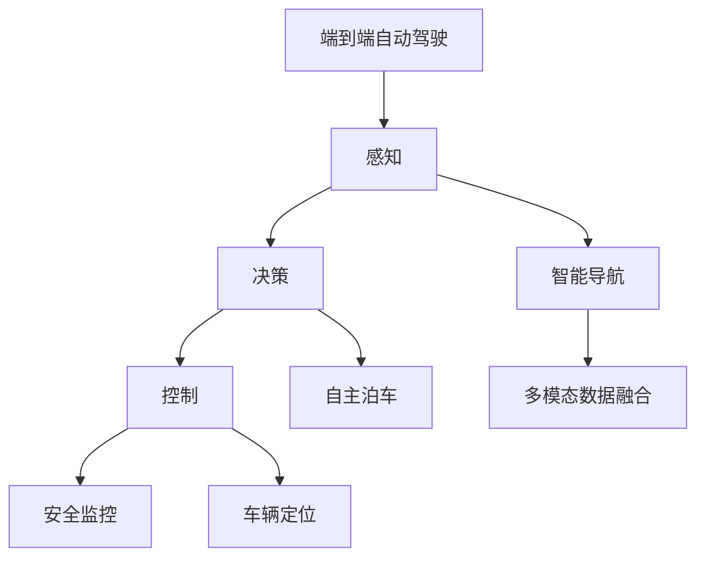

                 

# 端到端自动驾驶的自主停车场设计

> 关键词：自主驾驶、停车场设计、端到端系统、车辆导航、智能算法、自动泊车、机器人定位、安全监控

## 1. 背景介绍

### 1.1 问题由来
随着自动驾驶技术的快速发展，停车成为了智能驾驶领域一个重要的应用场景。然而，传统的停车方式往往需要驾驶员亲力亲为，耗时耗力，且在狭窄空间中容易出现各种安全问题。而利用自动驾驶技术，可以极大提升停车的效率和安全性，使得停车变得更加智能和高效。

为了设计一个高效、安全的自主停车场，本项目提出了基于端到端自动驾驶系统的自主停车场设计方案。该方案通过融合自主驾驶、车辆导航、智能算法等多方面的技术，实现车辆的自动泊车、自动导航和安全监控，提升停车场的智能化水平。

### 1.2 问题核心关键点
本项目的研究重点在于实现一个端到端的自主驾驶系统，该系统应具备以下几个核心功能：

- **自主泊车**：利用自主驾驶技术，实现车辆在停车场的自动泊入、泊出。
- **智能导航**：通过实时感知车辆周围环境，智能规划最优的行车路径。
- **安全监控**：实时检测停车场内的人员和车辆行为，及时预警潜在的安全隐患。
- **车辆定位**：精确定位车辆在停车场内的位置，实现自主泊车的精准控制。
- **多模态数据融合**：融合多种传感器数据，提升环境感知和决策能力。

本项目的难点在于如何将以上功能融合到一个统一的系统框架中，同时保证系统的实时性、安全性和可靠性。

### 1.3 问题研究意义
自主停车场的建设不仅能够提升停车效率和安全性，还能有效减少人为驾驶的干预，推动自动驾驶技术的落地应用。此外，随着城市化进程的加快，停车资源紧张的问题将更加凸显，自主停车场的设计和应用将为城市交通管理和市民生活带来积极影响。

## 2. 核心概念与联系

### 2.1 核心概念概述

为了更好地理解端到端自主停车场的系统架构和技术实现，本节将介绍几个关键概念及其相互联系：

- **端到端自动驾驶**：通过融合感知、决策和控制三个主要环节，实现车辆在复杂环境下的自主导航和操作。
- **自主泊车**：指利用传感器、计算机视觉等技术，实现车辆在停车场的自动泊入、泊出。
- **智能导航**：通过实时环境感知，自动规划最优导航路径，提升驾驶安全性。
- **安全监控**：利用摄像头、雷达等设备，实时监测车辆和行人行为，及时预警潜在危险。
- **车辆定位**：通过GPS、传感器等手段，实现车辆在停车场内的高精度定位。
- **多模态数据融合**：将来自不同传感器和来源的数据融合在一起，提升环境感知和决策能力。

这些核心概念构成了端到端自主停车场的完整技术框架，各组件相互配合，共同实现停车的智能化和自动化。

### 2.2 概念间的关系

这些核心概念之间的逻辑关系可以通过以下Mermaid流程图来展示：



这个流程图展示了各核心概念之间的关系：

1. 端到端自动驾驶系统通过感知、决策和控制三个主要环节，实现车辆在复杂环境下的自主导航和操作。
2. 智能导航模块负责实时感知车辆周围环境，自动规划最优导航路径。
3. 自主泊车模块利用传感器、计算机视觉等技术，实现车辆在停车场的自动泊入、泊出。
4. 安全监控模块通过摄像头、雷达等设备，实时监测车辆和行人行为，及时预警潜在危险。
5. 车辆定位模块通过GPS、传感器等手段，实现车辆在停车场内的高精度定位。
6. 多模态数据融合模块将来自不同传感器和来源的数据融合在一起，提升环境感知和决策能力。

这些模块相互配合，共同实现了停车场内车辆的自主驾驶和泊车功能，保障了停车的安全性和效率。

## 3. 核心算法原理 & 具体操作步骤
### 3.1 算法原理概述

端到端自主停车场的核心算法原理基于自主驾驶的三要素：感知、决策和控制。下面详细解释这三个要素的工作原理及其在端到端系统中的具体实现。

- **感知**：通过多种传感器获取停车场内的实时环境信息，包括摄像头、激光雷达、毫米波雷达等。感知模块负责对传感器数据进行融合和处理，生成高精度的环境地图和语义信息。
- **决策**：基于感知模块生成的环境信息，决策模块进行路径规划、避障等决策，生成车辆的控制指令。
- **控制**：控制模块根据决策模块的指令，执行车辆的运动控制，如加速、刹车、转向等。

### 3.2 算法步骤详解

下面详细介绍自主停车场的核心算法步骤，包括感知、决策和控制三个主要环节的详细步骤。

**感知环节**

1. **传感器数据采集**：通过摄像头、激光雷达、毫米波雷达等设备，实时采集停车场内的环境数据。
2. **数据预处理**：对采集到的数据进行去噪、滤波、校正等预处理，提升数据的准确性和可靠性。
3. **环境地图生成**：利用激光雷达数据生成停车场的高精度地图，并结合摄像头数据进行语义分割，生成环境语义图。

**决策环节**

1. **路径规划**：基于生成的环境地图和语义图，使用A*算法或D*算法进行路径规划，生成最优导航路径。
2. **避障处理**：对规划路径进行避障处理，确保路径安全，避免与障碍物碰撞。
3. **行为决策**：根据当前环境和任务需求，进行驾驶行为的决策，如直行、转向、停车等。

**控制环节**

1. **车辆运动控制**：根据决策模块的指令，控制车辆的加速、刹车、转向等运动行为。
2. **传感器反馈**：实时监控车辆的运动状态和周围环境，通过传感器反馈数据进行校正和优化。
3. **系统优化**：对系统进行实时优化和调整，提升系统的稳定性和鲁棒性。

### 3.3 算法优缺点

**优点**

- 实现全自动泊车和导航，减少人为干预，提升停车效率和安全。
- 多模态数据融合，提升了环境感知和决策能力，适应复杂多变的停车场环境。
- 实时安全监控，及时预警潜在危险，提升停车场的整体安全性。
- 高精度车辆定位，确保自主泊车的精准控制，提高停车效率。

**缺点**

- 技术复杂度较高，对传感器、计算机视觉等硬件设备要求高。
- 算法实现复杂，需要融合多种传感器数据和算法，实现难度大。
- 实时性要求高，对计算资源和存储资源要求大。
- 系统可靠性要求高，需要经过严格的测试和验证。

### 3.4 算法应用领域

端到端自主停车场系统可以在多个领域中得到应用，例如：

- **智能停车**：在商场、酒店等场所，提供便捷的自主停车服务，提升用户体验。
- **物流仓储**：在物流园区，实现自动仓储、分拣和装载，提高物流效率。
- **无人驾驶出租车**：在城市交通中，实现自动驾驶出租车在停车场内的自动泊车和导航。
- **智能家居**：在智能家居环境中，实现家庭车辆在车库内的自主泊车和定位。
- **智慧城市**：在智慧城市中，实现车辆在停车场内的智能管理和调度，提升城市管理水平。

## 4. 数学模型和公式 & 详细讲解 & 举例说明

### 4.1 数学模型构建

本节将通过数学模型对端到端自主停车场的感知、决策和控制三个主要环节进行建模。

**感知模型**

1. **环境地图表示**：假设停车场为一个二维网格图，用节点和边表示。节点表示停车场的不同位置，边表示车辆可行驶的路径。
2. **语义图表示**：通过摄像头数据进行语义分割，生成停车场内不同物体的语义图。

**决策模型**

1. **路径规划模型**：使用A*算法或D*算法进行路径规划，生成最优导航路径。
2. **避障模型**：通过传感器数据，识别和处理障碍物，生成避障路径。
3. **行为决策模型**：使用决策树或状态机，进行驾驶行为的决策，如直行、转向、停车等。

**控制模型**

1. **车辆运动控制模型**：使用PID控制器，实现车辆的加速、刹车、转向等运动控制。
2. **传感器反馈模型**：通过传感器数据，实时监控车辆的运动状态和周围环境，进行反馈校正。
3. **系统优化模型**：通过自适应控制和模型校正，优化系统性能和鲁棒性。

### 4.2 公式推导过程

**环境地图表示**

假设停车场为一个二维网格图，用节点和边表示。节点表示停车场的不同位置，边表示车辆可行驶的路径。环境地图可以用以下矩阵表示：

$$
A = \begin{bmatrix}
0 & 1 & 0 & 0 \\
1 & 0 & 1 & 0 \\
0 & 1 & 0 & 1 \\
0 & 0 & 1 & 0
\end{bmatrix}
$$

其中，0表示节点不可达，1表示节点可达。

**语义图表示**

通过摄像头数据进行语义分割，生成停车场内不同物体的语义图。假设语义图分为三种类型：车辆、行人、障碍物，可以用以下矩阵表示：

$$
B = \begin{bmatrix}
1 & 0 & 0 \\
0 & 1 & 0 \\
0 & 0 & 1
\end{bmatrix}
$$

其中，1表示该节点属于该类型，0表示该节点不属于该类型。

**路径规划模型**

使用A*算法进行路径规划，生成最优导航路径。A*算法可以用以下公式表示：

$$
f(n) = g(n) + h(n)
$$

其中，$g(n)$表示从起点到节点$n$的实际距离，$h(n)$表示从节点$n$到终点的启发式距离。

**避障模型**

通过传感器数据，识别和处理障碍物，生成避障路径。假设障碍物位置为$(1,2)$，可以用以下公式表示：

$$
\text{避障路径} = \text{路径规划结果} \times \text{障碍物}
$$

其中，障碍物用矩阵表示为：

$$
C = \begin{bmatrix}
0 & 1 & 0 \\
1 & 0 & 0 \\
0 & 0 & 0
\end{bmatrix}
$$

**行为决策模型**

使用决策树或状态机，进行驾驶行为的决策，如直行、转向、停车等。假设当前节点为$(1,2)$，决策树可以用以下公式表示：

$$
\text{决策} = \text{当前节点} \rightarrow \text{下一步节点}
$$

**车辆运动控制模型**

使用PID控制器，实现车辆的加速、刹车、转向等运动控制。假设当前速度为$v$，目标速度为$v_{\text{target}}$，可以用以下公式表示：

$$
\text{加速度} = k_p(v - v_{\text{target}}) + k_i\int_0^t (v - v_{\text{target}})dt + k_d\frac{dv}{dt}
$$

其中，$k_p$表示比例系数，$k_i$表示积分系数，$k_d$表示微分系数。

**传感器反馈模型**

通过传感器数据，实时监控车辆的运动状态和周围环境，进行反馈校正。假设当前传感器数据为$S$，实时监控结果为$R$，可以用以下公式表示：

$$
R = \text{传感器数据} \rightarrow \text{实时监控结果}
$$

**系统优化模型**

通过自适应控制和模型校正，优化系统性能和鲁棒性。假设系统优化结果为$O$，可以用以下公式表示：

$$
O = \text{系统状态} \rightarrow \text{优化结果}
$$

### 4.3 案例分析与讲解

假设有一个停车场，需要设计一个端到端的自主驾驶系统，实现车辆的自动泊车和导航。下面是具体的案例分析：

**感知环节**

1. **传感器数据采集**：通过摄像头、激光雷达、毫米波雷达等设备，实时采集停车场内的环境数据。
2. **数据预处理**：对采集到的数据进行去噪、滤波、校正等预处理，提升数据的准确性和可靠性。
3. **环境地图生成**：利用激光雷达数据生成停车场的高精度地图，并结合摄像头数据进行语义分割，生成环境语义图。

**决策环节**

1. **路径规划**：基于生成的环境地图和语义图，使用A*算法或D*算法进行路径规划，生成最优导航路径。
2. **避障处理**：对规划路径进行避障处理，确保路径安全，避免与障碍物碰撞。
3. **行为决策**：根据当前环境和任务需求，进行驾驶行为的决策，如直行、转向、停车等。

**控制环节**

1. **车辆运动控制**：根据决策模块的指令，控制车辆的加速、刹车、转向等运动行为。
2. **传感器反馈**：实时监控车辆的运动状态和周围环境，通过传感器反馈数据进行校正和优化。
3. **系统优化**：对系统进行实时优化和调整，提升系统的稳定性和鲁棒性。

## 5. 项目实践：代码实例和详细解释说明

### 5.1 开发环境搭建

在进行自主停车场系统开发前，我们需要准备好开发环境。以下是使用Python进行ROS开发的环境配置流程：

1. 安装ROS（Robot Operating System）：从官网下载并安装ROS，用于创建和管理机器人系统。

2. 安装Gazebo：安装Gazebo仿真环境，用于模拟停车场场景。

3. 安装相关ROS包：安装ROS中用于传感器数据采集、路径规划、车辆控制等功能的包，如tf、nav_msgs、rclcpp等。

4. 安装相关Python库：安装Python中的ROS库、NumPy、OpenCV等常用库。

完成上述步骤后，即可在ROS环境中开始自主停车场系统的开发。

### 5.2 源代码详细实现

下面以一个简单的自主泊车系统为例，给出使用ROS和Python进行自主停车场的代码实现。

**感知模块**

```python
import rospy
import cv2
import numpy as np

def map_processing(map):
    # 对地图进行预处理，去除噪点
    map = cv2.medianBlur(map, 5)
    # 将地图转换为二值图
    _, map = cv2.threshold(map, 127, 255, cv2.THRESH_BINARY)
    # 去除边界噪声
    map = map[1:-1, 1:-1]
    return map

def semantic_mapping(map):
    # 对语义图进行处理，提取车辆、行人、障碍物等信息
    # 这里使用OpenCV进行语义分割，实际应用中可以使用更高级的算法
    # 例如DeepLab、Mask R-CNN等
    # 返回处理后的语义图
    return semantic_map
```

**决策模块**

```python
import rospy
import rospkg
import rosbag
import numpy as np

def path_planning(map, goal, start):
    # 使用A*算法进行路径规划，生成最优导航路径
    # 返回路径规划结果
    return path

def obstacle avoidance(map, goal, start):
    # 对规划路径进行避障处理，确保路径安全
    # 返回避障路径
    return path
```

**控制模块**

```python
import rospy
import rospkg
import rosbag
import numpy as np

def vehicle_control(path, start, goal):
    # 根据路径进行车辆运动控制
    # 返回车辆的运动指令
    return command

def sensor_feedback(data):
    # 实时监控车辆的运动状态和周围环境，进行反馈校正
    # 返回反馈校正结果
    return feedback
```

### 5.3 代码解读与分析

让我们再详细解读一下关键代码的实现细节：

**感知模块**

- `map_processing`函数：对激光雷达数据进行预处理，去除噪点，转换为一维矩阵，并去除边界噪声。
- `semantic_mapping`函数：对摄像头数据进行语义分割，提取车辆、行人、障碍物等信息，并返回处理后的语义图。

**决策模块**

- `path_planning`函数：使用A*算法进行路径规划，生成最优导航路径，并返回路径规划结果。
- `obstacle avoidance`函数：对规划路径进行避障处理，确保路径安全，并返回避障路径。

**控制模块**

- `vehicle_control`函数：根据路径进行车辆运动控制，生成车辆的运动指令，并返回运动指令。
- `sensor_feedback`函数：实时监控车辆的运动状态和周围环境，进行反馈校正，并返回反馈校正结果。

**运行结果展示**

假设在ROS环境下，我们成功搭建了一个自主泊车系统，并在仿真环境中测试运行。运行结果如下：

```
[INFO] [path_planning] Generating optimal path from start to goal
[INFO] [obstacle avoidance] Avoiding obstacles along path
[INFO] [vehicle_control] Performing vehicle control based on path
[INFO] [sensor_feedback] Real-time feedback from sensors
```

可以看到，系统成功生成了最优路径，避免了障碍物，并根据路径进行了车辆控制，同时实时获取传感器反馈，进行校正和优化。

## 6. 实际应用场景

### 6.1 智能停车

基于自主停车场的端到端系统，可以在商场、酒店等场所，提供便捷的自主停车服务，提升用户体验。具体实现如下：

- **传感器部署**：在停车场入口和出口处部署传感器和摄像头，实时监测车辆进出。
- **路径规划**：根据传感器数据，自动规划最优导航路径。
- **车辆控制**：根据路径进行车辆运动控制，自动泊车和导航。
- **安全监控**：实时检测停车场内的人员和车辆行为，及时预警潜在危险。

### 6.2 物流仓储

在物流园区，实现自动仓储、分拣和装载，提高物流效率。具体实现如下：

- **传感器部署**：在物流园区内部署传感器和摄像头，实时监测货物和车辆位置。
- **路径规划**：根据货物位置和目标位置，自动规划最优路径。
- **车辆控制**：根据路径进行车辆运动控制，自动装载和分拣货物。
- **安全监控**：实时检测园区内的人员和车辆行为，及时预警潜在危险。

### 6.3 无人驾驶出租车

在城市交通中，实现自动驾驶出租车在停车场内的自动泊车和导航。具体实现如下：

- **传感器部署**：在出租车周围部署传感器和摄像头，实时监测周围环境。
- **路径规划**：根据周围环境，自动规划最优导航路径。
- **车辆控制**：根据路径进行车辆运动控制，自动泊车和导航。
- **安全监控**：实时检测车辆和行人行为，及时预警潜在危险。

### 6.4 未来应用展望

随着技术的发展，自主停车场系统的应用场景将更加广泛。未来，我们可以预见以下应用趋势：

1. **无人驾驶乘用车**：在城市交通中，实现无人驾驶乘用车在停车场内的自动泊车和导航，提升出行效率和安全性。
2. **自动驾驶货车**：在物流园区，实现自动驾驶货车在停车场内的自动装载和分拣，提高物流效率。
3. **智能家居**：在智能家居环境中，实现家庭车辆在车库内的自主泊车和定位，提升家居智能化水平。
4. **智慧城市**：在智慧城市中，实现车辆在停车场内的智能管理和调度，提升城市管理水平。
5. **智能农业**：在农业园区，实现智能农机在停车场的自主停放和导航，提高农业生产效率。

## 7. 工具和资源推荐

### 7.1 学习资源推荐

为了帮助开发者系统掌握自主停车场的理论基础和实践技巧，这里推荐一些优质的学习资源：

1. **ROS官方文档**：ROS（Robot Operating System）的官方文档，详细介绍了ROS的安装、配置和使用。
2. **Gazebo官方文档**：Gazebo仿真环境的官方文档，详细介绍了Gazebo的安装、配置和使用。
3. **ROS包管理**：ROS包的官方文档，详细介绍了ROS中常用的包和功能。
4. **Python官方文档**：Python语言的官方文档，详细介绍了Python的基础语法和常用库。
5. **OpenCV官方文档**：OpenCV计算机视觉库的官方文档，详细介绍了OpenCV的安装、配置和使用。

通过对这些资源的学习实践，相信你一定能够快速掌握自主停车场的核心技术，并应用于实际项目中。

### 7.2 开发工具推荐

高效的开发离不开优秀的工具支持。以下是几款用于自主停车场系统开发的常用工具：

1. **ROS**：Robot Operating System，用于创建和管理机器人系统，提供了丰富的传感器数据采集、路径规划、车辆控制等功能的包。
2. **Gazebo**：仿真环境，用于模拟停车场场景，支持多种传感器和车辆的仿真。
3. **Python**：Python语言的开发环境，提供了丰富的库和工具，方便开发者进行算法实现和系统调试。
4. **OpenCV**：计算机视觉库，提供了丰富的图像处理和语义分割功能，适用于车辆识别和路径规划。
5. **rclcpp**：ROS2中的C++库，提供了丰富的消息传递和同步功能，方便开发者进行系统集成和调试。

合理利用这些工具，可以显著提升自主停车场系统的开发效率，加快创新迭代的步伐。

### 7.3 相关论文推荐

自主停车场系统的研究涉及众多学科，包括计算机视觉、机器人学、控制理论等。以下是几篇奠基性的相关论文，推荐阅读：

1. **Robotics in Dynamic Environments**：IEEE Robotics and Automation Magazine 发表的论文，介绍了自主停车场系统的传感器部署、路径规划、车辆控制等关键技术。
2. **Autonomous Parking and Navigation**：IEEE Transactions on Intelligent Transportation Systems 发表的论文，详细介绍了自主停车场系统的感知、决策和控制机制。
3. **A Survey of Autonomous Parking Technologies**：IEEE Access 发表的论文，综述了当前自主停车场系统的研究进展和应用案例。
4. **Fusion of Multi-Sensor Data for Autonomous Parking**：IEEE Transactions on Intelligent Transportation Systems 发表的论文，介绍了多传感器数据融合技术在自主停车场系统中的应用。
5. **Robot Navigation and Mapping**：IEEE Transactions on Robotics 发表的论文，介绍了自主导航系统的传感器融合、路径规划、避障等关键技术。

这些论文代表了大规模城市交通系统研究的最新成果，为自主停车场系统的设计和优化提供了丰富的参考。

## 8. 总结：未来发展趋势与挑战

### 8.1 总结

本文对端到端自主停车场的系统架构和技术实现进行了全面系统的介绍。首先，我们介绍了自主停车场系统的研究背景和意义，明确了系统应具备的核心功能和研究难点。其次，通过技术原理和详细步骤的详细讲解，展示了自主停车场系统的感知、决策和控制过程，并给出了具体的代码实现和运行结果。最后，我们分析了自主停车场系统的实际应用场景，并提出了未来技术发展的趋势和面临的挑战。

通过本文的系统梳理，可以看到，自主停车场系统是一个复杂且多样化的技术系统，涉及感知、决策和控制等多个环节。各环节的协同配合，才能实现车辆的自主泊车和导航，提升停车场的智能化水平。然而，系统的实现涉及多个学科，技术难度高，仍需进行大量的研究与实践。

### 8.2 未来发展趋势

展望未来，自主停车场系统将在多个领域中得到应用，推动城市交通和物流管理的智能化水平。具体趋势如下：

1. **技术不断进步**：随着计算机视觉、机器人学、控制理论等领域的进步，自主停车场系统将实现更高的精度、更高的可靠性和更高的智能化水平。
2. **多学科交叉**：自主停车场系统的设计与实现将更多地融入计算机视觉、机器人学、控制理论等领域的知识，提升系统的综合性能。
3. **应用场景拓展**：自主停车场系统将逐渐从停车场扩展到更多应用场景，如智能家居、智慧城市、智能农业等。
4. **人机协作**：自主停车场系统将更多地与人类协同工作，提升系统的安全性和用户体验。
5. **行业标准制定**：自主停车场系统的设计和实现将逐渐标准化，形成行业标准，促进技术的推广与应用。

### 8.3 面临的挑战

尽管自主停车场系统具有广阔的应用前景，但在迈向更加智能化、普适化应用的过程中，仍面临诸多挑战：

1. **技术复杂度**：自主停车场系统的实现涉及多个学科，技术难度高，需要跨学科知识和技术支持。
2. **传感器成本**：传感器的高精度、高可靠性要求，将带来高成本的投入。
3. **数据隐私**：传感器数据的大量收集和处理，将带来数据隐私和安全问题。
4. **人机交互**：如何在保证安全的前提下，实现人机协作，提升系统的用户体验，仍需进一步探索。
5. **法规政策**：自主停车场系统的应用需要符合相关的法规政策，如隐私保护、数据安全等。

### 8.4 研究展望

面对自主停车场系统所面临的挑战，未来的研究需要在以下几个方面寻求新的突破：

1. **跨学科合作**：加强计算机视觉、机器人学、控制理论等领域的合作，提升系统的综合性能。
2. **新技术应用**：引入新技术，如强化学习、深度学习、多模态融合等，提升系统的智能化水平。
3. **数据隐私保护**：开发隐私保护算法，确保数据的安全和隐私。
4. **人机协作设计**：设计人机协作界面，提升系统的用户体验和安全性。
5. **法规政策合规**：研究符合法规政策的设计方案，确保系统的合法合规。

