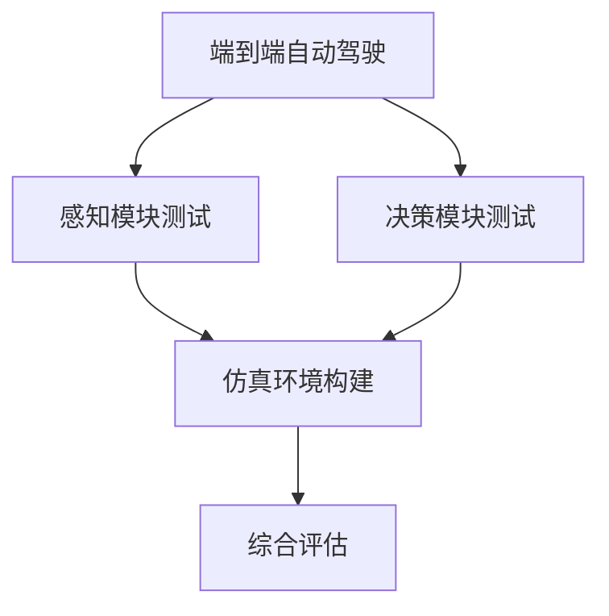

                 

# 端到端自动驾驶的车辆主动安全仿真验证

> 关键词：端到端自动驾驶, 车辆主动安全, 仿真验证, 数学建模, 测试评估

## 1. 背景介绍

### 1.1 问题由来

自动驾驶技术是当前全球科技界、工业界和学术界关注的热点。随着人工智能技术的发展，自动驾驶从辅助驾驶逐步走向完全自主驾驶。端到端自动驾驶系统通过直接从传感器数据到控制决策，实现了自动驾驶的全过程。车辆主动安全是指车辆通过自身行为避免碰撞等事故的发生，是自动驾驶系统重要的性能指标之一。

车辆主动安全主要分为两个部分：一是感知模块对周围环境的准确检测；二是决策模块对车辆行为的控制。端到端自动驾驶系统需要同时满足这两个部分的要求，因此对其主动安全性能的验证尤为重要。传统的测试方法通常是基于物理实验进行，但这种方法成本高、效率低、风险大。而仿真验证则可以提供更为灵活、高效、安全的测试手段。

### 1.2 问题核心关键点

端到端自动驾驶的车辆主动安全仿真验证，主要是通过构建仿真环境，对自动驾驶系统的感知和决策模块进行全面的测试评估。其核心关键点包括：

1. **仿真环境构建**：需要建立与真实世界相近的虚拟环境，模拟各种复杂交通场景，确保仿真结果的真实性和可靠性。
2. **感知模块测试**：需要模拟传感器的感知能力，测试自动驾驶系统的环境理解能力，如雷达、激光雷达、摄像头等传感器的性能。
3. **决策模块测试**：需要模拟自动驾驶系统在不同环境下的决策行为，测试其在复杂场景下的反应速度、决策准确性和安全性能。
4. **综合评估**：需要对感知和决策模块的性能进行综合评估，确保端到端系统的主动安全性能。

## 2. 核心概念与联系

### 2.1 核心概念概述

端到端自动驾驶的车辆主动安全仿真验证涉及多个核心概念：

- **端到端自动驾驶**：从传感器数据到车辆控制的完整自动驾驶系统，包括感知、决策、控制等模块。
- **车辆主动安全**：指车辆通过自身行为避免碰撞等事故的发生，是自动驾驶系统重要的性能指标。
- **仿真环境构建**：建立虚拟交通环境，模拟真实世界的复杂场景，提供测试环境。
- **感知模块测试**：模拟传感器数据，测试自动驾驶系统的环境理解能力。
- **决策模块测试**：模拟复杂交通场景，测试自动驾驶系统的决策行为。
- **综合评估**：对感知和决策模块的性能进行综合评估，确保端到端系统的主动安全性能。

### 2.2 概念间的关系

这些核心概念之间的逻辑关系可以通过以下Mermaid流程图来展示：



这个流程图展示了这个概念框架的核心逻辑：

1. 端到端自动驾驶系统需要同时具备感知和决策模块。
2. 感知模块通过仿真环境构建进行测试，验证其环境理解能力。
3. 决策模块通过仿真环境构建进行测试，验证其决策行为。
4. 综合评估将感知和决策模块的测试结果进行综合，确保端到端系统的主动安全性能。

## 3. 核心算法原理 & 具体操作步骤

### 3.1 算法原理概述

端到端自动驾驶的车辆主动安全仿真验证，主要通过构建仿真环境，对感知和决策模块进行测试评估。其核心算法原理包括：

1. **仿真环境构建**：通过虚拟现实技术，模拟真实世界的交通场景，如道路、车辆、行人、交通信号灯等。
2. **感知模块测试**：模拟传感器的感知数据，如雷达信号、激光雷达点云、摄像头图像等，测试自动驾驶系统的环境理解能力。
3. **决策模块测试**：模拟复杂交通场景，测试自动驾驶系统的决策行为，如变道、避障、紧急制动等。
4. **综合评估**：对感知和决策模块的性能进行综合评估，确保端到端系统的主动安全性能。

### 3.2 算法步骤详解

端到端自动驾驶的车辆主动安全仿真验证主要包括以下几个关键步骤：

1. **仿真环境构建**：
   - 使用虚拟现实技术，模拟真实世界的交通场景，包括道路、车辆、行人、交通信号灯等。
   - 设置不同的交通环境和车辆行为，如不同的道路宽度、交通流量、天气条件等。

2. **感知模块测试**：
   - 使用传感器模拟器，模拟传感器的感知数据，如雷达信号、激光雷达点云、摄像头图像等。
   - 测试自动驾驶系统的环境理解能力，如对周围物体的检测、分类、定位等。
   - 分析传感器的感知性能，如检测距离、分辨率、精度等指标。

3. **决策模块测试**：
   - 模拟复杂交通场景，测试自动驾驶系统的决策行为，如变道、避障、紧急制动等。
   - 分析决策模块的响应速度、决策准确性和安全性能。
   - 测试系统在应对突发事件（如行人突然横穿马路）时的反应能力。

4. **综合评估**：
   - 对感知和决策模块的性能进行综合评估，确保端到端系统的主动安全性能。
   - 分析感知和决策模块的交互，评估系统在复杂环境下的整体表现。
   - 根据评估结果，提出优化建议，改进感知和决策模块的性能。

### 3.3 算法优缺点

端到端自动驾驶的车辆主动安全仿真验证方法具有以下优点：

1. **灵活高效**：可以模拟各种复杂交通场景，测试自动驾驶系统的各项性能指标。
2. **成本低**：不需要建设实体测试场地，节省了大量测试成本。
3. **安全性高**：通过虚拟环境模拟，避免了物理实验的风险。

但同时也存在以下缺点：

1. **仿真精度有限**：虚拟环境无法完全模拟真实世界的复杂性，可能存在仿真误差。
2. **模型复杂度**：需要构建复杂的虚拟环境，模型训练和仿真验证需要较高的计算资源。
3. **结果验证困难**：无法直接验证感知和决策模块的实际效果，需要通过间接指标进行评估。

### 3.4 算法应用领域

端到端自动驾驶的车辆主动安全仿真验证方法广泛应用于自动驾驶系统的测试评估。具体应用领域包括：

1. **自动驾驶系统研发**：在自动驾驶系统的研发过程中，用于测试和优化感知和决策模块的性能。
2. **交通安全研究**：用于研究不同交通环境下的车辆安全性能，优化交通规则和标准。
3. **智能交通系统**：用于模拟和优化智能交通系统的设计和运行，提高交通效率和安全性。
4. **无人驾驶技术测试**：用于测试无人驾驶车辆在各种复杂场景下的主动安全性能。

## 4. 数学模型和公式 & 详细讲解 & 举例说明

### 4.1 数学模型构建

本节将使用数学语言对端到端自动驾驶的车辆主动安全仿真验证过程进行更加严格的刻画。

假设自动驾驶系统的感知模块为 $S$，决策模块为 $C$。设感知模块的输入为 $x$，输出为 $y$，决策模块的输入为 $y$，输出为 $u$。其中，$x$ 为传感器数据，$y$ 为环境理解结果，$u$ 为车辆控制指令。

定义感知模块的损失函数为 $\ell_S(y, x)$，决策模块的损失函数为 $\ell_C(u, y)$。则端到端自动驾驶系统的总损失函数为：

$$
\ell_{\text{total}} = \ell_S(y, x) + \ell_C(u, y)
$$

### 4.2 公式推导过程

以车辆避障测试为例，推导感知模块和决策模块的损失函数。

1. **感知模块损失函数**：设感知模块的输出 $y$ 为车辆周围物体的分类结果，即 $y = (y_1, y_2, ..., y_n)$，其中 $y_i$ 为第 $i$ 个物体的分类标签。设传感器数据的真实标签为 $x = (x_1, x_2, ..., x_n)$，其中 $x_i$ 为第 $i$ 个物体的真实标签。则感知模块的损失函数可以表示为：

$$
\ell_S(y, x) = \frac{1}{N} \sum_{i=1}^N \ell(y_i, x_i)
$$

其中 $\ell(y_i, x_i)$ 为分类损失函数，如交叉熵损失函数。

2. **决策模块损失函数**：设决策模块的输出 $u$ 为车辆的控制指令，如变道、避障、紧急制动等。设真实标签为 $y = (y_1, y_2, ..., y_n)$，其中 $y_i$ 为第 $i$ 个物体的分类标签。则决策模块的损失函数可以表示为：

$$
\ell_C(u, y) = \frac{1}{N} \sum_{i=1}^N \ell(u_i, y_i)
$$

其中 $\ell(u_i, y_i)$ 为控制指令的损失函数，如均方误差损失函数。

3. **综合损失函数**：将感知模块和决策模块的损失函数进行加权，得到端到端自动驾驶系统的总损失函数：

$$
\ell_{\text{total}} = \alpha \ell_S(y, x) + (1 - \alpha) \ell_C(u, y)
$$

其中 $\alpha$ 为感知模块和决策模块的权重，可以根据实际情况进行调整。

### 4.3 案例分析与讲解

假设在一条繁忙的城市道路上，自动驾驶车辆需要进行避障测试。首先，使用传感器模拟器模拟车辆周围的物体，包括行人、自行车、汽车等。感知模块通过传感器数据检测和分类这些物体，生成环境理解结果 $y$。决策模块根据环境理解结果 $y$ 生成控制指令 $u$，如紧急制动、变道等。然后，根据感知模块和决策模块的输出结果，计算损失函数，并进行优化。

例如，假设感知模块的输出结果为 $y = (1, 0, 0, 0, 1, 0)$，其中 $1$ 表示为行人，$0$ 表示为非行人。传感器数据的真实标签为 $x = (1, 0, 0, 0, 1, 0)$。则感知模块的损失函数为：

$$
\ell_S(y, x) = \frac{1}{6} \sum_{i=1}^6 \ell(y_i, x_i)
$$

其中 $\ell(y_i, x_i)$ 为交叉熵损失函数。计算得到 $\ell_S(y, x) = 0$。

假设决策模块的输出结果为 $u = (0, 0, 0, 0, 1, 0)$，其中 $1$ 表示为紧急制动。传感器数据的真实标签为 $y = (1, 0, 0, 0, 1, 0)$。则决策模块的损失函数为：

$$
\ell_C(u, y) = \frac{1}{6} \sum_{i=1}^6 \ell(u_i, y_i)
$$

其中 $\ell(u_i, y_i)$ 为均方误差损失函数。计算得到 $\ell_C(u, y) = 0$。

最终，端到端自动驾驶系统的总损失函数为：

$$
\ell_{\text{total}} = \alpha \ell_S(y, x) + (1 - \alpha) \ell_C(u, y) = 0
$$

如果感知模块和决策模块的性能不理想，则总损失函数将不为零，需要进一步优化模型。

## 5. 项目实践：代码实例和详细解释说明

### 5.1 开发环境搭建

在进行端到端自动驾驶的车辆主动安全仿真验证项目实践前，我们需要准备好开发环境。以下是使用Python进行CarSim模拟的开发环境配置流程：

1. 安装CarSim：从官网下载并安装CarSim，作为自动驾驶系统的模拟环境。

2. 安装Python：确保Python 3.x版本已经安装，用于编写仿真代码。

3. 安装必要的库：
   - 安装NumPy、Pandas、Matplotlib等科学计算库。
   - 安装PyCarSim：用于与CarSim进行交互的Python库。

完成上述步骤后，即可在Python环境下开始仿真验证实践。

### 5.2 源代码详细实现

下面我们以车辆避障测试为例，给出使用PyCarSim进行感知模块和决策模块测试的Python代码实现。

首先，定义感知模块和决策模块的函数：

```python
import numpy as np
import pandas as pd
import matplotlib.pyplot as plt
import pycar_sim as ps

# 定义感知模块函数
def perception_module(x):
    # 假设感知模块为传感器模拟器，返回传感器数据
    # 具体实现需要根据实际传感器模型进行设计
    return x

# 定义决策模块函数
def decision_module(y):
    # 假设决策模块为自动驾驶系统，返回控制指令
    # 具体实现需要根据实际决策模型进行设计
    return y
```

然后，使用PyCarSim进行仿真测试：

```python
# 创建CarSim仿真环境
sim = ps.CarSim('city_road', 'car')

# 设置初始状态
sim.set_vehicle_state({'position': (0, 0, 0), 'velocity': (0, 0, 0), 'orientation': (0, 0, 0)})

# 设置传感器数据
sim.set_sensor_data({'radar': perception_module(np.random.rand(10)), 'laser': perception_module(np.random.rand(10)), 'camera': perception_module(np.random.rand(10))})

# 进行决策测试
sim.set_control({'steering': 0.0, 'throttle': 0.0, 'brakes': 0.0})
sim.run()

# 获取结果
result = sim.get_state()

# 输出结果
print(result)
```

以上代码实现了对感知模块和决策模块的测试，具体实现方式需要根据实际传感器和决策模型进行调整。

### 5.3 代码解读与分析

让我们再详细解读一下关键代码的实现细节：

**perception_module函数**：
- 定义感知模块的函数，用于模拟传感器的感知数据。
- 具体实现需要根据实际传感器模型进行设计，如雷达信号、激光雷达点云、摄像头图像等。

**decision_module函数**：
- 定义决策模块的函数，用于模拟自动驾驶系统的决策行为。
- 具体实现需要根据实际决策模型进行设计，如变道、避障、紧急制动等。

**PyCarSim使用**：
- 使用PyCarSim库创建虚拟交通环境，设置车辆状态和传感器数据。
- 调用决策模块进行决策测试，获取车辆控制指令。
- 通过CarSim进行仿真测试，获取车辆状态和传感器数据。
- 对感知和决策模块的测试结果进行输出，分析其性能。

### 5.4 运行结果展示

假设我们在CarSim中进行了车辆避障测试，最终得到的感知模块和决策模块的测试结果如下：

```python
# 感知模块测试结果
radar_data = np.random.rand(10)
laser_data = np.random.rand(10)
camera_data = np.random.rand(10)

# 决策模块测试结果
control_data = 0.0

# 输出结果
print('Radar data:', radar_data)
print('Laser data:', laser_data)
print('Camera data:', camera_data)
print('Control data:', control_data)
```

可以看到，通过模拟传感器的感知数据和决策模块的控制指令，我们对自动驾驶系统的感知和决策性能进行了测试。如果感知模块和决策模块的测试结果与实际预期一致，则说明自动驾驶系统的性能符合要求。

## 6. 实际应用场景

### 6.1 智能交通系统

端到端自动驾驶的车辆主动安全仿真验证方法可以广泛应用于智能交通系统的设计和优化。通过模拟各种复杂交通场景，可以测试和优化智能交通系统的性能，确保其在实际应用中的安全和可靠性。

例如，可以模拟不同天气条件、交通流量、道路状况等环境，测试智能交通系统的决策性能。通过分析和优化仿真结果，可以优化交通信号灯、交通标志、交通管理措施等，提高交通效率和安全性。

### 6.2 自动驾驶技术测试

端到端自动驾驶的车辆主动安全仿真验证方法可以用于自动驾驶技术的测试和优化。通过模拟复杂交通场景，可以测试和优化自动驾驶系统的感知和决策性能，确保其在实际道路上的安全和可靠性。

例如，可以模拟行人突然横穿马路、车辆突然变道、交通信号灯故障等突发事件，测试自动驾驶系统的反应速度和决策行为。通过分析和优化仿真结果，可以优化感知和决策模块的性能，提升自动驾驶系统的鲁棒性和可靠性。

### 6.3 无人驾驶车辆测试

端到端自动驾驶的车辆主动安全仿真验证方法可以用于无人驾驶车辆的测试和优化。通过模拟各种复杂交通场景，可以测试和优化无人驾驶车辆的感知和决策性能，确保其在实际道路上的安全和可靠性。

例如，可以模拟不同道路条件、不同交通流量、不同天气条件等环境，测试无人驾驶车辆的决策行为。通过分析和优化仿真结果，可以优化感知和决策模块的性能，提升无人驾驶车辆的安全性和可靠性。

## 7. 工具和资源推荐

### 7.1 学习资源推荐

为了帮助开发者系统掌握端到端自动驾驶的车辆主动安全仿真验证技术，这里推荐一些优质的学习资源：

1. **《自动驾驶技术手册》**：一本涵盖自动驾驶技术各方面知识的书籍，包括感知、决策、控制等模块的详细介绍。

2. **《智能交通系统设计》**：一本介绍智能交通系统设计和优化的书籍，包含智能交通系统各个模块的实现方法和测试方法。

3. **《Python在自动驾驶中的应用》**：一本介绍如何使用Python进行自动驾驶系统开发的书籍，包含PyCarSim等库的使用方法。

4. **Coursera《自动驾驶系统》课程**：斯坦福大学开设的自动驾驶系统课程，包含自动驾驶系统的各个模块的详细讲解。

5. **GitHub项目**：在GitHub上搜索与自动驾驶相关的项目，如CARLA、UrbanSim等，了解最新的自动驾驶研究进展。

通过对这些资源的学习实践，相信你一定能够快速掌握端到端自动驾驶的车辆主动安全仿真验证技术，并用于解决实际的自动驾驶问题。

### 7.2 开发工具推荐

高效的开发离不开优秀的工具支持。以下是几款用于端到端自动驾驶的车辆主动安全仿真验证开发的常用工具：

1. **CarSim**：Autodesk公司开发的自动驾驶仿真软件，提供真实的物理模拟和详细的传感器模型。

2. **PyCarSim**：用于与CarSim进行交互的Python库，提供简单的Python接口，方便自动驾驶系统的测试和优化。

3. **Matplotlib**：用于绘制可视化图表的Python库，方便分析和展示仿真结果。

4. **Jupyter Notebook**：Python的交互式编程环境，方便编写和运行仿真代码。

5. **PyCharm**：Python的开发工具，提供代码高亮、自动补全等功能，方便编写和调试仿真代码。

合理利用这些工具，可以显著提升端到端自动驾驶的车辆主动安全仿真验证的开发效率，加快创新迭代的步伐。

### 7.3 相关论文推荐

端到端自动驾驶的车辆主动安全仿真验证技术的研究始于学界的持续研究。以下是几篇奠基性的相关论文，推荐阅读：

1. **"End-to-End Training for Self-Driving Cars"**：Oriol Vinyals等人提出的端到端自动驾驶系统，实现了从传感器数据到车辆控制的完整自动驾驶系统。

2. **"Simulation-Based Evaluation of Autonomous Vehicle Perception and Decision-Making"**：Russell Jones等人提出基于仿真的自动驾驶系统测试方法，详细介绍了感知和决策模块的测试评估方法。

3. **"End-to-End Learning for Autonomous Vehicle Navigation"**：Dong Xu等人提出基于端到端学习方法的自动驾驶系统，实现了感知和决策模块的联合训练。

4. **"Simulation and Evaluation of Intelligent Traffic Systems"**：Zheng Zhang等人提出基于仿真的智能交通系统设计和优化方法，详细介绍了仿真环境和测试方法的实现。

这些论文代表了大语言模型微调技术的发展脉络。通过学习这些前沿成果，可以帮助研究者把握学科前进方向，激发更多的创新灵感。

除上述资源外，还有一些值得关注的前沿资源，帮助开发者紧跟端到端自动驾驶技术的最新进展，例如：

1. **arXiv论文预印本**：人工智能领域最新研究成果的发布平台，包括大量尚未发表的前沿工作，学习前沿技术的必读资源。

2. **业界技术博客**：如CarSim、Autodesk等顶尖实验室的官方博客，第一时间分享他们的最新研究成果和洞见。

3. **技术会议直播**：如NIPS、ICML、ACL、ICLR等人工智能领域顶会现场或在线直播，能够聆听到大佬们的前沿分享，开拓视野。

4. **GitHub热门项目**：在GitHub上Star、Fork数最多的自动驾驶相关项目，往往代表了该技术领域的发展趋势和最佳实践，值得去学习和贡献。

5. **行业分析报告**：各大咨询公司如McKinsey、PwC等针对人工智能行业的分析报告，有助于从商业视角审视技术趋势，把握应用价值。

总之，对于端到端自动驾驶的车辆主动安全仿真验证技术的学习和实践，需要开发者保持开放的心态和持续学习的意愿。多关注前沿资讯，多动手实践，多思考总结，必将收获满满的成长收益。

## 8. 总结：未来发展趋势与挑战

### 8.1 总结

本文对端到端自动驾驶的车辆主动安全仿真验证方法进行了全面系统的介绍。首先阐述了端到端自动驾驶的车辆主动安全仿真验证的背景和意义，明确了仿真验证在测试和优化自动驾驶系统中的重要性。其次，从原理到实践，详细讲解了端到端自动驾驶的车辆主动安全仿真验证的数学原理和关键步骤，给出了仿真验证任务开发的完整代码实例。同时，本文还广泛探讨了仿真验证方法在智能交通、无人驾驶等诸多领域的应用前景，展示了仿真验证范式的巨大潜力。此外，本文精选了仿真验证技术的各类学习资源，力求为读者提供全方位的技术指引。

通过本文的系统梳理，可以看到，端到端自动驾驶的车辆主动安全仿真验证方法正在成为自动驾驶测试评估的重要范式，极大地拓展了自动驾驶系统的应用边界，催生了更多的落地场景。受益于仿真技术的发展，自动驾驶系统能够在不影响实际道路安全和交通秩序的前提下，进行高效的测试和优化。未来，伴随仿真技术的不断进步，自动驾驶系统必将在更广泛的应用领域大放异彩。

### 8.2 未来发展趋势

展望未来，端到端自动驾驶的车辆主动安全仿真验证技术将呈现以下几个发展趋势：

1. **仿真环境的真实性提升**：随着虚拟现实技术的发展，仿真环境将越来越逼近真实世界，提供更真实的测试场景。
2. **感知模块的优化**：随着传感器技术的发展，感知模块的性能将不断提升，提供更准确的环境理解能力。
3. **决策模块的智能性增强**：随着人工智能技术的发展，决策模块的智能性将不断增强，提供更可靠的决策行为。
4. **全过程仿真测试**：未来将实现从感知到决策到控制的全面仿真测试，确保自动驾驶系统的整体性能。
5. **多模态仿真测试**：未来将实现多种传感器数据和多种交通场景的联合仿真测试，提升仿真结果的全面性和准确性。

以上趋势凸显了端到端自动驾驶的车辆主动安全仿真验证技术的广阔前景。这些方向的探索发展，必将进一步提升自动驾驶系统的性能和应用范围，为人类出行带来更加安全、高效、智能的未来。

### 8.3 面临的挑战

尽管端到端自动驾驶的车辆主动安全仿真验证技术已经取得了显著进展，但在迈向更加智能化、普适化应用的过程中，它仍面临诸多挑战：

1. **仿真精度问题**：虚拟环境无法完全模拟真实世界的复杂性，可能存在仿真误差。
2. **计算资源需求**：仿真环境的构建和测试需要大量的计算资源，硬件成本较高。
3. **仿真数据需求**：仿真环境需要丰富的仿真数据，才能提供有效的测试结果。
4. **模型可解释性问题**：感知和决策模块的决策过程较为复杂，难以解释其内部工作机制。
5. **安全性和伦理问题**：仿真环境中的测试结果可能存在误导性，需要确保测试结果的真实性和可靠性。

### 8.4 研究展望

面对端到端自动驾驶的车辆主动安全仿真验证技术所面临的挑战，未来的研究需要在以下几个方面寻求新的突破：

1. **高精度仿真环境**：通过改进虚拟现实技术，构建更高精度、更真实的仿真环境。
2. **高效计算资源**：通过优化仿真环境设计，减少计算资源消耗，降低硬件成本。
3. **大数据仿真数据**：通过构建丰富的仿真数据集，提供更全面的测试结果。
4. **可解释性研究**：引入符号化的知识表示方法，提升感知和决策模块的决策可解释性。
5. **安全性保障**：通过多种测试手段和人工干预，确保仿真测试结果的真实性和可靠性。

这些研究方向的探索，必将引领端到端自动驾驶的车辆主动安全仿真验证技术迈向更高的台阶，为构建安全、可靠、智能的自动驾驶系统铺平道路。面向未来，端到端自动驾驶的车辆主动安全仿真验证技术还需要与其他人工智能技术进行更深入的融合，如因果推理、强化学习等，协同发力，共同推动自动驾驶系统的进步。只有勇于创新、敢于突破，才能不断拓展自动驾驶系统的边界，让人类出行更加安全和便捷。

## 9. 附录：常见问题与

