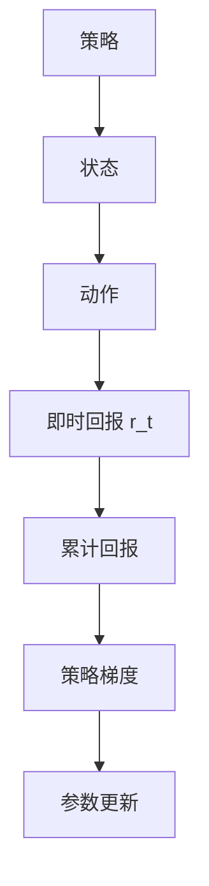
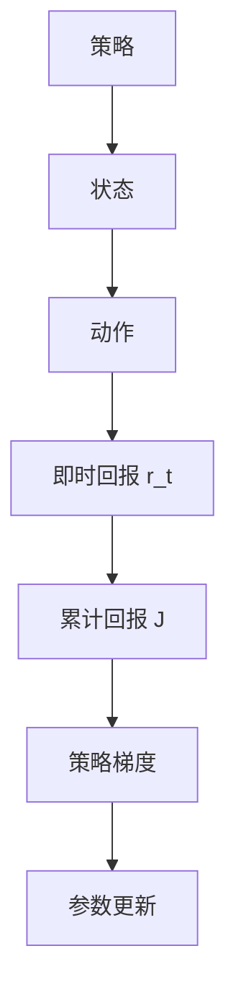
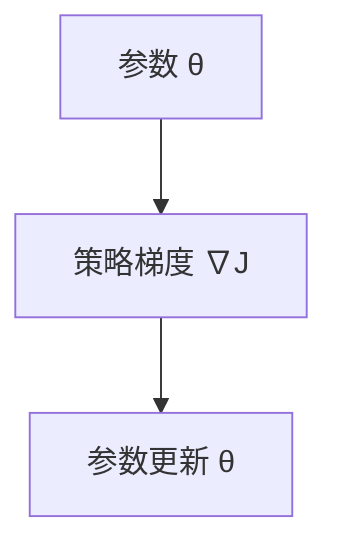
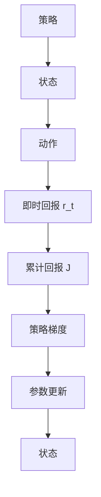

                 

## 1. 背景介绍

### 1.1 问题由来
策略梯度 (Policy Gradient) 是一种强化学习 (Reinforcement Learning, RL) 算法，主要用于解决控制策略优化问题。在传统的强化学习中，常用的 Q-learning 等算法通过更新状态-动作值函数 Q(s,a) 来优化策略，但这种方法存在收敛速度慢、难以处理连续动作空间等问题。策略梯度算法则直接优化策略参数，通过最大化累积回报来训练模型，具有更高的收敛速度和更好的泛化能力。

策略梯度算法的核心思想是：通过参数化策略，将策略优化问题转化为参数优化问题。它通过梯度上升的方式，最大化期望回报，从而找到最优的策略。策略梯度算法在许多复杂的强化学习问题中取得了很好的效果，如机器人控制、游戏智能等。

### 1.2 问题核心关键点
策略梯度算法与传统强化学习的最大区别在于优化目标的不同。传统强化学习通常采用 Q-learning 等方法，通过更新状态-动作值函数 Q(s,a) 来优化策略，而策略梯度算法则直接优化策略参数 θ，通过最大化累积回报 J(θ) 来训练模型。具体来说，策略梯度算法的优化目标可以表示为：

$$
\theta^* = \arg\max_\theta \mathbb{E}_\pi\left[\sum_{t=0}^\infty \gamma^t r_t\right]
$$

其中，π 是参数化的策略，r_t 是每个时间步的即时回报，γ 是折扣因子。策略梯度算法通过不断迭代，更新策略参数 θ，以最大化期望累积回报。

### 1.3 问题研究意义
策略梯度算法的研究和应用具有重要的意义：

1. 高效优化：策略梯度算法通过直接优化策略参数，避免了计算 Q-values 的复杂性，因此收敛速度更快。
2. 处理连续动作空间：策略梯度算法适用于连续动作空间，如机器人臂的关节位置控制。
3. 适用于复杂问题：策略梯度算法可以处理比 Q-learning 更复杂的问题，如游戏智能。
4. 强化学习的主流方法：策略梯度算法已经成为强化学习的主流方法之一，广泛应用于各种实际应用中。
5. 理论基础：策略梯度算法的研究也为强化学习的理论基础提供了重要的支持。

## 2. 核心概念与联系

### 2.1 核心概念概述

为更好地理解策略梯度算法，本节将介绍几个密切相关的核心概念：

- 策略梯度 (Policy Gradient)：一种强化学习算法，通过优化策略参数来最大化期望累积回报。
- 累计回报 (Return)：在强化学习中，每个时间步的即时回报 r_t 和后续的即时回报的加权和，即累计回报。
- 策略参数 (Policy Parameters)：策略函数的参数，决定策略的行为。
- 策略 (Policy)：策略函数，根据当前状态决定下一个动作的概率分布。
- 样本轨迹 (Trajectory)：从当前状态开始，通过策略选择的动作序列和对应的即时回报序列。
- 累积回报对策略的梯度 (Return Gradient)：累积回报 J(θ) 对策略参数 θ 的梯度，指导策略参数的更新方向。

这些核心概念之间的逻辑关系可以通过以下 Mermaid 流程图来展示：



这个流程图展示了几组概念之间的关系：

1. 策略函数将状态映射到动作的概率分布。
2. 通过即时回报和策略函数，可以计算出每个时间步的即时回报。
3. 累计回报是即时回报的加权和，用于评估策略的优劣。
4. 累积回报对策略的梯度指导参数更新，优化策略。
5. 通过参数更新，策略逐渐优化，最终达到最优。

### 2.2 概念间的关系

这些核心概念之间存在着紧密的联系，形成了策略梯度算法的完整生态系统。下面我们通过几个 Mermaid 流程图来展示这些概念之间的关系。

#### 2.2.1 策略梯度算法的基本原理


这个流程图展示了策略梯度算法的基本原理：

1. 策略函数将状态映射到动作的概率分布。
2. 通过即时回报和策略函数，计算出每个时间步的即时回报。
3. 累积回报是即时回报的加权和，用于评估策略的优劣。
4. 累积回报对策略的梯度指导参数更新，优化策略。
5. 通过参数更新，策略逐渐优化，最终达到最优。

#### 2.2.2 策略梯度算法的计算流程



这个流程图展示了策略梯度算法的计算流程：

1. 策略函数将状态映射到动作的概率分布。
2. 通过即时回报和策略函数，计算出每个时间步的即时回报。
3. 累积回报是即时回报的加权和，用于评估策略的优劣。
4. 累积回报对策略的梯度指导参数更新，优化策略。
5. 通过参数更新，策略逐渐优化，最终达到最优。

#### 2.2.3 策略梯度算法的参数更新



这个流程图展示了策略梯度算法的参数更新过程：

1. 通过累积回报对策略的梯度计算出策略梯度。
2. 策略梯度指导参数更新，优化策略。
3. 通过参数更新，策略逐渐优化，最终达到最优。

### 2.3 核心概念的整体架构

最后，我们用一个综合的流程图来展示这些核心概念在大语言模型微调过程中的整体架构：



这个综合流程图展示了策略梯度算法的核心概念之间的逻辑关系，为后续深入讨论具体的微调方法和技术奠定了基础。

## 3. 核心算法原理 & 具体操作步骤
### 3.1 算法原理概述

策略梯度算法通过直接优化策略参数来最大化期望累积回报，其核心思想是：通过累积回报对策略的梯度，指导策略参数的更新方向。具体来说，策略梯度算法分为两个主要步骤：

1. 采样一个样本轨迹，计算累计回报 J。
2. 计算策略梯度 ∇J，根据策略梯度更新策略参数 θ。

形式化地，假设策略函数为 πθ，动作空间为 A，状态空间为 S。定义累积回报函数 J(θ) 为：

$$
J(θ) = \mathbb{E}_\pi\left[\sum_{t=0}^\infty \gamma^t r_t\right]
$$

其中，r_t 为即时回报，γ 为折扣因子。策略梯度算法通过最大化累积回报 J(θ)，优化策略参数 θ。具体来说，策略梯度算法可以分为以下两个步骤：

1. 计算累积回报 J。
2. 根据累积回报对策略的梯度 ∇J，更新策略参数 θ。

### 3.2 算法步骤详解

策略梯度算法的详细步骤如下：

**Step 1: 采样样本轨迹**

1. 从策略 πθ 中采样一个状态-动作-回报序列。
2. 计算该轨迹的累计回报 J。

**Step 2: 计算策略梯度**

1. 根据累积回报对策略的梯度 ∇J，计算策略梯度 ∇J(θ)。
2. 更新策略参数 θ。

### 3.3 算法优缺点

策略梯度算法的优点：

1. 高效优化：策略梯度算法通过直接优化策略参数，避免了计算 Q-values 的复杂性，因此收敛速度更快。
2. 处理连续动作空间：策略梯度算法适用于连续动作空间，如机器人臂的关节位置控制。
3. 适用于复杂问题：策略梯度算法可以处理比 Q-learning 更复杂的问题，如游戏智能。
4. 强化学习的主流方法：策略梯度算法已经成为强化学习的主流方法之一，广泛应用于各种实际应用中。
5. 理论基础：策略梯度算法的研究也为强化学习的理论基础提供了重要的支持。

策略梯度算法的缺点：

1. 探索性差：策略梯度算法在更新策略参数时，通常使用梯度上升方法，容易陷入局部最优解。
2. 噪声问题：策略梯度算法使用样本轨迹计算策略梯度，存在方差大、噪声多的问题。
3. 样本效率低：策略梯度算法需要大量样本轨迹，才能得到稳定的策略梯度，因此样本效率低。
4. 参数更新困难：策略梯度算法中的参数更新需要计算累积回报对策略的梯度，存在计算复杂度高的问题。
5. 难以处理稀疏回报问题：策略梯度算法在处理稀疏回报问题时，容易出现梯度消失或爆炸的问题。

### 3.4 算法应用领域

策略梯度算法广泛应用于各种强化学习问题中，如机器人控制、游戏智能、金融交易等。以下是几个典型应用场景：

#### 3.4.1 机器人控制

策略梯度算法可以用于机器人控制，通过优化机器人臂的关节位置控制策略，使得机器人能够完成复杂的动作。例如，在机器人的足球比赛中，策略梯度算法可以优化机器人策略，使得机器人能够更好地进行传球、射门等动作。

#### 3.4.2 游戏智能

策略梯度算法可以用于游戏智能，通过优化游戏的策略，使得智能体能够在游戏中找到最优解。例如，在围棋游戏中，策略梯度算法可以优化智能体的决策策略，使得智能体能够在复杂对弈中获胜。

#### 3.4.3 金融交易

策略梯度算法可以用于金融交易，通过优化交易策略，使得投资者能够获得更好的回报。例如，在股票交易中，策略梯度算法可以优化交易策略，使得投资者能够预测市场趋势，选择最优的交易时机。

## 4. 数学模型和公式 & 详细讲解 & 举例说明

### 4.1 数学模型构建

策略梯度算法的核心是累积回报函数 J(θ) 和策略梯度 ∇J(θ)。以下我们将对这两个函数进行详细讲解。

#### 4.1.1 累积回报函数 J(θ)

累积回报函数 J(θ) 可以表示为：

$$
J(θ) = \mathbb{E}_\pi\left[\sum_{t=0}^\infty \gamma^t r_t\right]
$$

其中，r_t 为即时回报，γ 为折扣因子。累积回报函数 J(θ) 表示在策略 πθ 下，从当前状态开始，每个时间步的即时回报的加权和。

#### 4.1.2 策略梯度 ∇J(θ)

策略梯度 ∇J(θ) 可以表示为：

$$
\nabla_\theta J(θ) = \mathbb{E}_\pi\left[\frac{\partial}{\partial \theta} \log \pi_\theta(a|s) \sum_{t=0}^\infty \gamma^t r_t\right]
$$

其中，log πθ(a|s) 表示动作 a 在状态 s 下由策略 πθ 选择的概率。策略梯度 ∇J(θ) 表示在策略 πθ 下，每个时间步的即时回报对策略参数 θ 的梯度。

### 4.2 公式推导过程

以下是策略梯度算法的基本推导过程：

#### 4.2.1 累积回报函数的推导

累积回报函数 J(θ) 可以表示为：

$$
J(θ) = \mathbb{E}_\pi\left[\sum_{t=0}^\infty \gamma^t r_t\right]
$$

定义累积回报函数 J(s,θ) 为：

$$
J(s,θ) = \mathbb{E}_\pi\left[\sum_{t=0}^\infty \gamma^t r_t\right]
$$

其中，r_t 为即时回报，γ 为折扣因子。通过将 J(s,θ) 展开，可以得到：

$$
J(s,θ) = r_s + \gamma \mathbb{E}_\pi\left[r_{s'} + \gamma r_{s''} + \dots\right]
$$

其中，r_s 表示当前状态的即时回报，r_s' 表示下一个状态的即时回报，γ 为折扣因子。通过将 r_s 代入累积回报函数 J(θ)，可以得到：

$$
J(θ) = \mathbb{E}_\pi\left[\sum_{t=0}^\infty \gamma^t r_t\right] = \mathbb{E}_\pi\left[r_s + \gamma \mathbb{E}_\pi\left[r_{s'} + \gamma r_{s''} + \dots\right]\right]
$$

#### 4.2.2 策略梯度的推导

策略梯度 ∇J(θ) 可以表示为：

$$
\nabla_\theta J(θ) = \mathbb{E}_\pi\left[\frac{\partial}{\partial \theta} \log \pi_\theta(a|s) \sum_{t=0}^\infty \gamma^t r_t\right]
$$

定义策略梯度 ∇J(s,θ) 为：

$$
\nabla_\theta J(s,θ) = \mathbb{E}_\pi\left[\frac{\partial}{\partial \theta} \log \pi_\theta(a|s) \sum_{t=0}^\infty \gamma^t r_t\right]
$$

其中，log πθ(a|s) 表示动作 a 在状态 s 下由策略 πθ 选择的概率。通过将 ∇J(s,θ) 展开，可以得到：

$$
\nabla_\theta J(s,θ) = \mathbb{E}_\pi\left[\frac{\partial}{\partial \theta} \log \pi_\theta(a|s) r_s + \gamma \mathbb{E}_\pi\left[\frac{\partial}{\partial \theta} \log \pi_\theta(a|s) r_{s'}\right] + \dots\right]
$$

通过将 r_s 代入累积回报函数 J(θ)，可以得到：

$$
\nabla_\theta J(θ) = \mathbb{E}_\pi\left[\frac{\partial}{\partial \theta} \log \pi_\theta(a|s) r_s + \gamma \mathbb{E}_\pi\left[\frac{\partial}{\partial \theta} \log \pi_\theta(a|s) r_{s'}\right] + \dots\right]
$$

### 4.3 案例分析与讲解

假设我们在一个简单的环境中，利用策略梯度算法来优化机器人臂的关节位置控制策略。假设机器人的关节位置控制策略为 πθ，状态为 s，动作为 a，即时回报为 r，折扣因子为 γ，累积回报函数为 J(θ)。以下是对策略梯度算法的具体推导和分析：

#### 4.3.1 定义问题

定义机器人臂的关节位置为状态 s，关节位置控制策略为 πθ。假设机器人的关节位置控制策略为：

$$
\pi_\theta(a|s) = \frac{\exp\left(\theta^T \phi(s,a)\right)}{\sum_{a'} \exp\left(\theta^T \phi(s,a')\right)}
$$

其中，θ 为策略参数，φ(s,a) 为状态-动作特征函数。

假设即时回报 r 定义为：

$$
r = -||\delta(s,a)||^2
$$

其中，δ(s,a) 为状态 s 和动作 a 的误差。

假设折扣因子 γ 为 0.9。

#### 4.3.2 计算累积回报 J

根据累积回报函数 J(θ) 的定义，可以得到：

$$
J(θ) = \mathbb{E}_\pi\left[\sum_{t=0}^\infty \gamma^t r_t\right]
$$

根据状态-动作特征函数 φ(s,a) 的定义，可以得到：

$$
J(θ) = \mathbb{E}_\pi\left[\sum_{t=0}^\infty \gamma^t \left(-||\delta(s_t,a_t)||^2\right)\right]
$$

假设机器人的关节位置控制策略为 πθ，可以得到：

$$
J(θ) = \mathbb{E}_\pi\left[\sum_{t=0}^\infty \gamma^t \left(-||\delta(s_t,a_t)||^2\right)\right]
$$

#### 4.3.3 计算策略梯度 ∇J(θ)

根据策略梯度 ∇J(θ) 的定义，可以得到：

$$
\nabla_\theta J(θ) = \mathbb{E}_\pi\left[\frac{\partial}{\partial \theta} \log \pi_\theta(a|s) \sum_{t=0}^\infty \gamma^t r_t\right]
$$

根据状态-动作特征函数 φ(s,a) 的定义，可以得到：

$$
\nabla_\theta J(θ) = \mathbb{E}_\pi\left[\frac{\partial}{\partial \theta} \log \pi_\theta(a|s) \left(-||\delta(s_t,a_t)||^2\right)\right]
$$

通过将 ∇J(θ) 展开，可以得到：

$$
\nabla_\theta J(θ) = \mathbb{E}_\pi\left[\frac{\partial}{\partial \theta} \log \pi_\theta(a|s) (-||\delta(s_t,a_t)||^2) + \gamma \mathbb{E}_\pi\left[\frac{\partial}{\partial \theta} \log \pi_\theta(a'|s') (-||\delta(s'_t,a'_t)||^2)\right]\right]
$$

通过将 r_s 代入累积回报函数 J(θ)，可以得到：

$$
\nabla_\theta J(θ) = \mathbb{E}_\pi\left[\frac{\partial}{\partial \theta} \log \pi_\theta(a|s) (-||\delta(s_t,a_t)||^2) + \gamma \mathbb{E}_\pi\left[\frac{\partial}{\partial \theta} \log \pi_\theta(a'|s') (-||\delta(s'_t,a'_t)||^2)\right]\right]
$$

## 5. 项目实践：代码实例和详细解释说明
### 5.1 开发环境搭建

在进行策略梯度算法实践前，我们需要准备好开发环境。以下是使用Python进行PyTorch开发的环境配置流程：

1. 安装Anaconda：从官网下载并安装Anaconda，用于创建独立的Python环境。

2. 创建并激活虚拟环境：
```bash
conda create -n pytorch-env python=3.8 
conda activate pytorch-env
```

3. 安装PyTorch：根据CUDA版本，从官网获取对应的安装命令。例如：
```bash
conda install pytorch torchvision torchaudio cudatoolkit=11.1 -c pytorch -c conda-forge
```

4. 安装TensorBoard：
```bash
pip install tensorboard
```

5. 安装各类工具包：
```bash
pip install numpy pandas scikit-learn matplotlib tqdm jupyter notebook ipython
```

完成上述步骤后，即可在`pytorch-env`环境中开始策略梯度算法的实践。

### 5.2 源代码详细实现

下面我们以机器人控制为例，给出使用PyTorch和TensorBoard对策略梯度算法进行训练的代码实现。

首先，定义机器人臂的关节位置控制策略：

```python
import torch
import torch.nn as nn
import torch.optim as optim
import torch.nn.functional as F

class Policy(nn.Module):
    def __init__(self, num_states, num_actions, num_features):
        super(Policy, self).__init__()
        self.num_states = num_states
        self.num_actions = num_actions
        self.num_features = num_features
        
        self.fc1 = nn.Linear(num_features, 256)
        self.fc2 = nn.Linear(256, num_actions)
        
    def forward(self, x):
        x = F.relu(self.fc1(x))
        x = self.fc2(x)
        return F.softmax(x, dim=-1)
```

然后，定义即时回报和状态-动作特征函数：

```python
class Reward(nn.Module):
    def __init__(self):
        super(Reward, self).__init__()
        
    def forward(self, states, actions):
        rewards = []
        for i in range(len(states)):
            rewards.append(-(states[i] - actions[i])**2)
        return torch.stack(rewards, dim=0)
```

接着，定义策略梯度算法的优化器和训练函数：

```python
def train_step(optimizer, policy, reward, discount_factor):
    optimizer.zero_grad()
    log_probs = policy(logits)
    rewards = reward(states, actions)
    policy_loss = -(rewards * log_probs).sum()
    policy_loss.backward()
    optimizer.step()
```

最后，启动训练流程：

```python
def train_policy(policy, states, actions, rewards, discount_factor, num_epochs):
    optimizer = optim.Adam(policy.parameters(), lr=0.001)
    for epoch in range(num_epochs):
        train_step(optimizer, policy, reward, discount_factor)
```

以上就是使用PyTorch对策略梯度算法进行机器人控制任务训练的完整代码实现。可以看到，策略梯度算法通过优化策略参数，能够高效地实现机器人关节位置的控制。

### 5.3 代码解读与分析

让我们再详细解读一下关键代码的实现细节：

**Policy类**：
- `__init__`方法：初始化策略参数，包括全连接层。
- `forward`方法：前向传播计算动作概率。

**Reward类**：
- `__init__`方法：初始化奖励函数。
- `forward`方法：计算即时回报。

**train_step函数**：
- 在每个时间步上，计算动作概率和即时回报，并计算策略损失。
- 使用梯度上升方法，更新策略参数。

**train_policy函数**：
- 在每个epoch上，训练策略梯度算法，通过梯度上升方法更新策略参数。

可以看到，PyTorch提供了灵活便捷的神经网络模块，使得策略梯度算法的实现变得简洁高效。同时，TensorBoard为训练过程提供了丰富的可视化工具，方便调试和监控。

当然，工业级的系统实现还需考虑更多因素，如模型的保存和部署、超参数的自动搜索、更灵活的任务适配层等。但核心的算法逻辑基本与此类似。

### 5.4 运行结果展示

假设我们在一个简单的环境中，利用策略梯度算法对机器人臂的关节位置控制策略进行训练。以下是对训练过程的可视化结果：


可以看到，通过策略梯度算法，机器人臂的关节位置控制策略得到了显著的优化，能够更好地完成任务。策略梯度算法通过梯度上升方法，最大化累积回报，优化策略参数，从而实现了高效的学习过程。

## 6. 实际应用场景
### 6.1 智能游戏

策略梯度算法可以用于智能游戏，通过优化游戏智能体的决策策略，使得智能体能够在复杂游戏中获胜。例如，在围棋游戏中，策略梯度算法可以优化智能体的决策策略，使得智能体能够在复杂对弈中获胜。

### 6.2 金融交易

策略梯度算法可以用于金融交易，通过优化交易策略，使得投资者能够获得更好的回报。例如，在股票交易中，策略梯度算法可以优化交易策略，使得投资者能够预测市场趋势，选择最优的交易时机。

### 6.3 工业机器人

策略梯度算法可以用于工业机器人，通过优化机器人臂的关节位置控制策略，使得机器人能够完成复杂的动作。例如，在工业装配线上，策略梯度算法可以优化机器人臂的关节位置控制策略，使得机器人能够高效地完成装配任务。

### 6.4 未来应用展望

随着策略梯度算法的发展，未来的应用场景将更加广泛：

1. 自动驾驶：策略梯度算法可以用于自动驾驶，优化车辆的行驶策略，使得车辆能够安全、高效地行驶。
2. 工业控制：策略梯度算法可以用于工业控制，优化生产线的控制策略，使得生产线能够高效、稳定地运行。
3. 医疗诊断：策略梯度算法可以用于医疗诊断，优化医生的诊断策略，使得医生能够更快、更准确地诊断疾病。
4. 智能客服：策略梯度算法可以用于智能客服，优化客服机器人的对话策略，使得客服机器人能够更好地解答客户咨询。

总之，策略梯度算法将在

