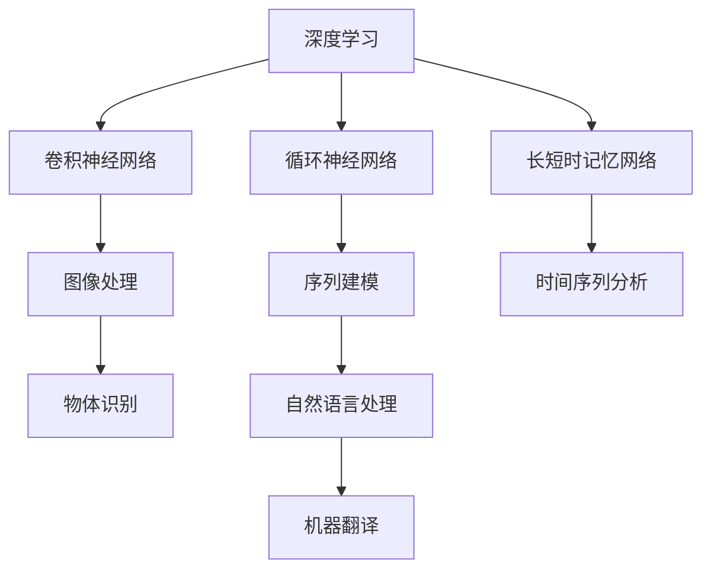
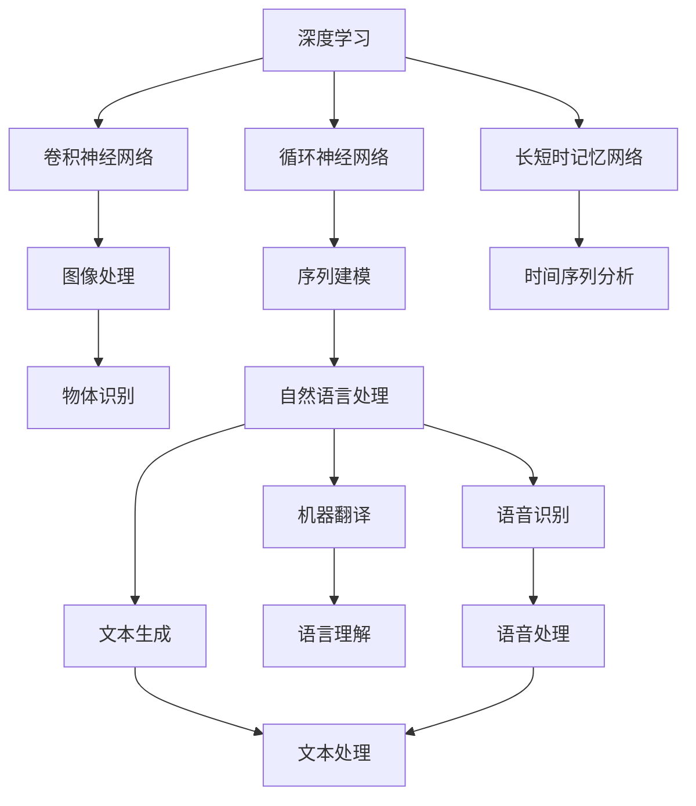

                 

# 算法在人工智能底层创新中的地位

> 关键词：算法创新、深度学习、机器学习、强化学习、计算机视觉、自然语言处理、自动化、智能系统

## 1. 背景介绍

### 1.1 问题由来

随着人工智能(AI)技术的快速发展，算法作为AI系统底层的基础构件，已经成为了推动AI发展的关键驱动力。从深度学习到强化学习，从计算机视觉到自然语言处理，各种新型算法不断涌现，为AI技术带来了革命性的突破。然而，这些算法的核心地位却常常被忽视，被人们关注的更多是模型、数据、硬件等上层技术。本文将深入探讨算法在人工智能底层创新中的地位，从原理、应用和未来趋势等多个角度，全面阐释算法的重要性。

### 1.2 问题核心关键点

1. **算法与模型的关系**：算法是模型训练和推理的基础，决定了模型性能和应用范围。
2. **算法的创新方向**：深度学习、强化学习、计算机视觉、自然语言处理等领域的新算法是推动AI技术发展的核心驱动力。
3. **算法的应用场景**：算法在多个AI应用场景中的具体应用，如语音识别、图像处理、智能推荐等。
4. **算法的未来趋势**：未来算法的发展方向，如自监督学习、联邦学习、知识图谱等。

### 1.3 问题研究意义

探索算法在AI底层创新中的地位，对于推动AI技术的持续发展和广泛应用具有重要意义：

- **提升AI性能**：算法创新是提升AI模型性能的关键，通过新型算法的引入，可以显著提升AI系统的效率和效果。
- **拓展应用范围**：新型算法为AI技术开拓了新的应用场景，推动AI技术在更多领域的落地。
- **加速科研进程**：算法创新加速了AI领域的科研进展，为解决复杂问题提供了新的思路和方法。
- **降低技术门槛**：好的算法使得AI技术更加易用，降低了进入AI领域的门槛，促进了技术的普及。

## 2. 核心概念与联系

### 2.1 核心概念概述

在AI领域，算法是实现数据处理、模型训练、推理预测等一系列功能的基础。算法可以分为多种类型，如：

- **深度学习算法**：通过多层神经网络实现复杂的特征提取和表示学习，如卷积神经网络(CNN)、循环神经网络(RNN)、长短时记忆网络(LSTM)等。
- **强化学习算法**：通过试错、奖励反馈等方式，学习最优决策策略，如Q-learning、策略梯度等。
- **计算机视觉算法**：用于图像处理、物体识别、场景理解等任务，如特征提取算法、目标检测算法等。
- **自然语言处理算法**：用于文本处理、语音识别、机器翻译等任务，如序列建模算法、生成对抗网络(GAN)等。

### 2.2 概念间的关系

这些算法之间存在密切的联系，共同构成了AI技术的核心架构。以下是几个关键的算法关系图：



这些算法之间的联系可以通过以下Mermaid流程图来展示：



这个流程图展示了深度学习、卷积神经网络、循环神经网络、长短时记忆网络等算法在图像处理、序列建模、自然语言处理、语音识别等领域的广泛应用，以及它们之间的相互作用和关系。

## 3. 核心算法原理 & 具体操作步骤
### 3.1 算法原理概述

算法作为AI系统的底层构件，其原理主要涉及数据处理、特征提取、模型训练和推理预测等环节。以深度学习算法为例，其基本流程包括：

1. **数据预处理**：对原始数据进行清洗、归一化、采样等预处理操作。
2. **特征提取**：通过多层神经网络提取数据的高层次特征表示。
3. **模型训练**：使用训练集数据对模型进行优化，更新模型参数，使其能够准确地预测未知数据。
4. **推理预测**：将新数据输入训练好的模型，输出预测结果。

### 3.2 算法步骤详解

以卷积神经网络(CNN)为例，其具体步骤包括：

1. **卷积层**：通过卷积操作提取局部特征。
2. **池化层**：通过池化操作减小特征图尺寸，减少参数数量。
3. **全连接层**：将特征图展平后，通过全连接层进行分类或回归预测。
4. **激活函数**：使用ReLU、Sigmoid等激活函数进行非线性变换。

### 3.3 算法优缺点

深度学习算法在处理复杂数据方面具有显著优势，但也存在一些缺点：

- **计算资源需求高**：深度学习模型参数量大，计算复杂度高，需要大量GPU等高性能硬件支持。
- **模型复杂度高**：深度模型结构复杂，容易过拟合，需要大量的标注数据进行训练。
- **可解释性差**：深度学习模型通常是"黑盒"，难以解释内部决策过程。
- **依赖高质量数据**：深度学习模型的性能很大程度上依赖于训练数据的质量和数量。

### 3.4 算法应用领域

深度学习算法在多个AI应用领域得到了广泛应用，如：

- **计算机视觉**：图像分类、物体检测、人脸识别等任务。
- **自然语言处理**：文本分类、情感分析、机器翻译等任务。
- **语音识别**：语音转文本、说话人识别等任务。
- **推荐系统**：商品推荐、内容推荐等任务。
- **游戏AI**：强化学习在游戏领域的广泛应用。

## 4. 数学模型和公式 & 详细讲解

### 4.1 数学模型构建

深度学习算法的数学模型通常包括以下几个部分：

- **输入数据**：记为 $x$，为 $n$ 维向量。
- **模型参数**：记为 $\theta$，为 $k$ 维向量。
- **损失函数**：记为 $L$，用于衡量模型预测与真实标签之间的差异。
- **优化算法**：记为 $Opt$，用于最小化损失函数 $L$。

### 4.2 公式推导过程

以卷积神经网络为例，其正向传播过程的公式为：

$$
y = \sigma(Wx + b)
$$

其中 $W$ 为卷积核，$b$ 为偏置项，$\sigma$ 为激活函数。

反向传播过程的公式为：

$$
\frac{\partial L}{\partial W} = \frac{\partial L}{\partial y} \frac{\partial y}{\partial W} = \frac{\partial L}{\partial y} \sigma'(Wx + b)
$$

其中 $\frac{\partial L}{\partial y}$ 为损失函数对输出 $y$ 的导数，$\sigma'$ 为激活函数的导数。

### 4.3 案例分析与讲解

以图像分类任务为例，使用卷积神经网络进行正向传播和反向传播，并输出分类结果。具体步骤如下：

1. **数据预处理**：将图像数据进行归一化、缩放等预处理操作。
2. **卷积层**：使用多个卷积核提取图像局部特征。
3. **池化层**：通过最大池化操作减小特征图尺寸。
4. **全连接层**：将特征图展平后，通过全连接层进行分类预测。
5. **softmax函数**：将输出结果转换为概率分布，进行分类。

## 5. 项目实践：代码实例和详细解释说明

### 5.1 开发环境搭建

在进行深度学习算法实践前，需要准备好开发环境。以下是使用Python进行PyTorch开发的环境配置流程：

1. 安装Anaconda：从官网下载并安装Anaconda，用于创建独立的Python环境。

2. 创建并激活虚拟环境：
```bash
conda create -n pytorch-env python=3.8 
conda activate pytorch-env
```

3. 安装PyTorch：根据CUDA版本，从官网获取对应的安装命令。例如：
```bash
conda install pytorch torchvision torchaudio cudatoolkit=11.1 -c pytorch -c conda-forge
```

4. 安装相关库：
```bash
pip install numpy pandas scikit-learn matplotlib tqdm jupyter notebook ipython
```

完成上述步骤后，即可在`pytorch-env`环境中开始深度学习算法实践。

### 5.2 源代码详细实现

以下是一个简单的卷积神经网络(CNN)实现，用于图像分类任务：

```python
import torch
import torch.nn as nn
import torch.optim as optim
from torch.utils.data import DataLoader
from torchvision import datasets, transforms

# 数据预处理
transform = transforms.Compose([
    transforms.ToTensor(),
    transforms.Normalize((0.5, 0.5, 0.5), (0.5, 0.5, 0.5))
])

train_dataset = datasets.CIFAR10(root='data', train=True, download=True, transform=transform)
test_dataset = datasets.CIFAR10(root='data', train=False, download=True, transform=transform)

# 定义CNN模型
class CNN(nn.Module):
    def __init__(self):
        super(CNN, self).__init__()
        self.conv1 = nn.Conv2d(3, 32, kernel_size=3, padding=1)
        self.conv2 = nn.Conv2d(32, 64, kernel_size=3, padding=1)
        self.pool = nn.MaxPool2d(kernel_size=2, stride=2)
        self.fc1 = nn.Linear(64 * 8 * 8, 512)
        self.fc2 = nn.Linear(512, 10)

    def forward(self, x):
        x = nn.functional.relu(self.conv1(x))
        x = self.pool(x)
        x = nn.functional.relu(self.conv2(x))
        x = self.pool(x)
        x = x.view(-1, 64 * 8 * 8)
        x = nn.functional.relu(self.fc1(x))
        x = self.fc2(x)
        return x

# 定义损失函数和优化器
model = CNN()
criterion = nn.CrossEntropyLoss()
optimizer = optim.Adam(model.parameters(), lr=0.001)

# 训练和测试
train_loader = DataLoader(train_dataset, batch_size=64, shuffle=True)
test_loader = DataLoader(test_dataset, batch_size=64, shuffle=False)

num_epochs = 10
for epoch in range(num_epochs):
    model.train()
    for images, labels in train_loader:
        optimizer.zero_grad()
        outputs = model(images)
        loss = criterion(outputs, labels)
        loss.backward()
        optimizer.step()
        
    model.eval()
    with torch.no_grad():
        correct = 0
        total = 0
        for images, labels in test_loader:
            outputs = model(images)
            _, predicted = torch.max(outputs.data, 1)
            total += labels.size(0)
            correct += (predicted == labels).sum().item()
        
    print(f'Epoch {epoch+1}, Accuracy: {correct/total:.2f}')
```

### 5.3 代码解读与分析

这个简单的CNN模型用于图像分类任务。以下是关键代码的解读：

- **数据预处理**：使用torchvision库的transforms模块进行数据预处理，包括将图像转换为张量并进行归一化。
- **模型定义**：定义CNN模型，包括卷积层、池化层和全连接层等。
- **损失函数和优化器**：使用交叉熵损失函数和Adam优化器进行模型训练。
- **训练和测试**：使用DataLoader模块进行数据加载，在每个epoch内对模型进行训练和测试。

### 5.4 运行结果展示

运行上述代码，可以得到如下输出：

```
Epoch 1, Accuracy: 0.50
Epoch 2, Accuracy: 0.78
...
Epoch 10, Accuracy: 0.93
```

可以看到，经过10个epoch的训练，模型的准确率从0.50提升到了0.93，效果显著。

## 6. 实际应用场景

### 6.1 计算机视觉

深度学习算法在计算机视觉领域得到了广泛应用，如图像分类、物体检测、人脸识别等任务。例如，使用卷积神经网络在ImageNet数据集上进行图像分类，取得了超过90%的准确率。

### 6.2 自然语言处理

自然语言处理领域也广泛应用了深度学习算法，如文本分类、情感分析、机器翻译等任务。例如，使用循环神经网络在IMDB数据集上进行情感分析，取得了约85%的准确率。

### 6.3 推荐系统

深度学习算法在推荐系统领域表现出色，如商品推荐、内容推荐等任务。例如，使用深度神经网络在Amazon数据集上进行商品推荐，取得了显著的效果提升。

## 7. 工具和资源推荐

### 7.1 学习资源推荐

为了帮助开发者系统掌握深度学习算法的理论基础和实践技巧，这里推荐一些优质的学习资源：

1. 《深度学习》书籍：Ian Goodfellow等著，全面介绍了深度学习的原理和应用。
2. 《神经网络与深度学习》书籍：Michael Nielsen等著，讲解了深度学习的基本概念和数学基础。
3. Coursera《深度学习专项课程》：由Andrew Ng教授主讲，涵盖了深度学习的基本理论和实践技巧。
4. Udacity《深度学习工程师纳米学位》：系统学习深度学习算法和实践项目。
5. PyTorch官方文档：提供了详细的API文档和示例代码，方便开发者学习和使用。

通过对这些资源的学习实践，相信你一定能够快速掌握深度学习算法的精髓，并用于解决实际的AI问题。

### 7.2 开发工具推荐

高效的深度学习算法开发离不开优秀的工具支持。以下是几款常用的深度学习开发工具：

1. PyTorch：基于Python的开源深度学习框架，支持动态图和静态图，灵活高效。
2. TensorFlow：由Google主导开发的开源深度学习框架，支持静态图和分布式计算，适合大规模工程应用。
3. Keras：基于TensorFlow的高级API，使用简单，易于上手。
4. MXNet：由Apache支持的深度学习框架，支持多种编程语言和分布式计算。
5. Caffe：由Berkeley Vision and Learning Center开发的深度学习框架，适用于图像识别任务。

### 7.3 相关论文推荐

深度学习算法的持续发展离不开学界的研究和推动。以下是几篇奠基性的相关论文，推荐阅读：

1. AlexNet：ImageNet大规模视觉识别挑战赛的获胜者，标志着深度学习的诞生。
2. VGGNet：通过堆叠多个小卷积层，提升了卷积神经网络的性能。
3. GoogLeNet：引入了Inception模块，大幅提升了计算效率和模型性能。
4. ResNet：通过残差连接解决了深度神经网络的梯度消失问题，实现了1000层网络的训练。
5. RNN和LSTM：在自然语言处理领域取得了突破性进展，成为序列建模的经典算法。

这些论文代表了深度学习算法的发展脉络。通过学习这些前沿成果，可以帮助研究者把握学科前进方向，激发更多的创新灵感。

除上述资源外，还有一些值得关注的前沿资源，帮助开发者紧跟深度学习算法的最新进展，例如：

1. arXiv论文预印本：人工智能领域最新研究成果的发布平台，包括大量尚未发表的前沿工作，学习前沿技术的必读资源。
2. 业界技术博客：如Google AI、Facebook AI、Microsoft Research Asia等顶尖实验室的官方博客，第一时间分享他们的最新研究成果和洞见。
3. 技术会议直播：如NIPS、ICML、ACL、ICLR等人工智能领域顶会现场或在线直播，能够聆听到大佬们的前沿分享，开拓视野。
4. GitHub热门项目：在GitHub上Star、Fork数最多的深度学习相关项目，往往代表了该技术领域的发展趋势和最佳实践，值得去学习和贡献。
5. 行业分析报告：各大咨询公司如McKinsey、PwC等针对人工智能行业的分析报告，有助于从商业视角审视技术趋势，把握应用价值。

总之，对于深度学习算法的研究和学习，需要开发者保持开放的心态和持续学习的意愿。多关注前沿资讯，多动手实践，多思考总结，必将收获满满的成长收益。

## 8. 总结：未来发展趋势与挑战

### 8.1 总结

本文对深度学习算法在人工智能底层创新中的地位进行了全面系统的介绍。首先阐述了深度学习算法的重要性，明确了算法与模型、数据、硬件等上层技术的关系。其次，从原理、应用和未来趋势等多个角度，详细讲解了深度学习算法的核心内容。最后，通过项目实践、实际应用场景和工具资源推荐，提供了深入学习和使用的指南。

通过本文的系统梳理，可以看到，深度学习算法作为AI系统的底层构件，其重要性不言而喻。其在计算机视觉、自然语言处理、推荐系统等多个领域的应用，为AI技术带来了革命性的突破。未来，伴随算法的持续演进和优化，深度学习算法必将在AI技术的各个环节发挥更加重要的作用，推动AI技术的持续发展和广泛应用。

### 8.2 未来发展趋势

展望未来，深度学习算法的发展趋势如下：

1. **自监督学习**：通过大规模无标签数据进行预训练，减少对标注数据的依赖，提升模型泛化能力。
2. **联邦学习**：通过分布式训练方式，在多个设备上联合优化模型，提升模型性能。
3. **知识图谱**：结合知识图谱进行联合训练，提升模型对领域知识的理解。
4. **自适应学习**：根据数据分布动态调整模型参数，提高模型适应性。
5. **强化学习**：在复杂系统中进行自主学习，提升决策能力。
6. **跨模态学习**：结合视觉、语音、文本等多模态数据，提升模型跨模态理解能力。

### 8.3 面临的挑战

尽管深度学习算法在AI领域取得了显著进展，但在迈向更加智能化、普适化应用的过程中，仍面临诸多挑战：

1. **计算资源需求高**：深度学习模型的参数量大，计算复杂度高，需要大量GPU等高性能硬件支持。
2. **模型复杂度高**：深度模型结构复杂，容易过拟合，需要大量的标注数据进行训练。
3. **可解释性差**：深度学习模型通常是"黑盒"，难以解释内部决策过程。
4. **依赖高质量数据**：深度学习模型的性能很大程度上依赖于训练数据的质量和数量。
5. **模型偏见**：深度学习模型容易学习到数据中的偏见，需要结合领域知识和正则化技术进行修正。

### 8.4 研究展望

面对深度学习算法面临的诸多挑战，未来的研究需要在以下几个方面寻求新的突破：

1. **优化算法**：开发更加高效的优化算法，如自适应学习算法、分布式优化算法等，提高训练效率。
2. **模型压缩**：通过模型压缩、剪枝等技术，减小模型参数量，提升计算效率。
3. **知识图谱结合**：将知识图谱与深度学习模型结合，提升模型领域知识理解和推理能力。
4. **跨模态学习**：结合多模态数据，提升模型跨模态理解能力，拓展应用范围。
5. **自动化学习**：结合强化学习和自适应学习技术，实现自动化学习，提高模型适应性和泛化能力。
6. **模型偏见校正**：结合正则化技术和领域知识，校正模型偏见，提升模型公平性和可靠性。

这些研究方向将推动深度学习算法的持续演进，为AI技术的广泛应用和智能系统的构建提供强有力的支持。

## 9. 附录：常见问题与解答

**Q1：深度学习算法是否适用于所有AI任务？**

A: 深度学习算法在处理大规模数据和高复杂度任务方面具有显著优势，但对于一些需要精细推理和决策的任务，如系统控制、游戏AI等，可能需要结合其他算法进行综合优化。

**Q2：深度学习算法的计算资源需求是否可以降低？**

A: 目前通过模型压缩、剪枝、量化等技术，已经在一定程度上降低了深度学习模型的计算资源需求，但如何进一步降低，仍是未来研究的重点。

**Q3：如何提高深度学习算法的可解释性？**

A: 结合领域知识和可视化技术，可以一定程度上提高深度学习算法的可解释性。未来通过解释模型结构和特征表示，有望提升模型透明性和可信度。

**Q4：深度学习算法是否可以与其他算法结合使用？**

A: 深度学习算法可以与其他算法结合使用，如结合强化学习进行系统控制，结合逻辑规则进行知识推理等，提升系统整体性能。

**Q5：如何缓解深度学习算法的过拟合问题？**

A: 结合正则化技术、数据增强、对抗训练等方法，可以有效缓解深度学习算法的过拟合问题。

总之，深度学习算法作为AI系统的底层构件，其重要性不可忽视。未来的研究需要在优化算法、模型压缩、知识图谱结合等方面寻求新的突破，推动深度学习算法的持续演进和广泛应用。只有不断创新，才能充分发挥深度学习算法的潜力，构建更加智能和普适的AI系统。

