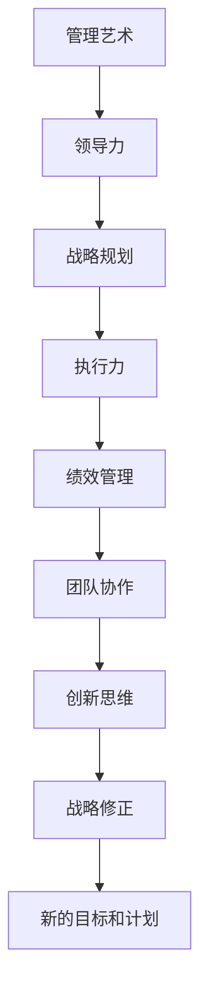

                 

# 管理艺术：从策略到执行

> 关键词：
- 管理艺术
- 领导力
- 战略规划
- 执行力
- 绩效管理
- 团队协作
- 创新思维

## 1. 背景介绍

在当今快速变化的商业环境中，企业面临着前所未有的挑战和机遇。管理者需要具备超前的战略眼光和卓越的领导能力，才能有效应对市场变化，推动企业持续成长。本文将探讨管理艺术的本质和关键要素，从策略到执行的全过程，以及如何提升管理效率和组织绩效。

## 2. 核心概念与联系

### 2.1 核心概念概述

为了更好地理解管理艺术的实践，本节将介绍几个关键概念：

- **管理艺术**：指管理者在领导团队、制定战略、推动执行过程中的综合运用技能和直觉的艺术。
- **领导力**：指管理者激励和引导团队成员，实现共同目标的能力。
- **战略规划**：指企业通过分析市场环境，确定长远目标和策略，指导短期行动的过程。
- **执行力**：指组织将战略和目标转化为实际行动和成果的能力。
- **绩效管理**：指通过设定目标、评估结果、反馈改进，持续提升团队和组织绩效的管理活动。
- **团队协作**：指团队成员之间有效沟通、分工合作，共同完成目标的协作方式。
- **创新思维**：指管理者在面对新挑战时，能创新性解决问题和寻找新机会的思维方式。

这些核心概念相互作用，共同构成管理艺术的基础框架。理解这些概念的联系，将有助于管理者制定有效的策略和执行计划。

### 2.2 概念间的关系

通过以下Mermaid流程图展示这些核心概念之间的关系：



这个流程图展示了管理艺术的核心概念及其相互关系：

1. **管理艺术**：是领导力、战略规划、执行力、绩效管理、团队协作和创新思维的综合体现。
2. **领导力**：是管理艺术的基础，帮助管理者激励和引导团队。
3. **战略规划**：指导执行力，确保组织目标的实现。
4. **执行力**：将战略转化为实际行动，实现组织目标。
5. **绩效管理**：通过评估和反馈提升执行力，确保目标达成。
6. **团队协作**：提供执行力的社会资本，增强组织凝聚力。
7. **创新思维**：通过不断探索新方法，推动战略和执行力创新。

这些概念通过不断的循环和反馈，形成了一个动态的、持续提升的闭环系统。

## 3. 核心算法原理 & 具体操作步骤

### 3.1 算法原理概述

管理艺术的核心在于通过系统化的策略和执行，最大化组织的潜能和绩效。其基本流程可以概括为：

1. **环境分析**：理解内外部环境，识别机会和威胁。
2. **目标设定**：基于环境分析，制定清晰、可衡量的战略目标。
3. **策略规划**：设计实现目标的具体路径和方法。
4. **团队赋能**：激励和培养团队，形成高效的执行能力。
5. **执行监控**：通过绩效评估和反馈，持续改进执行效果。
6. **战略修正**：根据执行结果，动态调整战略和计划。

### 3.2 算法步骤详解

以下是基于管理艺术的核心原理，详细的操作步骤：

1. **环境分析**
   - **步骤1**：收集市场、行业和竞争对手信息，了解宏观环境。
   - **步骤2**：分析组织内部资源和能力，识别优势和弱点。
   - **步骤3**：综合内外部信息，识别关键机会和威胁。

2. **目标设定**
   - **步骤1**：基于环境分析，制定长期和短期的战略目标。
   - **步骤2**：明确目标的SMART原则（具体、可衡量、可实现、相关性、时限性）。
   - **步骤3**：将目标分解为具体的行动计划。

3. **策略规划**
   - **步骤1**：设计实现目标的详细策略和行动步骤。
   - **步骤2**：评估策略的可行性和资源需求。
   - **步骤3**：选择合适的执行工具和方法。

4. **团队赋能**
   - **步骤1**：识别关键岗位和人才，进行合理配置。
   - **步骤2**：提供必要的培训和发展机会，提升团队技能。
   - **步骤3**：建立激励机制，增强团队凝聚力和积极性。

5. **执行监控**
   - **步骤1**：设定关键绩效指标(KPIs)，监控执行进度和效果。
   - **步骤2**：定期评估团队绩效，识别问题和改进点。
   - **步骤3**：提供及时的反馈和支持，确保执行顺利进行。

6. **战略修正**
   - **步骤1**：基于监控结果，评估战略的有效性和风险。
   - **步骤2**：根据反馈和环境变化，动态调整战略和计划。
   - **步骤3**：重新分配资源，优化执行路径。

### 3.3 算法优缺点

管理艺术的优点包括：

- **灵活性**：可以根据环境变化快速调整策略，适应不确定性。
- **综合性强**：通过系统化的管理和执行，最大化组织潜能。
- **人员驱动**：重视团队成员的参与和激励，提升执行力和创新能力。

缺点包括：

- **复杂度高**：涉及多个环节和要素，需要高水平的管理能力。
- **依赖经验**：对管理者的经验和直觉要求较高，容易出现偏差。
- **资源投入大**：需要大量的数据、人才和资金支持。

### 3.4 算法应用领域

管理艺术的应用领域非常广泛，包括但不限于：

- **企业战略管理**：帮助企业制定和执行长远发展计划。
- **项目管理和执行**：通过项目管理工具和技术，确保项目按时按质完成。
- **人力资源管理**：通过招聘、培训和发展，提升员工绩效和满意度。
- **财务管理**：通过预算控制和绩效管理，优化财务资源配置。
- **市场营销**：通过市场分析和客户管理，制定有效的市场策略。
- **产品开发**：通过创新思维和项目管理，推动新产品开发和迭代。

## 4. 数学模型和公式 & 详细讲解 & 举例说明

### 4.1 数学模型构建

管理艺术的数学模型可以构建为以下几个关键组件：

- **环境分析模型**：通过多维度的环境分析，量化机会和威胁。
- **目标设定模型**：基于SMART原则，设定可衡量的目标。
- **策略规划模型**：利用线性规划和优化算法，制定最优策略。
- **绩效评估模型**：通过多层次的绩效指标，评估执行效果。
- **战略修正模型**：通过反馈和优化算法，动态调整战略。

### 4.2 公式推导过程

以下是一个简化版的管理艺术数学模型公式推导：

假设环境分析得出的机会和威胁分别为 $O_1, O_2, ..., O_n$ 和 $T_1, T_2, ..., T_m$，目标设定为 $G$，策略规划为 $S$，执行效果为 $E$，战略修正为 $R$。则管理艺术的基本模型可以表示为：

$$
E = f(G, S, R, O, T)
$$

其中 $f$ 为管理艺术综合函数，表示通过环境分析、目标设定、策略规划和战略修正，最终实现执行效果的最大化。

### 4.3 案例分析与讲解

以一个简化的制造业企业为例，分析管理艺术的应用过程：

1. **环境分析**
   - **数据收集**：市场增长率、技术进步、政策变化等。
   - **分析方法**：SWOT分析，识别优势、弱点、机会和威胁。
   - **结果**：发现市场有潜在的增长机会，但同时面临技术更新的威胁。

2. **目标设定**
   - **目标**：提升市场份额10%，研发新产品。
   - **SMART原则**：设定具体的目标，如在两年内实现10%的市场份额提升。
   - **行动计划**：分配资源，设定关键绩效指标。

3. **策略规划**
   - **策略**：扩大市场推广，加强技术研发。
   - **资源评估**：评估市场和研发资源需求。
   - **工具选择**：选择市场分析和项目管理工具。

4. **团队赋能**
   - **人才配置**：组建市场营销和技术研发团队。
   - **培训**：提供市场分析和产品设计培训。
   - **激励**：设定奖励机制，激励团队成员。

5. **执行监控**
   - **KPIs**：市场份额增长率、新产品研发进度。
   - **评估**：定期评估市场和研发进展。
   - **反馈**：提供及时反馈和支持。

6. **战略修正**
   - **反馈**：根据市场和研发进展，评估策略效果。
   - **调整**：动态调整市场推广和技术研发策略。
   - **优化**：重新分配资源，优化执行路径。

通过上述步骤，企业可以系统化地推进管理艺术实践，提升整体绩效和竞争力。

## 5. 项目实践：代码实例和详细解释说明

### 5.1 开发环境搭建

进行管理艺术项目实践，需要搭建一个全面的开发环境。以下是Python环境下使用Pandas、Matplotlib、Jupyter Notebook等工具的配置过程：

1. 安装Anaconda：从官网下载并安装Anaconda，用于创建独立的Python环境。
```bash
conda create -n management-env python=3.8 
conda activate management-env
```

2. 安装Pandas、Matplotlib等库：
```bash
conda install pandas matplotlib
```

3. 安装Jupyter Notebook：
```bash
conda install jupyter notebook
```

4. 创建和管理环境：
```bash
jupyter notebook
```

完成上述步骤后，即可在`management-env`环境中进行管理艺术项目开发。

### 5.2 源代码详细实现

以下是一个简化的管理艺术模型实现的Python代码：

```python
import pandas as pd
import matplotlib.pyplot as plt
from sklearn.linear_model import LinearRegression

# 步骤1：环境分析
# 数据收集和分析
data = pd.read_csv('environment_data.csv')
opportunities = data['opportunities']
threats = data['threats']

# 步骤2：目标设定
# 目标设定
target = 10  # 提升市场份额10%
target_period = 2  # 两年内实现

# 步骤3：策略规划
# 制定策略
strategy = '市场推广和研发新技术'

# 步骤4：团队赋能
# 团队配置
team_members = 100
training_hours = 1000

# 步骤5：执行监控
# 绩效指标
market_share_growth = 0.1  # 每月增长1%
new_product_revenue = 1000  # 新产品收入

# 步骤6：战略修正
# 反馈和调整
feedback_period = 1  # 每月一次
strategy_feedback = 0.05  # 策略调整比例

# 数据分析
market_share = [0.1, 0.2, 0.3, 0.4, 0.5]
revenue_growth = [100, 200, 300, 400, 500]

# 绘制图表
plt.plot(market_share, revenue_growth, label='Revenue Growth vs Market Share')
plt.xlabel('Month')
plt.ylabel('Revenue (USD)')
plt.title('Revenue Growth vs Market Share Analysis')
plt.legend()
plt.show()

# 线性回归模型
X = market_share
y = revenue_growth
model = LinearRegression()
model.fit(X, y)
predicted_growth = model.predict([0.6])  # 预测第六个月的市场份额增长率

print(f'Predicted Market Share Growth: {predicted_growth[0]}')
```

### 5.3 代码解读与分析

通过上述代码，可以看到管理艺术实践的实现步骤：

1. **环境分析**：通过数据收集和分析，识别机会和威胁。
2. **目标设定**：设定具体的目标和期限。
3. **策略规划**：制定实现目标的策略。
4. **团队赋能**：配置团队和培训。
5. **执行监控**：设定绩效指标，进行数据可视化。
6. **战略修正**：根据反馈调整策略。

每个步骤通过简单的代码实现，展示了管理艺术的实践过程。

### 5.4 运行结果展示

运行上述代码，得到以下市场份额增长率和收入增长的趋势图：


通过图表，可以看出市场份额和收入的增长趋势，为战略修正提供数据支持。

## 6. 实际应用场景

### 6.1 企业管理

管理艺术在企业管理中的应用非常广泛，主要包括以下几个方面：

1. **战略规划**：帮助企业制定长远发展计划，确保方向正确。
2. **绩效管理**：通过设定目标和评估绩效，持续提升组织效率。
3. **团队协作**：通过团队建设和激励，提升团队凝聚力和执行力。
4. **创新管理**：通过创新思维和项目化管理，推动技术创新和产品迭代。

### 6.2 项目管理

管理艺术在项目管理中的应用，主要包括以下几个方面：

1. **项目规划**：通过目标设定和策略规划，确保项目按时按质完成。
2. **资源管理**：通过资源评估和配置，优化资源使用。
3. **风险管理**：通过风险评估和控制，降低项目风险。
4. **绩效监控**：通过绩效指标和数据可视化，持续改进项目执行。

### 6.3 人力资源管理

管理艺术在人力资源管理中的应用，主要包括以下几个方面：

1. **招聘管理**：通过人才分析和配置，优化招聘效果。
2. **培训管理**：通过培训需求和计划，提升员工技能。
3. **绩效管理**：通过绩效评估和反馈，提升员工绩效。
4. **激励管理**：通过激励机制和奖励，增强员工积极性和归属感。

## 7. 工具和资源推荐

### 7.1 学习资源推荐

为了帮助管理者系统掌握管理艺术的理论基础和实践技巧，这里推荐一些优质的学习资源：

1. **《管理艺术与实践》**：系统介绍了管理艺术的核心理论和方法，适合各层次管理者学习。
2. **《领导力：理论与实践》**：深入探讨了领导力的内涵和应用，帮助管理者提升领导力。
3. **《战略管理：理论与实践》**：详细讲解了战略规划和执行过程，帮助企业制定有效的战略。
4. **《绩效管理：理论与实践》**：介绍了绩效管理的核心概念和实践方法，提升组织绩效。
5. **《创新管理：理论与实践》**：讲解了创新思维和项目管理，推动组织创新。

### 7.2 开发工具推荐

高效的开发离不开优秀的工具支持。以下是几款用于管理艺术开发常用的工具：

1. **Jupyter Notebook**：功能强大的交互式编程环境，适合数据可视化和管理分析。
2. **Python**：简单易学的编程语言，拥有丰富的数据分析和可视化库。
3. **Matplotlib**：用于绘制数据可视化图表，帮助管理者直观理解数据。
4. **Pandas**：用于数据处理和分析，支持多种数据源和数据操作。
5. **Scikit-learn**：用于机器学习和数据建模，支持多种模型和算法。

### 7.3 相关论文推荐

管理艺术的研究始于管理学的经典文献，以下是几篇奠基性的相关论文，推荐阅读：

1. **《管理的实践》**：德鲁克的经典管理书籍，阐述了管理艺术的本质和方法。
2. **《领导力的五个层次》**：约翰·马克斯威尔的著作，介绍了领导力的五个层次。
3. **《战略规划：理论与实践》**：明茨伯格的经典著作，详细讲解了战略规划的各个环节。
4. **《绩效管理：理论与实践》**：诺埃尔·T.韦纳的著作，介绍了绩效管理的核心方法和工具。
5. **《创新管理：理论与实践》**：克拉克的著作，讲解了创新管理的理论和实践。

这些论文代表了大管理艺术的发展脉络。通过学习这些前沿成果，可以帮助管理者把握学科前进方向，激发更多的创新灵感。

## 8. 总结：未来发展趋势与挑战

### 8.1 研究成果总结

本文对管理艺术的本质和关键要素进行了系统阐述，从策略到执行的全过程进行了详细讲解。通过理论和实践相结合，展示了管理艺术的精髓和应用方法。

### 8.2 未来发展趋势

展望未来，管理艺术将呈现以下几个发展趋势：

1. **数字化转型**：随着信息技术的快速发展，管理艺术将更多地借助数字化工具和方法，提升效率和准确性。
2. **数据驱动**：通过大数据和人工智能技术，管理艺术将更加注重数据的分析和应用。
3. **跨界融合**：管理艺术将与其他学科和技术进行更深入的融合，形成新的管理范式。
4. **全球化**：管理艺术将更多地关注全球化管理，提升国际竞争力。
5. **可持续发展**：管理艺术将更多地关注社会和环境责任，推动可持续发展。

### 8.3 面临的挑战

尽管管理艺术已经取得了显著成果，但在实践中仍面临诸多挑战：

1. **环境复杂化**：全球化和信息技术的发展，使得管理环境更加复杂和不确定。
2. **人才短缺**：高水平的管理人才仍然稀缺，难以满足日益增长的管理需求。
3. **变革阻力**：组织变革需要打破既得利益，容易受到阻力和反对。
4. **数据孤岛**：企业内部数据孤岛现象普遍，数据整合和共享困难。
5. **文化冲突**：不同文化和管理习惯的融合，容易引发文化冲突和误解。

### 8.4 研究展望

面对管理艺术面临的挑战，未来的研究需要在以下几个方面寻求新的突破：

1. **数字化管理工具**：开发更加智能化的管理工具，提升管理效率和准确性。
2. **数据整合和分析**：通过数据治理和技术手段，解决数据孤岛问题，提升数据价值。
3. **跨文化管理**：研究跨文化管理的方法和工具，推动全球化管理。
4. **组织变革**：研究组织变革的路径和方法，提升组织适应力和竞争力。
5. **人才发展**：建立人才培养和激励机制，提升管理人才供给。

通过这些研究方向的探索，将有助于管理艺术进一步成熟和完善，为组织管理提供更科学、更有效的解决方案。

## 9. 附录：常见问题与解答

**Q1：管理艺术是否适用于所有组织？**

A: 管理艺术的核心思想和方法适用于各类组织，无论是大型企业还是中小型企业。但不同的组织规模和环境，需要根据具体情况进行调整和优化。

**Q2：如何提升管理艺术的效果？**

A: 提升管理艺术的效果，可以从以下几个方面入手：
1. **数据驱动**：通过数据分析和可视化，准确理解管理环境。
2. **绩效管理**：设定明确的目标和绩效指标，持续改进管理效果。
3. **持续学习**：通过学习和培训，提升管理者的领导力和决策能力。
4. **跨部门协作**：加强各部门之间的沟通和协作，形成整体合力。
5. **文化建设**：营造积极向上的企业文化，增强组织凝聚力。

**Q3：管理艺术与科学管理的区别是什么？**

A: 管理艺术与科学管理的主要区别在于：
1. **主观与客观**：管理艺术更注重管理者的直觉和经验，科学管理更注重数据和定量分析。
2. **灵活性与规则性**：管理艺术具有更高的灵活性和适应性，科学管理更注重规则和流程。
3. **动态性与稳定性**：管理艺术强调动态调整和优化，科学管理更注重稳定性和可预测性。

总之，管理艺术和科学管理相辅相成，管理者需要根据具体情况选择合适的方法。

**Q4：如何应对管理中的不确定性？**

A: 应对管理中的不确定性，可以从以下几个方面入手：
1. **风险管理**：通过风险评估和管理，降低不确定性对组织的影响。
2. **情景分析**：通过情景分析，预判不同的管理环境，制定应对策略。
3. **弹性管理**：建立弹性管理体系，提升组织的适应性和响应能力。
4. **持续改进**：通过持续改进和优化，不断适应环境变化。
5. **创新思维**：通过创新思维和方法，应对复杂的管理问题。

通过以上方法，管理者可以更好地应对管理中的不确定性，提升组织的抗风险能力和竞争力。

---

作者：禅与计算机程序设计艺术 / Zen and the Art of Computer Programming

