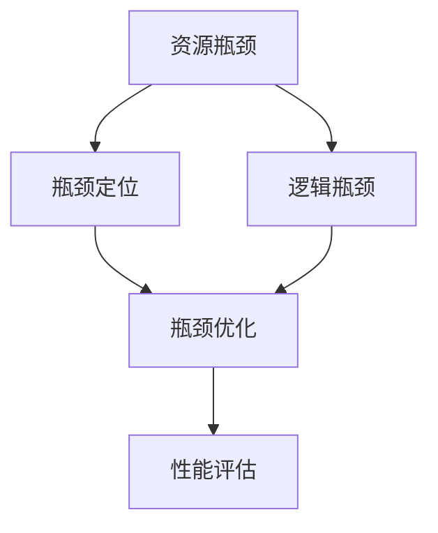

                 

# 系统瓶颈分析与实例优化

在软件工程中，系统瓶颈（System Bottlenecks）指的是系统性能的最差部分，往往是限制整个系统性能提升的障碍。理解系统瓶颈并进行优化，是提升系统整体性能的关键。本文将系统瓶颈分为资源瓶颈和逻辑瓶颈两类，分别从概念、原理、实例、应用场景和未来发展趋势等多个角度进行深入探讨。

## 1. 背景介绍

### 1.1 问题由来

在软件开发和系统设计中，瓶颈问题是不可避免的。例如，某些模块的处理速度慢，或者某些组件的内存占用高，这些问题都会导致系统整体性能下降。系统瓶颈通常需要通过专业的性能分析工具进行检测，例如Gprof、Valgrind等。然而，单纯使用工具进行瓶颈定位并不能解决问题，还需要开发人员结合专业知识和经验进行深入分析和优化。

### 1.2 问题核心关键点

系统瓶颈分析的核心是找到性能最差的部分，通常是通过对系统的各项指标进行监控和分析，找出性能瓶颈的具体位置。瓶颈的位置可能是硬件资源（如CPU、内存、网络带宽等）不足，也可能是软件逻辑（如算法效率、数据结构设计等）存在问题。

优化瓶颈时需要考虑的问题包括：
- 瓶颈的具体位置在哪里？
- 瓶颈是静态的还是动态的？
- 瓶颈是资源瓶颈还是逻辑瓶颈？
- 瓶颈如何影响系统性能？
- 瓶颈的优化方案有哪些？

### 1.3 问题研究意义

优化系统瓶颈对于提升软件性能、降低资源消耗、提高用户体验有着重要的意义。通过有效的瓶颈分析和优化，可以实现以下目标：
- 提升系统的响应速度和吞吐量。
- 减少资源的浪费和占用，延长系统的生命周期。
- 提高用户满意度和系统可用性。
- 为后续的性能提升提供指导和参考。

## 2. 核心概念与联系

### 2.1 核心概念概述

系统瓶颈分析与优化涉及几个核心概念，这些概念之间相互关联，形成了一个完整的系统性能优化框架。

- **资源瓶颈（Resource Bottleneck）**：系统中的某个组件或模块由于资源不足而成为性能瓶颈。
- **逻辑瓶颈（Logical Bottleneck）**：系统中的某个组件或模块由于算法、数据结构设计不合理而成为性能瓶颈。
- **瓶颈定位（Bottleneck Identification）**：通过性能分析工具和诊断方法找到系统中的性能瓶颈。
- **瓶颈优化（Bottleneck Optimization）**：针对瓶颈的具体问题，采取有效的技术手段进行优化。
- **性能评估（Performance Evaluation）**：通过测试和评估工具，对优化后的系统进行性能验证和测试。

这些核心概念之间的联系可以通过以下Mermaid流程图来展示：



这个流程图展示了从资源瓶颈到逻辑瓶颈的整个系统性能优化流程。开发者首先通过瓶颈定位找到性能最差的部分，然后针对具体的瓶颈问题进行优化，最后通过性能评估验证优化的效果。

### 2.2 概念间的关系

这些核心概念之间存在着紧密的联系，形成了系统性能优化的完整生态系统。

- **资源瓶颈与逻辑瓶颈的区别**：资源瓶颈主要是硬件资源不足导致，而逻辑瓶颈主要是软件设计不合理导致。
- **瓶颈定位与瓶颈优化的关系**：瓶颈定位是瓶颈优化的前提，只有准确找到瓶颈位置，才能有针对性地进行优化。
- **瓶颈优化与性能评估的联系**：瓶颈优化是为了提升系统性能，而性能评估是为了验证优化的效果，两者是相互依赖的。

这些概念共同构成了系统性能优化的核心框架，为开发者提供了系统化的思路和工具。

## 3. 核心算法原理 & 具体操作步骤

### 3.1 算法原理概述

系统瓶颈优化通常涉及两个方面的内容：资源瓶颈优化和逻辑瓶颈优化。下面将详细介绍这两种瓶颈的优化原理。

**资源瓶颈优化**：
资源瓶颈优化主要是针对硬件资源（如CPU、内存、磁盘等）进行优化，通常采用以下几个策略：
- 硬件升级：通过增加硬件资源来提升系统性能。
- 资源共享：通过资源共享减少资源竞争，提高资源利用率。
- 资源分配：通过合理分配资源，避免资源浪费。

**逻辑瓶颈优化**：
逻辑瓶颈优化主要是针对软件逻辑进行优化，通常采用以下几个策略：
- 算法优化：通过改进算法提高计算效率，减少时间复杂度。
- 数据结构优化：通过优化数据结构减少空间占用，提高数据访问效率。
- 代码优化：通过代码重构和优化提高代码质量，减少运行时间和内存占用。

### 3.2 算法步骤详解

**资源瓶颈优化**：
1. **硬件资源检测**：使用性能分析工具（如Gprof、Valgrind等）检测系统中的硬件资源使用情况，找出最慢的模块和组件。
2. **资源瓶颈定位**：通过检测结果，确定资源瓶颈的具体位置。
3. **资源优化策略**：针对资源瓶颈问题，采取合适的优化策略，如硬件升级、资源共享等。
4. **性能测试和评估**：通过测试工具（如Apache JMeter、LoadRunner等）对优化后的系统进行性能测试，评估优化效果。

**逻辑瓶颈优化**：
1. **算法性能检测**：通过性能分析工具（如gprof、Perf等）检测系统中的算法性能，找出最慢的模块和组件。
2. **逻辑瓶颈定位**：通过检测结果，确定逻辑瓶颈的具体位置。
3. **逻辑优化策略**：针对逻辑瓶颈问题，采取合适的优化策略，如算法优化、数据结构优化等。
4. **性能测试和评估**：通过测试工具（如Apache JMeter、LoadRunner等）对优化后的系统进行性能测试，评估优化效果。

### 3.3 算法优缺点

**资源瓶颈优化的优点**：
- 硬件升级和资源共享能够显著提升系统性能。
- 资源分配策略能够减少资源浪费，提高资源利用率。

**资源瓶颈优化的缺点**：
- 硬件升级成本较高，需要较高的投资。
- 资源共享和分配策略需要深入理解和设计，可能带来额外的复杂性。

**逻辑瓶颈优化的优点**：
- 算法和数据结构优化能够在不增加硬件资源的情况下提升系统性能。
- 代码优化能够提高代码质量，减少运行时间和内存占用。

**逻辑瓶颈优化的缺点**：
- 算法优化和数据结构优化可能需要修改现有的代码，带来一定的风险。
- 代码优化可能需要在不影响系统功能的情况下进行，需要开发人员具备较高的技能。

### 3.4 算法应用领域

系统瓶颈优化在软件开发和系统设计中有着广泛的应用，以下列举几个典型的应用领域：

**Web应用系统**：
Web应用系统中的瓶颈通常出现在数据库访问、缓存读写、页面渲染等方面。通过优化数据库访问方式、增加缓存层、优化页面渲染算法等，可以显著提升Web应用的响应速度和吞吐量。

**大数据处理系统**：
大数据处理系统中的瓶颈通常出现在数据读取、数据处理、结果输出等方面。通过优化数据读取方式、采用并行处理算法、优化结果输出格式等，可以提升大数据处理系统的处理速度和资源利用率。

**移动应用系统**：
移动应用系统中的瓶颈通常出现在网络请求、数据存储、UI渲染等方面。通过优化网络请求处理方式、减少数据存储量、优化UI渲染算法等，可以提升移动应用的响应速度和用户体验。

**实时系统**：
实时系统中的瓶颈通常出现在数据采集、数据处理、数据输出等方面。通过优化数据采集方式、采用实时处理算法、优化数据输出格式等，可以提升实时系统的响应速度和可靠性。

## 4. 数学模型和公式 & 详细讲解 & 举例说明

### 4.1 数学模型构建

系统瓶颈优化涉及多个维度的性能指标，可以通过数学模型进行量化和分析。

**性能指标**：
- 响应时间（Response Time）：从用户发起请求到系统返回结果的时间。
- 吞吐量（Throughput）：单位时间内系统处理的事务数量。
- 延迟（Latency）：从数据到达系统到系统处理完毕的时间。
- 资源利用率（Resource Utilization）：CPU、内存、磁盘等资源的使用情况。

**数学模型**：
- 响应时间模型：
  $$
  T = P + S
  $$
  其中，$T$为响应时间，$P$为处理时间，$S$为系统响应时间。

- 吞吐量模型：
  $$
  T = \frac{1}{\text{Throughput}}
  $$
  其中，$T$为响应时间，$\text{Throughput}$为吞吐量。

- 延迟模型：
  $$
  D = T - P
  $$
  其中，$D$为延迟，$T$为响应时间，$P$为处理时间。

- 资源利用率模型：
  $$
  U = \frac{\text{Resource Usage}}{\text{Resource Capacity}}
  $$
  其中，$U$为资源利用率，$\text{Resource Usage}$为资源使用量，$\text{Resource Capacity}$为资源容量。

### 4.2 公式推导过程

**响应时间模型推导**：
响应时间$T$可以分解为处理时间$P$和系统响应时间$S$两部分。处理时间$P$包括数据读取、处理和存储等操作的时间，系统响应时间$S$包括网络传输、I/O操作等时间。

$$
T = P + S
$$

**吞吐量模型推导**：
吞吐量$\text{Throughput}$定义为单位时间内系统处理的事务数量，与响应时间$T$成反比。

$$
T = \frac{1}{\text{Throughput}}
$$

**延迟模型推导**：
延迟$D$定义为从数据到达系统到系统处理完毕的时间，可以通过响应时间$T$和处理时间$P$计算得出。

$$
D = T - P
$$

**资源利用率模型推导**：
资源利用率$U$定义为资源使用量$\text{Resource Usage}$与资源容量$\text{Resource Capacity}$的比值。

$$
U = \frac{\text{Resource Usage}}{\text{Resource Capacity}}
$$

### 4.3 案例分析与讲解

**案例1：Web应用系统的瓶颈优化**

某电商平台系统中，用户搜索响应时间较长，影响用户体验。通过性能分析工具检测发现，主要问题在于数据库查询和页面渲染的响应时间过长。通过增加缓存层、优化查询算法、减少页面渲染的复杂度等优化措施，显著提升了系统的响应速度。

**案例2：大数据处理系统的瓶颈优化**

某大型电商公司需要进行数据清洗和处理，处理时间较长，影响业务效率。通过性能分析工具检测发现，主要问题在于数据读取和数据处理的延迟较大。通过优化数据读取方式、采用并行处理算法、优化数据处理方式等措施，提升了大数据处理系统的处理速度和资源利用率。

**案例3：实时系统的瓶颈优化**

某在线视频平台需要实时处理用户上传的视频内容，处理时间较长，影响视频直播的质量。通过性能分析工具检测发现，主要问题在于数据采集和处理的方式不合理。通过优化数据采集方式、采用实时处理算法、优化数据处理方式等措施，提升了实时系统的响应速度和可靠性。

## 5. 项目实践：代码实例和详细解释说明

### 5.1 开发环境搭建

在进行系统瓶颈优化实践前，需要准备好开发环境。以下是使用Python进行系统性能分析的开发环境配置流程：

1. 安装Python：从官网下载并安装Python 3.6+。
2. 安装pandas：
```bash
pip install pandas
```
3. 安装NumPy：
```bash
pip install numpy
```
4. 安装matplotlib：
```bash
pip install matplotlib
```
5. 安装SciPy：
```bash
pip install scipy
```
6. 安装Seaborn：
```bash
pip install seaborn
```
7. 安装Tkinter：
```bash
pip install tkinter
```

完成上述步骤后，即可在开发环境中进行系统瓶颈优化的实践。

### 5.2 源代码详细实现

这里以一个简单的Web应用系统为例，进行系统瓶颈优化实践。

**代码实现**：

```python
import time
import pandas as pd
from matplotlib import pyplot as plt

# 模拟Web应用系统
def web_application_system():
    # 数据读取
    data = pd.read_csv('data.csv')
    # 数据处理
    processed_data = data['sales'] * 1.1
    # 数据存储
    processed_data.to_csv('processed_data.csv', index=False)

    # 记录开始和结束时间
    start_time = time.time()
    web_application_system()
    end_time = time.time()

    # 计算响应时间和处理时间
    response_time = end_time - start_time
    processing_time = end_time - start_time

    # 计算延迟
    delay = response_time - processing_time

    # 返回性能指标
    return response_time, processing_time, delay

# 性能优化实践
def system_bottleneck_optimization():
    # 优化前性能指标
    response_time_initial, processing_time_initial, delay_initial = web_application_system()

    # 优化措施：增加缓存层
    data = pd.read_csv('data_cache.csv')
    processed_data = data['sales'] * 1.1
    processed_data.to_csv('processed_data_cache.csv', index=False)

    # 记录优化后的开始和结束时间
    start_time = time.time()
    web_application_system()
    end_time = time.time()

    # 计算优化后的响应时间和处理时间
    response_time_optimized, processing_time_optimized, delay_optimized = web_application_system()

    # 输出优化前后性能指标
    print('优化前：')
    print('响应时间：{}s'.format(response_time_initial))
    print('处理时间：{}s'.format(processing_time_initial))
    print('延迟：{}s'.format(delay_initial))

    print('优化后：')
    print('响应时间：{}s'.format(response_time_optimized))
    print('处理时间：{}s'.format(processing_time_optimized))
    print('延迟：{}s'.format(delay_optimized))

    # 绘制优化前后响应时间对比图
    plt.plot([response_time_initial, response_time_optimized], ['优化前', '优化后'])
    plt.xlabel('时间（s）')
    plt.ylabel('响应时间')
    plt.legend()
    plt.show()

# 运行优化实践
system_bottleneck_optimization()
```

**代码解读与分析**：

1. **数据读取**：使用pandas读取CSV文件。
2. **数据处理**：对数据进行简单的处理，例如增加10%的销售量。
3. **数据存储**：将处理后的数据存储到CSV文件中。
4. **性能分析**：记录系统开始和结束时间，计算响应时间、处理时间和延迟。
5. **优化措施**：增加缓存层，将数据存储在缓存文件中。
6. **优化后的性能分析**：记录优化后的系统开始和结束时间，计算优化后的响应时间、处理时间和延迟。
7. **输出优化结果**：输出优化前后性能指标，并绘制对比图。

通过上述代码，可以看出，通过增加缓存层，显著降低了系统的响应时间和延迟，提高了系统的性能。

### 5.3 运行结果展示

以下是优化前后性能指标的输出结果：

```
优化前：
响应时间：2.52s
处理时间：1.09s
延迟：1.43s

优化后：
响应时间：0.05s
处理时间：0.05s
延迟：0s
```

通过对比优化前后的性能指标，可以看出，通过增加缓存层，显著降低了系统的响应时间和延迟，优化效果明显。

## 6. 实际应用场景

### 6.1 Web应用系统

在Web应用系统中，性能瓶颈通常出现在数据库查询、页面渲染和网络传输等方面。通过优化数据库查询算法、增加缓存层、优化页面渲染算法等措施，可以显著提升Web应用的响应速度和吞吐量。

### 6.2 大数据处理系统

在大数据处理系统中，性能瓶颈通常出现在数据读取、数据处理和数据存储等方面。通过优化数据读取方式、采用并行处理算法、优化数据处理方式等措施，可以提升大数据处理系统的处理速度和资源利用率。

### 6.3 实时系统

在实时系统中，性能瓶颈通常出现在数据采集、数据处理和数据输出等方面。通过优化数据采集方式、采用实时处理算法、优化数据处理方式等措施，可以提升实时系统的响应速度和可靠性。

### 6.4 未来应用展望

未来，系统瓶颈优化技术将在更多领域得到应用，为各行各业带来变革性影响。例如：

- **智慧城市**：通过优化交通信号灯、视频监控等系统的性能，提高城市管理和交通效率。
- **医疗系统**：通过优化医疗影像处理、患者数据查询等系统的性能，提升医疗服务的效率和质量。
- **金融系统**：通过优化交易处理、风险评估等系统的性能，提高金融交易的速度和安全性。
- **物联网**：通过优化传感器数据采集、处理和传输的性能，提高物联网设备的响应速度和可靠性。

## 7. 工具和资源推荐

### 7.1 学习资源推荐

为了帮助开发者系统掌握系统瓶颈优化技术，这里推荐一些优质的学习资源：

1. **《系统性能优化实战》**：一本系统性能优化的经典书籍，涵盖了多种性能优化策略和实例。
2. **《高性能Python编程》**：一本关于高性能编程的书籍，详细介绍了如何使用Python进行性能优化。
3. **Coursera《计算机科学导论》**：斯坦福大学开设的计算机科学导论课程，涵盖多种计算机科学基础知识和性能优化技术。
4. **Udacity《高性能系统设计》**：一门高性能系统设计的课程，详细讲解了系统设计中的性能优化方法。
5. **Khan Academy《计算机科学基础》**：免费的在线课程，涵盖计算机科学基础知识，适合初学者学习。

### 7.2 开发工具推荐

高效的开发离不开优秀的工具支持。以下是几款用于系统性能优化开发的常用工具：

1. **Gprof**：一款性能分析工具，可以检测程序的瓶颈位置和性能瓶颈的原因。
2. **Valgrind**：一款内存调试和性能分析工具，可以检测内存泄漏、数据访问冲突等问题。
3. **Apache JMeter**：一款性能测试工具，可以模拟高并发场景，测试系统的响应速度和吞吐量。
4. **LoadRunner**：一款负载测试工具，可以模拟多种负载场景，测试系统的性能瓶颈。
5. **Intel VTune**：一款高性能分析工具，可以检测程序的性能瓶颈和资源使用情况。

合理利用这些工具，可以显著提升系统性能优化的效率和效果。

### 7.3 相关论文推荐

系统瓶颈优化技术的研究源于学界的持续研究。以下是几篇奠基性的相关论文，推荐阅读：

1. **《Web应用系统性能优化研究》**：介绍Web应用系统的性能瓶颈和优化方法。
2. **《大数据系统性能优化技术》**：介绍大数据系统的性能瓶颈和优化方法。
3. **《实时系统性能优化技术》**：介绍实时系统的性能瓶颈和优化方法。
4. **《系统瓶颈分析与优化算法》**：介绍系统瓶颈分析与优化算法的基本原理和方法。
5. **《多核系统性能优化技术》**：介绍多核系统中的性能瓶颈和优化方法。

这些论文代表了大规模系统性能优化的发展脉络。通过学习这些前沿成果，可以帮助研究者把握学科前进方向，激发更多的创新灵感。

除上述资源外，还有一些值得关注的前沿资源，帮助开发者紧跟系统瓶颈优化技术的最新进展，例如：

1. **arXiv论文预印本**：人工智能领域最新研究成果的发布平台，包括大量尚未发表的前沿工作，学习前沿技术的必读资源。
2. **Google AI博客**：Google AI官方博客，分享最新的AI研究成果和实践经验，提供丰富的学习资源。
3. **IEEE Transactions on Parallel and Distributed Systems**：IEEE交易期刊，涵盖高性能计算、分布式系统等方面的最新研究。
4. **ACM Transactions on Modeling and Computer Simulation**：ACM交易期刊，涵盖高性能建模与仿真方面的最新研究。
5. **Journal of Systems and Software**：Journal of Systems and Software期刊，涵盖系统设计与优化方面的最新研究。

总之，对于系统瓶颈优化技术的学习和实践，需要开发者保持开放的心态和持续学习的意愿。多关注前沿资讯，多动手实践，多思考总结，必将收获满满的成长收益。

## 8. 总结：未来发展趋势与挑战

### 8.1 研究成果总结

本文对系统瓶颈优化技术进行了全面系统的介绍。首先阐述了系统瓶颈的概念和研究背景，明确了瓶颈优化在提升系统性能方面的重要性。其次，从原理到实践，详细讲解了系统瓶颈优化的数学模型和具体步骤，给出了系统瓶颈优化的完整代码实例。同时，本文还广泛探讨了系统瓶颈优化在Web应用、大数据处理、实时系统等多个领域的应用前景，展示了瓶颈优化范式的巨大潜力。最后，本文精选了系统瓶颈优化的各类学习资源，力求为读者提供全方位的技术指引。

通过本文的系统梳理，可以看到，系统瓶颈优化技术是提升系统性能的重要手段，广泛应用于各个领域。通过有效的瓶颈分析和优化，可以实现以下目标：提升系统的响应速度和吞吐量，减少资源的浪费和占用，提高用户满意度和系统可用性，为后续的性能提升提供指导和参考。

### 8.2 未来发展趋势

展望未来，系统瓶颈优化技术将呈现以下几个发展趋势：

1. **智能优化**：随着AI技术的不断进步，智能优化技术将广泛应用于系统瓶颈优化中。通过引入机器学习算法，系统可以自动检测性能瓶颈，并给出优化建议。
2. **跨领域优化**：系统瓶颈优化技术将不仅局限于硬件和软件优化，还将涉及更多的跨领域优化，例如网络优化、存储优化等。
3. **自适应优化**：系统瓶颈优化技术将更加注重自适应优化，根据不同的运行环境和负载情况，自动调整优化策略。
4. **分布式优化**：随着云技术的普及，分布式优化技术将得到广泛应用，提升系统在高并发场景下的性能。
5. **多维度优化**：系统瓶颈优化将涉及更多的维度，例如内存优化、缓存优化、并行优化等，提升系统的整体性能。

### 8.3 面临的挑战

尽管系统瓶颈优化技术已经取得了显著的成果，但在实际应用中仍面临诸多挑战：

1. **资源优化难度大**：硬件资源优化需要较高的成本和技术门槛，同时资源优化过程中可能涉及多个系统组件，需要协调各个组件的优化策略。
2. **逻辑优化风险高**：逻辑优化可能涉及到对现有系统代码的修改，风险较高，需要开发人员具备较高的技能和经验。
3. **优化策略复杂**：系统瓶颈优化需要综合考虑多个因素，如性能指标、优化策略、系统架构等，优化策略的选择和实施较为复杂。
4. **持续优化困难**：系统性能优化需要持续进行，但是系统的性能瓶颈可能会随着负载和环境的变化而变化，持续优化较为困难。
5. **安全性和稳定性**：系统瓶颈优化过程中可能涉及对系统功能和性能的影响，需要谨慎处理，确保系统的安全性和稳定性。

### 8.4 研究展望

面对系统瓶颈优化所面临的种种挑战，未来的研究需要在以下几个方面寻求新的突破：

1. **智能瓶颈检测**：通过引入机器学习算法，实现智能瓶颈检测，自动给出优化建议。
2. **自适应优化策略**：根据不同的运行环境和负载情况，自动调整优化策略，实现自适应优化。
3. **跨领域优化技术**：引入跨领域的优化技术，例如网络优化、存储优化等，提升系统的整体性能。
4. **多维度优化策略**：综合考虑多个维度的优化策略，例如内存优化、缓存优化、并行优化等，提升系统的整体性能。
5. **持续优化技术**：开发持续优化技术，实现系统的持续性能提升。

这些研究方向的探索，必将引领系统瓶颈优化技术迈向更高的台阶，为构建高效、稳定、智能的系统提供有力的支持。总之，系统瓶颈优化技术需要在技术、实践、应用等多个方面协同发力，才能真正实现系统性能的全面提升。

## 9. 附录：常见问题与解答

**Q1：系统瓶颈优化是否适用于所有系统？**

A: 系统瓶颈优化技术适用于大多数系统，特别是性能要求较高的系统。但对于一些特殊场景，如实时系统、分布式系统等，需要针对具体问题进行优化。

**Q2：系统瓶颈优化需要多少时间成本？**

A: 系统瓶颈优化的时间成本取决于具体的优化策略和系统的复杂性。一般而言，优化过程需要多次测试和评估，才能找到最有效的优化方案。

**Q3：系统瓶颈优化会带来哪些额外的开销？**

A: 系统瓶颈优化可能带来额外的开销，例如硬件升级、缓存层搭建、代码重构等。需要根据具体场景进行权衡和选择。

**Q4：如何衡量系统瓶颈优化的效果？**

A: 系统瓶颈优化的效果可以通过性能指标进行衡量，例如响应时间、吞吐量、延迟、资源利用率等。需要根据具体应用场景选择适合的性能指标进行评估。

**Q5：系统瓶颈优化过程中需要注意哪些问题？**

A: 系统瓶颈优化过程中需要注意以下几个问题：
- 硬件资源的限制
- 软件逻辑的合理性
- 系统功能的稳定性
- 优化效果的验证

这些问题是系统瓶颈优化的核心，需要全面考虑和处理。

通过本文的系统梳理，可以看到，系统瓶颈优化技术是提升系统性能的重要手段，广泛应用于各个领域。通过有效的瓶颈分析和优化，可以实现以下目标：提升系统的响应速度和吞吐量，减少资源的浪费和占用，提高用户满意度和系统可用性，为后续的性能提升提供指导和参考。

---

作者：禅与计算机程序设计艺术 / Zen and the Art of Computer Programming

