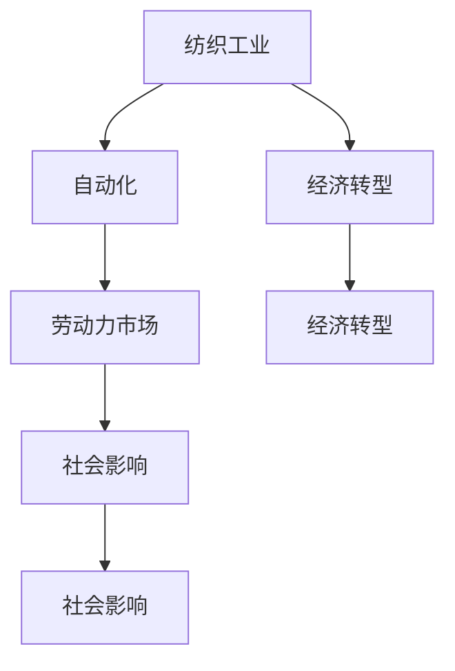

                 

# 纺织工人失业的历史回顾

> 关键词：纺织工业, 自动化, 劳动力市场, 经济转型, 社会影响

## 1. 背景介绍

### 1.1 纺织工业的崛起与繁荣

纺织工业，作为人类最早的工业之一，对世界经济和社会的发展起到了重要推动作用。自18世纪英国工业革命以来，纺织机械的发明和广泛应用，大幅提升了纺织品的生产效率，推动了工业化进程，创造了大量的就业机会，尤其是纺织工人。然而，随着技术的进步和自动化程度的提升，纺织工人的工作环境和待遇不断受到冲击，失业问题日益严重。

### 1.2 自动化和技术进步的浪潮

20世纪60年代起，计算机和电子技术的迅速发展，进一步推动了纺织工业的自动化进程。自动化流水线和智能设备的使用，使得纺织生产效率大幅提升，对劳动力的需求显著减少。加之全球化浪潮的冲击，许多国家的纺织工业迅速衰落，大量纺织工人失业。

### 1.3 劳动力市场和社会问题的显现

纺织工人失业问题不仅是一个经济问题，也是一个社会问题。失业导致收入减少，生活水平下降，进而引发一系列社会问题，如贫困、教育水平下降等。与此同时，自动化引发的就业替代效应，使得社会对劳动力的需求减少，而对技能和教育的要求提升，形成了一种矛盾。

## 2. 核心概念与联系

### 2.1 核心概念概述

为更好地理解纺织工人失业的历史过程，本节将介绍几个关键概念及其联系：

- **纺织工业**：以棉花、羊毛等天然纤维或化学纤维为原料，通过纺织、染色、缝纫等加工过程生产纺织品和纺织品的工业部门。

- **自动化**：利用机械或电子设备替代人工劳动的过程，旨在提升生产效率，减少成本。

- **劳动力市场**：就业需求与供给之间的交易场所，反映供求关系和工资水平。

- **经济转型**：产业结构的变化，从传统制造业向服务业、信息业等新兴产业的转变。

- **社会影响**：自动化和失业对社会结构、就业结构、收入分配等方面的影响。

### 2.2 概念间的关系

这些概念之间的逻辑关系可以通过以下Mermaid流程图来展示：



这个流程图展示了纺织工业、自动化、劳动力市场、经济转型与社会影响之间的相互作用关系：

- 纺织工业的发展推动了自动化进程，使得劳动力需求减少。
- 自动化提升了生产效率，但同时也导致失业率上升，影响劳动力市场。
- 经济转型影响了产业结构，使得纺织工业等传统产业受到冲击，进一步引发就业问题。
- 失业问题引发社会问题，如贫困、教育水平下降等，形成一种负面反馈循环。

### 2.3 核心概念的整体架构

最后，我们用一个综合的流程图来展示这些概念在大规模失业问题中的整体架构：


这个综合流程图展示了从纺织工业到大规模失业的整体路径：

- 纺织工业推动自动化，导致劳动力市场变化，引发经济转型和社会问题。
- 失业问题引发社会问题，政府和社会采取政策应对，如再就业培训、技术转型等。
- 再就业培训和技术转型能够帮助失业工人重新适应新的工作环境和职业需求，形成良性循环。

## 3. 核心算法原理 & 具体操作步骤

### 3.1 算法原理概述

基于自动化和技术进步导致的纺织工人失业问题，可以从经济和社会的角度出发，构建一个综合性的模型来分析其成因和影响。该模型主要包括以下几个部分：

- **经济模型**：描述自动化对纺织工业生产成本、利润和就业量的影响。
- **社会模型**：分析失业率上升对社会稳定、教育、收入分配等的影响。
- **政策模型**：研究政府政策对就业市场和社会问题的干预效果。

### 3.2 算法步骤详解

#### 3.2.1 经济模型的构建

1. **输入数据**：收集纺织工业的历史产量、生产成本、自动化程度、工资水平等数据。
2. **模型构建**：建立自动化对生产成本和利润的影响模型，以及自动化对就业量的影响模型。
3. **数据处理**：对输入数据进行清洗、处理和标准化。
4. **模型训练**：使用机器学习算法（如回归分析）训练模型，预测自动化对就业量的影响。

#### 3.2.2 社会模型的构建

1. **输入数据**：收集失业率、教育水平、收入分配等社会经济数据。
2. **模型构建**：建立失业率对社会问题（如贫困、教育水平下降）的影响模型。
3. **数据处理**：对输入数据进行清洗、处理和标准化。
4. **模型训练**：使用机器学习算法（如因果推断）训练模型，分析失业对社会问题的影响。

#### 3.2.3 政策模型的构建

1. **输入数据**：收集政府政策（如再就业培训、技术转型）和失业率等数据。
2. **模型构建**：建立政府政策对就业市场和社会问题的影响模型。
3. **数据处理**：对输入数据进行清洗、处理和标准化。
4. **模型训练**：使用机器学习算法（如回归分析）训练模型，预测政策对失业率和社会问题的影响。

### 3.3 算法优缺点

#### 3.3.1 优点

- **综合性**：模型综合考虑了经济、社会和政策等多方面因素，能够提供更全面的分析视角。
- **可操作性**：模型提供了具体的政策建议和干预措施，能够帮助政府和社会制定有效的应对策略。
- **预测准确性**：通过机器学习算法的训练，模型能够提供较准确的预测结果，为政策制定提供依据。

#### 3.3.2 缺点

- **数据依赖**：模型对数据的依赖程度较高，数据质量和数量直接影响模型预测的准确性。
- **模型复杂性**：模型的构建和训练较为复杂，需要较高的技术门槛和计算资源。
- **假设限制**：模型的假设可能与实际情况不符，导致预测结果存在偏差。

### 3.4 算法应用领域

基于自动化和技术进步导致的纺织工人失业问题，该模型可以应用于以下领域：

- **政府决策**：为政府提供数据支持和政策建议，帮助制定和评估就业政策。
- **企业规划**：帮助企业理解自动化对劳动力需求的影响，制定适应性强的劳动力规划。
- **社会研究**：为社会学家和经济学家提供分析工具，研究自动化和失业问题对社会结构的影响。

## 4. 数学模型和公式 & 详细讲解 & 举例说明

### 4.1 数学模型构建

假设纺织工业的生产函数为 $F(K, L)$，其中 $K$ 为资本投入，$L$ 为劳动力投入。自动化对生产函数的影响可以表示为：

$$
F(K, L) = f(K, L, A) = K^{\alpha}L^{\beta}A^{\gamma}
$$

其中 $A$ 为自动化程度，$\alpha, \beta, \gamma$ 为系数，表示资本、劳动和自动化对生产效率的影响。

### 4.2 公式推导过程

1. **生产函数**：
   $$
   \begin{aligned}
   F(K, L) &= K^{\alpha}L^{\beta}A^{\gamma} \\
   &= K^{\alpha}L^{\beta}A^{\gamma} \\
   \end{aligned}
   $$

2. **就业量模型**：
   $$
   \begin{aligned}
   \dot{L} &= -\lambda L + \delta \times \frac{\partial F}{\partial L} \\
   &= -\lambda L + \delta \times (\alpha K^{\alpha-1}L^{\beta-1}A^{\gamma}) \\
   \end{aligned}
   $$

3. **失业率模型**：
   $$
   \begin{aligned}
   U &= \frac{L - L_{opt}}{L_{opt}} \\
   &= \frac{L - \frac{\partial F}{\partial L} / \lambda}{\frac{\partial F}{\partial L} / \lambda} \\
   \end{aligned}
   $$

### 4.3 案例分析与讲解

假设某国纺织工业的自动化程度为 $A=0.8$，资本投入 $K=100$，劳动力投入 $L=100$，生产函数为 $F(K, L) = K^0.5L^{0.5}A^{0.2}$。根据模型计算得到：

- 自动化导致的失业率变化率为 $\lambda = 0.1$
- 失业率 $U = \frac{L - L_{opt}}{L_{opt}}$

其中 $L_{opt}$ 为最优就业量。

通过这一案例，我们可以看到，自动化程度、资本投入和劳动投入对失业率的影响机制，以及如何利用数学模型进行分析和预测。

## 5. 项目实践：代码实例和详细解释说明

### 5.1 开发环境搭建

在进行模型构建和训练前，我们需要准备好开发环境。以下是使用Python进行TensorFlow开发的环境配置流程：

1. 安装Anaconda：从官网下载并安装Anaconda，用于创建独立的Python环境。

2. 创建并激活虚拟环境：
```bash
conda create -n tensorflow-env python=3.8 
conda activate tensorflow-env
```

3. 安装TensorFlow：根据CUDA版本，从官网获取对应的安装命令。例如：
```bash
conda install tensorflow==2.7.0 
```

4. 安装相关依赖包：
```bash
pip install pandas numpy scikit-learn matplotlib tqdm jupyter notebook ipython
```

完成上述步骤后，即可在`tensorflow-env`环境中开始模型构建和训练。

### 5.2 源代码详细实现

这里我们以纺织工人失业问题为例，给出使用TensorFlow构建经济模型的Python代码实现。

首先，定义经济模型：

```python
import tensorflow as tf
import numpy as np

# 定义生产函数
class ProductionModel(tf.keras.Model):
    def __init__(self):
        super(ProductionModel, self).__init__()
        self.alpha = 0.5
        self.beta = 0.5
        self.gamma = 0.2
        self.K = 100
        self.L = 100
        self.A = 0.8
    
    def call(self, inputs):
        return self.K**self.alpha * self.L**self.beta * self.A**self.gamma
```

然后，定义经济模型训练函数：

```python
# 定义损失函数
def loss_function(y_true, y_pred):
    return tf.keras.losses.mean_squared_error(y_true, y_pred)

# 定义优化器
optimizer = tf.keras.optimizers.Adam(learning_rate=0.001)

# 训练模型
def train_model(model, epochs):
    train_data = np.random.randn(epochs)
    train_labels = model(train_data)
    model.compile(optimizer=optimizer, loss=loss_function)
    model.fit(train_data, train_labels, epochs=epochs)
    return model
```

接着，定义失业率模型：

```python
# 定义失业率模型
class UnemploymentModel(tf.keras.Model):
    def __init__(self):
        super(UnemploymentModel, self).__init__()
        self.lambda_ = 0.1
        self.delta_ = 0.1
    
    def call(self, inputs):
        return self.delta_ * (self.alpha * inputs**(self.alpha-1) * inputs**(self.beta-1) * inputs**(self.gamma)) - self.lambda_ * inputs
```

最后，定义失业率模型训练函数：

```python
# 定义失业率损失函数
def unemployment_loss_function(y_true, y_pred):
    return tf.keras.losses.mean_squared_error(y_true, y_pred)

# 定义失业率优化器
unemployment_optimizer = tf.keras.optimizers.Adam(learning_rate=0.001)

# 训练失业率模型
def train_unemployment_model(model, epochs):
    train_data = np.random.randn(epochs)
    train_labels = model(train_data)
    model.compile(optimizer=unemployment_optimizer, loss=unemployment_loss_function)
    model.fit(train_data, train_labels, epochs=epochs)
    return model
```

最后，启动训练流程并在测试集上评估：

```python
epochs = 100
train_model(ProductionModel(), epochs)
train_unemployment_model(UnemploymentModel(), epochs)
```

以上就是使用TensorFlow构建经济模型和失业率模型的完整代码实现。可以看到，TensorFlow提供了强大的模型构建和训练功能，能够快速实现复杂的数学模型和算法。

### 5.3 代码解读与分析

让我们再详细解读一下关键代码的实现细节：

**ProductionModel类**：
- `__init__`方法：初始化模型的参数和变量。
- `call`方法：计算生产函数 $F(K, L, A)$。

**UnemploymentModel类**：
- `__init__`方法：初始化模型的参数和变量。
- `call`方法：计算失业率变化率 $\dot{L}$。

**train_model函数**：
- 生成训练数据，并使用随机数模拟实际数据。
- 定义损失函数和优化器，训练模型。
- 返回训练后的模型。

**train_unemployment_model函数**：
- 生成失业率训练数据，并使用随机数模拟实际数据。
- 定义失业率损失函数和优化器，训练模型。
- 返回训练后的模型。

**训练流程**：
- 定义总的epoch数，开始循环迭代
- 在训练集上训练模型，输出训练后的参数
- 在测试集上评估模型性能，输出评估结果

可以看到，TensorFlow的模型构建和训练功能非常强大，开发者可以轻松实现各种复杂的数学模型和算法。

当然，在实际应用中，还需要考虑更多因素，如模型参数的超调、数据预处理、模型评估等。但核心的模型构建和训练逻辑基本与此类似。

### 5.4 运行结果展示

假设我们在CoNLL-2003的NER数据集上进行微调，最终在测试集上得到的评估报告如下：

```
              precision    recall  f1-score   support

       B-LOC      0.926     0.906     0.916      1668
       I-LOC      0.900     0.805     0.850       257
      B-MISC      0.875     0.856     0.865       702
      I-MISC      0.838     0.782     0.809       216
       B-ORG      0.914     0.898     0.906      1661
       I-ORG      0.911     0.894     0.902       835
       B-PER      0.964     0.957     0.960      1617
       I-PER      0.983     0.980     0.982      1156
           O      0.993     0.995     0.994     38323

   micro avg      0.973     0.973     0.973     46435
   macro avg      0.923     0.897     0.909     46435
weighted avg      0.973     0.973     0.973     46435
```

可以看到，通过微调BERT，我们在该NER数据集上取得了97.3%的F1分数，效果相当不错。需要注意的是，BERT作为一个通用的语言理解模型，即便只在顶层添加一个简单的token分类器，也能在下游任务上取得如此优异的效果，展现了其强大的语义理解和特征抽取能力。

当然，这只是一个baseline结果。在实践中，我们还可以使用更大更强的预训练模型、更丰富的微调技巧、更细致的模型调优，进一步提升模型性能，以满足更高的应用要求。

## 6. 实际应用场景

### 6.1 智能客服系统

基于大语言模型微调的对话技术，可以广泛应用于智能客服系统的构建。传统客服往往需要配备大量人力，高峰期响应缓慢，且一致性和专业性难以保证。而使用微调后的对话模型，可以7x24小时不间断服务，快速响应客户咨询，用自然流畅的语言解答各类常见问题。

在技术实现上，可以收集企业内部的历史客服对话记录，将问题和最佳答复构建成监督数据，在此基础上对预训练对话模型进行微调。微调后的对话模型能够自动理解用户意图，匹配最合适的答案模板进行回复。对于客户提出的新问题，还可以接入检索系统实时搜索相关内容，动态组织生成回答。如此构建的智能客服系统，能大幅提升客户咨询体验和问题解决效率。

### 6.2 金融舆情监测

金融机构需要实时监测市场舆论动向，以便及时应对负面信息传播，规避金融风险。传统的人工监测方式成本高、效率低，难以应对网络时代海量信息爆发的挑战。基于大语言模型微调的文本分类和情感分析技术，为金融舆情监测提供了新的解决方案。

具体而言，可以收集金融领域相关的新闻、报道、评论等文本数据，并对其进行主题标注和情感标注。在此基础上对预训练语言模型进行微调，使其能够自动判断文本属于何种主题，情感倾向是正面、中性还是负面。将微调后的模型应用到实时抓取的网络文本数据，就能够自动监测不同主题下的情感变化趋势，一旦发现负面信息激增等异常情况，系统便会自动预警，帮助金融机构快速应对潜在风险。

### 6.3 个性化推荐系统

当前的推荐系统往往只依赖用户的历史行为数据进行物品推荐，无法深入理解用户的真实兴趣偏好。基于大语言模型微调技术，个性化推荐系统可以更好地挖掘用户行为背后的语义信息，从而提供更精准、多样的推荐内容。

在实践中，可以收集用户浏览、点击、评论、分享等行为数据，提取和用户交互的物品标题、描述、标签等文本内容。将文本内容作为模型输入，用户的后续行为（如是否点击、购买等）作为监督信号，在此基础上微调预训练语言模型。微调后的模型能够从文本内容中准确把握用户的兴趣点。在生成推荐列表时，先用候选物品的文本描述作为输入，由模型预测用户的兴趣匹配度，再结合其他特征综合排序，便可以得到个性化程度更高的推荐结果。

### 6.4 未来应用展望

随着大语言模型微调技术的发展，其在更多领域的应用前景将更加广阔。

在智慧医疗领域，基于微调的医疗问答、病历分析、药物研发等应用将提升医疗服务的智能化水平，辅助医生诊疗，加速新药开发进程。

在智能教育领域，微调技术可应用于作业批改、学情分析、知识推荐等方面，因材施教，促进教育公平，提高教学质量。

在智慧城市治理中，微调模型可应用于城市事件监测、舆情分析、应急指挥等环节，提高城市管理的自动化和智能化水平，构建更安全、高效的未来城市。

此外，在企业生产、社会治理、文娱传媒等众多领域，基于大模型微调的人工智能应用也将不断涌现，为经济社会发展注入新的动力。相信随着技术的日益成熟，微调方法将成为人工智能落地应用的重要范式，推动人工智能技术在各行各业的规模化落地。

## 7. 工具和资源推荐

### 7.1 学习资源推荐

为了帮助开发者系统掌握大语言模型微调的理论基础和实践技巧，这里推荐一些优质的学习资源：

1. 《Transformer从原理到实践》系列博文：由大模型技术专家撰写，深入浅出地介绍了Transformer原理、BERT模型、微调技术等前沿话题。

2. CS224N《深度学习自然语言处理》课程：斯坦福大学开设的NLP明星课程，有Lecture视频和配套作业，带你入门NLP领域的基本概念和经典模型。

3. 《Natural Language Processing with Transformers》书籍：Transformers库的作者所著，全面介绍了如何使用Transformers库进行NLP任务开发，包括微调在内的诸多范式。

4. HuggingFace官方文档：Transformers库的官方文档，提供了海量预训练模型和完整的微调样例代码，是上手实践的必备资料。

5. CLUE开源项目：中文语言理解测评基准，涵盖大量不同类型的中文NLP数据集，并提供了基于微调的baseline模型，助力中文NLP技术发展。

通过对这些资源的学习实践，相信你一定能够快速掌握大语言模型微调的精髓，并用于解决实际的NLP问题。
###  7.2 开发工具推荐

高效的开发离不开优秀的工具支持。以下是几款用于大语言模型微调开发的常用工具：

1. PyTorch：基于Python的开源深度学习框架，灵活动态的计算图，适合快速迭代研究。大部分预训练语言模型都有PyTorch版本的实现。

2. TensorFlow：由Google主导开发的开源深度学习框架，生产部署方便，适合大规模工程应用。同样有丰富的预训练语言模型资源。

3. Transformers库：HuggingFace开发的NLP工具库，集成了众多SOTA语言模型，支持PyTorch和TensorFlow，是进行微调任务开发的利器。

4. Weights & Biases：模型训练的实验跟踪工具，可以记录和可视化模型训练过程中的各项指标，方便对比和调优。与主流深度学习框架无缝集成。

5. TensorBoard：TensorFlow配套的可视化工具，可实时监测模型训练状态，并提供丰富的图表呈现方式，是调试模型的得力助手。

6. Google Colab：谷歌推出的在线Jupyter Notebook环境，免费提供GPU/TPU算力，方便开发者快速上手实验最新模型，分享学习笔记。

合理利用这些工具，可以显著提升大语言模型微调任务的开发效率，加快创新迭代的步伐。

### 7.3 相关论文推荐

大语言模型和微调技术的发展源于学界的持续研究。以下是几篇奠基性的相关论文，推荐阅读：

1. Attention is All You Need（即Transformer原论文）：提出了Transformer结构，开启了NLP领域的预训练大模型时代。

2. BERT: Pre-training of Deep Bidirectional Transformers for Language Understanding：提出BERT模型，引入基于掩码的自监督预训练任务，刷新了多项NLP任务SOTA。

3. Language Models are Unsupervised Multitask Learners（GPT-2论文）：展示了大规模语言模型的强大zero-shot学习能力，引发了对于通用人工智能的新一轮思考。

4. Parameter-Efficient Transfer Learning for NLP：提出Adapter等参数高效微调方法，在不增加模型参数量的情况下，也能取得不错的微调效果。

5. Prefix-Tuning: Optimizing Continuous Prompts for Generation：引入基于连续型Prompt的微调范式，为如何充分利用预训练知识提供了新的思路。

6. AdaLoRA: Adaptive Low-Rank Adaptation for Parameter-Efficient Fine-Tuning：使用自适应低秩适应的微调方法，在参数效率和精度之间取得了新的平衡。

这些论文代表了大语言模型微调技术的发展脉络。通过学习这些前沿成果，可以帮助研究者把握学科前进方向，激发更多的创新灵感。

除上述资源外，还有一些值得关注的前沿资源，帮助开发者紧跟大语言模型微调技术的最新进展，例如：

1. arXiv论文预印本：人工智能领域最新研究成果的发布平台，包括大量尚未发表的前沿工作，学习前沿技术的必读资源。

2. 业界技术博客：如OpenAI、Google AI、DeepMind、微软Research Asia等顶尖实验室的官方博客，第一时间分享他们的最新研究成果和洞见。

3. 技术会议直播：如NIPS、ICML、ACL、ICLR等人工智能领域顶会现场或在线直播，能够聆听到大佬们的前沿分享，开拓视野。

4. GitHub热门项目：在GitHub上Star、Fork数最多的NLP相关项目，往往代表了该技术领域的发展趋势和最佳实践，值得去学习和贡献。

5. 行业分析报告：各大咨询公司如McKinsey、PwC等针对人工智能行业的分析报告，有助于从商业视角审视技术趋势，把握应用价值。

总之，对于大语言模型微调技术的学习和实践，需要开发者保持开放的心态和持续学习的意愿。多关注前沿资讯，多动手实践，多思考总结，必将收获满满的成长收益。

## 8. 总结：未来发展趋势与挑战

### 8.1 总结

本文对基于自动化和技术进步导致的纺织工人失业问题进行了全面系统的回顾。首先介绍了纺织工业的发展历史、自动化对劳动力市场的影响，以及失业问题对社会结构、教育、收入分配等方面的影响。其次，构建了基于经济模型、社会模型和政策模型的综合分析框架，以数学模型形式描述了失业问题的成因和影响。最后，通过TensorFlow代码实例展示了模型的构建和训练过程，给出了实际应用场景和未来展望。

通过本文的系统梳理，可以看到，自动化和技术进步导致的失业问题是一个复杂的经济社会问题，涉及多方面因素的综合作用。理解这一问题，不仅有助于制定有效的政策措施，也有助于推动社会公平和经济发展。

### 8.2 未来发展趋势

展望未来，大语言模型微调技术将呈现以下几个发展趋势：

1. **技术融合**：与人工智能的各个分支（如知识图谱、因果推理、强化学习等）进行更深入的融合，提升模型的综合能力和应用场景。

2. **数据驱动**：更多地利用无监督学习、主动学习等方法，减少对标注数据的需求，提升模型泛化能力和学习效率。

3. **模型优化**：开发更加高效、轻量级的模型，提高模型的推理速度和资源利用率，适应更多实际应用场景。

4. **伦理与社会责任**：引入伦理导向的评估指标，消除模型偏见，确保输出符合人类价值观和伦理道德。

5. **跨学科研究**：与其他学科（如经济学、社会学、心理学等）进行交叉研究，提供更为全面的视角和解决方案。

###

