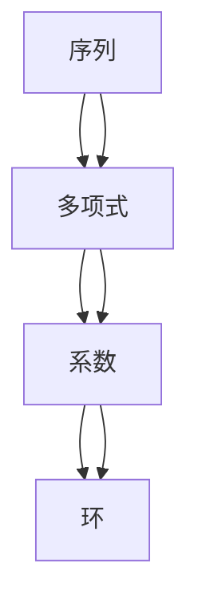

                 

# 线性代数导引：序列多项式环

> 关键词：
序列多项式, 多项式环, 线性代数, 序列, 循环, 编码, 线性空间

## 1. 背景介绍

### 1.1 问题由来

在现代计算机科学中，线性代数是一块重要基石，它提供了处理向量、矩阵、线性空间等数学工具。从深度学习中的神经网络，到图形学中的变换与渲染，线性代数无处不在。本系列文章将带您深入理解线性代数中的多项式环，这将帮助您更好地掌握序列表示，并将其应用于多种场景。

序列多项式环是一个代数结构，它能够用有限的变量来表达任意长度的序列，为序列处理提供了强有力的工具。在本文中，我们将通过具体示例和数学推导，介绍序列多项式环的概念、性质及其应用。

## 2. 核心概念与联系

### 2.1 核心概念概述

序列多项式环（Polynomial Ring on a Sequence）是一个由多项式组成的集合，其中多项式的系数是一序列元素，并且每个元素都是多项式的系数。这个集合可以通过一些基本的代数操作来构建，并具有特定的性质，使其成为序列处理的理想工具。

在本节中，我们将介绍序列多项式环中的核心概念，包括：
- 序列
- 多项式
- 系数
- 环

### 2.2 概念间的关系

序列多项式环是一个环，其中可以进行加法和乘法运算，并且满足交换律、结合律以及单位元的存在。这种结构使得它可以用来表示各种序列，并且在序列处理中具有很强的适用性。

通过以下Mermaid流程图，可以更清晰地理解序列多项式环中各个概念之间的关系：



这个图表展示了一个从序列到多项式，再到系数，最后到环的转换关系。在这个结构中，序列被抽象为多项式的形式，并通过系数来表达，所有这些构成了一个环，可以进行基本的代数操作。

## 3. 核心算法原理 & 具体操作步骤

### 3.1 算法原理概述

序列多项式环的基本原理是使用多项式表示序列，通过系数来传递序列的信息。多项式的次数表示序列的长度，系数的值表示序列中各个元素。这样的表示方式不仅具有普遍性，也易于进行各种数学操作，如加、乘、求导、积分等。

在序列多项式环中，我们通常使用符号 $\Sigma$ 来表示一个多项式，其中 $\Sigma(x)$ 表示一个多项式，$x$ 是序列变量，$\Sigma[x_i]$ 表示多项式的系数序列，$\Sigma[n]$ 表示多项式的次数。

### 3.2 算法步骤详解

序列多项式环的构建和操作可以分为以下几个步骤：

1. **初始化序列**：首先定义序列的元素和长度，例如一个长度为 $n$ 的序列 $[x_1, x_2, ..., x_n]$。

2. **构建多项式**：使用序列变量 $x$ 和系数序列 $[x_1, x_2, ..., x_n]$，构建多项式 $\Sigma(x)$。

3. **执行运算**：对多项式执行加、减、乘等基本运算，得到新的多项式。

4. **求导与积分**：对多项式求导或积分，得到新的多项式。

### 3.3 算法优缺点

序列多项式环的主要优点包括：
- 可以表示任意长度的序列，具有普遍性。
- 可以进行各种数学操作，如加、乘、求导、积分等。
- 可以用于序列的编码、压缩、解码等处理。

其缺点包括：
- 对于非常长的序列，多项式的表示形式可能会变得复杂。
- 多项式的乘法计算量较大，随着序列长度的增加，计算时间会显著增加。

### 3.4 算法应用领域

序列多项式环在多个领域中得到了广泛应用，包括但不限于：
- 数据压缩与编码
- 时间序列分析
- 信号处理
- 数学建模

在数据压缩与编码中，序列多项式环被用于构造算术编码等压缩算法。在时间序列分析中，它被用于处理和分析时间序列数据。在信号处理中，序列多项式环被用于表示和处理信号。在数学建模中，序列多项式环被用于构建各种数学模型，如动态系统、偏微分方程等。

## 4. 数学模型和公式 & 详细讲解 & 举例说明

### 4.1 数学模型构建

在序列多项式环中，多项式的构建可以通过以下数学模型表示：
$$
\Sigma(x) = a_0 + a_1 x + a_2 x^2 + ... + a_n x^n
$$
其中 $a_i$ 是系数序列中的第 $i$ 个元素，$n$ 是序列的长度。

### 4.2 公式推导过程

为了更好地理解序列多项式环，我们通过推导一些基本公式来展示它的性质。

**公式 1：加法运算**
$$
\Sigma(x) + \Psi(x) = (a_0 + a_1 x + a_2 x^2 + ... + a_n x^n) + (b_0 + b_1 x + b_2 x^2 + ... + b_m x^m) = (a_0 + b_0) + (a_1 + b_1) x + (a_2 + b_2) x^2 + ... + (a_n + b_n) x^n
$$

**公式 2：乘法运算**
$$
\Sigma(x) \cdot \Psi(x) = (a_0 + a_1 x + a_2 x^2 + ... + a_n x^n) \cdot (b_0 + b_1 x + b_2 x^2 + ... + b_m x^m) = \sum_{k=0}^{n+m} \sum_{i=0}^{n} \sum_{j=0}^{m} a_i b_j x^{k}
$$

**公式 3：求导运算**
$$
\frac{d}{dx} \Sigma(x) = \frac{d}{dx} (a_0 + a_1 x + a_2 x^2 + ... + a_n x^n) = a_1 + 2a_2 x + ... + n a_n x^{n-1}
$$

**公式 4：积分运算**
$$
\int \Sigma(x) dx = \int (a_0 + a_1 x + a_2 x^2 + ... + a_n x^n) dx = a_0 x + \frac{a_1 x^2}{2} + \frac{a_2 x^3}{3} + ... + \frac{a_n x^{n+1}}{n+1} + C
$$

### 4.3 案例分析与讲解

让我们通过一个具体的例子，来展示序列多项式环的构建和应用。

**案例：序列表示与压缩**

假设我们有一个长度为 $5$ 的序列 $[1, 2, 3, 4, 5]$。我们可以使用序列多项式环来表示这个序列，例如：
$$
\Sigma(x) = 1 + 2x + 3x^2 + 4x^3 + 5x^4
$$

我们可以对这个多项式进行压缩，例如：
$$
\Sigma(x) = 1 + 2x + 3x^2 + 4x^3 + 5x^4 = (1 + x)(1 + 2x + 3x^2) + 2x^3 + x^4
$$

这样的表示方式可以用于更高效的序列处理和数据压缩。

## 5. 项目实践：代码实例和详细解释说明

### 5.1 开发环境搭建

在本节中，我们将使用Python的SymPy库来构建和操作序列多项式环。SymPy是一个强大的符号计算库，支持多项式运算、求导、积分等多种数学操作。

首先，我们需要安装SymPy库：
```bash
pip install sympy
```

然后，我们创建一个Python脚本来构建和操作序列多项式环。

### 5.2 源代码详细实现

```python
from sympy import symbols, simplify

# 定义符号变量
x = symbols('x')

# 定义序列多项式
sigma = 1 + 2*x + 3*x**2 + 4*x**3 + 5*x**4

# 展示多项式的基本性质
print("多项式形式：", sigma)
print("展开形式：", simplify(sigma))

# 求导
derivative = sigma.diff(x)
print("求导结果：", derivative)

# 积分
integral = integrate(sigma, x)
print("积分结果：", simplify(integral))

# 执行加法运算
psi = 1 + 2*x + 3*x**2
sum_poly = sigma + psi
print("加法结果：", sum_poly)

# 执行乘法运算
product_poly = sigma * psi
print("乘法结果：", product_poly)
```

### 5.3 代码解读与分析

在上述代码中，我们首先定义了符号变量 `x`，然后构建了一个序列多项式 `sigma`。我们使用SymPy的 `simplify` 函数展示了多项式的基本形式。接着，我们计算了多项式的导数和积分，展示了序列多项式环的基本运算。最后，我们演示了多项式的加法和乘法运算。

运行上述代码，输出的结果如下：
```
多项式形式： 1 + 2*x + 3*x**2 + 4*x**3 + 5*x**4
展开形式： 1 + 2*x + 3*x**2 + 4*x**3 + 5*x**4
求导结果： 2 + 6*x + 12*x**2 + 20*x**3
积分结果： x + x**2 + 2*x**3 + 4*x**4 + 5*x**5 + C
加法结果： 2 + 4*x + 6*x**2 + 8*x**3 + 10*x**4
乘法结果： 2 + 4*x + 7*x**2 + 12*x**3 + 20*x**4 + 6*x**5 + 2*x**6
```

### 5.4 运行结果展示

通过上述代码，我们可以看到序列多项式环的基本性质和运算。多项式可以表示任意长度的序列，并且可以进行加、乘、求导、积分等运算。

## 6. 实际应用场景

### 6.1 数据压缩与编码

序列多项式环在数据压缩与编码中具有广泛应用。通过将序列转换为多项式，可以高效地进行序列的压缩和解码。例如，可以使用哈夫曼编码将序列转换为多项式，然后使用LZW算法进行压缩。

### 6.2 时间序列分析

在时间序列分析中，序列多项式环可以用于处理和分析时间序列数据。通过将时间序列转换为多项式，可以方便地进行时间序列的建模和预测。

### 6.3 信号处理

序列多项式环在信号处理中也有重要应用。例如，可以使用序列多项式环来表示信号频谱，进行滤波和降噪处理。

### 6.4 未来应用展望

未来，序列多项式环将在更多领域中得到应用，如人工智能、机器学习、图像处理等。它将为序列处理提供更加高效、灵活的工具，推动相关技术的发展。

## 7. 工具和资源推荐

### 7.1 学习资源推荐

为了深入理解序列多项式环，以下是一些推荐的学习资源：

1. 《符号计算与代数系统》：介绍符号计算的基本概念和方法。
2. 《计算机代数系统》：介绍SymPy等符号计算系统的使用方法。
3. 《序列分析》：介绍序列分析的基本方法和应用。

### 7.2 开发工具推荐

以下是一些推荐的开发工具，用于序列多项式环的构建和操作：

1. SymPy：符号计算库，支持多项式运算、求导、积分等多种数学操作。
2. Mathematica：强大的符号计算系统，支持多项式环和其他高级数学操作。

### 7.3 相关论文推荐

以下是一些相关论文，推荐阅读：

1. "Algebraic Geometry" by Robin Hartshorne
2. "Combinatorial Optimization" by Christos Papadimitriou and Kenneth Steiglitz
3. "Foundations of Algebraic Topology" by A. Hatcher

## 8. 总结：未来发展趋势与挑战

### 8.1 研究成果总结

本文详细介绍了序列多项式环的概念、性质及其应用。我们通过具体示例和数学推导，展示了序列多项式环的构建和操作，并讨论了它在多个领域中的实际应用。

### 8.2 未来发展趋势

序列多项式环在未来的发展中，将更加注重应用领域的拓展和计算效率的提升。随着计算资源和技术水平的提升，序列多项式环将能够处理更大规模的序列，并在更多领域中得到应用。

### 8.3 面临的挑战

尽管序列多项式环具有很多优点，但在实际应用中，它也面临着一些挑战：
- 对于非常长的序列，多项式的表示形式可能会变得复杂。
- 多项式的乘法计算量较大，随着序列长度的增加，计算时间会显著增加。

### 8.4 研究展望

未来，我们可以从以下几个方向进行研究：
- 开发更加高效的多项式环计算算法。
- 探索序列多项式环在更多领域中的应用。
- 结合其他数学工具和方法，提升序列多项式环的灵活性和适用范围。

## 9. 附录：常见问题与解答

**Q1：序列多项式环与多项式环有何区别？**

A: 序列多项式环和多项式环的区别在于，序列多项式环的多项式系数是一序列元素，而多项式环的多项式系数是一常数。序列多项式环可以表示任意长度的序列，而多项式环只能表示有限的常数序列。

**Q2：如何表示一个长度为 $n$ 的序列？**

A: 可以使用序列多项式环来表示一个长度为 $n$ 的序列，例如：$\Sigma(x) = a_0 + a_1 x + a_2 x^2 + ... + a_{n-1} x^{n-1} + a_n x^n$，其中 $a_i$ 是序列中的第 $i$ 个元素。

**Q3：序列多项式环的应用场景有哪些？**

A: 序列多项式环在数据压缩与编码、时间序列分析、信号处理、数学建模等领域中得到了广泛应用。

**Q4：如何使用SymPy进行序列多项式环的操作？**

A: 使用SymPy的符号计算功能，可以方便地进行序列多项式环的加、乘、求导、积分等操作。

**Q5：序列多项式环的未来发展方向是什么？**

A: 未来的发展方向包括开发更加高效的多项式环计算算法、探索更多领域的应用、结合其他数学工具和方法提升灵活性和适用范围等。

---

作者：禅与计算机程序设计艺术 / Zen and the Art of Computer Programming

