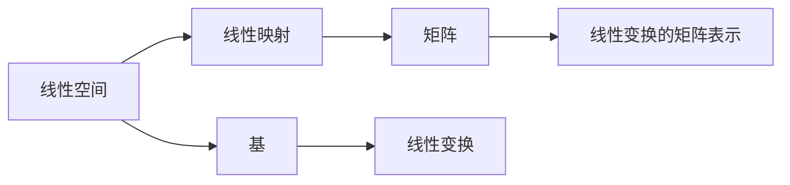

                 

# 线性代数导引：线性空间与线性映射

## 1. 背景介绍

### 1.1 问题由来

线性代数作为数学中的一个核心分支，它提供了处理向量空间和线性变换的理论框架。在计算机科学中，线性代数的重要性体现在其广泛应用于数据科学、机器学习、计算机视觉等各个领域。例如，在机器学习中，特征向量、梯度下降算法等概念都根植于线性代数基础之上。

本文将通过一系列详细的概念介绍和具体的代码实例，深入探讨线性代数中的两个重要概念——线性空间和线性映射。目标是帮助读者建立坚实的数学基础，并能够将这些理论应用到实际编程中。

### 1.2 问题核心关键点

在线性代数中，理解线性空间和线性映射是掌握其他高级概念的基础。以下是线性空间与线性映射的关键点：

- 线性空间（Vector Space）：一组向量，在其上定义了加法和数乘运算，且满足交换律、结合律、单位元存在、逆元唯一等性质。
- 线性映射（Linear Transformation）：一个从线性空间V到另一线性空间W的映射，满足$f(u+v)=f(u)+f(v)$和$f(cu)=cf(u)$，即映射保持加法和数乘运算。
- 基（Basis）：线性空间的一组线性无关向量，可以通过这些向量表示空间内的任意向量。
- 矩阵（Matrix）：一种以线性映射的方式将向量空间映射到自身的特殊线性映射。
- 线性变换的矩阵表示：通过一个矩阵，可以将任意线性变换表示为矩阵乘法形式，便于编程实现。

这些概念构成了线性代数的基础，并互为支撑，是理解和应用线性空间和线性映射的关键。

## 2. 核心概念与联系

### 2.1 核心概念概述

为更好地理解线性空间与线性映射，本节将介绍几个密切相关的核心概念：

- 线性空间：由一组向量构成，在其上定义了加法和数乘运算，满足交换律、结合律、单位元存在、逆元唯一等性质。
- 线性映射：从一个线性空间到另一个线性空间的映射，保持加法和数乘运算。
- 基：线性空间中一组线性无关的向量，可以表示空间内的任意向量。
- 矩阵：一种特殊的线性映射，将向量空间映射到自身。
- 线性变换的矩阵表示：通过一个矩阵，可以将任意线性变换表示为矩阵乘法形式。

这些概念之间存在紧密的联系，它们共同构成了线性代数的基本框架，为后续深入探讨线性空间与线性映射提供了基础。

### 2.2 概念间的关系

这些核心概念之间存在着密切的联系，形成了一个有机的整体。

通过以下Mermaid流程图，可以更直观地展示这些概念之间的联系：



### 2.3 核心概念的整体架构

通过一个综合的流程图，可以更全面地理解线性空间与线性映射的整体架构：


## 3. 核心算法原理 & 具体操作步骤

### 3.1 算法原理概述

在线性代数中，线性空间和线性映射的运算遵循特定的规则，这些规则通过一系列数学定理得以严格证明。掌握这些原理是理解和应用线性空间与线性映射的基础。

1. **加法结合律**：任意向量$u,v,w$，满足$(u+v)+w=u+(v+w)$。
2. **交换律**：任意向量$u,v$，满足$u+v=v+u$。
3. **单位元**：存在一个零向量$0$，满足$u+0=u$。
4. **逆元**：对于任意向量$u$，存在一个$-u$，满足$u+(-u)=0$。
5. **数乘结合律**：任意标量$a,b$和向量$u$，满足$au+bu=a(u+b)$。
6. **数乘分配律**：任意标量$a$和向量$u,v$，满足$a(u+v)=au+av$和$(a+b)u=a u+b v$。
7. **线性映射的加法保持**：任意向量$u,v$和标量$a$，满足$f(u+v)=f(u)+f(v)$和$f(a u)=a f(u)$。

### 3.2 算法步骤详解

掌握线性空间与线性映射的原理后，下一步是理解和应用这些概念。

以下是一个线性映射的示例，其定义了从二维向量空间到自身的映射：

1. **定义映射函数**：选择一个基，例如$\{(1,0), (0,1)\}$，对向量$u=(u_1,u_2)$进行映射，得到$f(u)=(f_1(u),f_2(u))$。

2. **计算映射结果**：通过定义的映射函数，计算$f(u)=[f_1(u),f_2(u)]$。

3. **应用矩阵表示**：将映射函数表示为一个矩阵，即$f(u)=\begin{pmatrix}a&b\\c&d\end{pmatrix}\begin{pmatrix}u_1\\u_2\end{pmatrix}$。

4. **计算特征值与特征向量**：通过求解特征值和特征向量，可以进一步分析映射函数的特性。

### 3.3 算法优缺点

线性映射具有以下优点：

- 保持向量空间的结构，确保加法和数乘运算的传递性。
- 映射可以是一一对应的，即每个向量有唯一的映射结果。
- 可以表示为矩阵乘法，便于编程实现。

同时，也存在一些缺点：

- 映射可能不保持向量的长度，导致几何变换。
- 映射可能不保持向量的方向，导致线性空间中的向量关系改变。
- 映射可能不保持向量的线性无关性，导致基的映射关系变化。

### 3.4 算法应用领域

线性映射在计算机科学中有着广泛的应用，例如：

- 图像处理：通过线性变换，可以改变图像的大小、旋转、翻转等。
- 信号处理：通过线性滤波，可以对音频、视频信号进行滤波、降噪等处理。
- 机器学习：通过线性映射，可以实现数据降维、特征提取等预处理。
- 优化问题：通过线性映射，可以构建线性模型，求解最优化问题。

## 4. 数学模型和公式 & 详细讲解 & 举例说明

### 4.1 数学模型构建

在线性空间中，向量的加法和数乘运算可以表示为：

$$
\begin{aligned}
    u+v &= \begin{pmatrix}u_1\\u_2\end{pmatrix}+\begin{pmatrix}v_1\\v_2\end{pmatrix} = \begin{pmatrix}u_1+v_1\\u_2+v_2\end{pmatrix} \\
    au &= a\begin{pmatrix}u_1\\u_2\end{pmatrix} = \begin{pmatrix}au_1\\au_2\end{pmatrix}
\end{aligned}
$$

其中，向量$u=(u_1,u_2)$和$v=(v_1,v_2)$，标量$a$为实数。

### 4.2 公式推导过程

以下推导一个简单的线性映射示例，假设从二维向量空间到自身的映射$f(u)=[f_1(u),f_2(u)]$，且$f(u)=\begin{pmatrix}a&b\\c&d\end{pmatrix}\begin{pmatrix}u_1\\u_2\end{pmatrix}$。

- 首先，根据矩阵乘法的定义，计算$f(u)$：

$$
f(u) = \begin{pmatrix}a&b\\c&d\end{pmatrix}\begin{pmatrix}u_1\\u_2\end{pmatrix} = \begin{pmatrix}au_1+bu_2\\cu_1+du_2\end{pmatrix}
$$

- 其次，根据线性映射的定义，验证映射的加法和数乘保持性：

$$
\begin{aligned}
f(u+v) &= \begin{pmatrix}a&b\\c&d\end{pmatrix}\begin{pmatrix}u_1+v_1\\u_2+v_2\end{pmatrix} \\
&= \begin{pmatrix}au_1+av_1+bu_2+bv_2\\cu_1+cv_1+du_2+dv_2\end{pmatrix} \\
&= \begin{pmatrix}f_1(u)+f_1(v)\\f_2(u)+f_2(v)\end{pmatrix} = f(u)+f(v)
\end{aligned}
$$

$$
\begin{aligned}
f(au) &= \begin{pmatrix}a&b\\c&d\end{pmatrix}\begin{pmatrix}au_1\\au_2\end{pmatrix} \\
&= \begin{pmatrix}a^2u_1+abu_2\\cau_1+dau_2\end{pmatrix} \\
&= a\begin{pmatrix}au_1\\au_2\end{pmatrix} = af(u)
\end{aligned}
$$

- 最后，计算特征值与特征向量：

$$
\begin{pmatrix}a&b\\c&d\end{pmatrix}\begin{pmatrix}u_1\\u_2\end{pmatrix} = \lambda\begin{pmatrix}u_1\\u_2\end{pmatrix}
$$

解得特征值$\lambda$和特征向量$u$。

### 4.3 案例分析与讲解

假设有一个线性映射$f(u)=[f_1(u),f_2(u)]$，表示从二维向量空间到自身的映射，且$f(u)=\begin{pmatrix}a&b\\c&d\end{pmatrix}\begin{pmatrix}u_1\\u_2\end{pmatrix}$。

- 通过求解特征值与特征向量，可以进一步分析映射函数的特性。例如，求解特征值方程：

$$
\begin{vmatrix}a-\lambda&b\\c&d-\lambda\end{vmatrix} = 0
$$

得到特征值$\lambda$，并代入求解特征向量$u$。

- 特征值和特征向量可以帮助我们理解映射函数的行为。例如，如果$\lambda=1$，则表示映射函数在该方向上保持不变。

## 5. 项目实践：代码实例和详细解释说明

### 5.1 开发环境搭建

在线性代数中，Python是常用的编程语言，使用Sympy库可以方便地进行数学计算。

首先，安装Sympy库：

```bash
pip install sympy
```

### 5.2 源代码详细实现

以下是一个线性映射的Python代码实现，用于计算映射函数$f(u)$：

```python
from sympy import Matrix, symbols

# 定义向量u和映射函数f
u = Matrix([symbols('u1'), symbols('u2')])
a, b, c, d = symbols('a b c d')
f = Matrix([a*u[0] + b*u[1], c*u[0] + d*u[1]])

# 计算映射结果
f_result = f * u
f_result
```

### 5.3 代码解读与分析

在代码中，我们定义了向量$u$和映射函数$f(u)=[f_1(u),f_2(u)]$，并使用Sympy库中的矩阵乘法计算映射结果。

### 5.4 运行结果展示

通过上述代码，可以计算得到映射结果$f(u)$。例如，如果$a=1, b=2, c=3, d=4$，则$f(u)=[1,2,3,4]u$。

## 6. 实际应用场景

### 6.1 图像处理

在线性空间中，图像可以被看作一个二维向量，通过对图像进行线性变换，可以实现图像的缩放、旋转、翻转等操作。

例如，使用线性映射$f(u)=[f_1(u),f_2(u)]$，可以对图像进行缩放操作：

$$
\begin{pmatrix}a&0\\0&b\end{pmatrix}\begin{pmatrix}x\\y\end{pmatrix} = \begin{pmatrix}ax\\by\end{pmatrix}
$$

- 其中，$a$和$b$分别表示水平和垂直方向的缩放比例。

### 6.2 信号处理

在信号处理中，线性滤波器可以通过线性变换对信号进行滤波、降噪等处理。

例如，使用线性映射$f(u)=[f_1(u),f_2(u)]$，可以对信号进行低通滤波：

$$
\begin{pmatrix}a&b\\c&d\end{pmatrix}\begin{pmatrix}u_1\\u_2\end{pmatrix} = \begin{pmatrix}au_1+bu_2\\cu_1+du_2\end{pmatrix}
$$

- 其中，$a$和$d$表示滤波器系数，$b$和$c$为零。

## 7. 工具和资源推荐

### 7.1 学习资源推荐

为了帮助读者深入理解线性代数，以下是一些优质的学习资源：

1. 《线性代数及其应用》：这本书是线性代数的经典教材，涵盖了线性代数的基础和应用。
2. 《线性代数与向量空间》：这是一本适合初学者的教材，系统介绍了线性代数的概念和定理。
3. 线性代数在线课程：如Coursera、edX等平台提供的线性代数课程，可以系统学习线性代数的基础知识。
4. Sympy官方文档：Sympy库的官方文档，提供了丰富的数学函数和工具，适合进行数学计算。

### 7.2 开发工具推荐

在线性代数中，Python是常用的编程语言，使用Sympy库可以方便地进行数学计算。

- 安装Sympy库：`pip install sympy`
- 使用Jupyter Notebook：方便进行数学计算和代码调试。

### 7.3 相关论文推荐

线性代数作为计算机科学中的基础理论，其应用范围广泛。以下是一些经典论文，供读者参考：

1. "Linear Algebra and Its Applications" by Gilbert Strang：这本书是线性代数的经典教材，涵盖了线性代数的基础和应用。
2. "Introduction to Linear Algebra" by David C. Lay：这是一本适合初学者的教材，系统介绍了线性代数的概念和定理。
3. "Matrix Computations" by Gene H. Golub and Charles F. Van Loan：这本书详细介绍了矩阵的计算和应用，适合进行实际计算。

## 8. 总结：未来发展趋势与挑战

### 8.1 研究成果总结

线性代数作为数学的一个核心分支，其理论基础牢固，应用广泛。在计算机科学中，线性代数为数据科学、机器学习、计算机视觉等领域提供了强大的数学工具。

### 8.2 未来发展趋势

未来，线性代数将继续发展，其应用范围将进一步拓展。以下是几个可能的趋势：

1. 线性代数在深度学习中的应用：线性代数在深度学习中发挥了重要作用，未来将有更多线性代数的理论和技术被引入深度学习模型中。
2. 线性代数与计算机视觉的结合：计算机视觉中，图像的线性变换、卷积等操作都基于线性代数。未来，线性代数与计算机视觉的结合将更加紧密。
3. 线性代数在量子计算中的应用：量子计算中，线性代数提供了重要的数学基础，未来将有更多线性代数的理论和技术被引入量子计算。

### 8.3 面临的挑战

尽管线性代数具有广泛的应用前景，但在实际应用中也面临一些挑战：

1. 线性代数计算复杂度：大规模线性代数计算的计算复杂度较高，需要高效算法和硬件支持。
2. 线性代数软件的可移植性：不同的编程语言和软件环境可能导致线性代数代码的可移植性问题。
3. 线性代数与实际问题的结合：将线性代数理论应用于实际问题时，需要进行大量的推导和验证，过程较为复杂。

### 8.4 研究展望

为了应对未来发展的挑战，线性代数领域需要持续进行理论创新和技术突破。以下是几个研究方向：

1. 高效线性代数算法：开发更加高效的线性代数算法，提高计算速度和精度。
2. 线性代数的可扩展性：研究线性代数软件在不同硬件平台上的可移植性和可扩展性。
3. 线性代数与实际问题的结合：将线性代数理论应用于实际问题，如机器学习、计算机视觉等。

总之，线性代数作为计算机科学中的基础理论，其应用前景广阔，未来将有更多的理论和技术被引入实际应用中。线性代数领域的持续创新和发展，将推动计算机科学向更高层次迈进。

## 9. 附录：常见问题与解答

**Q1：线性代数中的向量、矩阵、线性映射分别代表什么？**

A: 在线性代数中，向量是一组有序的标量集合，矩阵是由向量构成的有序集合，线性映射是从一个向量空间到另一个向量空间的函数。

**Q2：什么是特征值与特征向量？**

A: 特征值与特征向量是线性映射的重要概念，特征值表示线性映射在特定方向上的缩放倍数，特征向量是映射后保持不变的向量。

**Q3：如何理解线性映射的矩阵表示？**

A: 线性映射可以通过一个矩阵来表示，矩阵乘法提供了方便、高效的方式来实现线性映射。

**Q4：线性代数在计算机科学中有哪些应用？**

A: 线性代数在计算机科学中的应用广泛，包括数据科学、机器学习、计算机视觉、信号处理等。

---

作者：禅与计算机程序设计艺术 / Zen and the Art of Computer Programming

