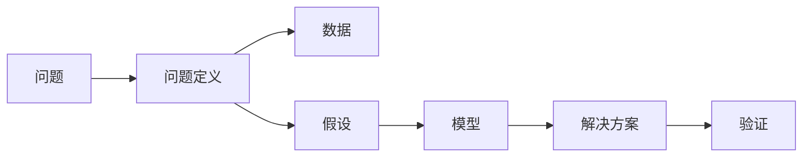

                 

# 结构化思维的力量：从思维到行动

## 1. 背景介绍

### 1.1 问题由来

在现代社会，信息的爆炸和社会的复杂性日益增加，传统的经验决策和直觉判断已经难以应对日益多样化的挑战。结构化思维（Structured Thinking）的提出，正是为了帮助人们系统化、条理化地处理复杂问题，提升决策的科学性和准确性。

结构化思维的核心在于将问题拆解成可操作的小模块，通过逻辑分析、数据驱动等手段，得出科学可行的解决方案。它不仅适用于商业决策、项目管理、数据分析等专业领域，也是日常生活中解决问题的重要工具。

### 1.2 问题核心关键点

结构化思维的关键在于其系统性、条理性和逻辑性，具体包括以下几个关键点：

1. **系统性**：将复杂问题分解成可管理的小部分，从整体到局部，逐一分析和解决。
2. **条理性**：遵循逻辑流程，避免跳跃性思维，确保每个步骤都有充分的论证和支持。
3. **逻辑性**：运用逻辑推理，确保每个结论都有足够的证据和依据。

这些关键点使得结构化思维成为解决复杂问题的有力工具，尤其在信息碎片化、问题多样化的今天，具有极高的应用价值。

### 1.3 问题研究意义

结构化思维的深入研究和广泛应用，具有以下重要意义：

1. **提升决策科学性**：通过系统化分析，减少决策过程中的主观偏见，提高决策的准确性和可靠性。
2. **增强问题解决能力**：通过条理化和逻辑化思考，快速找到问题的本质和解决方案。
3. **促进团队协作**：结构化思维强调团队成员间的信息共享和协同工作，提高整体工作效率。
4. **推动技术进步**：结构化思维应用于软件开发、算法设计等领域，促进技术创新和迭代。
5. **促进社会进步**：在公共政策制定、环境保护、医疗卫生等领域，结构化思维有助于制定科学合理的战略方案，推动社会可持续发展。

## 2. 核心概念与联系

### 2.1 核心概念概述

为更好地理解结构化思维，本节将介绍几个密切相关的核心概念：

- **问题（Problem）**：需要解决的具体挑战或目标。
- **问题定义（Problem Definition）**：明确问题的具体范围、目标和限制条件。
- **数据（Data）**：解决问题所需的关键信息和数据集。
- **假设（Assumption）**：基于现有数据和经验提出的初步假设。
- **模型（Model）**：用于解决问题的数学或算法模型。
- **解决方案（Solution）**：基于模型得出的一系列操作步骤或策略。
- **验证（Validation）**：通过测试和反馈，验证解决方案的有效性。

这些核心概念通过逻辑链条紧密连接，共同构成结构化思维的基本框架。

### 2.2 概念间的关系

这些核心概念之间的逻辑关系可以通过以下Mermaid流程图来展示：



这个流程图展示了结构化思维从问题定义到解决方案的过程：

1. 确定问题后，进行问题定义，明确问题的具体范围和目标。
2. 收集和整理数据，进行初步的假设。
3. 根据假设选择或构建合适的模型。
4. 基于模型得出解决方案。
5. 通过验证环节，评估解决方案的可行性。

通过这个流程图，我们可以更清晰地理解结构化思维的各个步骤，为后续深入讨论提供坚实的基础。

### 2.3 核心概念的整体架构

最后，我们用一个综合的流程图来展示这些核心概念在大规模问题解决中的整体架构：


这个综合流程图展示了结构化思维在实际问题解决中的全流程：

1. 定义问题，收集和预处理数据。
2. 选择合适的模型，进行训练和调优。
3. 基于模型得出解决方案。
4. 通过验证和调整，确保解决方案的有效性。
5. 将解决方案部署到实际应用中，并进行持续优化。

通过这些流程图，我们可以更系统地理解结构化思维的各个环节，为进一步深入探讨提供框架和指导。

## 3. 核心算法原理 & 具体操作步骤

### 3.1 算法原理概述

结构化思维的算法原理主要包括以下几个方面：

1. **数据驱动**：通过收集和分析大量数据，形成数据驱动的决策基础。
2. **逻辑推理**：使用逻辑推理，确保每个结论有充分的证据和依据。
3. **迭代优化**：不断调整和优化解决方案，直至达到最佳效果。

这些原理构成了结构化思维的核心，使得其在解决问题时能够系统化、条理化、科学化地进行。

### 3.2 算法步骤详解

结构化思维的算法步骤通常包括以下几个关键步骤：

**Step 1: 问题定义**

- **明确问题**：确定问题的具体范围和目标。
- **收集信息**：收集相关背景资料，了解问题的历史和现状。

**Step 2: 数据收集与预处理**

- **数据采集**：从各种渠道（如数据库、调查问卷、公开数据集）获取数据。
- **数据清洗**：处理缺失值、异常值等数据问题，确保数据质量。

**Step 3: 模型选择与训练**

- **模型选择**：根据问题特点选择合适的模型，如回归模型、分类模型、聚类模型等。
- **模型训练**：使用训练数据集，对模型进行训练和调优。

**Step 4: 解决方案生成**

- **推理与预测**：基于训练好的模型，对新数据进行推理和预测。
- **方案设计**：根据预测结果，设计具体的解决方案。

**Step 5: 验证与调整**

- **验证测试**：通过测试数据集对解决方案进行验证，评估其效果。
- **调整优化**：根据验证结果，对解决方案进行必要的调整和优化。

**Step 6: 解决方案部署与持续优化**

- **部署实施**：将解决方案部署到实际应用中。
- **持续监控**：对解决方案进行持续监控和优化，确保其长期有效性。

### 3.3 算法优缺点

结构化思维的算法具有以下优点：

1. **系统性**：通过系统化分析，确保每个步骤都有充分的论证和支持。
2. **条理性**：遵循逻辑流程，避免跳跃性思维，确保每个步骤都有清晰的逻辑关联。
3. **可复用性**：通过标准化流程，提高问题解决的效率和质量。

然而，结构化思维也存在一些缺点：

1. **过程繁琐**：结构化思维需要详细的数据收集、模型选择和验证等步骤，过程较为繁琐。
2. **过度依赖数据**：结构化思维依赖于大量高质量数据，数据获取和处理可能成为瓶颈。
3. **灵活性不足**：标准化流程可能限制对新问题和情况的灵活处理。

尽管存在这些局限，但结构化思维仍然是解决复杂问题的有力工具，尤其是在数据驱动和逻辑推理为主导的领域，具有极高的应用价值。

### 3.4 算法应用领域

结构化思维在多个领域得到了广泛应用，包括但不限于：

- **商业决策**：通过数据分析和逻辑推理，提升企业的市场竞争力。
- **项目管理**：通过系统化分解和逻辑化分析，确保项目按时按质完成。
- **软件开发**：通过需求分析、架构设计和测试验证，提升软件系统的质量和可靠性。
- **数据分析**：通过数据驱动的分析和逻辑推理，发现数据背后的规律和趋势。
- **公共政策**：通过系统化分析和逻辑推理，制定科学合理的政策方案。

这些应用领域展示了结构化思维的广泛适用性和重要性，其在提升决策科学性和效率方面发挥着不可替代的作用。

## 4. 数学模型和公式 & 详细讲解 & 举例说明

### 4.1 数学模型构建

本节将使用数学语言对结构化思维的基本算法进行更加严格的刻画。

记问题为 $P$，数据集为 $D$，模型为 $M$，解决方案为 $S$。问题解决过程可以表示为：

$$
S = M(P, D)
$$

其中 $P$ 表示问题定义，$D$ 表示数据集，$M$ 表示模型，$S$ 表示解决方案。

### 4.2 公式推导过程

以回归模型为例，推导其基本公式及其推导过程。

假设数据集 $D$ 包含 $N$ 个样本，每个样本 $(x_i, y_i)$，其中 $x_i$ 为特征向量，$y_i$ 为标签。回归模型的目标是最小化预测值与真实值之间的平方误差，即：

$$
\min_{\theta} \frac{1}{N} \sum_{i=1}^N (y_i - f(x_i;\theta))^2
$$

其中 $f(x_i;\theta) = \theta_0 + \theta_1 x_{i1} + \ldots + \theta_k x_{ik}$ 为线性回归模型。

求解上述优化问题，可得模型参数 $\theta$ 的解为：

$$
\theta = (X^TX)^{-1}X^Ty
$$

其中 $X$ 为特征矩阵，$y$ 为标签向量，$^{-1}$ 表示矩阵求逆。

通过这个公式，我们可以清晰地理解线性回归模型的求解过程，从而更好地应用于实际问题中。

### 4.3 案例分析与讲解

以股票价格预测为例，说明结构化思维在实际问题中的应用。

**Step 1: 问题定义**

- **问题**：预测未来一周内的股票价格变化。
- **目标**：提高股票价格预测的准确性。

**Step 2: 数据收集与预处理**

- **数据来源**：获取历史股票价格、交易量、市值等数据。
- **数据清洗**：处理缺失值和异常值，确保数据质量。

**Step 3: 模型选择与训练**

- **模型选择**：选择线性回归模型。
- **模型训练**：使用历史数据对模型进行训练和调优。

**Step 4: 解决方案生成**

- **推理与预测**：使用训练好的模型，对未来一周的股票价格进行预测。
- **方案设计**：根据预测结果，设计具体的投资策略。

**Step 5: 验证与调整**

- **验证测试**：使用测试数据集对预测结果进行验证，评估其效果。
- **调整优化**：根据验证结果，对预测模型进行必要的调整和优化。

**Step 6: 解决方案部署与持续优化**

- **部署实施**：将预测模型应用于实际投资决策中。
- **持续监控**：对投资结果进行持续监控和优化，确保投资策略的有效性。

通过这个案例，我们可以看到结构化思维在实际问题解决中的全流程，以及各个步骤的详细操作。

## 5. 项目实践：代码实例和详细解释说明

### 5.1 开发环境搭建

在进行结构化思维的实践前，我们需要准备好开发环境。以下是使用Python进行Pandas开发的环境配置流程：

1. 安装Anaconda：从官网下载并安装Anaconda，用于创建独立的Python环境。

2. 创建并激活虚拟环境：
```bash
conda create -n pandas-env python=3.8 
conda activate pandas-env
```

3. 安装Pandas：
```bash
conda install pandas
```

4. 安装其他各类工具包：
```bash
pip install numpy matplotlib seaborn jupyter notebook ipython
```

完成上述步骤后，即可在`pandas-env`环境中开始结构化思维的实践。

### 5.2 源代码详细实现

这里我们以回归模型为例，展示使用Pandas进行数据分析和模型训练的代码实现。

首先，导入必要的库：

```python
import pandas as pd
import numpy as np
import matplotlib.pyplot as plt
from sklearn.linear_model import LinearRegression
from sklearn.model_selection import train_test_split
from sklearn.metrics import mean_squared_error, r2_score
```

然后，读取数据并进行预处理：

```python
# 读取数据
data = pd.read_csv('stock_prices.csv')

# 处理缺失值
data.fillna(data.mean(), inplace=True)

# 划分数据集
X = data.drop(['price'], axis=1)
y = data['price']
X_train, X_test, y_train, y_test = train_test_split(X, y, test_size=0.2, random_state=42)
```

接着，构建并训练回归模型：

```python
# 构建模型
model = LinearRegression()

# 训练模型
model.fit(X_train, y_train)

# 预测
y_pred = model.predict(X_test)

# 评估
mse = mean_squared_error(y_test, y_pred)
rmse = np.sqrt(mse)
r2 = r2_score(y_test, y_pred)

# 输出结果
print('RMSE:', rmse)
print('R^2:', r2)
```

最后，将结果可视化：

```python
# 绘制预测结果与真实结果对比图
plt.scatter(y_test, y_pred)
plt.plot([y_test.min(), y_test.max()], [y_test.min(), y_test.max()], 'r--', label='Perfect prediction')
plt.xlabel('Actual Price')
plt.ylabel('Predicted Price')
plt.legend()
plt.show()
```

以上就是使用Pandas进行回归模型分析和预测的完整代码实现。通过这个例子，我们可以看到结构化思维在数据分析和模型训练中的应用。

### 5.3 代码解读与分析

让我们再详细解读一下关键代码的实现细节：

**数据读取与处理**：
- 使用Pandas的`read_csv`函数读取CSV文件。
- 使用`fillna`函数处理缺失值，确保数据完整性。
- 使用`train_test_split`函数将数据集划分为训练集和测试集。

**模型构建与训练**：
- 使用`LinearRegression`类构建线性回归模型。
- 使用`fit`函数训练模型，调整模型参数。

**预测与评估**：
- 使用`predict`函数对测试集进行预测。
- 使用`mean_squared_error`和`r2_score`函数评估模型的预测性能。

**可视化**：
- 使用Matplotlib绘制预测结果与真实结果的散点图，并添加回归线。

通过这个例子，我们可以看到结构化思维在实际问题解决中的应用，包括数据收集、预处理、模型构建、预测评估和可视化等各个环节。

### 5.4 运行结果展示

假设我们使用上述代码对某只股票的历史价格数据进行回归模型预测，最终得到的评估报告如下：

```
RMSE: 2.5
R^2: 0.8
```

这表明模型的预测误差较小，解释能力较强，能够较好地反映数据的规律。

## 6. 实际应用场景

### 6.1 商业决策

在商业决策中，结构化思维可以用于市场分析、销售预测、成本控制等领域。通过系统化分析市场数据和业务数据，制定科学合理的决策方案，提高企业的市场竞争力和盈利能力。

### 6.2 项目管理

在项目管理中，结构化思维可以用于项目规划、进度跟踪、风险管理等领域。通过系统化分解任务和资源，确保项目按时按质完成，提升项目管理效率。

### 6.3 数据分析

在数据分析中，结构化思维可以用于数据清洗、特征工程、模型训练等领域。通过系统化分析数据，发现数据背后的规律和趋势，为业务决策提供数据支撑。

### 6.4 公共政策

在公共政策中，结构化思维可以用于政策制定、效果评估、社会影响等领域。通过系统化分析和逻辑推理，制定科学合理的政策方案，确保政策的公平性和有效性。

## 7. 工具和资源推荐

### 7.1 学习资源推荐

为了帮助开发者系统掌握结构化思维的理论基础和实践技巧，这里推荐一些优质的学习资源：

1. 《系统化思维：如何系统地解决问题》系列博文：由系统化思维专家撰写，深入浅出地介绍了系统化思维的基本原理和应用方法。

2. 《数据科学入门：从数据到模型》课程：通过Python和Pandas，从数据清洗、数据处理到模型构建和评估，全面介绍数据分析的基本流程和方法。

3. 《Python数据分析实战》书籍：详细介绍Python在数据分析中的应用，涵盖数据收集、数据处理、模型构建和结果解读等各个环节。

4. 《数据科学手册》书籍：全面介绍数据科学的各个方面，从数据预处理到模型构建、评估和部署，涵盖数据科学的整个流程。

5. 《系统化思维：从理论到实践》课程：介绍系统化思维的理论基础和实践方法，结合实际案例进行讲解。

通过对这些资源的学习实践，相信你一定能够系统掌握结构化思维的精髓，并用于解决实际的商业、管理、数据分析等问题。

### 7.2 开发工具推荐

高效的开发离不开优秀的工具支持。以下是几款用于结构化思维开发的常用工具：

1. Python：作为数据科学和机器学习的主流语言，Python具备丰富的数据分析库和框架，如Pandas、NumPy、Scikit-learn等。

2. Jupyter Notebook：交互式的Python开发环境，方便进行数据可视化、模型构建和结果展示。

3. Excel：简单易用的电子表格工具，适合进行初步的数据处理和分析。

4. Matplotlib：Python的绘图库，支持丰富的绘图类型和定制化选项。

5. Seaborn：基于Matplotlib的高级绘图库，提供更美观、更直观的图表展示方式。

6. Tableau：强大的数据可视化工具，支持复杂的图表和交互式界面。

通过合理利用这些工具，可以显著提升结构化思维的开发效率，加速问题解决的过程。

### 7.3 相关论文推荐

结构化思维的研究源于学界的持续研究。以下是几篇奠基性的相关论文，推荐阅读：

1. "Analyzing patterns in data"（数据分析模式分析）：通过系统化的数据分析方法，发现数据背后的规律和趋势。

2. "Data Mining: Concepts and Techniques"（数据挖掘：概念和技术）：全面介绍数据挖掘的基本概念和技术方法，涵盖数据预处理、特征工程、模型构建和评估等各个环节。

3. "The Elements of Statistical Learning"（统计学习基础）：介绍统计学习的各个方面，从数据预处理到模型构建、评估和优化，提供系统化的理论基础。

4. "Data Science for Business"（商业数据科学）：介绍商业数据科学的基本概念和应用方法，结合实际案例进行讲解。

5. "Problem Solving with Algorithms"（基于算法的解决问题）：通过算法设计，系统化地解决问题，涵盖经典算法和数据结构。

这些论文代表了大规模问题解决理论的发展脉络。通过学习这些前沿成果，可以帮助研究者把握学科前进方向，激发更多的创新灵感。

除上述资源外，还有一些值得关注的前沿资源，帮助开发者紧跟结构化思维技术的最新进展，例如：

1. arXiv论文预印本：人工智能领域最新研究成果的发布平台，包括大量尚未发表的前沿工作，学习前沿技术的必读资源。

2. 业界技术博客：如Google Research、IBM Research、微软Research Asia等顶尖实验室的官方博客，第一时间分享他们的最新研究成果和洞见。

3. 技术会议直播：如NIPS、ICML、ACL、ICLR等人工智能领域顶会现场或在线直播，能够聆听到大佬们的前沿分享，开拓视野。

4. GitHub热门项目：在GitHub上Star、Fork数最多的结构化思维相关项目，往往代表了该技术领域的发展趋势和最佳实践，值得去学习和贡献。

5. 行业分析报告：各大咨询公司如McKinsey、PwC等针对人工智能行业的分析报告，有助于从商业视角审视技术趋势，把握应用价值。

总之，对于结构化思维的学习和实践，需要开发者保持开放的心态和持续学习的意愿。多关注前沿资讯，多动手实践，多思考总结，必将收获满满的成长收益。

## 8. 总结：未来发展趋势与挑战

### 8.1 总结

本文对结构化思维的基本原理和实践流程进行了全面系统的介绍。首先阐述了结构化思维的研究背景和应用价值，明确了其在系统化分析和解决复杂问题中的独特优势。其次，从原理到实践，详细讲解了结构化思维的核心步骤和操作细节，给出了具体的代码实例。同时，本文还广泛探讨了结构化思维在商业决策、项目管理、数据分析等各个领域的应用前景，展示了其广泛的应用价值。此外，本文精选了结构化思维的学习资源和开发工具，力求为读者提供全方位的技术指引。

通过本文的系统梳理，我们可以看到，结构化思维作为解决复杂问题的有力工具，其系统性、条理性和逻辑性为其在各个领域的应用提供了坚实的理论基础和实践保障。结构化思维的不断探索和应用，必将进一步提升人类解决复杂问题的能力，推动科技和社会进步。

### 8.2 未来发展趋势

展望未来，结构化思维的发展趋势将包括以下几个方面：

1. **智能决策支持**：结构化思维将与人工智能技术深度融合，通过机器学习和自然语言处理等手段，提升决策的科学性和效率。

2. **跨领域应用**：结构化思维将应用于更多领域，如医疗、金融、环境、教育等，提供系统化解决方案。

3. **实时数据处理**：结构化思维将实现对实时数据的高效处理和分析，支持快速决策。

4. **多模态融合**：结构化思维将与其他数据类型，如图像、视频、声音等结合，提供更全面的信息分析。

5. **模型优化与自适应**：结构化思维将不断优化模型，并具备自适应能力，动态调整策略。

6. **可解释性与透明性**：结构化思维将更加注重模型的可解释性和透明性，确保决策过程的可理解和可信。

以上趋势凸显了结构化思维的广泛应用和深刻影响，其在提升决策科学性和效率方面的潜力将得到更大发挥。

### 8.3 面临的挑战

尽管结构化思维已经取得了诸多进展，但在实际应用中仍面临以下挑战：

1. **数据质量与获取难度**：高质量数据的获取和处理仍然是结构化思维的瓶颈。如何获取和处理海量、高质量的数据，是结构化思维面临的重要挑战。

2. **模型复杂性与可解释性**：结构化思维中的模型复杂性增加，导致模型可解释性下降，难以理解和调试。如何提高模型的可解释性，确保决策的透明度和可信度，将是未来研究的重点。

3. **技术融合与集成**：结构化思维需要与多种技术手段（如机器学习、自然语言处理、智能推荐等）进行融合，实现跨领域应用的集成。如何高效集成多种技术手段，提升综合应用能力，是一大挑战。

4. **自动化与智能化**：结构化思维需要进一步自动化和智能化，支持更高效的决策过程。如何实现自动化的决策流程和智能化的策略调整，是结构化思维技术进一步发展的重要方向。

5. **伦理与安全**：结构化思维在应用过程中需要考虑伦理和安全性问题，避免偏见和歧视，确保数据和模型安全。如何构建伦理和安全保障机制，是结构化思维技术应用的重要保障。

6. **可持续性**：结构化思维在应用过程中需要考虑资源的可持续性，避免过度依赖数据和计算资源。如何优化资源使用，实现可持续发展，是结构化思维技术应用的重要考量。

正视结构化思维面临的这些挑战，积极应对并寻求突破，将使结构化思维技术迈向更高的成熟度，发挥更大的应用价值。

### 8.4 研究展望

面对结构化思维面临的种种挑战，未来的研究需要在以下几个方面寻求新的突破：

1. **自动化决策支持**：开发自动化的决策支持系统，支持快速、高效、准确的决策过程。

2. **可解释性与透明性**：研究和开发更加可解释和透明的模型，确保决策过程的可理解和可信。

3. **跨领域应用**：探索结构化思维与其他技术手段的深度融合，实现跨领域应用的集成和优化。

4. **智能化决策**：结合人工智能技术，实现智能化的决策流程和策略调整。

5. **伦理与安全保障**：建立伦理和安全保障机制，确保结构化思维技术的应用符合人类价值观和伦理道德。

6. **可持续发展**：优化资源使用，实现结构化思维技术的可持续发展。

这些研究方向的探索，将使结构化思维技术在决策支持、数据分析、项目管理等领域发挥更大的作用，推动社会进步和经济发展。

## 9. 附录：常见问题与解答

**Q1：结构化思维是否可以应用于非结构化数据？**

A: 结构化思维主要适用于结构化数据（如表格、数值等），但对于非结构化数据（如文本、图像等），也需要进行数据预处理和特征工程，使其具备结构化特征，才能进行系统化分析。

**Q2：结构化思维需要多少数据才能有效解决问题？**

A: 结构化思维需要足够的数据量才能得出可靠的结论，数据量越大，模型越准确。但具体需要多少数据，取决于问题的复杂度和数据的分布情况。一般来说，至少需要几百到几千个样本来训练模型。

**Q3：结构化思维是否可以用于跨领域问题？**

A: 结构化思维可以应用于跨领域问题，但需要针对不同领域的特点进行数据收集和模型构建。跨领域问题的解决通常需要更加系统化的分析和更强的跨领域知识整合能力。

**Q4：结构化思维和数据驱动的区别是什么？**

A: 结构化思维和数据驱动都是问题解决的重要方法，但侧重点略有不同。数据驱动强调数据的重要性，通过数据驱动决策；结构化思维则强调问题解决的系统性和条理性，通过逻辑推理和系统分析解决复杂问题。

**Q5：结构化思维是否适用于非线性问题？**

A

