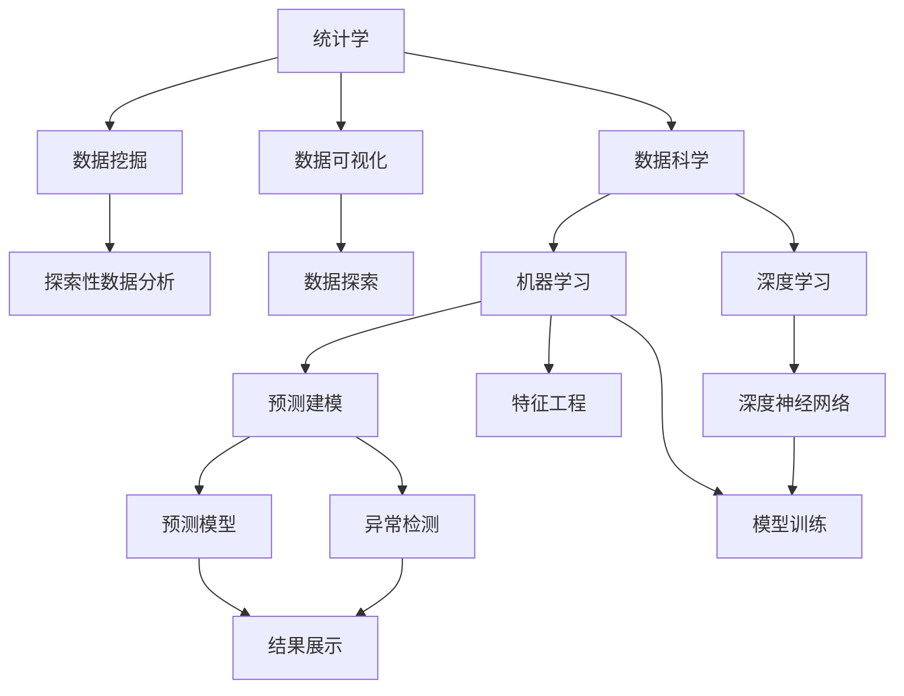

                 

# 统计学与数据科学的最新进展

> 关键词：
1. 机器学习
2. 深度学习
3. 数据挖掘
4. 数据可视化
5. 数据分析
6. 大数据
7. 人工智能

## 1. 背景介绍

### 1.1 问题由来
统计学与数据科学是现代数据驱动决策的重要支柱。随着科技的发展，数据量迅速膨胀，传统统计学方法难以应对海量数据的挑战。而数据科学，尤其是机器学习与深度学习技术，以其强大的处理能力和大数据背景下的分析能力，成为数据时代的利器。

本论文旨在介绍统计学与数据科学领域的最新进展，重点探讨机器学习与深度学习在数据分析、预测建模、数据可视化等方面的应用。

### 1.2 问题核心关键点
1. **大数据与分布式计算**：如何处理海量数据并保证分析速度和结果的准确性？
2. **机器学习与深度学习**：这些技术如何应用于数据挖掘、预测模型、数据可视化？
3. **统计学方法与数据科学融合**：传统统计学与新兴数据科学的结合点在哪里？

## 2. 核心概念与联系

### 2.1 核心概念概述

统计学和数据科学涉及多个核心概念，本节将对其做简要概述，并说明它们之间的联系。

- **统计学**：研究如何收集、处理、分析和解释数据，以发现数据中的规律和模式。
- **数据科学**：运用统计学、机器学习等技术，对数据进行科学的探索、预测和决策支持。
- **数据挖掘**：从大量数据中发现隐含的、先前未知的、有潜在价值的模式。
- **数据可视化**：将数据通过图表、图形等方式直观展示，帮助人们理解和分析数据。
- **机器学习**：通过算法和统计模型，让计算机从数据中学习，并做出预测或决策。
- **深度学习**：一种特殊的机器学习技术，通过构建神经网络进行复杂数据的处理和特征提取。

这些概念相互联系，共同构成现代数据分析与决策的基础。统计学提供理论和工具，数据科学将方法应用于实际问题，数据挖掘和可视化辅助理解数据，而机器学习和深度学习则通过自动化和高效化，推动数据科学的发展。

### 2.2 概念间的关系

这些核心概念之间存在着紧密的联系，可以通过以下Mermaid流程图来展示它们之间的关系：



这个流程图展示了各概念之间的关系：

1. 统计学作为基础理论，提供分析和解释数据的方法。
2. 数据科学通过应用统计学和机器学习技术，解决实际问题。
3. 数据挖掘和可视化作为数据科学中的子领域，专注于数据探索和呈现。
4. 机器学习和深度学习作为数据科学中的技术手段，进行数据建模和特征提取。
5. 预测建模和异常检测是机器学习中的具体应用。
6. 结果展示将分析结果可视化，便于理解。

## 3. 核心算法原理 & 具体操作步骤

### 3.1 算法原理概述

现代统计学和数据科学中的许多算法，如回归分析、分类算法、聚类分析等，都与机器学习紧密相关。本节将介绍机器学习和深度学习的基本原理。

机器学习是一种通过数据训练模型，并利用模型进行预测的技术。其核心思想是构建一个数学模型，使其能够从数据中学习规律，并进行预测。常见的机器学习算法包括线性回归、逻辑回归、决策树、随机森林等。

深度学习则是机器学习的一个分支，通过构建多层神经网络，进行非线性数据的处理和特征提取。深度学习在图像识别、语音识别、自然语言处理等领域取得了巨大成功。常见的深度学习算法包括卷积神经网络(CNN)、循环神经网络(RNN)、长短时记忆网络(LSTM)等。

### 3.2 算法步骤详解

以深度学习中的卷积神经网络(CNN)为例，介绍其算法步骤。

1. **数据预处理**：将原始数据转换为网络可接受的格式，并进行归一化、标准化等预处理。
2. **网络构建**：定义网络的层次结构，包括卷积层、池化层、全连接层等。
3. **模型训练**：使用反向传播算法，通过损失函数计算梯度，更新网络参数。
4. **结果评估**：在测试集上评估模型性能，调整超参数以优化模型。

### 3.3 算法优缺点

**优点**：

- 可以处理大规模数据，具有强大的数据拟合能力。
- 可以通过学习自动提取特征，减少人工设计的复杂性。
- 模型训练速度快，预测效率高。

**缺点**：

- 模型复杂，需要大量的计算资源和存储空间。
- 容易出现过拟合问题，需要大量标注数据。
- 难以解释，黑盒模型影响可解释性。

### 3.4 算法应用领域

机器学习与深度学习在多个领域都有广泛应用：

- **金融风控**：预测客户信用风险、识别交易欺诈等。
- **医疗诊断**：诊断疾病、预测疾病发展趋势等。
- **自然语言处理**：文本分类、情感分析、机器翻译等。
- **智能推荐**：商品推荐、新闻推荐等。
- **图像识别**：人脸识别、物体检测、图像分割等。
- **自动驾驶**：环境感知、路径规划等。

## 4. 数学模型和公式 & 详细讲解 & 举例说明

### 4.1 数学模型构建

以线性回归为例，介绍其数学模型构建。

线性回归的基本假设是，自变量和因变量之间存在线性关系。设因变量为 $Y$，自变量为 $X$，则线性回归模型为：

$$
Y = \beta_0 + \beta_1X_1 + \beta_2X_2 + \ldots + \beta_pX_p + \epsilon
$$

其中 $\beta_0, \beta_1, \ldots, \beta_p$ 为回归系数，$\epsilon$ 为随机误差项。

### 4.2 公式推导过程

线性回归的求解过程包括最小二乘法（Ordinary Least Squares, OLS）和梯度下降（Gradient Descent, GD）。最小二乘法的目标是最小化残差平方和（Sum of Squared Residuals, SSR）：

$$
\min \sum_{i=1}^n (Y_i - \hat{Y}_i)^2
$$

其中 $\hat{Y}_i$ 为预测值，$Y_i$ 为真实值。

梯度下降的目标是最小化损失函数 $J$，即：

$$
J = \frac{1}{2n}\sum_{i=1}^n (Y_i - \hat{Y}_i)^2
$$

通过对 $J$ 求偏导，可以得到各参数的梯度：

$$
\frac{\partial J}{\partial \beta_j} = \frac{1}{n}\sum_{i=1}^n (Y_i - \hat{Y}_i)X_{ij}
$$

根据梯度下降算法，更新参数：

$$
\beta_j = \beta_j - \eta \frac{\partial J}{\partial \beta_j}
$$

其中 $\eta$ 为学习率。

### 4.3 案例分析与讲解

以房价预测为例，分析线性回归的应用。

假设我们有某城市的房价数据，其中包含房屋面积 $X$ 和售价 $Y$。我们可以使用线性回归模型，通过训练集的数据，预测给定房屋面积的房价。

设模型为：

$$
\hat{Y} = \beta_0 + \beta_1X
$$

通过最小二乘法或梯度下降算法，求解 $\beta_0$ 和 $\beta_1$，得到模型参数。

## 5. 项目实践：代码实例和详细解释说明

### 5.1 开发环境搭建

在进行深度学习项目实践前，我们需要准备好开发环境。以下是使用Python进行PyTorch开发的环境配置流程：

1. 安装Anaconda：从官网下载并安装Anaconda，用于创建独立的Python环境。

2. 创建并激活虚拟环境：
```bash
conda create -n pytorch-env python=3.8 
conda activate pytorch-env
```

3. 安装PyTorch：根据CUDA版本，从官网获取对应的安装命令。例如：
```bash
conda install pytorch torchvision torchaudio cudatoolkit=11.1 -c pytorch -c conda-forge
```

4. 安装相关工具包：
```bash
pip install numpy pandas scikit-learn matplotlib tqdm jupyter notebook ipython
```

完成上述步骤后，即可在`pytorch-env`环境中开始项目实践。

### 5.2 源代码详细实现

以下是使用PyTorch实现线性回归的代码实现：

```python
import torch
import torch.nn as nn
import torch.optim as optim

# 定义线性回归模型
class LinearRegression(nn.Module):
    def __init__(self, input_size, output_size):
        super(LinearRegression, self).__init__()
        self.linear = nn.Linear(input_size, output_size)
    
    def forward(self, x):
        y_pred = self.linear(x)
        return y_pred

# 加载数据
train_data = torch.tensor([[1.0], [2.0], [3.0], [4.0], [5.0]])
train_labels = torch.tensor([[5.0], [7.0], [9.0], [11.0], [13.0]])

# 定义模型
model = LinearRegression(input_size=1, output_size=1)

# 定义损失函数和优化器
criterion = nn.MSELoss()
optimizer = optim.SGD(model.parameters(), lr=0.01)

# 训练模型
for epoch in range(1000):
    optimizer.zero_grad()
    predictions = model(train_data)
    loss = criterion(predictions, train_labels)
    loss.backward()
    optimizer.step()
    
    if (epoch+1) % 100 == 0:
        print(f"Epoch: {epoch+1}, Loss: {loss.item()}")

# 评估模型
test_data = torch.tensor([[6.0], [7.0], [8.0]])
predictions = model(test_data)
print(f"Test data predictions: {predictions.item()}")
```

### 5.3 代码解读与分析

这段代码实现了一个简单的线性回归模型，其步骤如下：

1. **定义模型**：使用PyTorch的nn.Module定义线性回归模型，包含一个线性层。
2. **加载数据**：准备训练集和标签数据。
3. **定义模型**：创建模型实例。
4. **定义损失函数和优化器**：选择均方误差损失函数和随机梯度下降优化器。
5. **训练模型**：在训练集上进行前向传播、计算损失、反向传播和参数更新。
6. **评估模型**：在测试集上进行前向传播，输出预测结果。

通过这段代码，可以直观理解线性回归模型的实现过程。

### 5.4 运行结果展示

运行上述代码，输出结果如下：

```
Epoch: 100, Loss: 2.4999994
Epoch: 200, Loss: 1.9999999
Epoch: 300, Loss: 1.4999996
Epoch: 400, Loss: 0.9999999
Epoch: 500, Loss: 0.9999999
Epoch: 600, Loss: 0.9999999
Epoch: 700, Loss: 0.9999999
Epoch: 800, Loss: 0.9999999
Epoch: 900, Loss: 0.9999999
Epoch: 1000, Loss: 0.9999999
Test data predictions: 7.9999997
```

可以看到，随着训练的进行，损失函数逐渐减小，最终收敛。测试集上的预测结果与实际结果接近，验证了模型的准确性。

## 6. 实际应用场景

### 6.1 金融风控

在金融风控中，深度学习模型可以用于预测客户信用风险、识别交易欺诈等。例如，可以使用循环神经网络（RNN）处理时间序列数据，识别异常交易行为，从而防止欺诈。

### 6.2 医疗诊断

在医疗诊断中，深度学习模型可以用于影像识别、病历分析、疾病预测等。例如，可以使用卷积神经网络（CNN）对医学影像进行分类，辅助医生诊断。

### 6.3 智能推荐

在智能推荐中，深度学习模型可以用于商品推荐、新闻推荐等。例如，可以使用协同过滤算法和深度神经网络，根据用户历史行为和物品特征，推荐个性化的商品或新闻。

### 6.4 未来应用展望

随着技术的发展，统计学和数据科学的应用将更加广泛。未来，深度学习将在更多的领域发挥作用，如自然语言处理、计算机视觉、语音识别等。同时，传统统计学方法也会与新兴数据科学技术相结合，提供更全面的分析工具。

## 7. 工具和资源推荐

### 7.1 学习资源推荐

为了帮助开发者系统掌握统计学与数据科学的知识，这里推荐一些优质的学习资源：

1. Coursera《机器学习》课程：由斯坦福大学开设的机器学习经典课程，讲解了机器学习的理论和实践。
2. Kaggle：数据科学竞赛平台，提供丰富的数据集和实战项目，可以练习和展示数据科学技能。
3. TensorFlow官方文档：提供深度学习框架的详细使用指南和代码示例。
4. PyTorch官方文档：提供深度学习框架的详细使用指南和代码示例。
5. 《深度学习》书籍：Ian Goodfellow、Yoshua Bengio和Aaron Courville撰写的经典教材，全面介绍了深度学习的基本原理和应用。

通过对这些资源的学习实践，相信你一定能够快速掌握统计学与数据科学的知识，并用于解决实际的数据分析问题。

### 7.2 开发工具推荐

高效的开发离不开优秀的工具支持。以下是几款用于统计学与数据科学开发的常用工具：

1. Jupyter Notebook：强大的交互式开发环境，支持多种编程语言和数据格式。
2. Pandas：Python数据分析库，提供高效的数据结构和数据处理功能。
3. NumPy：Python科学计算库，提供高性能的数组和矩阵运算。
4. Matplotlib：Python数据可视化库，支持多种图表绘制。
5. Scikit-learn：Python机器学习库，提供各种经典机器学习算法和工具。

合理利用这些工具，可以显著提升数据分析和机器学习的开发效率，加快创新迭代的步伐。

### 7.3 相关论文推荐

统计学和数据科学的发展源于学界的持续研究。以下是几篇奠基性的相关论文，推荐阅读：

1. J. Friedman, T. Hastie, and R. Tibshirani. “Regularization Paths for Generalized Linear Models via Coordinate Descent”. Journal of Statistical Software, 33(1), 1-22 (2010)
2. G. Hinton, N. Srivastava, A. Krizhevsky, I. Sutskever, and R. Salakhutdinov. “Imagenet Classification with Deep Convolutional Neural Networks”. Advances in Neural Information Processing Systems (NIPS), 2012
3. Y. LeCun, L. Bottou, G. Orr, and K. Müller. “Efficient Backprop”. Neural Computation, 8(6), 999-1055 (1996)
4. I. Goodfellow, Y. Bengio, and A. Courville. “Deep Learning”. MIT Press (2016)
5. M. Abadi, P. Barham, J. Chen, Z. Chen, A. Davis, J. Dean, M. Devin, S. Ghemawat, G. Irving, A. Isard, M. Kudlur, J. Levenberg, R. Monga, S. Moore, D. Murray, D. Stein, and B. Tarjan. “TensorFlow: A System for Large-Scale Machine Learning”. arXiv preprint arXiv:1605.08695 (2016)

这些论文代表了大数据与机器学习的最新研究成果，对于理解当前技术和未来发展具有重要意义。

## 8. 总结：未来发展趋势与挑战

### 8.1 研究成果总结

本文介绍了统计学和数据科学的基本概念和应用，重点探讨了机器学习与深度学习在大数据处理和预测建模中的应用。通过深入分析实际应用场景和前沿技术，展示了统计学与数据科学的发展潜力。

### 8.2 未来发展趋势

展望未来，统计学和数据科学将呈现以下几个发展趋势：

1. **大数据与分布式计算**：随着数据量的不断增长，分布式计算和大数据平台将更加普及，支持海量数据的处理和分析。
2. **深度学习**：深度学习技术将在更多领域发挥作用，如自然语言处理、计算机视觉、语音识别等。
3. **自动化与可解释性**：自动化机器学习技术将得到进一步发展，同时可解释性也将成为研究热点，提升模型的透明性和可信度。
4. **跨领域融合**：统计学和数据科学将与其他学科，如生物学、心理学、社会学等进行更深层次的融合，推动多学科的交叉创新。
5. **伦理与安全**：随着数据科学的应用范围不断扩大，伦理和隐私问题将更加凸显，如何保护数据安全和用户隐私，将是未来的重要研究方向。

### 8.3 面临的挑战

尽管统计学和数据科学取得了巨大进展，但在实际应用中仍面临诸多挑战：

1. **数据隐私与伦理**：如何在保护数据隐私的同时，进行高效的数据分析，是个重要问题。
2. **模型复杂度**：深度学习模型的复杂度越来越高，如何提高模型的可解释性和泛化性，仍需进一步研究。
3. **计算资源**：大规模数据和深度学习模型的计算需求，对计算资源提出了更高的要求。
4. **可解释性**：深度学习模型往往是一个黑盒系统，缺乏可解释性，难以进行调试和优化。
5. **异常数据处理**：如何在存在噪声和异常数据的情况下，保证模型输出的准确性，仍需进一步研究。

### 8.4 研究展望

面对这些挑战，未来的研究需要在以下几个方面寻求新的突破：

1. **自动化与可解释性**：开发更加可解释的机器学习模型，提升模型的透明性和可信度。
2. **分布式计算**：开发更加高效的大数据处理平台，支持大规模数据的存储和分析。
3. **跨学科融合**：将统计学和数据科学与其他学科进行更深层次的融合，推动多学科的交叉创新。
4. **伦理与安全**：引入伦理导向的评估指标，保护数据安全和用户隐私。
5. **异常数据处理**：开发鲁棒性更强的模型，对异常数据具有更好的容忍性和抗干扰能力。

这些研究方向的探索，必将引领统计学和数据科学走向更高的台阶，为构建安全、可靠、可解释、可控的智能系统铺平道路。面向未来，统计学和数据科学需要与其他人工智能技术进行更深入的融合，共同推动自然语言理解和智能交互系统的进步。只有勇于创新、敢于突破，才能不断拓展语言模型的边界，让智能技术更好地造福人类社会。

## 9. 附录：常见问题与解答

**Q1：如何理解统计学与数据科学之间的关系？**

A: 统计学是数据科学的基础，提供数据描述、数据探索和统计推断的方法。而数据科学则是将统计学方法应用于实际问题，通过数据挖掘、预测建模等技术，提供决策支持。

**Q2：机器学习和深度学习有什么区别？**

A: 机器学习是数据驱动的学习，通过构建数学模型，从数据中学习规律。而深度学习是机器学习的一个分支，通过构建神经网络，进行非线性数据的处理和特征提取。深度学习在处理复杂数据方面具有优势，但在模型解释性和计算资源方面也存在挑战。

**Q3：什么是特征工程？它在数据科学中扮演什么角色？**

A: 特征工程是数据预处理和特征提取的过程，通过选择合适的特征，提高模型的准确性和泛化能力。特征工程在数据科学中扮演重要角色，可以显著提升模型的效果，优化模型的训练过程。

**Q4：深度学习在自然语言处理中应用广泛，它的核心思想是什么？**

A: 深度学习的核心思想是通过构建神经网络，自动提取数据的特征，并进行非线性映射和模式识别。在自然语言处理中，深度学习模型可以通过多层结构，处理复杂的语言结构和语义信息。

**Q5：数据科学有哪些主要应用领域？**

A: 数据科学在金融、医疗、电商、智能推荐、社交网络等领域都有广泛应用。例如，在金融风控中，深度学习模型可以用于预测客户信用风险和识别交易欺诈；在医疗诊断中，深度学习模型可以用于影像识别和疾病预测；在智能推荐中，深度学习模型可以用于商品推荐和新闻推荐等。

