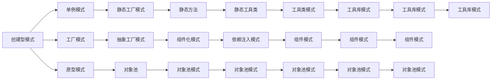

                 

# 综合设计模式的应用案例：反思、工具使用与规划

> 关键词：设计模式、软件开发、技术栈、架构设计、工具使用

## 1. 背景介绍

### 1.1 问题由来
在软件开发的漫长历程中，无数的开发人员和架构师逐渐认识到设计模式的重要性。它们不仅帮助解决各种常见的编程问题，还提高了代码的可重用性、可扩展性和可维护性。然而，随着技术的快速发展，设计模式的应用也面临新的挑战和机遇。本文将结合实际项目，全面梳理设计模式的应用场景、工具使用和未来规划，希望能为读者提供更多关于设计模式的实践见解。

### 1.2 问题核心关键点
1. **设计模式的种类与使用场景**：设计模式分为创建型、结构型和行为型，各自解决不同的问题。创建型模式关注对象的创建方式，结构型模式关注类和对象的组织结构，行为型模式关注对象之间的交互。
2. **工具的集成与应用**：现代IDE和设计模式库提供了丰富的辅助工具，帮助开发者快速应用设计模式。例如，Maven、Spring等框架提供了对设计模式的集成支持。
3. **未来发展趋势与挑战**：随着微服务架构和组件化开发成为主流，设计模式的应用也会不断演进，同时需要应对代码复用、组件协作等方面的新挑战。

### 1.3 问题研究意义
设计模式是软件开发的基石之一，掌握它们可以帮助开发者更加高效地解决问题，提升代码质量。通过系统性地应用设计模式，可以提高团队的软件开发效率，促进软件的可维护性和可扩展性。本文旨在帮助读者深入理解设计模式的内涵和应用，推动其在实际项目中的应用实践。

## 2. 核心概念与联系

### 2.1 核心概念概述

设计模式（Design Patterns）是软件设计中解决常见问题的模板化解决方案。Gang of Four 的经典著作《Design Patterns》中，列举了23种常用的设计模式，涵盖了创建型、结构型和行为型三大类。这些模式通过描述特定的设计问题及其解决方案，帮助开发者在面对复杂问题时快速找到有效的解决方案。

- **创建型模式**：关注对象的创建方式，减少对象的创建开销，提供创建对象的灵活方式。
- **结构型模式**：关注类和对象的组织结构，将类或对象组合成更大的结构，以实现代码复用。
- **行为型模式**：关注对象之间的交互和通信，解决对象间的松耦合问题，提高系统的灵活性。

### 2.2 概念间的关系

设计模式之间的联系可以通过以下Mermaid流程图来展示：



这个流程图展示了设计模式之间的层次关系：

1. 创建型模式是解决对象创建相关问题的模板。
2. 结构型模式通过组合和继承解决类和对象的组织问题。
3. 行为型模式关注对象间的交互和通信，实现松耦合。
4. 每个模式通过子模式进一步细化，如单例模式、工厂模式、抽象工厂模式等。

## 3. 核心算法原理 & 具体操作步骤
### 3.1 算法原理概述

设计模式的原理主要包括两部分：模式问题和解决方案。每个设计模式描述了一个特定的设计问题，并给出了一个通用的解决方案。设计模式的解决方式通常包含以下几个步骤：

1. **问题描述**：明确问题是什么，包括问题出现的场景、问题的原因等。
2. **解决方案**：提供解决问题的具体步骤，包括所需的类、接口和算法。
3. **效果分析**：分析解决方案的效果，包括性能、可维护性、可扩展性等方面。

### 3.2 算法步骤详解

以单例模式（Singleton Pattern）为例，展示设计模式的具体操作步骤：

1. **问题描述**：在某些场景下，需要保证一个类只有一个实例，并提供全局访问点。例如，配置文件、日志系统等。
2. **解决方案**：使用一个静态变量保存实例，并在构造函数中检查是否已经有实例，如果有则不创建新的实例。
3. **效果分析**：单例模式可以保证只有一个实例，提高系统的可维护性和可扩展性，但同时也可能导致单点故障和难以测试的问题。

### 3.3 算法优缺点

设计模式在解决特定问题时具有明显的优点：

- **重用性高**：设计模式提供了解决特定问题的模板，可以重复使用，提高代码的复用性。
- **结构清晰**：设计模式通过抽象和封装，使得代码结构更加清晰，易于维护。
- **可扩展性强**：设计模式提供了一个框架，使得在原有基础上添加新的功能更加容易。

但同时，设计模式也存在一些缺点：

- **过度使用**：过度使用设计模式可能导致代码过于复杂，难以理解和维护。
- **适用性有限**：设计模式并不能解决所有问题，需要根据具体场景选择合适的模式。
- **学习曲线陡**：设计模式种类繁多，掌握它们需要时间和实践经验。

### 3.4 算法应用领域

设计模式在软件开发中广泛应用，主要包括以下几个领域：

- **Web应用**：例如MVC模式、工厂模式等，帮助构建高效、可维护的Web应用。
- **移动应用**：例如单例模式、代理模式等，提升应用的性能和可维护性。
- **桌面应用**：例如策略模式、观察者模式等，增强应用的灵活性和交互性。
- **企业级应用**：例如命令模式、策略模式等，帮助构建复杂系统的解耦合架构。

## 4. 数学模型和公式 & 详细讲解 & 举例说明

### 4.1 数学模型构建

设计模式的数学模型可以通过图论来建模。以单例模式为例，其图模型可以表示为：

```
Singleton:
    +----------------+       +--------------+
    |  +------------+  ---->  |  +------------+
    |  |  Instance  |      |  |  Instance  |
    |  |            |      |  |            |
    |  |            |      |  |            |
    |  |            |      |  |            |
    |  +------------+      |  +--------------+
                                       +--------+
                                                 +--------------+
                                             SingletonFactory
```

其中，`Singleton`表示单例对象，`SingletonFactory`表示创建单例对象的工厂。

### 4.2 公式推导过程

在单例模式中，使用一个静态变量`instance`保存单例实例，其公式可以表示为：

$$
\text{Instance} = \text{SingletonFactory}.create()
$$

其中，`create`方法内部通过检查`instance`是否为空，决定是否创建新的实例。如果`instance`不为空，则直接返回已有实例；否则，创建一个新的实例并返回。

### 4.3 案例分析与讲解

以Java中的线程池为例，展示如何使用工厂模式实现线程池的创建和管理：

```java
public class ThreadPool {
    private final int corePoolSize;
    private final int maximumPoolSize;
    private final long keepAliveTime;
    private final BlockingQueue<Runnable> workQueue;
    private final ThreadFactory threadFactory;
    private final RejectedExecutionHandler handler;

    public ThreadPool(int corePoolSize, int maximumPoolSize, long keepAliveTime, BlockingQueue<Runnable> workQueue, ThreadFactory threadFactory, RejectedExecutionHandler handler) {
        this.corePoolSize = corePoolSize;
        this.maximumPoolSize = maximumPoolSize;
        this.keepAliveTime = keepAliveTime;
        this.workQueue = workQueue;
        this.threadFactory = threadFactory;
        this.handler = handler;
    }

    public ExecutorService newThreadPool() {
        return new ThreadPoolExecutor(corePoolSize, maximumPoolSize, keepAliveTime, TimeUnit.MILLISECONDS, workQueue, threadFactory, handler);
    }
}
```

在上述代码中，`ThreadPool`类定义了线程池的基本参数，并通过`newThreadPool`方法创建线程池。这里使用了工厂模式，将线程池的创建和管理封装在一个工厂类中，提高了代码的可维护性和可扩展性。

## 5. 项目实践：代码实例和详细解释说明

### 5.1 开发环境搭建

在进行设计模式实践前，我们需要准备好开发环境。以下是使用Java进行Spring框架开发的环境配置流程：

1. 安装JDK：从官网下载并安装Java Development Kit。
2. 安装Maven：从官网下载并安装Maven。
3. 创建并激活虚拟环境：
```bash
conda create -n spring-env python=3.8
conda activate spring-env
```

4. 安装Spring Boot：使用Maven或Gradle引入Spring Boot依赖。
5. 创建Spring Boot项目：使用Spring Initializr或Maven项目模板创建项目。

完成上述步骤后，即可在`spring-env`环境中开始设计模式的实践。

### 5.2 源代码详细实现

下面我们以Spring中的Bean Scope为例，展示如何在Spring中应用单例模式：

```java
@Bean
public MyBean getMyBean() {
    return new MyBean();
}
```

在上述代码中，`MyBean`类通过`@Bean`注解被定义为一个单例Bean。在Spring容器中，这个Bean将被自动管理，保证在整个应用生命周期中只有一个实例。

### 5.3 代码解读与分析

让我们再详细解读一下关键代码的实现细节：

**MyBean类**：
- `MyBean`类是Spring Bean，定义了单例对象的属性和方法。
- 通过`@Bean`注解，Spring将自动创建和管理`MyBean`实例。

**getMyBean方法**：
- `getMyBean`方法返回一个`MyBean`实例，通过`@Bean`注解，Spring将其注册为单例Bean。
- 当Spring容器初始化时，该Bean的创建过程被管理，保证了实例的唯一性。

**Spring容器**：
- Spring容器管理所有Bean的创建、配置和生命周期。
- 通过Bean Scope注解，可以控制Bean的生命周期和作用域。

在Spring中应用设计模式，可以借助框架提供的便利功能和注解，大大简化开发过程。通过系统化的管理，可以保证Bean实例的唯一性和生命周期的一致性。

### 5.4 运行结果展示

假设在Spring容器中定义了两个相同的Bean，可以通过注解来验证其唯一性：

```java
@Component
public class MyBean {
    private static final Logger logger = LoggerFactory.getLogger(MyBean.class);
    private int count = 0;

    public void increment() {
        count++;
        logger.info("count = " + count);
    }
}

@SpringBootApplication
public class MyApplication {
    public static void main(String[] args) {
        SpringApplication.run(MyApplication.class);
    }

    @Bean
    public MyBean myBean1() {
        return new MyBean();
    }

    @Bean
    public MyBean myBean2() {
        return new MyBean();
    }
}
```

在上述代码中，`MyBean`类被定义为一个单例Bean。当应用启动时，可以通过Spring容器自动创建和管理Bean实例，并通过日志输出验证其唯一性。

## 6. 实际应用场景

### 6.1 企业级应用

在企业级应用中，设计模式经常被用来构建复杂系统的解耦合架构。例如，命令模式（Command Pattern）可以用于实现撤销操作、日志记录等功能。策略模式（Strategy Pattern）可以用于实现算法的灵活切换，例如多语言支持、支付策略等。

### 6.2 桌面应用

在桌面应用中，观察者模式（Observer Pattern）可以用于实现事件驱动的架构，例如UI更新、数据同步等功能。适配器模式（Adapter Pattern）可以用于实现不同接口的兼容性，例如数据库驱动的统一接口、第三方API的封装等。

### 6.3 Web应用

在Web应用中，MVC模式（Model-View-Controller Pattern）是最常见的设计模式之一，用于实现Web应用的解耦合架构。工厂模式（Factory Pattern）可以用于创建和管理Web应用的组件，例如Spring MVC中的控制器、视图等。

## 7. 工具和资源推荐

### 7.1 学习资源推荐

为了帮助开发者系统掌握设计模式的应用实践，这里推荐一些优质的学习资源：

1. 《Head First Design Patterns》书籍：以图形化的方式讲解设计模式的原理和应用，适合初学者入门。
2. 《Design Patterns: Elements of Reusable Object-Oriented Software》书籍：Gang of Four的经典著作，详细介绍了23种设计模式的实现和应用。
3. Coursera上的《Object-Oriented Design Patterns》课程：由斯坦福大学教授主讲，讲解了多种设计模式的原理和应用场景。
4. Pluralsight上的《Design Patterns in Java》课程：讲解了多种设计模式在Java中的应用，适合有一定Java基础的开发者学习。
5. GitHub上的《Design Patterns Cheat Sheet》：提供了多种设计模式的简洁总结，方便开发者快速查阅。

通过这些资源的学习实践，相信你一定能够快速掌握设计模式的内涵和应用，并用于解决实际的开发问题。

### 7.2 开发工具推荐

高效的开发离不开优秀的工具支持。以下是几款用于设计模式开发常用的工具：

1. IntelliJ IDEA：一款功能强大的Java IDE，提供了丰富的设计模式支持和代码智能提示。
2. Eclipse：一款流行的Java IDE，提供了丰富的插件和工具，支持多种设计模式的应用。
3. Visual Studio Code：一款轻量级的编辑器，支持多种语言和框架，适合快速开发。
4. ReSharper：一款JetBrains的插件，提供了丰富的设计模式支持和代码智能提示。
5. SonarQube：一款代码质量管理工具，可以帮助检测和改进设计模式的代码质量。

合理利用这些工具，可以显著提升设计模式的开发效率，加快创新迭代的步伐。

### 7.3 相关论文推荐

设计模式的发展源于学界的持续研究。以下是几篇奠基性的相关论文，推荐阅读：

1. "Design Patterns: Elements of Reusable Object-Oriented Software"：Gang of Four的经典著作，详细介绍了23种设计模式的实现和应用。
2. "Refactoring: Improving the Design of Existing Code"：Martin Fowler的经典著作，讲解了如何通过重构来优化代码设计和应用。
3. "Head First Design Patterns"：Erich Gamma的经典著作，以图形化的方式讲解了多种设计模式的原理和应用。
4. "Design Patterns in Java"：Craig Walls的经典著作，讲解了多种设计模式在Java中的应用，适合有一定Java基础的开发者学习。
5. "Evolving Software: Practical Object-Oriented Design and Patterns"：Martin Fowler的经典著作，讲解了软件演进和设计模式的应用。

这些论文代表了大设计模式的发展脉络。通过学习这些前沿成果，可以帮助研究者把握学科前进方向，激发更多的创新灵感。

除上述资源外，还有一些值得关注的前沿资源，帮助开发者紧跟设计模式技术的最新进展，例如：

1. arXiv论文预印本：人工智能领域最新研究成果的发布平台，包括大量尚未发表的前沿工作，学习前沿技术的必读资源。
2. 业界技术博客：如Gang of Four、Martin Fowler、Craig Walls等顶尖专家团队的官方博客，第一时间分享他们的最新研究成果和洞见。
3. 技术会议直播：如ICSE、EuroSys、IEEE TDOC等顶尖会议现场或在线直播，能够聆听到大佬们的前沿分享，开拓视野。
4. GitHub热门项目：在GitHub上Star、Fork数最多的设计模式相关项目，往往代表了该技术领域的发展趋势和最佳实践，值得去学习和贡献。
5. 行业分析报告：各大咨询公司如McKinsey、PwC等针对软件设计模式的分析报告，有助于从商业视角审视技术趋势，把握应用价值。

总之，对于设计模式的学习和实践，需要开发者保持开放的心态和持续学习的意愿。多关注前沿资讯，多动手实践，多思考总结，必将收获满满的成长收益。

## 8. 总结：未来发展趋势与挑战

### 8.1 研究成果总结

设计模式作为软件开发的基石之一，在过去几十年中得到了广泛应用和深入研究。其成功经验和方法论，为软件开发提供了重要的参考和指导。通过系统的应用设计模式，可以显著提升代码的可重用性、可维护性和可扩展性，促进软件开发的效率和质量。

### 8.2 未来发展趋势

展望未来，设计模式的应用将呈现以下几个趋势：

1. **组件化、模块化**：随着微服务架构和组件化开发的兴起，设计模式的应用将更加注重组件的解耦合和模块化设计。例如，命令模式、适配器模式等将在微服务架构中得到广泛应用。
2. **面向对象与函数式编程的融合**：设计模式将更多地与函数式编程、响应式编程等新型编程范式结合，提升系统的灵活性和可扩展性。例如，策略模式、观察者模式等将与函数式编程结合，实现更高效的事件驱动和数据处理。
3. **持续集成与持续交付**：设计模式将更多地与持续集成（CI）和持续交付（CD）流程结合，实现更快速、更可靠的软件交付。例如，工厂模式、单例模式等将与CI/CD工具结合，实现更高效的软件部署和迭代。

### 8.3 面临的挑战

尽管设计模式在软件开发中发挥了重要作用，但在应用过程中也面临诸多挑战：

1. **理解与应用门槛**：设计模式种类繁多，掌握它们需要时间和实践经验，初学者可能面临较大的理解门槛。
2. **过时问题**：随着技术的快速变化，一些设计模式可能会变得过时或不适用，开发者需要不断学习和更新。
3. **代码复杂度**：过度使用设计模式可能导致代码过于复杂，难以理解和维护。
4. **适用性有限**：设计模式并不能解决所有问题，需要根据具体场景选择合适的模式。
5. **学习曲线陡**：设计模式的学习曲线较陡，需要系统化的学习和实践才能掌握。

### 8.4 研究展望

未来，设计模式的研究方向可以从以下几个方面进行探索：

1. **新设计模式的提出**：随着技术的进步和新应用场景的出现，需要不断探索新的设计模式，以应对新的设计问题。
2. **设计模式的演变与优化**：对于已有设计模式，需要进行持续的演变和优化，以适应新的应用场景和技术栈。
3. **设计模式的结合与融合**：探索不同设计模式之间的结合与融合，提升系统的灵活性和可扩展性。
4. **设计模式与新兴技术的结合**：探索设计模式与新兴技术（如区块链、人工智能等）的结合，推动技术融合与创新。

这些研究方向将有助于设计模式在未来的软件开发中继续发挥重要作用，推动技术的进步和应用的创新。

## 9. 附录：常见问题与解答

**Q1：设计模式是否适用于所有项目？**

A: 设计模式并不是万能的，需要根据具体项目的规模、复杂度和特点选择合适的模式。对于小型项目，设计模式的引入可能增加不必要的复杂性；对于大型、复杂项目，设计模式可以提高代码的可维护性和可扩展性。

**Q2：如何选择合适的设计模式？**

A: 选择合适的设计模式需要综合考虑项目的需求、规模、复杂度、技术栈等因素。通常需要根据具体问题场景，选择最合适的设计模式。可以参考Design Patterns Cheat Sheet等工具，快速查找和选择适合的模式。

**Q3：如何避免设计模式的过度使用？**

A: 避免设计模式的过度使用需要注意以下几点：
1. 选择合适的设计模式，避免滥用。
2. 考虑模式的适用性，避免生搬硬套。
3. 进行系统的设计评审，评估设计模式的合理性。
4. 定期重构代码，避免模式退化。

**Q4：设计模式是否影响代码的性能？**

A: 设计模式通常不会对代码性能产生显著影响，因为它们主要关注代码的可维护性和可扩展性。但是，有些模式如适配器模式、装饰者模式等，可能会增加一些性能开销，需要在具体应用中进行评估和优化。

**Q5：设计模式是否适用于新的编程语言和技术栈？**

A: 设计模式是通用的设计思想，适用于多种编程语言和技术栈。但是，某些特定的设计模式可能需要根据具体的语言特性和技术栈进行微调和优化。

这些问答解答旨在帮助开发者更好地理解设计模式的应用实践，并指导其在实际项目中的应用。通过系统的应用设计模式，可以显著提升代码的可重用性、可维护性和可扩展性，促进软件开发的效率和质量。

---

作者：禅与计算机程序设计艺术 / Zen and the Art of Computer Programming

